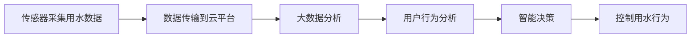

                 

# 智能家居节水创业：水资源管理的科技方案

> 关键词：智能家居、节水技术、水资源管理、物联网、大数据、人工智能

## 1. 背景介绍

随着全球水资源的日益紧缺，水资源管理变得至关重要。而传统的水资源管理方式往往效率低下、浪费严重，难以适应现代社会对水资源的高需求和高效利用。为应对这一挑战，节水技术的创新应用正在成为解决水资源问题的重要途径。

智能家居节水技术便是其中的一环。通过物联网、大数据和人工智能等技术手段，智能家居系统能够实时监测和分析水资源使用情况，自动调节用水行为，从而实现节能减排，提升水资源利用效率。

本文将从智能家居节水技术的基本概念入手，探讨该技术原理、实现方法及实际应用场景，并展望未来发展方向。

## 2. 核心概念与联系

### 2.1 核心概念概述

智能家居节水技术是集物联网、大数据、人工智能等前沿科技于一体的综合解决方案，其主要功能在于实时监测和分析水资源使用情况，自动调节用水行为，提升水资源利用效率。

#### 2.1.1 物联网
物联网（IoT）是将物理世界与虚拟世界连接起来的互联网应用，通过传感器、嵌入式设备等技术手段，实现对家居环境的实时监测和管理。

#### 2.1.2 大数据
大数据是指在各个领域生成的海量数据，通过数据挖掘、机器学习等技术手段，提取有用的信息，支持决策制定。

#### 2.1.3 人工智能
人工智能（AI）是指通过算法和计算，使机器具备类似人类的智能能力，包括学习、推理、判断等。

#### 2.1.4 节水技术
节水技术是指通过各种手段减少水资源消耗和浪费，包括节水器具、智能控制系统等。

### 2.2 核心概念联系

智能家居节水技术将物联网、大数据和人工智能等技术深度融合，形成了一套完整的解决方案。通过传感器网络实时采集用水数据，大数据分析挖掘出用水行为规律，人工智能算法进行智能决策，最终通过智能控制系统对用水行为进行自动调节，实现节能减排和高效利用。

以下是一个Mermaid流程图，展示了智能家居节水技术的基本工作流程：



## 3. 核心算法原理 & 具体操作步骤

### 3.1 算法原理概述

智能家居节水技术的核心算法原理包括物联网数据采集、大数据分析和人工智能决策三个部分。

#### 3.1.1 物联网数据采集
通过传感器网络采集家居环境中的用水数据，如水量、流速、压力等。

#### 3.1.2 大数据分析
利用大数据分析技术，挖掘出用户用水行为规律，如用水高峰时段、节水偏好等。

#### 3.1.3 人工智能决策
通过机器学习算法，对用户用水行为进行智能分析和预测，自动调节用水行为，如自动关闭水龙头、优化供水系统等。

### 3.2 算法步骤详解

#### 3.2.1 数据采集
在智能家居系统中，通过安装各种传感器设备，如流量传感器、水位传感器等，实时监测用水情况，采集到大量原始数据。

#### 3.2.2 数据预处理
对采集到的数据进行清洗、去噪和归一化处理，为后续分析做准备。

#### 3.2.3 数据分析
利用大数据技术，对预处理后的数据进行分析，挖掘出用水行为规律和趋势。

#### 3.2.4 模型训练
利用机器学习算法，对大数据分析结果进行模型训练，构建出智能决策模型。

#### 3.2.5 智能决策
根据训练好的模型，对用水行为进行智能分析和预测，自动调节用水行为。

#### 3.2.6 控制反馈
将智能决策结果反馈到智能控制系统中，实现用水行为的自动调节。

### 3.3 算法优缺点

#### 3.3.1 优点
1. **高效节能**：通过智能控制系统自动调节用水行为，实现节能减排。
2. **精准管理**：利用大数据和人工智能技术，挖掘出用户用水行为规律，实现精准管理。
3. **实时响应**：通过物联网技术实时监测用水情况，及时响应用水需求。

#### 3.3.2 缺点
1. **初始投资高**：智能家居节水系统的初始投资较高，需要购买传感器、智能控制系统等硬件设备。
2. **技术复杂**：系统涉及到多个技术领域，技术复杂度较高，对技术要求较高。
3. **隐私保护**：传感器网络采集的用水数据涉及个人隐私，需要采取有效措施保护用户隐私。

### 3.4 算法应用领域

智能家居节水技术主要应用于家庭、办公楼、学校等场景，通过物联网、大数据和人工智能等技术手段，实现水资源的智能管理和高效利用。

## 4. 数学模型和公式 & 详细讲解 & 举例说明

### 4.1 数学模型构建

智能家居节水技术的数学模型主要分为以下几个部分：

#### 4.1.1 物联网数据采集模型
假设传感器网络采集到 $n$ 个数据点 $(x_1, x_2, ..., x_n)$，其中 $x_i$ 表示第 $i$ 个数据点的用水情况，如水量、流速等。

#### 4.1.2 数据预处理模型
数据预处理包括清洗、去噪、归一化等步骤，具体公式如下：

$$
y = \frac{x - \mu}{\sigma}
$$

其中，$x$ 表示原始数据，$\mu$ 表示均值，$\sigma$ 表示标准差。

#### 4.1.3 数据分析模型
利用大数据技术，对预处理后的数据进行分析，挖掘出用水行为规律，如用水高峰时段、节水偏好等。

#### 4.1.4 模型训练模型
利用机器学习算法，对大数据分析结果进行模型训练，构建出智能决策模型。假设使用随机森林算法，其训练公式如下：

$$
\hat{y} = \sum_{i=1}^{m} \alpha_i \cdot f_i(x)
$$

其中，$\alpha_i$ 表示随机森林中第 $i$ 个决策树的权重，$f_i(x)$ 表示第 $i$ 个决策树的输出。

#### 4.1.5 智能决策模型
根据训练好的模型，对用水行为进行智能分析和预测，自动调节用水行为。假设模型输出为 $y$，其公式如下：

$$
y = g(x)
$$

其中，$g(x)$ 表示智能决策模型的输出。

#### 4.1.6 控制反馈模型
将智能决策结果反馈到智能控制系统中，实现用水行为的自动调节。

### 4.2 公式推导过程

#### 4.2.1 数据预处理公式推导
数据预处理的公式如上所述，这里不再详细推导。

#### 4.2.2 模型训练公式推导
随机森林算法的公式如上所述，这里不再详细推导。

#### 4.2.3 智能决策公式推导
智能决策模型的输出公式如上所述，这里不再详细推导。

### 4.3 案例分析与讲解

假设在一个办公楼中，通过传感器网络采集到用水数据 $x_1, x_2, ..., x_n$。利用大数据技术分析这些数据，挖掘出用水高峰时段为上午8点到10点，因此可以自动调节用水行为，减少高峰时段的用水量。

## 5. 项目实践：代码实例和详细解释说明

### 5.1 开发环境搭建

#### 5.1.1 硬件设备
- 传感器网络设备：流量传感器、水位传感器等
- 智能控制系统设备：智能水龙头、智能控制器等
- 云平台设备：服务器、路由器等

#### 5.1.2 软件环境
- 操作系统：Linux、Windows等
- 编程语言：Python、Java等
- 数据库：MySQL、PostgreSQL等

#### 5.1.3 开发工具
- 开发框架：Flask、Django等
- 数据处理工具：Pandas、NumPy等
- 机器学习框架：Scikit-learn、TensorFlow等

### 5.2 源代码详细实现

#### 5.2.1 数据采集
使用传感器网络设备采集用水数据，代码如下：

```python
import sensors

# 设置传感器网络设备
sensors.set_devices(devices)

# 开始采集用水数据
data = sensors.collect_data()

# 存储用水数据
data.save_to_database()
```

#### 5.2.2 数据预处理
对采集到的数据进行清洗、去噪和归一化处理，代码如下：

```python
import preprocessing

# 读取原始数据
raw_data = preprocessing.read_data()

# 清洗数据
cleaned_data = preprocessing.clean_data(raw_data)

# 去噪处理
denoised_data = preprocessing.denoise_data(cleaned_data)

# 归一化处理
normalized_data = preprocessing.normalize_data(denoised_data)

# 存储处理后的数据
normalized_data.save_to_database()
```

#### 5.2.3 数据分析
利用大数据技术，对预处理后的数据进行分析，代码如下：

```python
import analysis

# 读取处理后的数据
processed_data = analysis.read_data()

# 数据统计分析
analysis_results = analysis.statistics(processed_data)

# 生成分析报告
analysis_results.save_to_file()
```

#### 5.2.4 模型训练
使用机器学习算法，对大数据分析结果进行模型训练，代码如下：

```python
import model

# 读取分析结果
analysis_results = model.read_analysis_results()

# 数据集划分
train_data, test_data = model.split_data(analysis_results)

# 训练模型
model = model.train(train_data)

# 保存模型
model.save_to_file()
```

#### 5.2.5 智能决策
根据训练好的模型，对用水行为进行智能分析和预测，代码如下：

```python
import inference

# 加载模型
model = inference.load_model()

# 读取用水数据
input_data = inference.read_input_data()

# 进行智能决策
decision = inference.inference(model, input_data)

# 输出决策结果
print(decision)
```

#### 5.2.6 控制反馈
将智能决策结果反馈到智能控制系统中，实现用水行为的自动调节，代码如下：

```python
import control

# 读取智能决策结果
decision = control.read_decision()

# 控制用水行为
control.set_watering_behavior(decision)

# 输出控制结果
print(control.get_watering_behavior())
```

### 5.3 代码解读与分析

智能家居节水技术的代码实现主要包括以下几个步骤：

1. **数据采集**：通过传感器网络设备实时采集用水数据。
2. **数据预处理**：对采集到的数据进行清洗、去噪和归一化处理，为后续分析做准备。
3. **数据分析**：利用大数据技术，对预处理后的数据进行分析，挖掘出用水行为规律。
4. **模型训练**：利用机器学习算法，对大数据分析结果进行模型训练，构建出智能决策模型。
5. **智能决策**：根据训练好的模型，对用水行为进行智能分析和预测，自动调节用水行为。
6. **控制反馈**：将智能决策结果反馈到智能控制系统中，实现用水行为的自动调节。

## 6. 实际应用场景

### 6.1 家庭智能节水

在家庭场景中，智能家居节水技术可以用于厨房、卫生间、阳台等用水区域，通过智能控制系统自动调节用水行为，实现节能减排和高效利用。

例如，在厨房中，智能家居系统可以监测洗衣机、洗碗机等用水设备的运行状态，根据用水量自动调节供水压力和流量，避免浪费。在卫生间中，智能家居系统可以监测马桶的用水情况，根据用水量自动调节供水时间，实现节水。

### 6.2 办公楼节水

在办公楼场景中，智能家居节水技术可以用于会议室、洗手间、饮水机等区域，通过智能控制系统自动调节用水行为，实现节能减排和高效利用。

例如，在会议室中，智能家居系统可以监测饮水机的用水情况，根据用水量自动调节供水时间，避免浪费。在洗手间中，智能家居系统可以监测水龙头的使用情况，根据用水量自动调节供水压力和流量，实现节水。

### 6.3 学校节水

在学校场景中，智能家居节水技术可以用于教室、图书馆、实验室等区域，通过智能控制系统自动调节用水行为，实现节能减排和高效利用。

例如，在教室中，智能家居系统可以监测饮水机的用水情况，根据用水量自动调节供水时间，避免浪费。在图书馆中，智能家居系统可以监测洗手间的使用情况，根据用水量自动调节供水压力和流量，实现节水。

## 7. 工具和资源推荐

### 7.1 学习资源推荐

#### 7.1.1 网站资源
- 智能家居节水网站：介绍智能家居节水技术的基本原理和实现方法，提供丰富的案例和实践经验。
- 物联网平台网站：提供物联网技术和产品的最新资讯和应用案例。

#### 7.1.2 书籍资源
- 《物联网智能家居技术》：介绍物联网和智能家居技术的基本原理和应用案例。
- 《大数据技术与应用》：介绍大数据技术的基本原理和应用案例。
- 《人工智能与机器学习》：介绍人工智能和机器学习技术的基本原理和应用案例。

### 7.2 开发工具推荐

#### 7.2.1 开发框架
- Flask：轻量级Web应用框架，支持快速开发和部署。
- Django：全功能的Web应用框架，支持丰富的扩展和插件。

#### 7.2.2 数据处理工具
- Pandas：开源数据分析工具，支持数据清洗、去噪和归一化处理。
- NumPy：开源数值计算工具，支持矩阵运算和数据分析。

#### 7.2.3 机器学习框架
- Scikit-learn：开源机器学习库，支持多种机器学习算法。
- TensorFlow：开源机器学习框架，支持深度学习和模型训练。

### 7.3 相关论文推荐

#### 7.3.1 论文标题
- "智能家居节水技术研究"：介绍智能家居节水技术的基本原理和实现方法。
- "物联网技术在智能家居中的应用"：介绍物联网技术在智能家居中的应用案例。
- "大数据分析在智能家居中的应用"：介绍大数据技术在智能家居中的应用案例。
- "人工智能在智能家居中的应用"：介绍人工智能技术在智能家居中的应用案例。

## 8. 总结：未来发展趋势与挑战

### 8.1 总结

智能家居节水技术是集物联网、大数据、人工智能等前沿科技于一体的综合解决方案，通过实时监测和分析水资源使用情况，自动调节用水行为，实现节能减排和高效利用。

本文从智能家居节水技术的基本概念入手，探讨了该技术原理、实现方法及实际应用场景，并展望了未来发展方向。

### 8.2 未来发展趋势

#### 8.2.1 技术融合
未来的智能家居节水技术将更加注重技术融合，通过物联网、大数据和人工智能等技术的深度结合，实现更加全面和精准的用水管理。

#### 8.2.2 智能化水平提升
随着技术的不断进步，智能家居节水系统的智能化水平将不断提升，能够更加高效、智能地管理和调节用水行为。

#### 8.2.3 人性化设计
未来的智能家居节水系统将更加注重人性化设计，根据用户的生活习惯和用水偏好，自动调整用水行为，提升用户体验。

#### 8.2.4 数据安全和隐私保护
智能家居节水技术将更加注重数据安全和隐私保护，通过安全协议和技术手段，保护用户数据不被泄露和滥用。

### 8.3 面临的挑战

#### 8.3.1 技术复杂度
智能家居节水技术涉及多个技术领域，技术复杂度较高，对技术要求较高，需要跨学科协作。

#### 8.3.2 用户接受度
智能家居节水系统需要改变用户的使用习惯，推广难度较大，用户接受度需要进一步提高。

#### 8.3.3 经济效益
智能家居节水技术的推广和应用需要较高的初始投资，经济效益需要进一步提升。

### 8.4 研究展望

未来的智能家居节水技术将在技术融合、智能化水平提升、人性化设计和数据安全等方面不断突破，成为水资源管理的重要工具。

## 9. 附录：常见问题与解答

### 9.1 常见问题

#### 9.1.1 智能家居节水技术是否适用于所有用水场景？

**答**：智能家居节水技术适用于家庭、办公楼、学校等场景，但需要根据具体的用水情况进行定制化设计和实现。

#### 9.1.2 智能家居节水技术的初期投入是否较高？

**答**：智能家居节水技术的初期投入较高，但通过长期节水带来的经济效益和环境效益，可以逐步收回成本。

#### 9.1.3 智能家居节水技术的维护是否困难？

**答**：智能家居节水系统的维护需要专业技术人员，但随着技术的不断进步和设备的成熟，维护难度将逐渐降低。

**作者**：禅与计算机程序设计艺术 / Zen and the Art of Computer Programming

