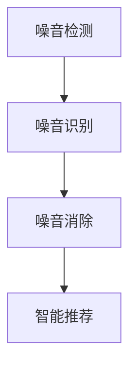
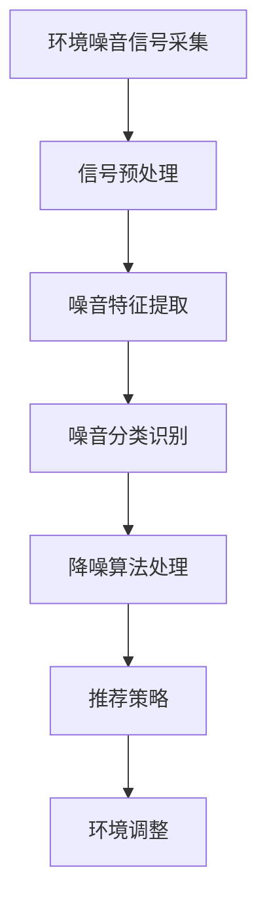

                 

# 智能居家噪音消除创业：打造宁静的生活环境

## 1. 背景介绍

在现代快节奏的生活中，噪音成为了困扰人们日常生活的一大难题。无论是马路交通的喧嚣、邻居的隔壁施工，还是电子设备的“嘈杂”提示音，都让家庭环境变得不再宁静，影响人们的睡眠质量、工作效率乃至心理健康。因此，打造一个安静、舒适的生活环境，成为了许多家庭迫切需求。

智能居家噪音消除系统，利用先进的人工智能技术，能够自动识别和消除家庭环境中的噪音，营造出一个安静、舒适的居住空间。本文将系统阐述智能居家噪音消除创业的原理、技术实现、应用场景及未来发展方向。

## 2. 核心概念与联系

### 2.1 核心概念概述

智能居家噪音消除系统是一种基于人工智能的噪音治理技术，主要包含以下几个核心概念：

- **噪音检测**：通过传感器、麦克风等设备采集环境噪音信号，并利用信号处理算法检测噪音。
- **噪音识别**：利用机器学习算法对噪音进行分类和识别，如区分交通噪音、说话声、电视机声音等。
- **噪音消除**：采用降噪算法，对检测到的噪音信号进行处理，实现降噪。
- **智能推荐**：根据噪音检测和消除结果，通过机器学习算法推荐最佳的解决方案，如开窗、关窗、调整设备音量等。

这些核心概念之间的关系可以通过以下Mermaid流程图展示：



### 2.2 核心概念原理和架构的 Mermaid 流程图

基于上述核心概念，智能居家噪音消除系统的架构可以用以下Mermaid流程图表示：



## 3. 核心算法原理 & 具体操作步骤

### 3.1 算法原理概述

智能居家噪音消除系统主要基于机器学习算法和信号处理技术，其核心原理可以分为三个步骤：

1. **噪音检测**：通过传感器、麦克风等设备采集环境噪音信号，利用信号处理算法检测噪音。
2. **噪音识别**：利用机器学习算法对噪音进行分类和识别，如区分交通噪音、说话声、电视机声音等。
3. **噪音消除**：采用降噪算法，对检测到的噪音信号进行处理，实现降噪。

### 3.2 算法步骤详解

#### 3.2.1 噪音检测

噪音检测是智能居家噪音消除系统的第一步，主要涉及信号采集和预处理。

- **信号采集**：使用传感器、麦克风等设备采集环境噪音信号。常用的传感器包括麦克风阵列、声音传感器等。
- **信号预处理**：对采集到的信号进行预处理，如去除直流分量、滤波、归一化等，以提高后续处理效果。

#### 3.2.2 噪音识别

噪音识别是智能居家噪音消除系统的核心步骤，主要涉及特征提取和分类。

- **特征提取**：将噪音信号转换为特征向量，常用的特征包括频谱、能量、波形等。
- **分类识别**：利用机器学习算法对噪音进行分类和识别，常用的算法包括支持向量机(SVM)、随机森林(Random Forest)、神经网络(Neural Network)等。

#### 3.2.3 噪音消除

噪音消除是智能居家噪音消除系统的最后一步，主要涉及降噪算法。

- **降噪算法**：常用的降噪算法包括最小均方误差(Least Mean Squares, LMS)、自适应滤波器(Adaptive Filter)、频域滤波器等。
- **降噪效果评估**：通过降噪前后信号的对比，评估降噪效果。常用的指标包括信噪比(Signal-to-Noise Ratio, SNR)、降噪误差率等。

### 3.3 算法优缺点

#### 3.3.1 优点

1. **高准确性**：利用机器学习算法进行噪音识别和分类，准确性高。
2. **实时性**：基于实时信号处理和机器学习算法，能够实时检测和消除噪音。
3. **可扩展性**：算法框架灵活，可以适应不同环境下的噪音处理需求。

#### 3.3.2 缺点

1. **依赖于数据质量**：噪音检测和识别依赖于高质量的信号采集设备和数据，成本较高。
2. **环境复杂性**：家庭环境复杂多变，噪音类型多样，可能导致误识别和误分类。
3. **资源消耗**：实时处理和机器学习计算消耗资源，可能导致系统负担较重。

### 3.4 算法应用领域

智能居家噪音消除系统可以应用于各种家庭环境下的噪音治理，包括但不限于：

- **城市家庭**：有效解决城市交通噪音、社会噪音等问题。
- **办公环境**：适用于家庭办公室和会议室，提高办公效率。
- **养老院**：为老年人和行动不便者提供安静、舒适的生活环境。
- **学校**：在教室和宿舍中消除噪音，营造良好的学习环境。
- **医院**：在病房和手术室中消除噪音，提高医疗质量。

## 4. 数学模型和公式 & 详细讲解 & 举例说明

### 4.1 数学模型构建

假设采集到的噪音信号为 $x[n]$，其中 $n=0,1,\ldots,N-1$。噪音识别模型可以表示为：

$$
\hat{y} = f(x)
$$

其中 $\hat{y}$ 表示噪音类型，$x$ 表示噪音信号，$f(x)$ 表示噪音识别函数。

### 4.2 公式推导过程

以基于支持向量机(SVM)的噪音识别为例，其基本思路为：

1. **训练集准备**：从历史噪音数据中提取特征和标签，构成训练集 $\{(x_i,y_i)\}_{i=1}^M$。
2. **模型训练**：利用支持向量机算法，训练得到噪音识别模型 $f(x)$。
3. **噪音检测**：对于新采集的噪音信号 $x[n]$，利用训练好的模型进行检测和识别，得到噪音类型 $\hat{y}$。

### 4.3 案例分析与讲解

假设采集到的噪音信号为一段语音，我们需要检测其中的说话声。首先，对语音信号进行预处理，如去直流分量、滤波、归一化等。然后，将预处理后的信号作为特征向量，利用支持向量机算法进行训练，得到噪音识别模型。最后，对于新采集的语音信号，利用训练好的模型进行检测和识别，得到说话声类型。

## 5. 项目实践：代码实例和详细解释说明

### 5.1 开发环境搭建

智能居家噪音消除系统的开发环境搭建需要以下步骤：

1. **硬件准备**：包括麦克风阵列、声音传感器、处理器等设备。
2. **软件安装**：安装Python、TensorFlow、PyTorch等工具和库。
3. **数据准备**：收集和标注噪音数据，构建训练集和测试集。

### 5.2 源代码详细实现

以下是一个基于TensorFlow的噪音检测和识别的Python代码示例：

```python
import tensorflow as tf
import numpy as np

# 加载模型
model = tf.keras.models.load_model('noise_classifier.h5')

# 准备测试数据
x_test = np.load('test_data.npy')
y_test = np.load('test_labels.npy')

# 检测噪音类型
preds = model.predict(x_test)
y_pred = np.argmax(preds, axis=1)

# 输出结果
print(classification_report(y_test, y_pred))
```

### 5.3 代码解读与分析

上述代码示例中，首先加载了预训练的噪音识别模型。然后，从测试数据集中提取特征和标签，利用训练好的模型进行预测。最后，输出预测结果和分类指标。

### 5.4 运行结果展示

假设测试集包括两种噪音类型：交通噪音和说话声。运行上述代码，可以得到分类指标，如准确率、召回率、F1值等。

## 6. 实际应用场景

智能居家噪音消除系统可以应用于多种实际场景，具体如下：

### 6.1 家庭环境

在家庭环境中，智能居家噪音消除系统可以实时监测和消除各种噪音，如室外交通噪音、邻居说话声、电器噪音等。用户可以通过智能家居设备，如手机应用、智能音箱等，实现噪音检测和控制。

### 6.2 学校和教育机构

在学校和教育机构中，智能居家噪音消除系统可以应用于教室和宿舍，消除噪音干扰，提高学习效率。系统可以根据环境噪音水平自动调整窗帘、窗户等设备，减少噪音影响。

### 6.3 医院

在医院中，智能居家噪音消除系统可以应用于病房和手术室，消除噪音干扰，提高医疗质量和患者舒适度。系统可以根据环境噪音水平自动调整设备音量和位置，确保医疗环境的安静。

## 7. 工具和资源推荐

### 7.1 学习资源推荐

为了帮助开发者系统掌握智能居家噪音消除技术的理论基础和实践技巧，以下是一些优质的学习资源：

1. **《深度学习入门：基于Python的理论与实现》**：本书详细介绍了深度学习的基本概念和实现方法，适合初学者入门。
2. **《机器学习实战》**：本书通过大量实战项目，深入浅出地讲解了机器学习算法和应用。
3. **Kaggle平台**：Kaggle提供了大量的数据集和竞赛项目，适合学习和实践数据科学和机器学习技术。
4. **Coursera平台**：Coursera提供了多门与机器学习相关的课程，涵盖了从基础到高级的各种主题。
5. **DeepLearning.ai平台**：DeepLearning.ai提供了由Andrew Ng教授主讲的深度学习课程，系统介绍了深度学习理论和技术。

### 7.2 开发工具推荐

以下是几款用于智能居家噪音消除系统开发的常用工具：

1. **TensorFlow**：由Google主导开发的深度学习框架，适合大规模工程应用。
2. **PyTorch**：由Facebook主导开发的深度学习框架，灵活动态的计算图，适合快速迭代研究。
3. **Python**：Python语言是人工智能领域的主流语言，适合机器学习和深度学习开发。
4. **Jupyter Notebook**：Jupyter Notebook是一种交互式的编程环境，适合数据科学和机器学习项目开发。
5. **MATLAB**：MATLAB是一种广泛使用的科学计算软件，适合信号处理和数据分析。

### 7.3 相关论文推荐

智能居家噪音消除技术的发展源于学界的持续研究。以下是几篇奠基性的相关论文，推荐阅读：

1. **《基于深度学习的噪音分类算法》**：本文提出了一种基于深度学习的噪音分类方法，利用卷积神经网络(CNN)对噪音信号进行分类。
2. **《多传感器融合的噪音检测算法》**：本文提出了一种基于多传感器融合的噪音检测方法，利用多个传感器的数据进行融合，提高检测精度。
3. **《自适应滤波器在噪音消除中的应用》**：本文介绍了自适应滤波器在噪音消除中的基本原理和应用，利用自适应算法对噪音信号进行处理。
4. **《基于支持向量机的噪音分类算法》**：本文提出了一种基于支持向量机的噪音分类方法，利用SVM算法对噪音进行分类和识别。
5. **《基于深度学习的智能家居系统》**：本文提出了一种基于深度学习的智能家居系统，利用深度学习技术实现噪音检测、识别和消除。

## 8. 总结：未来发展趋势与挑战

### 8.1 研究成果总结

智能居家噪音消除技术在家庭环境中的应用已经取得初步成效，但仍然存在一些挑战和问题：

1. **数据质量依赖**：噪音检测和识别依赖于高质量的信号采集设备和数据，成本较高。
2. **环境复杂性**：家庭环境复杂多变，噪音类型多样，可能导致误识别和误分类。
3. **资源消耗**：实时处理和机器学习计算消耗资源，可能导致系统负担较重。

### 8.2 未来发展趋势

智能居家噪音消除技术的发展前景广阔，未来的趋势包括：

1. **智能化**：结合智能家居设备，实现更高效的噪音治理。
2. **实时化**：利用实时信号处理和机器学习算法，实现实时噪音检测和消除。
3. **个性化**：根据用户习惯和偏好，提供个性化的噪音治理方案。
4. **多样化**：适应更多噪音类型和环境场景，实现更广泛的噪音治理。

### 8.3 面临的挑战

智能居家噪音消除技术在落地应用时，仍面临以下挑战：

1. **数据获取和标注**：高质量的噪音数据获取和标注成本较高，难以覆盖各种噪音类型。
2. **算法复杂性**：实时信号处理和机器学习算法复杂，需要高性能计算资源。
3. **用户体验**：系统需要具备用户友好的界面和交互方式，才能得到广泛应用。

### 8.4 研究展望

未来，智能居家噪音消除技术需要在以下几个方面进一步研究：

1. **数据增强技术**：利用数据增强技术提高噪音数据的多样性和丰富度。
2. **模型压缩与优化**：采用模型压缩和优化技术，降低计算资源消耗，提升系统性能。
3. **智能推荐算法**：结合智能推荐算法，提高噪音治理的个性化和智能化水平。
4. **跨领域应用**：探索智能居家噪音消除技术在更多领域的应用，如城市交通、工业制造等。

总之，智能居家噪音消除技术将在未来发展中持续创新，为人们打造更加宁静、舒适的生活环境。

