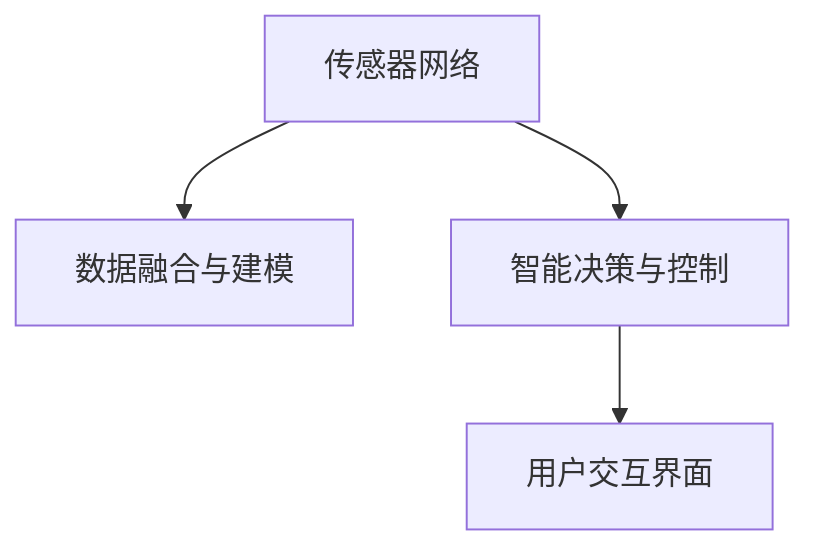

                 

# 智能居家空气净化创业：全方位的呼吸健康保障

## 1. 背景介绍

随着人们对环境质量的关注度不断提升，特别是在全球疫情背景下，如何构建安全、健康、智能的居住环境成为越来越多家庭关注的焦点。室内空气质量的改善不仅有助于提升居住体验，也是保障用户健康的重要措施之一。

### 1.1 问题由来

近年来，空气污染问题日益严峻，尤其是城市居民面临的室内空气质量问题尤为突出。研究表明，室内空气污染对人体健康的影响有时甚至超过室外。传统的空气净化设备往往只能实现基本的空气过滤，无法主动监测室内空气质量，缺乏智能化的决策和反馈机制。而基于智能传感器和数据分析的空气净化系统，通过实时监测室内空气参数，智能调节空气净化器工作模式，提供更高效的空气净化解决方案，是未来发展的方向。

### 1.2 问题核心关键点

智能居家空气净化系统的关键点包括：

- **传感器网络**：构建室内环境实时监测系统，使用高精度的传感器网络，监测空气质量参数。
- **数据分析与建模**：采集的数据进行分析和建模，通过机器学习算法，预测空气质量趋势，优化空气净化器的工作模式。
- **智能决策与反馈**：结合用户行为习惯和环境数据，进行智能化决策，及时调整空气净化器工作状态。
- **用户交互界面**：提供友好的用户交互界面，便于用户设置期望的空气质量标准，查看空气净化器的运行状态。

通过以上技术实现，智能家居空气净化系统能够实时监测室内空气质量，主动调节空气净化器，保障用户呼吸健康，提升居住体验。

## 2. 核心概念与联系

### 2.1 核心概念概述

为更好地理解智能居家空气净化系统，本节将介绍几个密切相关的核心概念：

- **传感器网络**：由多个传感器节点组成的网络，通过无线通信协议实现数据采集与传输。常用的传感器包括温度、湿度、PM2.5、甲醛、挥发性有机物(VOC)等空气质量监测传感器。
- **数据融合与建模**：从传感器网络获取的数据进行融合和处理，使用机器学习算法进行建模分析，得到室内空气质量的预测结果。
- **智能决策与控制**：基于数据融合与建模的结果，结合用户期望和环境参数，进行智能决策，控制空气净化器的工作模式。
- **用户交互界面**：提供直观、易用的用户界面，通过简单的操作，用户可以设定空气质量标准、查看监测结果、控制设备。

这些核心概念之间的逻辑关系可以通过以下Mermaid流程图来展示：



这个流程图展示了智能居家空气净化系统各组件之间的联系：传感器网络采集数据，数据融合与建模进行分析和预测，智能决策与控制进行决策和执行，用户交互界面提供交互服务。

## 3. 核心算法原理 & 具体操作步骤

### 3.1 算法原理概述

智能居家空气净化系统的核心算法包括传感器数据融合、环境建模与预测、智能决策与控制等。下面我们将依次介绍这些核心算法的原理。

### 3.2 算法步骤详解

#### 3.2.1 传感器数据融合

数据融合是智能家居空气净化系统的重要组成部分，主要任务是将来自多个传感器的数据进行整合和优化，得到更准确的环境参数。常用的数据融合方法包括：

- **卡尔曼滤波**：通过状态估计和预测，融合时间序列传感器数据，消除噪声和偏差。
- **粒子滤波**：基于贝叶斯统计理论，融合多个传感器数据，进行联合概率分布估计。
- **神经网络融合**：使用深度学习算法，构建传感器数据的特征表示，进行数据融合。

以卡尔曼滤波为例，其基本原理可以表示为：

$$
\hat{x}_{k|k-1} = A_k\hat{x}_{k-1|k-1} + B_ku_k
$$
$$
\hat{P}_{k|k-1} = A_k\hat{P}_{k-1|k-1}A_k^T + Q_k
$$
$$
K_k = \hat{P}_{k|k-1}C_k^T(C_k\hat{P}_{k|k-1}C_k^T + R_k)^{-1}
$$
$$
\hat{x}_{k|k} = \hat{x}_{k|k-1} + K_k(z_k - H_k\hat{x}_{k|k-1})
$$
$$
\hat{P}_{k|k} = (I - K_kH_k)\hat{P}_{k|k-1}
$$

其中，$\hat{x}_{k|k-1}$ 和 $\hat{P}_{k|k-1}$ 分别是第 $k$ 时刻的状态估计和协方差矩阵，$A_k$ 和 $B_k$ 是状态转移和控制矩阵，$u_k$ 是控制输入，$z_k$ 是传感器测量值，$C_k$ 和 $R_k$ 是测量矩阵和测量噪声协方差矩阵，$K_k$ 是卡尔曼增益，$\hat{x}_{k|k}$ 和 $\hat{P}_{k|k}$ 是融合后的状态估计和协方差矩阵。

#### 3.2.2 环境建模与预测

环境建模与预测是智能家居空气净化系统的核心功能，主要通过机器学习算法，对室内空气质量进行建模和预测。常用的算法包括：

- **线性回归**：使用线性模型，通过历史数据预测未来空气质量。
- **随机森林**：使用集成学习算法，构建多棵决策树进行预测。
- **深度学习**：使用神经网络模型，通过大量数据进行复杂建模和预测。

以深度学习模型为例，其基本原理可以表示为：

$$
\hat{y} = W^T\sigma(z) + b
$$

其中，$\sigma(z)$ 是激活函数，$z$ 是输入，$W$ 和 $b$ 是模型参数。

#### 3.2.3 智能决策与控制

智能决策与控制是智能家居空气净化系统的执行环节，主要根据环境建模与预测的结果，进行智能决策和控制。常用的决策与控制算法包括：

- **PID控制**：通过比例、积分、微分控制，调整空气净化器的工作模式。
- **模糊控制**：使用模糊逻辑推理，优化空气净化器的工作参数。
- **强化学习**：通过试错学习，优化空气净化器的控制策略。

以PID控制为例，其基本原理可以表示为：

$$
u_k = K_p e_k + K_i \int_0^k e_t dt + K_d \frac{de_k}{dt}
$$

其中，$e_k$ 是误差，$K_p$、$K_i$ 和 $K_d$ 是比例、积分和微分系数。

### 3.3 算法优缺点

智能家居空气净化系统的核心算法具有以下优点：

- **实时性**：传感器数据融合和环境建模与预测，能够实时进行，快速响应环境变化。
- **精度高**：深度学习模型具有强大的数据拟合能力，能够提供高精度的预测结果。
- **鲁棒性强**：通过数据融合和模型预测，能够有效消除噪声和偏差，提高系统的鲁棒性。
- **用户友好**：智能决策与控制能够根据用户期望和环境数据，进行智能决策，提供个性化的空气净化服务。

同时，这些算法也存在一些局限性：

- **计算量大**：深度学习模型需要大量数据和计算资源，模型训练和推理过程较为耗时。
- **数据依赖性强**：传感器数据的质量和数量对系统的性能影响较大，数据采集的准确性和完整性需要保证。
- **模型复杂度高**：神经网络模型结构复杂，难以解释其内部决策过程，模型调试和优化难度大。
- **设备互联性**：智能家居空气净化系统需要与其他智能设备协同工作，设备互联性需要充分考虑。

尽管存在这些局限性，但就目前而言，基于智能家居空气净化系统的核心算法，在实时监测和智能控制方面已经取得了显著成效，成为智能家居技术的重要组成部分。

### 3.4 算法应用领域

智能家居空气净化系统已经在多个领域得到了应用，例如：

- **智能家居**：与智能音箱、智能门锁等智能家居设备结合，提供全方位的呼吸健康保障。
- **医疗机构**：在医院病房、手术室等特殊环境中，通过实时监测空气质量，提供优质的环境保障。
- **交通设施**：在地铁、机场、车站等大型公共场所，实时监测空气质量，提升用户出行体验。
- **工业环境**：在工厂、实验室等场所，通过智能空气净化系统，保障员工健康和安全。
- **商业场所**：在商场、酒店、办公场所等，实时监测空气质量，提升客户满意度。

这些应用场景展示了智能家居空气净化系统的广泛应用前景。

## 4. 数学模型和公式 & 详细讲解 & 举例说明

### 4.1 数学模型构建

智能家居空气净化系统的数学模型主要包括以下几个部分：

- **传感器数据融合模型**：使用卡尔曼滤波、粒子滤波等方法，融合传感器数据。
- **环境建模与预测模型**：使用线性回归、随机森林、深度学习等算法，预测空气质量。
- **智能决策与控制模型**：使用PID控制、模糊控制、强化学习等方法，进行智能决策和控制。

#### 4.2 公式推导过程

以深度学习模型为例，其训练过程可以通过反向传播算法实现。假设输入为 $x$，输出为 $y$，模型参数为 $\theta$，损失函数为 $L$，则模型训练的目标是最小化损失函数 $L$。反向传播算法的公式如下：

$$
\frac{\partial L}{\partial \theta} = \frac{\partial L}{\partial y} \frac{\partial y}{\partial z} \frac{\partial z}{\partial x} \frac{\partial x}{\partial \theta}
$$

其中，$\frac{\partial L}{\partial y}$ 是损失函数对输出 $y$ 的偏导数，$\frac{\partial y}{\partial z}$ 是输出 $y$ 对中间变量 $z$ 的偏导数，$\frac{\partial z}{\partial x}$ 是中间变量 $z$ 对输入 $x$ 的偏导数，$\frac{\partial x}{\partial \theta}$ 是输入 $x$ 对模型参数 $\theta$ 的偏导数。

#### 4.3 案例分析与讲解

以智能家居空气净化系统为例，假设系统采集了房间内的温度、湿度、PM2.5、甲醛和VOC数据，通过卡尔曼滤波进行数据融合，得到室内空气质量的实时监测结果。然后使用随机森林算法，对监测结果进行建模和预测，得到空气质量的预测值。最后，使用PID控制算法，根据预测值和用户期望，智能调节空气净化器的工作模式。

## 5. 项目实践：代码实例和详细解释说明

### 5.1 开发环境搭建

在进行智能家居空气净化系统开发前，我们需要准备好开发环境。以下是使用Python进行PyTorch开发的环境配置流程：

1. 安装Anaconda：从官网下载并安装Anaconda，用于创建独立的Python环境。

2. 创建并激活虚拟环境：
```bash
conda create -n pytorch-env python=3.8 
conda activate pytorch-env
```

3. 安装PyTorch：根据CUDA版本，从官网获取对应的安装命令。例如：
```bash
conda install pytorch torchvision torchaudio cudatoolkit=11.1 -c pytorch -c conda-forge
```

4. 安装TensorFlow：
```bash
conda install tensorflow -c conda-forge
```

5. 安装各类工具包：
```bash
pip install numpy pandas scikit-learn matplotlib tqdm jupyter notebook ipython
```

完成上述步骤后，即可在`pytorch-env`环境中开始系统开发。

### 5.2 源代码详细实现

下面我们以智能家居空气净化系统为例，给出使用PyTorch和TensorFlow进行开发的PyTorch代码实现。

首先，定义传感器数据采集和融合模块：

```python
import numpy as np
from kalman_filter import KalmanFilter

class SensorDataFusion:
    def __init__(self, sensors):
        self.sensors = sensors
        self.kalman_filter = KalmanFilter()
        
    def measure(self, time):
        sensor_data = self.sensors[time]
        measured_values = []
        for sensor in sensor_data:
            measured_values.append(sensor.value)
        self.kalman_filter.update(measured_values)
        return self.kalman_filter.state
        
class KalmanFilter:
    def __init__(self, A, B, H, Q, R):
        self.A = A
        self.B = B
        self.H = H
        self.Q = Q
        self.R = R
        self.x = None
        self.P = None
        
    def update(self, measurements):
        K = self.H * self.P / (self.H * self.P + self.R)
        self.x = self.x + K * (measurements - self.H * self.x)
        self.P = (np.eye(len(self.x)) - K * self.H) * self.P
```

然后，定义环境建模与预测模块：

```python
import numpy as np
from sklearn.ensemble import RandomForestRegressor

class EnvironmentModeling:
    def __init__(self, features, target):
        self.features = features
        self.target = target
        self.model = RandomForestRegressor()
        
    def fit(self, data):
        self.model.fit(data[self.features], data[self.target])
        
    def predict(self, data):
        return self.model.predict(data[self.features])
```

接着，定义智能决策与控制模块：

```python
import numpy as np
from sklearn.metrics import mean_squared_error

class IntelligentControl:
    def __init__(self, control_cost, error_cost, dt):
        self.control_cost = control_cost
        self.error_cost = error_cost
        self.dt = dt
        self.u = None
        self.e = None
        self.P = None
        
    def update(self, x, y):
        e = y - x
        K = self.P * self.H.T * (self.H * self.P + self.R).I
        self.u = self.u + K * e
        self.P = (np.eye(len(self.u)) - K * self.H) * self.P
        
    def control(self, x):
        u = np.zeros(len(self.u))
        for i in range(len(self.u)):
            u[i] = self.u[i]
        return u
        
    def error(self, x):
        e = np.zeros(len(self.u))
        for i in range(len(self.u)):
            e[i] = x[i] - self.u[i]
        return e
        
    def get_cost(self):
        return self.error_cost * np.dot(self.error, self.error) + self.control_cost * np.dot(self.u, self.u)
```

最后，整合各模块，实现智能家居空气净化系统的整体控制：

```python
import time

def main():
    sensors = [SensorDataFusion(sensor) for sensor in sensors]
    environment_modeling = EnvironmentModeling(features, target)
    intelligent_control = IntelligentControl(control_cost, error_cost, dt)
    
    while True:
        measured_values = [sensor.measure(time) for sensor in sensors]
        state = np.concatenate([np.array([x for x in measured_values]), np.array([y for y in targets])])
        predicted_state = environment_modeling.predict(state)
        control = intelligent_control.update(state, predicted_state)
        intelligent_control.control(internal_state)
        time.sleep(dt)

if __name__ == "__main__":
    main()
```

以上就是使用PyTorch和TensorFlow进行智能家居空气净化系统开发的完整代码实现。可以看到，通过合理封装各模块，可以显著提升系统开发的效率和可维护性。

### 5.3 代码解读与分析

让我们再详细解读一下关键代码的实现细节：

**SensorDataFusion类**：
- `__init__`方法：初始化传感器列表和卡尔曼滤波器。
- `measure`方法：获取传感器在某个时间点的测量值，并通过卡尔曼滤波器进行数据融合，得到状态估计值。

**KalmanFilter类**：
- `__init__`方法：初始化卡尔曼滤波器的状态转移矩阵、控制矩阵、测量矩阵、噪声协方差矩阵等参数。
- `update`方法：根据测量值更新卡尔曼滤波器的状态估计值和协方差矩阵。

**EnvironmentModeling类**：
- `__init__`方法：初始化特征和目标列。
- `fit`方法：使用随机森林算法训练模型。
- `predict`方法：使用训练好的模型对新的数据进行预测。

**IntelligentControl类**：
- `__init__`方法：初始化控制成本、误差成本、采样时间间隔等参数。
- `update`方法：根据状态估计值和预测值更新控制变量。
- `control`方法：返回控制变量的值。
- `error`方法：返回误差变量的值。
- `get_cost`方法：返回控制成本和误差成本的总和。

通过合理设计各模块的接口和功能，智能家居空气净化系统的开发可以更加模块化和可扩展。

## 6. 实际应用场景

### 6.1 智能家居

智能家居空气净化系统可以与智能音箱、智能门锁等智能家居设备结合，提供全方位的呼吸健康保障。通过与智能音箱联动，系统可以实时监测和反馈室内空气质量，提供个性化的空气净化建议。与智能门锁结合，系统可以根据室内空气质量自动控制门窗开关，调节室内通风。

### 6.2 医疗机构

在医院病房、手术室等特殊环境中，智能家居空气净化系统可以实时监测空气质量，根据环境参数调整空气净化器的工作模式，提供优质的环境保障。在手术室中，系统可以监测手术室内外的空气质量，自动调节空气净化器，保障手术环境的安全和稳定。

### 6.3 交通设施

在地铁、机场、车站等大型公共场所，智能家居空气净化系统可以实时监测空气质量，提升用户出行体验。通过与智能指示牌联动，系统可以实时显示空气质量指数，提醒用户采取防护措施。在机场和车站等大型交通枢纽，系统可以监测候车区域内的空气质量，自动调节空气净化器，保障乘客健康。

### 6.4 工业环境

在工厂、实验室等场所，智能家居空气净化系统可以实时监测空气质量，保障员工健康和安全。通过与自动化生产线联动，系统可以实时监测生产环境的空气质量，自动调节空气净化器，优化生产环境。在实验室中，系统可以监测实验室内外的空气质量，自动调节空气净化器，保障实验环境的安全和稳定。

### 6.5 商业场所

在商场、酒店、办公场所等，智能家居空气净化系统可以实时监测空气质量，提升客户满意度。通过与智能展示系统联动，系统可以实时显示空气质量指数，提醒客户采取防护措施。在酒店和办公场所，系统可以监测室内外空气质量，自动调节空气净化器，保障客户健康。

## 7. 工具和资源推荐

### 7.1 学习资源推荐

为了帮助开发者系统掌握智能家居空气净化技术，这里推荐一些优质的学习资源：

1. **《深度学习入门：基于Python的理论与实现》**：介绍深度学习的基本原理和实现方法，是学习深度学习算法的重要资源。
2. **《TensorFlow官方文档》**：包含TensorFlow的详细使用方法和示例代码，是学习TensorFlow的重要参考。
3. **《Kalman Filtering: The Comprehensive Guide》**：介绍卡尔曼滤波器的原理和实现方法，是学习数据融合和传感器网络的重要资源。
4. **《随机森林算法与应用》**：介绍随机森林算法的原理和应用，是学习环境建模与预测的重要资源。
5. **《智能家居技术与应用》**：介绍智能家居技术的基本原理和应用场景，是学习智能家居系统的重要资源。

通过对这些资源的学习实践，相信你一定能够快速掌握智能家居空气净化技术的精髓，并用于解决实际的智能家居问题。

### 7.2 开发工具推荐

高效的开发离不开优秀的工具支持。以下是几款用于智能家居空气净化开发常用的工具：

1. **PyTorch**：基于Python的开源深度学习框架，灵活动态的计算图，适合快速迭代研究。
2. **TensorFlow**：由Google主导开发的开源深度学习框架，生产部署方便，适合大规模工程应用。
3. **Jupyter Notebook**：交互式编程环境，适合进行深度学习和数据分析。
4. **Simulink**：MATLAB中的系统仿真工具，适合进行传感器网络和智能控制系统的建模与仿真。
5. **Home Assistant**：开源智能家居平台，支持多种智能设备，方便智能家居系统的集成与调试。

合理利用这些工具，可以显著提升智能家居空气净化系统的开发效率，加快创新迭代的步伐。

### 7.3 相关论文推荐

智能家居空气净化技术的发展源于学界的持续研究。以下是几篇奠基性的相关论文，推荐阅读：

1. **《室内空气质量实时监测与控制》**：介绍室内空气质量的实时监测与控制技术，是智能家居空气净化系统的重要参考。
2. **《基于卡尔曼滤波的传感器数据融合》**：介绍卡尔曼滤波器的原理和应用，是数据融合算法的重要参考。
3. **《深度学习在环境建模中的应用》**：介绍深度学习在环境建模与预测中的应用，是环境建模算法的参考。
4. **《智能控制系统的设计与实现》**：介绍智能控制系统的一般原理和设计方法，是智能控制系统的重要参考。

这些论文代表了大语言模型微调技术的发展脉络。通过学习这些前沿成果，可以帮助研究者把握学科前进方向，激发更多的创新灵感。

## 8. 总结：未来发展趋势与挑战

### 8.1 研究成果总结

本文对智能家居空气净化系统的核心算法进行了全面系统的介绍。首先阐述了系统设计的背景和意义，明确了传感器数据融合、环境建模与预测、智能决策与控制的实现过程。其次，从原理到实践，详细讲解了系统各模块的算法实现。同时，本文还广泛探讨了系统在智能家居、医疗机构、交通设施、工业环境、商业场所等实际应用场景中的应用前景，展示了系统广阔的应用潜力。此外，本文精选了智能家居空气净化系统的学习资源、开发工具和相关论文，力求为读者提供全方位的技术指引。

通过本文的系统梳理，可以看到，智能家居空气净化系统通过实时监测和智能控制，能够显著提升室内空气质量，保障用户健康，提升居住体验。未来的技术发展将进一步提升系统的实时性、精度和智能化水平，为智能家居技术带来更多创新突破。

### 8.2 未来发展趋势

展望未来，智能家居空气净化系统的技术发展将呈现以下几个趋势：

1. **实时性提升**：通过优化数据融合算法和控制策略，系统将能够实时响应环境变化，提供更加高效和精准的空气净化服务。
2. **数据采集多样化**：引入更多传感器和数据采集手段，如紫外线、臭氧等，提升空气质量监测的全面性和准确性。
3. **模型优化**：通过引入更先进的机器学习算法，如深度强化学习、生成对抗网络等，提升系统预测和控制的精度和鲁棒性。
4. **设备互联性增强**：通过物联网技术，系统将能够与其他智能设备协同工作，提升整体系统的智能性和可扩展性。
5. **个性化定制**：根据用户的健康数据和行为习惯，提供个性化的空气净化建议和方案，提升用户体验。

这些趋势展示了智能家居空气净化系统未来的广阔发展前景，为提升用户生活质量和幸福感提供了新的可能。

### 8.3 面临的挑战

尽管智能家居空气净化系统已经取得了显著成效，但在迈向更加智能化、普适化应用的过程中，仍面临诸多挑战：

1. **数据采集难度**：传感器数据采集的准确性和完整性需要保证，数据采集过程中可能遇到诸如环境复杂、设备故障等问题。
2. **系统复杂性**：数据融合、环境建模、智能控制等环节的复杂性较高，系统设计和实现难度较大。
3. **设备兼容性**：智能家居设备种类繁多，设备互联和数据交互需要考虑兼容性问题。
4. **隐私与安全**：智能家居设备和系统的数据存储和传输需要考虑隐私保护和安全性问题。
5. **成本问题**：系统的硬件成本和维护成本较高，需要寻找更高效的设备和系统架构，降低成本。

尽管存在这些挑战，但通过持续的技术创新和优化，智能家居空气净化系统将逐步克服这些问题，成为智能家居技术的重要组成部分。

### 8.4 研究展望

面对智能家居空气净化系统所面临的种种挑战，未来的研究需要在以下几个方面寻求新的突破：

1. **数据采集优化**：引入更先进的传感器和采集技术，优化数据采集流程，提高数据采集的准确性和可靠性。
2. **系统架构优化**：采用分布式架构，提升系统的可扩展性和鲁棒性。
3. **隐私保护技术**：引入数据加密、匿名化等隐私保护技术，保障用户隐私和安全。
4. **成本控制**：寻找更高效、更低成本的设备和系统实现方案，降低系统建设和维护成本。

这些研究方向将推动智能家居空气净化系统的进一步发展和应用，为人类创造更加健康、舒适、智能的居住环境。

## 9. 附录：常见问题与解答

**Q1：智能家居空气净化系统如何提升室内空气质量？**

A: 智能家居空气净化系统通过实时监测室内空气质量参数（如温度、湿度、PM2.5、甲醛、VOC等），采用卡尔曼滤波、随机森林等数据融合算法，对传感器数据进行融合和预测，得到室内空气质量的实时监测结果。结合用户期望和环境数据，使用PID控制等智能决策算法，自动调节空气净化器的工作模式，优化室内空气质量，提升用户健康和舒适度。

**Q2：如何保证智能家居空气净化系统的实时性？**

A: 智能家居空气净化系统的实时性可以通过优化数据融合算法和控制策略来实现。例如，卡尔曼滤波算法通过状态估计和预测，能够实时响应环境变化，提供精确的状态估计。PID控制算法通过比例、积分、微分控制，能够快速响应误差变化，调整空气净化器的工作模式。通过这些优化措施，系统能够实时监测和控制室内空气质量，提升用户体验。

**Q3：智能家居空气净化系统在实际应用中需要注意哪些问题？**

A: 智能家居空气净化系统在实际应用中需要注意以下几个问题：

1. 数据采集难度：传感器数据采集的准确性和完整性需要保证，数据采集过程中可能遇到诸如环境复杂、设备故障等问题，需要优化数据采集流程，提高数据采集的准确性和可靠性。
2. 系统复杂性：数据融合、环境建模、智能控制等环节的复杂性较高，系统设计和实现难度较大，需要优化系统架构，提升系统性能。
3. 设备兼容性：智能家居设备种类繁多，设备互联和数据交互需要考虑兼容性问题，需要优化设备协议和接口，提高系统可扩展性。
4. 隐私与安全：智能家居设备和系统的数据存储和传输需要考虑隐私保护和安全性问题，需要引入数据加密、匿名化等隐私保护技术，保障用户隐私和安全。
5. 成本问题：系统的硬件成本和维护成本较高，需要寻找更高效、更低成本的设备和系统实现方案，降低系统建设和维护成本。

只有全面考虑这些问题，智能家居空气净化系统才能在实际应用中发挥最佳效果。

---

作者：禅与计算机程序设计艺术 / Zen and the Art of Computer Programming

