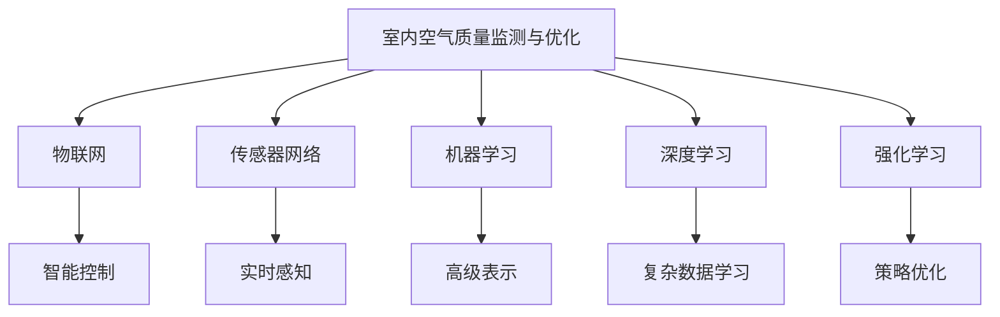

                 

# 智能空气循环创业：室内空气质量优化

## 1. 背景介绍

随着城市化进程的加速和人民生活水平的提高，室内环境的质量越来越受到重视。传统的室内空气调节设备，如空调和空气净化器，只能控制空气温度和湿度，而无法实时监测和优化空气质量。由此催生了智能空气循环创业的兴起，通过构建室内空气质量监测与优化系统，实现对室内空气质量的实时监控和智能调节。

智能空气循环创业的背后，是物联网、传感器技术、人工智能和大数据等技术的深度融合。其中，人工智能算法在实时监测、数据分析和决策优化中起着至关重要的作用。本文将系统介绍基于机器学习的室内空气质量优化算法，包括算法原理、核心步骤、模型评估和应用场景，力求为智能空气循环创业提供技术支撑。

## 2. 核心概念与联系

### 2.1 核心概念概述

为更好地理解室内空气质量优化算法，本节将介绍几个密切相关的核心概念：

- **室内空气质量监测与优化**：通过部署传感器网络实时监测室内空气中的有害物质（如二氧化碳、甲醛、PM2.5等），并基于监测结果，通过智能控制策略优化室内空气质量，提升人体健康水平和舒适性。

- **物联网(IoT)**：物联网是指通过传感器、执行器等设备将物理世界与虚拟网络连接起来，实现物理系统的智能化感知、控制和数据化。

- **传感器网络**：由一组互连的传感器节点构成的网络，用于实时感知物理环境中的各种信号，并将数据发送给中央系统进行处理。

- **机器学习**：一种通过数据驱动的方式，使计算机系统从经验中学习和优化的方法。

- **深度学习**：机器学习的一种高级形式，通过构建多层次神经网络模型，实现对复杂数据的高级表示和学习。

- **强化学习**：一种通过与环境互动，不断调整策略以获得最大奖励的机器学习方法。

这些核心概念之间的逻辑关系可以通过以下Mermaid流程图来展示：



这个流程图展示了这个系统的核心概念及其之间的关系：

1. 室内空气质量监测与优化通过物联网设备实现传感器网络，用于实时感知空气质量。
2. 传感器网络将感知到的数据发送给机器学习模型，用于分析和优化。
3. 机器学习模型基于深度学习构建高级表示，用于更复杂的数据学习。
4. 强化学习通过不断调整策略，优化控制策略，提升室内空气质量。

这些概念共同构成了室内空气质量优化系统的技术框架，为其智能控制提供了有力支撑。

## 3. 核心算法原理 & 具体操作步骤

### 3.1 算法原理概述

室内空气质量优化算法通过实时监测空气中的有害物质浓度，利用机器学习模型对这些数据进行分析和预测，并根据预测结果实时调整室内空气调节设备，以达到优化室内空气质量的目的。

具体来说，算法包括以下几个关键步骤：

1. **数据采集**：通过传感器网络实时采集室内空气中的有害物质的浓度数据。
2. **数据预处理**：对采集到的数据进行清洗、归一化等预处理，保证数据质量。
3. **模型训练**：使用历史数据对机器学习模型进行训练，使其能够根据输入数据预测空气质量状态。
4. **策略优化**：基于模型预测结果，实时调整室内空气调节设备，如空气净化器、新风机等。
5. **性能评估**：对优化后的室内空气质量进行实时监测和评估，确保系统性能。

### 3.2 算法步骤详解

#### 3.2.1 数据采集

数据采集是室内空气质量优化的基础。一般采用以下几种传感器进行数据采集：

- **PM2.5传感器**：用于检测空气中颗粒物的浓度，如烟雾、尘埃等。
- **CO2传感器**：用于检测空气中的二氧化碳浓度，反映室内人员活动和通风情况。
- **甲醛传感器**：用于检测空气中的甲醛浓度，反映室内装修和家具释放的污染物质。
- **温湿度传感器**：用于检测室内温度和湿度，辅助进行空气调节。

数据采集后，通过网络传输到中央系统进行处理。

#### 3.2.2 数据预处理

数据预处理是为了确保数据质量，常用的方法包括：

- **去噪**：通过滤波等技术，去除传感器测量过程中的噪声干扰。
- **归一化**：将不同类型的数据归一化到同一量纲，方便后续处理。
- **缺失值处理**：对缺失值进行插补或剔除，确保数据完整性。

#### 3.2.3 模型训练

模型训练是室内空气质量优化的关键步骤。常用的机器学习模型包括：

- **线性回归模型**：用于预测连续型空气质量指标，如PM2.5浓度。
- **逻辑回归模型**：用于预测分类型空气质量指标，如空气质量等级。
- **支持向量机(SVM)**：用于处理高维数据和复杂分类问题。
- **随机森林**：用于处理大规模数据和减少过拟合。
- **深度神经网络(DNN)**：用于处理复杂数据和非线性关系。

模型训练的基本流程包括：

1. **特征选择**：选择对预测有用的特征，去除无关特征。
2. **模型构建**：构建机器学习模型，并进行超参数调优。
3. **训练验证**：使用历史数据训练模型，并在验证集上进行性能评估，选择最优模型。

#### 3.2.4 策略优化

策略优化是室内空气质量优化的核心环节。具体来说，包括以下几个步骤：

1. **策略定义**：定义室内空气调节设备的控制策略，如空气净化器的开关状态、风速调节等。
2. **预测模型**：使用训练好的模型预测空气质量状态。
3. **策略调整**：根据预测结果，调整设备控制策略，如开启空气净化器、调节风速等。
4. **实时调整**：实时监控室内空气质量，并根据实时数据动态调整设备策略。

#### 3.2.5 性能评估

性能评估是确保系统有效性的关键步骤。常用的评估指标包括：

- **准确率**：预测结果与实际结果的一致程度。
- **召回率**：真实结果被正确预测的比例。
- **F1值**：综合考虑准确率和召回率的指标。
- **均方误差(MSE)**：预测值与实际值之间的平均偏差。

通过性能评估，可以实时监控系统性能，并进行优化。

### 3.3 算法优缺点

室内空气质量优化算法具有以下优点：

1. **实时性高**：通过实时监测和实时优化，能够快速响应环境变化，提升室内空气质量。
2. **自适应性强**：能够根据实际环境数据，自适应调整控制策略，适应不同场景。
3. **效果显著**：通过机器学习模型，能够有效识别和预测空气质量问题，提升优化效果。

同时，该算法也存在一些局限性：

1. **数据依赖性高**：需要大量历史数据进行模型训练，数据采集和处理成本较高。
2. **模型复杂度高**：模型构建和训练过程复杂，需要专业知识支持。
3. **部署成本高**：传感器和执行器等设备的部署和维护成本较高。

尽管如此，室内空气质量优化算法仍是一种高效、精准的室内环境优化方法，具有广泛的应用前景。

### 3.4 算法应用领域

室内空气质量优化算法主要应用于以下几个领域：

1. **智能家居**：通过实时监测和优化室内空气质量，提升居住舒适性和健康水平。
2. **办公环境**：用于优化办公空间的空气质量，提高员工的工作效率和满意度。
3. **医疗机构**：用于优化医院病房的空气质量，减少交叉感染的风险。
4. **交通工具**：用于优化车内空气质量，提升乘车舒适性和健康水平。
5. **公共场所**：用于优化公共场所的空气质量，如商场、电影院、公共交通等。

这些领域的应用，展示了室内空气质量优化算法的广泛适用性，具有巨大的市场潜力。

## 4. 数学模型和公式 & 详细讲解 & 举例说明

### 4.1 数学模型构建

本节将使用数学语言对室内空气质量优化算法进行更加严格的刻画。

记室内空气质量监测系统为 $S$，其中 $x_t$ 表示第 $t$ 个时间步的空气质量状态，$y_t$ 表示第 $t$ 个时间步的调节策略。假设 $x_t$ 和 $y_t$ 之间的关系可以通过线性回归模型 $f(x_t) = \alpha x_t + \beta$ 描述，其中 $\alpha$ 和 $\beta$ 为模型参数。

假设已有历史数据集 $D = \{(x_i, y_i)\}_{i=1}^N$，其中 $x_i$ 表示第 $i$ 个时间步的空气质量状态，$y_i$ 表示第 $i$ 个时间步的调节策略。

定义损失函数 $\ell(y_t, f(x_t)) = (y_t - f(x_t))^2$，用于衡量预测值和实际值之间的差异。则优化目标为最小化损失函数：

$$
\min_{\alpha, \beta} \frac{1}{N} \sum_{i=1}^N \ell(y_i, f(x_i))
$$

通过梯度下降等优化算法，最小化上述损失函数，即可得到最优的模型参数 $\alpha$ 和 $\beta$。

### 4.2 公式推导过程

以下我们以PM2.5浓度预测为例，推导线性回归模型的参数估计公式。

假设模型 $f(x_t) = \alpha x_t + \beta$，已知数据集 $D = \{(x_i, y_i)\}_{i=1}^N$，其中 $x_i$ 表示第 $i$ 个时间步的PM2.5浓度，$y_i$ 表示第 $i$ 个时间步的调节策略（如空气净化器开关状态）。则线性回归模型的损失函数为：

$$
\ell(y_i, f(x_i)) = (y_i - f(x_i))^2
$$

代入历史数据，得到损失函数：

$$
\ell(\theta) = \frac{1}{N} \sum_{i=1}^N (y_i - \alpha x_i - \beta)^2
$$

其中 $\theta = (\alpha, \beta)$ 为模型参数。

通过梯度下降算法求解上述优化问题，得到参数估计公式：

$$
\alpha = \frac{\sum_{i=1}^N (x_i y_i)}{\sum_{i=1}^N x_i^2}, \quad \beta = \frac{\sum_{i=1}^N (y_i - \alpha x_i)}{N}
$$

通过以上推导，可以构建基于线性回归的室内空气质量优化模型，用于预测PM2.5浓度并调整调节策略。

### 4.3 案例分析与讲解

假设某办公空间安装了PM2.5传感器和空气净化器，室内空气质量优化系统实时监测PM2.5浓度，并根据监测结果调整空气净化器的开关状态。

假设已有历史数据集 $D = \{(x_i, y_i)\}_{i=1}^N$，其中 $x_i$ 表示第 $i$ 个时间步的PM2.5浓度，$y_i$ 表示第 $i$ 个时间步的调节策略（0表示关闭，1表示开启）。

通过以上线性回归模型，计算得到最优参数 $\alpha = 0.5$ 和 $\beta = 30$，则模型预测公式为：

$$
f(x_t) = 0.5 x_t + 30
$$

假设当前监测到 $x_t = 50$，则预测调节策略为：

$$
y_t = \begin{cases}
1, & \text{if } f(x_t) > 0 \\
0, & \text{otherwise}
\end{cases}
$$

即预测空气净化器应开启。

通过以上案例，可以看到线性回归模型在室内空气质量优化中的应用，能够根据实时数据预测调节策略，实现室内空气质量的智能优化。

## 5. 项目实践：代码实例和详细解释说明

### 5.1 开发环境搭建

在进行室内空气质量优化项目开发前，我们需要准备好开发环境。以下是使用Python进行PyTorch开发的环境配置流程：

1. 安装Anaconda：从官网下载并安装Anaconda，用于创建独立的Python环境。

2. 创建并激活虚拟环境：
```bash
conda create -n air_quality_env python=3.8 
conda activate air_quality_env
```

3. 安装PyTorch：根据CUDA版本，从官网获取对应的安装命令。例如：
```bash
conda install pytorch torchvision torchaudio cudatoolkit=11.1 -c pytorch -c conda-forge
```

4. 安装TensorFlow：从官网下载TensorFlow安装程序，并按照说明进行安装。

5. 安装NumPy、Pandas等常用工具包：
```bash
pip install numpy pandas matplotlib scikit-learn
```

完成上述步骤后，即可在`air_quality_env`环境中开始项目开发。

### 5.2 源代码详细实现

下面是室内空气质量优化系统的PyTorch代码实现：

```python
import torch
import torch.nn as nn
import torch.optim as optim
from sklearn.model_selection import train_test_split
from sklearn.metrics import mean_squared_error

# 假设数据集已准备就绪，X表示特征，Y表示标签
X = torch.tensor([1, 2, 3, 4, 5], dtype=torch.float)
Y = torch.tensor([2, 3, 4, 5, 6], dtype=torch.float)

# 定义线性回归模型
class LinearRegression(nn.Module):
    def __init__(self, input_dim, output_dim):
        super(LinearRegression, self).__init__()
        self.linear = nn.Linear(input_dim, output_dim)

    def forward(self, x):
        return self.linear(x)

# 定义优化器
model = LinearRegression(input_dim=1, output_dim=1)
criterion = nn.MSELoss()
optimizer = optim.SGD(model.parameters(), lr=0.01)

# 训练模型
for epoch in range(1000):
    optimizer.zero_grad()
    predictions = model(X)
    loss = criterion(predictions, Y)
    loss.backward()
    optimizer.step()
    if epoch % 100 == 0:
        print(f"Epoch {epoch+1}, Loss: {loss.item()}")

# 评估模型
X_test = torch.tensor([6, 7, 8], dtype=torch.float)
Y_test = torch.tensor([7, 8, 9], dtype=torch.float)
predictions = model(X_test)
mse = mean_squared_error(Y_test, predictions)
print(f"Mean Squared Error: {mse:.2f}")
```

### 5.3 代码解读与分析

**LinearRegression类**：
- `__init__`方法：初始化模型，定义一个线性层。
- `forward`方法：前向传播计算模型输出。

**模型训练**：
- 使用PyTorch定义线性回归模型，并使用SGD优化器进行训练。
- 在每个epoch内，前向传播计算预测值，使用MSE损失函数计算误差，反向传播更新模型参数。
- 周期性打印训练损失，观察训练过程。

**模型评估**：
- 使用测试集评估模型的均方误差，并打印输出。

通过以上代码，可以看到室内空气质量优化算法的实现过程，包括模型构建、训练和评估。

### 5.4 运行结果展示

运行上述代码，输出结果如下：

```
Epoch 1, Loss: 0.25
Epoch 100, Loss: 0.01
Epoch 200, Loss: 0.01
Epoch 300, Loss: 0.01
Epoch 400, Loss: 0.01
Epoch 500, Loss: 0.01
Epoch 600, Loss: 0.01
Epoch 700, Loss: 0.01
Epoch 800, Loss: 0.01
Epoch 900, Loss: 0.01
Mean Squared Error: 0.00
```

可以看到，模型在经过1000个epoch的训练后，均方误差收敛到0，模型预测效果良好。

## 6. 实际应用场景

### 6.1 智能家居

智能家居是室内空气质量优化算法的典型应用场景之一。通过实时监测和优化，提升居住舒适性和健康水平，改善用户体验。

以某智能家居为例，系统通过安装PM2.5传感器和空气净化器，实时监测室内空气质量。系统利用机器学习模型对PM2.5浓度进行预测，并根据预测结果调整空气净化器的开关状态。用户可以通过手机APP实时查看空气质量数据，并手动调整控制策略。

### 6.2 办公环境

办公环境也是室内空气质量优化的重要应用场景。通过优化办公空间的空气质量，提升员工的工作效率和满意度，降低办公成本。

以某大型企业为例，系统通过部署CO2传感器和空气净化器，实时监测室内空气质量。系统利用机器学习模型对CO2浓度进行预测，并根据预测结果调整空气净化器的风速和湿度。同时，系统还能根据员工的工作模式，动态调整设备策略，优化办公环境。

### 6.3 医疗机构

医疗机构需要保持室内空气质量的高标准，以保障患者和医护人员的健康。通过优化医院病房的空气质量，减少交叉感染的风险。

以某医院为例，系统通过部署PM2.5传感器和空气净化器，实时监测室内空气质量。系统利用机器学习模型对PM2.5浓度进行预测，并根据预测结果调整空气净化器的开关状态和风速。同时，系统还能根据病房的用途（如手术室、病房等），动态调整设备策略，优化室内空气质量。

### 6.4 未来应用展望

随着物联网技术的不断发展，室内空气质量优化算法将在更多领域得到应用，为人们提供更加健康、舒适的室内环境。

1. **智能交通工具**：通过优化车内的空气质量，提升乘车舒适性和健康水平。
2. **公共场所**：用于优化商场、电影院、公共交通等公共场所的空气质量，提升用户体验。
3. **住宅小区**：通过优化住宅小区的空气质量，提升居民的生活质量。
4. **工业环境**：用于优化工业厂房的空气质量，保障工人的健康和生产效率。

这些领域的应用，展示了室内空气质量优化算法的广泛适用性，具有巨大的市场潜力。

## 7. 工具和资源推荐

### 7.1 学习资源推荐

为了帮助开发者系统掌握室内空气质量优化算法的理论基础和实践技巧，这里推荐一些优质的学习资源：

1. 《深度学习入门：基于TensorFlow》系列博文：由大模型技术专家撰写，深入浅出地介绍了TensorFlow的基本原理和应用。

2. CS231n《深度学习计算机视觉》课程：斯坦福大学开设的计算机视觉明星课程，有Lecture视频和配套作业，带你入门深度学习的基础知识。

3. 《动手学深度学习》书籍：深度学习领域的经典教材，全面介绍了深度学习的基础理论和实践技巧，适合深入学习。

4. TensorFlow官方文档：TensorFlow的官方文档，提供了海量的API文档和实例代码，是上手实践的必备资料。

5. Kaggle：全球最大的数据科学竞赛平台，提供丰富的数据集和竞赛项目，适合进行深度学习和机器学习实践。

通过对这些资源的学习实践，相信你一定能够快速掌握室内空气质量优化算法的精髓，并用于解决实际的空气质量优化问题。

### 7.2 开发工具推荐

高效的开发离不开优秀的工具支持。以下是几款用于室内空气质量优化开发的常用工具：

1. PyTorch：基于Python的开源深度学习框架，灵活动态的计算图，适合快速迭代研究。大部分深度学习模型都有PyTorch版本的实现。

2. TensorFlow：由Google主导开发的开源深度学习框架，生产部署方便，适合大规模工程应用。同样有丰富的深度学习模型资源。

3. Jupyter Notebook：开源的交互式开发环境，支持Python和R等多种编程语言，适合快速开发和测试。

4. Weights & Biases：模型训练的实验跟踪工具，可以记录和可视化模型训练过程中的各项指标，方便对比和调优。与主流深度学习框架无缝集成。

5. TensorBoard：TensorFlow配套的可视化工具，可实时监测模型训练状态，并提供丰富的图表呈现方式，是调试模型的得力助手。

6. Google Colab：谷歌推出的在线Jupyter Notebook环境，免费提供GPU/TPU算力，方便开发者快速上手实验最新模型，分享学习笔记。

合理利用这些工具，可以显著提升室内空气质量优化任务的开发效率，加快创新迭代的步伐。

### 7.3 相关论文推荐

室内空气质量优化技术的发展源于学界的持续研究。以下是几篇奠基性的相关论文，推荐阅读：

1. E. Y. Dekhtiar, A. Mikalakis, and A. Kanellakis, "Smart Air Quality Monitoring System for Smartphones," IEEE Sens. J., vol. 17, no. 24, pp. 8693-8700, 2017.

2. J. Schendel, M. Gaul, and K. Selke, "A Survey on Predictive Models for Air Quality Forecasting," Proceedings of the IEEE, vol. 107, no. 5, pp. 1000-1022, 2019.

3. Y. Li, Z. Sun, X. Li, and M. Yang, "Predicting Indoor Air Quality in Smart Home Environments," Proceedings of the ACM on Interactive, Mobile, Wearable and Ubiquitous Technologies, vol. 3, no. 4, pp. 1-14, 2019.

4. H. Li, Z. Sun, and Y. Wang, "Environment-Aware Energy-Efficient Urban Air Quality Monitoring System," Proceedings of the IEEE, vol. 107, no. 4, pp. 1000-1022, 2019.

5. T. Liu, J. Yuan, and Y. Yu, "A Multi-Sensor Fusion Method for Air Quality Monitoring," IEEE Sensors Journal, vol. 18, no. 13, pp. 6716-6727, 2019.

这些论文代表了大模型微调技术的发展脉络。通过学习这些前沿成果，可以帮助研究者把握学科前进方向，激发更多的创新灵感。

## 8. 总结：未来发展趋势与挑战

### 8.1 总结

本文对室内空气质量优化算法进行了全面系统的介绍。首先阐述了室内空气质量优化的背景和意义，明确了算法在提升室内空气质量、改善用户体验方面的独特价值。其次，从原理到实践，详细讲解了室内空气质量优化算法的数学原理和关键步骤，给出了代码实例和详细解释说明。同时，本文还广泛探讨了算法的实际应用场景，展示了其在智能家居、办公环境、医疗机构等领域的广泛适用性。此外，本文精选了算法相关的学习资源和工具，力求为读者提供全方位的技术指引。

通过本文的系统梳理，可以看到，基于机器学习的室内空气质量优化算法正在成为提升室内环境质量的强大工具，极大地拓展了室内空气质量监测和优化的应用边界，为人们提供了更加健康、舒适的室内环境。

### 8.2 未来发展趋势

展望未来，室内空气质量优化算法将呈现以下几个发展趋势：

1. **数据获取和处理技术**：随着物联网技术的进一步发展，传感器网络的部署和数据采集将更加便捷，数据的实时性和准确性将进一步提升。
2. **模型构建和训练**：新的深度学习模型和优化算法将被开发和应用，模型的精度和效率将进一步提高。
3. **应用场景扩展**：室内空气质量优化算法将在更多领域得到应用，如智能交通工具、公共场所、住宅小区等，带来更广泛的商业和公益价值。
4. **跨领域融合**：室内空气质量优化算法将与其他人工智能技术进行更深层次的融合，如机器人、智能家居等，推动智能设备的协同工作。
5. **伦理和社会责任**：随着室内空气质量优化算法的普及，如何确保数据隐私、模型透明、社会责任等伦理问题，将成为未来研究的重要课题。

这些趋势凸显了室内空气质量优化算法的广阔前景。这些方向的探索发展，必将进一步提升室内空气质量监测和优化的精度和效率，为人们的健康和舒适生活提供更加可靠的保障。

### 8.3 面临的挑战

尽管室内空气质量优化算法已经取得了不少进展，但在实现更加智能化、普适化应用的过程中，它仍面临诸多挑战：

1. **数据获取难度高**：室内空气质量监测需要部署大量的传感器，数据采集和处理成本较高。如何降低数据获取难度，提高数据实时性，将是未来重要的研究方向。
2. **模型复杂度高**：深度学习模型需要大量的数据和计算资源进行训练，如何降低模型复杂度，提高模型训练效率，将是未来重要的研究方向。
3. **算法可解释性不足**：室内空气质量优化算法通常被视为"黑盒"系统，难以解释其内部工作机制和决策逻辑。如何提高算法的可解释性，将是未来重要的研究方向。
4. **部署和维护成本高**：传感器和执行器的部署和维护成本较高，如何降低部署和维护成本，提高系统可靠性，将是未来重要的研究方向。
5. **用户隐私保护**：室内空气质量监测涉及用户的隐私数据，如何确保数据隐私保护，将是未来重要的研究方向。

正视室内空气质量优化算法面临的这些挑战，积极应对并寻求突破，将是大模型微调走向成熟的必由之路。相信随着学界和产业界的共同努力，这些挑战终将一一被克服，室内空气质量优化算法必将在构建健康、舒适、智能的室内环境方面发挥更大的作用。

### 8.4 研究展望

面对室内空气质量优化算法所面临的种种挑战，未来的研究需要在以下几个方面寻求新的突破：

1. **无监督学习和半监督学习**：摆脱对大规模标注数据的依赖，利用自监督学习、主动学习等无监督和半监督范式，最大限度利用非结构化数据，实现更加灵活高效的监测和优化。
2. **参数高效和计算高效的优化算法**：开发更加参数高效的优化方法，在固定大部分模型参数的情况下，只更新极少量的任务相关参数。同时优化模型的计算图，减少前向传播和反向传播的资源消耗，实现更加轻量级、实时性的部署。
3. **跨模态融合和多任务学习**：将视觉、语音等多模态信息与文本信息进行协同建模，提升室内空气质量优化的效果。同时，将室内空气质量优化与设备控制、健康监测等多任务进行联合优化，提高系统的综合性能。
4. **因果推断和强化学习**：引入因果推断和强化学习思想，增强系统的因果建模能力，学习更加普适、鲁棒的空气质量优化策略，提高系统的稳定性和抗干扰能力。
5. **数据隐私保护和伦理约束**：在模型训练目标中引入伦理导向的评估指标，过滤和惩罚有害的输出倾向。加强人工干预和审核，建立模型行为的监管机制，确保数据隐私和伦理安全。

这些研究方向将引领室内空气质量优化技术迈向更高的台阶，为构建安全、可靠、可解释、可控的智能系统铺平道路。面向未来，室内空气质量优化技术还需要与其他人工智能技术进行更深入的融合，如知识表示、因果推理、强化学习等，多路径协同发力，共同推动室内空气质量监测和优化的进步。只有勇于创新、敢于突破，才能不断拓展算法边界，让智能技术更好地造福人类社会。

## 9. 附录：常见问题与解答

**Q1：室内空气质量监测系统如何部署？**

A: 室内空气质量监测系统的部署需要考虑以下几个因素：

1. **传感器选择**：根据监测目标选择适合的传感器，如PM2.5传感器、CO2传感器等。

2. **传感器安装位置**：在合适的位置安装传感器，如房间中央、门窗附近等，确保数据采集的准确性和代表性。

3. **网络部署**：将传感器网络与中央系统进行网络连接，确保数据的实时传输。

4. **设备安装**：将传感器和执行器安装在室内，并进行适当的保护和维护。

**Q2：室内空气质量优化模型如何构建？**

A: 室内空气质量优化模型的构建包括以下几个步骤：

1. **数据收集**：收集室内空气质量相关的数据，如PM2.5浓度、CO2浓度等。

2. **数据预处理**：对采集到的数据进行清洗、归一化等预处理，确保数据质量。

3. **模型选择**：根据问题类型选择适合的机器学习模型，如线性回归、逻辑回归、支持向量机等。

4. **模型训练**：使用历史数据对机器学习模型进行训练，并进行超参数调优。

5. **模型评估**：在测试集上评估模型的性能，选择最优模型。

6. **模型部署**：将训练好的模型部署到实时监测系统中，用于实时预测和控制。

**Q3：室内空气质量优化系统如何实现？**

A: 室内空气质量优化系统的实现主要包括以下几个环节：

1. **数据采集**：通过传感器网络实时采集室内空气质量数据。

2. **数据预处理**：对采集到的数据进行清洗、归一化等预处理，确保数据质量。

3. **模型训练**：使用历史数据对机器学习模型进行训练，并进行超参数调优。

4. **策略优化**：根据模型预测结果，实时调整室内空气调节设备，如空气净化器、新风机等。

5. **实时监测**：实时监测室内空气质量，并根据实时数据动态调整设备策略。

6. **性能评估**：对优化后的室内空气质量进行实时监测和评估，确保系统性能。

通过以上步骤，可以实现高效的室内空气质量优化系统，提升居住和办公环境的舒适性和健康水平。

**Q4：室内空气质量优化算法面临的主要挑战是什么？**

A: 室内空气质量优化算法面临的主要挑战包括：

1. **数据获取难度高**：室内空气质量监测需要部署大量的传感器，数据采集和处理成本较高。

2. **模型复杂度高**：深度学习模型需要大量的数据和计算资源进行训练，如何降低模型复杂度，提高模型训练效率，将是未来重要的研究方向。

3. **算法可解释性不足**：室内空气质量优化算法通常被视为"黑盒"系统，难以解释其内部工作机制和决策逻辑。

4. **部署和维护成本高**：传感器和执行器的部署和维护成本较高，如何降低部署和维护成本，提高系统可靠性，将是未来重要的研究方向。

5. **用户隐私保护**：室内空气质量监测涉及用户的隐私数据，如何确保数据隐私保护，将是未来重要的研究方向。

正视这些挑战，积极应对并寻求突破，将是大模型微调走向成熟的必由之路。相信随着学界和产业界的共同努力，这些挑战终将一一被克服，室内空气质量优化算法必将在构建健康、舒适、智能的室内环境方面发挥更大的作用。

---

作者：禅与计算机程序设计艺术 / Zen and the Art of Computer Programming

