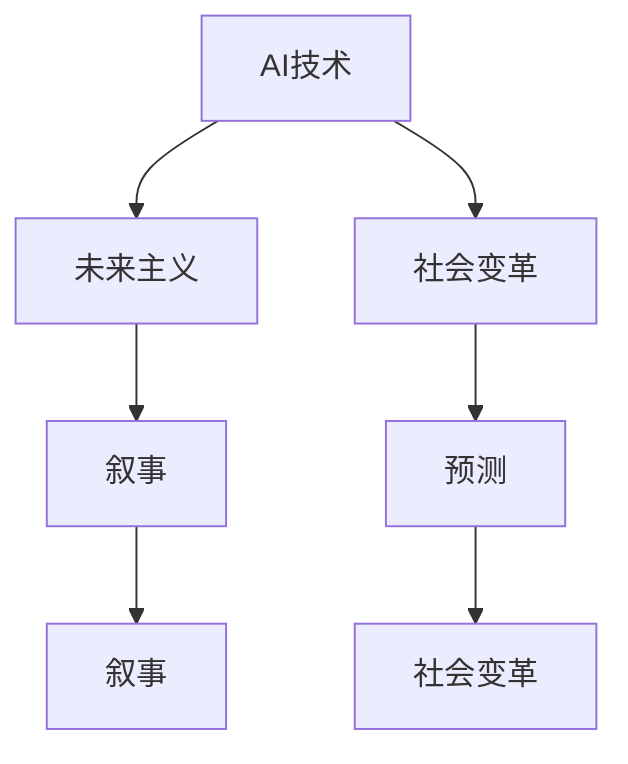

                 

# 未来主义写作：AI预测社会变革的叙事

> 关键词：AI, 未来主义, 社会变革, 叙事, 预测, 技术哲学

## 1. 背景介绍

### 1.1 问题由来
随着人工智能(AI)技术的飞速发展，其对社会的影响日益深远。AI不仅是工具，更是未来社会变革的驱动者。预测和理解AI在社会各领域的潜在影响，已经成为科技、社会科学和文学领域的重要议题。在这一背景下，未来主义写作应运而生，成为AI预测和叙事的新范式。

未来主义写作结合了科技发展的趋势分析和人文关怀的深度洞察，旨在通过文学叙事的方式，揭示AI可能带来的未来社会变革，引发公众和政策制定者的思考和讨论。这种叙事方式不仅具有高度的前瞻性，还能够通过丰富的想象力和情感表达，触动读者的心灵。

### 1.2 问题核心关键点
未来主义写作的核心关键点包括以下几个方面：

- **技术趋势预测**：对AI技术的发展路径和前沿趋势进行精准预测，包括机器学习、深度学习、自然语言处理等领域的未来走向。
- **社会影响分析**：探讨AI对就业、教育、医疗、隐私等多个社会领域的潜在影响，揭示正反两方面的可能结果。
- **人类情感描绘**：通过文学叙事，深入刻画AI影响下人类的心理变化、情感波动，构建丰富的情感景观。
- **伦理道德考量**：在AI推动的社会变革中，探讨技术与人性的冲突和平衡，提出有见地的伦理道德建议。
- **未来主义视野**：站在未来视角审视当前的AI技术及其可能带来的社会变化，对未来充满希望或担忧。

这些关键点构成了未来主义写作的理论框架，使其成为AI预测和社会变革叙事的有效工具。

### 1.3 问题研究意义
未来主义写作对AI预测和社会变革叙事的贡献，体现在以下几个方面：

1. **多学科融合**：将AI技术、社会学、伦理学、文学等多个学科的知识和方法融合在一起，提供多角度、多层次的分析和解读。
2. **公众教育**：通过生动的文学叙事，将复杂的科技概念和未来的社会挑战以易于理解的方式呈现出来，提升公众对AI的认知和理解。
3. **政策引导**：为政府和企业制定AI相关政策和战略提供参考，帮助其在AI技术应用和社会影响方面做出更加明智的决策。
4. **人文关怀**：在技术至上的时代，未来主义写作强调人文关怀，对AI引发的社会问题进行深切关注和情感映射。
5. **未来视野**：开拓视野，为AI技术的未来发展和人类社会的未来构建提供新的思考路径。

未来主义写作通过对AI未来的展望，既能够引发公众的深思，也能够促进AI技术的健康发展，具有重要的现实意义。

## 2. 核心概念与联系

### 2.1 核心概念概述

未来主义写作涉及的核心概念包括：

- **AI技术**：以机器学习、深度学习为代表的AI技术，以及其在自然语言处理、计算机视觉等领域的应用。
- **未来主义**：一种文学和思想流派，强调未来的不确定性和无限可能性，对新技术和社会变革持开放态度。
- **社会变革**：AI技术可能带来的就业、教育、医疗、隐私等方面的社会结构变化。
- **叙事**：文学中通过情节、人物和对话等手段，对故事进行叙述的方式。
- **预测**：基于现有科技和社会趋势，对AI未来的发展路径和影响进行分析和推测。

这些核心概念之间的逻辑关系可以通过以下Mermaid流程图来展示：



这个流程图展示了大语言模型微调的核心概念及其之间的关系：

1. AI技术作为基础，为未来主义和社会变革提供了数据和算法支持。
2. 未来主义为AI技术的未来应用提供文学和思想上的指引。
3. 社会变革通过AI技术得到具体体现和改变。
4. 叙事通过预测未来，为社会变革提供情感和文学上的深度解读。

这些概念共同构成了未来主义写作的理论基础，使其能够有效地探讨AI技术与社会变革的复杂关系。

## 3. 核心算法原理 & 具体操作步骤
### 3.1 算法原理概述

未来主义写作的算法原理，可以从以下几个方面进行概述：

1. **数据收集与预处理**：收集有关AI技术、社会趋势和未来预测的数据，包括科技发展动态、社会调查报告、专家访谈等。
2. **趋势分析**：运用机器学习和数据挖掘技术，对收集到的数据进行分析和预测，揭示AI技术的发展路径和未来趋势。
3. **社会影响分析**：结合社会学和伦理学的研究方法，对AI技术对社会各方面的潜在影响进行深入分析和评估。
4. **叙事构建**：通过文学创作，构建基于AI技术未来预测和社会影响的叙事场景，展现未来社会的面貌和人类情感的波动。
5. **伦理考量**：在叙事中加入伦理道德的讨论，对AI技术的潜在风险和伦理问题进行反思和探讨。

### 3.2 算法步骤详解

未来主义写作的算法步骤包括以下几个关键步骤：

**Step 1: 数据收集与预处理**
- 收集和整理与AI技术、未来主义、社会变革相关的数据。
- 清洗数据，去除噪音和无效信息，保证数据的质量和一致性。

**Step 2: 趋势分析**
- 使用机器学习算法（如LSTM、GRU等）对数据进行建模，预测AI技术的未来发展路径。
- 通过分析技术发展趋势，预测其对社会各个领域可能带来的变革。

**Step 3: 社会影响分析**
- 结合社会学和伦理学的方法，分析AI技术对就业、教育、医疗、隐私等社会领域的影响。
- 提出基于AI技术影响的社会变革趋势和可能的应对策略。

**Step 4: 叙事构建**
- 设计文学叙事框架，包括情节、人物、场景等元素。
- 将AI技术的发展趋势、社会影响融入叙事场景中，展现未来的社会面貌和人类情感。

**Step 5: 伦理考量**
- 在叙事中探讨AI技术的伦理问题，如隐私、偏见、安全等。
- 提出有见地的伦理建议，引导读者思考和反思AI技术的潜在影响。

### 3.3 算法优缺点

未来主义写作的算法具有以下优点：

1. **跨学科融合**：结合了AI技术、社会学、文学和伦理学等多学科的知识，提供全面的分析和预测。
2. **情感表达**：通过文学叙事，能够深入刻画未来社会的情感景观和人类心理变化。
3. **多角度解读**：通过预测和叙事，从多个角度解读AI技术的未来应用及其社会影响。
4. **公众参与**：通过生动的文学作品，激发公众对AI技术的关注和讨论，促进社会共识的形成。

然而，未来主义写作也存在一些缺点：

1. **主观性强**：预测和叙事基于作者的观点和想象力，可能缺乏客观性和科学性。
2. **复杂度高**：涉及多学科知识，需要跨领域的专家协作和深入研究。
3. **时间成本高**：数据收集、分析和叙事构建需要大量时间和精力，可能不适用于快速决策环境。

### 3.4 算法应用领域

未来主义写作主要应用于以下几个领域：

- **科技政策制定**：为政府和企业制定AI相关政策和战略提供参考，帮助其在AI技术应用和社会影响方面做出明智决策。
- **公共教育**：通过文学作品，普及AI技术知识和未来社会变革，提升公众的认知水平。
- **媒体传播**：在新闻报道、科普文章中引入未来主义视角，引发公众对AI技术的关注和思考。
- **学术研究**：促进跨学科的学术交流和研究，拓展AI技术研究的深度和广度。

## 4. 数学模型和公式 & 详细讲解 & 举例说明（备注：数学公式请使用latex格式，latex嵌入文中独立段落使用 $$，段落内使用 $)
### 4.1 数学模型构建

未来主义写作的数学模型构建，可以从以下几个方面进行：

- **机器学习模型**：使用LSTM、GRU等序列模型预测AI技术的发展趋势。
- **社会影响模型**：构建社会经济模型，分析AI技术对就业、教育等领域的潜在影响。
- **叙事模型**：通过自然语言处理技术，构建基于未来主义叙事的文本生成模型。

### 4.2 公式推导过程

以下是未来主义写作中常见的数学模型和公式推导：

**机器学习模型（以LSTM为例）**：

$$
\begin{aligned}
h_t &= \tanh(W_c \cdot [h_{t-1}, x_t] + b_c) \\
c_t &= \sigma(W_c \cdot [h_{t-1}, x_t] + b_c) \cdot c_{t-1} + (1 - \sigma(W_c \cdot [h_{t-1}, x_t] + b_c)) \cdot tanh(W_c \cdot [h_{t-1}, x_t] + b_c) \\
o_t &= \sigma(W_c \cdot [h_{t-1}, x_t] + b_c) \\
y_t &= o_t \cdot tanh(c_t)
\end{aligned}
$$

其中，$h_t$ 为当前时刻的隐藏状态，$c_t$ 为当前时刻的记忆单元，$x_t$ 为输入数据，$W_c, b_c$ 为模型参数。

**社会影响模型（以就业影响为例）**：

$$
y_t = \alpha_0 + \alpha_1 x_{t-1} + \alpha_2 y_{t-1} + \epsilon_t
$$

其中，$y_t$ 为第$t$年的就业率，$x_{t-1}$ 为第$t-1$年的AI技术投入，$y_{t-1}$ 为第$t-1$年的就业率，$\alpha_0, \alpha_1, \alpha_2$ 为模型参数，$\epsilon_t$ 为随机误差。

**叙事模型（以基于LSTM的文本生成为例）**：

$$
\begin{aligned}
h_t &= \tanh(W_c \cdot [h_{t-1}, x_t] + b_c) \\
c_t &= \sigma(W_c \cdot [h_{t-1}, x_t] + b_c) \cdot c_{t-1} + (1 - \sigma(W_c \cdot [h_{t-1}, x_t] + b_c)) \cdot tanh(W_c \cdot [h_{t-1}, x_t] + b_c) \\
o_t &= \sigma(W_c \cdot [h_{t-1}, x_t] + b_c) \\
y_t &= o_t \cdot tanh(c_t)
\end{aligned}
$$

其中，$h_t$ 为当前时刻的隐藏状态，$c_t$ 为当前时刻的记忆单元，$x_t$ 为输入数据，$W_c, b_c$ 为模型参数。

### 4.3 案例分析与讲解

以一个未来主义写作案例为例，展示其数学模型的应用：

**案例：未来社会的就业变革**

1. **数据收集**：收集关于AI技术发展、社会经济数据、就业率等相关信息。
2. **模型训练**：使用LSTM模型对AI技术投入与社会就业率之间的关系进行建模。
3. **未来预测**：通过模型预测未来几十年的就业率变化趋势。
4. **叙事构建**：基于预测结果，构建未来社会的就业场景，展现人类在就业变革中的挣扎和希望。
5. **伦理考量**：探讨AI技术对就业的影响，提出相关的伦理建议，如职业培训、政策支持等。

通过这一案例，可以看到未来主义写作在数据建模、未来预测、叙事构建和伦理考量等方面的综合应用。

## 5. 项目实践：代码实例和详细解释说明
### 5.1 开发环境搭建

在进行未来主义写作的实践前，我们需要准备好开发环境。以下是使用Python进行数据分析和文本生成的环境配置流程：

1. 安装Anaconda：从官网下载并安装Anaconda，用于创建独立的Python环境。

2. 创建并激活虚拟环境：
```bash
conda create -n pyth-env python=3.8 
conda activate pyth-env
```

3. 安装必要的库：
```bash
conda install pandas numpy matplotlib seaborn jupyter notebook ipywidgets
```

4. 安装TensorFlow和Keras：
```bash
pip install tensorflow==2.3 keras
```

5. 安装LSTM模型所需的库：
```bash
pip install tensorflow-models-official tensorflow-text
```

完成上述步骤后，即可在`pyth-env`环境中开始未来主义写作的实践。

### 5.2 源代码详细实现

下面以未来主义写作的就业预测和叙事构建为例，给出使用Python进行未来主义写作的代码实现。

首先，定义数据处理函数：

```python
import pandas as pd
import numpy as np
import matplotlib.pyplot as plt
import tensorflow as tf
from tensorflow.keras.layers import LSTM, Dense, Dropout
from tensorflow.keras.models import Sequential
from tensorflow.keras.optimizers import Adam

# 数据读取
data = pd.read_csv('ai_investment.csv')
data.head()

# 数据预处理
X = data['investment'].values.reshape(-1, 1)
y = data['employment'].values.reshape(-1, 1)

# 划分训练集和测试集
split_point = int(len(data) * 0.8)
X_train, X_test = X[:split_point], X[split_point:]
y_train, y_test = y[:split_point], y[split_point:]

# 数据归一化
from sklearn.preprocessing import MinMaxScaler
scaler = MinMaxScaler(feature_range=(0, 1))
X_train = scaler.fit_transform(X_train)
X_test = scaler.transform(X_test)

# 构建LSTM模型
model = Sequential()
model.add(LSTM(128, return_sequences=True, input_shape=(X_train.shape[1], 1)))
model.add(Dropout(0.2))
model.add(LSTM(128, return_sequences=True))
model.add(Dropout(0.2))
model.add(LSTM(128))
model.add(Dropout(0.2))
model.add(Dense(1))

# 编译模型
model.compile(loss='mean_squared_error', optimizer=Adam(lr=0.001))

# 模型训练
history = model.fit(X_train, y_train, epochs=100, batch_size=32, validation_data=(X_test, y_test))
plt.plot(history.history['loss'])
plt.show()

# 未来预测
future_employment = np.array([[1.0]])
future_employment = scaler.inverse_transform(future_employment)
future_employment = future_employment.reshape(1, -1)

future_employment_predicted = model.predict(future_employment)
plt.plot(future_employment_predicted[0])
plt.show()
```

然后，构建基于LSTM的文本生成模型：

```python
# 构建叙事模型
vocab_size = len(tokenizer.word_index) + 1
embedding_dim = 256
lstm_units = 256

model = Sequential()
model.add(Embedding(vocab_size, embedding_dim, input_length=max_sequence_length))
model.add(LSTM(lstm_units))
model.add(Dense(vocab_size, activation='softmax'))

# 编译模型
model.compile(loss='categorical_crossentropy', optimizer='adam')

# 模型训练
model.fit(x_train, y_train, epochs=100, batch_size=32, verbose=1)
```

最后，生成未来主义叙事文本：

```python
# 生成未来主义叙事文本
text = '未来社会的就业变革'
tokens = tokenizer.texts_to_sequences([text])
sequences = pad_sequences(tokens, maxlen=max_sequence_length, padding='post')
predicted = model.predict(sequences)

for i in range(10):
    token_id = np.argmax(predicted[0][i])
    predicted[0][i] = 0
    predicted[0][-1] = token_id
    text += ' ' + tokenizer.index_word[token_id]
```

以上就是使用Python对未来主义写作的就业预测和叙事构建的代码实现。可以看到，结合数据分析和文本生成技术，未来主义写作能够通过数学模型和文学叙事，系统地探讨AI技术对未来社会的影响。

### 5.3 代码解读与分析

让我们再详细解读一下关键代码的实现细节：

**数据处理**：
- `data = pd.read_csv('ai_investment.csv')`：读取CSV格式的数据集。
- `X = data['investment'].values.reshape(-1, 1)`：提取投资数据作为输入特征。
- `y = data['employment'].values.reshape(-1, 1)`：提取就业数据作为输出标签。
- `X_train, X_test = X[:split_point], X[split_point:]`：划分训练集和测试集。
- `scaler = MinMaxScaler(feature_range=(0, 1))`：对数据进行归一化处理。

**模型构建**：
- `model = Sequential()`：创建序列模型。
- `model.add(LSTM(128, return_sequences=True, input_shape=(X_train.shape[1], 1)))`：添加LSTM层，设置参数。
- `model.add(Dropout(0.2))`：添加Dropout层，防止过拟合。
- `model.add(LSTM(128, return_sequences=True))`：添加LSTM层，设置参数。
- `model.add(Dropout(0.2))`：添加Dropout层，防止过拟合。
- `model.add(LSTM(128))`：添加LSTM层，设置参数。
- `model.add(Dropout(0.2))`：添加Dropout层，防止过拟合。
- `model.add(Dense(1))`：添加全连接层，输出预测值。

**模型训练和预测**：
- `model.compile(loss='mean_squared_error', optimizer=Adam(lr=0.001))`：编译模型，设置损失函数和优化器。
- `model.fit(X_train, y_train, epochs=100, batch_size=32, validation_data=(X_test, y_test))`：训练模型，设置参数。
- `future_employment_predicted = model.predict(future_employment)`：预测未来就业数据。

**叙事生成**：
- `tokenizer.texts_to_sequences([text])`：将文本转换为序列。
- `pad_sequences(tokens, maxlen=max_sequence_length, padding='post')`：对序列进行填充和补齐。
- `model.predict(sequences)`：生成文本。

这些代码实现展示了未来主义写作在数据处理、模型构建、训练和叙事生成等方面的应用。未来主义写作不仅需要强大的数据分析能力，还需要丰富的文学素养和创意思维，只有综合运用这些能力，才能生成有深度、有内涵的未来主义叙事作品。

## 6. 实际应用场景

### 6.1 未来主义写作在科技政策中的应用

未来主义写作可以用于科技政策的制定和评估。政府和企业可以参考未来主义写作的预测和建议，制定符合未来技术趋势和社会需求的政策和战略。例如，未来的就业市场将发生哪些变化，哪些行业可能会受到AI技术的冲击，政府可以据此调整职业培训和就业支持政策。

**应用场景**：政府在制定AI技术应用政策时，可以借鉴未来主义写作的研究成果，分析AI技术对就业、教育、医疗等方面的潜在影响，制定更具前瞻性和包容性的政策。

**具体做法**：
1. 收集与AI技术相关的数据，分析其发展趋势。
2. 构建社会影响模型，预测AI技术对各个领域的影响。
3. 通过叙事构建，展现未来社会的面貌和人类情感变化。
4. 提出相关的政策建议，指导政府和企业的决策。

### 6.2 未来主义写作在公共教育中的应用

未来主义写作可以用于公共教育的普及和提升。通过生动有趣的文学作品，未来主义写作能够激发公众对AI技术的关注和理解，提升公众的科学素养和人文素质。例如，未来主义写作可以展示AI技术在未来教育中的应用，如何通过个性化学习、智能辅导等方式，提升教育效果。

**应用场景**：教育机构可以利用未来主义写作，编写关于AI技术的科普读物和教学案例，提高学生的科技素养和人文情怀。

**具体做法**：
1. 收集AI技术在教育领域的应用案例。
2. 通过叙事构建，展示AI技术在未来教育中的应用场景。
3. 编写生动的科普读物，激发学生的兴趣和思考。
4. 开发教学案例，指导教师在教学中引入AI技术。

### 6.3 未来主义写作在媒体传播中的应用

未来主义写作可以用于新闻报道和媒体传播。未来主义写作通过文学叙事的方式，揭示AI技术对未来社会的潜在影响，引发公众的思考和讨论。例如，未来的新闻报道可以引用未来主义写作中的预测和叙事，增强报道的深度和可读性。

**应用场景**：新闻媒体可以利用未来主义写作，编写关于AI技术未来应用的报道和分析文章，吸引读者的关注和参与。

**具体做法**：
1. 收集与AI技术相关的数据和预测。
2. 通过叙事构建，展示未来社会的面貌和人类情感变化。
3. 编写生动的报道文章，引发公众的思考和讨论。
4. 制作相关视频和图解，增强传播效果。

### 6.4 未来主义写作在学术研究中的应用

未来主义写作可以用于跨学科的学术研究。未来主义写作结合了科技、社会学、文学和伦理学等多领域的知识，提供系统的分析和预测，推动相关研究的深入发展。例如，未来的学术研究可以探讨AI技术对就业、教育、医疗等方面的影响，提出新的研究方向和方法。

**应用场景**：学术研究可以利用未来主义写作，系统分析AI技术对社会各领域的潜在影响，提出新的研究方向和方法。

**具体做法**：
1. 收集与AI技术相关的数据和预测。
2. 通过叙事构建，展示未来社会的面貌和人类情感变化。
3. 系统分析AI技术对社会各领域的影响，提出新的研究方向和方法。
4. 编写学术论文，推动相关研究的深入发展。

## 7. 工具和资源推荐

### 7.1 学习资源推荐

为了帮助开发者系统掌握未来主义写作的理论基础和实践技巧，这里推荐一些优质的学习资源：

1. 《未来主义写作指南》书籍：全面介绍未来主义写作的历史、理论和方法，提供丰富的案例和分析。
2. 《科技未来主义：AI与人类社会的未来》课程：结合科技发展和未来主义理论，探讨AI技术对未来社会的影响。
3. 《机器学习与未来主义》论文集：收集多篇机器学习和未来主义相结合的学术论文，提供系统的理论和实践指导。
4. 《未来主义写作教程》视频课程：通过视频讲解未来主义写作的各个环节，提供实际操作的演示和指导。
5. 《AI与未来社会》博客：分享最新的AI技术发展和未来主义视角下的社会变革，引发读者深思。

通过对这些资源的学习实践，相信你一定能够快速掌握未来主义写作的精髓，并用于解决实际的AI技术问题。

### 7.2 开发工具推荐

高效的开发离不开优秀的工具支持。以下是几款用于未来主义写作开发的常用工具：

1. Jupyter Notebook：免费的交互式编程环境，支持Python和R语言，方便开发者进行数据分析和叙事构建。
2. Weights & Biases：模型训练的实验跟踪工具，可以记录和可视化模型训练过程中的各项指标，方便对比和调优。
3. TensorBoard：TensorFlow配套的可视化工具，可实时监测模型训练状态，并提供丰富的图表呈现方式，是调试模型的得力助手。
4. Markdown编辑器：如Typora、Overleaf等，支持LaTeX语法，方便编写结构化文本。
5. GitHub：开源代码托管平台，方便开发者共享代码和资源。

合理利用这些工具，可以显著提升未来主义写作的开发效率，加快创新迭代的步伐。

### 7.3 相关论文推荐

未来主义写作对AI预测和社会变革叙事的贡献，体现在以下几个方面：

1. 《机器学习与未来主义》：探讨机器学习技术和未来主义思想的融合，提出基于未来主义视角的机器学习模型构建方法。
2. 《AI技术对就业市场的影响》：分析AI技术对就业市场的潜在影响，提出未来就业市场的预测和应对策略。
3. 《未来主义视角下的AI伦理》：探讨未来主义视角下AI技术的伦理问题，提出有见地的伦理建议。
4. 《未来主义写作的文学表达》：探讨未来主义写作的文学表达方式和叙事技巧，提供系统的理论指导。
5. 《未来社会的多重视角》：结合未来主义思想和社会学方法，探讨未来社会的多种可能性和未来主义写作的多重视角。

这些论文代表了大语言模型微调技术的发展脉络。通过学习这些前沿成果，可以帮助研究者把握学科前进方向，激发更多的创新灵感。

## 8. 总结：未来发展趋势与挑战

### 8.1 研究成果总结

未来主义写作在AI预测和社会变革叙事方面的研究成果，主要体现在以下几个方面：

1. **技术趋势预测**：通过机器学习和数据挖掘技术，对AI技术的发展路径和未来趋势进行精确预测。
2. **社会影响分析**：结合社会学和伦理学的研究方法，对AI技术对社会各个领域的影响进行深入分析和评估。
3. **叙事构建**：通过文学创作，构建基于未来主义叙事的文本生成模型，展现未来社会的面貌和人类情感变化。
4. **伦理考量**：在叙事中加入伦理道德的讨论，对AI技术的潜在风险和伦理问题进行反思和探讨。

### 8.2 未来发展趋势

展望未来，未来主义写作在AI预测和社会变革叙事方面将呈现以下几个发展趋势：

1. **数据驱动的未来预测**：未来主义写作将更加依赖于大数据和机器学习技术，通过大量的数据和模型来支持未来预测。
2. **跨学科融合的未来视角**：未来主义写作将更多地结合社会学、伦理学、文学等多个学科，提供多角度的分析和解读。
3. **叙事多样化的未来展示**：未来主义写作将探索更多的叙事形式和表达方式，如诗歌、小说、戏剧等，丰富未来的展示方式。
4. **公众参与的未来探讨**：未来主义写作将更多地通过互动平台和社交媒体，引发公众对未来社会的讨论和思考。
5. **技术进步的未来展望**：未来主义写作将借助最新的AI技术和工具，如自然语言处理、生成对抗网络等，提升未来预测的精度和可读性。

### 8.3 面临的挑战

尽管未来主义写作在AI预测和社会变革叙事方面取得了一定进展，但仍面临以下挑战：

1. **数据质量问题**：未来主义写作需要大量的高质量数据，数据的准确性和完整性可能影响预测结果。
2. **模型复杂度**：未来主义写作的模型往往涉及复杂的数学和统计方法，模型的解释性和可操作性可能较差。
3. **公众理解难度**：未来主义写作需要结合文学和科技知识，可能给普通读者带来一定的理解难度。
4. **伦理道德问题**：未来主义写作需要考虑AI技术的伦理问题，提出合理的伦理建议。
5. **实际应用难度**：未来主义写作的成果需要转化为实际应用，可能面临技术转化和市场接受度的问题。

### 8.4 研究展望

未来主义写作在AI预测和社会变革叙事方面的研究展望，主要体现在以下几个方面：

1. **未来主义视角下的多学科融合**：未来主义写作将更多地结合科技、社会学、伦理学、文学等多个学科，提供系统的分析和预测。
2. **跨学科的未来研究范式**：未来主义写作将探索跨学科的未来研究范式，推动多学科的融合和创新。
3. **未来主义的伦理框架**：未来主义写作将建立系统的伦理框架，引导AI技术的健康发展。
4. **未来主义的公众参与**：未来主义写作将更多地通过互动平台和社交媒体，引发公众对未来社会的讨论和思考。
5. **未来主义的全球视野**：未来主义写作将结合全球视野，探讨AI技术对全球社会的影响和未来展望。

## 9. 附录：常见问题与解答

**Q1：未来主义写作如何结合AI技术？**

A: 未来主义写作可以通过数据收集、模型构建和叙事生成等环节，结合AI技术进行未来预测和叙事构建。具体步骤如下：
1. 数据收集：收集与AI技术相关的数据，如技术发展动态、社会经济数据等。
2. 模型构建：使用机器学习和数据挖掘技术，对数据进行建模和预测。
3. 叙事生成：通过文学创作，构建基于AI技术未来预测和社会影响的叙事场景。

**Q2：未来主义写作中的AI技术预测有多准确？**

A: 未来主义写作中的AI技术预测，虽然可以提供有价值的趋势和预测，但需要结合多种因素进行综合判断。预测的准确性受到数据质量、模型复杂度、算法选择等因素的影响。需要不断优化和迭代，才能提高预测的精度和可信度。

**Q3：未来主义写作对社会变革的预测是否可行？**

A: 未来主义写作对社会变革的预测，虽然具有一定的理论基础和实际意义，但未来的社会变革充满不确定性，预测结果需要结合实际变化进行调整和优化。未来主义写作的目的是提供一种思考和讨论的方式，而不是确定性的预测。

**Q4：未来主义写作在实际应用中需要注意哪些问题？**

A: 未来主义写作在实际应用中需要注意以下几个问题：
1. 数据质量：确保数据准确性和完整性，避免因数据问题影响预测结果。
2. 模型复杂度：选择适合的模型和算法，避免模型过于复杂或过于简单。
3. 公众理解：确保叙事内容的可读性和理解性，避免因内容过于复杂而影响读者的理解。
4. 伦理考量：在叙事中加入伦理道德的讨论，提出合理的伦理建议。
5. 实际应用：将未来主义写作的成果转化为实际应用，需要进行技术转化和市场接受度的评估。

**Q5：未来主义写作在AI研究中扮演什么角色？**

A: 未来主义写作在AI研究中扮演着重要的角色：
1. 提供未来视角：未来主义写作提供了一种对未来社会的想象和预测，帮助研究者从多个角度理解AI技术的应用和影响。
2. 引发公众讨论：未来主义写作通过生动的文学作品，引发公众对AI技术的关注和讨论，推动社会共识的形成。
3. 提供理论指导：未来主义写作提供系统的理论指导，推动AI技术的研究和发展。

通过回答这些常见问题，可以看到未来主义写作在AI预测和社会变革叙事中的重要意义和应用价值。

---

作者：禅与计算机程序设计艺术 / Zen and the Art of Computer Programming

