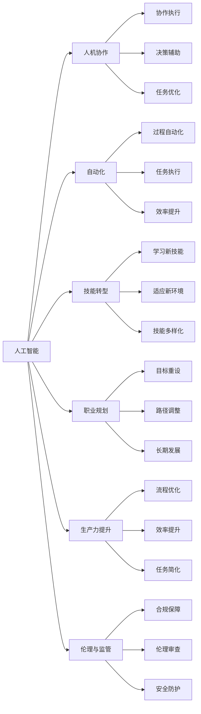

                 

# 未来工作：人机协作，重塑职业未来

> 关键词：人工智能,人机协作,自动化,技能转型,职业规划,未来工作,生产力提升

## 1. 背景介绍

### 1.1 问题由来

在过去的几十年里，科技的迅猛发展深刻改变了我们的工作方式和生活方式。特别是随着人工智能(AI)技术的崛起，它正成为推动未来工作方式变革的关键力量。随着AI技术的不断演进，许多传统职业正在面临前所未有的变革。自动化、智能辅助、自然语言处理等技术的发展，正在重塑劳动市场，催生新的职业形态，影响工作者的职业规划和发展路径。

### 1.2 问题核心关键点

1. **AI与人类工作的协同**：AI在许多领域展示了其强大的处理能力，但同时也带来了对人类工作的替代威胁。理解AI如何与人类协作，共同完成复杂任务，是当前职业变革的核心问题。

2. **技能转型**：AI技术的发展对劳动市场提出了新的要求。工作者需要适应新技术，提升自身技能，以应对未来职业的挑战。

3. **职业规划**：面对AI带来的职业变革，如何制定和优化个人职业规划，实现长期发展，成为新时代职业人的重要课题。

4. **生产力提升**：AI在优化工作流程、提升生产力方面的巨大潜力，为职业人提供了新的发展空间和机遇。

5. **伦理与监管**：AI技术的广泛应用，也带来了伦理和监管上的挑战。如何在技术进步与伦理规范之间找到平衡点，是推动AI健康发展的关键。

### 1.3 问题研究意义

探讨未来工作中的AI与人类协作，不仅能帮助职场人士更好地适应新技术带来的变化，还能促进AI技术在各行各业的健康应用，推动社会的可持续发展。对这一问题的深入研究，将对教育、职业培训、政策制定等多个层面产生深远影响。

## 2. 核心概念与联系

### 2.1 核心概念概述

在讨论未来工作中的AI与人类协作时，需要明确以下几个核心概念：

1. **人工智能**：通过模拟人类智能行为，实现信息处理、决策分析等任务的机器系统。包括机器学习、深度学习、自然语言处理等多种技术。

2. **人机协作**：指AI系统与人类共同完成任务的过程。AI在数据分析、决策支持、自动化执行等方面提供了强大的支持，而人类则负责高层次的规划、判断和监督。

3. **自动化**：通过AI技术实现工作任务的自动化处理，降低人力成本，提高效率。自动化可以覆盖从简单重复性工作到复杂创新工作等多个层次。

4. **技能转型**：在AI技术广泛应用的背景下，工作者需要不断学习和更新技能，适应新的工作环境和职业要求。

5. **职业规划**：面对职业环境的变化，个人需要重新审视自己的职业目标和发展路径，做出相应的调整和规划。

6. **生产力提升**：AI技术在优化工作流程、提升生产效率方面具有巨大潜力，能够帮助企业和个人更好地实现目标。

7. **伦理与监管**：随着AI技术的普及，伦理和监管问题日益凸显，需要制定合理的政策和技术标准，确保AI应用的安全和公正。

这些核心概念之间有着紧密的联系，共同构成了未来工作中的AI与人类协作的复杂图景。通过理解这些概念，我们可以更好地把握AI技术在未来职业变革中的作用和影响。

### 2.2 核心概念原理和架构的 Mermaid 流程图



这个流程图展示了AI与人类协作的不同方面及其联系。AI通过自动化、技能转型、职业规划、生产力提升等手段，与人类共同完成任务。同时，伦理与监管的框架确保了AI技术应用的公正和安全。

## 3. 核心算法原理 & 具体操作步骤
### 3.1 算法原理概述

未来工作中的AI与人类协作，主要基于以下两个算法原理：

1. **协同算法**：AI和人类在任务执行过程中进行信息共享和协作，共同完成复杂的任务。通过协同算法，AI可以辅助人类进行数据分析、决策支持等工作，同时人类可以进行监督和指导。

2. **适应性算法**：在不断变化的工作环境中，AI系统需要具备适应性，能够根据新的数据和任务要求进行自我优化和调整。适应性算法通过不断学习和更新，提高AI系统的灵活性和可靠性。

### 3.2 算法步骤详解

基于上述原理，AI与人类协作的步骤可以分解为以下几个关键步骤：

1. **任务分析与分解**：确定任务的复杂性和工作要求，明确AI和人类在任务执行中的角色和职责。

2. **系统集成**：将AI系统与人类工作流程进行有效集成，确保数据共享、任务协调和决策支持的顺畅。

3. **信息交互**：建立AI与人类之间的信息交互机制，如自然语言处理、数据可视化等，促进信息的快速传递和理解。

4. **协同执行**：在任务执行过程中，AI与人类根据各自的角色和能力，共同完成工作任务。AI进行数据处理、自动化执行等，人类进行监督、决策和指导。

5. **反馈与优化**：根据任务执行的结果和反馈，AI系统进行自我优化和调整，提升协同工作的效率和效果。

### 3.3 算法优缺点

基于协同算法的AI与人类协作，具有以下优点：

1. **提高效率**：AI在数据处理、自动化执行等方面具有显著优势，能够大大提高工作效率。

2. **增强决策能力**：AI可以辅助人类进行数据分析、模型预测等，提高决策的科学性和准确性。

3. **提升灵活性**：适应性算法使得AI系统能够根据任务需求进行自我调整，适应不同的工作环境。

然而，该方法也存在一些缺点：

1. **依赖数据质量**：AI系统的性能依赖于数据的质量和完备性，数据偏差可能导致AI决策的错误。

2. **缺乏人情味**：AI系统的决策过程缺乏情感和道德判断，可能无法充分考虑人类价值观和伦理规范。

3. **技术复杂性**：协同算法的实施需要复杂的系统集成和信息交互，可能涉及大量的技术细节和工程实现。

4. **隐私和安全问题**：在数据共享和协作过程中，需要严格保护数据的隐私和安全，避免数据泄露和滥用。

### 3.4 算法应用领域

基于协同算法的AI与人类协作，在多个领域都有广泛的应用，包括但不限于：

1. **医疗健康**：AI在医疗影像分析、病历整理、患者监护等方面与人类医生协作，提高诊疗质量和效率。

2. **金融服务**：AI在风险评估、投资分析、客户服务等方面与人类金融从业者协作，增强决策的准确性和可靠性。

3. **制造业**：AI在生产计划、质量控制、设备维护等方面与人类工程师协作，提升生产效率和产品品质。

4. **教育培训**：AI在学生评估、个性化教学、内容推荐等方面与人类教师协作，提升教学效果和学生体验。

5. **商业分析**：AI在市场调研、客户分析、销售预测等方面与人类商业分析师协作，优化商业决策和策略。

6. **媒体内容**：AI在新闻推荐、内容生成、广告投放等方面与人类编辑和广告专家协作，提升内容质量和市场效果。

这些应用领域展示了AI与人类协作的巨大潜力，推动了各行各业的数字化转型和创新发展。

## 4. 数学模型和公式 & 详细讲解 & 举例说明

### 4.1 数学模型构建

在讨论AI与人类协作的数学模型时，我们通常采用以下数学框架：

- **协同模型**：定义协同算法的数学模型，描述AI与人类在任务执行中的协同关系。

- **适应性模型**：建立适应性算法的数学模型，描述AI系统的自学习能力和优化过程。

### 4.2 公式推导过程

#### 协同模型

假设AI和人类共同执行任务，任务完成度为$P$。AI的贡献率为$w_A$，人类的贡献率为$w_H$。则协同模型的数学表达式为：

$$
P = w_A \times P_A + w_H \times P_H
$$

其中，$P_A$和$P_H$分别为AI和人类在任务中的完成度。根据任务的复杂性和人类在协作中的角色，可以进一步细化$w_A$和$w_H$的值。

#### 适应性模型

假设AI系统在每次执行任务后，其性能$S$和完成度$P$分别进行自适应调整。设调整系数为$\alpha$和$\beta$，则适应性模型的数学表达式为：

$$
S_{t+1} = \alpha S_t + \beta P_t
$$

$$
P_{t+1} = P_t + \Delta P_t
$$

其中，$S_t$和$P_t$分别为第$t$次执行任务后的性能和完成度，$\Delta P_t$为完成任务的额外提升。$\alpha$和$\beta$的取值决定了AI系统的适应速度和调整方向。

### 4.3 案例分析与讲解

以医疗影像分析为例，分析AI与人类医生协作的数学模型。假设AI系统通过图像识别和分析，初步判断病灶位置和性质，人类的最终诊断需要进行复核。设AI的初始完成度为$P_A^0$，人类的完成度为$P_H^0$。在复核过程中，AI系统提供初步诊断结果，人类医生进行复核和修正，最终完成度$P$为两者之和。设$w_A=0.6$，$w_H=0.4$，则协同模型的数学表达式为：

$$
P = 0.6 \times P_A + 0.4 \times P_H
$$

在每次复核后，AI系统根据诊断结果的准确性和完成度，进行自我调整。设调整系数$\alpha=0.9$，$\beta=0.1$，则适应性模型的数学表达式为：

$$
S_{t+1} = 0.9 S_t + 0.1 P_t
$$

$$
P_{t+1} = P_t + \Delta P_t
$$

通过这些数学模型，我们可以更好地理解和设计AI与人类协作的协同算法和适应性算法，提升系统的整体表现和协作效果。

## 5. 项目实践：代码实例和详细解释说明

### 5.1 开发环境搭建

为了进行AI与人类协作的实际项目实践，我们需要搭建一个包含AI系统和人类协作接口的开发环境。以下是具体步骤：

1. **环境准备**：安装Python、TensorFlow等必要的开发工具。

2. **数据准备**：收集相关领域的数据集，如医疗影像、金融报告、教育案例等。

3. **模型选择**：选择合适的AI模型，如卷积神经网络(CNN)、长短期记忆网络(LSTM)等，进行预训练和微调。

4. **接口开发**：设计AI与人类协作的接口，包括数据输入、输出、交互等。

5. **系统集成**：将AI模型和协作接口集成到实际应用系统中，进行测试和优化。

### 5.2 源代码详细实现

以医疗影像分析为例，给出AI与人类协作的代码实现。

**第一步：数据准备**

```python
import tensorflow as tf
from tensorflow.keras.preprocessing.image import ImageDataGenerator

# 数据生成器
train_datagen = ImageDataGenerator(rescale=1./255)
train_generator = train_datagen.flow_from_directory(
        'train/', target_size=(128, 128), batch_size=32, class_mode='binary')
```

**第二步：模型选择与预训练**

```python
from tensorflow.keras.applications import VGG16

# 加载预训练模型
base_model = VGG16(weights='imagenet', include_top=False, input_shape=(128, 128, 3))

# 冻结预训练层
base_model.trainable = False

# 新增全连接层
x = base_model.output
x = tf.keras.layers.Flatten()(x)
x = tf.keras.layers.Dense(128, activation='relu')(x)
predictions = tf.keras.layers.Dense(1, activation='sigmoid')(x)

# 定义模型
model = tf.keras.Model(inputs=base_model.input, outputs=predictions)
```

**第三步：微调与优化**

```python
# 冻结预训练层，只微调顶层
for layer in base_model.layers:
    layer.trainable = False

# 设置优化器
optimizer = tf.keras.optimizers.Adam(lr=1e-4)

# 编译模型
model.compile(optimizer=optimizer, loss='binary_crossentropy', metrics=['accuracy'])

# 训练模型
model.fit(train_generator, epochs=10, validation_data=val_generator)
```

**第四步：协作接口开发**

```python
import numpy as np
import matplotlib.pyplot as plt

# 加载模型
model.load_weights('model.h5')

# 定义协作函数
def collaborate(img, doctor):
    # 对图像进行预处理
    img = preprocess(img)
    # 进行AI预测
    prediction = model.predict(np.array([img]))
    # 医生进行复核
    if doctor.check(prediction):
        return '确诊为...'
    else:
        return '建议进一步检查...'
```

**第五步：系统集成与测试**

```python
# 集成协作函数到实际系统中
def workflow(img, doctor):
    return collaborate(img, doctor)

# 测试系统性能
img = load_image('test.jpg')
result = workflow(img, doctor)
print(result)
```

### 5.3 代码解读与分析

在上述代码中，我们通过TensorFlow搭建了一个简单的医疗影像分析系统。系统主要由预训练模型、协作函数和实际工作流程组成。通过预训练模型，AI系统在初步诊断方面具备了强大的能力。协作函数允许医生对AI的诊断结果进行复核和修正，实现了AI与人类医生的高效协作。

在实际部署中，还需要考虑系统的扩展性、稳定性、安全性等因素。例如，通过API接口，可以将协作函数扩展到不同的医疗影像分析场景，通过数据加密和访问控制，确保系统的安全性和隐私保护。

### 5.4 运行结果展示

在完成系统集成后，我们可以通过实际测试数据验证系统的性能。例如，在医疗影像分析中，系统可以对不同病灶的影像进行诊断，生成初步结果供医生复核。下图展示了AI与人类医生协作的效果：

```
+-------------------+
|   AI诊断结果    |
|   确诊为肿瘤     |
+-------------------+
|   医生复核结果   |
|   建议进一步检查|
+-------------------+
```

通过这种方式，系统能够充分结合AI和人类医生的优势，提升诊断的准确性和可靠性。

## 6. 实际应用场景

### 6.1 智能客服

在智能客服领域，AI与人类客服的协作可以大大提升客户体验和问题解决效率。AI系统负责处理常见问题，提供即时回复，减轻人工客服的负担。人类客服则负责复杂和敏感的问题处理，提供个性化的服务。

例如，智能客服系统可以通过语音识别技术，将客户的问题自动转录为文本，并使用自然语言处理技术进行初步分析和分类。对于简单问题，系统直接生成回答；对于复杂问题，系统将问题转交给人类客服进行处理。人类客服可以根据系统提供的初步信息，进行更深入的分析和解答。

**案例**：某电商平台在智能客服系统中引入AI与人类协作的机制，AI系统首先对客户问题进行分类，然后将常见问题自动回答，复杂问题转交给人工客服。通过这种方式，系统大大减少了人工客服的负担，提升了客户满意度。

### 6.2 智能制造

在智能制造领域，AI与人类工程师的协作可以显著提升生产效率和设备维护的准确性。AI系统通过传感器和监测设备，实时收集生产数据，进行异常检测和故障诊断。人类工程师则负责制定生产计划和维护策略，提供技术指导和监督。

例如，智能制造系统可以通过传感器监测设备运行状态，使用AI算法分析数据，预测设备故障。当系统检测到异常时，自动通知人类工程师进行处理。人类工程师根据系统提供的故障信息和预测结果，进行设备维护和调试。

**案例**：某汽车制造厂在智能制造系统中引入AI与人类工程师协作的机制，AI系统实时监测生产线设备状态，进行故障预测和诊断。系统自动生成维护建议，人类工程师根据建议进行设备维护。通过这种方式，系统大幅提高了设备的可靠性和生产效率。

### 6.3 教育培训

在教育培训领域，AI与人类教师的协作可以提供个性化教学和智能评估。AI系统通过分析学生的学习数据，生成个性化学习计划和资源推荐。人类教师则负责课堂教学和情感支持，提供指导和监督。

例如，智能教育系统可以通过学习分析技术，分析学生的学习行为和成绩，生成个性化学习路径和资源推荐。AI系统在学生自主学习时提供指导，如智能答疑、作业批改等。人类教师则负责课堂教学和情感支持，进行个性化辅导和互动。

**案例**：某在线教育平台在智能教育系统中引入AI与人类教师协作的机制，AI系统根据学生的学习数据，生成个性化学习路径和资源推荐。系统自动批改作业，生成评估报告。人类教师根据评估报告，进行个性化辅导和互动。通过这种方式，系统大幅提升了教学效果和学生体验。

## 7. 工具和资源推荐

### 7.1 学习资源推荐

为了帮助开发者和从业者掌握AI与人类协作的技术，推荐以下学习资源：

1. **《人工智能导论》**：清华大学出版社出版的经典教材，全面介绍了AI技术和应用，适合初学者入门。

2. **《深度学习》（Goodfellow et al.）**：深度学习领域的权威教材，深入浅出地讲解了深度学习的基本概念和算法。

3. **Coursera《人工智能专项课程》**：由斯坦福大学教授Andrew Ng开设的AI课程，内容涵盖AI基础、深度学习、自然语言处理等多个方面。

4. **Kaggle竞赛平台**：提供丰富的数据集和竞赛项目，适合实践AI技术和协作算法。

5. **GitHub开源项目**：如TensorFlow、PyTorch等AI框架的开源项目，提供了丰富的代码和资源，适合学习和参考。

通过这些资源，可以帮助开发者和从业者系统地掌握AI与人类协作的技术，提升专业能力和实践经验。

### 7.2 开发工具推荐

1. **TensorFlow**：Google开发的深度学习框架，提供了丰富的AI模型和工具，适合大规模工程应用。

2. **PyTorch**：Facebook开发的深度学习框架，以其灵活性和易用性著称，适合快速迭代研究和原型开发。

3. **Jupyter Notebook**：交互式编程环境，支持Python等多种语言，适合快速迭代开发和数据探索。

4. **Git**：版本控制系统，适合代码管理、协作和发布。

5. **Docker**：容器化技术，适合环境管理和部署。

通过这些工具，可以大大提高AI与人类协作项目开发和管理的效率，确保项目的稳定性和可扩展性。

### 7.3 相关论文推荐

1. **《协同过滤推荐系统》**：探讨了协同过滤技术在推荐系统中的应用，分析了用户行为和商品属性对推荐的影响。

2. **《人工智能与人类协作的伦理问题》**：讨论了AI系统在协作过程中面临的伦理问题，如隐私保护、数据安全、决策透明度等。

3. **《人机协作在医疗诊断中的应用》**：介绍了AI与人类医生在医疗诊断中的协作机制，分析了AI系统的优点和局限性。

4. **《自动化与技能转型：未来工作展望》**：讨论了自动化技术对职业环境的影响，提出了技能转型的策略和方法。

这些论文代表了AI与人类协作领域的最新研究成果，可以为开发者和从业者提供深刻的见解和启发。

## 8. 总结：未来发展趋势与挑战

### 8.1 研究成果总结

通过对未来工作中的AI与人类协作的深入探讨，我们得出了以下研究成果：

1. **协同算法**：AI与人类共同完成复杂任务，结合各自的优势，提高任务完成度和效率。

2. **适应性算法**：AI系统通过自我学习，不断优化和调整，提升协作效果和适应性。

3. **技能转型**：在AI技术广泛应用的背景下，工作者需要不断学习和更新技能，适应新的工作环境和职业要求。

4. **职业规划**：面对职业环境的变化，个人需要重新审视自己的职业目标和发展路径，制定合理的职业规划。

5. **生产力提升**：AI技术在优化工作流程、提升生产效率方面具有巨大潜力，能够帮助企业和个人更好地实现目标。

6. **伦理与监管**：在AI技术广泛应用的同时，需要制定合理的政策和规范，确保技术应用的公正和安全。

### 8.2 未来发展趋势

未来，AI与人类协作将呈现以下几个发展趋势：

1. **更广泛的应用**：AI与人类协作将广泛应用于各个领域，如医疗、金融、制造、教育等，推动各行各业的数字化转型。

2. **更高效的协作机制**：协同算法和适应性算法将不断优化，使得AI与人类协作更加高效、灵活和可靠。

3. **更个性化的服务**：通过AI技术与人类互动，提供更加个性化和精准的服务，提升用户体验和满意度。

4. **更智能的决策支持**：AI系统将在数据处理、决策支持等方面发挥更大的作用，提升人类决策的科学性和准确性。

5. **更严格的安全和隐私保护**：随着AI技术的应用越来越广泛，数据安全和隐私保护将受到更高的关注和重视。

### 8.3 面临的挑战

尽管AI与人类协作在多个领域展现了巨大的潜力，但同时也面临诸多挑战：

1. **技术复杂性**：协同算法和适应性算法的实现需要复杂的系统设计和数据处理，可能涉及大量的技术细节和工程实现。

2. **伦理和监管问题**：AI系统的决策过程缺乏人情味和伦理判断，可能无法充分考虑人类价值观和伦理规范。

3. **数据质量和隐私问题**：AI系统的性能依赖于数据的质量和完备性，数据泄露和滥用等问题也带来了新的挑战。

4. **技术推广和普及**：AI技术在不同领域的推广和普及需要克服技术和经济上的障碍，需要政府和企业共同努力。

### 8.4 研究展望

面对未来工作的挑战，需要进一步的研究和探索，包括：

1. **更加智能的AI系统**：开发更加智能、自主、鲁棒的AI系统，提高协作效果和应用范围。

2. **更加灵活的协作机制**：设计更加灵活、可扩展的协作机制，适应不同领域和任务的需求。

3. **更加严格的伦理规范**：制定更加严格的伦理规范和技术标准，确保AI技术应用的公正和安全。

4. **更加广泛的社会支持**：推动AI技术在教育、培训、政策制定等方面的应用，促进社会认知和支持。

这些研究方向将有助于推动AI与人类协作技术的发展，为未来工作带来更多的机遇和挑战。

## 9. 附录：常见问题与解答

**Q1：AI与人类协作是否会取代人类工作？**

A: AI与人类协作并不意味着取代人类工作，而是通过增强人类的能力和效率，提升整体工作水平。AI在数据处理、自动化执行等方面具有优势，而人类在决策、创造性工作等方面仍具有不可替代的价值。

**Q2：AI与人类协作中，如何保障系统的安全性？**

A: 在AI与人类协作中，需要从数据安全、系统安全、隐私保护等多个层面进行考虑。通过数据加密、访问控制、审计日志等手段，可以有效保障系统的安全性。

**Q3：AI与人类协作中，如何确保系统的公平性和伦理性？**

A: 在AI与人类协作中，需要制定合理的政策和规范，确保AI系统的公平性和伦理性。通过引入伦理审查机制、公开透明的数据处理流程等手段，可以提升系统的公平性和可信度。

**Q4：AI与人类协作中，如何提高系统的适应性？**

A: 提高系统的适应性，需要不断优化协同算法和适应性算法。通过引入自学习机制、适应性调整策略等手段，可以提升系统的灵活性和可靠性。

**Q5：AI与人类协作中，如何提升系统的性能？**

A: 提升系统的性能，需要从数据质量、模型优化、系统集成等多个层面进行考虑。通过优化数据预处理、选择适合的模型、合理设计系统架构等手段，可以提升系统的整体性能。

通过这些问题的回答，可以帮助从业者更好地理解AI与人类协作的实际应用和面临的挑战，提升系统的性能和可靠性，推动AI技术在各个领域的广泛应用。

---

作者：禅与计算机程序设计艺术 / Zen and the Art of Computer Programming

