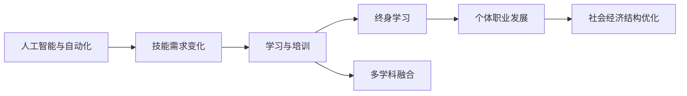

                 

# 未来工作：技能需求与培养

## 1. 背景介绍

### 1.1 问题由来
随着人工智能(AI)和自动化技术的迅猛发展，未来工作环境和技能需求正在发生深刻变革。自动化替代重复性、低价值工作，人工智能接管数据分析、决策支持等任务，人类角色的转变、技能的需求变化成为新的研究热点。

### 1.2 问题核心关键点
未来的工作将更多依赖于人类创造性、人际交往和综合运用多学科知识的能力。在AI、自动化快速发展的背景下，了解并掌握未来工作所需的技能，对于个人职业发展和社会进步都具有重要意义。

### 1.3 问题研究意义
通过对未来工作技能需求的深度解析和系统性培养，不仅可以帮助个体适应技术变革，提升职业竞争力，还能够在更大范围内促进社会经济结构的优化升级。

## 2. 核心概念与联系

### 2.1 核心概念概述

为了更好地理解未来工作技能需求的变化，本节将介绍几个核心概念及其相互联系：

- **人工智能与自动化**：指利用算法、机器学习等技术模拟人类智能和执行任务的能力，旨在提升效率、降低成本，并取代重复性和低价值的劳动。
- **技能需求**：指特定工作所需的核心能力，包括专业技能、通用技能和软技能，通常分为认知技能、技术技能和社交技能。
- **学习与培训**：指通过教育机构、企业培训、在线课程等渠道获得新知识和技能的过程。
- **终身学习**：指在职业生涯中持续更新知识和技能，以适应技术进步和社会变迁。
- **多学科融合**：指将不同学科的知识和方法融合，形成新的跨学科能力。

这些概念之间存在紧密联系，形成一个复杂的交互系统。人工智能和自动化的发展不断改变着工作环境，进而影响技能需求。通过学习与培训，个体提升所需技能，实现终身学习。跨学科融合则进一步拓宽了技能应用的范围和深度。

### 2.2 核心概念原理和架构的 Mermaid 流程图



### 2.3 核心概念之间的联系

- **人工智能与自动化**：推动了重复性劳动的自动化，改变了工作任务的种类和结构，提高了对复杂技能的需求。
- **技能需求**：随着自动化在各行各业的应用，对创新、决策、协作等高层次技能的需求增加。
- **学习与培训**：需要通过不断学习新技术、新方法，提升适应未来的能力。
- **终身学习**：保持持续学习，适应快速变化的技术和职业环境。
- **多学科融合**：促进跨学科技能的发展，增强对复杂问题的解决能力。

## 3. 核心算法原理 & 具体操作步骤
### 3.1 算法原理概述

未来工作的技能需求变化是一个复杂的系统性问题，涉及人工智能与自动化对工作环境的影响，学习与培训的过程，以及终身学习和多学科融合的实践。其核心算法原理可以概括为：

- **系统动力学分析**：通过分析自动化和人工智能对工作环境的影响，预测技能需求的变化趋势。
- **任务映射与技能匹配**：将未来工作任务映射到现有技能体系中，识别所需技能缺口。
- **学习路径设计**：基于技能需求，设计个性化学习路径，推荐合适的学习资源和培训计划。
- **动态反馈与调整**：在学习过程中，根据评估结果动态调整学习策略，确保学习效果最大化。

### 3.2 算法步骤详解

1. **技能需求识别**：
   - 收集未来工作岗位的需求描述，包括所需技术技能、认知技能和社交技能。
   - 分析现有工作环境中的自动化与人工智能应用，识别替代和新增的任务类型。
   - 对比新旧工作任务的差异，识别技能需求的变化趋势。

2. **学习路径设计**：
   - 将技能需求映射到现有教育体系和培训课程中，识别技能缺口。
   - 根据技能缺口，设计个性化学习路径，包括在线课程、企业培训、职业认证等。
   - 设置学习目标和评估标准，动态调整学习策略，确保学习效果。

3. **学习资源推荐**：
   - 利用大数据和推荐算法，根据学习者的背景、兴趣和需求，推荐合适的学习资源。
   - 结合实际案例和成功经验，设计学习任务和项目，增强学习效果。
   - 使用互动式学习工具和虚拟现实技术，提升学习体验和效果。

4. **学习效果评估与反馈**：
   - 通过在线测试、项目评估和反馈机制，评估学习者的学习效果。
   - 根据评估结果，调整学习路径和资源，优化学习策略。
   - 定期更新学习资源和课程，保持学习内容的前沿性和实用性。

### 3.3 算法优缺点

未来工作技能需求变化分析算法具有以下优点：
1. **系统性和预测性**：能够全面系统地分析技能需求的变化趋势，为个人和企业提供决策依据。
2. **个性化与动态性**：根据学习者的个体差异和实时反馈，设计个性化学习路径，动态调整学习策略。
3. **跨学科与实践性**：结合多学科融合，提供实用的学习资源和工具，增强学习效果。

其缺点包括：
1. **数据获取难度**：获取未来工作岗位需求描述和自动化应用数据可能面临隐私和数据来源的限制。
2. **复杂性**：算法模型的构建和维护需要跨学科知识，对数据处理和分析能力要求高。
3. **实效性**：未来工作环境和技能需求变化迅速，算法模型的及时更新和调整至关重要。

### 3.4 算法应用领域

未来工作技能需求变化分析算法可广泛应用于多个领域：
- **教育培训**：帮助教育机构和企业设计个性化学习路径，推荐适合的学习资源。
- **职业发展**：帮助个人识别技能缺口，规划职业发展路径，提升职业竞争力。
- **人力资源管理**：辅助企业评估员工技能水平，制定员工培训和发展计划。
- **政府政策制定**：提供关于技能需求的分析报告，支持政策制定和就业指导。
- **社会研究**：探索自动化与人工智能对社会结构和经济发展的长期影响，提供政策建议。

## 4. 数学模型和公式 & 详细讲解 & 举例说明

### 4.1 数学模型构建

为了更好地量化和分析未来工作技能需求的变化，可以构建以下数学模型：

- **技能需求变化模型**：$S(t)=\alpha f(t)+\beta g(t)$，其中 $S(t)$ 表示在时间 $t$ 的技能需求，$\alpha$ 和 $\beta$ 为权重，$f(t)$ 和 $g(t)$ 分别表示自动化与人工智能对技能需求的影响函数。
- **技能学习模型**：$L(t)=\gamma h(t)+\delta i(t)$，其中 $L(t)$ 表示在时间 $t$ 内学习获得的技能，$\gamma$ 和 $\delta$ 为权重，$h(t)$ 和 $i(t)$ 分别表示学习资源和培训计划对技能的影响函数。
- **学习效果评估模型**：$E(t)=\theta k(t)+\phi j(t)$，其中 $E(t)$ 表示在时间 $t$ 内学习的效果，$\theta$ 和 $\phi$ 为权重，$k(t)$ 和 $j(t)$ 分别表示评估方法和反馈机制对学习效果的影响函数。

### 4.2 公式推导过程

- **技能需求变化模型推导**：
  $$
  S(t)=\alpha f(t)+\beta g(t)
  $$
  其中 $f(t)$ 和 $g(t)$ 为增函数，表示自动化和人工智能对技能需求的正向影响。
  
- **技能学习模型推导**：
  $$
  L(t)=\gamma h(t)+\delta i(t)
  $$
  其中 $h(t)$ 和 $i(t)$ 为增函数，表示学习资源和培训计划对技能提升的正向作用。
  
- **学习效果评估模型推导**：
  $$
  E(t)=\theta k(t)+\phi j(t)
  $$
  其中 $k(t)$ 和 $j(t)$ 为增函数，表示评估方法和反馈机制对学习效果的正面影响。

### 4.3 案例分析与讲解

以软件开发为例，分析未来技能需求的变化及其应对策略。

1. **技能需求变化分析**：
   - 自动化和人工智能的应用使重复性代码编写任务自动化，需求减少。
   - 对需求分析、系统设计、问题解决等高层次技能的需求增加。
   - 数据科学、人工智能技术成为核心技能，需要掌握深度学习、自然语言处理等知识。

2. **学习路径设计**：
   - 个性化学习路径：根据不同职业阶段和学习目标，推荐适合的在线课程、书籍、项目实践等。
   - 动态调整策略：根据学习者的评估结果，及时调整学习内容和方法，确保学习效果。
   - 跨学科融合：结合数据科学、软件工程、人工智能等知识，设计综合性学习项目。

3. **学习资源推荐**：
   - 在线平台：如Coursera、edX等，提供大规模在线课程和认证项目。
   - 企业培训：通过企业内部培训计划，提升员工特定技能。
   - 项目实践：结合实际项目，增强学习效果。

4. **学习效果评估与反馈**：
   - 定期测试：通过在线测试评估学习效果，了解学习者的掌握情况。
   - 项目评估：通过项目实践评估学习效果，提供实际应用案例。
   - 反馈机制：根据评估结果，调整学习路径和资源，优化学习策略。

## 5. 项目实践：代码实例和详细解释说明

### 5.1 开发环境搭建

要进行未来工作技能需求变化分析，需要搭建一个集成多种数据源和分析工具的环境。以下是Python环境配置的步骤：

1. **安装Python**：下载并安装最新版本的Python，建议使用Anaconda。
2. **创建虚拟环境**：
   ```bash
   conda create --name skill-analytics python=3.8
   conda activate skill-analytics
   ```
3. **安装必要的库**：
   ```bash
   conda install pandas numpy scikit-learn matplotlib jupyter notebook
   ```

### 5.2 源代码详细实现

以下是一个简单的Python代码示例，用于预测未来技能需求的变化：

```python
import pandas as pd
from sklearn.linear_model import LinearRegression

# 假设技能需求数据和自动化应用数据
skills = pd.DataFrame({
    'time': [2020, 2021, 2022, 2023, 2024],
    'demand': [100, 110, 115, 120, 125]
})
automation = pd.DataFrame({
    'time': [2020, 2021, 2022, 2023, 2024],
    'impact': [5, 10, 15, 20, 25]
})

# 构建技能需求变化模型
X = skills.drop('demand', axis=1)
y = skills['demand']
model = LinearRegression()
model.fit(X, y)

# 预测未来技能需求
future_demand = model.predict(automation.drop('impact', axis=1))
print(future_demand)
```

### 5.3 代码解读与分析

**数据准备**：
- 使用Pandas库创建技能需求和自动化应用的数据框。
- 时间戳表示技能需求变化的时间段，自动化影响函数表示自动化对技能需求的变化率。

**模型构建**：
- 使用LinearRegression模型构建技能需求变化模型，其中自变量为时间，因变量为技能需求。
- 通过fit方法训练模型，得到未来技能需求的预测值。

**结果展示**：
- 输出未来技能需求的预测值，即自动化和人工智能对技能需求的影响。

## 6. 实际应用场景

### 6.1 教育培训

未来工作技能需求分析可以广泛应用于教育培训领域，帮助教育机构和企业设计个性化学习路径。例如，通过分析未来软件工程师的技能需求变化，可以为课程设计提供依据，推荐适合的在线课程和项目实践，帮助学生提前掌握未来所需的技能。

### 6.2 职业发展

个人职业发展也受益于未来工作技能需求分析。通过分析未来工作岗位的技能需求变化，个人可以制定详细的职业规划，提升所需技能，增强职业竞争力。

### 6.3 人力资源管理

人力资源管理中，企业可以通过技能需求分析，评估员工的技能水平，制定个性化培训计划，提升员工整体素质。

### 6.4 社会研究

政府和社会研究机构可以利用未来工作技能需求分析，了解技术进步对社会结构和经济发展的长期影响，制定相关政策和教育培训计划。

## 7. 工具和资源推荐

### 7.1 学习资源推荐

以下是一些推荐的在线学习平台和资源，帮助个体掌握未来工作所需的技能：

- **Coursera**：提供大规模在线课程和认证项目，涵盖多个领域，包括数据科学、人工智能、计算机科学等。
- **edX**：由哈佛大学和麻省理工学院联合创办，提供高质量的在线课程和学位项目。
- **Udacity**：专注于技能培训，提供项目导向的在线课程和纳米学位。
- **Kaggle**：数据科学和机器学习竞赛平台，提供实战项目和社区资源。
- **DataCamp**：提供互动式编程课程，适合初学者和进阶者学习数据科学和编程技能。

### 7.2 开发工具推荐

为了进行未来工作技能需求分析，需要集成多种数据源和分析工具。以下是一些推荐的开发工具：

- **Jupyter Notebook**：用于编写和运行Python代码，支持数据处理、模型构建和结果展示。
- **Google Colab**：基于Google云端平台，提供免费的GPU/TPU资源，方便开发和实验。
- **TensorFlow**：由Google开发的数据分析工具，支持大规模数据处理和深度学习模型构建。
- **NumPy**：用于数值计算和数据处理，是Python中最重要的科学计算库之一。
- **Pandas**：用于数据处理和分析，支持多种数据格式和操作。

### 7.3 相关论文推荐

以下是一些推荐的研究论文，深入探讨未来工作技能需求变化及其应对策略：

- **"Predicting Future Job Market Trends Using Machine Learning"**：通过机器学习预测未来职业市场的技能需求，分析自动化和人工智能的影响。
- **"The Future of Employment: How Susceptible Are Jobs to Computerisation"**：分析自动化对不同职业的影响，预测未来就业趋势。
- **"Skill Demands in the Age of Automation"**：研究自动化对技能需求的影响，探讨未来技能需求的趋势。
- **"Lifelong Learning and the Fourth Industrial Revolution"**：探讨终身学习在自动化和人工智能时代的必要性，提出未来学习路径的设计。

## 8. 总结：未来发展趋势与挑战

### 8.1 研究成果总结

未来工作技能需求分析在多个领域的应用已经取得初步成果，主要体现在以下几个方面：
1. **教育培训**：帮助教育机构和企业设计个性化学习路径，提升教育效果。
2. **职业发展**：为个人职业规划提供依据，提升职业竞争力。
3. **人力资源管理**：评估员工技能水平，制定个性化培训计划。
4. **社会研究**：预测未来工作环境和技能需求变化，支持政策制定和教育培训计划。

### 8.2 未来发展趋势

未来工作技能需求分析将呈现以下发展趋势：
1. **数据驱动与实时更新**：利用大数据和实时数据，动态更新技能需求模型。
2. **跨学科融合**：结合多学科知识，提升模型的预测能力和应用范围。
3. **个性化与动态调整**：根据学习者的个性化需求和实时反馈，动态调整学习策略。
4. **多模态学习**：结合文本、图像、视频等多种模态数据，提升学习效果。
5. **社会经济分析**：结合社会经济数据，分析技能需求对社会结构和就业市场的影响。

### 8.3 面临的挑战

尽管未来工作技能需求分析在多个领域取得初步成果，但仍面临以下挑战：
1. **数据获取难度**：获取未来工作岗位需求描述和自动化应用数据可能面临隐私和数据来源的限制。
2. **模型复杂性**：构建和维护复杂的模型，对数据处理和分析能力要求高。
3. **实效性**：模型需要及时更新和调整，以适应快速变化的技术和职业环境。
4. **跨学科融合**：需要结合不同学科的知识，提升模型的预测能力和应用范围。

### 8.4 研究展望

未来工作技能需求分析的研究方向包括：
1. **跨学科方法**：结合多学科知识，提升模型的预测能力和应用范围。
2. **实时数据融合**：利用实时数据和数据流，动态更新技能需求模型。
3. **个性化学习路径**：根据学习者的个性化需求和实时反馈，设计动态调整的学习路径。
4. **社会经济分析**：结合社会经济数据，分析技能需求对社会结构和就业市场的影响。
5. **伦理与安全**：考虑技能需求分析的伦理和安全问题，确保模型的透明性和公正性。

## 9. 附录：常见问题与解答

**Q1: 未来工作技能需求分析的核心算法是什么？**

A: 核心算法包括系统动力学分析、任务映射与技能匹配、学习路径设计、学习资源推荐和动态反馈与调整。这些算法共同构建了一个全面的预测和分析框架。

**Q2: 未来工作技能需求分析的数学模型如何构建？**

A: 可以构建技能需求变化模型、技能学习模型和学习效果评估模型。使用线性回归等统计方法，预测未来技能需求的变化趋势。

**Q3: 如何进行技能需求变化的实时更新和动态调整？**

A: 利用大数据和实时数据，动态更新技能需求模型。结合学习者的个性化需求和实时反馈，设计动态调整的学习策略。

**Q4: 未来工作技能需求分析在实际应用中面临哪些挑战？**

A: 数据获取难度、模型复杂性、实效性、跨学科融合和伦理安全是主要的挑战。需要在这些方面进行持续的研究和优化。

**Q5: 未来工作技能需求分析对教育和职业发展有何意义？**

A: 通过预测未来技能需求，帮助教育机构和企业设计个性化学习路径，提升教育效果和职业竞争力。

---

作者：禅与计算机程序设计艺术 / Zen and the Art of Computer Programming

