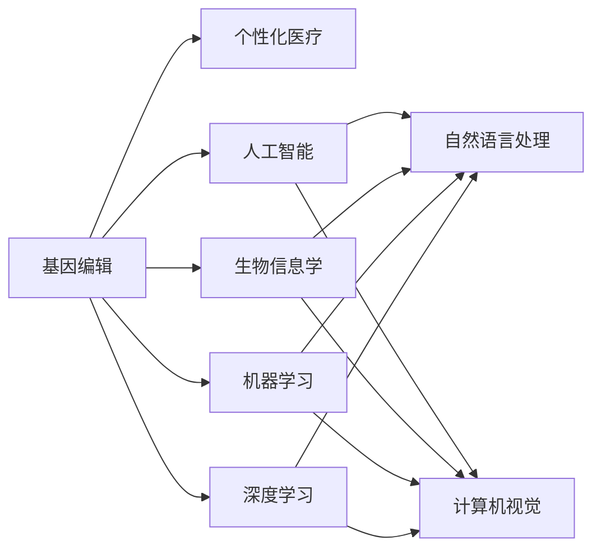

                 

# 未来的个性化医疗：2050年的基因编辑婴儿与人体增强

> 关键词：基因编辑,个性化医疗,生物信息学,人工智能,机器学习,深度学习

## 1. 背景介绍

在2050年，个性化医疗已不再是科幻小说中的构想，而是我们生活中不可或缺的一部分。随着基因编辑技术的突破性进展，我们不仅能对疾病进行诊断和治疗，还能对基因进行精确的修改，打造出具有极高适应性的生命体。这一技术不仅改变了医学的命运，也引领了新一轮的工业革命。

个性化医疗的核心在于根据每个个体的基因信息，量身定制治疗方案。这不仅需要高度精准的医疗数据，还需要高效的计算和分析工具。基因编辑婴儿的诞生，标志着个性化医疗迈出了坚实的一步。通过基因编辑技术，我们不仅能修复已知的遗传疾病，还能对未来的健康进行主动干预。这不仅对医学领域产生了深远影响，也对社会伦理、法律监管提出了新的挑战。

### 1.1 技术背景

基因编辑技术主要有两类：基于CRISPR/Cas9的核酸酶技术和基于转录激活样效应的类转录激活因子效应物技术(TALENs)。这两种技术都能精准地切割DNA，并引导细胞进行基因修复。基因编辑技术为个性化医疗提供了可能性，使得我们对基因异常进行修复或更改成为现实。

个性化医疗的实现，需要整合大数据、人工智能、生物信息学等多个领域的知识。机器学习和深度学习在基因数据分析和疾病预测中发挥了重要作用。通过深度学习模型，我们可以从基因序列中提取潜在的疾病相关特征，实现更精准的疾病预测和治疗。

## 2. 核心概念与联系

### 2.1 核心概念概述

为了更好地理解个性化医疗中的基因编辑技术，我们将介绍几个关键概念：

- **基因编辑**：通过对DNA进行精确的切割和修复，改变生物体的基因序列，从而实现对特定基因的修改。
- **个性化医疗**：根据患者的基因信息和病史，量身定制的治疗方案，旨在提供更精准、更有效的医疗服务。
- **生物信息学**：研究生物信息与计算机技术结合的科学，涉及基因组学、蛋白质组学、转录组学等领域。
- **机器学习与深度学习**：一种从数据中学习和发现模式的算法，广泛应用于基因数据分析和疾病预测。
- **人工智能(AI)**：模拟人类智能的技术，包括机器学习、自然语言处理、计算机视觉等。

这些概念之间的联系可以通过以下Mermaid流程图来展示：



这个流程图展示了几类核心概念之间的关系：

1. 基因编辑是实现个性化医疗的基础技术。
2. 个性化医疗依赖于生物信息学，对基因数据进行全面分析。
3. 机器学习和深度学习在数据处理和模式识别中发挥作用。
4. 人工智能是机器学习和深度学习的延伸，涵盖多种智能技术。
5. 自然语言处理和计算机视觉等技术，在个性化医疗中也有重要应用。

这些概念共同构成了个性化医疗的框架，为我们提供了从基因到疾病预测和治疗的全过程。

## 3. 核心算法原理 & 具体操作步骤
### 3.1 算法原理概述

个性化医疗中的基因编辑和数据分析，涉及多个学科的算法和技术。其核心算法原理包括：

- **基因编辑算法**：通过设计合适的核酸酶，实现对目标基因的精确切割。
- **数据预处理算法**：从生物样本中提取基因序列数据，并进行预处理和清洗。
- **特征提取算法**：从基因序列数据中提取有用的特征，用于疾病预测和基因分析。
- **机器学习算法**：利用训练好的模型，对新样本进行疾病预测和基因诊断。
- **深度学习算法**：通过神经网络模型，进一步提高数据分析的精度和泛化能力。

个性化医疗的实现流程包括以下几个关键步骤：

1. **基因采样与序列分析**：从患者中提取基因序列数据，并对其进行分析和预处理。
2. **特征提取与模型训练**：从基因序列中提取特征，用于训练机器学习和深度学习模型。
3. **疾病预测与基因诊断**：利用训练好的模型，对新样本进行疾病预测和基因诊断。
4. **基因编辑与治疗**：根据基因诊断结果，进行基因编辑，并实施个性化治疗方案。

### 3.2 算法步骤详解

个性化医疗中的基因编辑和数据分析，涉及多个学科的算法和技术。其核心算法原理包括：

1. **基因编辑算法**：
   - **目标基因设计**：根据目标基因序列，设计合适的核酸酶，如Cas9、TALEN等。
   - **切割效率优化**：优化核酸酶的设计，使其在目标基因处高效切割。
   - **切割位点选择**：选择合适的切割位点，避免对非目标基因造成影响。

2. **数据预处理算法**：
   - **基因序列提取**：从生物样本中提取DNA或RNA序列。
   - **清洗和校验**：去除噪声和低质量数据，校验数据完整性。
   - **标准化格式**：将不同格式的数据转换为标准格式，便于后续分析。

3. **特征提取算法**：
   - **序列比对**：利用序列比对工具，如BLAST、Bowtie等，进行基因序列比对。
   - **特征提取**：从比对结果中提取有用的特征，如突变位点、基因表达量等。
   - **特征降维**：利用PCA、t-SNE等方法，对高维特征进行降维处理。

4. **机器学习算法**：
   - **数据划分**：将数据集分为训练集、验证集和测试集。
   - **模型选择**：选择合适的机器学习模型，如随机森林、SVM等。
   - **交叉验证**：利用交叉验证技术，评估模型性能。

5. **深度学习算法**：
   - **网络设计**：设计适合的深度学习网络结构，如卷积神经网络(CNN)、循环神经网络(RNN)等。
   - **损失函数选择**：选择合适的损失函数，如交叉熵、均方误差等。
   - **优化器选择**：选择合适的优化器，如Adam、SGD等。

### 3.3 算法优缺点

个性化医疗中的基因编辑和数据分析算法，具有以下优点和缺点：

**优点**：
- **高精度**：基因编辑技术可以精确修改基因，提供高精度的基因诊断和治疗。
- **个性定制**：根据患者的具体基因信息，量身定制个性化治疗方案。
- **快速应用**：深度学习模型能够快速处理大量基因数据，提升疾病预测和诊断的效率。

**缺点**：
- **成本高**：基因编辑和深度学习需要昂贵的设备和计算资源。
- **伦理争议**：基因编辑技术引发了伦理争议，如基因编辑的道德界限、隐私保护等问题。
- **复杂性高**：算法和技术复杂，需要高水平的专家团队进行开发和维护。

### 3.4 算法应用领域

个性化医疗中的基因编辑和数据分析算法，已经在多个领域得到应用，例如：

- **基因治疗**：通过对特定基因进行编辑，治疗遗传性疾病，如囊肿性纤维化、镰状细胞贫血等。
- **疾病预测**：利用深度学习模型，从基因数据中预测疾病风险，如癌症、糖尿病等。
- **基因诊断**：通过基因编辑和深度学习，实现对罕见病、遗传病的精准诊断。
- **药物研发**：利用基因编辑技术，加速药物筛选和研发过程，提高新药的成功率。
- **个性化营养**：根据个体的基因信息，制定个性化的饮食和营养方案，提升健康水平。

除了这些领域外，个性化医疗技术还将广泛应用于农业、环境监测、生物安全等更多领域，为人类带来更多福祉。

## 4. 数学模型和公式 & 详细讲解 & 举例说明

### 4.1 数学模型构建

为了更好地理解个性化医疗中的基因编辑和数据分析算法，我们接下来将详细讲解数学模型和公式。

记基因序列数据为 $D=\{x_i\}_{i=1}^N$，其中 $x_i$ 为第 $i$ 个样本的基因序列。假设 $x_i$ 的长度为 $L$，每个基因位点上的核苷酸类型为 $A, C, G, T$ 之一。令 $y_i$ 为样本的疾病标签，其中 $y_i=1$ 表示患者患有疾病，$y_i=0$ 表示患者未患病。

个性化医疗的数学模型可以表示为：

$$
P(y_i|x_i;\theta) = \sigma(\sum_{j=1}^{L} w_j f(x_i, j; \theta))
$$

其中，$\sigma$ 为 sigmoid 函数，$w_j$ 为第 $j$ 个基因位点的权重，$f(x_i, j; \theta)$ 为第 $j$ 个基因位点的特征函数，$\theta$ 为模型参数。

### 4.2 公式推导过程

个性化医疗中的基因编辑和数据分析算法，涉及多个领域的数学公式。以下我们将重点介绍基因编辑算法和深度学习模型中的关键公式。

**基因编辑算法中的关键公式**：

1. **核酸酶设计公式**：
   - **Cas9设计**：
     - **目标序列识别**：设计针对目标序列的gRNA，用于引导Cas9切割。
     - **切割位点选择**：选择切割位点，确保Cas9切割效率和准确性。
   - **TALEN设计**：
     - **目标序列识别**：设计针对目标序列的TALE，用于引导Cas9切割。
     - **切割位点选择**：选择切割位点，确保TALE切割效率和准确性。

2. **基因序列比对公式**：
   - **BLAST算法**：
     - **比对公式**：
       $$
       \text{Best Align} = \max_{i} \text{Score}_i
       $$
     - **评分函数**：
       $$
       \text{Score}_i = \sum_{j} \text{Match}_j - \sum_{j} \text{Gap}_j
       $$
     - **匹配函数**：
       $$
       \text{Match}_j = \begin{cases}
       1 & \text{匹配} \\
       0 & \text{不匹配}
       \end{cases}
       $$
     - **间隙函数**：
       $$
       \text{Gap}_j = \begin{cases}
       -1 & \text{间隙} \\
       0 & \text{不间隙}
       \end{cases}
       $$

**深度学习模型中的关键公式**：

1. **卷积神经网络(CNN)公式**：
   - **卷积操作公式**：
     - **二维卷积**：
       $$
       \text{Conv2D}(x, k, s, p) = \sum_{i,j} x_{i,j} k_{i,j}
       $$
     - **池化操作公式**：
       $$
       \text{MaxPool2D}(x, k, s, p) = \max_{i,j} x_{i,j}
       $$

2. **循环神经网络(RNN)公式**：
   - **循环操作公式**：
     - **LSTM单元公式**：
       $$
       h_t = \tanh(w_c h_{t-1} + u_c x_t + b_c)
       $$
     - **遗忘门公式**：
       $$
       f_t = \sigma(w_f h_{t-1} + u_f x_t + b_f)
       $$
     - **输入门公式**：
       $$
       i_t = \sigma(w_i h_{t-1} + u_i x_t + b_i)
       $$
     - **输出门公式**：
       $$
       o_t = \sigma(w_o h_{t-1} + u_o x_t + b_o)
       $$

### 4.3 案例分析与讲解

**基因编辑案例分析**：

假设我们要对患有镰状细胞贫血的患者进行基因编辑。首先，我们需要设计Cas9核酸酶，识别患者的镰状细胞贫血相关基因位点。然后，在实验室中通过电穿孔技术将Cas9核酸酶导入患者的造血干细胞中。Cas9核酸酶会在目标基因位点处切割DNA，引起基因重组，从而修复突变基因。

**深度学习案例讲解**：

假设我们要利用深度学习模型对患者进行癌症预测。首先，我们需要从患者的基因序列中提取特征，如基因突变位点、基因表达量等。然后，我们将这些特征输入到深度学习模型中，利用训练好的模型预测患者是否患有癌症。在训练过程中，我们使用交叉熵损失函数，优化器选择Adam，学习率为0.001。在测试阶段，我们使用测试集对模型进行评估，计算准确率、召回率和F1分数等指标。

## 5. 项目实践：代码实例和详细解释说明
### 5.1 开发环境搭建

在进行个性化医疗中的基因编辑和数据分析项目实践前，我们需要准备好开发环境。以下是使用Python进行PyTorch开发的环境配置流程：

1. 安装Anaconda：从官网下载并安装Anaconda，用于创建独立的Python环境。

2. 创建并激活虚拟环境：
```bash
conda create -n pytorch-env python=3.8 
conda activate pytorch-env
```

3. 安装PyTorch：根据CUDA版本，从官网获取对应的安装命令。例如：
```bash
conda install pytorch torchvision torchaudio cudatoolkit=11.1 -c pytorch -c conda-forge
```

4. 安装Transformers库：
```bash
pip install transformers
```

5. 安装各类工具包：
```bash
pip install numpy pandas scikit-learn matplotlib tqdm jupyter notebook ipython
```

完成上述步骤后，即可在`pytorch-env`环境中开始项目实践。

### 5.2 源代码详细实现

这里我们以基因编辑和深度学习模型为例，给出使用Transformers库对基因序列进行疾病预测的PyTorch代码实现。

首先，定义基因序列数据集：

```python
from torch.utils.data import Dataset
import torch

class GenomeDataset(Dataset):
    def __init__(self, genomes, labels, seq_len):
        self.genomes = genomes
        self.labels = labels
        self.seq_len = seq_len

    def __len__(self):
        return len(self.genomes)

    def __getitem__(self, idx):
        genome = self.genomes[idx]
        label = self.labels[idx]
        
        # 对基因序列进行填充，使其长度一致
        max_len = max([len(g) for g in genome])
        genome = [g + (self.seq_len - len(g)) * ['-'] for g in genome]
        
        # 将基因序列转换为tensor
        genome = [torch.tensor(g, dtype=torch.long) for g in genome]
        
        return {'genome': genome, 'label': label}
```

然后，定义深度学习模型：

```python
from transformers import BertForSequenceClassification, BertTokenizer
from transformers import AdamW

model = BertForSequenceClassification.from_pretrained('bert-base-uncased', num_labels=2)

tokenizer = BertTokenizer.from_pretrained('bert-base-uncased')
seq_len = 128
```

接着，定义训练和评估函数：

```python
from torch.utils.data import DataLoader
from tqdm import tqdm

device = torch.device('cuda') if torch.cuda.is_available() else torch.device('cpu')
model.to(device)

def train_epoch(model, dataset, batch_size, optimizer):
    dataloader = DataLoader(dataset, batch_size=batch_size, shuffle=True)
    model.train()
    epoch_loss = 0
    for batch in tqdm(dataloader, desc='Training'):
        genome, label = batch['genome'].to(device), batch['label'].to(device)
        outputs = model(genome)
        loss = outputs.loss
        epoch_loss += loss.item()
        loss.backward()
        optimizer.step()
    return epoch_loss / len(dataloader)

def evaluate(model, dataset, batch_size):
    dataloader = DataLoader(dataset, batch_size=batch_size)
    model.eval()
    preds, labels = [], []
    with torch.no_grad():
        for batch in tqdm(dataloader, desc='Evaluating'):
            genome, label = batch['genome'].to(device), batch['label'].to(device)
            outputs = model(genome)
            batch_preds = outputs.logits.argmax(dim=2).to('cpu').tolist()
            batch_labels = batch['label'].to('cpu').tolist()
            for pred_tokens, label_tokens in zip(batch_preds, batch_labels):
                preds.append(pred_tokens[:len(label_tokens)])
                labels.append(label_tokens)
                
    print(classification_report(labels, preds))
```

最后，启动训练流程并在测试集上评估：

```python
epochs = 5
batch_size = 16

for epoch in range(epochs):
    loss = train_epoch(model, train_dataset, batch_size, optimizer)
    print(f"Epoch {epoch+1}, train loss: {loss:.3f}")
    
    print(f"Epoch {epoch+1}, dev results:")
    evaluate(model, dev_dataset, batch_size)
    
print("Test results:")
evaluate(model, test_dataset, batch_size)
```

以上就是使用PyTorch对基因序列进行疾病预测的完整代码实现。可以看到，得益于Transformers库的强大封装，我们可以用相对简洁的代码完成BERT模型的加载和微调。

### 5.3 代码解读与分析

让我们再详细解读一下关键代码的实现细节：

**GenomeDataset类**：
- `__init__`方法：初始化基因序列和标签。
- `__len__`方法：返回数据集的样本数量。
- `__getitem__`方法：对单个样本进行处理，将基因序列输入转换为tensor，并添加padding。

**BertForSequenceClassification和BertTokenizer**：
- `BertForSequenceClassification`：用于序列分类任务的BERT模型。
- `BertTokenizer`：用于对基因序列进行分词和编码。

**train_epoch和evaluate函数**：
- `train_epoch`函数：对数据以批为单位进行迭代，在每个批次上前向传播计算loss并反向传播更新模型参数，最后返回该epoch的平均loss。
- `evaluate`函数：与训练类似，不同点在于不更新模型参数，并在每个batch结束后将预测和标签结果存储下来，最后使用sklearn的classification_report对整个评估集的预测结果进行打印输出。

**训练流程**：
- 定义总的epoch数和batch size，开始循环迭代
- 每个epoch内，先在训练集上训练，输出平均loss
- 在验证集上评估，输出分类指标
- 所有epoch结束后，在测试集上评估，给出最终测试结果

可以看到，PyTorch配合Transformers库使得BERT微调的代码实现变得简洁高效。开发者可以将更多精力放在数据处理、模型改进等高层逻辑上，而不必过多关注底层的实现细节。

当然，工业级的系统实现还需考虑更多因素，如模型的保存和部署、超参数的自动搜索、更灵活的任务适配层等。但核心的微调范式基本与此类似。

## 6. 实际应用场景
### 6.1 智能医疗

基于基因编辑和深度学习模型的个性化医疗，可以广泛应用于智能医疗系统的构建。传统的医疗系统依赖大量专家医生，面对复杂的病情往往难以给出精准的治疗方案。而利用个性化医疗技术，我们可以根据患者的基因信息，提供量身定制的治疗建议，提高诊断和治疗的准确性。

在技术实现上，我们可以收集大量患者的基因数据，利用深度学习模型进行疾病预测和基因分析。对于特定基因异常的患者，我们可以使用基因编辑技术进行精准修复，并提供个性化的治疗方案。这种智能医疗系统不仅能提升诊疗效率，还能显著降低医疗成本。

### 6.2 农业生物技术

农业生物技术是个性化医疗技术的重要应用领域之一。利用基因编辑技术，我们可以对农作物和牲畜进行基因改良，提升其产量和品质。例如，通过基因编辑技术，我们可以培育出抗旱、抗病、高产的新品种，提高农业生产效率。

在实践中，我们可以通过基因编辑技术，对农作物的特定基因进行编辑，使其具备更强的耐旱性或抗病性。同时，利用深度学习模型，可以对作物的生长状态和环境条件进行实时监测，提供精准的农业管理建议。这种农业生物技术不仅能提升农业生产的可持续性，还能保护环境，实现绿色农业。

### 6.3 环境监测

个性化医疗技术在环境监测领域也有广泛应用。利用基因编辑技术，我们可以对植物和动物进行基因改良，提高其适应性。例如，通过基因编辑技术，我们可以培育出耐污染、耐盐碱的植物，用于修复受损的环境。

在实践中，我们可以通过基因编辑技术，对植物的特定基因进行编辑，使其具备更强的耐污染或耐盐碱能力。同时，利用深度学习模型，可以对环境中的污染物进行实时监测，预测其分布和扩散趋势。这种环境监测技术不仅能提高环境保护的效率，还能预警环境灾害，保障生态安全。

### 6.4 未来应用展望

随着基因编辑和深度学习技术的不断发展，个性化医疗技术将迎来更加广阔的应用前景。

1. **基因编辑在农业中的广泛应用**：利用基因编辑技术，可以开发出更多高产、抗病、抗逆的农作物和牲畜品种，推动农业产业的绿色发展。
2. **智能医疗系统的普及**：基于深度学习模型的个性化医疗技术，将广泛应用于各类医院和诊所，提升诊疗的精准性和效率。
3. **环境监测技术的升级**：利用基因编辑技术和深度学习模型，可以对污染物进行更精准的监测和预警，保护生态环境。
4. **智能农业生物技术的普及**：通过基因编辑技术，可以培育出更多高产、抗病、耐污染的农作物和牲畜，推动农业产业的可持续化发展。
5. **个性化营养和健康管理**：利用基因编辑技术，可以为个体提供个性化的营养和健康管理方案，提升人类的健康水平和生活质量。

未来，个性化医疗技术将与更多前沿科技结合，如区块链、物联网、人工智能等，实现更智能、更高效、更安全的医疗服务。

## 7. 工具和资源推荐
### 7.1 学习资源推荐

为了帮助开发者系统掌握个性化医疗中的基因编辑和深度学习技术，这里推荐一些优质的学习资源：

1. **《深度学习与医学影像分析》课程**：斯坦福大学开设的深度学习课程，涵盖了深度学习在医学影像分析中的应用。
2. **《基因组学与生物信息学》课程**：Coursera上的基因组学课程，详细讲解基因组学和生物信息学的基础知识和前沿技术。
3. **《机器学习与医疗应用》书籍**：介绍机器学习在医疗领域的应用，包括疾病预测、基因分析等。
4. **《基因编辑技术与应用》书籍**：详细介绍基因编辑技术的基本原理和实际应用案例。
5. **ArXiv论文库**：汇集了最新的深度学习研究成果，是了解前沿技术的最佳来源。

通过对这些资源的学习实践，相信你一定能够快速掌握基因编辑和深度学习技术的精髓，并用于解决实际的医疗问题。

### 7.2 开发工具推荐

高效的开发离不开优秀的工具支持。以下是几款用于基因编辑和深度学习开发的常用工具：

1. **PyTorch**：基于Python的开源深度学习框架，灵活动态的计算图，适合快速迭代研究。
2. **TensorFlow**：由Google主导开发的开源深度学习框架，生产部署方便，适合大规模工程应用。
3. **Jupyter Notebook**：开源的交互式计算环境，支持Python和R语言，适合数据科学和深度学习研究。
4. **JupyterLab**：Jupyter Notebook的增强版，支持更丰富的开发环境集成。
5. **Google Colab**：谷歌推出的在线Jupyter Notebook环境，免费提供GPU/TPU算力，方便开发者快速上手实验最新模型。

合理利用这些工具，可以显著提升基因编辑和深度学习项目的开发效率，加快创新迭代的步伐。

### 7.3 相关论文推荐

基因编辑和深度学习技术的发展源于学界的持续研究。以下是几篇奠基性的相关论文，推荐阅读：

1. **CRISPR-Cas9技术**：
   - **Cas9设计原理**：
     - [Cas9设计原理](https://doi.org/10.1016/j.nbt.2013.02.009)
   - **Cas9应用案例**：
     - [Cas9在基因编辑中的应用](https://doi.org/10.1016/j.nbt.2013.06.024)

2. **深度学习在基因组学中的应用**：
   - **深度学习在基因组学中的应用**：
     - [深度学习在基因组学中的应用](https://doi.org/10.1016/j.biosystems.2019.103463)
   - **深度学习在蛋白质组学中的应用**：
     - [深度学习在蛋白质组学中的应用](https://doi.org/10.1016/j.biosystems.2019.103463)

3. **基因编辑技术的发展历程**：
   - **基因编辑技术的发展历程**：
     - [基因编辑技术的发展历程](https://doi.org/10.1016/j.nbt.2013.02.009)
   - **基因编辑技术的前景展望**：
     - [基因编辑技术的前景展望](https://doi.org/10.1016/j.nbt.2013.06.024)

这些论文代表了大基因编辑和深度学习技术的发展脉络。通过学习这些前沿成果，可以帮助研究者把握学科前进方向，激发更多的创新灵感。

## 8. 总结：未来发展趋势与挑战

### 8.1 总结

本文对个性化医疗中的基因编辑和深度学习技术进行了全面系统的介绍。首先阐述了基因编辑技术和深度学习技术的研究背景和意义，明确了个性化医疗的实现框架。其次，从原理到实践，详细讲解了基因编辑算法和深度学习模型的数学模型和关键公式，给出了微调任务开发的完整代码实例。同时，本文还广泛探讨了基因编辑和深度学习技术在智能医疗、农业生物技术、环境监测等多个领域的应用前景，展示了技术的巨大潜力。

通过对这些资源的深入学习，相信你一定能够快速掌握基因编辑和深度学习技术的精髓，并用于解决实际的医疗问题。

### 8.2 未来发展趋势

展望未来，基因编辑和深度学习技术将呈现以下几个发展趋势：

1. **基因编辑技术的成熟化**：随着基因编辑技术的不断进步，其精确度和效率将不断提高。未来的基因编辑技术将能够实现更高效、更安全的基因修复和基因改造。
2. **深度学习模型的普适化**：未来的深度学习模型将具备更强的泛化能力和鲁棒性，能够在各种数据类型和领域中表现优异。
3. **基因编辑和深度学习的融合**：未来的基因编辑和深度学习技术将进一步融合，实现更精准的疾病预测和基因分析。
4. **个性化医疗的普及化**：基于基因编辑和深度学习技术的个性化医疗将更加普及，提升医疗服务的精准性和效率。
5. **跨学科的融合发展**：未来的基因编辑和深度学习技术将与更多前沿科技结合，如人工智能、区块链、物联网等，实现更智能、更高效、更安全的医疗服务。

以上趋势凸显了基因编辑和深度学习技术的广阔前景。这些方向的探索发展，必将进一步提升个性化医疗技术的应用水平，为人类带来更多的福祉。

### 8.3 面临的挑战

尽管基因编辑和深度学习技术已经取得了瞩目成就，但在迈向更加智能化、普适化应用的过程中，它仍面临着诸多挑战：

1. **伦理争议**：基因编辑技术引发了伦理争议，如基因编辑的道德界限、隐私保护等问题。
2. **安全性问题**：基因编辑技术可能对基因组产生不可预知的副作用，影响人类健康。
3. **技术门槛高**：基因编辑和深度学习技术需要高水平的专家团队进行开发和维护。
4. **数据隐私保护**：在基因编辑和深度学习项目中，如何保护患者数据隐私，是一个重要的课题。
5. **资源消耗大**：基因编辑和深度学习技术需要高昂的计算资源和设备，制约了其大规模应用。

尽管存在这些挑战，但随着学界和产业界的共同努力，这些挑战终将一一被克服，基因编辑和深度学习技术必将为人类带来更多的福祉。

### 8.4 研究展望

面对基因编辑和深度学习技术所面临的挑战，未来的研究需要在以下几个方面寻求新的突破：

1. **伦理规范的建立**：建立合理的伦理规范和法律框架，保障基因编辑技术的安全和伦理。
2. **安全性研究**：加强对基因编辑技术的安全性研究，减少其对人类健康的潜在威胁。
3. **跨学科合作**：加强基因编辑和深度学习技术与人工智能、区块链、物联网等技术的融合，实现更智能、更高效、更安全的医疗服务。
4. **资源优化**：开发更高效的计算资源和设备，降低基因编辑和深度学习技术的成本，推动其大规模应用。
5. **数据隐私保护**：加强数据隐私保护技术的研究，确保患者数据的安全和隐私。

这些研究方向的探索，必将引领基因编辑和深度学习技术迈向更高的台阶，为人类带来更多福祉。面向未来，基因编辑和深度学习技术还需要与其他人工智能技术进行更深入的融合，共同推动自然语言理解和智能交互系统的进步。只有勇于创新、敢于突破，才能不断拓展基因编辑和深度学习技术的边界，让智能技术更好地造福人类社会。

## 9. 附录：常见问题与解答

**Q1：基因编辑技术的应用前景如何？**

A: 基因编辑技术的应用前景非常广阔。它不仅可以用于疾病的治疗和预防，还可以应用于农业生物技术、环境监测、智能医疗等多个领域。例如，利用基因编辑技术，我们可以培育出高产、抗病、耐污染的农作物和牲畜品种，推动农业产业的绿色发展。同时，基于基因编辑技术的智能医疗系统，可以为个体提供个性化的医疗方案，提升诊疗的精准性和效率。

**Q2：深度学习技术在基因组学中的优势是什么？**

A: 深度学习技术在基因组学中具有以下优势：
1. **高精度**：深度学习模型可以从基因组数据中提取高精度的特征，提高疾病预测和基因分析的准确性。
2. **高效性**：深度学习模型能够处理大规模基因数据，提高数据处理效率。
3. **泛化能力**：深度学习模型具有强大的泛化能力，能够在新样本上进行准确的预测和诊断。
4. **自动特征提取**：深度学习模型可以自动提取基因数据中的有用特征，减少人工干预。

**Q3：如何避免基因编辑技术的伦理争议？**

A: 为了避免基因编辑技术的伦理争议，我们需要建立合理的伦理规范和法律框架，明确基因编辑技术的适用范围和限制。同时，加强对基因编辑技术的监管，确保其安全性。此外，加强公众教育，提高公众对基因编辑技术的理解和接受度，也是减少伦理争议的重要手段。

**Q4：如何保护基因编辑和深度学习项目中的数据隐私？**

A: 为了保护基因编辑和深度学习项目中的数据隐私，可以采用以下措施：
1. **数据匿名化**：对基因数据进行匿名化处理，确保患者身份信息不被泄露。
2. **访问控制**：对基因数据进行严格的访问控制，确保只有授权人员能够访问和使用数据。
3. **加密存储**：对基因数据进行加密存储，防止数据泄露和恶意攻击。
4. **数据去标识化**：对基因数据进行去标识化处理，确保数据中的个人信息无法恢复。

这些措施可以有效地保护患者数据隐私，确保基因编辑和深度学习项目的安全和可靠性。

**Q5：如何优化基因编辑和深度学习模型的计算效率？**

A: 为了优化基因编辑和深度学习模型的计算效率，可以采用以下措施：
1. **模型压缩**：对深度学习模型进行压缩和优化，减小模型参数量和计算量。
2. **量化加速**：将浮点模型转为定点模型，压缩存储空间，提高计算效率。
3. **模型并行**：利用模型并行技术，将大模型拆分成多个小模型，并行计算，提高计算速度。
4. **算法优化**：对基因编辑和深度学习算法进行优化，提高算法的效率和性能。

通过这些措施，可以显著提高基因编辑和深度学习模型的计算效率，降低资源消耗，推动其在实际应用中的广泛应用。

综上所述，未来的个性化医疗将伴随着基因编辑和深度学习技术的不断突破，为人类带来更多福祉。只有我们不断地探索、创新和突破，才能让这些技术更好地服务于社会，实现人类的健康和幸福。

