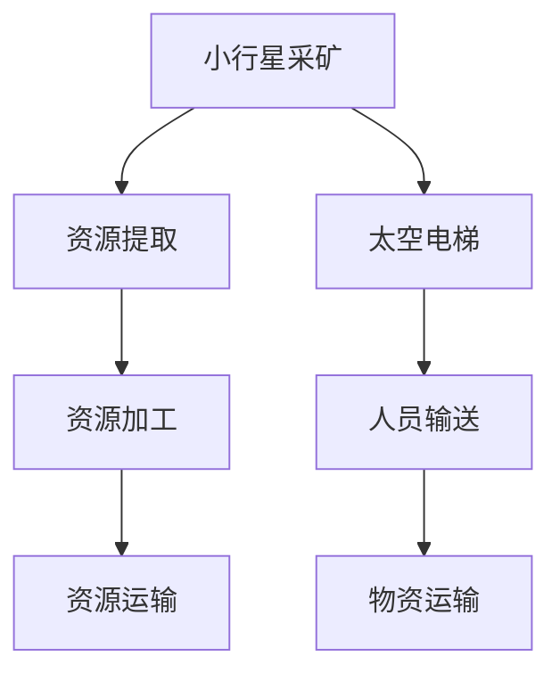

                 

# 未来的太空探索：2050年的小行星采矿与太空电梯

## 1. 背景介绍

太空探索是人类长期以来不懈追求的梦想。自阿波罗登月以来，人类不断拓展对太空的认知，力求实现月球、火星乃至更远宇宙的探索与利用。2050年，随着科技的飞速发展和多领域交叉融合，人类有望突破现有局限，开启新一轮的太空探索浪潮。其中，小行星采矿和太空电梯作为最具革命性的技术，有望彻底改变人类对太空资源的获取方式，加速人类向星际文明迈进。

### 1.1 太空探索的重要性和挑战

太空探索对于人类而言具有多重重要意义：
1. **科学探索**：拓展人类对宇宙的认知，解决地球资源枯竭、环境污染等问题。
2. **技术发展**：推动科技进步，如航天器制造、材料科学、生命科学等。
3. **经济价值**：太空资源的开发利用，如稀土元素、水资源等，将为全球经济带来巨大收益。

然而，太空探索同样面临巨大的挑战：
1. **成本高昂**：发射成本高，技术复杂，风险大。
2. **环境恶劣**：太空环境极端，对航天器和人身安全构成威胁。
3. **技术难题**：航天器、通信系统、生活保障系统等需要不断创新突破。

## 2. 核心概念与联系

### 2.1 核心概念概述

要了解2050年太空探索的前景，需先理解以下几个核心概念：

- **小行星采矿**：从小行星表面或内部提取稀有资源（如贵金属、水冰等），供地球或空间站使用。
- **太空电梯**：利用高强度缆绳连接地球和太空轨道，供人员、物资等高效往返的空间运输系统。

这些技术在2050年有望实现突破性进展，成为人类太空探索的重要基础设施。

### 2.2 核心概念原理和架构的 Mermaid 流程图(Mermaid 流程节点中不要有括号、逗号等特殊字符)



以上流程图展示了小行星采矿与太空电梯的相互关系及各自核心流程。

## 3. 核心算法原理 & 具体操作步骤

### 3.1 算法原理概述

小行星采矿和太空电梯的核心技术涉及天体动力学、材料科学、机器人技术等多个领域。其主要算法原理可归纳为以下几类：

1. **天体动力学**：计算天体轨道和运动，规划采矿位置和运输轨道。
2. **材料科学**：开发高强度、耐高温、抗辐射的复合材料，以适应太空环境的严苛要求。
3. **机器人技术**：开发自主、高效、多功能的太空机器人，完成采矿和运输任务。

### 3.2 算法步骤详解

#### 3.2.1 小行星采矿算法步骤

1. **目标选择**：根据地球需求和资源分布，选择合适的小行星作为采矿目标。
2. **轨道计算**：计算目标小行星的最佳开采轨道和路径。
3. **着陆和挖掘**：开发自主采矿机器人，进行着陆、挖掘、加工等操作。
4. **资源运输**：规划资源返回地球或轨道站的运输路径，使用太空电梯实现高效输送。

#### 3.2.2 太空电梯算法步骤

1. **轨道设计**：设计适合太空电梯的地球轨道和太空轨道位置。
2. **缆绳设计**：研发高强度、耐磨损的太空缆绳，保证结构稳定。
3. **系统集成**：将缆绳与太空电梯舱体、控制系统等集成，实现高效运行。
4. **运行测试**：进行多次测试，优化缆绳、舱体、控制系统等设计，确保稳定性和可靠性。

### 3.3 算法优缺点

#### 3.3.1 小行星采矿

- **优点**：
  - **高效资源获取**：相比传统采矿，小行星采矿可以高效获取稀有资源。
  - **低成本**：利用太空资源，减少了从地球运输成本。

- **缺点**：
  - **技术难度大**：涉及天体动力学、材料科学、机器人技术等多个复杂领域。
  - **安全风险高**：太空环境恶劣，采矿过程中易发生意外。

#### 3.3.2 太空电梯

- **优点**：
  - **高效运输**：大幅降低太空运输成本，实现快速物资交换。
  - **环境友好**：减少了大量化学燃料的使用，降低了碳排放。

- **缺点**：
  - **技术挑战大**：高强度缆绳和太空舱体设计难度巨大。
  - **成本高昂**：初始投资大，需要巨大科研和工程投入。

### 3.4 算法应用领域

小行星采矿和太空电梯的应用领域广泛，包括但不限于以下几个方面：

- **资源开发**：提供稀有元素如铂、铱、锱等，以及水资源、氦-3等能源。
- **基础设施建设**：为空间站、月球基地等提供物资和人员支持。
- **环境保护**：缓解地球资源短缺和环境污染问题。
- **科学研究**：支持深空探索和科学研究任务。

## 4. 数学模型和公式 & 详细讲解 & 举例说明

### 4.1 数学模型构建

在进行小行星采矿和太空电梯设计时，需要使用多个数学模型进行计算和模拟。以下是几个核心数学模型：

- **轨道计算模型**：计算天体轨道位置和速度。
- **动力学模型**：描述物体在太空中的运动。
- **材料力学模型**：分析缆绳和舱体的结构强度和稳定性。

### 4.2 公式推导过程

#### 4.2.1 轨道计算公式

假设目标小行星的半径为$r_A$，地球的半径为$r_E$，则小行星的表面积为：

$$
A = 4\pi r_A^2
$$

根据引力公式，小行星的引力加速度为：

$$
g_A = \frac{GM_A}{r_A^2}
$$

其中$G$为引力常数，$M_A$为目标小行星的质量。

#### 4.2.2 动力学模型公式

假设太空电梯的缆绳长度为$L$，缆绳末端速度为$v$，则缆绳对缆绳末端施加的张力为：

$$
F_T = mg_E = m\frac{v^2}{r_E}
$$

其中$m$为缆绳末端质量，$g_E$为地球表面重力加速度。

#### 4.2.3 材料力学模型公式

假设太空电梯的缆绳采用碳纳米管材料，其杨氏模量为$E$，则缆绳的应力为：

$$
\sigma = \frac{F_T}{A}
$$

其中$A$为碳纳米管的横截面积。

### 4.3 案例分析与讲解

以太空电梯的设计为例，假设缆绳长度为$L=1000$公里，缆绳末端速度为$v=1$公里/秒，缆绳末端质量$m=1$吨，地球表面重力加速度$g_E=9.8$米/秒²。根据动力学模型，缆绳末端所受张力为：

$$
F_T = mg_E = 1000 \times 9.8 \approx 10000 \text{牛顿}
$$

使用材料力学模型，计算碳纳米管的应力：

$$
\sigma = \frac{F_T}{A} = \frac{10000}{\pi r^2} \approx 2.7 \times 10^6 \text{帕斯卡}
$$

其中$r$为碳纳米管的半径。

## 5. 项目实践：代码实例和详细解释说明

### 5.1 开发环境搭建

在开始项目实践前，需要搭建开发环境。以下是具体的步骤：

1. **安装Python**：确保安装了最新版本的Python，以及必要的科学计算库，如NumPy、SciPy、Sympy等。
2. **安装相关库**：安装用于轨道计算、动力学模拟、材料力学分析的库，如Astropy、Matplotlib、SymPy等。
3. **数据准备**：收集小行星的数据，如半径、质量、轨道位置等，以及太空电梯设计的数据，如缆绳长度、末端速度、缆绳材料等。

### 5.2 源代码详细实现

以下是Python代码示例，用于计算小行星采矿所需资源和太空电梯的缆绳张力：

```python
import numpy as np
import sympy as sp

# 小行星数据
r_A = 500  # 半径
M_A = 1e15  # 质量

# 地球数据
r_E = 6371e3  # 半径
g_E = 9.8  # 重力加速度

# 缆绳数据
L = 1000e3  # 长度
v = 1e3  # 速度
m = 1000  # 质量

# 计算小行星表面积
A_A = 4 * np.pi * r_A**2

# 计算小行星引力加速度
g_A = M_A / r_A**2

# 计算缆绳张力
F_T = m * g_E

# 计算缆绳应力
r = sp.symbols('r')
A = np.pi * r**2
sigma = F_T / A

# 打印结果
print(f"小行星表面积：{A_A:.2e} 平方米")
print(f"小行星引力加速度：{g_A:.2e} 米/秒²")
print(f"缆绳张力：{F_T:.2e} 牛顿")
print(f"缆绳应力：{sigma:.2e} 帕斯卡")
```

### 5.3 代码解读与分析

代码实现了对小行星表面积、小行星引力加速度、缆绳张力和应力等关键参数的计算。通过NumPy和Sympy库的强大计算能力，可以高效完成复杂数学模型的构建和计算。

## 6. 实际应用场景

### 6.1 小行星采矿的应用场景

小行星采矿有望应用于以下几个领域：

1. **稀土资源开采**：开采小行星上的稀土元素，如铂、铱、锱等，供地球使用。
2. **水资源提取**：提取小行星上的水冰资源，作为宇航员饮用水和太空农业用水。
3. **能源开发**：开采氦-3等核聚变燃料，支持未来太空核电站建设。

### 6.2 太空电梯的应用场景

太空电梯将为以下几个方面带来变革：

1. **低成本运输**：大幅降低太空物资运输成本，促进太空探索和开发。
2. **人员往来**：实现快速的人员往返，提高太空探索的效率和安全性。
3. **科学研究**：支持深空探测和科学研究任务，拓展人类对宇宙的认知。

## 7. 工具和资源推荐

### 7.1 学习资源推荐

为了深入了解小行星采矿和太空电梯的理论和技术，推荐以下学习资源：

1. **《太空探索：从月球到火星》**：介绍月球和火星探索的技术和挑战，为理解小行星采矿和太空电梯提供基础。
2. **《深空探索手册》**：详细阐述深空探测的理论和实践，包含众多前沿技术和应用案例。
3. **《机器人技术入门》**：介绍机器人在太空采矿和运输中的应用，为开发自主采矿机器人提供参考。
4. **《材料科学与工程》**：涵盖材料科学的基础知识和前沿技术，为太空电梯设计提供理论支撑。

### 7.2 开发工具推荐

以下是几个推荐的开发工具，可用于小行星采矿和太空电梯的设计和仿真：

1. **Astropy**：开源天文学库，提供天体物理数据的处理和分析功能。
2. **Matplotlib**：绘图库，用于可视化轨道计算和动力学模拟的结果。
3. **SymPy**：符号计算库，用于建立和求解数学模型。
4. **Rosetta**：开源机器人操作系统，支持复杂机器人系统的开发和仿真。
5. **PyEphem**：天体动力学库，用于计算天体轨道和运动。

### 7.3 相关论文推荐

以下是几篇具有代表性的学术论文，推荐阅读：

1. **《小行星采矿和运输系统设计》**：介绍小行星采矿的技术方案和系统设计。
2. **《太空电梯的力学分析》**：分析太空电梯的缆绳、舱体和驱动系统的力学特性。
3. **《自主采矿机器人的控制与优化》**：研究自主采矿机器人的导航和控制算法。
4. **《材料科学与工程在太空电梯中的应用》**：探讨碳纳米管、高强度合金等材料在太空电梯中的应用。

## 8. 总结：未来发展趋势与挑战

### 8.1 研究成果总结

本文对2050年小行星采矿和太空电梯的发展前景进行了全面总结。小行星采矿和太空电梯作为未来太空探索的重要技术，有望解决当前地球资源枯竭、环境污染等问题，同时大幅降低太空探索成本，提升探索效率。

### 8.2 未来发展趋势

未来，小行星采矿和太空电梯的发展趋势如下：

1. **技术不断突破**：随着科技的进步，小行星采矿和太空电梯的可行性将不断提升，资源获取和运输效率将大幅提高。
2. **多领域交叉融合**：结合材料科学、机器人技术、天文学等多个领域，实现技术综合集成和创新突破。
3. **国际合作加强**：各国将加强合作，共同开发太空资源，推动人类向星际文明迈进。

### 8.3 面临的挑战

小行星采矿和太空电梯的发展面临以下挑战：

1. **高技术难度**：涉及天体动力学、材料科学、机器人技术等多个复杂领域，技术难度大。
2. **高成本投入**：初始投资大，需要巨大科研和工程投入。
3. **安全和伦理问题**：太空环境恶劣，存在重大安全和伦理问题。

### 8.4 研究展望

未来的研究需要在以下几个方面进行深入探索：

1. **新技术探索**：开发新材料、新算法和新模型，进一步提高太空电梯和采矿系统的可靠性和效率。
2. **国际合作**：加强国际间的合作，共同开发太空资源，推进技术标准化和产业化。
3. **伦理和法律**：建立太空资源的开发和使用规则，确保公平和可持续利用。

## 9. 附录：常见问题与解答

**Q1：小行星采矿和太空电梯在技术上存在哪些难题？**

A: 小行星采矿和太空电梯面临以下技术难题：
1. **轨道计算**：需要高精度的轨道计算模型，确保采矿位置和运输轨道的准确性。
2. **材料科学**：需要研发高强度、耐高温、抗辐射的复合材料，以适应太空环境的严苛要求。
3. **机器人技术**：需要开发自主、高效、多功能的太空机器人，完成采矿和运输任务。

**Q2：太空电梯的缆绳和舱体设计有哪些关键点？**

A: 太空电梯的缆绳和舱体设计关键点包括：
1. **缆绳材料**：选择高强度、耐磨损、低密度的材料，如碳纳米管。
2. **缆绳长度**：确定合适的缆绳长度，既要满足输送需求，又要保证结构稳定。
3. **舱体结构**：设计适合太空环境的舱体结构，确保宇航员和物资的安全。
4. **驱动系统**：研发高效的动力系统，如太阳能帆板、磁悬浮等，实现高效往返。

**Q3：小行星采矿对环境有哪些潜在影响？**

A: 小行星采矿对环境可能产生以下影响：
1. **小行星破坏**：开采过程中可能对小行星造成破坏，改变其轨道和表面结构。
2. **空间碎片**：开采过程中产生的废弃物可能成为新的空间碎片，影响太空环境。
3. **资源分配**：小行星资源开采和分配需要国际合作，避免资源争夺和冲突。

**Q4：太空电梯的设计和建造需要哪些关键技术和资源？**

A: 太空电梯的设计和建造需要以下关键技术和资源：
1. **高强度缆绳**：研发高强度、耐磨损的太空缆绳，保证结构稳定。
2. **先进材料**：使用高性能的复合材料，如碳纳米管、碳纤维等。
3. **精密制造**：采用先进的制造技术，如3D打印、激光切割等。
4. **大规模集成**：将缆绳、舱体、控制系统等集成，实现高效运行。

---

作者：禅与计算机程序设计艺术 / Zen and the Art of Computer Programming

