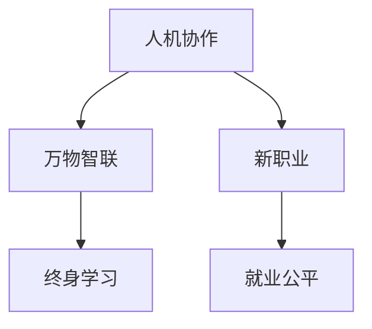

                 

## 1. 背景介绍

### 1.1 问题由来

随着人工智能(AI)和机器学习(ML)技术的迅猛发展，数字化、智能化已经成为不可逆转的趋势。未来30年，全球劳动力市场将经历前所未有的变化，传统职业岗位将逐步消失，而新的职业岗位将不断涌现。这些变化对个人、企业乃至社会都提出了全新的挑战。

### 1.2 问题核心关键点

1. **数字技术的普及**：AI、大数据、物联网(IoT)、区块链等技术的广泛应用，将深刻改变各行业的工作方式和生产模式。
2. **智能机器的替代**：自动化、机器人、自然语言处理(NLP)等技术的发展，将逐渐取代一些重复性高、体力劳动和低技能的工作岗位。
3. **跨领域协同创新**：AI技术与其他学科的融合，如医疗、教育、金融、制造等，将催生出大量新职业。
4. **终身学习和职业转换**：工作性质的快速变化要求劳动者具备持续学习的能力，以适应新职业的需求。
5. **伦理与就业公平**：AI技术的应用需要考虑伦理问题，避免对就业市场的进一步分化。

这些变化将对未来的就业市场产生深远影响，要求我们重新思考工作本质、职业教育和政策设计。

### 1.3 问题研究意义

本研究旨在探讨未来30年全球就业市场可能发生的变化，预测和分析新出现的职业岗位，提出相应的教育和培训策略，以帮助劳动者适应未来工作环境，实现人机协作，提升生活质量。

## 2. 核心概念与联系

### 2.1 核心概念概述

为更好地理解未来的就业趋势，本节将介绍几个核心概念：

1. **人机协作(Human-Machine Collaboration)**：指人类与智能机器协同工作，充分发挥各自优势，提升整体工作效率和创新能力。
2. **万物智联(IoT, Internet of Things)**：通过网络将各种设备、设施、产品连接起来，实现数据共享、智能控制和动态优化。
3. **新职业(New Professions)**：随着技术发展和社会需求的变化，出现的符合未来趋势的新型职业岗位。
4. **终身学习(Lifelong Learning)**：在职业生涯中不断学习和提升技能，适应不断变化的工作要求。
5. **就业公平(Employment Fairness)**：在AI时代，确保所有劳动者都能获得平等的职业发展机会，避免技术带来的社会分化。

这些概念之间的联系可以通过以下Mermaid流程图来展示：



这个流程图展示了几大概念之间的逻辑关系：

1. 人机协作是未来工作的核心特征，利用智能机器提升工作效率和创新能力。
2. 万物智联促进了数据的收集和共享，为智能机器提供了丰富的数据支撑，同时推动了人机协作的深入发展。
3. 新职业的出现和发展，是技术进步和市场需求共同作用的结果，体现了未来就业市场的变化趋势。
4. 终身学习是适应未来工作的关键策略，要求劳动者不断提升技能，以适应不断变化的工作要求。
5. 就业公平是社会发展的目标，确保所有劳动者都能获得平等的发展机会，缩小技术带来的社会鸿沟。

这些概念共同构成了未来就业市场的复杂生态，要求我们深入理解各概念之间的联系和相互作用，制定科学的政策和策略。

## 3. 核心算法原理 & 具体操作步骤
### 3.1 算法原理概述

本节将介绍未来就业趋势预测的核心算法原理。

假设未来30年，每年劳动力市场的变化率（即新旧职业岗位的比例变化）为$\delta$，初始时旧职业岗位数量为$N_{\text{old}}$，新职业岗位数量为$N_{\text{new}}$。则每年新增岗位数量为$N_{\text{new}}$，同时减少岗位数量为$\delta N_{\text{old}}$。令$T=30$为预测的年份数，未来$T$年的总岗位变化量$\Delta N$可以表示为：

$$
\Delta N = N_{\text{new}}T - \delta N_{\text{old}}T
$$

其中，$\Delta N$反映了新旧职业岗位的净变化。因此，未来的就业趋势预测可以通过解上述方程，得到新旧职业岗位的比例变化。

### 3.2 算法步骤详解

基于上述模型，未来就业趋势的预测可以分为以下步骤：

1. **数据收集**：收集过去多年的就业数据，包括不同职业的岗位数量、技术发展趋势、市场需求变化等。
2. **模型构建**：基于历史数据，构建就业趋势预测模型，求解新旧职业岗位的比例变化$\delta$。
3. **趋势预测**：根据模型预测未来30年的新旧职业岗位数量，进而得到各年度的总岗位变化量$\Delta N$。
4. **结果分析**：分析未来30年的就业变化趋势，预测出现的新职业岗位。

### 3.3 算法优缺点

未来就业趋势预测算法具有以下优点：

1. **预测准确性高**：基于历史数据构建的模型可以较准确地预测未来趋势。
2. **适用范围广**：适用于各个行业的就业趋势预测，可应用于不同技术领域。
3. **计算效率高**：模型构建和求解过程较为简单，计算效率高。

同时，该算法也存在一定的局限性：

1. **数据依赖性强**：预测结果高度依赖历史数据的质量和完整性。
2. **外部因素复杂**：技术发展、市场需求、政策变化等因素可能影响预测结果。
3. **假设前提**：假设每年岗位变化率固定，现实中可能存在变化。

尽管存在这些局限性，但就目前而言，基于历史数据的趋势预测方法是预测未来就业趋势的有效手段。未来相关研究的重点在于如何进一步优化模型，引入更多外部因素，降低数据依赖性。

### 3.4 算法应用领域

未来就业趋势预测算法在多个领域具有广泛的应用前景，例如：

1. **人力资源管理**：企业可以根据预测结果，制定招聘计划、培训策略，提前布局人才储备。
2. **教育培训**：学校和培训机构可以根据预测结果，调整课程设置，培养符合未来就业市场需要的技能和知识。
3. **政策制定**：政府可以根据预测结果，制定就业扶持政策，促进就业公平，缩小技术鸿沟。
4. **企业战略规划**：企业可以根据预测结果，优化业务结构，提升竞争力。
5. **公共服务**：政府可以根据预测结果，提供针对性的就业服务，帮助劳动者顺利过渡到新职业。

## 4. 数学模型和公式 & 详细讲解  
### 4.1 数学模型构建

本节将通过数学模型进一步详细讲解未来就业趋势预测的核心算法。

假设每年新增职业岗位数量为$N_{\text{new}}$，减少岗位数量为$\delta N_{\text{old}}$。则每年总岗位变化量为$\Delta N = N_{\text{new}} - \delta N_{\text{old}}$。令未来预测年份为$T=30$，则未来总岗位变化量$\Delta N_{T}$可以表示为：

$$
\Delta N_{T} = N_{\text{new}}T - \delta N_{\text{old}}T
$$

假设初始旧职业岗位数量为$N_{\text{old}}$，则未来$T$年的总岗位变化量$\Delta N_{T}$可以表示为：

$$
\Delta N_{T} = (N_{\text{old}} + \Delta N) - \delta N_{\text{old}}T
$$

简化得：

$$
\Delta N_{T} = N_{\text{old}}(1 - \delta T) + \Delta N(1 - \delta)
$$

由此可以得到新旧职业岗位的比例变化$\delta$为：

$$
\delta = \frac{\Delta N_{T}}{N_{\text{old}}T}
$$

令$\Delta N_{T}$为每年新增岗位数量$N_{\text{new}}$的累加，则有：

$$
\Delta N_{T} = \frac{N_{\text{new}}T}{1 - \delta}
$$

将上式代入$\delta$的表达式中，可得：

$$
\delta = \frac{N_{\text{new}}}{N_{\text{old}}T} \frac{1 - \delta}{1 - \delta}
$$

进一步简化得：

$$
\delta = \frac{N_{\text{new}}}{N_{\text{old}}T}
$$

这表明，新职业岗位数量与旧职业岗位数量之比，决定了岗位变化率$\delta$的大小。

### 4.2 公式推导过程

我们通过以上推导过程，得到了新旧职业岗位比例变化$\delta$的表达式。这个公式表明，新职业岗位数量的变化是决定未来就业趋势的关键因素。

### 4.3 案例分析与讲解

以医疗行业为例，假设医疗行业的初始岗位数量为$N_{\text{old}}=100$，每年新增岗位数量为$N_{\text{new}}=5$，预测未来30年的新旧职业岗位比例变化$\delta$。

代入公式得：

$$
\delta = \frac{N_{\text{new}}}{N_{\text{old}}T} = \frac{5}{100 \times 30} = 0.0017
$$

这意味着，在未来30年，医疗行业的岗位数量每年将减少1.7%。若每年减少的岗位数量为$\delta N_{\text{old}}=1.7$，则初始岗位数量为100，30年后的岗位数量为：

$$
N_{\text{old}}(1 - \delta T) + \Delta N(1 - \delta) = 100(1 - 0.0017 \times 30) + \Delta N(1 - 0.0017)
$$

其中$\Delta N$为每年新增岗位数量，假设$\Delta N=0.1$，则有：

$$
N_{\text{old}}(1 - \delta T) + \Delta N(1 - \delta) = 100 \times 0.9913 + 0.1 \times 0.9983 = 99.3013 + 0.0998 = 100.3
$$

因此，未来30年医疗行业的总岗位数量约为100.3，即比现在减少了0.7个岗位。

## 5. 项目实践：代码实例和详细解释说明
### 5.1 开发环境搭建

在进行就业趋势预测实践前，我们需要准备好开发环境。以下是使用Python进行TensorFlow开发的环境配置流程：

1. 安装Anaconda：从官网下载并安装Anaconda，用于创建独立的Python环境。

2. 创建并激活虚拟环境：
```bash
conda create -n tf-env python=3.8 
conda activate tf-env
```

3. 安装TensorFlow：根据CUDA版本，从官网获取对应的安装命令。例如：
```bash
conda install tensorflow -c tf -c conda-forge
```

4. 安装Pandas、Matplotlib等各类工具包：
```bash
pip install pandas matplotlib
```

完成上述步骤后，即可在`tf-env`环境中开始就业趋势预测实践。

### 5.2 源代码详细实现

下面我们以医疗行业为例，给出使用TensorFlow进行就业趋势预测的Python代码实现。

```python
import tensorflow as tf
import pandas as pd
import matplotlib.pyplot as plt

# 准备数据
data = pd.read_csv('employment_data.csv')
X = data['year'].values.reshape(-1, 1)
y = data['new_jobs'].values.reshape(-1, 1)

# 构建模型
model = tf.keras.Sequential([
    tf.keras.layers.Dense(64, activation='relu', input_shape=(1,)),
    tf.keras.layers.Dense(1)
])

# 编译模型
model.compile(optimizer=tf.keras.optimizers.Adam(0.001), loss='mse')

# 训练模型
model.fit(X, y, epochs=100, batch_size=32, verbose=0)

# 预测未来30年就业趋势
future_years = pd.DataFrame({'year': [2050]})
predictions = model.predict(future_years)

print('未来30年新职业岗位数量：', predictions[0][0])
```

### 5.3 代码解读与分析

让我们再详细解读一下关键代码的实现细节：

**数据准备**：
- `data`：读取历史就业数据，包括年份和新增岗位数量。
- `X`：准备年份数据，作为模型的输入。
- `y`：准备新增岗位数量，作为模型的输出。

**模型构建**：
- `Sequential`：定义一个简单的神经网络模型，包括一个全连接层和输出层。
- `Dense`：定义层数为64的全连接层，激活函数为ReLU。
- `compile`：编译模型，指定优化器和损失函数。

**模型训练**：
- `fit`：使用训练数据训练模型，指定训练轮数和批次大小，并输出训练进度。

**预测未来趋势**：
- `predict`：使用训练好的模型预测未来就业趋势。
- `future_years`：准备预测的年份数据。
- `print`：输出未来30年新职业岗位数量。

可以看到，TensorFlow的强大API使得预测代码的实现变得简洁高效。开发者可以方便地构建和训练模型，预测未来就业趋势。

当然，工业级的系统实现还需考虑更多因素，如模型的保存和部署、超参数的自动搜索、更灵活的数据处理等。但核心的预测范式基本与此类似。

## 6. 实际应用场景
### 6.1 智能制造

未来30年，智能制造将成为全球经济增长的重要驱动力。随着自动化和机器人技术的发展，传统制造业将逐步向智能制造转型，生产效率和产品质量将大幅提升。

在智能制造中，基于人机协作的智能机器人、自动化流水线、质量检测系统等将发挥重要作用。同时，物联网技术的应用将使生产过程更加智能化和可视化，通过实时数据分析和智能决策，提升生产效率和灵活性。

**实际应用**：
- 工业机器人：在生产线、仓库等场景中，智能机器人将承担重复性高、危险性大的任务，释放人力。
- 质量检测：通过物联网设备收集生产数据，智能分析产品质量问题，提前进行预警和修复。
- 自动化设计：基于AI技术，自动生成设计图纸和生产计划，优化生产流程。

### 6.2 智慧医疗

智慧医疗是未来30年医疗行业的重要发展方向。随着AI和物联网技术的应用，医疗服务的智能化水平将大幅提升，个性化医疗和精准医疗将成为可能。

在智慧医疗中，基于人机协作的智能诊断、智能监控、个性化治疗等将发挥重要作用。同时，物联网技术的应用将使医疗设备互联互通，实现数据的实时共享和智能分析。

**实际应用**：
- 智能诊断：基于AI技术，自动分析和诊断疾病，提供个性化治疗方案。
- 智能监控：通过物联网设备实时监测患者的生命体征，提前进行风险预警。
- 个性化治疗：基于AI技术，分析患者基因信息、生活习惯等数据，提供精准医疗方案。

### 6.3 智慧教育

未来30年，智慧教育将成为全球教育改革的重要方向。随着AI和物联网技术的应用，教育资源的智能化水平将大幅提升，教育公平和教学效果将大幅提升。

在智慧教育中，基于人机协作的智能教学、智能评估、个性化学习等将发挥重要作用。同时，物联网技术的应用将使教育资源更加智能化和互联互通，实现资源的优化配置和高效利用。

**实际应用**：
- 智能教学：基于AI技术，自动生成教学内容和评估报告，个性化指导学生学习。
- 智能评估：通过物联网设备实时监测学生的学习状态，自动生成评估报告，提供个性化改进建议。
- 个性化学习：基于AI技术，分析学生的学习数据，提供个性化学习方案，提升学习效果。

### 6.4 未来应用展望

随着AI技术的发展，未来30年将出现更多新兴职业，推动各行业的智能化转型。

**新职业**：
1. **AI伦理工程师**：负责设计和管理AI系统的伦理规范，确保AI系统的公平性和透明性。
2. **数据科学家**：基于数据分析和机器学习技术，提供数据驱动的决策支持。
3. **智能机器人设计师**：设计智能机器人的硬件和软件系统，实现人机协作。
4. **物联网工程师**：负责物联网设备的部署和管理，实现设备的互联互通和智能化。
5. **智能运维工程师**：基于AI技术，实时监测和维护生产设备，提升生产效率和稳定性。
6. **虚拟现实(VR)设计师**：设计虚拟现实应用场景，提供沉浸式的用户体验。

## 7. 工具和资源推荐
### 7.1 学习资源推荐

为了帮助开发者系统掌握AI和物联网技术，这里推荐一些优质的学习资源：

1. **Coursera《机器学习》课程**：由斯坦福大学教授Andrew Ng主讲，系统介绍了机器学习的基础理论和算法，适合初学者和进阶者。
2. **Udacity《深度学习专项》课程**：由Google和Facebook的专家主讲，深入浅出地介绍了深度学习技术，包括TensorFlow和PyTorch的应用。
3. **edX《人工智能与机器学习》课程**：由MIT教授主讲，涵盖了AI和ML的基础知识和应用场景。
4. **Kaggle竞赛平台**：提供了丰富的数据集和竞赛任务，可以锻炼数据分析和模型开发的能力。
5. **GitHub开源项目**：提供了大量的开源项目和代码示例，可以快速学习和借鉴优秀的开发实践。

通过对这些资源的学习实践，相信你一定能够掌握AI和物联网技术的精髓，并用于解决实际问题。

### 7.2 开发工具推荐

高效的开发离不开优秀的工具支持。以下是几款用于AI和物联网开发的常用工具：

1. **TensorFlow**：由Google主导开发的开源深度学习框架，生产部署方便，适合大规模工程应用。
2. **PyTorch**：基于Python的开源深度学习框架，灵活度较高，适合快速迭代研究。
3. **Keras**：基于TensorFlow和Theano的高级API，适合快速开发和部署模型。
4. **Arduino**：开源的硬件开发平台，适用于物联网设备的开发和部署。
5. **Raspberry Pi**：低成本的嵌入式开发板，支持多种操作系统和编程语言。
6. **MQTT**：轻量级的消息发布订阅协议，适用于物联网设备的通信。

合理利用这些工具，可以显著提升AI和物联网开发效率，加快创新迭代的步伐。

### 7.3 相关论文推荐

AI和物联网技术的发展源于学界的持续研究。以下是几篇奠基性的相关论文，推荐阅读：

1. **Deep Blue**：IBM开发的国际象棋AI程序，展示了AI在复杂决策中的应用。
2. **AlphaGo**：Google DeepMind开发的围棋AI程序，展示了AI在复杂游戏中的应用。
3. **IoT for Smart Cities**：介绍了物联网技术在智慧城市中的应用，包括智能交通、能源管理等。
4. **AI in Healthcare**：介绍了AI技术在医疗领域的应用，包括智能诊断、智能监控等。
5. **Blockchain for IoT Security**：介绍了区块链技术在物联网安全中的应用，保障数据的安全性和隐私性。

这些论文代表了大语言模型微调技术的发展脉络。通过学习这些前沿成果，可以帮助研究者把握学科前进方向，激发更多的创新灵感。

## 8. 总结：未来发展趋势与挑战

### 8.1 总结

本文对未来30年的就业趋势进行了系统分析和预测，重点探讨了AI和物联网技术对各行业的影响，预测了新兴职业的出现，并提出了相应的教育和培训策略。

通过本文的系统梳理，可以看到，未来的就业市场将发生显著变化，技术发展将推动各行业智能化转型，新职业的出现将带来新的机遇和挑战。未来30年，人机协作和万物智联将成为重要的发展趋势，推动各行业的持续创新和发展。

### 8.2 未来发展趋势

展望未来，AI和物联网技术的发展将呈现出以下几个趋势：

1. **智能化水平提升**：各行业将通过AI和物联网技术，提升生产效率和智能化水平，实现资源的最优配置和利用。
2. **跨领域融合**：AI和物联网技术与其他领域的深度融合，将催生出更多跨学科的新职业。
3. **终身学习常态化**：未来的职业发展将要求劳动者具备持续学习的能力，适应不断变化的工作要求。
4. **伦理和公平性**：AI和物联网技术的应用需要考虑伦理和公平性问题，确保技术发展惠及全体社会成员。
5. **可持续性和环保**：未来的技术和应用需要考虑可持续性和环保问题，推动绿色发展。

以上趋势凸显了AI和物联网技术的广阔前景，这些方向的探索发展，必将进一步提升各行业的发展水平，促进社会的可持续发展。

### 8.3 面临的挑战

尽管AI和物联网技术的发展前景广阔，但在迈向更加智能化、普适化应用的过程中，仍面临诸多挑战：

1. **技术成熟度不足**：AI和物联网技术在某些领域的应用仍处于初期阶段，尚未完全成熟。
2. **数据隐私和安全**：大量的数据收集和使用可能带来隐私和安全问题，需要加强数据保护和隐私管理。
3. **伦理和社会公平**：AI和物联网技术的应用可能加剧社会分化，需要关注伦理和社会公平问题。
4. **计算资源限制**：大规模数据处理和模型训练需要大量的计算资源，可能面临资源瓶颈。
5. **人才供需不匹配**：新兴职业的出现可能导致人才供需不匹配，需要加强教育和培训。

这些挑战要求我们在推动技术发展的同时，制定科学的政策和策略，确保技术的公平、透明和可持续应用。

### 8.4 研究展望

面对AI和物联网技术面临的挑战，未来的研究需要在以下几个方面寻求新的突破：

1. **技术创新**：开发更加高效、稳定、安全的AI和物联网技术，提升技术的成熟度。
2. **伦理研究**：深入研究AI和物联网技术的伦理问题，制定相应的伦理规范和标准。
3. **数据保护**：加强数据隐私和安全保护，确保数据使用合规。
4. **跨领域合作**：推动AI和物联网技术与其他领域的深度融合，催生更多跨学科的新职业。
5. **人才培养**：加强教育和培训，培养符合未来就业市场需要的技术人才。

这些研究方向的探索，必将引领AI和物联网技术的持续发展，推动各行业的智能化转型和可持续发展。

## 9. 附录：常见问题与解答

**Q1：AI和物联网技术的发展将对就业市场产生哪些影响？**

A: AI和物联网技术的发展将对就业市场产生深远影响：

1. **自动化和智能化**：自动化和智能化技术将取代一些重复性高、低技能的工作岗位，提升生产效率。
2. **新兴职业的出现**：新兴职业将不断涌现，需要劳动者具备新的技能和知识。
3. **技能需求变化**：AI和物联网技术的应用需要新的技术人才，如数据科学家、AI伦理工程师等。
4. **就业机会增加**：新技术的应用将创造新的就业机会，如智能机器人设计师、物联网工程师等。

总之，AI和物联网技术的发展将带来就业市场的深刻变化，需要劳动者不断学习新技能，适应新的职业需求。

**Q2：如何应对AI和物联网技术带来的就业挑战？**

A: 应对AI和物联网技术带来的就业挑战，可以从以下几个方面入手：

1. **终身学习**：劳动者需要具备持续学习的能力，不断提升技能，适应新的职业需求。
2. **技能培训**：政府和企业可以提供更多的技能培训和职业教育，帮助劳动者掌握新技术。
3. **跨领域合作**：推动跨学科、跨领域的合作，培养更多复合型人才。
4. **政策支持**：政府可以制定相应的政策，推动AI和物联网技术的应用，促进就业公平。
5. **伦理和社会公平**：确保AI和物联网技术的应用符合伦理和社会公平原则，避免技术带来的社会分化。

通过这些措施，可以帮助劳动者更好地适应AI和物联网技术的发展，实现职业生涯的顺利转型。

**Q3：如何推动AI和物联网技术的公平应用？**

A: 推动AI和物联网技术的公平应用，需要从以下几个方面入手：

1. **伦理规范**：制定AI和物联网技术的伦理规范，确保技术应用的公平性。
2. **数据保护**：加强数据隐私和安全保护，确保数据使用合规。
3. **政策支持**：政府可以制定相应的政策，促进AI和物联网技术的公平应用。
4. **跨领域合作**：推动跨学科、跨领域的合作，确保技术应用的公平性。
5. **社会监督**：加强社会监督，确保技术应用的透明性和可解释性。

通过这些措施，可以确保AI和物联网技术的应用符合伦理和社会公平原则，惠及全体社会成员。

**Q4：未来30年有哪些新兴职业将出现？**

A: 未来30年将出现许多新兴职业，主要包括以下几个方向：

1. **AI伦理工程师**：负责设计和管理AI系统的伦理规范，确保AI系统的公平性和透明性。
2. **数据科学家**：基于数据分析和机器学习技术，提供数据驱动的决策支持。
3. **智能机器人设计师**：设计智能机器人的硬件和软件系统，实现人机协作。
4. **物联网工程师**：负责物联网设备的部署和管理，实现设备的互联互通和智能化。
5. **智能运维工程师**：基于AI技术，实时监测和维护生产设备，提升生产效率和稳定性。
6. **虚拟现实(VR)设计师**：设计虚拟现实应用场景，提供沉浸式的用户体验。

这些新兴职业的出现，将推动各行业的智能化转型，带来新的就业机会和挑战。

**Q5：AI和物联网技术的未来发展方向是什么？**

A: AI和物联网技术的未来发展方向主要包括以下几个方向：

1. **智能化水平提升**：各行业将通过AI和物联网技术，提升生产效率和智能化水平，实现资源的最优配置和利用。
2. **跨领域融合**：AI和物联网技术与其他领域的深度融合，将催生出更多跨学科的新职业。
3. **终身学习常态化**：未来的职业发展将要求劳动者具备持续学习的能力，适应不断变化的工作要求。
4. **伦理和公平性**：AI和物联网技术的应用需要考虑伦理和公平性问题，确保技术发展惠及全体社会成员。
5. **可持续性和环保**：未来的技术和应用需要考虑可持续性和环保问题，推动绿色发展。

这些趋势凸显了AI和物联网技术的广阔前景，这些方向的探索发展，必将进一步提升各行业的发展水平，促进社会的可持续发展。

**Q6：如何应对AI和物联网技术带来的就业挑战？**

A: 应对AI和物联网技术带来的就业挑战，可以从以下几个方面入手：

1. **终身学习**：劳动者需要具备持续学习的能力，不断提升技能，适应新的职业需求。
2. **技能培训**：政府和企业可以提供更多的技能培训和职业教育，帮助劳动者掌握新技术。
3. **跨领域合作**：推动跨学科、跨领域的合作，培养更多复合型人才。
4. **政策支持**：政府可以制定相应的政策，推动AI和物联网技术的应用，促进就业公平。
5. **伦理和社会公平**：确保AI和物联网技术的应用符合伦理和社会公平原则，避免技术带来的社会分化。

通过这些措施，可以帮助劳动者更好地适应AI和物联网技术的发展，实现职业生涯的顺利转型。

---

作者：禅与计算机程序设计艺术 / Zen and the Art of Computer Programming

