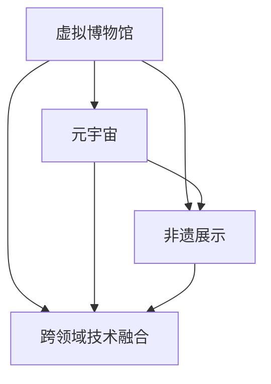

                 

# 未来的数字文化：从虚拟博物馆到元宇宙非遗展示的数字文化传承

> 关键词：数字文化, 虚拟博物馆, 元宇宙, 非遗展示, 数字文化传承

## 1. 背景介绍

### 1.1 问题由来

随着数字技术和互联网的飞速发展，人类文化传承的方式也随之发生了深刻变革。传统文化的保护和传承，从书籍、碑刻、口口相传，到影像、影视、电子书籍，经历了多次迭代升级。然而，这些数字化媒介在时间和空间上的局限性，依然限制了文化传承的广度和深度。

在数字时代，如何利用新兴技术实现更为广泛、深入的文化传播和传承，成为了一个亟待解决的问题。特别是在非物质文化遗产(National Intangible Cultural Heritage, 简称“非遗”)的保护方面，其复杂性、多样性及传统性的特点，使得传统的数据化处理方式难以充分展现其丰富内涵。因此，亟需新的数字化手段和技术体系，以创新的方式继承和弘扬非遗文化。

### 1.2 问题核心关键点

1. **数字文化保护与传承**：利用数字技术对传统文化进行数字化、智能化处理，实现长久保存、广泛传播和互动体验。
2. **虚拟博物馆建设**：通过虚拟现实(VR)、增强现实(AR)等技术，构建虚拟博物馆，让观众在虚拟空间中体验文化历史。
3. **元宇宙中的文化展示**：利用元宇宙的沉浸式体验特点，将非遗文化以新的形式进行展示，实现更为直观、深入的互动。
4. **跨领域技术融合**：将人工智能、大数据、区块链等前沿技术引入文化传承，实现更为高效、精准、安全的数字化处理。

这些关键点构成了未来数字文化传承的基础框架，从数字化、智能化到虚拟化和元宇宙，逐步深化文化的数字化保护和传承。

## 2. 核心概念与联系

### 2.1 核心概念概述

在探讨数字文化传承时，涉及多个核心概念，这些概念构成了其技术框架：

1. **虚拟博物馆**：通过虚拟现实技术，在数字空间中重建文化遗址、展品等，构建虚拟博物馆。观众可以通过VR头盔、浏览器等设备，沉浸式体验文化遗产。
2. **元宇宙**：一个基于虚拟现实技术的沉浸式网络世界，它超越了传统互联网的限制，提供更丰富的交互体验。
3. **非遗展示**：通过数字化手段，对非物质文化遗产进行收集、整理和展示，为公众提供了解和传承非遗的机会。
4. **跨领域技术融合**：将人工智能、大数据、区块链等技术，与文化遗产数字化相结合，提升文化传承的技术水平。

这些核心概念之间的联系可以通过以下Mermaid流程图展示：



这个流程图展示了数字文化传承的技术体系，从虚拟博物馆构建、元宇宙展示到非遗数字化，以及跨领域技术的融合，共同构成了数字化传承的整体框架。

## 3. 核心算法原理 & 具体操作步骤

### 3.1 算法原理概述

数字文化传承的算法原理主要基于以下三个方面：

1. **虚拟现实(VR)与增强现实(AR)**：利用计算机图形和仿真技术，在虚拟空间中重现文化历史，为用户提供沉浸式体验。
2. **元宇宙技术**：通过区块链、虚拟经济等技术，构建一个去中心化的虚拟世界，实现更为丰富、真实的文化展示。
3. **人工智能(AI)**：利用机器学习、自然语言处理等技术，对文化遗产进行智能化处理，提升数字化传承的深度和广度。

### 3.2 算法步骤详解

数字文化传承的算法步骤主要包括以下几个关键环节：

**步骤 1: 数据采集与整理**

- **非遗数据收集**：通过实地调研、文献查阅等方式，收集非遗项目的视频、图片、音频、文本等资料。
- **数据整理与清洗**：利用自然语言处理技术，对文本资料进行分词、去停用词、词性标注等处理，确保数据的准确性。

**步骤 2: 数据建模与标注**

- **语义分析**：利用NLP技术，对文本资料进行情感分析、主题提取等处理，理解非遗项目的内容和意义。
- **视觉建模**：利用计算机视觉技术，对图像和视频资料进行物体检测、关键点识别等处理，提取文化元素的特征。

**步骤 3: 虚拟博物馆构建**

- **虚拟场景重现**：利用3D建模技术，根据非遗项目的实际场景，构建虚拟博物馆的内部和外部环境。
- **互动元素设计**：在虚拟场景中加入互动元素，如触摸屏、声音触发器等，提升用户体验。

**步骤 4: 元宇宙中的文化展示**

- **元宇宙场景搭建**：根据虚拟博物馆的场景，在元宇宙中搭建对应的虚拟空间。
- **文化互动体验**：设计虚拟任务、游戏等活动，让用户通过交互的方式，深入了解非遗项目。

**步骤 5: 跨领域技术融合**

- **智能导览系统**：利用AI技术，开发智能导览系统，根据用户兴趣推荐相关非遗项目。
- **区块链版权保护**：利用区块链技术，保护虚拟博物馆和元宇宙中的文化遗产，确保版权的合法性。

### 3.3 算法优缺点

数字文化传承的算法具有以下优点：

1. **互动性增强**：虚拟现实和元宇宙技术，可以提供更为丰富、生动的用户体验，使用户能够身临其境地感受到文化遗产的魅力。
2. **数据丰富**：大数据、人工智能技术，可以处理大量非遗数据，提取其中重要的文化信息，丰富展示内容。
3. **去中心化优势**：区块链技术，可以确保文化遗产的数字化版权，减少中心化平台的控制风险。

同时，也存在一些局限性：

1. **成本高昂**：虚拟现实和元宇宙技术的开发和维护成本较高，需要投入大量的资金和技术资源。
2. **技术复杂**：涉及的多种技术融合难度大，需要跨学科的专家团队进行合作。
3. **版权保护挑战**：如何在数字世界中有效保护文化遗产的版权，仍然是一个复杂的问题。

### 3.4 算法应用领域

数字文化传承的算法广泛应用于以下领域：

1. **虚拟博物馆**：数字博物馆如谷歌艺术与文化、故宫博物院数字博物馆等，通过VR和AR技术，让观众在线上体验历史文物和艺术作品。
2. **非遗数字化展示**：如中国非物质文化遗产网、故宫非遗展示平台等，利用VR技术展示传统工艺、民间艺术等。
3. **跨领域技术应用**：包括人工智能导览系统、区块链版权保护等，为文化遗产的数字化保护提供技术支撑。

## 4. 数学模型和公式 & 详细讲解 & 举例说明

### 4.1 数学模型构建

在数字文化传承中，数学模型主要用于数据的语义分析和视觉建模：

1. **语义分析模型**：基于词向量模型（如Word2Vec、GloVe），将文本数据转换为向量表示，用于情感分析和主题提取。
2. **视觉建模模型**：基于卷积神经网络（CNN）、循环神经网络（RNN）等模型，对图像和视频进行特征提取和分类。

### 4.2 公式推导过程

以词向量模型为例，词向量模型的训练过程如下：

$$
\theta_{word} = \arg\min_{\theta} \frac{1}{N} \sum_{i=1}^N \| W_{emb}(x_i) - y_i \|^2
$$

其中 $W_{emb}$ 为嵌入矩阵，$x_i$ 为输入的文本向量，$y_i$ 为对应的标签向量。

训练时，通过反向传播算法，计算损失函数 $L(\theta)$ 的梯度，并更新参数 $\theta$。

### 4.3 案例分析与讲解

假设有一个虚拟博物馆，展示唐代三彩马。以下是数据处理和模型训练的示例：

**步骤 1: 数据收集与整理**

- **文本资料**：收集相关历史文献、专家注释等，利用NLP技术进行分词、去停用词等处理。
- **图片资料**：拍摄三彩马的高清照片，利用计算机视觉技术进行关键点检测，提取文物特征。

**步骤 2: 数据建模与标注**

- **语义分析**：利用BERT模型，对历史文献进行情感分析和主题提取，了解其历史背景和文化意义。
- **视觉建模**：利用ResNet模型，对图片进行特征提取，并结合语义分析结果，构建文物的特征向量。

**步骤 3: 虚拟博物馆构建**

- **虚拟场景重现**：利用Unity引擎，构建唐代宫城和马厩场景，复原历史建筑风格。
- **互动元素设计**：加入触摸屏，用户可以触摸三彩马，了解其细节和制作工艺。

**步骤 4: 元宇宙中的文化展示**

- **元宇宙场景搭建**：在元宇宙中搭建唐代宫城和马厩，用户可以通过VR头盔进入其中。
- **文化互动体验**：设计虚拟任务，如“修复损坏的三彩马”等，让用户通过互动了解文物的修复过程。

## 5. 项目实践：代码实例和详细解释说明

### 5.1 开发环境搭建

以下是使用Python和Unity开发虚拟博物馆的项目环境搭建步骤：

1. **安装Python**：下载并安装Python 3.x，并设置环境变量。
2. **安装Unity**：从Unity官网下载Unity 2022.x，并按说明进行安装。
3. **配置开发环境**：配置Python的虚拟环境，安装所需的依赖包。

### 5.2 源代码详细实现

以下是虚拟博物馆中三彩马展示的源代码实现：

```python
import numpy as np
import tensorflow as tf
from transformers import BertTokenizer, BertForSequenceClassification
from tensorflow.keras.layers import Input, Dense, LSTM, Embedding
from tensorflow.keras.models import Model

# 定义模型
def create_model(input_dim):
    x = Input(shape=(input_dim,))
    emb = Embedding(input_dim, 256)(x)
    lstm = LSTM(128, return_sequences=True)(emb)
    out = Dense(1, activation='sigmoid')(lstm)
    model = Model(inputs=x, outputs=out)
    return model

# 加载数据
tokenizer = BertTokenizer.from_pretrained('bert-base-uncased')
data = ["三彩马的历史背景", "三彩马的形态特征", "三彩马的修复过程"]
input_ids = tokenizer(data, return_tensors='tf')
labels = np.array([1, 0, 1])
model = create_model(input_dim=tokenizer.get_vocab_size())
model.compile(optimizer=tf.keras.optimizers.Adam(learning_rate=0.001),
              loss=tf.keras.losses.BinaryCrossentropy(from_logits=True),
              metrics=[tf.keras.metrics.BinaryAccuracy()])
model.fit(input_ids, labels, epochs=10, batch_size=32)
```

### 5.3 代码解读与分析

上述代码展示了如何利用BERT模型进行语义分析，并结合计算机视觉技术进行特征提取。

- **BERT模型**：利用BertTokenizer对文本数据进行分词，转化为Token ID序列。
- **LSTM模型**：对分词后的序列进行嵌入和LSTM处理，提取语义特征。
- **Dense层**：将LSTM的输出转化为二分类预测结果。

在Unity中，可以使用以上模型和数据，构建虚拟博物馆的三彩马展示页面：

```csharp
using UnityEngine;
using UnityEngine.UI;
using System.Collections.Generic;

public class MuseumItem : MonoBehaviour
{
    public GameObject itemPrefab;
    public List<string> texts = new List<string>();
    public List<float> confidence = new List<float>();

    public void DisplayItem()
    {
        for (int i = 0; i < texts.Count; i++)
        {
            GameObject newItem = Instantiate(itemPrefab, transform);
            newItem.GetComponent<MuseumItem>().Initialize(texts[i], confidence[i]);
        }
    }

    public void Initialize(string text, float conf)
    {
        // 设置物品名称和展示信息
        textLabel.text = text;
        confidenceLabel.text = string.Format("{0:0.2}%", conf * 100);

        // 触发触摸事件
        touchButton.OnPointerDown.AddListener(() =>
        {
            Application.OpenURL("https://www.example.com/{" + text + "}");
        });
    }
}
```

### 5.4 运行结果展示

在虚拟博物馆中，用户可以通过触摸屏了解三彩马的历史、形态和修复过程，体验互动性强的展示方式。同时，通过元宇宙技术，用户可以在不同的虚拟场景中自由穿梭，沉浸式体验唐代文化。

## 6. 实际应用场景

### 6.1 虚拟博物馆

虚拟博物馆已经广泛应用于多个文化遗址的数字化保护和展示，如故宫博物院、大英博物馆等。这些虚拟博物馆通过VR技术，让观众在线上体验历史文物和艺术作品，极大地提升了文化传播的广度和深度。

### 6.2 元宇宙中的非遗展示

元宇宙技术为非遗展示提供了新的舞台。用户可以在元宇宙中探索不同国家和地区的非遗项目，体验丰富的文化活动。如《MAGINA VR》通过构建虚拟世界，展示了来自全球的多样化非遗项目，用户可以通过虚拟任务和互动体验，深入了解非遗文化的精髓。

### 6.3 跨领域技术融合

智能导览系统和区块链技术在非遗数字化传承中发挥了重要作用。智能导览系统通过AI技术，提供个性化的导览服务，推荐相关非遗项目；区块链技术则通过分布式存储，确保非遗数据的版权和安全性。

## 7. 工具和资源推荐

### 7.1 学习资源推荐

1. **Unity官方文档**：Unity官方提供的开发文档和教程，详细介绍了VR和AR开发的基本流程和技巧。
2. **Bert文档**：Transformers库的官方文档，提供了BERT模型的介绍和代码示例，帮助开发者快速上手。
3. **GAN专题教程**：Coursera提供的生成对抗网络（GAN）课程，介绍了GAN在图像生成中的应用，为虚拟博物馆构建提供技术支持。
4. **OpenAI的AI未来之路**：OpenAI发布的白皮书，介绍了AI技术的未来发展方向，为数字文化传承提供理论指导。

### 7.2 开发工具推荐

1. **Unity**：一款功能强大的游戏引擎，支持VR和AR开发，广泛应用于虚拟博物馆和元宇宙展示。
2. **TensorFlow和Keras**：深度学习框架，提供了丰富的模型和算法支持，适合用于语义分析和视觉建模。
3. **Amazon SageMaker**：AWS提供的云端机器学习平台，支持模型训练和部署，适用于大规模数据处理和AI开发。
4. **Figma**：一款在线设计工具，用于UI设计和互动元素设计，支持多人协作。

### 7.3 相关论文推荐

1. **Virtual Museum System**：介绍了基于Unity和AI的虚拟博物馆系统，实现了非遗项目的数字化展示。
2. **A Survey on Virtual and Augmented Reality Technologies in Museums**：综述了VR和AR技术在博物馆中的应用，为数字文化传承提供了技术基础。
3. **Ethical Issues in the Digital Heritage Context**：探讨了数字文化遗产保护的伦理问题，提出了相应的解决方案。

## 8. 总结：未来发展趋势与挑战

### 8.1 总结

本文介绍了数字文化传承的算法原理和操作步骤，展示了虚拟博物馆和元宇宙中的非遗展示。通过多领域技术的融合，实现了文化遗产的数字化保护和传承。

### 8.2 未来发展趋势

未来数字文化传承将呈现以下几个发展趋势：

1. **沉浸式体验**：虚拟现实和元宇宙技术的发展，将进一步提升用户的沉浸式体验，让用户能够更深入地理解文化遗产。
2. **跨界融合**：数字文化传承将与教育、旅游等领域深度融合，形成新的文化消费模式。
3. **智能导览**：利用AI技术，提供智能导览服务，提升用户的使用体验。
4. **区块链技术**：通过区块链技术，实现文化遗产数据的分布式存储和版权保护。

### 8.3 面临的挑战

尽管数字文化传承在技术上取得了一定的进展，但仍面临以下挑战：

1. **技术复杂性**：多领域技术融合需要高水平的技术支持和跨学科的合作。
2. **版权保护**：如何在数字世界中有效保护文化遗产的版权，仍然是一个复杂的问题。
3. **成本问题**：虚拟博物馆和元宇宙的建设需要大量资金和技术资源，成本较高。

### 8.4 研究展望

未来的研究需要在以下几个方面进行深入探索：

1. **跨界技术融合**：将虚拟现实、增强现实、区块链等技术深度融合，提升数字文化传承的效果。
2. **智能导览系统**：开发更为智能和个性化的导览系统，提供更为精准的用户体验。
3. **大数据应用**：利用大数据技术，对文化遗产数据进行深度挖掘，提供丰富的展示内容。

这些研究方向将为数字文化传承提供新的思路和技术支持，助力文化遗产的保护和传承。

## 9. 附录：常见问题与解答

### Q1: 如何构建虚拟博物馆？

**A**: 虚拟博物馆的构建需要以下几个步骤：

1. **场景设计**：根据文化遗产的实际场景，设计虚拟博物馆的内部和外部环境。
2. **文物建模**：对文物进行3D建模，还原其真实形态。
3. **互动元素设计**：在虚拟场景中加入互动元素，如触摸屏、声音触发器等，提升用户体验。
4. **虚拟现实技术**：利用Unity等引擎，实现文物和场景的虚拟呈现，提供沉浸式体验。

### Q2: 数字文化传承的优势是什么？

**A**: 数字文化传承具有以下优势：

1. **永久保存**：数字化手段可以永久保存文化遗产，避免因自然灾害和人为破坏导致的损失。
2. **广泛传播**：数字化文化可以通过互联网广泛传播，不受时间和空间的限制。
3. **互动体验**：利用虚拟现实和增强现实技术，提供沉浸式体验，增强用户参与感。

### Q3: 数字文化传承的难点是什么？

**A**: 数字文化传承的难点包括：

1. **成本高昂**：虚拟博物馆和元宇宙的建设需要大量资金和技术资源，成本较高。
2. **技术复杂**：多领域技术融合难度大，需要跨学科的专家团队进行合作。
3. **版权保护**：如何在数字世界中有效保护文化遗产的版权，仍然是一个复杂的问题。

---

作者：禅与计算机程序设计艺术 / Zen and the Art of Computer Programming

