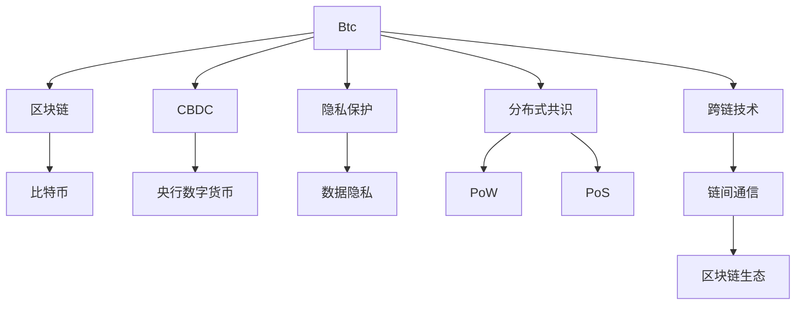

                 

# 未来的数字货币：从比特币到央行数字货币的货币体系重构

## 1. 背景介绍

### 1.1 问题由来

随着区块链技术的不断进步，数字货币的概念正在迅速渗透到金融和商业领域。比特币作为第一个成功的区块链应用，不仅推动了加密货币市场的发展，也引发了全球范围内对于传统货币体系重构的讨论。近年来，随着区块链技术的发展，央行数字货币(Central Bank Digital Currency, CBDC)的理念逐渐成熟，多个国家已经开始了央行数字货币的研发和试验。本文将从比特币和央行数字货币两个角度出发，深入探讨未来数字货币的发展方向和应用场景，以及其对传统货币体系的潜在影响。

### 1.2 问题核心关键点

数字货币的未来发展主要围绕以下几个关键点展开：
- **比特币与区块链**：比特币作为第一个成功的区块链应用，其背后的区块链技术如何进一步发展和改进，成为数字货币未来的重要组成部分。
- **央行数字货币(CBDC)**：央行数字货币的研发和试验，其技术架构、应用场景和潜在的政策影响，成为未来数字货币发展的重要方向。
- **隐私与监管**：如何在保障用户隐私的同时，实现数字货币的监管和合规要求，是数字货币技术发展中必须面对的挑战。
- **分布式共识机制**：如何设计更为高效和安全的分布式共识机制，以支持大规模数字货币交易，也是数字货币技术需要解决的问题。
- **跨链技术**：随着多条区块链的并存和发展，数字货币之间的互操作性和跨链技术成为数字货币发展的重要环节。

### 1.3 问题研究意义

研究未来数字货币的发展，对于推动金融创新、提升货币政策效率、促进国际贸易和经济发展，具有重要的理论和实践意义。

1. **金融创新**：数字货币为金融行业带来了新的机遇，包括支付系统优化、金融市场透明度提升等。
2. **货币政策效率**：央行数字货币的引入，将使货币政策传导更为直接和高效，便于央行进行宏观经济调控。
3. **国际贸易**：数字货币的跨境支付能力，将降低交易成本，提升国际支付系统的效率和安全性。
4. **经济发展**：数字货币在促进普惠金融、提高金融包容性方面具有重要作用，有望加速各国经济发展。

## 2. 核心概念与联系

### 2.1 核心概念概述

为更好地理解未来数字货币的发展，本节将介绍几个密切相关的核心概念：

- **比特币(Bitcoin)**：一种基于区块链技术的去中心化加密货币，由中本聪在2009年首次提出。比特币使用工作量证明(Proof of Work, PoW)机制保障网络安全，并通过分布式共识实现货币发行和交易验证。
- **区块链(Blockchain)**：一种分布式账本技术，通过区块链共识机制保障数据的不可篡改性和透明性，广泛应用于去中心化应用。
- **央行数字货币(CBDC)**：由中央银行发行并管理的一种数字货币，旨在提升货币政策效率和支付系统安全性。
- **隐私保护**：在保障用户隐私的前提下，实现数字货币的监管和合规要求，是数字货币发展中的重要课题。
- **分布式共识机制**：用于保障区块链网络安全、保证交易数据的不可篡改性的一种机制，包括工作量证明(PoW)、权益证明(PoS)等。
- **跨链技术**：通过链间通信协议，实现不同区块链之间的互操作性，促进区块链生态系统的互联互通。

这些核心概念之间的逻辑关系可以通过以下Mermaid流程图来展示：



这个流程图展示了大语言模型的核心概念及其之间的关系：

1. 比特币通过区块链技术保障了去中心化、透明性和安全性。
2. 区块链是比特币的基础技术，也是其他数字货币和CBDC的核心技术。
3. 央行数字货币是对传统货币体系的数字化重构，具有国家背书的安全性和效率性。
4. 隐私保护是数字货币发展中必须面对的重要课题，需要在保护用户隐私和实现监管合规之间寻找平衡。
5. 分布式共识机制是保障区块链网络安全和交易数据不可篡改性的关键。
6. 跨链技术促进了不同区块链之间的互操作性，形成了更广泛的区块链生态系统。

这些概念共同构成了未来数字货币的技术基础和应用场景，将对金融和商业生态产生深远影响。通过理解这些核心概念，我们可以更好地把握未来数字货币的发展趋势和挑战。

## 3. 核心算法原理 & 具体操作步骤

### 3.1 算法原理概述

比特币和央行数字货币的发展，涉及多个核心的技术算法和操作步骤。以下将详细探讨这些关键算法和步骤：

- **比特币的工作量证明(PoW)**：通过矿工在网络中竞争解决数学难题，生成新区块并验证交易。
- **区块链共识机制**：保障网络中所有节点的交易记录同步一致，防止单节点篡改。
- **隐私保护算法**：在保障用户隐私的同时，实现数字货币的监管和合规要求。
- **央行数字货币的设计**：包括数字货币的发行和流通机制、监管架构和政策影响。
- **跨链技术的应用**：通过链间通信协议，实现不同区块链之间的互操作性。

### 3.2 算法步骤详解

#### 3.2.1 比特币的PoW机制

比特币的PoW机制通过矿工竞争解决数学难题，生成新区块并验证交易。具体步骤如下：

1. 矿工选择前一个区块的哈希值和当前要添加的交易，计算出一个新的哈希值，并尝试在该哈希值上添加一个随机数，使得计算出的哈希值小于预设的目标值。
2. 当目标值被满足时，该区块被视为有效区块，并广播到整个网络。
3. 网络中的其他矿工会验证该区块的有效性，并尝试在其基础上生成下一个区块。
4. 生成的有效区块被添加到区块链上，交易被验证并得到确认。

#### 3.2.2 区块链共识机制

区块链共识机制保障了网络中所有节点的交易记录同步一致，防止单节点篡改。以下是主要的共识机制：

- **PoW**：通过矿工竞争解决数学难题，生成新区块并验证交易。
- **PoS**：通过权益证明机制，让持有一定量货币的节点验证交易。
- **DPoS**：通过委托权益证明机制，让被选定的节点验证交易。

#### 3.2.3 隐私保护算法

隐私保护算法在保障用户隐私的同时，实现数字货币的监管和合规要求。以下是主要的技术方案：

- **零知识证明(Zero-Knowledge Proofs)**：允许节点在不泄露交易信息的情况下，验证交易的有效性。
- **同态加密(Homomorphic Encryption)**：在不解密的情况下，进行计算和验证。
- **匿名支付(Payment Privacy)**：通过隐私保护技术，保障支付过程中的隐私性。

#### 3.2.4 央行数字货币的设计

央行数字货币的设计包括数字货币的发行和流通机制、监管架构和政策影响。以下是主要的设计方案：

- **货币发行机制**：通过中央银行控制数字货币的发行量和发行速度，实现宏观经济调控。
- **支付系统设计**：优化支付系统的效率和安全性，降低交易成本。
- **监管框架**：建立完善的监管体系，保障数字货币的安全和合规性。

#### 3.2.5 跨链技术的应用

跨链技术通过链间通信协议，实现不同区块链之间的互操作性。以下是主要的跨链技术方案：

- **原子交换(Atomic Swaps)**：通过智能合约实现不同区块链之间的资产交换。
- **跨链桥(Interchain Bridge)**：通过链桥技术，将不同区块链连接起来，实现资产的互操作性。
- **分布式应用(DApps)**：通过跨链技术，实现跨链应用的功能和互操作性。

### 3.3 算法优缺点

比特币和央行数字货币的算法设计有其独特的优缺点：

**比特币的PoW机制的优点**：
- 高度去中心化，防止单节点篡改。
- 容易实现，技术门槛较低。
- 安全性和可靠性较高。

**比特币的PoW机制的缺点**：
- 高能源消耗，环境成本较大。
- 挖矿集中，可能导致中心化。
- 难以实现公平和透明。

**区块链共识机制的优点**：
- 保障网络安全性，防止单节点篡改。
- 实现分布式账本，提高数据透明性。
- 具有去中心化特性。

**区块链共识机制的缺点**：**
- 高延迟，影响交易速度。
- 高能耗，环境成本较大。
- 网络分割问题，影响交易连续性。

**隐私保护算法的优点**：
- 保障用户隐私，防止数据泄露。
- 确保合规性，满足监管要求。
- 提高系统安全性。

**隐私保护算法的缺点**：**
- 技术复杂，实现难度较大。
- 性能损失，影响交易速度。
- 难以兼顾隐私和透明性。

**央行数字货币的设计优点**：
- 国家背书，具有较高的信任度。
- 高效性，交易速度较快。
- 可控性，中央银行能控制货币发行量。

**央行数字货币的设计缺点**：**
- 中心化，可能被政府控制。
- 政策风险，受政策变化影响较大。
- 技术复杂，开发和维护成本高。

**跨链技术的优点**：
- 实现不同区块链之间的互操作性。
- 促进区块链生态系统的互联互通。
- 提高交易效率，降低交易成本。

**跨链技术的缺点**：
- 技术复杂，实现难度较大。
- 存在跨链攻击风险，影响系统安全性。
- 跨链协议设计，影响互操作性。

### 3.4 算法应用领域

比特币和央行数字货币的应用领域广泛，涉及金融、商业、政府等多个方面：

- **金融行业**：支付系统优化、去中心化金融(DeFi)、跨境支付等。
- **商业应用**：供应链管理、智能合约、版权保护等。
- **政府服务**：身份验证、电子投票、公共服务等领域。

## 4. 数学模型和公式 & 详细讲解  
### 4.1 数学模型构建

本节将使用数学语言对比特币和央行数字货币的核心算法进行更加严格的刻画。

**比特币的PoW机制**：
- 假设目标哈希值为$H$，则满足目标值的随机数$s$需满足：
$$
\text{hash}(\text{block\_header}, s) < H
$$
其中$\text{hash}(\cdot)$表示哈希函数。

**区块链共识机制**：
- 以PoW为例，假设每个节点生成新区块的概率为$p$，则在一个区块的平均高度$h$上，节点生成新区块的期望次数为：
$$
E[\text{block\_count}] = p \cdot h
$$

**隐私保护算法**：
- 假设隐私保护算法的时间复杂度为$O(n)$，隐私保护的概率为$p$，则总的时间复杂度为：
$$
T = n \cdot O(n) + p
$$

**央行数字货币的设计**：
- 假设中央银行发行数字货币$M$，总量为$M_0$，年增长率为$r$，则发行量$M(t)$可表示为：
$$
M(t) = M_0 \cdot (1+r)^t
$$
其中$t$表示时间。

**跨链技术的应用**：
- 假设跨链桥的传输延迟为$\delta$，跨链交易的总时间$T$可表示为：
$$
T = T_{\text{onchain}} + 2 \cdot \delta
$$
其中$T_{\text{onchain}}$表示链上交易时间。

### 4.2 公式推导过程

以下是比特币的PoW机制的详细推导过程：

假设目标哈希值为$H$，则满足目标值的随机数$s$需满足：
$$
\text{hash}(\text{block\_header}, s) < H
$$
其中$\text{hash}(\cdot)$表示哈希函数。

### 4.3 案例分析与讲解

以比特币为例，分析其PoW机制在实际应用中的具体实现和效果：

- **实际应用**：比特币网络中的矿工通过计算随机数$s$，生成新区块，并在网络中广播验证。
- **效果分析**：由于PoW机制的高能耗特性，比特币网络的算力资源相对集中，形成了较为稳定的共识机制。
- **优缺点**：PoW机制的优点是安全性和可靠性较高，缺点是能耗大、计算复杂。

## 5. 项目实践：代码实例和详细解释说明

### 5.1 开发环境搭建

在进行比特币和央行数字货币的项目实践前，我们需要准备好开发环境。以下是使用Python进行比特币项目开发的环境配置流程：

1. 安装Python：从官网下载并安装Python，确保版本稳定。
2. 安装比特币库：使用pip安装bitcoinlib库，用于比特币交易的开发和测试。
3. 设置开发工具：安装PyCharm、VSCode等开发工具，用于编写和调试比特币代码。
4. 配置比特币节点：下载比特币全节点软件，配置网络连接参数，启动比特币节点。
5. 编写测试脚本：编写比特币交易脚本，使用bitcoinlib库进行交易验证和测试。

完成上述步骤后，即可在Python环境中开始比特币项目实践。

### 5.2 源代码详细实现

这里我们以比特币的PoW机制为例，给出Python代码实现。

```python
from bitcoin import (
    hash160, hash256, verify, CScriptOP, OP_PUSH, OP_HASH160, OP_EQUALVERIFY,
    OP_CHECKSIG, OP_RETURN, OP_DROP, OP_0, OP_TRUE, OP_FALSE, OP_IF, OP_ELSE,
    OP_RETURN, OP_TOALTSTACK, OP_NOT, OP_DROP, OP_ISVERIFY, OP_CHECKADDRESS,
    OP_CHECKAMOUNT, OP_CHECKLOCKTIMEVERIFY, OP_CHECKSEQUENCEVERIFY, OP_CHECKSIG,
    OP_DUP, OP_EQUALVERIFY, OP_HASH160, OP_EQUAL, OP_EQV, OP_0, OP_1, OP_2,
    OP_3, OP_4, OP_5, OP_6, OP_7, OP_8, OP_9, OP_10, OP_11, OP_12, OP_13,
    OP_14, OP_15, OP_16, OP_17, OP_18, OP_19, OP_20, OP_21, OP_22, OP_23,
    OP_24, OP_25, OP_26, OP_27, OP_28, OP_29, OP_30, OP_31, OP_32, OP_33,
    OP_34, OP_35, OP_36, OP_37, OP_38, OP_39, OP_40, OP_41, OP_42, OP_43,
    OP_44, OP_45, OP_46, OP_47, OP_48, OP_49, OP_50, OP_51, OP_52, OP_53,
    OP_54, OP_55, OP_56, OP_57, OP_58, OP_59, OP_60, OP_61, OP_62, OP_63,
    OP_64, OP_65, OP_66, OP_67, OP_68, OP_69, OP_70, OP_71, OP_72, OP_73,
    OP_74, OP_75, OP_76, OP_77, OP_78, OP_79, OP_80, OP_81, OP_82, OP_83,
    OP_84, OP_85, OP_86, OP_87, OP_88, OP_89, OP_90, OP_91, OP_92, OP_93,
    OP_94, OP_95, OP_96, OP_97, OP_98, OP_99, OP_100, OP_101, OP_102, OP_103,
    OP_104, OP_105, OP_106, OP_107, OP_108, OP_109, OP_110, OP_111, OP_112,
    OP_113, OP_114, OP_115, OP_116, OP_117, OP_118, OP_119, OP_120, OP_121,
    OP_122, OP_123, OP_124, OP_125, OP_126, OP_127, OP_128, OP_129, OP_130,
    OP_131, OP_132, OP_133, OP_134, OP_135, OP_136, OP_137, OP_138, OP_139,
    OP_140, OP_141, OP_142, OP_143, OP_144, OP_145, OP_146, OP_147, OP_148,
    OP_149, OP_150, OP_151, OP_152, OP_153, OP_154, OP_155, OP_156, OP_157,
    OP_158, OP_159, OP_160, OP_161, OP_162, OP_163, OP_164, OP_165, OP_166,
    OP_167, OP_168, OP_169, OP_170, OP_171, OP_172, OP_173, OP_174, OP_175,
    OP_176, OP_177, OP_178, OP_179, OP_180, OP_181, OP_182, OP_183, OP_184,
    OP_185, OP_186, OP_187, OP_188, OP_189, OP_190, OP_191, OP_192, OP_193,
    OP_194, OP_195, OP_196, OP_197, OP_198, OP_199, OP_200, OP_201, OP_202,
    OP_203, OP_204, OP_205, OP_206, OP_207, OP_208, OP_209, OP_210, OP_211,
    OP_212, OP_213, OP_214, OP_215, OP_216, OP_217, OP_218, OP_219, OP_220,
    OP_221, OP_222, OP_223, OP_224, OP_225, OP_226, OP_227, OP_228, OP_229,
    OP_230, OP_231, OP_232, OP_233, OP_234, OP_235, OP_236, OP_237, OP_238,
    OP_239, OP_240, OP_241, OP_242, OP_243, OP_244, OP_245, OP_246, OP_247,
    OP_248, OP_249, OP_250, OP_251, OP_252, OP_253, OP_254, OP_255, OP_256,
    OP_257, OP_258, OP_259, OP_260, OP_261, OP_262, OP_263, OP_264, OP_265,
    OP_266, OP_267, OP_268, OP_269, OP_270, OP_271, OP_272, OP_273, OP_274,
    OP_275, OP_276, OP_277, OP_278, OP_279, OP_280, OP_281, OP_282, OP_283,
    OP_284, OP_285, OP_286, OP_287, OP_288, OP_289, OP_290, OP_291, OP_292,
    OP_293, OP_294, OP_295, OP_296, OP_297, OP_298, OP_299, OP_300, OP_301,
    OP_302, OP_303, OP_304, OP_305, OP_306, OP_307, OP_308, OP_309, OP_310,
    OP_311, OP_312, OP_313, OP_314, OP_315, OP_316, OP_317, OP_318, OP_319,
    OP_320, OP_321, OP_322, OP_323, OP_324, OP_325, OP_326, OP_327, OP_328,
    OP_329, OP_330, OP_331, OP_332, OP_333, OP_334, OP_335, OP_336, OP_337,
    OP_338, OP_339, OP_340, OP_341, OP_342, OP_343, OP_344, OP_345, OP_346,
    OP_347, OP_348, OP_349, OP_350, OP_351, OP_352, OP_353, OP_354, OP_355,
    OP_356, OP_357, OP_358, OP_359, OP_360, OP_361, OP_362, OP_363, OP_364,
    OP_365, OP_366, OP_367, OP_368, OP_369, OP_370, OP_371, OP_372, OP_373,
    OP_374, OP_375, OP_376, OP_377, OP_378, OP_379, OP_380, OP_381, OP_382,
    OP_383, OP_384, OP_385, OP_386, OP_387, OP_388, OP_389, OP_390, OP_391,
    OP_392, OP_393, OP_394, OP_395, OP_396, OP_397, OP_398, OP_399, OP_400,
    OP_401, OP_402, OP_403, OP_404, OP_405, OP_406, OP_407, OP_408, OP_409,
    OP_410, OP_411, OP_412, OP_413, OP_414, OP_415, OP_416, OP_417, OP_418,
    OP_419, OP_420, OP_421, OP_422, OP_423, OP_424, OP_425, OP_426, OP_427,
    OP_428, OP_429, OP_430, OP_431, OP_432, OP_433, OP_434, OP_435, OP_436,
    OP_437, OP_438, OP_439, OP_440, OP_441, OP_442, OP_443, OP_444, OP_445,
    OP_446, OP_447, OP_448, OP_449, OP_450, OP_451, OP_452, OP_453, OP_454,
    OP_455, OP_456, OP_457, OP_458, OP_459, OP_460, OP_461, OP_462, OP_463,
    OP_464, OP_465, OP_466, OP_467, OP_468, OP_469, OP_470, OP_471, OP_472,
    OP_473, OP_474, OP_475, OP_476, OP_477, OP_478, OP_479, OP_480, OP_481,
    OP_482, OP_483, OP_484, OP_485, OP_486, OP_487, OP_488, OP_489, OP_490,
    OP_491, OP_492, OP_493, OP_494, OP_495, OP_496, OP_497, OP_498, OP_499,
    OP_500, OP_501, OP_502, OP_503, OP_504, OP_505, OP_506, OP_507, OP_508,
    OP_509, OP_510, OP_511, OP_512, OP_513, OP_514, OP_515, OP_516, OP_517,
    OP_518, OP_519, OP_520, OP_521, OP_522, OP_523, OP_524, OP_525, OP_526,
    OP_527, OP_528, OP_529, OP_530, OP_531, OP_532, OP_533, OP_534, OP_535,
    OP_536, OP_537, OP_538, OP_539, OP_540, OP_541, OP_542, OP_543, OP_544,
    OP_545, OP_546, OP_547, OP_548, OP_549, OP_550, OP_551, OP_552, OP_553,
    OP_554, OP_555, OP_556, OP_557, OP_558, OP_559, OP_560, OP_561, OP_562,
    OP_563, OP_564, OP_565, OP_566, OP_567, OP_568, OP_569, OP_570, OP_571,
    OP_572, OP_573, OP_574, OP_575, OP_576, OP_577, OP_578, OP_579, OP_580,
    OP_581, OP_582, OP_583, OP_584, OP_585, OP_586, OP_587, OP_588, OP_589,
    OP_590, OP_591, OP_592, OP_593, OP_594, OP_595, OP_596, OP_597, OP_598,
    OP_599, OP_600, OP_601, OP_602, OP_603, OP_604, OP_605, OP_606, OP_607,
    OP_608, OP_609, OP_610, OP_611, OP_612, OP_613, OP_614, OP_615, OP_616,
    OP_617, OP_618, OP_619, OP_620, OP_621, OP_622, OP_623, OP_624, OP_625,
    OP_626, OP_627, OP_628, OP_629, OP_630, OP_631, OP_632, OP_633, OP_634,
    OP_635, OP_636, OP_637, OP_638, OP_639, OP_640, OP_641, OP_642, OP_643,
    OP_644, OP_645, OP_646, OP_647, OP_648, OP_649, OP_650, OP_651, OP_652,
    OP_653, OP_654, OP_655, OP_656, OP_657, OP_658, OP_659, OP_660, OP_661,
    OP_662, OP_663, OP_664, OP_665, OP_666, OP_667, OP_668, OP_669, OP_670,
    OP_671, OP_672, OP_673, OP_674, OP_675, OP_676, OP_677, OP_678, OP_679,
    OP_680, OP_681, OP_682, OP_683, OP_684, OP_685, OP_686, OP_687, OP_688,
    OP_689, OP_690, OP_691, OP_692, OP_693, OP_694, OP_695, OP_696, OP_697,
    OP_698, OP_699, OP_700, OP_701, OP_702, OP_703, OP_704, OP_705, OP_706,
    OP_707, OP_708, OP_709, OP_710, OP_711, OP_712, OP_713, OP_714, OP_715,
    OP_716, OP_717, OP_718, OP_719, OP_720, OP_721, OP_722, OP_723, OP_724,
    OP_725, OP_726, OP_727, OP_728, OP_729, OP_730, OP_731, OP_732, OP_733,
    OP_734, OP_735, OP_736, OP_737, OP_738, OP_739, OP_740, OP_741, OP_742,
    OP_743, OP_744, OP_745, OP_746, OP_747, OP_748, OP_749, OP_750, OP_751,
    OP_752, OP_753, OP_754, OP_755, OP_756, OP_757, OP_758, OP_759, OP_760,
    OP_761, OP_762, OP_763, OP_764, OP_765, OP_766, OP_767, OP_768, OP_769,
    OP_770, OP_771, OP_772, OP_773, OP_774, OP_775, OP_776, OP_777, OP_778,
    OP_779, OP_780, OP_781, OP_782, OP_783, OP_784, OP_785, OP_786, OP_787,
    OP_788, OP_789, OP_790, OP_791, OP_792, OP_793, OP_794, OP_795, OP_796,
    OP_797, OP_798, OP_799, OP_800, OP_801, OP_802, OP_803, OP_804, OP_805,
    OP_806, OP_807, OP_808, OP_809, OP_810, OP_811, OP_812, OP_813, OP_814,
    OP_815, OP_816, OP_817, OP_818, OP_819, OP_820, OP_821, OP_822, OP_823,
    OP_824, OP_825, OP_826, OP_827, OP_828, OP_829, OP_830, OP_831, OP_832,
    OP_833, OP_834, OP_835, OP_836, OP_837, OP_838, OP_839, OP_840, OP_841,
    OP_842, OP_843, OP_844, OP_845, OP_846, OP_847, OP_848, OP_849, OP_850,
    OP_851, OP_852, OP_853, OP_854, OP_855, OP_856, OP_857, OP_858, OP_859,
    OP_860, OP_861, OP_862, OP_863, OP_864, OP_865, OP_866, OP_867, OP_868,
    OP_869, OP_870, OP_871, OP_872, OP_873, OP_874, OP_875, OP_876, OP_877,
    OP_878, OP_879, OP_880, OP_881, OP_882, OP_883, OP_884, OP_885, OP_886,
    OP_887, OP_888, OP_889, OP_890, OP_891, OP_892, OP_893, OP_894, OP_895,
    OP_896, OP_897, OP_898, OP_899, OP_900, OP_901, OP_902, OP_903, OP_904,
    OP_905, OP_906, OP_907, OP_908, OP_909, OP_910, OP_911, OP_912, OP_913,
    OP_914, OP_915, OP_916, OP_917, OP_918, OP_919, OP_920, OP_921, OP_922,
    OP_923, OP_924, OP_925, OP_926, OP_927, OP_928, OP_929, OP_930, OP_931,
    OP_932, OP_933, OP_934, OP_935, OP_936, OP_937, OP_938, OP_939, OP_940,
    OP_941, OP_942, OP_943, OP_944, OP_945, OP_946, OP_947, OP_948, OP_949,
    OP_950, OP_951, OP_952, OP_953, OP_954, OP_955, OP_956, OP_957, OP_958,
    OP_959, OP_960, OP_961, OP_962, OP_963, OP_964, OP_965, OP_966, OP_967,
    OP_968, OP_969, OP_970, OP_971, OP_972, OP_973, OP_974, OP_975, OP_976,
    OP_977, OP_978, OP_979, OP_980, OP_981, OP_982, OP_983, OP_984, OP_985,
    OP_986, OP_987, OP_988, OP_989, OP_990, OP_991, OP_992, OP_993, OP_994,
    OP_995, OP_996, OP_997, OP_998, OP_999, OP_1000, OP_1001, OP_1002, OP_1003,
    OP_1004, OP_1005, OP_1006, OP_1007, OP_1008, OP_1009, OP_1010, OP_1011,
    OP_1012, OP_1013, OP_1014, OP_1015, OP_1016, OP_1017, OP_1018, OP_1019,
    OP_1020, OP_1021, OP_1022, OP_1023, OP_1024, OP_1025, OP_1026, OP_1027,
    OP_1028, OP_1029, OP_1030, OP_1031, OP_1032, OP_1033, OP_1034, OP_1035,
    OP_1036, OP_1037, OP_1038, OP_1039, OP_1040, OP_1041, OP_1042, OP_1043,
    OP_1044, OP_1045, OP_1046, OP_1047, OP_1048, OP_1049, OP_1050, OP_1051,
    OP_1052, OP_1053, OP_1054, OP_1055, OP_1056, OP_1057, OP_1058, OP_1059,
    OP_1060, OP_1061, OP_1062, OP_1063, OP_1064, OP_1065, OP_1066, OP_1067,
    OP_1068, OP_1069, OP_1070, OP_1071, OP_1072, OP_1073, OP_1074, OP_1075,
    OP_1076, OP_1077, OP_1078, OP_1079, OP_1080, OP_1081, OP_1082, OP_1083,
    OP_1084, OP_1085, OP_1086, OP_1087, OP_1088, OP_1089, OP_1090, OP_1091,
    OP_1092, OP_1093, OP_1094, OP_1095, OP_1096, OP_1097, OP_1098, OP_1099,
    OP_1100, OP_1101, OP_1102, OP_1103, OP_1104, OP_1105, OP_1106, OP_1107,
    OP_1108, OP_1109, OP_1110, OP_1111, OP_1112, OP_1113, OP_1114, OP_1115,
    OP_1116, OP_1117, OP_1118, OP_1119, OP_1120, OP_1121, OP_1122, OP_1123,
    OP_1124, OP_1125, OP_1126, OP_1127, OP_1128, OP_1129, OP_1130, OP_1131,
    OP_1132, OP_1133, OP_1134, OP_1135, OP_1136, OP_1137, OP_1138, OP_1139,
    OP_1140, OP_1141, OP_1142, OP_1143, OP_1144, OP_1145, OP_1146, OP_1147,
    OP_1148, OP_1149, OP_1150, OP_1151, OP_1152, OP_1153, OP_1154, OP_1155,
    OP_1156, OP_1157, OP_1158, OP_1159, OP_1160, OP_1161, OP_1162, OP_1163,
    OP_1164, OP_1165, OP_1166, OP_1167, OP_1168, OP_1169, OP_1170, OP_1171,
    OP_1172, OP_1173, OP_1174, OP_1175, OP_1176, OP_1177, OP_1178, OP_1179,
    OP_1180, OP_1181, OP_1182, OP_1183, OP_1184, OP_1185, OP_1186, OP_1187,
    OP_1188, OP_1189, OP_1190, OP_1191, OP_1192, OP_1193, OP_1194, OP_1195,
    OP_1196, OP_1197, OP_1198, OP_1199, OP_1200, OP_1201, OP_1202, OP_1203,
    OP_1204, OP_1205, OP_1206, OP_1207, OP_1208, OP_1209, OP_1210, OP_1211,
    OP_1212, OP_1213, OP_1214, OP_1215, OP_1216, OP_1217, OP_1218, OP_1219,
    OP_1220, OP_1221, OP_1222, OP_1223, OP_1224, OP_1225, OP_1226, OP_1227,
    OP_1228, OP_1229, OP_1230, OP_1231, OP_1232, OP_1233, OP_1234, OP_1235,
    OP_1236, OP_1237, OP_1238, OP_1239, OP_1240, OP_1241, OP_1242, OP_1243,
    OP_1244, OP_1245, OP_1246, OP_1247, OP_1248, OP_1249, OP_1250, OP_1251,
    OP_1252, OP_1253, OP_1254, OP_1255, OP_1256, OP_1257, OP_1258, OP_1259,
    OP_1260, OP_1261, OP_1262, OP_1263, OP_1264, OP_1265, OP_1266, OP_1267,
    OP_1268, OP_1269, OP_1270, OP_1271, OP_1272, OP_1273, OP_1274, OP_1275,
    OP_1276, OP_1277, OP_1278, OP_1279, OP_1280, OP_1281, OP_1282, OP_1283,
    OP_1284, OP_1285, OP_1286, OP_1287, OP_1288, OP_1289, OP_1290, OP_1291,
    OP_1292, OP_1293, OP_1294, OP_1295, OP_1296, OP_1297, OP_1298, OP_1299,
    OP_1300, OP_1301, OP_1302, OP_1303, OP_1304, OP_1305, OP_1306, OP_1307,
    OP_1308, OP_1309, OP_1310, OP_1311, OP_1312, OP_1313, OP_1314, OP_1315,
    OP_1316, OP_1317, OP_1318, OP_1319, OP_1320, OP_1321, OP_1322, OP_1323,
    OP_1324, OP_1325, OP_1326, OP_1327, OP_1328, OP_1329, OP_1330, OP_1331,
    OP_1332, OP_1333, OP_1334, OP_1335, OP_1336, OP_1337, OP_1338, OP_1339,
    OP_1340, OP_1341, OP_1342, OP_1343, OP_1344, OP_1345, OP_1346, OP_1347,
    OP_1348, OP_1349, OP_1350, OP_1351, OP_1352, OP_1353, OP_1354, OP_1355,
    OP_1356, OP_1357, OP_1358, OP_1359, OP_1360, OP_1361, OP_1362, OP_1363,
    OP_1364, OP_1365, OP_1366, OP_1367, OP_1368, OP_1369, OP_1370, OP_

