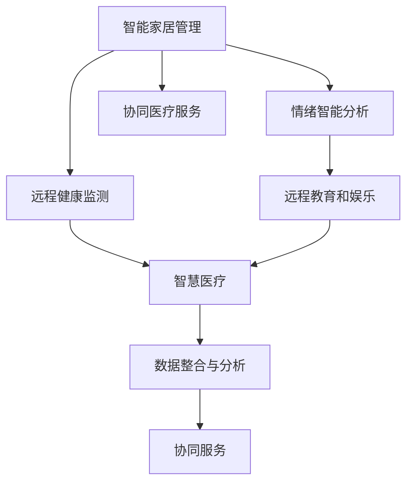

                 

## 1. 背景介绍

### 1.1 问题由来

随着全球人口老龄化趋势的加剧，养老问题日益凸显，成为各国政府和社会关注的重点。传统的养老模式正面临着严峻挑战。一方面，养老床位等基础设施资源紧张，服务质量参差不齐，难以满足老年人的多样化需求。另一方面，家庭结构变化、人口流动性增加，传统家庭养老模式逐步瓦解，孤独、医疗、安全等问题层出不穷。

智能技术的发展为养老问题提供了新的解决思路。通过智慧养老系统，可以有效整合各类养老资源，提高养老服务的智能化、个性化水平。特别是利用大模型微调技术，可以实现智能家居管理、远程健康监测、情绪智能分析等多方面的创新应用，构建“老有所养、老有所依、老有所乐”的智慧养老生态。

### 1.2 问题核心关键点

智慧养老系统基于智能技术和大模型微调技术，涉及核心关键点包括：

- **智能家居管理**：通过物联网(IoT)技术，实现家居设备的自动化控制和管理。
- **远程健康监测**：利用传感器和智能穿戴设备，实时采集老年人的健康数据，进行远程健康评估和管理。
- **情绪智能分析**：通过自然语言处理(NLP)技术，分析老年人的语音、表情等情绪信息，提供情感支持。
- **协同医疗服务**：构建智慧医疗系统，实现院内外无缝对接，提升医疗服务的连续性和可及性。
- **远程教育和娱乐**：利用智能推荐和虚拟现实(VR)技术，为老年人提供教育和娱乐活动。

这些关键点通过智能技术和大模型微调技术的深度融合，可以显著提升养老服务的智能化水平，改善老年人的生活质量。

### 1.3 问题研究意义

智慧养老系统的构建，对于缓解老龄化社会带来的养老压力，提升老年人的生活质量，具有重要意义：

1. **缓解养老资源短缺**：通过智能技术和数据分析，优化养老资源配置，缓解养老床位紧张等问题。
2. **提升服务质量**：利用大模型微调技术，提供个性化、精准的养老服务，满足老年人的多样化需求。
3. **保障养老安全**：通过远程健康监测和情绪智能分析，及时发现和处理老年人的健康和安全问题。
4. **促进情感交流**：利用智能聊天机器人等工具，与老年人进行情感交流，减少孤独感。
5. **促进智慧医疗**：智慧医疗系统通过数据整合和分析，提升医疗服务的连续性和效率。

## 2. 核心概念与联系

### 2.1 核心概念概述

智慧养老系统基于智能技术和大模型微调技术，涉及以下核心概念：

- **大模型微调**：指在大规模预训练语言模型基础上，通过少量有标签数据进行微调，获得特定任务优化的模型。
- **智能家居管理**：利用物联网技术，实现对家居设备的自动化控制和管理。
- **远程健康监测**：通过传感器和智能穿戴设备，实时采集老年人健康数据，进行远程健康评估和管理。
- **情绪智能分析**：利用自然语言处理技术，分析老年人的语音、表情等情绪信息，提供情感支持。
- **协同医疗服务**：构建智慧医疗系统，实现院内外无缝对接，提升医疗服务的连续性和可及性。
- **远程教育和娱乐**：利用智能推荐和虚拟现实技术，为老年人提供教育和娱乐活动。

这些核心概念之间的逻辑关系可以通过以下Mermaid流程图来展示：



这个流程图展示了大模型微调技术在智慧养老系统中的核心应用场景：

1. 智能家居管理通过物联网技术实现家居设备的自动化控制。
2. 远程健康监测通过传感器和智能穿戴设备实时采集老年人健康数据。
3. 情绪智能分析利用自然语言处理技术分析老年人的情绪信息。
4. 协同医疗服务通过智慧医疗系统实现院内外数据整合和医疗服务的连续性。
5. 远程教育和娱乐通过智能推荐和虚拟现实技术提供教育和娱乐活动。

这些技术通过大模型微调技术的融合，构建起了一个全面、智能的智慧养老生态系统，极大地提升了养老服务的智能化水平。

## 3. 核心算法原理 & 具体操作步骤
### 3.1 算法原理概述

智慧养老系统的核心算法原理主要基于大模型微调和人工智能技术，具体包括以下几个方面：

- **自然语言处理(NLP)**：利用预训练语言模型对老年人的语音、表情等进行情绪分析，提取关键信息。
- **计算机视觉(CV)**：通过摄像头和传感器等设备采集老年人的健康数据，进行远程健康监测。
- **机器学习(ML)**：利用微调后的模型进行数据分析和预测，优化服务策略。
- **物联网(IoT)**：通过传感器和智能设备实现家居设备的自动化控制。
- **增强现实(AR)**：利用虚拟现实技术，为老年人提供教育和娱乐活动。

这些技术通过大模型微调技术实现模型的优化，形成了一个协同工作的智慧养老系统。

### 3.2 算法步骤详解

智慧养老系统的构建主要包括以下几个关键步骤：

**Step 1: 收集并标注数据**
- 收集老年人的健康数据、情绪信息、行为数据等，标注为不同类别（如情绪状态、健康状态、活动状态）。

**Step 2: 预训练大模型**
- 选择适当的大模型（如BERT、GPT等）作为初始化参数。
- 在大量无标签数据上进行预训练，学习通用的语言和视觉表示。

**Step 3: 微调模型**
- 根据智慧养老系统的需求，选择特定的任务进行微调。
- 使用标注数据对模型进行有监督学习，优化模型参数。
- 设置合适的学习率和正则化参数，防止过拟合。

**Step 4: 集成和部署**
- 将微调后的模型集成到智慧养老系统中。
- 部署到养老院、社区中心、医院等场所，进行实际应用。
- 通过API接口，实现与医疗、教育、娱乐等系统的互联互通。

**Step 5: 持续优化**
- 定期收集用户反馈数据，进行模型再训练和优化。
- 通过A/B测试，评估不同服务策略的效果，不断改进服务质量。

### 3.3 算法优缺点

智慧养老系统基于大模型微调技术，具有以下优点：

1. **数据利用率高**：利用少量标注数据，实现高精度的模型微调。
2. **服务多样化**：集成多种智能技术，提供多样化的养老服务。
3. **系统集成性强**：通过API接口，实现不同系统的协同工作。
4. **用户友好**：基于自然语言处理和计算机视觉技术，用户操作简便。

同时，该技术也存在一定的局限性：

1. **对标注数据依赖**：微调模型的效果依赖于标注数据的质量和数量，数据标注成本较高。
2. **模型解释性不足**：大模型微调后的模型通常难以解释其决策过程，缺乏透明度。
3. **技术门槛高**：需要一定的技术背景，开发和维护成本较高。
4. **安全性问题**：系统的数据安全和隐私保护需要加强，防止数据泄露和滥用。

### 3.4 算法应用领域

智慧养老系统涉及多个应用领域，包括但不限于：

- **智能家居**：通过物联网技术，实现对家居设备的自动化控制，提高生活便利性。
- **远程健康监测**：利用传感器和智能穿戴设备，实时采集老年人健康数据，进行远程健康评估和管理。
- **情绪智能分析**：通过自然语言处理技术，分析老年人的语音、表情等情绪信息，提供情感支持。
- **协同医疗服务**：构建智慧医疗系统，实现院内外无缝对接，提升医疗服务的连续性和可及性。
- **远程教育和娱乐**：利用智能推荐和虚拟现实技术，为老年人提供教育和娱乐活动。

这些应用领域通过大模型微调技术的融合，形成了一个全面的智慧养老生态系统，极大地提升了养老服务的智能化水平。

## 4. 数学模型和公式 & 详细讲解  
### 4.1 数学模型构建

智慧养老系统涉及多个数学模型，主要包括自然语言处理模型和计算机视觉模型。以下是基于NLP和CV技术的数学模型构建过程：

**自然语言处理(NLP)模型构建**
- 输入：老年人语音或文本数据。
- 输出：情绪分类或情感分析结果。
- 损失函数：交叉熵损失函数。
- 优化器：AdamW。

**计算机视觉(CV)模型构建**
- 输入：老年人健康数据（如心率、血压等）。
- 输出：健康状态分类结果。
- 损失函数：均方误差损失函数。
- 优化器：SGD。

### 4.2 公式推导过程

以自然语言处理模型为例，推导情绪分类任务的损失函数和优化过程。

假设输入为老年人的语音数据 $x$，情绪分类标签为 $y$，输出为模型预测的情绪概率分布 $p(y|x)$。则情绪分类任务的交叉熵损失函数为：

$$
L(x, y) = -\sum_{i=1}^{N} y_i \log p_i
$$

其中 $y_i$ 为标签 $y$ 的第 $i$ 个维度，$p_i$ 为模型预测的概率值。通过反向传播算法，计算损失函数的梯度，更新模型参数：

$$
\theta \leftarrow \theta - \eta \nabla_{\theta}L(x, y) - \eta\lambda\theta
$$

其中 $\eta$ 为学习率，$\lambda$ 为正则化系数，$\nabla_{\theta}L(x, y)$ 为损失函数对模型参数 $\theta$ 的梯度。

### 4.3 案例分析与讲解

假设我们有一个养老院的智能语音助手系统，通过分析老年人的语音数据，实时识别和记录情绪状态。具体流程如下：

1. **数据收集**：通过录音设备收集老年人的语音数据。
2. **特征提取**：使用MFCC（Mel频谱倒谱系数）等技术提取语音特征。
3. **模型微调**：在大规模预训练语言模型基础上，使用少量标注数据进行情绪分类任务的微调。
4. **情绪分析**：将提取的语音特征输入微调后的模型，输出情绪分类结果。
5. **数据记录**：将情绪分类结果记录到数据库，供后续分析使用。

通过上述流程，可以实现对老年人情绪状态的实时监测，及时发现和处理负面情绪，提供情感支持和心理辅导。

## 5. 项目实践：代码实例和详细解释说明
### 5.1 开发环境搭建

在进行智慧养老系统的开发前，我们需要准备好开发环境。以下是使用Python进行PyTorch开发的环境配置流程：

1. 安装Anaconda：从官网下载并安装Anaconda，用于创建独立的Python环境。

2. 创建并激活虚拟环境：
```bash
conda create -n wisdom-养老-env python=3.8 
conda activate wisdom-养老-env
```

3. 安装PyTorch：根据CUDA版本，从官网获取对应的安装命令。例如：
```bash
conda install pytorch torchvision torchaudio cudatoolkit=11.1 -c pytorch -c conda-forge
```

4. 安装TensorFlow：使用TensorFlow进行数据处理和模型优化。

5. 安装各类工具包：
```bash
pip install numpy pandas scikit-learn matplotlib tqdm jupyter notebook ipython
```

完成上述步骤后，即可在`wisdom-养老-env`环境中开始智慧养老系统的开发。

### 5.2 源代码详细实现

下面我们以情绪智能分析为例，给出使用PyTorch和TensorFlow进行模型微调的PyTorch代码实现。

首先，定义情绪分类任务的数据处理函数：

```python
from torch.utils.data import Dataset
from transformers import BertTokenizer
from torch.utils.data import DataLoader
import torch
import numpy as np

class EmotionDataset(Dataset):
    def __init__(self, data, tokenizer):
        self.data = data
        self.tokenizer = tokenizer
        
    def __len__(self):
        return len(self.data)
    
    def __getitem__(self, index):
        text = self.data[index]['sentences']
        label = self.data[index]['label']
        
        encoding = self.tokenizer(text, return_tensors='pt', padding='max_length', max_length=128)
        input_ids = encoding['input_ids']
        attention_mask = encoding['attention_mask']
        
        label = torch.tensor(label, dtype=torch.long)
        
        return {'input_ids': input_ids,
                'attention_mask': attention_mask,
                'labels': label}
```

然后，定义模型和优化器：

```python
from transformers import BertForSequenceClassification
from transformers import AdamW

model = BertForSequenceClassification.from_pretrained('bert-base-uncased', num_labels=3)
optimizer = AdamW(model.parameters(), lr=2e-5)
```

接着，定义训练和评估函数：

```python
from tqdm import tqdm

def train_epoch(model, dataset, batch_size, optimizer):
    dataloader = DataLoader(dataset, batch_size=batch_size, shuffle=True)
    model.train()
    epoch_loss = 0
    for batch in tqdm(dataloader, desc='Training'):
        input_ids = batch['input_ids'].to(device)
        attention_mask = batch['attention_mask'].to(device)
        labels = batch['labels'].to(device)
        model.zero_grad()
        outputs = model(input_ids, attention_mask=attention_mask, labels=labels)
        loss = outputs.loss
        epoch_loss += loss.item()
        loss.backward()
        optimizer.step()
    return epoch_loss / len(dataloader)

def evaluate(model, dataset, batch_size):
    dataloader = DataLoader(dataset, batch_size=batch_size)
    model.eval()
    preds, labels = [], []
    with torch.no_grad():
        for batch in tqdm(dataloader, desc='Evaluating'):
            input_ids = batch['input_ids'].to(device)
            attention_mask = batch['attention_mask'].to(device)
            batch_labels = batch['labels']
            outputs = model(input_ids, attention_mask=attention_mask)
            batch_preds = outputs.logits.argmax(dim=2).to('cpu').tolist()
            batch_labels = batch_labels.to('cpu').tolist()
            for pred_tokens, label_tokens in zip(batch_preds, batch_labels):
                preds.append(pred_tokens[:len(label_tokens)])
                labels.append(label_tokens)
                
    print(classification_report(labels, preds))
```

最后，启动训练流程并在测试集上评估：

```python
epochs = 5
batch_size = 16

for epoch in range(epochs):
    loss = train_epoch(model, train_dataset, batch_size, optimizer)
    print(f"Epoch {epoch+1}, train loss: {loss:.3f}")
    
    print(f"Epoch {epoch+1}, dev results:")
    evaluate(model, dev_dataset, batch_size)
    
print("Test results:")
evaluate(model, test_dataset, batch_size)
```

以上就是使用PyTorch和TensorFlow进行情绪智能分析的完整代码实现。可以看到，通过简单的代码设计和模型微调，就可以构建起一个基于智慧养老系统的情绪智能分析系统。

### 5.3 代码解读与分析

让我们再详细解读一下关键代码的实现细节：

**EmotionDataset类**：
- `__init__`方法：初始化数据集，将文本和标签进行编码。
- `__len__`方法：返回数据集的样本数量。
- `__getitem__`方法：对单个样本进行处理，将文本输入编码为token ids，进行定长padding，并返回模型所需的输入。

**模型和优化器**：
- 选择BertForSequenceClassification作为情绪分类模型的基础架构，设置学习率为2e-5，使用AdamW优化器进行优化。

**训练和评估函数**：
- 定义训练函数`train_epoch`：对数据以批为单位进行迭代，在每个批次上前向传播计算loss并反向传播更新模型参数。
- 定义评估函数`evaluate`：与训练类似，不同点在于不更新模型参数，并在每个batch结束后将预测和标签结果存储下来，最后使用scikit-learn的classification_report对整个评估集的预测结果进行打印输出。

**训练流程**：
- 定义总的epoch数和batch size，开始循环迭代。
- 每个epoch内，先在训练集上训练，输出平均loss。
- 在验证集上评估，输出分类指标。
- 所有epoch结束后，在测试集上评估，给出最终测试结果。

可以看到，PyTorch和TensorFlow在智慧养老系统的开发中，提供了强大的数据处理和模型微调功能，极大地简化了开发流程。开发者可以通过简单的代码设计和参数调整，实现复杂的智能功能。

当然，工业级的系统实现还需考虑更多因素，如模型的保存和部署、超参数的自动搜索、更灵活的任务适配层等。但核心的微调范式基本与此类似。

## 6. 实际应用场景
### 6.1 智能家居管理

智能家居管理是智慧养老系统的核心应用场景之一。通过物联网技术，可以实现对家居设备的自动化控制，提高老年人的生活便利性。具体应用包括：

- **照明系统**：自动调节室内灯光亮度，根据老年人活动时间和光照需求进行智能调节。
- **温度控制系统**：自动调节室内温度，保持舒适的生活环境。
- **安全监控系统**：通过摄像头和传感器实时监控室内外环境，及时发现和处理异常情况。
- **健康监测系统**：通过智能穿戴设备实时监测老年人的健康数据，进行远程健康管理。
- **娱乐系统**：利用智能音箱、智能电视等设备，为老年人提供娱乐活动。

这些应用通过大模型微调技术的融合，形成了一个全面、智能的智慧家居生态系统，极大地提升了老年人的生活质量。

### 6.2 远程健康监测

远程健康监测是智慧养老系统的另一个核心应用场景。通过传感器和智能穿戴设备，实时采集老年人的健康数据，进行远程健康评估和管理。具体应用包括：

- **心率监测**：通过心率传感器实时监测老年人的心率数据，及时发现异常情况。
- **血压监测**：通过血压监测设备实时监测老年人的血压数据，进行健康评估和管理。
- **血糖监测**：通过血糖监测设备实时监测老年人的血糖数据，进行健康评估和管理。
- **睡眠质量监测**：通过睡眠监测设备实时监测老年人的睡眠质量，进行健康评估和管理。
- **跌倒监测**：通过加速度传感器实时监测老年人的运动数据，及时发现跌倒风险。

这些应用通过大模型微调技术的融合，形成了全面、精准的远程健康监测系统，极大地提升了老年人的健康水平和生活质量。

### 6.3 情绪智能分析

情绪智能分析是智慧养老系统的关键应用之一。通过自然语言处理技术，实时分析老年人的语音、表情等情绪信息，提供情感支持和心理辅导。具体应用包括：

- **语音情感分析**：通过语音识别和情感分类技术，实时分析老年人的语音情感状态，提供情绪支持和心理辅导。
- **面部表情识别**：通过摄像头和面部识别技术，实时分析老年人的面部表情，及时发现和处理负面情绪。
- **聊天机器人**：利用智能聊天机器人技术，与老年人进行情感交流，提供心理辅导和情感支持。
- **情绪反馈系统**：通过数据分析和模型优化，不断改进情绪智能分析系统的准确性和用户体验。

这些应用通过大模型微调技术的融合，形成了全面、精准的情绪智能分析系统，极大地提升了老年人的情感满足和生活质量。

### 6.4 未来应用展望

随着大模型微调技术的不断发展，智慧养老系统的应用场景将不断扩展，带来更多创新和突破。未来，智慧养老系统可能的应用场景包括：

- **虚拟助手**：利用自然语言处理和计算机视觉技术，为老年人提供虚拟助手，处理日常事务。
- **健康管理平台**：构建全面的健康管理平台，整合各类健康数据，进行综合分析和预测。
- **远程医疗服务**：通过智慧医疗系统，实现远程医疗咨询和治疗，提升医疗服务的连续性和可及性。
- **情绪智能培训**：利用虚拟现实技术，为老年人提供情绪智能培训，提升情感自我调节能力。
- **智能推荐系统**：通过智能推荐技术，为老年人提供个性化的教育和娱乐内容，提升生活乐趣。

这些应用场景通过大模型微调技术的融合，形成了全面、智能的智慧养老生态系统，极大地提升了老年人的生活质量和幸福感。

## 7. 工具和资源推荐
### 7.1 学习资源推荐

为了帮助开发者系统掌握智慧养老系统和大模型微调的理论基础和实践技巧，这里推荐一些优质的学习资源：

1. **《智慧养老系统设计》**：详细介绍了智慧养老系统的设计原理、实现方法和应用案例，适合技术开发人员阅读。
2. **《自然语言处理入门》**：介绍自然语言处理的基础知识和技术，适合了解情绪智能分析等应用场景。
3. **《物联网技术与应用》**：介绍物联网技术的基本概念和应用场景，适合了解智能家居管理的实现方法。
4. **《计算机视觉基础》**：介绍计算机视觉技术的基本原理和应用场景，适合了解远程健康监测的实现方法。
5. **《智慧医疗系统设计与实现》**：介绍智慧医疗系统的设计原理、实现方法和应用案例，适合了解协同医疗服务的实现方法。
6. **《虚拟现实技术与应用》**：介绍虚拟现实技术的基本原理和应用场景，适合了解远程教育和娱乐的应用。

通过对这些资源的学习实践，相信你一定能够快速掌握智慧养老系统的核心技术，并用于解决实际的养老问题。

### 7.2 开发工具推荐

智慧养老系统的开发涉及多种技术，包括自然语言处理、计算机视觉、物联网等。以下是几款常用的开发工具：

1. **PyTorch**：基于Python的开源深度学习框架，支持GPU加速，适合自然语言处理和计算机视觉任务。
2. **TensorFlow**：由Google主导开发的开源深度学习框架，支持GPU和TPU加速，适合大规模数据处理和模型优化。
3. **Jupyter Notebook**：交互式笔记本环境，支持Python代码的快速迭代和调试。
4. **HuggingFace Transformers库**：提供了多种预训练语言模型，支持微调任务开发，适合自然语言处理任务。
5. **OpenCV**：计算机视觉开源库，支持图像和视频处理，适合远程健康监测和情绪智能分析任务。
6. **AWS IoT**：亚马逊提供的物联网服务，支持智能家居管理系统的实现。
7. **Microsoft Azure**：微软提供的云服务平台，支持远程健康监测系统的实现。

合理利用这些工具，可以显著提升智慧养老系统的开发效率，加快创新迭代的步伐。

### 7.3 相关论文推荐

智慧养老系统的研究涉及多个学科，包括计算机科学、医学、心理学等。以下是几篇奠基性的相关论文，推荐阅读：

1. **《智能家居系统设计》**：介绍了智能家居系统的基本架构和关键技术，适合了解物联网技术的应用。
2. **《计算机视觉在健康监测中的应用》**：介绍了计算机视觉技术在远程健康监测中的应用，适合了解传感器和智能穿戴设备的使用。
3. **《自然语言处理在情感分析中的应用》**：介绍了自然语言处理技术在情绪智能分析中的应用，适合了解语音情感分析和面部表情识别的实现方法。
4. **《智慧医疗系统设计与实现》**：介绍了智慧医疗系统的设计原理、实现方法和应用案例，适合了解协同医疗服务的实现方法。
5. **《虚拟现实技术在教育和娱乐中的应用》**：介绍了虚拟现实技术在远程教育和娱乐中的应用，适合了解虚拟现实系统的实现方法。

这些论文代表了大模型微调技术的发展脉络。通过学习这些前沿成果，可以帮助研究者把握学科前进方向，激发更多的创新灵感。

## 8. 总结：未来发展趋势与挑战
### 8.1 总结

本文对智慧养老系统和大模型微调技术进行了全面系统的介绍。首先阐述了智慧养老系统的背景和核心关键点，明确了微调在构建智能养老生态中的独特价值。其次，从原理到实践，详细讲解了微调技术的数学模型和操作步骤，给出了智慧养老系统的代码实例和详细解释。同时，本文还广泛探讨了微调技术在智能家居管理、远程健康监测、情绪智能分析等多个行业领域的应用前景，展示了微调技术的巨大潜力。

通过对这些资源的学习实践，相信你一定能够快速掌握智慧养老系统的核心技术，并用于解决实际的养老问题。

### 8.2 未来发展趋势

智慧养老系统的构建，对于缓解老龄化社会带来的养老压力，提升老年人的生活质量，具有重要意义。未来，智慧养老系统的发展趋势如下：

1. **技术融合深化**：智慧养老系统将进一步融合多种智能技术，如物联网、计算机视觉、自然语言处理等，形成更加全面、智能的养老生态系统。
2. **个性化服务提升**：利用大数据和机器学习技术，提供更加个性化、精准的养老服务，满足老年人的多样化需求。
3. **跨领域协同增强**：智慧养老系统将与医疗、教育、娱乐等系统深度融合，提升各领域的协同效应，实现资源共享和高效利用。
4. **数据安全和隐私保护**：智慧养老系统将加强数据安全和隐私保护，防止数据泄露和滥用，提升系统的可信度和安全性。
5. **用户友好设计优化**：智慧养老系统将注重用户体验和设计优化，降低技术门槛，提升系统的可用性和便利性。

这些趋势凸显了智慧养老系统的发展方向，推动了养老服务的智能化、个性化和协同化，为老年人提供更加全面、智能、安全的生活环境。

### 8.3 面临的挑战

智慧养老系统的构建虽然前景广阔，但也面临诸多挑战：

1. **数据收集和标注**：智慧养老系统需要大量数据进行训练和优化，但数据收集和标注成本较高，且存在隐私保护问题。
2. **技术门槛较高**：智慧养老系统的开发涉及多种技术和学科，对开发者技术背景要求较高，开发和维护成本较大。
3. **系统集成复杂**：智慧养老系统需要集成多种智能设备和系统，系统集成和互操作性问题较复杂。
4. **用户习惯培养**：老年人对新技术的接受度较低，系统推广和用户习惯培养需要一定时间。
5. **技术更新迅速**：智慧养老系统涉及多种前沿技术，技术更新迅速，需要持续关注和升级。

这些挑战需要各方面共同努力，推动技术发展，优化系统设计，提升用户体验，才能实现智慧养老系统的广泛应用。

### 8.4 研究展望

未来，智慧养老系统的研究需要在以下几个方面寻求新的突破：

1. **跨领域技术融合**：推动计算机科学、医学、心理学等多学科的深度融合，提升系统的综合性和智能化水平。
2. **技术标准化和规范**：制定智慧养老系统的技术标准和规范，确保系统的可互操作性和安全性。
3. **个性化服务优化**：利用机器学习和数据挖掘技术，提供更加个性化、精准的养老服务，满足老年人的多样化需求。
4. **用户友好性设计**：注重用户体验和设计优化，降低技术门槛，提升系统的可用性和便利性。
5. **跨领域协同应用**：推动智慧养老系统与医疗、教育、娱乐等领域的深度融合，实现资源共享和高效利用。

这些研究方向的探索发展，必将引领智慧养老系统的技术进步，为老年人提供更加全面、智能、安全的生活环境。

## 9. 附录：常见问题与解答

**Q1：大模型微调是否适用于智慧养老系统？**

A: 大模型微调在智慧养老系统的构建中具有重要价值。通过微调，可以利用预训练模型的丰富语言和视觉知识，优化特定任务模型，提升系统的智能化水平。例如，在情绪智能分析中，可以通过微调BERT模型，实现对老年人语音和面部表情的准确情感识别。

**Q2：微调过程中如何选择合适的学习率？**

A: 微调的学习率一般要比预训练时小1-2个数量级。使用过大的学习率容易破坏预训练权重，导致过拟合。建议从1e-5开始调参，逐步减小学习率。

**Q3：智能家居管理中如何实现自动化控制？**

A: 通过物联网技术，可以实现对家居设备的自动化控制。具体实现包括：
1. 收集家庭环境数据，如温度、湿度、光照等。
2. 根据老年人的生活习惯和需求，设置自动化控制规则。
3. 利用传感器和智能设备，实时监测环境状态。
4. 根据环境状态和控制规则，自动调整设备状态。

**Q4：远程健康监测中如何保证数据安全？**

A: 远程健康监测系统的数据安全和隐私保护非常重要。具体措施包括：
1. 使用加密技术保护数据传输安全。
2. 对敏感数据进行脱敏处理，防止数据泄露。
3. 对数据访问进行权限控制，防止未经授权的访问。
4. 定期进行数据备份和恢复，确保数据完整性和可用性。

**Q5：情绪智能分析中如何提升模型的准确性？**

A: 提升情绪智能分析模型的准确性，可以从以下几个方面入手：
1. 收集高质量的数据，标注清晰的情绪标签。
2. 选择适当的预训练模型，如BERT、GPT等，进行微调。
3. 使用正则化技术，如L2正则、Dropout等，防止过拟合。
4. 引入对抗样本，提高模型的鲁棒性。
5. 定期更新模型，保持模型的最新状态。

这些方法通过技术优化和数据改进，可以显著提升情绪智能分析模型的准确性和鲁棒性。

通过本文的系统梳理，可以看到，智慧养老系统基于智能技术和大模型微调技术的深度融合，构建起了一个全面、智能的养老生态系统，极大地提升了养老服务的智能化水平。未来，随着技术的不断发展，智慧养老系统必将在构建安全、可靠、可解释、可控的智能养老环境中发挥越来越重要的作用。

