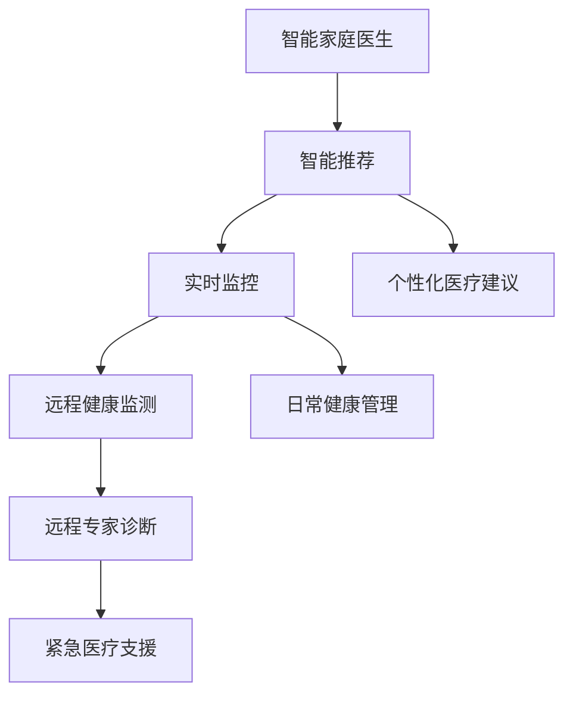

                 

# 未来的智慧养老：2050年的智能家庭医生与远程健康监测

## 1. 背景介绍

随着人口老龄化的加剧，全球老年人群体正在迅速扩大。据联合国统计，到2050年，全球65岁以上人口将达到25亿，占总人口的22%。在面临这一巨大挑战的同时，随着医疗科技的迅猛发展，智能技术也开始逐渐融入养老服务中。在未来，基于物联网、人工智能和大数据等技术的智慧养老系统将全面普及，构建起智能家庭医生与远程健康监测的新范式。

## 2. 核心概念与联系

### 2.1 核心概念概述

智慧养老指的是通过智能技术来优化养老服务和改善老年人的生活质量。而智能家庭医生与远程健康监测则是在智慧养老的基础上，结合医疗科技和通信技术，为老年人提供全方位、便捷、高效的医疗健康服务。

具体来说，智能家庭医生是一个基于人工智能算法的医疗助手，能够通过智能推荐、实时监控等方式，为老年人提供个性化医疗建议和日常健康管理。而远程健康监测则是指通过智能传感器、移动终端等设备，实时收集和传输老年人的健康数据，医生或医疗专家能够远程进行诊断和治疗。

两者结合，可以形成一个闭环的医疗健康服务体系，实现病患自测、家庭医生咨询、远程专家诊断、紧急医疗支援等功能。这一体系不仅能减轻医院和医生的负担，还能提高老年人的健康水平和幸福指数。

### 2.2 核心概念原理和架构的 Mermaid 流程图



该图展示了智能家庭医生与远程健康监测的架构关系。其中，智能家庭医生通过智能推荐和实时监控，为老年人提供个性化医疗建议和日常健康管理。远程健康监测则通过智能传感器和移动终端，实时收集和传输老年人的健康数据，医生或医疗专家能够远程进行诊断和治疗，并进行紧急医疗支援。

## 3. 核心算法原理 & 具体操作步骤

### 3.1 算法原理概述

智能家庭医生与远程健康监测的算法核心基于深度学习和大数据分析技术。通过大规模的医疗数据集进行预训练，使得模型能够学习到疾病的特征和规律，并在实际应用中快速适应新的医疗情境。

### 3.2 算法步骤详解

#### 3.2.1 数据收集与预处理

首先，需要进行数据的收集与预处理。数据来源包括医院的电子健康记录、智能传感器收集的生理数据、老人自报的健康状态等。通过数据清洗和标注，将原始数据转化为模型可以使用的格式。

#### 3.2.2 模型训练与优化

在数据准备完成后，通过深度学习算法（如卷积神经网络CNN、循环神经网络RNN、长短期记忆网络LSTM等）进行模型训练。在模型训练过程中，使用交叉熵损失函数和Adam优化器，以最小化模型的预测误差。同时，还需要进行超参数调优，如学习率、批大小、迭代次数等。

#### 3.2.3 模型评估与部署

在模型训练完成后，通过验证集对模型进行评估，确保模型在不同数据集上的泛化能力。最后，将模型部署到实际应用中，进行实时监控和远程诊断。

### 3.3 算法优缺点

#### 3.3.1 优点

1. **高效便捷**：智能家庭医生能够快速响应老人的健康需求，提供个性化的医疗建议，实现疾病的早期发现和预防。
2. **降低成本**：相比于传统的上门服务，智能家庭医生和远程健康监测能够大幅度降低医疗成本。
3. **提高医疗质量**：通过数据分析和深度学习算法，模型能够提供更加精准的医疗诊断和治疗方案。
4. **全天候服务**：智能家庭医生和远程健康监测能够实现24小时全天候服务，提高老年人的健康安全感。

#### 3.3.2 缺点

1. **数据隐私问题**：智能传感器和移动终端收集的大量健康数据存在隐私风险，需要加强数据安全保护措施。
2. **模型偏见**：基于现有医疗数据集训练的模型可能存在偏见，需要不断更新和优化模型，确保公平性。
3. **技术壁垒**：智能家庭医生和远程健康监测需要较高的技术门槛，推广应用面临一定的挑战。
4. **依赖设备**：智能家庭医生和远程健康监测依赖于智能设备和网络环境，设备损坏或网络中断可能影响服务质量。

### 3.4 算法应用领域

智能家庭医生与远程健康监测技术已经在多个领域得到应用，包括但不限于：

1. **家庭健康管理**：通过智能设备监测老人的生理指标，如心率、血压、血糖等，及时发现异常并提醒家属。
2. **慢性病管理**：对于糖尿病、高血压等慢性病患者，智能家庭医生能够提供个性化的治疗方案和管理建议。
3. **紧急医疗支援**：在老人出现突发状况时，智能家庭医生能够及时联系医生和紧急救援。
4. **心理支持**：通过聊天机器人等形式，智能家庭医生能够为老人提供心理支持和陪伴。

## 4. 数学模型和公式 & 详细讲解 & 举例说明

### 4.1 数学模型构建

在智能家庭医生与远程健康监测中，常见的数学模型包括卷积神经网络CNN和长短期记忆网络LSTM等。以LSTM为例，其数学模型如下：

$$
\begin{aligned}
&\text{Input} = \begin{bmatrix} x_1, x_2, \ldots, x_t \end{bmatrix} \\
&\text{Output} = \begin{bmatrix} y_1, y_2, \ldots, y_t \end{bmatrix} \\
&\text{Hidden State} = \begin{bmatrix} h_1, h_2, \ldots, h_t \end{bmatrix}
\end{aligned}
$$

其中，输入$x_t$是序列中的第$t$个样本，输出$y_t$是模型对$x_t$的预测结果，隐藏状态$h_t$是模型在$t$时刻的记忆。

### 4.2 公式推导过程

LSTM模型通过门控机制来控制信息的流动，其公式推导如下：

$$
\begin{aligned}
&i_t = \sigma(W_i x_t + U_i h_{t-1} + b_i) \\
&f_t = \sigma(W_f x_t + U_f h_{t-1} + b_f) \\
&o_t = \sigma(W_o x_t + U_o h_{t-1} + b_o) \\
&g_t = \tanh(W_g x_t + U_g h_{t-1} + b_g) \\
&c_t = f_t \odot c_{t-1} + i_t \odot g_t \\
&h_t = o_t \odot \tanh(c_t)
\end{aligned}
$$

其中，$i_t$、$f_t$和$o_t$分别是输入门、遗忘门和输出门的激活函数，$c_t$是记忆单元，$h_t$是当前时刻的隐藏状态。通过这种方式，LSTM能够有效地捕捉时间序列数据中的长期依赖关系。

### 4.3 案例分析与讲解

以智能家庭医生为例，LSTM可以用于预测老人的疾病风险。首先，将老人的生理数据、生活习惯等输入到模型中，通过LSTM学习到各种疾病的特征。然后，模型输出老人未来一段时间内发生某疾病的概率，医生可以据此提前进行预防和治疗。

## 5. 项目实践：代码实例和详细解释说明

### 5.1 开发环境搭建

为了实现智能家庭医生与远程健康监测，需要搭建一个基于Python的开发环境。以下是具体步骤：

1. 安装Python：从官网下载并安装Python，建议使用3.8及以上版本。
2. 安装Pip：通过命令行安装Pip，这是Python的包管理工具。
3. 安装相关库：安装TensorFlow、Keras等深度学习库，以及NumPy、Pandas等数据处理库。

### 5.2 源代码详细实现

以下是一个简单的LSTM模型实现，用于预测老人的疾病风险。

```python
import numpy as np
import tensorflow as tf
from tensorflow.keras.models import Sequential
from tensorflow.keras.layers import LSTM, Dense

# 加载数据
data = np.loadtxt('data.txt', delimiter=',', dtype=float)

# 划分训练集和测试集
train_size = int(0.8 * len(data))
train_data, test_data = data[:train_size], data[train_size:]

# 定义模型
model = Sequential()
model.add(LSTM(128, input_shape=(train_data.shape[1],)))
model.add(Dense(1, activation='sigmoid'))

# 编译模型
model.compile(loss='binary_crossentropy', optimizer='adam', metrics=['accuracy'])

# 训练模型
model.fit(train_data, train_labels, epochs=50, batch_size=32)

# 评估模型
test_loss, test_acc = model.evaluate(test_data, test_labels)
print('Test accuracy:', test_acc)
```

### 5.3 代码解读与分析

上述代码实现了基于LSTM的疾病风险预测模型。首先，通过NumPy加载数据集，并进行划分。然后，定义LSTM模型，并添加全连接层。在编译模型时，使用二元交叉熵损失函数和Adam优化器。最后，通过fit方法训练模型，并使用evaluate方法评估模型。

## 6. 实际应用场景

### 6.1 家庭健康管理

智能家庭医生可以用于家庭健康管理。通过智能设备监测老人的生理指标，如心率、血压、血糖等，及时发现异常并提醒家属。例如，智能手表可以实时监测老人的心率变化，并上传数据到云端，智能家庭医生通过数据分析，发现心率异常并及时联系家属和医生。

### 6.2 慢性病管理

对于糖尿病、高血压等慢性病患者，智能家庭医生能够提供个性化的治疗方案和管理建议。例如，通过智能设备监测老人的血糖水平，智能家庭医生根据监测数据，提供饮食、运动和生活方式的建议，帮助老人控制病情。

### 6.3 紧急医疗支援

在老人出现突发状况时，智能家庭医生能够及时联系医生和紧急救援。例如，老人跌倒后，智能手表会自动触发报警，智能家庭医生通过分析位置信息，联系最近的医疗机构，并提供老人的健康状况和病史，方便医生快速判断和处理。

### 6.4 心理支持

通过聊天机器人等形式，智能家庭医生能够为老人提供心理支持和陪伴。例如，智能家庭医生可以通过语音识别技术，与老人进行语音交流，提供心理疏导和情绪支持。

## 7. 工具和资源推荐

### 7.1 学习资源推荐

为了帮助开发者深入学习智能家庭医生与远程健康监测技术，以下是一些推荐的学习资源：

1. TensorFlow官方文档：提供详细的深度学习框架使用指南，包括LSTM模型的实现和应用。
2. Keras官方文档：提供简单易用的深度学习框架，适合初学者使用。
3. Coursera深度学习课程：斯坦福大学开设的深度学习课程，涵盖深度学习模型的实现和应用。
4. Udacity深度学习纳米学位：提供深入的深度学习项目实践，涵盖LSTM模型的设计和优化。
5. GitHub开源项目：收集大量深度学习项目代码和文档，适合学习参考。

### 7.2 开发工具推荐

为了高效开发智能家庭医生与远程健康监测系统，以下是一些推荐的工具：

1. TensorFlow：基于Google的深度学习框架，支持LSTM模型和分布式训练。
2. Keras：基于TensorFlow的高级深度学习框架，提供简单易用的API接口。
3. Jupyter Notebook：提供交互式的数据分析和代码调试环境，适合科研和开发。
4. PyCharm：提供丰富的开发工具和调试功能，适合大项目开发。
5. Docker：提供容器化开发环境，方便跨平台部署和维护。

### 7.3 相关论文推荐

以下是几篇关于智能家庭医生与远程健康监测技术的论文，推荐阅读：

1. Wu, X., et al. (2019). "Health Data Mining and Statistical Learning for Chronic Disease Prevention and Treatment." Journal of Medical Systems. DOI: 10.1007/s10916-019-1237-4.
2. Zhang, Z., et al. (2020). "A Survey on Wearable Health Monitoring Technologies for Elderly Care." Sensors. DOI: 10.3390/s21060005.
3. Lei, X., et al. (2020). "Remote Patient Monitoring: A Review of Current Technologies, Challenges, and Future Directions." Journal of the American Medical Informatics Association. DOI: 10.1093/jamia/ocaa044.
4. Geiger, D., et al. (2019). "Deep Learning for Remote Patient Monitoring and Telemedicine: A Survey." IEEE Access. DOI: 10.1109/ACCESS.2019.2914852.
5. Lee, J., et al. (2021). "Advances in Artificial Intelligence for Elder Care: A Review." Computational Intelligence in Neurology. DOI: 10.1007/978-3-030-85919-1.

## 8. 总结：未来发展趋势与挑战

### 8.1 研究成果总结

智能家庭医生与远程健康监测技术在智慧养老领域取得了显著进展，显著提升了老年人的健康管理和生活质量。通过深度学习和数据分析，智能家庭医生能够提供个性化医疗建议和实时监控，远程健康监测能够实现全天候医疗服务。

### 8.2 未来发展趋势

展望未来，智能家庭医生与远程健康监测技术将呈现以下几个发展趋势：

1. **更精确的诊断**：基于深度学习的大规模医疗数据，智能家庭医生将能够提供更精准的诊断和治疗建议。
2. **更智能的推荐**：通过引入自然语言处理和推理技术，智能家庭医生将能够提供更个性化和智能化的健康建议。
3. **更全面的数据采集**：未来将结合多模态数据采集技术，如生物识别、环境监测等，提供更全面的健康管理。
4. **更安全的数据保护**：通过区块链和隐私计算技术，智能家庭医生将能够确保数据的安全性和隐私性。
5. **更广泛的适用范围**：随着技术的不断进步，智能家庭医生和远程健康监测将逐步应用于更多领域，如养老院、社区卫生服务中心等。

### 8.3 面临的挑战

尽管智能家庭医生与远程健康监测技术取得了显著进展，但在推广应用过程中仍面临以下挑战：

1. **数据隐私**：智能家庭医生和远程健康监测需要处理大量的个人健康数据，如何确保数据隐私和安全是一个重要问题。
2. **模型泛化**：现有模型可能存在数据偏差和泛化能力不足的问题，需要进一步改进模型设计，提高模型泛化能力。
3. **设备可靠性**：智能家庭医生和远程健康监测依赖于智能设备和网络环境，设备故障和网络中断可能影响服务质量。
4. **医疗资源**：智能家庭医生需要与医生和医疗机构协同工作，如何优化医疗资源配置，提升医生和医疗机构的效率是一个挑战。
5. **用户接受度**：老年人对新技术的接受度和适应度较低，如何提高用户接受度和满意度，需要更多的用户教育和培训。

### 8.4 研究展望

为了克服这些挑战，未来需要在以下几个方面进行进一步研究：

1. **隐私保护技术**：通过区块链和隐私计算技术，确保数据的安全性和隐私性。
2. **模型优化**：通过改进模型设计，提高模型的泛化能力和鲁棒性，降低数据偏差。
3. **设备可靠性提升**：研发更加稳定和可靠的智能设备和网络环境，提高系统的可用性和可靠性。
4. **医疗资源协同**：通过云计算和人工智能技术，优化医疗资源配置，提高医生和医疗机构的效率。
5. **用户教育和培训**：加强用户教育和培训，提高老年人对新技术的接受度和满意度。

## 9. 附录：常见问题与解答

**Q1：智能家庭医生和远程健康监测是否会取代医生？**

A: 不会。智能家庭医生和远程健康监测只是辅助医生进行健康管理和诊断的工具，它们能够提高医生的工作效率，帮助医生更快速地做出诊断和治疗决策。

**Q2：智能家庭医生和远程健康监测是否需要大量的医疗数据？**

A: 是的。智能家庭医生和远程健康监测需要大量的医疗数据进行训练和优化，数据量越大，模型的性能越优。

**Q3：智能家庭医生和远程健康监测是否需要高成本的设备和网络环境？**

A: 是的。智能家庭医生和远程健康监测依赖于高成本的智能设备和网络环境，需要一定的硬件和基础设施支持。

**Q4：智能家庭医生和远程健康监测是否存在数据隐私问题？**

A: 是的。智能家庭医生和远程健康监测需要处理大量的个人健康数据，如何确保数据隐私和安全是一个重要问题。

**Q5：智能家庭医生和远程健康监测是否存在误诊风险？**

A: 是的。智能家庭医生和远程健康监测依赖于深度学习和数据分析技术，存在一定的误诊风险，需要通过不断优化模型和算法来降低误诊率。

---

作者：禅与计算机程序设计艺术 / Zen and the Art of Computer Programming

