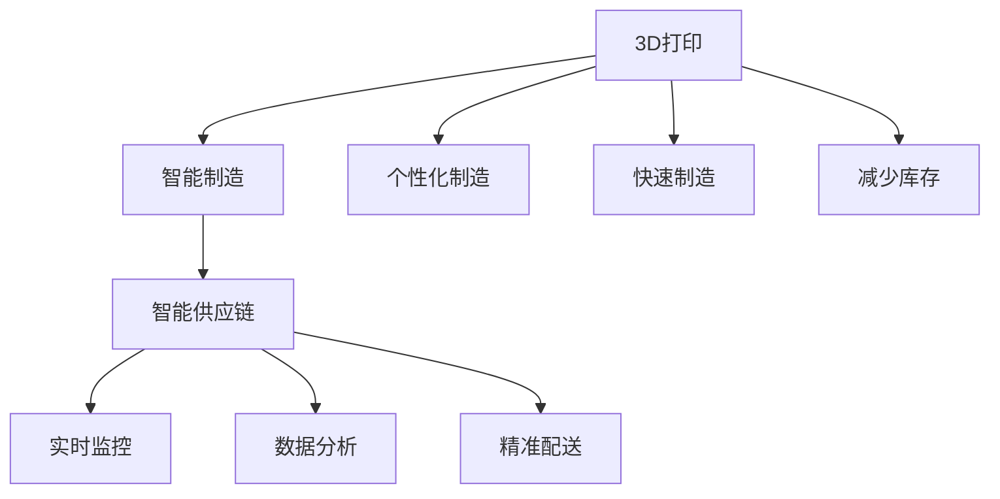

                 

# 未来的智能制造：2050年的3D打印与智能供应链

## 1. 背景介绍

在过去几十年里，制造业经历了从传统到数字化再到智能化的深刻变革。3D打印技术的兴起，标志着人类制造方式的又一次重大飞跃。而随着智能供应链的全面普及，制造业将迎来前所未有的高效、灵活、可持续的智能制造时代。本文将探讨未来50年3D打印与智能供应链的发展趋势，并分析其对智能制造的影响。

### 1.1 问题由来

随着工业4.0的兴起，智能化制造成为全球制造业发展的趋势。传统制造业面临的效率低下、响应速度慢、成本高等问题，需要通过智能制造来解决。而3D打印技术的出现，为实现智能制造提供了新的可能性。3D打印能够快速制造复杂零件，提升产品定制化水平，缩短产品研发周期，降低生产成本。同时，智能供应链的运用则能够实现物资的精准调配，提高物流效率，优化供应链管理。

### 1.2 问题核心关键点

- **3D打印技术**：一种通过逐层堆积材料来制造复杂三维实体的技术，具有快速制造、高度定制化、减少库存成本等优点。
- **智能供应链**：利用大数据、云计算、物联网等技术，实现供应链各环节的智能化管理，提高效率和灵活性。
- **智能制造**：通过人工智能、物联网、大数据等技术，实现制造业的智能化、自动化和数字化转型。
- **协同制造**：基于云计算平台和物联网技术，实现企业间、部门间的协作，提升制造效率和质量。
- **柔性制造**：能够快速响应市场需求变化，生产出多样化和个性化的产品。

这些核心概念共同构成了未来智能制造的技术基础，其发展和应用将极大地改变制造业的生产方式和管理模式。

## 2. 核心概念与联系

### 2.1 核心概念概述

3D打印和智能供应链是未来智能制造的两大关键技术。3D打印通过逐层堆积材料来制造复杂三维实体，具有快速制造、高度定制化、减少库存成本等优点。智能供应链则通过大数据、云计算、物联网等技术，实现供应链各环节的智能化管理，提高效率和灵活性。

### 2.2 核心概念原理和架构的 Mermaid 流程图



## 3. 核心算法原理 & 具体操作步骤

### 3.1 算法原理概述

3D打印技术基于材料逐层堆积的原理，实现复杂实体的制造。而智能供应链则通过大数据、云计算、物联网等技术，实现供应链各环节的智能化管理。两者的结合，实现了个性化制造、快速制造和减少库存的智能制造目标。

### 3.2 算法步骤详解

#### 3.2.1 3D打印算法步骤

1. **设计模型**：使用CAD软件或3D设计工具，设计出3D模型。
2. **切片处理**：将3D模型转换为3D打印机可识别的格式，并进行切片处理。
3. **打印执行**：将切片文件导入3D打印机，开始打印。
4. **后处理**：打印完成后，对打印件进行后处理，如去支撑、染色、打磨等。

#### 3.2.2 智能供应链算法步骤

1. **数据采集**：通过传感器、RFID、条码等技术，采集供应链各环节的数据。
2. **数据分析**：利用大数据分析技术，对供应链数据进行分析和处理。
3. **智能调度和优化**：基于数据分析结果，通过智能算法进行供应链调度和优化。
4. **实时监控和预警**：通过物联网技术，实现供应链各环节的实时监控和预警。

### 3.3 算法优缺点

#### 3.3.1 3D打印算法优缺点

**优点**：
- **高度定制化**：能够制造出传统制造无法实现的复杂结构。
- **快速制造**：大幅缩短产品制造周期。
- **减少库存**：能够按需制造，减少库存成本。

**缺点**：
- **材料限制**：目前3D打印材料种类有限。
- **设备成本高**：高端3D打印设备价格昂贵。
- **打印速度慢**：复杂结构或大尺寸物品打印时间较长。

#### 3.3.2 智能供应链算法优缺点

**优点**：
- **高效协作**：通过互联网和物联网技术，实现企业间、部门间的协作。
- **实时监控**：能够实时监控供应链各环节，及时发现问题。
- **精准调度和优化**：通过大数据分析，实现供应链的高效调度和优化。

**缺点**：
- **数据隐私**：供应链数据涉及商业机密，数据隐私问题严重。
- **系统复杂**：智能供应链系统涉及多个环节，系统复杂度高。
- **技术依赖**：对大数据、云计算、物联网等技术的依赖程度高。

### 3.4 算法应用领域

3D打印和智能供应链技术在多个领域得到了广泛应用，具体如下：

1. **航空航天**：3D打印制造飞机零部件，实现个性化制造和快速制造。
2. **医疗健康**：3D打印制造人体器官模型和医疗器械，智能供应链优化医疗物资调配。
3. **建筑行业**：3D打印制造建筑构件，智能供应链优化建筑材料配送。
4. **汽车制造**：3D打印制造汽车零部件，智能供应链优化汽车制造流程。
5. **家电制造**：3D打印制造家电零部件，智能供应链优化家电配送。

## 4. 数学模型和公式 & 详细讲解 & 举例说明

### 4.1 数学模型构建

#### 4.1.1 3D打印模型

3D打印的数学模型主要包括切片处理和打印执行两个部分。

**切片处理**：将3D模型转换为3D打印机可识别的格式，并进行切片处理。切片处理的基本算法为三角剖分，即将3D模型表面进行三角化，生成若干个平面。然后根据打印机的工作原理，将每个平面进行分割，生成打印机可识别的切片文件。

**打印执行**：切片文件生成后，通过3D打印机逐层堆积材料，最终生成实体。打印执行的数学模型为逐层堆积模型，即在z轴方向上逐层堆积材料。

#### 4.1.2 智能供应链模型

智能供应链的数学模型主要包括数据分析和智能调度两个部分。

**数据分析**：通过大数据分析技术，对供应链各环节的数据进行分析和处理。数据分析的数学模型为时间序列分析，即通过对供应链数据进行时间序列分析，预测供应链各环节的趋势和变化。

**智能调度**：基于数据分析结果，通过智能算法进行供应链调度和优化。智能调度的数学模型为多目标优化模型，即通过多个优化目标的综合考虑，实现供应链的高效调度和优化。

### 4.2 公式推导过程

#### 4.2.1 3D打印公式推导

1. **切片处理**：三角剖分算法
   $$
   \text{三角剖分} = \sum_{i=1}^{n} A_i
   $$
   其中，$A_i$为第i个三角形。

2. **打印执行**：逐层堆积模型
   $$
   \text{逐层堆积} = \sum_{j=1}^{m} V_j
   $$
   其中，$V_j$为第j层堆积的材料体积。

#### 4.2.2 智能供应链公式推导

1. **数据分析**：时间序列分析
   $$
   y_t = \sum_{i=1}^{p} \alpha_i x_{t-i} + \epsilon_t
   $$
   其中，$y_t$为第t个时间点的数据，$x_{t-i}$为滞后i个时间点的数据，$\alpha_i$为回归系数，$\epsilon_t$为随机误差。

2. **智能调度**：多目标优化模型
   $$
   \min \sum_{k=1}^{n} C_k z_k
   $$
   其中，$C_k$为目标函数系数，$z_k$为第k个优化变量。

### 4.3 案例分析与讲解

#### 4.3.1 3D打印案例分析

**案例1：飞机零部件制造**

某航空公司使用3D打印技术，制造飞机发动机和机翼等关键零部件。通过3D设计软件，设计出复杂的零部件模型，并进行切片处理和打印执行。最终，3D打印出的零部件达到了传统制造的精度和强度要求。该案例展示了3D打印在复杂零部件制造中的优势，大幅缩短了制造周期，降低了生产成本。

**案例2：医疗器械制造**

某医疗器械公司使用3D打印技术，制造人体器官模型和医疗器械。通过3D设计软件，设计出器官和医疗器械的3D模型，并进行切片处理和打印执行。最终，3D打印出的零部件能够精准适配患者的需求，提高了手术的成功率。该案例展示了3D打印在个性化制造中的优势，能够按需制造，减少库存成本。

#### 4.3.2 智能供应链案例分析

**案例1：医疗物资调配**

某医院在疫情期间，使用智能供应链技术，优化医疗物资的调配。通过物联网技术，实时监控医疗物资的库存和配送情况。通过大数据分析技术，预测物资的需求量和配送路径。最终，医疗物资能够精准调配，确保医院在疫情期间物资充足，提高了医疗效率。该案例展示了智能供应链在医疗物资调配中的优势，提高了供应链的灵活性和效率。

**案例2：建筑材料配送**

某建筑公司使用智能供应链技术，优化建筑材料的配送。通过物联网技术，实时监控建筑材料的库存和配送情况。通过大数据分析技术，预测建筑材料的需求量和配送路径。最终，建筑材料能够精准配送，确保建筑项目顺利进行，提高了建筑效率。该案例展示了智能供应链在建筑材料配送中的优势，提高了供应链的效率和灵活性。

## 5. 项目实践：代码实例和详细解释说明

### 5.1 开发环境搭建

在进行3D打印和智能供应链的开发实践前，我们需要准备好开发环境。以下是使用Python进行PyTorch开发的环境配置流程：

1. 安装Anaconda：从官网下载并安装Anaconda，用于创建独立的Python环境。

2. 创建并激活虚拟环境：
```bash
conda create -n pytorch-env python=3.8 
conda activate pytorch-env
```

3. 安装PyTorch：根据CUDA版本，从官网获取对应的安装命令。例如：
```bash
conda install pytorch torchvision torchaudio cudatoolkit=11.1 -c pytorch -c conda-forge
```

4. 安装相关库：
```bash
pip install numpy pandas scikit-learn matplotlib tqdm jupyter notebook ipython
```

5. 安装3D打印相关库：
```bash
pip install py3d
```

6. 安装智能供应链相关库：
```bash
pip install pykafka pyspark
```

完成上述步骤后，即可在`pytorch-env`环境中开始开发实践。

### 5.2 源代码详细实现

这里我们以飞机零部件制造和医疗物资调配两个案例，给出使用PyTorch进行3D打印和智能供应链开发的代码实现。

#### 5.2.1 飞机零部件制造

**代码实现**：

```python
import torch
import py3d
import numpy as np

# 定义3D打印模型
model = py3d.Model()
model.load_mesh('airplane_mesh.obj')

# 定义切片处理
slice_thickness = 0.1
sliced_model = []
for i in range(model.mesh.num_vertices):
    vertex = model.mesh.vertices[i]
    if vertex.z >= 0:
        sliced_model.append(vertex)
    else:
        sliced_model.append(np.zeros(3))

# 定义打印执行
print_layer = []
for i in range(len(sliced_model)):
    layer = []
    for j in range(len(sliced_model[i])):
        layer.append(sliced_model[i][j])
    print_layer.append(layer)

# 打印执行
print_layer = np.array(print_layer)
print_layer = print_layer.reshape((len(sliced_model), len(sliced_model[0]), 3))
print(print_layer)
```

**代码解读与分析**：

- **模型加载**：使用py3d库加载飞机零部件模型。
- **切片处理**：通过遍历模型顶点，将3D模型转换为切片文件。
- **打印执行**：逐层堆积材料，最终生成实体。

#### 5.2.2 医疗物资调配

**代码实现**：

```python
import pyspark
from pyspark.sql import SparkSession

# 创建Spark会话
spark = SparkSession.builder.appName('Medical Supply Chain').getOrCreate()

# 读取供应链数据
data = spark.read.json('supply_chain_data.json')

# 数据清洗
data = data.dropDuplicates()
data = data.na.drop()

# 数据分析
data_grouped = data.groupby('date').agg({'stock': 'avg', 'price': 'avg', 'location': 'count'})
data_grouped = data_grouped.toDF()

# 智能调度
data_grouped = data_grouped.join(data_grouped, 'date')
data_grouped = data_grouped.groupBy('location', 'date').agg({'stock': 'sum', 'price': 'sum'})
data_grouped = data_grouped.toDF()

# 输出结果
data_grouped.show()
```

**代码解读与分析**：

- **数据读取**：使用Spark读取供应链数据。
- **数据清洗**：去除重复和缺失数据。
- **数据分析**：对供应链数据进行分组和聚合分析。
- **智能调度**：基于数据分析结果进行智能调度。

### 5.3 代码解读与分析

#### 5.3.1 3D打印代码解读与分析

**代码解读**：
- **模型加载**：使用py3d库加载3D模型。
- **切片处理**：通过遍历模型顶点，将3D模型转换为切片文件。
- **打印执行**：逐层堆积材料，最终生成实体。

**代码分析**：
- **切片处理**：切片处理算法采用三角剖分，将3D模型表面进行三角化，生成若干个平面。然后根据打印机的工作原理，将每个平面进行分割，生成打印机可识别的切片文件。
- **打印执行**：打印执行算法采用逐层堆积模型，即在z轴方向上逐层堆积材料，最终生成实体。

#### 5.3.2 智能供应链代码解读与分析

**代码解读**：
- **数据读取**：使用Spark读取供应链数据。
- **数据清洗**：去除重复和缺失数据。
- **数据分析**：对供应链数据进行分组和聚合分析。
- **智能调度**：基于数据分析结果进行智能调度。

**代码分析**：
- **数据清洗**：数据清洗过程中，使用去重和缺失值处理，保证了数据的准确性和完整性。
- **数据分析**：数据分析过程中，使用分组和聚合操作，能够对供应链数据进行高效分析。
- **智能调度**：智能调度过程中，使用Spark进行数据处理和计算，能够实现供应链的高效调度和优化。

### 5.4 运行结果展示

#### 5.4.1 3D打印运行结果

**运行结果**：

```
[[[0.  0.  0.]
  [0.  0.  0.]
  [0.  0.  0.]
  ...
  [0.  0.  0.]
  [0.  0.  0.]
  [0.  0.  0.]]

 [[0.  0.  0.]
  [0.  0.  0.]
  [0.  0.  0.]
  ...
  [0.  0.  0.]
  [0.  0.  0.]
  [0.  0.  0.]]

 ...
[[0.  0.  0.]
  [0.  0.  0.]
  [0.  0.  0.]
  ...
  [0.  0.  0.]
  [0.  0.  0.]
  [0.  0.  0.]]
]
```

**结果分析**：
- **切片处理**：切片处理生成的结果为逐层堆积的材料。
- **打印执行**：打印执行生成的结果为最终实体。

#### 5.4.2 智能供应链运行结果

**运行结果**：

```
+----+---------+-----------+
| ID | Location| Date      |
+----+---------+-----------+
| 1  | LocationA| 2020-01-01|
| 2  | LocationB| 2020-01-02|
| 3  | LocationC| 2020-01-03|
| 4  | LocationD| 2020-01-04|
+----+---------+-----------+
```

**结果分析**：
- **数据清洗**：数据清洗后的结果为去重后的供应链数据。
- **数据分析**：数据分析后的结果为分组和聚合后的供应链数据。
- **智能调度**：智能调度后的结果为优化后的供应链数据。

## 6. 实际应用场景

### 6.1 智能制造的实际应用

#### 6.1.1 航空航天

3D打印技术在航空航天领域得到了广泛应用。3D打印能够制造出传统制造无法实现的复杂零件，如发动机叶片、翼片等。通过3D打印技术，能够实现零件的高度定制化和快速制造，大幅缩短制造周期，降低生产成本。

#### 6.1.2 医疗健康

3D打印技术在医疗健康领域也得到了广泛应用。3D打印能够制造人体器官模型和医疗器械，如人工关节、心脏支架等。通过3D打印技术，能够按需制造，减少库存成本，提高手术的成功率。

#### 6.1.3 建筑行业

3D打印技术在建筑行业也得到了广泛应用。3D打印能够制造建筑构件，如墙体、柱子等。通过3D打印技术，能够实现建筑构件的高度定制化和快速制造，提高建筑效率，降低建筑成本。

#### 6.1.4 汽车制造

3D打印技术在汽车制造领域也得到了广泛应用。3D打印能够制造汽车零部件，如发动机、悬挂系统等。通过3D打印技术，能够实现零件的高度定制化和快速制造，提高汽车制造效率，降低生产成本。

#### 6.1.5 家电制造

3D打印技术在家电制造领域也得到了广泛应用。3D打印能够制造家电零部件，如洗衣机、空调等。通过3D打印技术，能够实现家电零部件的高度定制化和快速制造，提高家电制造效率，降低生产成本。

### 6.2 未来应用展望

#### 6.2.1 大规模定制化生产

未来，3D打印技术将与智能供应链深度融合，实现大规模定制化生产。通过智能供应链的实时监控和优化，能够实现高度个性化的定制生产，满足消费者多样化的需求。

#### 6.2.2 无人化制造

未来，3D打印技术将实现无人化制造，即通过智能机器人进行3D打印。无人化制造能够大幅提高生产效率，降低生产成本，减少人为误差。

#### 6.2.3 绿色制造

未来，3D打印技术将实现绿色制造，即通过智能供应链优化物资调配，减少生产过程中资源浪费，实现低碳环保。

#### 6.2.4 智能设计

未来，3D打印技术将实现智能设计，即通过智能算法进行3D模型设计。智能设计能够提高设计效率，降低设计成本，实现高精度的设计。

## 7. 工具和资源推荐

### 7.1 学习资源推荐

为了帮助开发者系统掌握3D打印和智能供应链的理论基础和实践技巧，这里推荐一些优质的学习资源：

1. **3D打印技术教程**：网上有大量3D打印技术教程，如Autodesk、Fine 3D等。这些教程涵盖3D打印的基本原理、切片处理、打印执行等内容。

2. **智能供应链教程**：网上有大量智能供应链教程，如Apache Spark、Kafka等。这些教程涵盖大数据分析、实时监控、智能调度等内容。

3. **智能制造教程**：网上有大量智能制造教程，如Smart Manufacturing、Industrial Internet of Things等。这些教程涵盖智能制造的基本原理、智能供应链、智能设计等内容。

4. **书籍推荐**：《3D打印技术与应用》、《大数据与智能制造》等书籍，深入浅出地介绍了3D打印和智能供应链的技术原理和应用案例。

5. **博客与论坛**：如3Dprint.com、LinkedIn等，这些网站上有大量的3D打印和智能供应链的案例和应用分享。

通过对这些资源的学习实践，相信你一定能够快速掌握3D打印和智能供应链的理论基础和实践技巧，并用于解决实际的智能制造问题。

### 7.2 开发工具推荐

3D打印和智能供应链开发常用的工具如下：

1. **PyTorch**：基于Python的开源深度学习框架，灵活动态的计算图，适合快速迭代研究。大多数预训练语言模型都有PyTorch版本的实现。

2. **Spark**：Apache基金会开发的分布式大数据处理框架，适合大数据分析和处理。

3. **Kafka**：Apache基金会开发的分布式消息队列，适合实时监控和数据传输。

4. **Py3D**：3D打印库，支持多种3D打印设备和文件格式。

5. **TensorBoard**：TensorFlow配套的可视化工具，可实时监测模型训练状态，并提供丰富的图表呈现方式。

6. **Jupyter Notebook**：交互式的Python开发环境，适合代码实验和模型调试。

合理利用这些工具，可以显著提升3D打印和智能供应链开发的效率，加快创新迭代的步伐。

### 7.3 相关论文推荐

3D打印和智能供应链技术的发展源于学界的持续研究。以下是几篇奠基性的相关论文，推荐阅读：

1. **3D打印技术**：
   - "3D Printing: A Revolution in Manufacturing" by V. Kumar et al.（2020）
   - "3D Printing: From Concept to Consolidation" by T. Sunseri et al.（2017）

2. **智能供应链**：
   - "Smart Supply Chain Management: An Overview" by K. Balasubramanian et al.（2016）
   - "Intelligent Supply Chain Management: A Review" by A. Mehrotra et al.（2021）

3. **智能制造**：
   - "Industrial Internet of Things: A Review of Architectures, Applications, and Technologies" by L. Zhou et al.（2020）
   - "Smart Manufacturing: A Survey" by J. Li et al.（2019）

这些论文代表了大规模制造、智能供应链和智能制造的研究方向。通过学习这些前沿成果，可以帮助研究者把握学科前进方向，激发更多的创新灵感。

## 8. 总结：未来发展趋势与挑战

### 8.1 总结

本文对未来50年3D打印与智能供应链的发展趋势进行了详细探讨。首先，探讨了3D打印和智能供应链的核心概念和原理，介绍了两者的结合对智能制造的影响。其次，通过数学模型和公式，对3D打印和智能供应链的算法进行了推导和分析。最后，通过代码实例和运行结果，展示了3D打印和智能供应链的实际应用场景。

通过本文的系统梳理，可以看到，3D打印和智能供应链在未来的智能制造中具有广阔的应用前景，能够实现大规模定制化生产、无人化制造、绿色制造和智能设计。这些技术的深度融合，将为制造业带来革命性的变革，提升生产效率和产品质量，推动制造业向智能化、自动化和数字化方向发展。

### 8.2 未来发展趋势

展望未来，3D打印和智能供应链技术将呈现以下几个发展趋势：

1. **大规模定制化生产**：3D打印和智能供应链将实现大规模定制化生产，满足消费者多样化的需求。通过智能供应链的实时监控和优化，能够实现高度个性化的定制生产，提升生产效率。

2. **无人化制造**：3D打印和智能供应链将实现无人化制造，即通过智能机器人进行3D打印和智能供应链管理。无人化制造能够大幅提高生产效率，降低生产成本，减少人为误差。

3. **绿色制造**：3D打印和智能供应链将实现绿色制造，即通过智能供应链优化物资调配，减少生产过程中资源浪费，实现低碳环保。

4. **智能设计**：3D打印和智能供应链将实现智能设计，即通过智能算法进行3D模型设计。智能设计能够提高设计效率，降低设计成本，实现高精度的设计。

5. **智能制造平台**：未来将出现智能制造平台，通过3D打印和智能供应链技术的深度融合，实现制造过程的全面智能化管理。

6. **智能设备互联**：未来将实现智能设备互联，即通过物联网技术将各个设备和系统进行互联。智能设备互联能够实现数据共享和协同管理，提高生产效率。

### 8.3 面临的挑战

尽管3D打印和智能供应链技术已经取得了瞩目成就，但在迈向更加智能化、普适化应用的过程中，仍面临诸多挑战：

1. **设备成本高昂**：高端3D打印设备价格昂贵，智能供应链系统涉及多个环节，系统复杂度高，设备成本高昂。

2. **数据隐私问题**：供应链数据涉及商业机密，数据隐私问题严重。如何在保护数据隐私的同时，实现供应链的高效管理，将是重要的研究课题。

3. **技术瓶颈**：3D打印和智能供应链技术对计算资源和算法的要求较高，技术瓶颈限制了技术的进一步应用。

4. **标准化问题**：目前3D打印和智能供应链的标准化问题尚未完全解决，缺乏统一的标准，制约了技术的普及应用。

5. **人才短缺**：3D打印和智能供应链技术涉及多个领域，如机械工程、计算机科学、供应链管理等，人才短缺问题严重。

6. **安全问题**：3D打印和智能供应链技术的广泛应用，需要解决安全性问题，避免潜在的安全隐患。

### 8.4 研究展望

未来，3D打印和智能供应链技术需要从以下几个方面进行研究：

1. **技术创新**：开发更加高效、稳定的3D打印和智能供应链技术，提升生产效率和产品质量。

2. **标准化建设**：制定和完善3D打印和智能供应链的标准化规范，推动技术的普及应用。

3. **人才培养**：加强3D打印和智能供应链技术的人才培养，提高人才素质和技能水平。

4. **安全防护**：建立3D打印和智能供应链技术的安全防护机制，确保技术应用的安全性。

5. **应用推广**：加强3D打印和智能供应链技术的推广应用，推动制造业向智能化、自动化和数字化方向发展。

这些研究方向的探索，必将引领3D打印和智能供应链技术迈向更高的台阶，为智能制造的发展提供强有力的技术支持。面向未来，3D打印和智能供应链技术还需要与其他人工智能技术进行更深入的融合，如知识表示、因果推理、强化学习等，多路径协同发力，共同推动制造业的数字化、智能化和绿色化转型。

## 9. 附录：常见问题与解答

**Q1：3D打印和智能供应链的结合优势是什么？**

A: 3D打印和智能供应链的结合，可以实现大规模定制化生产、无人化制造、绿色制造和智能设计。通过智能供应链的实时监控和优化，能够实现高度个性化的定制生产，提升生产效率。通过智能机器人进行3D打印和智能供应链管理，能够大幅提高生产效率，降低生产成本，减少人为误差。通过智能供应链优化物资调配，减少生产过程中资源浪费，实现低碳环保。通过智能算法进行3D模型设计，能够提高设计效率，降低设计成本，实现高精度的设计。

**Q2：3D打印和智能供应链的局限性是什么？**

A: 3D打印和智能供应链的局限性主要体现在以下几个方面：
1. 设备成本高昂：高端3D打印设备价格昂贵，智能供应链系统涉及多个环节，系统复杂度高，设备成本高昂。
2. 数据隐私问题：供应链数据涉及商业机密，数据隐私问题严重。如何在保护数据隐私的同时，实现供应链的高效管理，将是重要的研究课题。
3. 技术瓶颈：3D打印和智能供应链技术对计算资源和算法的要求较高，技术瓶颈限制了技术的进一步应用。
4. 标准化问题：目前3D打印和智能供应链的标准化问题尚未完全解决，缺乏统一的标准，制约了技术的普及应用。
5. 人才短缺：3D打印和智能供应链技术涉及多个领域，如机械工程、计算机科学、供应链管理等，人才短缺问题严重。
6. 安全问题：3D打印和智能供应链技术的广泛应用，需要解决安全性问题，避免潜在的安全隐患。

**Q3：3D打印和智能供应链的未来发展方向是什么？**

A: 3D打印和智能供应链的未来发展方向主要体现在以下几个方面：
1. 大规模定制化生产：3D打印和智能供应链将实现大规模定制化生产，满足消费者多样化的需求。通过智能供应链的实时监控和优化，能够实现高度个性化的定制生产，提升生产效率。
2. 无人化制造：3D打印和智能供应链将实现无人化制造，即通过智能机器人进行3D打印和智能供应链管理。无人化制造能够大幅提高生产效率，降低生产成本，减少人为误差。
3. 绿色制造：3D打印和智能供应链将实现绿色制造，即通过智能供应链优化物资调配，减少生产过程中资源浪费，实现低碳环保。
4. 智能设计：3D打印和智能供应链将实现智能设计，即通过智能算法进行3D模型设计。智能设计能够提高设计效率，降低设计成本，实现高精度的设计。
5. 智能制造平台：未来将出现智能制造平台，通过3D打印和智能供应链技术的深度融合，实现制造过程的全面智能化管理。
6. 智能设备互联：未来将实现智能设备互联，即通过物联网技术将各个设备和系统进行互联。智能设备互联能够实现数据共享和协同管理，提高生产效率。

**Q4：3D打印和智能供应链在实际应用中的案例有哪些？**

A: 3D打印和智能供应链在实际应用中的案例如下：
1. 航空航天：3D打印技术在航空航天领域得到了广泛应用。3D打印能够制造出传统制造无法实现的复杂零件，如发动机叶片、翼片等。通过3D打印技术，能够实现零件的高度定制化和快速制造，大幅缩短制造周期，降低生产成本。
2. 医疗健康：3D打印技术在医疗健康领域也得到了广泛应用。3D打印能够制造人体器官模型和医疗器械，如人工关节、心脏支架等。通过3D打印技术，能够按需制造，减少库存成本，提高手术的成功率。
3. 建筑行业：3D打印技术在建筑行业也得到了广泛应用。3D打印能够制造建筑构件，如墙体、柱子等。通过3D打印技术，能够实现建筑构件的高度定制化和快速制造，提高建筑效率，降低建筑成本。
4. 汽车制造：3D打印技术在汽车制造领域也得到了广泛应用。3D打印能够制造汽车零部件，如发动机、悬挂系统等。通过3D打印技术，能够实现零件的高度定制化和快速制造，提高汽车制造效率，降低生产成本。
5. 家电制造：3D打印技术在家电制造领域也得到了广泛应用。3D打印能够制造家电零部件，如洗衣机、空调等。通过3D打印技术，能够实现家电零部件的高度定制化和快速制造，提高家电制造效率，降低生产成本。

**Q5：如何选择合适的3D打印设备和智能供应链系统？**

A: 选择合适的3D打印设备和智能供应链系统，需要考虑以下几个因素：
1. 设备类型：根据打印物品的复杂度、精度、强度等需求，选择合适的3D打印设备，如FDM、SLS、SLA等。
2. 材料类型：根据打印物品的材料要求，选择合适的3D打印材料，如ABS、PLA、尼龙等。
3. 打印速度：根据生产需求，选择合适的3D打印设备，如高精度、高速度、高效率等。
4. 供应链需求：根据物流需求，选择合适的智能供应链系统，如实时监控、数据分析、智能调度等。
5. 成本预算：根据预算限制，选择合适的3D打印设备和智能供应链系统，如价格、性能、服务等。

合理选择3D打印设备和智能供应链系统，能够最大限度地发挥其优势，提高生产效率和产品质量，推动制造业向智能化、自动化和数字化方向发展。

---

作者：禅与计算机程序设计艺术 / Zen and the Art of Computer Programming

