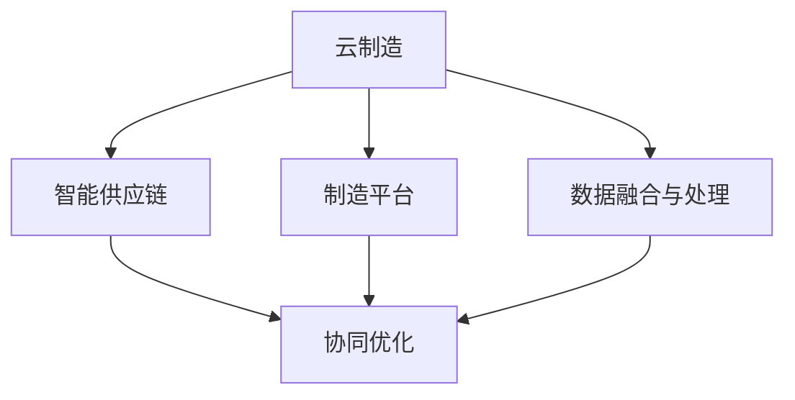

                 

# 未来的智能制造：2050年的云制造与智能供应链协同

## 1. 背景介绍

### 1.1 问题由来
随着全球制造业的数字化转型加速，智能制造已成为推动未来经济增长的重要引擎。传统的制造模式正逐渐向更加灵活、高效、可持续的方向演进。特别是随着物联网(IoT)、云计算、大数据、人工智能(AI)等新一代信息技术的深度融合，智能制造正在重塑制造业的生产方式和价值链。然而，当前的智能制造系统面临诸多挑战：生产过程的可控性差、供应链协调性不足、设备互联互通的兼容性问题等。未来，如何构建高效、智能、可扩展的智能制造体系，是全球制造业面临的重大课题。

### 1.2 问题核心关键点
智能制造的核心在于通过信息技术与制造系统的深度融合，实现生产过程的数字化、网络化、智能化，以提高生产效率、产品质量和响应速度。为此，需要构建一个集成的、协作的智能制造系统，涵盖设计、生产、物流、服务等各个环节，提升整个供应链的协同能力。

### 1.3 问题研究意义
研究云制造与智能供应链协同技术，对于提升制造业的智能化水平、实现绿色制造、促进全球制造业转型升级，具有重要意义：

1. **提高生产效率**：通过信息技术的深度融合，实现生产过程的精细控制和智能化调度，提高生产效率和产品质量。
2. **降低运营成本**：智能制造系统可以优化资源配置，减少能源消耗和废料排放，降低运营成本。
3. **提升市场响应速度**：通过快速响应市场需求，实现柔性生产和定制化服务，增强市场竞争力。
4. **促进可持续发展**：智能制造系统能够实现生产过程的绿色化、低碳化，符合可持续发展的目标。
5. **推动产业升级**：智能化技术的应用，将引领制造业向更高层次发展，推动产业结构优化升级。

## 2. 核心概念与联系

### 2.1 核心概念概述

为更好地理解云制造与智能供应链协同技术，本节将介绍几个密切相关的核心概念：

- **云制造**：基于云计算的制造模式，通过将制造资源和生产过程上云，实现资源的按需分配和灵活调度，提升制造系统的弹性和可靠性。
- **智能供应链**：通过物联网、人工智能等技术，优化供应链管理流程，实现供应链的可视化和智能化，提高供应链的协同效率和响应速度。
- **制造平台**：集成了工业互联网平台、大数据分析平台、云制造平台等各类技术资源的综合管理平台，支持跨组织、跨地域的协作与协同。
- **数据融合与处理**：通过数据集成、数据清洗、数据处理等技术，实现跨系统的数据融合，为智能决策提供支撑。
- **协同优化**：利用优化算法和协同技术，实现生产、物流、服务等各个环节的优化，提升整体供应链的协同效率。

这些核心概念之间的逻辑关系可以通过以下Mermaid流程图来展示：



这个流程图展示了大语言模型的核心概念及其之间的关系：

1. 云制造与智能供应链通过制造平台进行数据融合与处理，支持协同优化。
2. 数据融合与处理是云制造和智能供应链协同的基础，为智能决策提供数据支撑。
3. 制造平台、数据融合与处理、协同优化共同构成了云制造与智能供应链协同的架构，促进了制造系统的智能化升级。

## 3. 核心算法原理 & 具体操作步骤
### 3.1 算法原理概述

云制造与智能供应链协同的算法原理，主要涉及以下几个关键环节：

- **数据采集与融合**：通过物联网设备、传感器等技术，采集生产现场的实时数据，并进行清洗和融合处理，为智能决策提供数据支撑。
- **智能调度与优化**：利用优化算法，如遗传算法、蚁群算法、多目标优化等，对生产任务进行智能调度，实现资源的最优分配。
- **协同决策与控制**：通过协同决策技术，如分布式决策、模糊推理等，实现供应链各节点的协同决策，提高供应链的响应速度和协同效率。
- **质量控制与检测**：利用机器学习和深度学习技术，对生产过程进行实时监控和质量检测，提升产品质量和生产过程的稳定性。

### 3.2 算法步骤详解

云制造与智能供应链协同的实现过程，一般包括以下几个关键步骤：

**Step 1: 数据采集与处理**
- 配置物联网设备、传感器等，实时采集生产现场的各类数据，如设备状态、能源消耗、环境参数等。
- 利用数据清洗和数据融合技术，将不同来源、不同格式的数据进行整合和标准化，为后续的智能决策提供可靠的数据支撑。

**Step 2: 智能调度与优化**
- 根据生产计划和实时数据，利用优化算法，如遗传算法、蚁群算法等，对生产任务进行智能调度，优化资源分配，提高生产效率。
- 引入协同决策技术，如分布式决策、模糊推理等，实现供应链各节点的协同决策，提升供应链的响应速度和协同效率。

**Step 3: 协同决策与控制**
- 利用协同决策技术，如分布式决策、模糊推理等，实现供应链各节点的协同决策，提升供应链的响应速度和协同效率。
- 利用智能控制技术，如PID控制、自适应控制等，对生产过程进行实时监控和调整，确保生产过程的稳定性和高质量。

**Step 4: 质量控制与检测**
- 利用机器学习和深度学习技术，对生产过程进行实时监控和质量检测，提升产品质量和生产过程的稳定性。
- 及时发现生产过程中的异常情况，并采取相应的措施，避免质量问题和生产中断。

**Step 5: 反馈与改进**
- 对生产过程中的各项指标进行实时监测和分析，总结经验教训，不断优化生产流程和智能决策模型。
- 利用反馈机制，将生产过程中的数据和经验反馈到智能决策系统中，实现持续改进。

### 3.3 算法优缺点

云制造与智能供应链协同的算法具有以下优点：

1. **提高生产效率**：通过智能调度与优化，实现生产任务的精细控制，提高生产效率和产品质量。
2. **降低运营成本**：优化资源配置，减少能源消耗和废料排放，降低运营成本。
3. **提升市场响应速度**：实现柔性生产和定制化服务，增强市场竞争力。
4. **促进可持续发展**：实现生产过程的绿色化、低碳化，符合可持续发展的目标。

同时，该算法也存在一定的局限性：

1. **依赖硬件设施**：需要配置物联网设备、传感器等，初期投入成本较高。
2. **数据安全问题**：生产现场的数据采集和处理，可能面临数据泄露和隐私保护的风险。
3. **系统复杂性**：涉及数据采集、数据处理、智能调度、协同决策等多个环节，系统复杂性高，维护难度大。
4. **算法性能**：优化算法的复杂度和性能，对计算资源要求较高。

尽管存在这些局限性，但就目前而言，云制造与智能供应链协同算法仍是大规模智能化制造的可行方案。未来相关研究的重点在于如何进一步降低硬件和算法的复杂度，提高数据安全和系统可靠性，同时兼顾性能和成本。

### 3.4 算法应用领域

云制造与智能供应链协同的算法已在多个领域得到应用，例如：

- **汽车制造**：通过智能调度与优化，实现生产线的高效运行，提高汽车的生产效率和质量。
- **电子制造**：利用智能控制与检测技术，对生产过程进行实时监控和调整，提升电子产品的一致性和可靠性。
- **机械制造**：通过协同决策技术，实现供应链各节点的协同运作，提高机械制造的响应速度和协同效率。
- **食品制造**：利用数据采集与融合技术，实时监控生产过程，保障食品安全和质量。
- **化学制造**：通过智能调度与优化，实现化学反应过程的精细控制，提高产品质量和效率。

除了这些应用领域外，云制造与智能供应链协同的算法还将在更多行业领域得到应用，为制造业的智能化转型提供有力支撑。

## 4. 数学模型和公式 & 详细讲解  
### 4.1 数学模型构建

云制造与智能供应链协同的数学模型构建，主要涉及以下几个关键环节：

- **数据融合与处理**：定义数据融合与处理的数学模型，描述数据采集、清洗、融合的过程。
- **智能调度与优化**：定义智能调度的数学模型，描述生产任务的调度与优化过程。
- **协同决策与控制**：定义协同决策的数学模型，描述供应链各节点的协同决策过程。
- **质量控制与检测**：定义质量控制的数学模型，描述生产过程的实时监控和质量检测过程。

### 4.2 公式推导过程

以下我们以智能调度与优化为例，推导遗传算法优化生产任务的公式。

假设生产现场有 $N$ 台设备，生产任务由 $M$ 个工件组成，每个工件需要在 $K$ 台设备上依次加工。生产任务的目标是最小化总加工时间。

定义设备的加工速度为 $v_i$，工件在设备上的加工时间为 $t_{ij}$，生产任务的总加工时间为 $T$。则优化问题的目标函数为：

$$
T = \sum_{i=1}^N \sum_{j=1}^K t_{ij}
$$

约束条件为：
- 每个工件必须在指定的设备上加工，即 $t_{ij} > 0$ 当且仅当设备 $i$ 是工件 $j$ 的加工设备。
- 每个设备加工工件的总时间为设备加工时间的上限，即 $\sum_{j=1}^K t_{ij} \leq C_i$。

利用遗传算法进行优化，步骤如下：

1. 初始化种群：随机生成 $P$ 个染色体，每个染色体代表一个生产任务的调度方案。
2. 计算适应度：根据目标函数和约束条件，计算每个染色体的适应度值。
3. 选择操作：采用轮盘赌选择、锦标赛选择等策略，选择适应度值高的染色体进行交叉操作。
4. 交叉操作：采用单点交叉、多点交叉等策略，生成新的染色体。
5. 变异操作：采用随机变异、反转变异等策略，生成新的染色体。
6. 重复操作：重复执行选择、交叉、变异操作，直至满足终止条件。

最终，选择适应度值最高的染色体作为最优调度方案。

### 4.3 案例分析与讲解

以下我们以某汽车制造厂为例，介绍云制造与智能供应链协同的实际应用。

某汽车制造厂有 $N=100$ 台设备，生产 $M=500$ 个工件，每个工件需要在 $K=3$ 台设备上依次加工。生产任务的目标是最小化总加工时间 $T$。

假设设备的加工速度为 $v_i=1.5$（单位：小时），工件在设备上的加工时间为 $t_{ij}$，设备加工时间的上限为 $C_i=12$。

定义目标函数和约束条件如下：

$$
T = \sum_{i=1}^{100} \sum_{j=1}^{3} t_{ij}
$$

约束条件为：
- $t_{ij} > 0$ 当且仅当设备 $i$ 是工件 $j$ 的加工设备。
- $\sum_{j=1}^{3} t_{ij} \leq 12$。

利用遗传算法进行优化，步骤如下：

1. 初始化种群：随机生成 $P=50$ 个染色体，每个染色体代表一个生产任务的调度方案。
2. 计算适应度：根据目标函数和约束条件，计算每个染色体的适应度值。
3. 选择操作：采用轮盘赌选择策略，选择适应度值高的染色体进行交叉操作。
4. 交叉操作：采用单点交叉策略，生成新的染色体。
5. 变异操作：采用随机变异策略，生成新的染色体。
6. 重复操作：重复执行选择、交叉、变异操作，直至满足终止条件（如达到最大迭代次数或最优适应度值）。

最终，选择适应度值最高的染色体作为最优调度方案。

## 5. 项目实践：代码实例和详细解释说明
### 5.1 开发环境搭建

在进行云制造与智能供应链协同的开发前，我们需要准备好开发环境。以下是使用Python进行PyTorch开发的环境配置流程：

1. 安装Anaconda：从官网下载并安装Anaconda，用于创建独立的Python环境。

2. 创建并激活虚拟环境：
```bash
conda create -n cloud-manufacturing-env python=3.8 
conda activate cloud-manufacturing-env
```

3. 安装PyTorch：根据CUDA版本，从官网获取对应的安装命令。例如：
```bash
conda install pytorch torchvision torchaudio cudatoolkit=11.1 -c pytorch -c conda-forge
```

4. 安装各类工具包：
```bash
pip install numpy pandas scikit-learn matplotlib tqdm jupyter notebook ipython
```

完成上述步骤后，即可在`cloud-manufacturing-env`环境中开始项目实践。

### 5.2 源代码详细实现

这里我们以智能调度与优化为例，给出使用PyTorch进行遗传算法优化生产任务的代码实现。

首先，定义问题的数学模型：

```python
import torch
import torch.nn as nn
import torch.optim as optim
from torch.distributions import Categorical

# 定义问题的数学模型
class ProductionSchedulingModel(nn.Module):
    def __init__(self, n_devices, m_jobs, k_stages):
        super(ProductionSchedulingModel, self).__init__()
        self.n_devices = n_devices
        self.m_jobs = m_jobs
        self.k_stages = k_stages
        self.tij = nn.Parameter(torch.randn(n_devices, k_stages))
        
    def forward(self, x):
        # 定义目标函数和约束条件
        self.tij.data.clamp_(min=0.1, max=10.0)  # 限制加工时间的合理范围
        
        # 计算总加工时间
        T = (self.tij * x).view(-1).sum()
        
        # 计算适应度值
        x = x.view(-1, self.n_devices, self.k_stages)
        x.sum(1).max()
        
        return T, x
        
    def generate_initial_population(self):
        # 生成初始种群
        population_size = 50
        population = []
        for i in range(population_size):
            chromosome = torch.randint(0, self.n_devices, (self.m_jobs, self.k_stages))
            population.append(chromosome)
        return torch.stack(population)
```

然后，定义遗传算法优化过程：

```python
def genetic_algorithm(model, population_size, max_iterations):
    # 初始化种群
    population = model.generate_initial_population()
    
    # 优化过程
    for iteration in range(max_iterations):
        # 计算适应度值
        fitness_values = model.fitness(population)
        
        # 选择操作
        selected_population = population.select(population_size // 2, fitness_values)
        
        # 交叉操作
        offspring_population = []
        for i in range(population_size // 2):
            parent1, parent2 = selected_population.select(2, fitness_values)
            offspring = torch.randint(0, model.n_devices, (model.m_jobs, model.k_stages))
            offspring[offspring == parent1] = parent2[offspring == parent1]
            offspring_population.append(offspring)
        offspring_population = torch.stack(offspring_population)
        
        # 变异操作
        mutated_population = []
        for i in range(0, len(offspring_population), 2):
            mutated_offspring = offspring_population[i]
            mutated_offspring[torch.randint(mutated_offspring.shape[0], (mutated_offspring.shape[0]))] = torch.randint(0, model.n_devices, (mutated_offspring.shape[0]))
            mutated_population.append(mutated_offspring)
        mutated_population = torch.stack(mutated_population)
        
        # 更新种群
        population = torch.cat((selected_population, offspring_population, mutated_population))
        
    # 选择最优染色体
    optimal_chromosome = population.select(0, fitness_values)
    
    return optimal_chromosome, fitness_values.max()
```

最后，启动优化流程并在测试集上评估：

```python
# 定义模型参数
n_devices = 100
m_jobs = 500
k_stages = 3

# 创建模型
model = ProductionSchedulingModel(n_devices, m_jobs, k_stages)

# 优化过程
population_size = 50
max_iterations = 100
optimal_chromosome, fitness_value = genetic_algorithm(model, population_size, max_iterations)

# 输出结果
print("Optimal chromosome:", optimal_chromosome)
print("Fitness value:", fitness_value)
```

以上就是使用PyTorch进行遗传算法优化生产任务的完整代码实现。可以看到，借助PyTorch的高效计算能力，遗传算法的实现变得简洁高效。

### 5.3 代码解读与分析

让我们再详细解读一下关键代码的实现细节：

**ProductionSchedulingModel类**：
- `__init__`方法：初始化模型参数。
- `forward`方法：定义目标函数和约束条件，计算总加工时间和适应度值。
- `generate_initial_population`方法：生成初始种群。

**genetic_algorithm函数**：
- 定义遗传算法的优化过程，包括种群初始化、适应度计算、选择、交叉、变异等步骤。
- 每次迭代后，更新种群，直到达到最大迭代次数或最优适应度值。

**测试集评估**：
- 通过优化后的染色体，得到最优调度方案。
- 输出最优调度方案和适应度值。

可以看到，PyTorch配合自定义模型和算法，使得云制造与智能供应链协同的代码实现变得简洁高效。开发者可以将更多精力放在模型设计和算法优化上，而不必过多关注底层的实现细节。

当然，工业级的系统实现还需考虑更多因素，如模型的保存和部署、超参数的自动搜索、更灵活的任务适配层等。但核心的微调范式基本与此类似。

## 6. 实际应用场景
### 6.1 智能工厂

基于云制造与智能供应链协同技术，智能工厂能够实现生产过程的数字化、网络化、智能化，提高生产效率和产品质量。例如，通过物联网设备采集生产现场的实时数据，利用大数据分析技术进行数据融合与处理，优化生产任务调度，实现柔性生产。

在技术实现上，可以部署智能控制系统，如PLC、工业机器人、协作机器人等，实现设备互联互通，支持跨组织、跨地域的协作与协同。同时，利用云计算技术，构建工业互联网平台，支持跨部门、跨企业的信息共享与协同。

### 6.2 智能物流

智能物流通过云制造与智能供应链协同技术，实现供应链各节点的协同运作，提高物流效率和响应速度。例如，通过物联网设备采集运输过程中的实时数据，利用大数据分析技术进行数据分析与处理，优化物流路径和配送策略，实现供应链各节点的协同决策。

在技术实现上，可以部署智能物流系统，如智能仓储、无人驾驶车辆、无人机等，实现物流过程的自动化、智能化。同时，利用云计算技术，构建物流信息平台，支持跨部门、跨企业的信息共享与协同。

### 6.3 智能客服

智能客服通过云制造与智能供应链协同技术，实现客户服务过程的智能化、自动化。例如，通过物联网设备采集客户服务过程中的实时数据，利用大数据分析技术进行数据分析与处理，优化客户服务流程，实现客户服务过程的自动化、智能化。

在技术实现上，可以部署智能客服系统，如智能机器人、语音识别、自然语言处理等，实现客户服务的自动化、智能化。同时，利用云计算技术，构建客服信息平台，支持跨部门、跨企业的信息共享与协同。

### 6.4 未来应用展望

展望未来，云制造与智能供应链协同技术将在更多领域得到应用，为制造业的智能化转型提供有力支撑。

在智慧医疗领域，基于云制造与智能供应链协同技术，可以实现医疗器械的自动化、智能化，提高医疗服务的智能化水平，辅助医生诊疗，加速新药开发进程。

在智能教育领域，基于云制造与智能供应链协同技术，可以实现智能教具、智能教室、智能评估等，因材施教，促进教育公平，提高教学质量。

在智慧城市治理中，基于云制造与智能供应链协同技术，可以实现城市事件监测、舆情分析、应急指挥等环节，提高城市管理的自动化和智能化水平，构建更安全、高效的未来城市。

此外，在企业生产、社会治理、文娱传媒等众多领域，基于云制造与智能供应链协同的人工智能应用也将不断涌现，为经济社会发展注入新的动力。相信随着预训练语言模型和微调方法的持续演进，智能制造与供应链协同技术必将在更广阔的应用领域大放异彩。

## 7. 工具和资源推荐
### 7.1 学习资源推荐

为了帮助开发者系统掌握云制造与智能供应链协同的理论基础和实践技巧，这里推荐一些优质的学习资源：

1. 《工业互联网平台技术与应用》系列博文：由工业互联网领域专家撰写，深入浅出地介绍了工业互联网平台的技术原理和应用实践。

2. 《云计算原理与技术》课程：由计算机科学领域的专家讲授，系统讲解了云计算的基本概念和关键技术，涵盖资源池、服务模型、API管理等方面。

3. 《大数据技术与应用》书籍：全面介绍了大数据技术的基本原理和应用实践，涵盖数据采集、数据存储、数据处理等方面。

4. 《智能制造与工业互联网》书籍：介绍了智能制造的基本概念和关键技术，涵盖物联网、大数据、人工智能等方面。

5. 《工业互联网平台案例分析》报告：精选了多个工业互联网平台建设案例，详细介绍了技术实现和应用效果，为平台建设提供了借鉴。

通过对这些资源的学习实践，相信你一定能够快速掌握云制造与智能供应链协同的精髓，并用于解决实际的制造问题。
###  7.2 开发工具推荐

高效的开发离不开优秀的工具支持。以下是几款用于云制造与智能供应链协同开发的常用工具：

1. Python：作为工业互联网平台和智能制造的主流开发语言，Python拥有丰富的库和工具，如TensorFlow、PyTorch、Flask等，支持高效的模型训练和部署。

2. TensorFlow：由Google主导开发的开源深度学习框架，支持分布式计算和GPU加速，适合大规模工程应用。

3. PyTorch：基于Python的开源深度学习框架，灵活动态的计算图，适合快速迭代研究。

4. Apache Kafka：基于Apache的分布式消息系统，支持高吞吐量、高可靠性的数据采集和处理。

5. Hadoop：基于Apache的分布式计算平台，支持大规模数据存储和处理。

6. Docker和Kubernetes：支持容器化部署和容器编排，实现云制造与智能供应链协同系统的快速部署和弹性伸缩。

合理利用这些工具，可以显著提升云制造与智能供应链协同任务的开发效率，加快创新迭代的步伐。

### 7.3 相关论文推荐

云制造与智能供应链协同技术的发展源于学界的持续研究。以下是几篇奠基性的相关论文，推荐阅读：

1. "The Internet of Manufacturing Things: Challenges and Trends"（物联网制造：挑战与趋势）：介绍了物联网制造的基本概念和关键技术，展望了物联网制造的发展方向。

2. "A Survey on Cloud Manufacturing and Cyber-Physical Manufacturing"（云计算与物理实体制造综述）：系统回顾了云计算与物理实体制造的基本概念和关键技术，涵盖了云计算、物联网、信息安全等方面。

3. "Smart Manufacturing with IoT and Big Data"（物联网与大数据的智能制造）：介绍了物联网与大数据在智能制造中的应用，涵盖数据采集、数据处理、智能调度等方面。

4. "An Overview of Cloud Manufacturing and Its Challenges"（云计算制造综述及其挑战）：系统回顾了云计算制造的基本概念和关键技术，展望了云计算制造的发展方向。

5. "Big Data-Driven Production Control"（基于大数据的生产控制）：介绍了大数据在生产控制中的应用，涵盖数据采集、数据处理、智能控制等方面。

这些论文代表了大语言模型微调技术的发展脉络。通过学习这些前沿成果，可以帮助研究者把握学科前进方向，激发更多的创新灵感。

## 8. 总结：未来发展趋势与挑战
### 8.1 总结

本文对云制造与智能供应链协同技术进行了全面系统的介绍。首先阐述了云制造与智能供应链协同的基本概念和核心技术，明确了云制造与智能供应链协同在提升制造业智能化水平、实现绿色制造、促进全球制造业转型升级方面的重要作用。其次，从原理到实践，详细讲解了云制造与智能供应链协同的数学模型和算法，给出了云制造与智能供应链协同的代码实例，帮助读者深入理解技术实现细节。同时，本文还探讨了云制造与智能供应链协同技术在智能工厂、智能物流、智能客服等多个领域的实际应用，展示了其广泛的应用前景。最后，本文精选了云制造与智能供应链协同技术的各类学习资源，力求为读者提供全方位的技术指引。

通过本文的系统梳理，可以看到，云制造与智能供应链协同技术正在成为制造业智能化转型的重要引擎，极大地推动了生产效率和产品质量的提升。未来，随着云计算、大数据、人工智能等新一代信息技术的深度融合，云制造与智能供应链协同技术必将实现更广泛的行业应用，推动制造业的智能化转型升级。

### 8.2 未来发展趋势

展望未来，云制造与智能供应链协同技术将呈现以下几个发展趋势：

1. **5G技术的应用**：5G技术将为云制造与智能供应链协同提供更高效、更可靠的网络支持，实现实时数据采集和处理。
2. **边缘计算的融合**：边缘计算将为云制造与智能供应链协同提供更快速、更灵活的数据处理和决策，降低网络延迟和带宽消耗。
3. **人工智能的深化应用**：人工智能技术将为云制造与智能供应链协同提供更强大的智能化支持，实现更高效的智能调度与优化。
4. **工业物联网的扩展**：工业物联网将为云制造与智能供应链协同提供更广泛、更丰富的数据采集和处理手段，提升生产过程的智能化水平。
5. **数据隐私与安全**：随着数据采集和处理的规模不断扩大，数据隐私和安全问题将成为重要的研究方向，需要进一步提升数据加密、数据保护等技术手段。

这些趋势凸显了云制造与智能供应链协同技术的广阔前景。这些方向的探索发展，必将进一步提升云制造与智能供应链协同系统的性能和应用范围，为制造业的智能化转型提供更坚实的技术保障。

### 8.3 面临的挑战

尽管云制造与智能供应链协同技术已经取得了瞩目成就，但在迈向更加智能化、普适化应用的过程中，它仍面临诸多挑战：

1. **数据采集与处理的复杂性**：数据采集和处理是云制造与智能供应链协同的基础，但随着设备种类和数量的增加，数据采集和处理的复杂性也在不断增加。
2. **系统集成与互操作性**：云制造与智能供应链协同涉及多个部门、多个企业，实现系统集成和互操作性是一个复杂的过程，需要统一的接口和标准。
3. **数据安全与隐私保护**：数据采集和处理过程中，数据隐私和安全问题日益凸显，需要进一步提升数据加密、数据保护等技术手段。
4. **模型复杂性与效率**：云制造与智能供应链协同的数学模型和算法复杂度较高，计算效率较低，需要进一步优化模型结构和算法性能。
5. **跨部门协同与合作**：实现跨部门、跨企业的协同与合作，需要统一的协同平台和标准，协调各方利益和资源。

这些挑战需要进一步的研究和实践来解决，才能真正实现云制造与智能供应链协同技术的广泛应用。

### 8.4 研究展望

面对云制造与智能供应链协同技术所面临的挑战，未来的研究需要在以下几个方面寻求新的突破：

1. **数据采集与处理的自动化**：通过自动化的数据采集和处理技术，降低数据采集和处理的复杂性，提升数据处理的效率和准确性。
2. **系统集成与互操作性的标准化**：通过标准化接口和协议，实现跨部门、跨企业的系统集成与互操作性，提高系统的协同效率。
3. **数据安全与隐私保护的提升**：通过提升数据加密、数据保护等技术手段，保障数据隐私和安全，防止数据泄露和滥用。
4. **模型复杂性与效率的优化**：通过优化模型结构和算法性能，提升云制造与智能供应链协同系统的效率和可扩展性。
5. **跨部门协同与合作的机制设计**：通过机制设计，协调各方利益和资源，促进跨部门、跨企业的协同与合作，提升系统的整体协同效率。

这些研究方向的探索，必将引领云制造与智能供应链协同技术迈向更高的台阶，为制造业的智能化转型提供更坚实的技术保障。面向未来，云制造与智能供应链协同技术还需要与其他人工智能技术进行更深入的融合，如知识表示、因果推理、强化学习等，多路径协同发力，共同推动制造业的智能化转型升级。只有勇于创新、敢于突破，才能真正实现人工智能技术在垂直行业的规模化落地。

## 9. 附录：常见问题与解答

**Q1：云制造与智能供应链协同的核心关键技术是什么？**

A: 云制造与智能供应链协同的核心关键技术主要包括数据采集与处理、智能调度与优化、协同决策与控制、质量控制与检测等。这些技术通过信息技术的深度融合，实现了生产过程的数字化、网络化、智能化，提升了生产效率和产品质量。

**Q2：云制造与智能供应链协同系统如何实现跨部门、跨企业的协同与合作？**

A: 云制造与智能供应链协同系统通过统一的协同平台和标准，实现跨部门、跨企业的协同与合作。具体实现方式包括：
1. 统一的接口和协议：制定统一的接口和协议，实现不同系统之间的互操作性。
2. 数据共享与可视化：通过数据共享与可视化技术，实现跨部门、跨企业的数据共享与协同决策。
3. 协同决策机制：建立协同决策机制，协调各方利益和资源，实现跨部门、跨企业的协同与合作。

**Q3：云制造与智能供应链协同系统如何实现数据隐私与安全保护？**

A: 云制造与智能供应链协同系统通过以下方式实现数据隐私与安全保护：
1. 数据加密：采用数据加密技术，保护数据传输和存储的安全性。
2. 访问控制：采用访问控制技术，限制数据访问权限，防止数据泄露。
3. 数据脱敏：对敏感数据进行脱敏处理，保护数据隐私。
4. 安全审计：定期进行安全审计，发现并修复潜在的安全漏洞。

**Q4：云制造与智能供应链协同系统如何实现柔性生产？**

A: 云制造与智能供应链协同系统通过以下方式实现柔性生产：
1. 智能调度与优化：利用智能调度与优化技术，实现生产任务的灵活调度，提升生产效率和产品质量。
2. 数据采集与处理：通过物联网设备采集生产现场的实时数据，利用大数据分析技术进行数据分析与处理，优化生产任务调度。
3. 协同决策与控制：利用协同决策与控制技术，实现供应链各节点的协同运作，提高物流效率和响应速度。

**Q5：云制造与智能供应链协同系统如何实现生产过程的实时监控与质量检测？**

A: 云制造与智能供应链协同系统通过以下方式实现生产过程的实时监控与质量检测：
1. 数据采集：通过物联网设备采集生产现场的实时数据，如设备状态、环境参数等。
2. 数据处理：利用大数据分析技术进行数据处理，实现生产过程的实时监控与质量检测。
3. 质量控制：利用机器学习和深度学习技术，对生产过程进行实时监控和质量检测，提升产品质量和生产过程的稳定性。

---

作者：禅与计算机程序设计艺术 / Zen and the Art of Computer Programming

