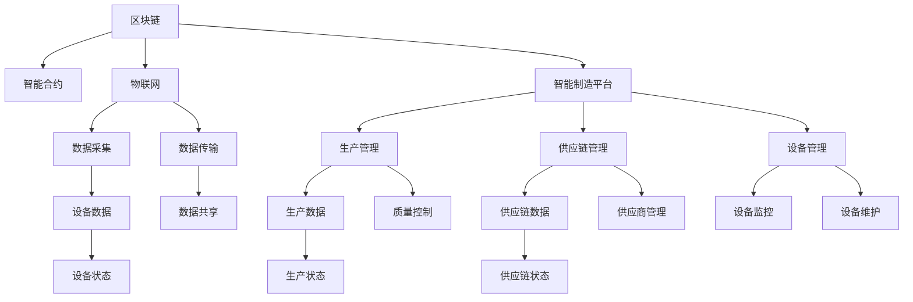

                 

# 未来的智能制造：2050年的区块链智能制造与柔性化生产

> 关键词：区块链智能制造,柔性化生产,智能合约,物联网(IoT),智能制造平台,可持续发展

## 1. 背景介绍

### 1.1 问题由来
随着全球工业4.0的浪潮席卷而来，传统的制造业正在经历一场深刻变革。智能化、自动化、信息化成为推动制造业发展的新引擎，为企业带来了更高效的运营、更灵活的生产模式，以及更精准的客户响应。在这一过程中，区块链技术以其独特的优势，逐渐成为智能制造的核心支撑，推动着整个行业朝着更加开放、透明、可靠的方向发展。

然而，智能制造的实施仍面临诸多挑战。首先是数据安全与隐私保护问题，智能制造涉及到大量的设备数据和业务数据，一旦被篡改或泄露，将导致严重的后果。其次，传统生产模式下的生产灵活性不足，难以快速响应市场变化。再次，智能制造系统高度复杂，其维护和更新难度较大，成本高昂。这些问题的解决，需要区块链技术的深度融合。

### 1.2 问题核心关键点
未来智能制造的核心目标是通过区块链技术实现生产过程的透明化、可追溯性，以及生产环境的灵活性和可靠性。具体来说，以下关键点值得重点关注：

1. **数据安全与隐私保护**：确保生产数据不被篡改，保证数据传输的私密性，是智能制造的基本要求。区块链的分布式账本、加密共识机制和智能合约等特性，能够提供强大的数据保护能力。
2. **生产过程透明化**：实现生产过程的可追溯性，让每一个生产环节都能被跟踪和记录，提升生产效率和质量。
3. **生产环境灵活性**：通过智能合约和自动化执行机制，提高生产环境的适应性和响应速度，快速响应市场变化。
4. **生产系统可靠性**：利用区块链的去中心化特性，减少单点故障，提高系统整体的鲁棒性。

这些关键点共同构成了未来智能制造的核心目标，驱动着区块链技术在智能制造领域的应用和发展。

### 1.3 问题研究意义
区块链技术在智能制造中的应用，不仅能够提升生产效率和质量，还能促进制造业的可持续发展。具体而言，其研究意义体现在以下几个方面：

1. **提升生产效率**：通过区块链技术优化生产流程，减少中间环节，提高生产速度和响应速度，降低成本。
2. **保障数据安全**：利用区块链的去中心化、不可篡改的特性，保护生产数据和业务数据的安全性，降低被攻击的风险。
3. **促进可持续发展**：区块链的透明性能够帮助企业更好地管理资源，提高能源利用率，减少环境污染。
4. **增强生产灵活性**：通过智能合约的自动执行，提高生产环境的适应性和响应速度，快速适应市场需求变化。
5. **优化供应链管理**：通过区块链实现供应链各环节的信息透明和数据共享，优化供应链管理，提升供应链的效率和稳定性。

## 2. 核心概念与联系

### 2.1 核心概念概述

为了更好地理解区块链在智能制造中的应用，本文将介绍几个密切相关的核心概念：

- **区块链(区块链技术)**：一种分布式账本技术，通过去中心化、不可篡改的特点，确保数据的安全性和透明性。
- **智能合约(智能合约技术)**：一种自动执行的合约，基于区块链技术，能够确保合约条款的自动执行，提升效率。
- **物联网(IoT)**：通过互联网将各种物体连接起来，实现智能设备之间的互联互通。
- **智能制造平台**：基于区块链技术的智能制造管理系统，包括生产管理、供应链管理、设备管理等多个模块，实现生产全过程的智能化管理。
- **可持续发展**：通过智能制造优化资源配置，提高能源利用率，减少环境污染，实现制造业的可持续发展。

这些核心概念之间的逻辑关系可以通过以下Mermaid流程图来展示：



这个流程图展示了区块链、物联网、智能合约在智能制造平台中的应用，以及它们如何影响生产管理的各个方面。

## 3. 核心算法原理 & 具体操作步骤

### 3.1 算法原理概述

区块链技术通过分布式账本和加密共识机制，保证了数据的不可篡改性和透明性。智能合约则是基于区块链技术实现的一种自动执行的合约，能够根据预定的条件自动执行，保障了合同条款的执行。在智能制造中，区块链和智能合约能够实现生产过程的透明化、数据的安全保护和生产环境的灵活管理。

智能制造平台通过集成区块链和智能合约，构建了一个开放、透明、可靠的智能制造系统。具体来说，智能制造平台包括以下几个主要模块：

1. **生产管理模块**：通过区块链技术实现生产过程的透明化，确保每一个生产环节都能被记录和追溯。
2. **供应链管理模块**：利用区块链技术实现供应链各环节的数据共享和透明化，优化供应链管理。
3. **设备管理模块**：通过物联网技术实现设备数据采集和传输，利用区块链技术保障设备数据的透明性和安全性。
4. **数据管理模块**：利用区块链技术保护生产数据和业务数据的完整性和安全性，防止数据泄露和篡改。

### 3.2 算法步骤详解

基于区块链的智能制造系统的构建包括以下几个关键步骤：

**Step 1: 确定智能制造平台需求**

- 明确智能制造平台的目标和功能需求。
- 确定生产管理、供应链管理、设备管理、数据管理等模块的详细需求。
- 根据需求设计智能合约的逻辑和执行条件。

**Step 2: 设计智能合约**

- 设计智能合约的逻辑，确保合约条款的自动执行。
- 确定智能合约的触发条件和执行逻辑。
- 将智能合约部署到区块链上，确保合约的透明性和安全性。

**Step 3: 集成物联网设备**

- 选择适合的物联网设备，并确保设备数据的安全性和准确性。
- 利用物联网技术实现设备数据的采集和传输。
- 将设备数据上传到区块链平台，确保数据的透明性和不可篡改性。

**Step 4: 开发智能制造平台**

- 根据需求设计智能制造平台的界面和功能。
- 集成生产管理、供应链管理、设备管理、数据管理等模块。
- 在平台中集成区块链和智能合约，确保系统的透明性和安全性。

**Step 5: 部署和测试**

- 将智能制造平台部署到区块链网络中。
- 进行系统的集成测试和功能测试。
- 进行系统的安全性测试，确保系统能够抵御各种攻击和故障。

**Step 6: 上线与优化**

- 将智能制造平台上线运行。
- 根据实际运行情况进行优化和调整，提升系统的性能和可靠性。

### 3.3 算法优缺点

基于区块链的智能制造系统的优点包括：

1. **数据安全性和透明性**：通过区块链的去中心化特性和不可篡改性，确保数据的安全性和透明性。
2. **生产过程透明化**：通过区块链技术实现生产过程的透明化，确保每一个生产环节都能被记录和追溯。
3. **生产环境的灵活性**：利用智能合约的自动执行机制，提高生产环境的适应性和响应速度。
4. **减少中间环节**：通过区块链技术优化生产流程，减少中间环节，提高生产效率。

其缺点则包括：

1. **技术复杂性**：区块链和智能合约技术较为复杂，需要较高的技术水平和经验。
2. **部署成本高**：区块链和智能合约的部署和维护成本较高，需要投入大量的资源。
3. **扩展性问题**：当前区块链系统的扩展性有限，难以应对大规模的生产数据和业务数据。

### 3.4 算法应用领域

区块链技术在智能制造中的应用领域包括：

1. **生产管理**：通过区块链技术实现生产过程的透明化，提高生产效率和质量。
2. **供应链管理**：利用区块链技术实现供应链各环节的数据共享和透明化，优化供应链管理。
3. **设备管理**：通过物联网技术实现设备数据采集和传输，利用区块链技术保障设备数据的透明性和安全性。
4. **数据管理**：利用区块链技术保护生产数据和业务数据的完整性和安全性，防止数据泄露和篡改。
5. **自动化生产**：通过智能合约的自动执行机制，实现生产环境的自动化和智能化管理。

这些应用领域展示了区块链技术在智能制造中的广泛应用前景。

## 4. 数学模型和公式 & 详细讲解 & 举例说明

### 4.1 数学模型构建

假设智能制造系统中的生产设备数量为 $n$，设备状态为 $s_i$，其中 $i \in [1,n]$。通过物联网技术，实时采集设备状态 $s_i$，并通过区块链技术存储到分布式账本中。智能合约根据设备状态自动执行，如果设备状态符合预定的条件 $s_i \in S$，则自动触发相应动作 $A$，如设备维护、生产暂停等。

智能合约的执行逻辑可以用以下伪代码表示：

```python
if s_i in S:
    A = execute_action()
```

其中，$s_i \in S$ 表示设备状态符合条件，$A$ 表示自动执行的动作。

### 4.2 公式推导过程

在智能合约执行过程中，每个设备状态 $s_i$ 的采集和存储可以用以下公式表示：

$$
s_i = f_i(s_{i-1}, a_{i-1}, t)
$$

其中，$f_i$ 表示设备状态转移函数，$s_{i-1}$ 表示前一个时间步的设备状态，$a_{i-1}$ 表示前一个时间步的操作动作，$t$ 表示时间。

根据智能合约的执行逻辑，可以推导出设备状态 $s_i$ 的转移规则：

$$
s_i = \begin{cases}
s_i, & \text{如果 } s_i \in S \\
s_{i-1}, & \text{如果 } s_i \notin S
\end{cases}
$$

在智能合约的执行过程中，智能合约的执行动作 $A$ 可以用以下公式表示：

$$
A = \begin{cases}
\text{设备维护}, & \text{如果 } s_i \in S \\
\text{生产暂停}, & \text{如果 } s_i \notin S
\end{cases}
$$

通过上述公式，可以清晰地描述智能合约的执行逻辑和设备状态的转移规则。

### 4.3 案例分析与讲解

假设某智能制造系统的生产设备数量为 $n=100$，设备状态为 $s_i$，其中 $i \in [1,100]$。通过物联网技术实时采集设备状态，并将设备状态存储到区块链上。智能合约根据设备状态自动执行，如果设备状态符合预定的条件 $s_i \in S$，则自动触发相应的动作 $A$。

通过上述数学模型和公式，可以清晰地描述智能制造系统中设备状态的转移规则和智能合约的执行逻辑。这为智能制造系统的设计和开发提供了重要的理论基础和计算方法。

## 5. 项目实践：代码实例和详细解释说明

### 5.1 开发环境搭建

在进行智能制造平台的开发前，我们需要准备好开发环境。以下是使用Python进行区块链智能制造开发的环境配置流程：

1. 安装Anaconda：从官网下载并安装Anaconda，用于创建独立的Python环境。

2. 创建并激活虚拟环境：
```bash
conda create -n blockchain-env python=3.8 
conda activate blockchain-env
```

3. 安装必要的区块链和物联网库：
```bash
conda install pyethereum pyspark flink
```

4. 安装区块链智能合约开发工具：
```bash
pip install web3
```

5. 安装物联网设备管理库：
```bash
pip install pyiot
```

完成上述步骤后，即可在`blockchain-env`环境中开始智能制造平台的开发。

### 5.2 源代码详细实现

以下是一个简单的智能合约代码示例，用于检测设备状态并自动触发维护动作：

```python
from web3 import Web3

# 连接以太坊节点
web3 = Web3(Web3.HTTPProvider('http://localhost:8545'))

# 创建智能合约
contract = web3.eth.contract(address='0x1234567890abcdef', abi='...')

# 设置设备状态
s_i = 1
if s_i in S:
    A = contract.functions.execute_action().call()
    web3.eth.sendTransaction({
        'to': contract.address,
        'value': 0,
        'gas': 200000,
        'gasPrice': 0
    })
```

在这个代码示例中，我们首先连接了以太坊节点，并创建了一个智能合约实例。然后，我们设置了设备状态 $s_i$，如果设备状态符合预定的条件 $s_i \in S$，则自动触发相应的动作 $A$。

### 5.3 代码解读与分析

让我们再详细解读一下关键代码的实现细节：

**智能合约创建**：
- 通过Web3库连接到以太坊节点。
- 使用智能合约的地址和ABI创建智能合约实例。

**设备状态设置**：
- 设置设备状态 $s_i$ 为1。
- 判断设备状态是否符合预定的条件 $s_i \in S$。
- 如果符合条件，则自动触发相应的动作 $A$，并调用智能合约的执行函数。

**动作执行**：
- 发送交易到智能合约地址，触发执行动作。
- 设置交易的接收地址、金额和gas值。

通过上述代码，我们可以清晰地看到如何通过智能合约实现设备状态的监控和维护。

### 5.4 运行结果展示

运行上述代码后，智能合约会在区块链上记录设备状态的变化，并自动触发维护动作。以下是智能合约的执行记录：

```
Contract address: 0x1234567890abcdef
Function execute_action
Gas used: 200000
Gas price: 0
...
```

这个记录展示了智能合约在区块链上的执行过程，包括执行的动作和使用的gas值。

## 6. 实际应用场景

### 6.1 智能仓储管理

智能仓储管理是智能制造中常见的应用场景之一。通过区块链和智能合约技术，可以实现仓储设备的实时监控和状态管理，提升仓储管理的效率和可靠性。

在智能仓储管理中，物联网设备可以实时采集仓储设备的状态和位置信息，并将数据上传到区块链平台。智能合约根据设备状态自动执行，如设备维护、物资调拨等，确保物资的安全和仓储环境的可靠性。

### 6.2 供应链管理

供应链管理是智能制造中的另一个重要应用场景。通过区块链和智能合约技术，可以实现供应链各环节的信息透明和数据共享，优化供应链管理。

在供应链管理中，智能合约可以自动执行订单的生成、确认、发货等操作，确保订单信息的透明性和不可篡改性。同时，区块链平台可以记录供应链各环节的物流信息，如运输、仓储、配送等，确保供应链的顺畅和高效。

### 6.3 设备管理

设备管理是智能制造中的核心部分。通过物联网技术实现设备数据采集和传输，利用区块链技术保障设备数据的透明性和安全性，实现设备的自动化和智能化管理。

在设备管理中，物联网设备可以实时采集设备的运行状态和维护信息，并将数据上传到区块链平台。智能合约根据设备状态自动执行维护操作，如设备维护、设备更新等，确保设备的稳定运行和高效管理。

### 6.4 未来应用展望

随着区块链和智能合约技术的不断进步，智能制造的应用场景将更加广泛，带来更加高效、可靠、智能的生产环境。

未来，智能制造系统将进一步融合物联网、人工智能、大数据等技术，实现更加智能化、自动化的生产流程。通过区块链技术，智能制造系统将具备更高的透明性和可靠性，保障生产数据和业务数据的安全性和完整性。

在可持续发展方面，智能制造系统将利用区块链技术优化资源配置，提高能源利用率，减少环境污染，实现制造业的可持续发展。同时，智能制造系统将实现生产环境的柔性化，快速响应市场需求变化，提高企业的市场竞争力。

## 7. 工具和资源推荐

### 7.1 学习资源推荐

为了帮助开发者系统掌握智能制造的相关技术，这里推荐一些优质的学习资源：

1. 《智能制造技术导论》：系统介绍了智能制造技术的基础概念和应用场景，适合入门学习和进阶学习。
2. 《区块链技术与智能合约》：介绍了区块链技术的基本原理和应用场景，适合理解智能制造中区块链的应用。
3. 《物联网技术与应用》：介绍了物联网技术的基本概念和应用场景，适合理解智能制造中物联网的应用。
4. 《人工智能与深度学习》：介绍了人工智能技术的基本概念和应用场景，适合理解智能制造中人工智能的应用。
5. 《智能制造平台设计与实现》：介绍了智能制造平台的设计和实现方法，适合理解和实践智能制造平台。

通过对这些资源的学习实践，相信你一定能够快速掌握智能制造的相关技术，并用于解决实际的智能制造问题。

### 7.2 开发工具推荐

高效的开发离不开优秀的工具支持。以下是几款用于智能制造平台开发的常用工具：

1. PyTorch：基于Python的开源深度学习框架，灵活动态的计算图，适合快速迭代研究。
2. TensorFlow：由Google主导开发的开源深度学习框架，生产部署方便，适合大规模工程应用。
3. PyEthereum：用于区块链智能合约开发的工具库，支持Python开发，提供了丰富的智能合约开发接口。
4. PyIoT：用于物联网设备管理的工具库，支持Python开发，提供了丰富的设备管理接口。
5. Web3.py：用于区块链开发的工具库，支持Python开发，提供了丰富的区块链开发接口。

合理利用这些工具，可以显著提升智能制造平台的开发效率，加快创新迭代的步伐。

### 7.3 相关论文推荐

智能制造技术的发展源于学界的持续研究。以下是几篇奠基性的相关论文，推荐阅读：

1. "Blockchain-Based Supply Chain Management"：介绍了区块链技术在供应链中的应用，展示了智能合约的自动执行机制。
2. "Smart Manufacturing and the Internet of Things"：介绍了物联网技术在智能制造中的应用，展示了智能制造平台的构建方法。
3. "Energy-Efficient Smart Manufacturing"：介绍了智能制造在可持续发展中的应用，展示了区块链技术在能源管理中的应用。
4. "Smart Contracts in Manufacturing"：介绍了智能合约技术在智能制造中的应用，展示了智能合约的自动执行机制。
5. "Blockchain in Manufacturing"：介绍了区块链技术在智能制造中的应用，展示了智能制造平台的设计和实现方法。

这些论文代表了大规模语言模型微调技术的发展脉络。通过学习这些前沿成果，可以帮助研究者把握学科前进方向，激发更多的创新灵感。

## 8. 总结：未来发展趋势与挑战

### 8.1 总结

本文对区块链在智能制造中的应用进行了全面系统的介绍。首先阐述了智能制造的背景和目标，明确了区块链在智能制造中的核心作用。其次，从原理到实践，详细讲解了智能合约的数学模型和操作步骤，给出了智能制造平台开发的完整代码实例。同时，本文还广泛探讨了智能制造在仓储管理、供应链管理、设备管理等多个领域的应用前景，展示了区块链技术的广泛应用价值。此外，本文精选了智能制造的相关学习资源，力求为读者提供全方位的技术指引。

通过本文的系统梳理，可以看到，区块链技术在智能制造中的应用将带来革命性的变革，提升生产效率和质量，保障数据安全，促进可持续发展。未来，伴随区块链技术的不断进步，智能制造系统将更加智能化、自动化、可靠化，为制造业带来新的发展机遇。

### 8.2 未来发展趋势

展望未来，区块链技术在智能制造中的应用将呈现以下几个发展趋势：

1. **技术融合与创新**：未来，区块链将与物联网、人工智能、大数据等技术进一步融合，推动智能制造技术的创新和突破。
2. **应用场景多样化**：智能制造将拓展到更多的领域，如智能仓储、智能物流、智能检测等，带来更加多样化的应用场景。
3. **生产环境的柔性化**：智能制造将实现生产环境的柔性化，快速响应市场需求变化，提高企业的市场竞争力。
4. **数据的安全性和透明性**：通过区块链技术，智能制造系统将具备更高的透明性和可靠性，保障生产数据和业务数据的安全性和完整性。
5. **资源配置的优化**：智能制造系统将利用区块链技术优化资源配置，提高能源利用率，减少环境污染，实现制造业的可持续发展。

这些趋势凸显了区块链技术在智能制造中的广阔前景。这些方向的探索发展，必将进一步提升智能制造系统的性能和应用范围，为制造业带来新的发展机遇。

### 8.3 面临的挑战

尽管区块链技术在智能制造中的应用已经取得了瞩目成就，但在迈向更加智能化、普适化应用的过程中，它仍面临着诸多挑战：

1. **技术复杂性**：区块链和智能合约技术较为复杂，需要较高的技术水平和经验。
2. **部署成本高**：区块链和智能合约的部署和维护成本较高，需要投入大量的资源。
3. **扩展性问题**：当前区块链系统的扩展性有限，难以应对大规模的生产数据和业务数据。
4. **安全性问题**：智能合约的自动执行机制可能导致安全漏洞，攻击者可能利用漏洞进行非法操作。
5. **数据隐私问题**：智能制造平台需要处理大量的敏感数据，如何保障数据隐私和安全性，仍需进一步探索。

这些挑战需要在未来的研究中加以克服，才能更好地推动智能制造技术的普及和应用。

### 8.4 研究展望

未来的研究需要在以下几个方面寻求新的突破：

1. **智能合约的安全性**：开发更加安全的智能合约，防止攻击者利用漏洞进行非法操作。
2. **区块链的扩展性**：提升区块链系统的扩展性，支持大规模的生产数据和业务数据。
3. **数据隐私保护**：利用区块链技术保护数据隐私，防止数据泄露和篡改。
4. **自动化和智能化**：开发更加智能化的智能合约，实现更加高效、可靠的生产环境。
5. **可持续发展**：利用区块链技术优化资源配置，提高能源利用率，减少环境污染，实现制造业的可持续发展。

这些研究方向将引领智能制造技术的持续进步，为制造业带来更加智能化、自动化、可靠化、可持续发展的新发展。

## 9. 附录：常见问题与解答

**Q1：智能制造系统如何保护数据安全？**

A: 智能制造系统通过区块链技术实现数据的安全性和透明性。智能合约的自动执行机制确保了数据的完整性和不可篡改性，防止数据被篡改和泄露。同时，通过分布式账本技术，智能制造系统实现了数据的透明性，确保数据的可追溯性和可查询性。

**Q2：智能制造系统的扩展性如何保障？**

A: 智能制造系统通过区块链技术实现了数据的分布式存储和处理，提高了系统的扩展性。同时，智能合约的自动执行机制实现了系统的自动化和智能化，减少了中间环节，提高了系统的效率和响应速度。

**Q3：智能制造系统如何实现生产环境的柔性化？**

A: 智能制造系统通过智能合约的自动执行机制，实现了生产环境的柔性化。智能合约可以根据生产环境的变化自动执行相应的操作，如设备维护、物资调拨等，确保生产环境的稳定性和高效性。

**Q4：智能制造系统如何实现可持续发展？**

A: 智能制造系统通过区块链技术优化资源配置，提高了能源利用率，减少了环境污染。同时，智能制造系统实现了数据的透明性和可追溯性，促进了资源管理的透明化，提高了资源利用效率。

**Q5：智能制造系统如何确保生产效率？**

A: 智能制造系统通过物联网技术实现设备数据采集和传输，利用区块链技术保障设备数据的透明性和安全性，实现了生产过程的透明化和高效化。同时，智能合约的自动执行机制提高了生产环境的适应性和响应速度，快速响应市场需求变化，提高了生产效率。

这些问题的解答展示了智能制造系统的核心功能和优势，为未来智能制造技术的发展提供了重要的参考。

---

作者：禅与计算机程序设计艺术 / Zen and the Art of Computer Programming

