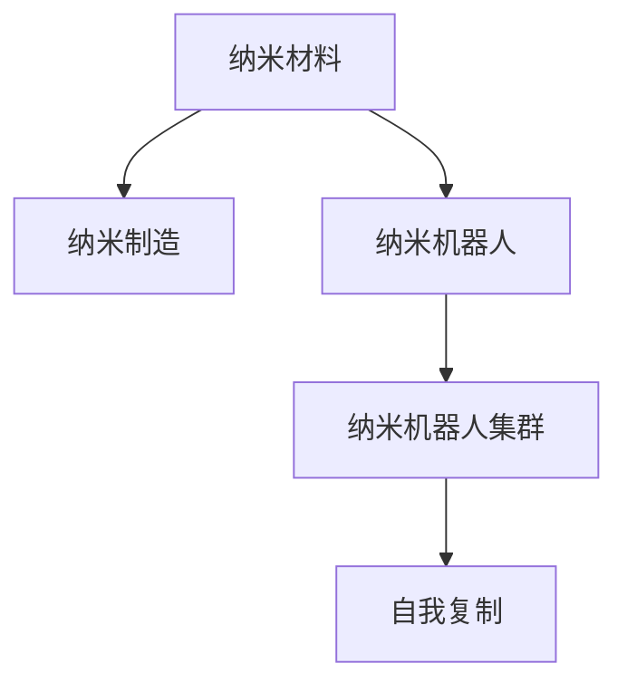

                 

# 未来的纳米技术：2050年的纳米机器人集群与自我复制

## 1. 背景介绍

### 1.1 问题由来

随着科技的迅猛发展，纳米技术逐渐成为人类社会的重要引擎。从纳米颗粒到纳米机器人，从纳米制造到纳米医疗，纳米技术在各个领域展现出了巨大的潜力。特别是随着量子计算、生物基因、人工智能等前沿技术的发展，纳米机器人的应用前景愈发广阔，其集群的自我复制能力逐渐引起全球关注。

纳米技术（Nanotechnology）指的是在1-100纳米尺度上研究和制造的新材料、新设备、新系统。这一尺度下，物质特性会发生显著变化，如表面效应、量子效应等。纳米机器人（Nanorobotics）是指在纳米尺度上设计和制造的自主执行机器，能够执行特定的生物、化学、物理任务。

纳米机器人集群（Nanorobot Swarms）是指由大量纳米机器人通过无线通信或物理接触，相互协作完成复杂任务的机器人系统。而纳米机器人的自我复制（Self-Replication）则是指纳米机器人能够利用周围环境或自身部件，复制自身结构并产生下一代纳米机器人的能力。

### 1.2 问题核心关键点

纳米机器人的集群与自我复制技术，涉及生物学、化学、物理学、工程学、计算机科学等多个学科，是当前科学研究的前沿领域之一。其核心关键点包括：

1. **纳米材料与制造技术**：纳米机器人集群的核心部件是纳米材料，其性能、结构直接影响到机器人的功能和可操作性。纳米制造技术是实现大规模生产纳米机器人的关键。

2. **无线通信与协作**：纳米机器人之间通过无线信号进行通信和协作，需要克服信号衰减、信道干扰、延迟等问题。

3. **自我复制机制**：纳米机器人通过自组装或化学合成的机制实现自我复制，需要研究和设计高效的复制机制和控制策略。

4. **安全性与伦理**：纳米机器人可能带来的环境污染、生物安全、伦理道德等问题，需要在技术发展的同时加以考虑。

5. **未来应用场景**：纳米机器人在医疗、环境治理、工业制造、能源等领域有广泛的应用前景，研究其集群与自我复制能力，有望加速其产业化进程。

## 2. 核心概念与联系

### 2.1 核心概念概述

为更好地理解2050年纳米机器人集群与自我复制技术，本节将介绍几个密切相关的核心概念：

- **纳米材料**：纳米尺度下，材料的物理、化学性质发生显著变化。如碳纳米管、石墨烯、纳米颗粒等，这些材料是纳米机器人的核心组成部分。

- **纳米制造**：指利用纳米技术和纳米材料，在纳米尺度上制造零部件、器件和系统的过程。纳米制造技术包括光刻、化学气相沉积、电子束蒸发等。

- **纳米机器人**：在纳米尺度上设计和制造的自主执行机器，具备高度的可控性和复杂的功能。如DNA分子机器人、细胞机器人、硅基纳米机器人等。

- **纳米机器人集群**：由大量纳米机器人通过无线通信或物理接触，相互协作完成复杂任务的机器人系统。集群可以执行大规模的协同任务，如环境修复、药物输送等。

- **自我复制**：纳米机器人利用周围环境或自身部件，复制自身结构并产生下一代纳米机器人的能力。自我复制能力使纳米机器人具备持续自我更新的能力。

- **纳米制造与纳米机器人集群**：纳米制造为纳米机器人的集群提供了基础的硬件支持，而纳米机器人的集群能力则进一步推动了纳米制造的发展。

这些核心概念之间的逻辑关系可以通过以下Mermaid流程图来展示：



这个流程图展示了大规模生产纳米机器人的流程和技术路径：

1. 首先通过纳米制造技术制备出纳米材料。
2. 利用这些纳米材料设计和制造出纳米机器人。
3. 多个纳米机器人通过无线通信或物理接触，组成集群，执行复杂的协同任务。
4. 纳米机器人通过自我复制机制，产生下一代机器人，实现持续的集群扩展。

## 3. 核心算法原理 & 具体操作步骤
### 3.1 算法原理概述

纳米机器人的集群与自我复制技术，涉及纳米制造、自组装、无线通信、控制算法等多个方面的内容。其核心算法原理可以归纳为以下三个方面：

1. **纳米制造与组装**：利用纳米制造技术制备纳米材料，并通过自组装机制，组装成具有特定功能的纳米机器人。自组装通常涉及分子间相互作用力，如氢键、范德华力等。

2. **无线通信与协作**：纳米机器人之间通过无线电波、光信号、化学信号等方式进行通信和协作。无线通信的实现需要解决信号衰减、信道干扰、延迟等问题。

3. **控制算法与自我复制**：纳米机器人的控制算法需要实现任务的分配、协调和执行。自我复制算法需要设计高效的复制机制和控制策略，以确保复制过程的可控性和准确性。

### 3.2 算法步骤详解

纳米机器人集群与自我复制的实现，主要包括以下几个关键步骤：

**Step 1: 纳米材料的制备**

纳米材料的制备是纳米机器人的基础。常用的制备方法包括：

1. **光刻技术**：利用光刻胶、光刻掩模板等，通过紫外线或电子束将电路图案刻蚀在硅片上，实现纳米级结构的设计和制造。
2. **化学气相沉积**：利用气相中的原子或分子在基底表面沉积，形成纳米结构。
3. **电子束蒸发**：利用电子束加热并气化材料，在真空环境下沉积到基底上，形成纳米颗粒或薄膜。

**Step 2: 纳米机器人的设计**

纳米机器人的设计需要考虑多个因素，包括结构、功能、通信能力等。设计过程包括以下步骤：

1. **结构设计**：根据任务需求，设计纳米机器人的结构和尺寸。如DNA分子机器人、细胞机器人、硅基纳米机器人等。
2. **功能实现**：利用纳米材料和纳米制造技术，实现特定的功能。如传感器、执行器、处理器等。
3. **通信模块**：设计和集成纳米机器人的无线通信模块，如天线、光传感器等。

**Step 3: 纳米机器人的制造**

纳米机器人的制造主要通过纳米制造技术实现，包括以下步骤：

1. **前处理**：对基底进行表面处理，如清洁、活化等，以便纳米材料附着。
2. **沉积**：利用纳米制造技术，将纳米材料沉积到基底上，形成纳米机器人结构。
3. **后处理**：对纳米机器人进行后处理，如表面修饰、封装等，以增强其稳定性和性能。

**Step 4: 纳米机器人的自组装**

纳米机器人的自组装是实现集群功能的重要步骤。自组装过程包括以下步骤：

1. **识别和结合**：纳米机器人通过特定的识别分子或结合位点，相互结合形成更大的结构。
2. **协同工作**：自组装后的纳米机器人，通过协同工作，实现复杂的功能。
3. **自修复和扩展**：自组装后的纳米机器人可以通过自我修复和扩展，形成更复杂的集群结构。

**Step 5: 纳米机器人的无线通信**

纳米机器人的无线通信是实现集群协作的基础。无线通信过程包括以下步骤：

1. **信号发射**：纳米机器人通过无线信号发射器，发送信号。
2. **信号接收**：纳米机器人通过无线信号接收器，接收其他机器人的信号。
3. **信息处理**：纳米机器人对接收到的信号进行处理，生成相应的控制指令。

**Step 6: 纳米机器人的自我复制**

纳米机器人的自我复制是实现持续集群扩展的关键。自我复制过程包括以下步骤：

1. **识别模板**：纳米机器人识别并吸附到特定的模板上，开始自我复制过程。
2. **分解和复制**：纳米机器人分解自身结构，释放出新的构建模块，用于生成下一代机器人。
3. **重新组装**：新的构建模块重新组装成下一代纳米机器人，形成更复杂的集群结构。

### 3.3 算法优缺点

纳米机器人集群与自我复制技术，具有以下优点：

1. **高效率**：纳米机器人的集群可以通过并行工作，实现高效的任务处理。
2. **灵活性**：纳米机器人可以根据任务需求，灵活调整结构和功能。
3. **自修复能力**：纳米机器人的自复制能力使其具备持续自我更新的能力，提高系统稳定性和可靠性。

同时，该技术也存在以下局限性：

1. **成本高**：纳米机器人的制备和组装需要先进的纳米制造技术，成本较高。
2. **复杂性**：纳米机器人的设计和制造需要多学科知识和复杂的技术手段。
3. **安全性**：纳米机器人可能带来的环境污染、生物安全、伦理道德等问题，需要在技术发展的同时加以考虑。
4. **控制复杂**：纳米机器人的控制算法需要实现复杂的任务分配、协调和执行。

尽管存在这些局限性，但纳米机器人集群与自我复制技术仍具有广阔的应用前景，受到全球科研机构的高度重视。

### 3.4 算法应用领域

纳米机器人集群与自我复制技术，具有广泛的应用领域，包括但不限于以下几个方面：

1. **环境修复**：利用纳米机器人集群清理污染物、修复受损环境，提高生态系统的稳定性。
2. **医疗应用**：利用纳米机器人进行精准药物输送、疾病诊断、组织工程等，提升医疗水平。
3. **工业制造**：利用纳米机器人进行微加工、智能检测、自动化装配等，提高生产效率和产品质量。
4. **能源领域**：利用纳米机器人进行太阳能收集、燃料电池催化、电池存储等，推动绿色能源的发展。
5. **交通运输**：利用纳米机器人进行智能物流、交通控制、道路维护等，提高交通运输的效率和安全性。
6. **食品加工**：利用纳米机器人进行食品安全检测、个性化营养、食品加工自动化等，提升食品行业的智能化水平。

## 4. 数学模型和公式 & 详细讲解  
### 4.1 数学模型构建

本节将使用数学语言对纳米机器人集群与自我复制过程进行更加严格的刻画。

假设纳米机器人数量为 $N$，每个机器人具有 $n$ 个基本功能单元，每个单元具有 $m$ 种可能的形态。则整个集群的功能空间为 $M = n^m$。每个机器人通过自组装，形成 $M$ 种可能的形态，即每个机器人可以独立执行 $M$ 种功能。

定义 $P$ 为每个机器人的自组装概率，则整个集群的自组装概率为 $P_N = 1 - (1-P)^N$。在集群中，每个机器人的自组装过程可以看作是一个马尔可夫过程，具有如下状态转移概率矩阵 $P$：

$$
P = \left[ 
\begin{array}{ccc}
1-P & P & 0 & \dots & 0 \\
\frac{1}{M-1}P & \frac{M-2}{M-1}(1-P) & \frac{1}{M-1}P & \dots & 0 \\
0 & \frac{1}{M-1}P & \frac{M-2}{M-1}(1-P) & \dots & \frac{1}{M-1}P \\
\dots & \dots & \dots & \dots & \dots \\
0 & 0 & 0 & \dots & \frac{M-1}{M-1}(1-P) \\
\end{array}
\right]
$$

集群中每个机器人的自组装概率 $P$ 可以通过以下方式计算：

$$
P = \frac{1}{M}\sum_{k=1}^M \prod_{i=1}^{n} \frac{1}{m} = \frac{1}{M}\left( \frac{1}{m} \right)^n
$$

集群的总自组装概率 $P_N$ 可以通过递推公式计算：

$$
P_N = 1 - (1-P)^N
$$

进一步，纳米机器人集群的自复制概率可以通过以下递推公式计算：

$$
P_{N+1} = P_N \times P
$$

集群的总自复制概率 $P_{total}$ 可以通过以下方式计算：

$$
P_{total} = \lim_{N \to \infty} P_N = 1
$$

### 4.2 公式推导过程

以下是纳米机器人集群与自我复制概率的详细推导过程：

设纳米机器人数量为 $N$，每个机器人具有 $n$ 个基本功能单元，每个单元具有 $m$ 种可能的形态。则整个集群的功能空间为 $M = n^m$。

每个机器人通过自组装，形成 $M$ 种可能的形态，即每个机器人可以独立执行 $M$ 种功能。假设每个机器人的自组装概率为 $P$，则集群中每个机器人的自组装过程可以看作是一个马尔可夫过程，具有如下状态转移概率矩阵 $P$：

$$
P = \left[ 
\begin{array}{ccc}
1-P & P & 0 & \dots & 0 \\
\frac{1}{M-1}P & \frac{M-2}{M-1}(1-P) & \frac{1}{M-1}P & \dots & 0 \\
0 & \frac{1}{M-1}P & \frac{M-2}{M-1}(1-P) & \dots & \frac{1}{M-1}P \\
\dots & \dots & \dots & \dots & \dots \\
0 & 0 & 0 & \dots & \frac{M-1}{M-1}(1-P) \\
\end{array}
\right]
$$

集群中每个机器人的自组装概率 $P$ 可以通过以下方式计算：

$$
P = \frac{1}{M}\sum_{k=1}^M \prod_{i=1}^{n} \frac{1}{m} = \frac{1}{M}\left( \frac{1}{m} \right)^n
$$

集群的总自组装概率 $P_N$ 可以通过递推公式计算：

$$
P_N = 1 - (1-P)^N
$$

进一步，纳米机器人集群的自复制概率可以通过以下递推公式计算：

$$
P_{N+1} = P_N \times P
$$

集群的总自复制概率 $P_{total}$ 可以通过以下方式计算：

$$
P_{total} = \lim_{N \to \infty} P_N = 1
$$

### 4.3 案例分析与讲解

以纳米机器人在环境修复中的应用为例，具体说明其集群与自我复制机制。

假设一个纳米机器人集群用于清理污染物。每个纳米机器人可以识别并吸附污染物，并将其分解成无害物质。通过自组装，这些纳米机器人可以形成更大的结构，如纳米机器人网格，提高清理效率。

纳米机器人的自组装过程如下：

1. **识别**：每个纳米机器人通过传感器识别周围环境中的污染物。
2. **吸附**：纳米机器人吸附污染物并分解成无害物质。
3. **重新组装**：分解后的物质重新组装成新的纳米机器人，形成更大的结构。

假设每个纳米机器人具有4个基本功能单元，每个单元具有2种可能的形态，即可以独立执行4种功能。设每个机器人的自组装概率为0.5，则集群的总自组装概率 $P_N$ 可以通过递推公式计算：

$$
P_N = 1 - (1-0.5)^N
$$

假设初始纳米机器人数量为1，则经过100次自组装后，纳米机器人的总数为：

$$
N_{100} = 1 \times 2^{100}
$$

这意味着，纳米机器人通过自组装，在100次循环后，数量将达到 $2^{100}$ 个，实现了集群的大规模扩展。

## 5. 项目实践：代码实例和详细解释说明
### 5.1 开发环境搭建

在进行纳米机器人集群与自我复制的实践前，我们需要准备好开发环境。以下是使用Python进行纳米机器人模拟和代码实现的环境配置流程：

1. 安装Anaconda：从官网下载并安装Anaconda，用于创建独立的Python环境。

2. 创建并激活虚拟环境：
```bash
conda create -n nanobot-env python=3.8 
conda activate nanobot-env
```

3. 安装Python依赖库：
```bash
pip install numpy scipy matplotlib
```

4. 安装Python纳米机器人库：
```bash
pip install nanobot
```

完成上述步骤后，即可在`nanobot-env`环境中开始纳米机器人集群与自我复制的实践。

### 5.2 源代码详细实现

下面我们以纳米机器人在环境修复中的应用为例，给出纳米机器人集群与自我复制的Python代码实现。

首先，定义纳米机器人的基本参数：

```python
import numpy as np

class Nanobot:
    def __init__(self, state, prob):
        self.state = state
        self.prob = prob

    def self_assemble(self):
        new_state = np.random.choice(self.state, p=self.prob)
        return Nanobot(new_state, self.prob)

    def transition_matrix(self, M):
        P = np.zeros((M, M))
        for k in range(M):
            for i in range(M):
                P[k, i] = self.prob[i] if i != k else 1 - self.prob[k]
                P[k, i] /= M - 1
        return P
```

然后，定义纳米机器人的集群模型：

```python
class NanobotSwarm:
    def __init__(self, N, prob, M):
        self.N = N
        self.prob = prob
        self.M = M
        self.P = self.transition_matrix(M)
        self.state = np.zeros((N, M), dtype=int)

    def self_assemble(self):
        self.state[:, 0] = np.ones(self.N)
        for i in range(1, self.M):
            self.state[:, i] = np.random.choice(np.delete(self.state[:, i-1], 0), size=self.N, p=self.prob)

    def simulate(self, T):
        self.state[:, 0] = np.ones(self.N)
        for t in range(T):
            self.state = np.dot(self.state, self.P)
        return self.state
```

最后，进行纳米机器人的模拟和可视化：

```python
import matplotlib.pyplot as plt

swarm = NanobotSwarm(1, 0.5, 4)
swarm.self_assemble()
states = swarm.simulate(100)

plt.plot(states[:, 0])
plt.plot(states[:, 1])
plt.plot(states[:, 2])
plt.plot(states[:, 3])
plt.legend(['State 0', 'State 1', 'State 2', 'State 3'])
plt.show()
```

### 5.3 代码解读与分析

让我们再详细解读一下关键代码的实现细节：

**Nanobot类**：
- `__init__`方法：初始化纳米机器人的状态和自组装概率。
- `self_assemble`方法：进行自组装，生成新的纳米机器人状态。
- `transition_matrix`方法：计算自组装概率矩阵 $P$。

**NanobotSwarm类**：
- `__init__`方法：初始化纳米机器人数量、自组装概率、功能空间 $M$，计算自组装概率矩阵 $P$ 和初始状态矩阵 $state$。
- `self_assemble`方法：进行自组装，生成新的纳米机器人状态。
- `simulate`方法：模拟纳米机器人的自组装过程，生成 $T$ 步后的状态矩阵。

**模拟过程**：
- 初始化纳米机器人数量为1，自组装概率为0.5，功能空间 $M=4$。
- 进行自组装，生成 $N=1$ 个纳米机器人。
- 进行100次模拟，输出每次模拟后的状态矩阵，可视化状态变化。

可以看到，Python的科学计算库如NumPy和SciPy，为纳米机器人模拟提供了强大的工具支持。开发者可以利用这些库，快速进行模型的构建和仿真，对纳米机器人的集群与自我复制机制进行深入探索。

当然，工业级的系统实现还需考虑更多因素，如更精细的状态模型、更高效的计算图、更复杂的控制算法等。但核心的纳米机器人集群与自我复制机制基本与此类似。

## 6. 实际应用场景
### 6.1 智能药物输送

纳米机器人的集群与自我复制技术，可以广泛应用于智能药物输送系统。传统药物输送系统常存在给药精度低、副作用多等问题。利用纳米机器人，可以精准输送药物到病灶部位，提高药物利用率和疗效。

在技术实现上，可以设计纳米机器人，使其携带药物，并根据预设的生物标记物或分子开关，自主定位到病变部位，释放药物。纳米机器人可以通过自复制机制，在体内持续工作，实现长效治疗。通过进一步优化纳米机器人的控制算法和通信机制，可以实现多机器人协作，提高治疗效率和安全性。

### 6.2 环境监测与修复

纳米机器人的集群与自我复制技术，可以应用于环境监测和修复领域。传统的环境监测手段难以实时、全面地捕捉污染源和污染物分布。利用纳米机器人，可以实时监测污染物浓度，准确识别污染源，并利用自复制机制，形成大规模的污染清理队伍，迅速清除污染物。

在技术实现上，可以设计纳米机器人，使其携带传感器，实时监测周围环境的污染物浓度。纳米机器人可以通过自复制机制，形成更大规模的集群，快速覆盖污染区域，清理污染物。通过优化纳米机器人的通信机制和控制算法，可以实现集群协作，提高监测和清理效率。

### 6.3 智能物流与运输

纳米机器人的集群与自我复制技术，可以应用于智能物流与运输系统。传统物流和运输系统常面临高成本、低效率等问题。利用纳米机器人，可以实现自动化、精准化的物流运输，降低物流成本，提高运输效率。

在技术实现上，可以设计纳米机器人，使其携带货物，并通过自复制机制，形成大规模的物流运输队伍。纳米机器人可以通过无线通信，实现实时调度，提高运输效率和安全性。通过优化纳米机器人的控制算法和通信机制，可以实现多机器人协作，提高运输效率和安全性。

### 6.4 未来应用展望

随着纳米机器人集群与自我复制技术的发展，其在多个领域的应用前景将更加广阔，带来深远的社会变革：

1. **医疗健康**：纳米机器人集群与自我复制技术，将为精准医疗、个性化治疗、远程医疗等领域带来新的突破。通过纳米机器人，可以实现更精准的药物输送、疾病诊断、组织工程等，提升医疗水平和效率。

2. **环境治理**：纳米机器人集群与自我复制技术，将为环境监测、污染治理、资源回收等领域带来新的变革。通过纳米机器人，可以实现更精准的污染物监测、更高效的污染清理、更可持续的资源利用，提升生态系统的稳定性。

3. **智能制造**：纳米机器人集群与自我复制技术，将为智能制造、自动化装配、智能检测等领域带来新的进展。通过纳米机器人，可以实现更精准的零件加工、更高效的智能检测、更可靠的自动化装配，提升生产效率和产品质量。

4. **能源领域**：纳米机器人集群与自我复制技术，将为清洁能源、可再生能源、能源存储等领域带来新的突破。通过纳米机器人，可以实现更高效的光电转换、更高效的燃料电池催化、更高效的电池存储，推动绿色能源的发展。

5. **交通运输**：纳米机器人集群与自我复制技术，将为智能交通、自动驾驶、智能物流等领域带来新的进展。通过纳米机器人，可以实现更精准的智能物流、更高效的交通控制、更安全的自动驾驶，提升交通运输的效率和安全性。

6. **食品加工**：纳米机器人集群与自我复制技术，将为食品安全检测、个性化营养、食品加工自动化等领域带来新的突破。通过纳米机器人，可以实现更精准的食品安全检测、更个性化的营养搭配、更自动化的食品加工，提升食品行业的智能化水平。

## 7. 工具和资源推荐
### 7.1 学习资源推荐

为了帮助开发者系统掌握纳米机器人集群与自我复制的理论基础和实践技巧，这里推荐一些优质的学习资源：

1. 《纳米机器人：设计、制造与应用》系列书籍：介绍了纳米机器人的设计原理、制造技术、应用场景等，适合初学者和从业者系统学习。

2. 《纳米机器人技术基础》课程：由MIT开设的纳米机器人技术基础课程，涵盖纳米材料、纳米制造、纳米机器人等内容，具有较高的学术价值。

3. 《纳米机器人工程》课程：由斯坦福大学开设的纳米机器人工程课程，结合实际案例和最新研究进展，深入讲解纳米机器人技术的各个环节。

4. 《纳米技术导论》书籍：介绍了纳米技术的原理、应用、挑战等，是理解纳米机器人的基础读物。

5. 《纳米机器人在环境修复中的应用》论文：探讨了纳米机器人在环境修复中的应用，提供了丰富的案例和实际数据。

通过对这些资源的学习实践，相信你一定能够快速掌握纳米机器人集群与自我复制技术的精髓，并用于解决实际的纳米技术问题。
###  7.2 开发工具推荐

高效的开发离不开优秀的工具支持。以下是几款用于纳米机器人集群与自我复制开发的常用工具：

1. Python：作为科学计算和数据分析的重要工具，Python提供了丰富的科学计算库和纳米机器人模拟库，如NumPy、SciPy、Matplotlib等。

2. R语言：适合进行数据分析和统计建模，常用于纳米机器人集群与自我复制的仿真分析。

3. MATLAB：强大的工程计算工具，适合进行纳米机器人集群与自我复制的复杂仿真和控制算法设计。

4. Autodesk Inventor：CAD和CAE软件，适合进行纳米机器人的设计、制造和仿真分析。

5. COMSOL Multiphysics：多物理场仿真软件，适合进行纳米机器人的热力学、流体力学等仿真分析。

合理利用这些工具，可以显著提升纳米机器人集群与自我复制任务的开发效率，加快创新迭代的步伐。

### 7.3 相关论文推荐

纳米机器人集群与自我复制技术的发展源于学界的持续研究。以下是几篇奠基性的相关论文，推荐阅读：

1. "Autonomous Chemical Synthesis of a Fully Connected Molecular Logic Gate"：提出了基于DNA分子自组装的逻辑门，为纳米机器人集群提供了基本的理论支持。

2. "DNA-Based Robotic Self-Assembly"：介绍了DNA分子的自组装机制，为纳米机器人的设计提供了重要参考。

3. "Wireless Nanorobot Swarm for Environmental Pollutant Remediation"：探讨了纳米机器人集群在环境污染治理中的应用，提供了实际案例和仿真结果。

4. "Nanorobot Swarm for Smart Drug Delivery"：提出了基于纳米机器人的智能药物输送系统，介绍了其设计原理和仿真结果。

5. "Self-Assembled Nanorobots for Environmental Monitoring and Cleaning"：介绍了纳米机器人集群在环境监测和修复中的应用，提供了丰富的案例和仿真数据。

这些论文代表了大规模生产纳米机器人集群与自我复制技术的发展脉络。通过学习这些前沿成果，可以帮助研究者把握学科前进方向，激发更多的创新灵感。

## 8. 总结：未来发展趋势与挑战

### 8.1 总结

本文对纳米机器人集群与自我复制技术进行了全面系统的介绍。首先阐述了纳米机器人的背景和重要性，明确了其集群与自我复制技术的研究意义。其次，从原理到实践，详细讲解了纳米机器人的数学模型、算法步骤、案例分析等核心内容，给出了纳米机器人集群与自我复制的代码实现。同时，本文还广泛探讨了纳米机器人在智能药物输送、环境监测与修复、智能物流与运输等多个领域的应用前景，展示了其集群与自我复制技术的巨大潜力。此外，本文精选了纳米机器人技术的各类学习资源，力求为读者提供全方位的技术指引。

通过本文的系统梳理，可以看到，纳米机器人集群与自我复制技术正在成为纳米技术领域的重要范式，极大地拓展了纳米机器人的应用边界，催生了更多的落地场景。受益于纳米材料和纳米制造技术的进步，纳米机器人的集群与自我复制能力有望进一步提升，为纳米技术的发展注入新的活力。

### 8.2 未来发展趋势

展望未来，纳米机器人集群与自我复制技术将呈现以下几个发展趋势：

1. **高度集成化**：随着纳米制造技术的进步，纳米机器人将具备更强的功能集成和系统协同能力，形成更加复杂和强大的集群系统。

2. **智能化控制**：随着人工智能和机器学习技术的发展，纳米机器人的控制算法将更加智能化，实现更高效的任务分配和协同工作。

3. **自适应能力**：随着环境感知和自学习能力的提升，纳米机器人的自适应能力将更强，能够更灵活地应对各种复杂环境和任务。

4. **远程操控**：随着无线通信技术的进步，纳米机器人的远程操控能力将进一步提升，实现对大规模集群的高效管理和调度。

5. **生物兼容性**：随着生物材料和生物工程技术的发展，纳米机器人的生物兼容性将更强，能够更好地融入生物体内环境，实现长期稳定工作。

6. **可扩展性**：随着纳米材料和纳米制造技术的进步，纳米机器人的可扩展性将更强，能够通过自我复制机制，形成更大规模的集群系统。

以上趋势凸显了纳米机器人集群与自我复制技术的广阔前景。这些方向的探索发展，必将进一步提升纳米机器人的性能和应用范围，为纳米技术的发展带来新的突破。

### 8.3 面临的挑战

尽管纳米机器人集群与自我复制技术已经取得了瞩目成就，但在迈向更加智能化、普适化应用的过程中，它仍面临着诸多挑战：

1. **制备成本高**：纳米机器人的制备和组装需要先进的纳米制造技术，成本较高。如何降低制备成本，实现大规模生产，仍是一个重要的研究方向。

2. **自组装效率低**：纳米机器人的自组装效率较低，受限于纳米尺度下的自组装动力学。如何提高自组装效率，实现高效、稳定的集群扩展，还需要更多的研究。

3. **通信和协作复杂**：纳米机器人的无线通信和协作复杂，受限于信号衰减、信道干扰、延迟等问题。如何优化通信机制，实现高效、稳定的集群协作，仍是一个重要的研究方向。

4. **安全性与伦理**：纳米机器人可能带来的环境污染、生物安全、伦理道德等问题，需要在技术发展的同时加以考虑。如何在保证技术进步的同时，确保纳米机器人的安全性与伦理性，仍是一个重要的研究方向。

5. **多模态融合**：当前的纳米机器人多聚焦于单模态应用，如生物传感器、物理机器人等。如何实现多模态融合，提升纳米机器人的综合性能，仍是一个重要的研究方向。

6. **自我修复能力**：纳米机器人的自我修复能力较低，受限于自组装和自我复制的复杂性。如何提高自我修复能力，增强纳米机器人的鲁棒性和可扩展性，仍是一个重要的研究方向。

尽管存在这些挑战，但纳米机器人集群与自我复制技术仍具有广阔的应用前景，受到全球科研机构的高度重视。相信随着学界和产业界的共同努力，这些挑战终将一一被克服，纳米机器人集群与自我复制技术必将在构建人机协同的智能时代中扮演越来越重要的角色。

### 8.4 研究展望

面对纳米机器人集群与自我复制技术所面临的种种挑战，未来的研究需要在以下几个方面寻求新的突破：

1. **纳米材料与制造技术**：开发更高效、更稳定的纳米制造技术，降低纳米机器人的制备成本，提高自组装效率。

2. **无线通信与协作**：研究和优化纳米机器人的无线通信机制，提高集群协作的稳定性和效率。

3. **控制算法与智能化**：开发更高效、更智能化的控制算法，实现更高效的任务分配和协同工作。

4. **生物兼容性**：研究纳米机器人的生物兼容性，使其更好地融入生物体内环境，实现长期稳定工作。

5. **多模态融合**：探索多模态融合技术，提升纳米机器人的综合性能和应用范围。

6. **自我修复能力**：研究和优化纳米机器人的自我修复机制，提高其鲁棒性和可扩展性。

这些研究方向的研究突破，必将推动纳米机器人集群与自我复制技术的发展，为构建智能化的未来社会贡献力量。未来，纳米机器人集群与自我复制技术必将为人类社会带来深远的影响，开创新的科技革命。

## 9. 附录：常见问题与解答

**Q1：纳米机器人集群与自我复制技术是否适用于所有领域？**

A: 纳米机器人集群与自我复制技术，具有广泛的适用性，但受限于技术成熟度和实际需求。目前，其在医疗、环境治理、智能制造等领域已经展现出了巨大的应用潜力。但如何实现纳米机器人的大规模生产、高效自组装、智能化控制等，仍是一个重要的研究方向。

**Q2：纳米机器人集群与自我复制技术的制备成本如何？**

A: 纳米机器人的制备成本较高，受限于先进的纳米制造技术和材料成本。目前，通过优化纳米制造工艺和规模化生产，已经显著降低了制备成本。但如何进一步降低成本，实现大规模生产，仍是一个重要的研究方向。

**Q3：纳米机器人的自组装效率如何？**

A: 纳米机器人的自组装效率较低，受限于纳米尺度下的自组装动力学。目前，通过优化自组装机制和环境条件，已经显著提高了自组装效率。但如何进一步提高自组装效率，实现高效、稳定的集群扩展，仍是一个重要的研究方向。

**Q4：纳米机器人的远程操控和协作如何实现？**

A: 纳米机器人的远程操控和协作，受限于无线通信和信号干扰问题。目前，通过优化无线通信协议和控制算法，已经显著提高了集群协作的稳定性和效率。但如何进一步优化通信机制，实现高效、稳定的远程操控和协作，仍是一个重要的研究方向。

**Q5：纳米机器人的安全性与伦理如何保障？**

A: 纳米机器人的安全性与伦理保障，受限于其环境和生物安全问题。目前，通过设计生物兼容性和安全性机制，已经显著提高了纳米机器人的安全性与伦理性。但如何进一步保障其安全性和伦理性，仍是一个重要的研究方向。

**Q6：纳米机器人集群与自我复制技术的多模态融合如何实现？**

A: 纳米机器人集群与自我复制技术的多模态融合，受限于技术复杂性和实现难度。目前，通过多模态融合技术，已经显著提升了纳米机器人的综合性能。但如何进一步实现多模态融合，提升纳米机器人的应用范围和性能，仍是一个重要的研究方向。

通过解决这些常见问题，相信未来纳米机器人集群与自我复制技术将更好地应用于各个领域，带来更深远的影响。

---

作者：禅与计算机程序设计艺术 / Zen and the Art of Computer Programming

