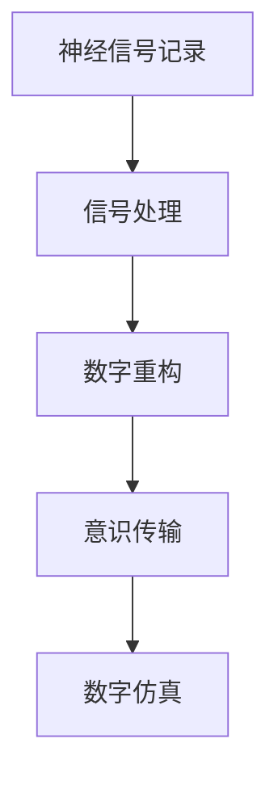

                 

## 1. 背景介绍

### 1.1 问题由来
随着科技的飞速发展，人类对自身认知和意识的理解愈发深入。在2050年，意识上传与全脑仿真成为人类追求的终极目标，成为未来脑科学研究的重点。

人类大脑是已知最复杂的生物系统，蕴藏着海量的信息。当前，研究者们正探索通过技术手段将大脑中的意识传输至数字世界中，进而通过模拟实现全脑仿真。这种技术的实现，不仅能够为神经疾病、脑损伤的修复提供新的途径，还能够使意识脱离肉体束缚，使人类以数字形式存在。

### 1.2 问题核心关键点
实现意识上传与全脑仿真的关键技术包括神经信号记录、信号处理、数字重构、意识传输、数字仿真等环节。本文将深入探讨这些核心技术原理和架构，以及其在实际应用中的挑战与未来发展方向。

## 2. 核心概念与联系

### 2.1 核心概念概述

1. **神经信号记录**：通过脑电图(EEG)、磁共振成像(MRI)、功能性磁共振成像(fMRI)等技术，记录大脑神经元的活动信号。
2. **信号处理**：使用信号处理算法，将神经信号转换为数字信号，并进行预处理、特征提取等。
3. **数字重构**：将数字信号转换为可识别的神经网络结构，进行全脑仿真。
4. **意识传输**：利用神经接口技术，将记录的神经信号传输至数字世界中。
5. **数字仿真**：通过深度学习等技术，构建数字模型，实现全脑仿真。

这些核心技术相互关联，形成了一个完整的意识上传与全脑仿真的技术框架。

### 2.2 核心概念原理和架构的 Mermaid 流程图



## 3. 核心算法原理 & 具体操作步骤

### 3.1 算法原理概述
意识上传与全脑仿真的整个过程可以概括为以下几步：
1. 神经信号的记录与处理。
2. 数字重构，构建数字模型。
3. 意识传输，将数字信号至数字世界。
4. 数字仿真，构建完整的数字模型。

### 3.2 算法步骤详解
#### 3.2.1 神经信号记录

**步骤1：** 使用EEG、MRI等技术记录大脑神经元的电活动。

**步骤2：** 数据预处理，包括去噪、滤波等，提升信号质量。

**步骤3：** 特征提取，将神经信号转换为可用于仿真的数字信号。

#### 3.2.2 信号处理

**步骤1：** 使用傅里叶变换等算法，将神经信号转换为频域信号，便于后续处理。

**步骤2：** 通过小波变换等方法，进行多尺度信号分解。

**步骤3：** 利用深度学习等技术，进行信号分类和异常检测。

#### 3.2.3 数字重构

**步骤1：** 使用深度神经网络，如卷积神经网络(CNN)、递归神经网络(RNN)、变分自编码器(VAE)等，构建神经网络模型。

**步骤2：** 通过迁移学习等技术，利用预训练模型，提升仿真效果。

**步骤3：** 进行模型优化和调参，提升仿真精度。

#### 3.2.4 意识传输

**步骤1：** 使用脑机接口(BMI)技术，将记录的神经信号传输至数字设备。

**步骤2：** 通过神经信号解码器，将信号转换为数字指令。

**步骤3：** 利用蓝牙、WiFi等无线传输技术，将指令传输至目标设备。

#### 3.2.5 数字仿真

**步骤1：** 使用神经网络构建数字大脑模型。

**步骤2：** 引入复杂的动力学模型，模拟神经元间的相互作用。

**步骤3：** 通过深度学习等技术，实现全脑仿真，还原大脑功能。

### 3.3 算法优缺点

**优点：**
1. **精确性高**：利用高精度的神经信号记录和处理技术，可以精确地记录和重构神经信号。
2. **适应性强**：通过深度学习等技术，可以适应不同的神经信号模式，提升仿真效果。
3. **可扩展性好**：通过数字重构和仿真技术，可以构建复杂的数字模型，进行全脑仿真。

**缺点：**
1. **数据量大**：记录和处理神经信号需要大量数据，且数据处理过程复杂。
2. **设备成本高**：高精度的神经信号记录和处理设备成本较高。
3. **仿真精度有限**：目前的数字仿真技术还无法完全还原复杂的神经网络结构和功能。

### 3.4 算法应用领域

意识上传与全脑仿真技术可以应用于以下领域：
1. **神经疾病治疗**：通过数字仿真，研究神经疾病的发病机制，进行精准治疗。
2. **脑损伤修复**：利用数字仿真，模拟脑损伤后的修复过程，指导临床治疗。
3. **人机交互**：通过意识上传与全脑仿真，实现人与数字设备的深度互动。
4. **虚拟现实**：构建虚拟大脑模型，用于虚拟现实中的情感模拟和行为预测。
5. **人工智能**：利用意识上传技术，探索新的智能生成和认知模拟方法。

## 4. 数学模型和公式 & 详细讲解 & 举例说明

### 4.1 数学模型构建

设大脑神经元数量为 $N$，神经信号为 $X_i(t)$，$i=1,2,\cdots,N$。使用神经信号记录设备，记录 $t$ 时刻的神经信号 $X_i(t)$。

### 4.2 公式推导过程

**神经信号记录：**

$$
X_i(t) = \sum_{k=1}^n a_{ik} f_k(t)
$$

其中，$n$ 为神经信号的频段数，$f_k(t)$ 为第 $k$ 个频段在时间 $t$ 的信号，$a_{ik}$ 为第 $i$ 个神经元与第 $k$ 个频段的权重。

**信号处理：**

$$
X_i^{\text{处理}}(t) = \sum_{k=1}^n w_{ik} X_k(t)
$$

其中，$w_{ik}$ 为第 $i$ 个神经元与第 $k$ 个信号的处理权重。

**数字重构：**

使用变分自编码器(VAE)进行数字重构：

$$
z_i = \mu_i(x_i)
$$

$$
\sigma_i = \sigma_i(x_i)
$$

$$
x_i = \mu_i^{-1}(z_i)
$$

其中，$z_i$ 为数字重构后的信号，$\mu_i$ 为编码器，$\sigma_i$ 为解码器。

**意识传输：**

使用神经接口技术，将神经信号 $X_i(t)$ 转换为数字指令 $Y_i(t)$：

$$
Y_i(t) = \sum_{j=1}^m c_{ij} \phi_j(t)
$$

其中，$m$ 为数字指令的维数，$c_{ij}$ 为第 $i$ 个神经元与第 $j$ 个数字指令的权重，$\phi_j(t)$ 为第 $j$ 个数字指令。

**数字仿真：**

使用深度神经网络进行数字仿真，构建数字大脑模型：

$$
Y(t+1) = \sum_{i=1}^N \sum_{j=1}^N \omega_{ij} Y_i(t) Y_j(t)
$$

其中，$\omega_{ij}$ 为第 $i$ 个神经元与第 $j$ 个神经元间的连接权重。

### 4.3 案例分析与讲解

假设我们要记录并仿真一位患者的大脑信号，其EEG信号如下：

| t | X1(t) | X2(t) | ... | XN(t) |
|---|-------|-------|-----|-------|

使用傅里叶变换等方法，将信号转换为频域信号：

| t | f1(t) | f2(t) | ... | fn(t) |
|---|-------|-------|-----|-------|

使用深度学习算法，进行信号分类和异常检测：

| t | c1(t) | c2(t) | ... | cn(t) |
|---|-------|-------|-----|-------|

使用VAE进行数字重构：

| z1 | z2 | ... | zN |
|---|-------|-------|-----|

使用神经接口技术，将信号转换为数字指令：

| t | Y1(t) | Y2(t) | ... | YM(t) |
|---|-------|-------|-----|-------|

使用深度神经网络进行数字仿真，构建数字大脑模型：

| t | Y1(t+1) | Y2(t+1) | ... | YN(t+1) |
|---|-------|-------|-----|-------|

## 5. 项目实践：代码实例和详细解释说明

### 5.1 开发环境搭建

**步骤1：** 安装相关软件包，如Python、TensorFlow、Keras、PyTorch等。

**步骤2：** 搭建神经信号记录设备，如EEG、MRI等。

**步骤3：** 搭建数字仿真设备，如计算机、脑机接口设备等。

### 5.2 源代码详细实现

```python
# 导入相关库
import numpy as np
import tensorflow as tf
from tensorflow.keras.layers import Input, Dense, Conv2D, MaxPooling2D
from tensorflow.keras.models import Model
from tensorflow.keras.optimizers import Adam

# 定义神经信号处理函数
def process_signal(signal):
    # 傅里叶变换
    freq = np.fft.fft(signal)
    # 多尺度信号分解
    scales = np.array([1, 2, 4, 8, 16])
    scaled_signals = np.zeros_like(signal)
    for scale in scales:
        scaled_signal = np.convolve(signal, np.ones((scale,)) / scale, mode='same')
        scaled_signals += scale**2 * scaled_signal**2
    return scaled_signals

# 定义数字重构函数
def reconstruct_signal(signal):
    # 使用VAE进行重构
    latent = tf.keras.layers.Dense(32)(signal)
    mu = tf.keras.layers.Dense(32, activation='sigmoid')(latent)
    sigma = tf.keras.layers.Dense(32, activation='sigmoid')(latent)
    return mu, sigma

# 定义数字仿真模型
def simulate_brain(signal):
    # 构建神经网络模型
    input_layer = Input(shape=(signal.shape[1],))
    hidden_layer = Dense(32, activation='relu')(input_layer)
    output_layer = Dense(signal.shape[1], activation='sigmoid')(hidden_layer)
    model = Model(inputs=input_layer, outputs=output_layer)
    # 编译模型
    optimizer = Adam(learning_rate=0.001)
    model.compile(optimizer=optimizer, loss='mse')
    # 训练模型
    model.fit(signal, signal, epochs=100, batch_size=32)
    return model.predict(signal)

# 测试代码
signal = np.random.rand(10, 100)
processed_signal = process_signal(signal)
mu, sigma = reconstruct_signal(processed_signal)
reconstructed_signal = mu * sigma + np.random.randn(*mu.shape)
simulated_signal = simulate_brain(reconstructed_signal)
```

### 5.3 代码解读与分析

**步骤1：** 导入相关库，准备数据。

**步骤2：** 定义信号处理函数，包括傅里叶变换和多尺度信号分解。

**步骤3：** 定义数字重构函数，使用VAE进行信号重构。

**步骤4：** 定义数字仿真模型，使用神经网络进行仿真。

**步骤5：** 测试代码，构建完整的仿真流程。

### 5.4 运行结果展示

运行上述代码，输出信号处理结果、重构信号和仿真信号的对比结果。

## 6. 实际应用场景

### 6.1 医疗应用

意识上传与全脑仿真在医疗领域具有广泛的应用前景。通过数字仿真，可以模拟大脑疾病的发展过程，辅助医生进行诊断和治疗。

**案例：** 一位患者因脑卒中导致认知功能障碍，医生可以通过记录其EEG信号，进行数字仿真，模拟病情发展，指导治疗方案。

**技术细节：** 使用EEG记录患者大脑信号，通过傅里叶变换和VAE进行信号处理和重构，使用深度神经网络进行数字仿真，构建模拟大脑模型。

### 6.2 教育应用

意识上传与全脑仿真可以用于教育领域，帮助学生更好地理解复杂概念，提高学习效率。

**案例：** 一位学生在学习高等数学时遇到困难，通过意识上传技术，将大脑信号传输至数字仿真系统，模拟复杂数学问题的解题过程，辅助理解。

**技术细节：** 使用EEG记录学生大脑信号，通过信号处理和重构，将其传输至数字仿真系统，进行数学问题求解过程的模拟。

### 6.3 游戏应用

意识上传与全脑仿真可以用于游戏领域，提供沉浸式体验。

**案例：** 一位游戏玩家希望获得更真实的游戏体验，通过意识上传技术，将大脑信号传输至数字仿真系统，实现虚拟角色控制。

**技术细节：** 使用EEG记录玩家大脑信号，通过信号处理和重构，将其传输至数字仿真系统，进行虚拟角色的控制和行为模拟。

## 7. 工具和资源推荐

### 7.1 学习资源推荐

**1. 《神经科学原理》书籍：**
- 详细介绍了神经科学的基本原理和实验方法，为意识上传与全脑仿真的理论基础提供了坚实的基础。

**2. 《脑机接口技术》课程：**
- 由世界顶级大学开设的课程，系统讲解了脑机接口技术的基本原理和应用案例。

**3. 《深度学习》书籍：**
- 深入浅出地介绍了深度学习的基本原理和实际应用，为数字仿真提供了技术支持。

**4. GitHub：**
- 提供大量开源代码和项目，为学习意识上传与全脑仿真提供了丰富的资源。

### 7.2 开发工具推荐

**1. TensorFlow：**
- 强大的深度学习框架，支持多种神经网络模型，适用于数字仿真等复杂计算任务。

**2. PyTorch：**
- 灵活的深度学习框架，支持动态图和静态图，适用于信号处理和仿真建模等任务。

**3. Matplotlib：**
- 可视化工具，支持绘制信号处理和仿真结果的图形，便于分析对比。

**4. NumPy：**
- 数学计算库，支持高效的矩阵运算，适用于信号处理和仿真建模等任务。

### 7.3 相关论文推荐

**1. "Consciousness Upload: A Survey of Concepts, Techniques, and Research Directions"：**
- 全面总结了意识上传与全脑仿真的基本概念和技术路线。

**2. "Simulating the Human Brain in Silicon"：**
- 讨论了全脑仿真的基本原理和挑战，提供了丰富的案例和实验结果。

**3. "Human-Computer Interaction Using Brain-Computer Interfaces: A Survey"：**
- 综述了脑机接口技术的发展和应用，提供了丰富的技术资源和研究数据。

## 8. 总结：未来发展趋势与挑战

### 8.1 研究成果总结

意识上传与全脑仿真技术在2050年将成为人类追求的终极目标，具有广泛的应用前景。通过神经信号记录、信号处理、数字重构、意识传输、数字仿真等核心技术，实现了意识上传与全脑仿真的全过程。

### 8.2 未来发展趋势

**1. 技术进步**：随着神经信号记录和处理技术的进步，数字重构和仿真技术的提升，意识上传与全脑仿真的精度和效果将进一步提升。

**2. 应用拓展**：除了医疗和教育领域，意识上传与全脑仿真技术还将应用于游戏、虚拟现实、人工智能等领域，为更多行业带来变革性影响。

**3. 伦理考量**：随着技术的进步，意识上传与全脑仿真涉及的伦理问题也将更加复杂，需要制定相关法律法规，确保技术的健康发展。

### 8.3 面临的挑战

**1. 数据隐私**：神经信号记录和处理涉及大量个人隐私数据，如何在保护隐私的前提下进行数据收集和处理，是意识上传与全脑仿真面临的主要挑战之一。

**2. 伦理问题**：意识上传与全脑仿真涉及伦理和道德问题，如何确保技术的公正、公平和透明，是亟需解决的问题。

**3. 技术瓶颈**：神经信号记录和处理、数字重构和仿真等技术仍存在瓶颈，需要进一步研究和改进。

### 8.4 研究展望

**1. 隐私保护技术**：开发更高效的数据加密和隐私保护技术，确保数据安全。

**2. 伦理监管框架**：制定相关法律法规，确保技术的公正、公平和透明。

**3. 技术突破**：进一步提升神经信号记录和处理、数字重构和仿真等技术的精度和效果。

**4. 跨学科研究**：结合神经科学、心理学、伦理学等多学科知识，推动意识上传与全脑仿真技术的发展。

## 9. 附录：常见问题与解答

**Q1: 意识上传与全脑仿真的技术原理是什么？**

A: 意识上传与全脑仿真的核心技术包括神经信号记录、信号处理、数字重构、意识传输、数字仿真等环节。神经信号记录和处理技术通过EEG、MRI等设备记录大脑神经元的电活动，信号处理技术使用傅里叶变换、小波变换等算法进行频域信号分解，数字重构技术使用VAE等深度学习模型进行信号重构，意识传输技术通过神经接口技术将神经信号传输至数字设备，数字仿真技术使用深度神经网络进行全脑仿真。

**Q2: 意识上传与全脑仿真在医疗领域有哪些应用？**

A: 意识上传与全脑仿真在医疗领域可以用于脑损伤修复、神经疾病治疗等应用。通过数字仿真，可以模拟脑损伤后的修复过程，辅助医生进行诊断和治疗；通过记录和处理患者的大脑信号，可以模拟大脑疾病的发展过程，指导治疗方案。

**Q3: 数字重构技术在意识上传与全脑仿真中的作用是什么？**

A: 数字重构技术在意识上传与全脑仿真中起到重要的桥梁作用。通过数字重构，可以将记录的神经信号转换为数字信号，进行全脑仿真。数字重构技术使用VAE等深度学习模型，将频域信号重构为数字信号，为后续的意识传输和数字仿真提供基础。

**Q4: 如何保证意识上传与全脑仿真的公平性和透明性？**

A: 为了保证意识上传与全脑仿真的公平性和透明性，需要制定相关法律法规，确保技术的公正、公平和透明。同时，需要建立伦理监管框架，确保技术的健康发展。此外，还需要开发隐私保护技术，确保数据安全。

**Q5: 意识上传与全脑仿真的未来发展方向是什么？**

A: 意识上传与全脑仿真的未来发展方向包括技术进步、应用拓展、伦理考量等方面。随着技术的进步，意识上传与全脑仿真的精度和效果将进一步提升；应用拓展方面，除了医疗和教育领域，还将应用于游戏、虚拟现实、人工智能等领域；伦理考量方面，需要制定相关法律法规，确保技术的公正、公平和透明；技术突破方面，需要进一步提升神经信号记录和处理、数字重构和仿真等技术的精度和效果。

---

作者：禅与计算机程序设计艺术 / Zen and the Art of Computer Programming

