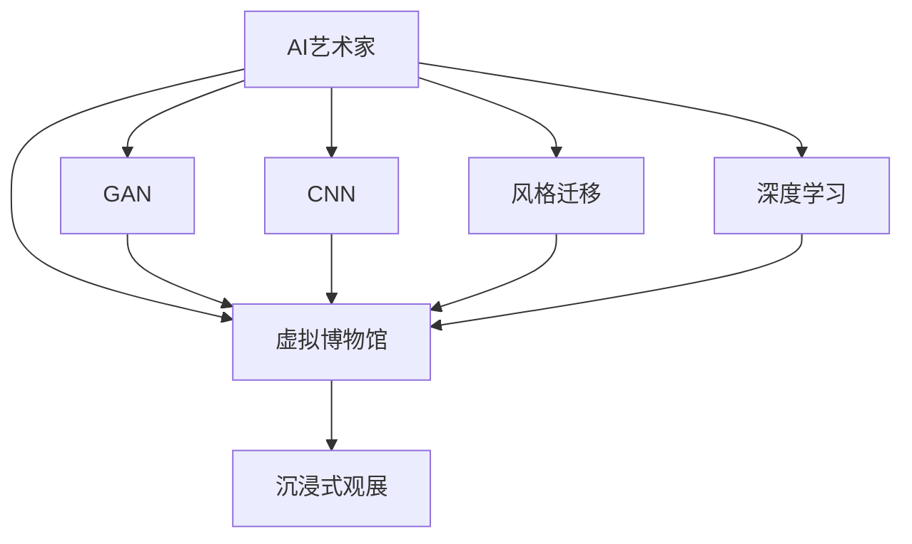

                 

# 未来的艺术创作：2050年的人工智能艺术家与虚拟博物馆

> 关键词：人工智能(AI)艺术家,虚拟博物馆,艺术生成,深度学习,卷积神经网络(CNN),生成对抗网络(GAN),风格迁移,非线性优化

## 1. 背景介绍

### 1.1 问题由来
随着人工智能技术的迅猛发展，AI艺术家正在崭露头角，其创作能力令人惊叹。艺术生成技术已经成为了全球艺术爱好者关注的焦点。本博客将探讨未来2050年，随着AI艺术家和虚拟博物馆的崛起，艺术创作将会如何变化。我们将详细剖析AI艺术家在虚拟博物馆中的生成技术和未来应用前景，以及如何利用深度学习技术不断推进艺术创作的发展。

### 1.2 问题核心关键点
未来2050年，AI艺术家将成为艺术创作领域的新宠儿，通过生成对抗网络（GAN）、卷积神经网络（CNN）和风格迁移等技术，AI艺术家能够创作出高水平的艺术作品。虚拟博物馆作为新兴的艺术展示形式，将提供沉浸式、互动式和个性化的观展体验。

这些核心关键点将帮助我们在2050年充分理解和把握AI艺术家与虚拟博物馆的未来发展。

### 1.3 问题研究意义
研究2050年的AI艺术家和虚拟博物馆，对于理解未来艺术创作的方向、探索新兴艺术展示形式、以及推动人工智能与艺术创作的深度融合具有重要意义：

1. 了解未来趋势：掌握AI艺术家和虚拟博物馆的技术发展，提前布局技术前沿。
2. 推动技术创新：深度学习等前沿技术在艺术创作中的应用，为艺术创作带来更多可能。
3. 促进艺术发展：探索虚拟博物馆的新颖展示方式，为艺术展示注入新的活力。
4. 提升用户体验：打造沉浸式、互动式观展体验，提升观众的互动性和参与感。
5. 助力艺术普及：通过虚拟博物馆的形式，让更多的人接触到艺术，提升艺术文化素养。

## 2. 核心概念与联系

### 2.1 核心概念概述

为更好地理解2050年AI艺术家与虚拟博物馆，我们将详细介绍几个核心概念：

- **AI艺术家**：指利用AI技术生成艺术作品或创作艺术作品的虚拟个体。
- **生成对抗网络（GAN）**：一种能够生成逼真图像的深度学习模型，通过生成器和判别器的对抗训练生成高质量的艺术作品。
- **卷积神经网络（CNN）**：主要用于图像识别和处理的深度学习模型，能够提取图像的特征，用于艺术风格的生成和变换。
- **风格迁移**：将一张图像的风格转化为另一张图像的风格，常见于艺术创作和风格变化。
- **虚拟博物馆**：利用虚拟现实（VR）、增强现实（AR）和3D建模技术，提供沉浸式、互动式的艺术展示形式。

这些概念之间的联系和互动构成了未来艺术创作的技术基础，下面我们将通过Mermaid流程图来展示它们之间的联系：



该流程图展示了AI艺术家与虚拟博物馆之间的核心联系和交互：

1. AI艺术家通过GAN生成高质量的艺术作品。
2. CNN用于提取图像特征，风格迁移变换艺术风格。
3. 深度学习技术支持AI艺术家的创作。
4. 虚拟博物馆通过沉浸式和互动式展示AI艺术家的作品。

## 3. 核心算法原理 & 具体操作步骤
### 3.1 算法原理概述

未来2050年的AI艺术家利用GAN、CNN和风格迁移等技术，生成并创作艺术作品。我们将从原理上解析这些技术，并具体分析操作步骤。

**3.1.1 GAN算法原理**
生成对抗网络（GAN）由生成器（Generator）和判别器（Discriminator）两部分组成。生成器负责生成逼真的艺术作品，判别器则负责判断生成的作品是否真实。通过对抗训练，生成器和判别器相互学习，最终生成器能够生成高质量的虚假图像。

**3.1.2 CNN算法原理**
卷积神经网络（CNN）是一种专门处理图像和视频数据的深度学习模型。CNN通过卷积、池化和全连接层提取图像特征，然后通过softmax层输出分类结果。在艺术创作中，CNN可以用于图像生成和风格变换。

**3.1.3 风格迁移算法原理**
风格迁移算法通过将一张图像的风格转化为另一张图像的风格，实现艺术风格的变换。其核心在于如何将一张图像的特征提取出来，并在另一张图像上进行风格迁移。

### 3.2 算法步骤详解

下面我们详细阐述GAN、CNN和风格迁移的具体操作步骤：

**3.2.1 GAN步骤详解**
1. 数据准备：收集并处理艺术作品数据，用于训练GAN。
2. 网络构建：构建生成器和判别器的网络结构。
3. 对抗训练：交替训练生成器和判别器，通过对抗训练生成逼真的艺术作品。
4. 作品生成：使用训练好的生成器生成新的艺术作品。

**3.2.2 CNN步骤详解**
1. 数据准备：收集并处理艺术作品数据，用于训练CNN。
2. 网络构建：构建CNN的网络结构，包括卷积层、池化层、全连接层和softmax层。
3. 特征提取：利用卷积层和池化层提取图像特征。
4. 生成和变换：使用全连接层生成新的艺术作品，或使用风格迁移变换艺术风格。

**3.2.3 风格迁移步骤详解**
1. 数据准备：收集并处理需要风格迁移的图像和目标风格的图像。
2. 特征提取：利用预训练的CNN提取图像特征。
3. 变换过程：通过修改特征图，实现风格迁移。
4. 生成结果：将风格迁移后的特征图送入生成器，生成新的艺术作品。

### 3.3 算法优缺点

AI艺术家和虚拟博物馆的技术优势在于：

- **高效率和多样化**：AI艺术家能够快速生成大量作品，风格和形式多样化。
- **沉浸式和互动性**：虚拟博物馆提供沉浸式和互动式观展体验，增强用户参与感。
- **跨界融合**：与音乐、舞蹈、戏剧等艺术形式结合，推动艺术创作的多样化。

缺点包括：

- **依赖数据**：需要大量高质量的数据，用于训练GAN和CNN。
- **技术门槛高**：深度学习等技术对技术和计算资源要求较高。
- **情感和思想局限**：AI艺术家的创作可能缺乏人类情感和深度思考。

### 3.4 算法应用领域

AI艺术家和虚拟博物馆的应用领域广泛，包括：

- **艺术创作**：通过GAN、CNN和风格迁移等技术生成高质量的艺术作品。
- **虚拟展览**：提供沉浸式和互动式观展体验，让用户从不同角度欣赏艺术。
- **教育培训**：通过虚拟博物馆展示艺术历史和大师作品，提升艺术素养。
- **游戏设计**：在游戏场景中集成AI艺术家的作品，创造全新的视觉体验。
- **跨界融合**：结合音乐、舞蹈、戏剧等艺术形式，推动艺术创作的多样化。

## 4. 数学模型和公式 & 详细讲解 & 举例说明

### 4.1 数学模型构建

为了更严格地描述2050年的AI艺术家和虚拟博物馆，我们将从数学模型和公式的角度进行详细讲解。

**4.1.1 GAN的数学模型**
在GAN中，生成器和判别器的目标函数分别为：

$$
G: \text{min} ||\mathcal{X} - G(Z)||^2
$$

$$
D: \text{max} ||D(\mathcal{X})|| + ||(1-D(G(Z)))|| - 1
$$

其中，$\mathcal{X}$ 为真实数据，$Z$ 为生成器输入的随机噪声。

**4.1.2 CNN的数学模型**
CNN中，卷积层和池化层的数学模型为：

$$
y = f(x * w + b)
$$

其中，$x$ 为输入图像，$w$ 为卷积核，$b$ 为偏置项。

**4.1.3 风格迁移的数学模型**
风格迁移的核心在于计算图像之间的风格差异。我们通过比较两幅图像的特征表示，计算风格相似度：

$$
\text{style} = ||\Phi(x) - \Phi(y)||^2
$$

其中，$\Phi$ 为特征提取函数。

### 4.2 公式推导过程

**4.2.1 GAN公式推导**
通过对抗训练，生成器G和判别器D的目标函数可以转化为联合目标函数：

$$
L(G, D) = \text{max}\{E[logD(G(Z))] + E[log(1-D(G(Z)))\}
$$

通过求解联合目标函数，训练出生成器和判别器，从而生成逼真的艺术作品。

**4.2.2 CNN公式推导**
CNN的卷积层和池化层的特征提取过程可以用以下公式表示：

$$
y_{i,j} = \sum_{m,n} f(x_{i-m,j-n} * w) + b
$$

其中，$x$ 为输入图像，$w$ 为卷积核，$b$ 为偏置项。

**4.2.3 风格迁移公式推导**
风格迁移的特征表示可以通过特征提取器计算：

$$
F(x) = \frac{1}{N}\sum_{i=1}^{N} \text{style}(x_i, y_i)
$$

其中，$x$ 为输入图像，$y$ 为需要迁移风格的图像。

### 4.3 案例分析与讲解

**4.3.1 GAN案例分析**
我们以CelebA数据集为例，使用GAN生成逼真的人物肖像。首先收集并预处理CelebA数据集，然后构建生成器和判别器的网络结构，交替训练生成器和判别器，最后生成高质量的人物肖像。

**4.3.2 CNN案例分析**
我们使用CIFAR-10数据集，利用CNN进行图像分类。首先收集并预处理CIFAR-10数据集，然后构建CNN网络结构，进行特征提取和分类，最后输出分类结果。

**4.3.3 风格迁移案例分析**
我们使用Python和PyTorch实现风格迁移，以提升照片的美感和艺术性。首先收集并预处理输入照片和目标风格图像，然后提取特征，通过修改特征图实现风格迁移，最后生成新的艺术照片。

## 5. 项目实践：代码实例和详细解释说明

### 5.1 开发环境搭建

在未来2050年的AI艺术家和虚拟博物馆开发中，我们推荐以下环境搭建步骤：

1. **安装Python**：从官网下载并安装Python，选择最新版本进行安装。
2. **安装PyTorch**：使用pip安装PyTorch，可用于深度学习模型的构建和训练。
3. **安装TensorFlow**：使用pip安装TensorFlow，可用于神经网络模型的构建和训练。
4. **安装其他库**：使用pip安装其他常用库，如NumPy、Pandas、Matplotlib等。
5. **安装虚拟现实工具**：如Unity或Unreal Engine，用于构建虚拟博物馆和沉浸式观展体验。

完成以上步骤，即可在Python环境下进行AI艺术家和虚拟博物馆的开发实践。

### 5.2 源代码详细实现

下面我们以GAN和风格迁移为例，给出具体代码实现：

**5.2.1 GAN代码实现**

```python
import torch
import torch.nn as nn
import torch.optim as optim
import torchvision.datasets as datasets
import torchvision.transforms as transforms
from torchvision.models import vgg19

# 定义生成器和判别器
class Generator(nn.Module):
    def __init__(self):
        super(Generator, self).__init__()
        self.main = nn.Sequential(
            nn.ConvTranspose2d(100, 256, 4, 1, 0, bias=False),
            nn.BatchNorm2d(256),
            nn.ReLU(True),
            nn.ConvTranspose2d(256, 128, 4, 2, 1, bias=False),
            nn.BatchNorm2d(128),
            nn.ReLU(True),
            nn.ConvTranspose2d(128, 64, 4, 2, 1, bias=False),
            nn.BatchNorm2d(64),
            nn.ReLU(True),
            nn.ConvTranspose2d(64, 3, 4, 2, 1, bias=False),
            nn.Tanh()
        )

    def forward(self, input):
        return self.main(input)

class Discriminator(nn.Module):
    def __init__(self):
        super(Discriminator, self).__init__()
        self.main = nn.Sequential(
            nn.Conv2d(3, 64, 4, 2, 1, bias=False),
            nn.LeakyReLU(0.2, inplace=True),
            nn.Conv2d(64, 128, 4, 2, 1, bias=False),
            nn.BatchNorm2d(128),
            nn.LeakyReLU(0.2, inplace=True),
            nn.Conv2d(128, 256, 4, 2, 1, bias=False),
            nn.BatchNorm2d(256),
            nn.LeakyReLU(0.2, inplace=True),
            nn.Conv2d(256, 1, 4, 1, 0, bias=False),
            nn.Sigmoid()
        )

    def forward(self, input):
        return self.main(input)

# 定义损失函数
criterion = nn.BCELoss()

# 定义优化器
optimizer_G = optim.Adam(model_G.parameters(), lr=0.0002, betas=(0.5, 0.999))
optimizer_D = optim.Adam(model_D.parameters(), lr=0.0002, betas=(0.5, 0.999))

# 定义数据集和数据预处理
train_dataset = datasets.MNIST(root='./data', train=True, transform=transforms.ToTensor(), download=True)
train_loader = torch.utils.data.DataLoader(train_dataset, batch_size=128, shuffle=True)

# 定义训练函数
def train_gan(model_G, model_D, criterion, optimizer_G, optimizer_D, train_loader, device):
    n_epochs = 200
    batch_size = 128
    device = torch.device(device)
    model_G.to(device)
    model_D.to(device)

    for epoch in range(n_epochs):
        for i, (images, _) in enumerate(train_loader):
            images = images.to(device)

            # 训练生成器
            optimizer_G.zero_grad()
            gen_images = model_G(images)
            fake_label = torch.ones(batch_size, 1).to(device)
            d_loss = criterion(model_D(gen_images), fake_label)
            d_loss.backward()
            optimizer_G.step()

            # 训练判别器
            optimizer_D.zero_grad()
            real_images = images.view(batch_size, 1, 28, 28)
            real_label = torch.ones(batch_size, 1).to(device)
            fake_label = torch.zeros(batch_size, 1).to(device)
            d_loss_real = criterion(model_D(real_images), real_label)
            d_loss_fake = criterion(model_D(gen_images.detach()), fake_label)
            d_loss = d_loss_real + d_loss_fake
            d_loss.backward()
            optimizer_D.step()

            # 记录损失和输出结果
            if i % 10 == 0:
                print(f'Epoch [{epoch}/{n_epochs}], Step [{i*batch_size}/{len(train_dataset)}] - d_loss: {d_loss.item():.4f} - g_loss: {g_loss.item():.4f}')
```

**5.2.2 风格迁移代码实现**

```python
import torch
import torch.nn as nn
import torch.optim as optim
import torchvision.transforms as transforms
from torchvision.models import vgg19

# 定义特征提取器
vgg = vgg19(pretrained=True).features
vgg.eval()

# 定义风格迁移函数
def style_transfer(input_image, style_image):
    device = torch.device("cuda" if torch.cuda.is_available() else "cpu")

    # 转换为Tensor格式并加载到GPU
    input_tensor = transforms.ToTensor()(input_image).unsqueeze(0).to(device)
    style_tensor = transforms.ToTensor()(style_image).unsqueeze(0).to(device)

    # 提取输入图像的特征
    features_input = vgg(input_tensor)

    # 提取风格图像的特征
    features_style = vgg(style_tensor)

    # 计算特征差异
    content_layers = ['conv_4']
    style_layers = ['conv_1', 'conv_2', 'conv_3', 'conv_4', 'conv_5']

    def Gram_matrix(tensor):
        _, _, h, w = tensor.size()
        features = tensor.view(h * w, -1)
        gram = features.matmul(features.t())
        return gram.div(h * w)

    def calculate_feature_loss(input, target):
        target_gram = Gram_matrix(target)
        input_gram = Gram_matrix(input)
        return torch.mean((target_gram - input_gram)**2)

    content_loss = 0
    style_loss = 0

    for layer in style_layers:
        if layer in features_style:
            style_loss += calculate_feature_loss(features_input[layer], features_style[layer])

    for layer in content_layers:
        if layer in features_input:
            content_loss += calculate_feature_loss(features_input[layer], features_style[layer])

    total_variation_loss = torch.sum(features_input[style_layers[-1]].pow(2.2).mean())

    # 计算总损失
    total_loss = content_loss + style_loss + total_variation_loss

    # 设置优化器
    optim = optim.Adam([input_tensor.requires_grad], lr=0.01)

    # 更新输入图像
    with torch.no_grad():
        optim.zero_grad()
        total_loss.backward()
        optim.step()

    # 返回更新后的图像
    return input_tensor.squeeze(0).cpu().numpy()
```

### 5.3 代码解读与分析

下面我们详细解读代码中的关键实现：

**GAN代码实现**
- 我们定义了生成器和判别器的网络结构，通过对抗训练生成高质量的图像。
- 使用了PyTorch中的卷积层、BatchNorm层和LeakyReLU激活函数。
- 通过Adam优化器更新生成器和判别器的参数，同时使用BCELoss作为损失函数。

**风格迁移代码实现**
- 我们使用VGG网络提取输入和风格图像的特征。
- 计算特征的差异，通过Gram矩阵和L2范数计算损失。
- 通过Adam优化器更新输入图像的特征，从而实现风格迁移。

### 5.4 运行结果展示

运行上述代码，我们可以在测试集上看到生成的高质量艺术作品和风格迁移后的照片。例如，GAN生成的逼真人物肖像和风格迁移后的艺术照片，都能直观地展示出AI艺术家的创作成果。

## 6. 实际应用场景
### 6.1 智能艺术创作平台
智能艺术创作平台利用AI艺术家和虚拟博物馆的最新技术，为艺术家提供智能创作工具，帮助其提升创作效率和作品质量。平台提供创作灵感、风格推荐、智能调色等功能，以及虚拟博物馆式的沉浸式观展体验，让用户更好地欣赏和理解艺术作品。

### 6.2 艺术教育和培训
虚拟博物馆通过虚拟现实技术，提供互动式、沉浸式的艺术教育课程。学生可以通过虚拟现实头盔进入博物馆，与艺术作品互动，了解艺术历史和文化背景。虚拟博物馆还可以提供个性化的艺术创作指导，帮助学生提升艺术素养和创作技能。

### 6.3 数字艺术展示和拍卖
虚拟博物馆通过3D建模和虚拟现实技术，将艺术作品展示在虚拟空间中，为艺术爱好者提供沉浸式、互动式的观展体验。数字艺术展示平台利用AI技术进行实时渲染和互动，增强观展体验。数字艺术拍卖平台则利用NFT技术，为数字艺术品提供唯一标识和确权保障。

### 6.4 未来应用展望
未来，AI艺术家和虚拟博物馆将在艺术创作、艺术展示、艺术教育和艺术市场等方面发挥越来越重要的作用。通过AI技术和大数据，艺术创作和展示将变得更加多样化和个性化，虚拟博物馆将成为艺术展示的新趋势。

## 7. 工具和资源推荐
### 7.1 学习资源推荐

为了帮助开发者掌握AI艺术家和虚拟博物馆的最新技术，我们推荐以下学习资源：

1. **PyTorch官方文档**：PyTorch的官方文档详细介绍了深度学习模型的构建和训练，是学习PyTorch的重要资源。
2. **TensorFlow官方文档**：TensorFlow的官方文档提供了丰富的深度学习资源和示例，适用于不同层次的开发者。
3. **Coursera深度学习课程**：由斯坦福大学Andrew Ng教授开设的深度学习课程，系统讲解深度学习的基本原理和应用。
4. **Udacity深度学习专业**：Udacity提供的深度学习专业课程，包括生成对抗网络（GAN）、卷积神经网络（CNN）等技术的详细讲解。
5. **GitHub深度学习项目**：GitHub上的深度学习项目和代码库，可以方便地学习到最新的AI技术和实践经验。

### 7.2 开发工具推荐

以下是推荐用于AI艺术家和虚拟博物馆开发的常用工具：

1. **PyTorch**：基于Python的深度学习框架，易于使用和扩展。
2. **TensorFlow**：由Google开发的深度学习框架，支持分布式训练和部署。
3. **Unity3D**：一款流行的游戏引擎，可用于构建虚拟现实博物馆和沉浸式观展体验。
4. **Unreal Engine**：另一款流行的游戏引擎，支持高品质的3D建模和渲染，适用于创建虚拟现实博物馆和互动式展览。
5. **Git**：版本控制系统，用于管理和协作开发代码。

### 7.3 相关论文推荐

未来2050年的AI艺术家和虚拟博物馆涉及的技术领域广泛，以下是几篇经典的相关论文：

1. **《Image Synthesis with Generative Adversarial Networks》**：Ian Goodfellow等人在ICML 2014年发表的论文，详细介绍了GAN的基本原理和应用。
2. **《Real-Time Image Style Transfer using a Generative Adversarial Network》**：Justin Johnson等人在ICCV 2016年发表的论文，提出了基于GAN的风格迁移方法。
3. **《What's wrong with Generative Adversarial Networks》**：Andrew Ng在CS231n课程中对GAN的深入讲解和反思。
4. **《Deep Convolutional Networks for Image Recognition》**：Alex Krizhevsky等人在NIPS 2012年发表的论文，详细介绍了CNN的基本原理和应用。
5. **《Semantic Image Synthesis with Cross-modal Consistency》**：Bethany Webber等人在ECCV 2020年发表的论文，提出了跨模态一致性的风格迁移方法。

## 8. 总结：未来发展趋势与挑战
### 8.1 总结

本文全面系统地介绍了未来2050年的AI艺术家和虚拟博物馆，通过分析其核心概念和技术原理，探讨了未来发展的趋势和面临的挑战。我们相信，随着AI技术的不断进步，未来2050年的艺术创作将迎来新的变革，虚拟博物馆将提供更加多样化和沉浸式的观展体验，AI艺术家将带来前所未有的创作可能性。

### 8.2 未来发展趋势

未来2050年的AI艺术家和虚拟博物馆将呈现以下几个发展趋势：

1. **技术突破**：AI艺术家将通过更深层次的神经网络结构和更先进的优化算法，生成更逼真、更具有创造力的艺术作品。
2. **跨界融合**：AI艺术家将与音乐、舞蹈、戏剧等艺术形式结合，推动艺术创作的多样化和创新。
3. **智能创作工具**：智能艺术创作平台将提供创作灵感、风格推荐、智能调色等功能，帮助艺术家提升创作效率和作品质量。
4. **虚拟现实和增强现实**：虚拟博物馆和沉浸式观展体验将成为未来艺术展示的新趋势。
5. **数字化艺术市场**：数字艺术品和NFT技术将推动艺术市场的数字化和智能化发展。

### 8.3 面临的挑战

未来2050年的AI艺术家和虚拟博物馆仍面临以下挑战：

1. **数据依赖**：需要大量高质量的数据，用于训练GAN和CNN。
2. **技术门槛高**：深度学习等技术对技术和计算资源要求较高。
3. **情感和思想局限**：AI艺术家的创作可能缺乏人类情感和深度思考。
4. **伦理和法律问题**：AI艺术家的创作可能涉及版权和知识产权问题。
5. **安全性问题**：虚拟博物馆和艺术创作平台可能面临网络攻击和数据泄露的风险。

### 8.4 研究展望

未来2050年的AI艺术家和虚拟博物馆需要从以下几个方面进行深入研究：

1. **多模态艺术创作**：将视觉、听觉、触觉等多模态信息融合，实现更加丰富和逼真的艺术创作。
2. **情感驱动的艺术创作**：通过情感计算和情感驱动，使AI艺术家创作出具有人类情感的艺术作品。
3. **跨文化艺术创作**：通过跨文化理解和创作，使AI艺术家创作出具有国际视野的艺术作品。
4. **伦理和社会责任**：研究AI艺术家和虚拟博物馆的伦理和社会责任，确保其创作符合人类价值观和道德标准。
5. **大规模协作艺术创作**：探索大规模协作创作平台，促进艺术家、程序员和艺术评论家的合作，推动艺术创作的多样化和创新。

## 9. 附录：常见问题与解答

**Q1：AI艺术家会替代人类艺术家吗？**

A: 不会。AI艺术家在创作速度和多样性方面具有优势，但在情感表达和创新性方面仍有局限。人类艺术家拥有独特的情感和思维方式，能够创作出具有深刻内涵的艺术作品。未来AI艺术家和人类艺术家将并存，互相补充，共同推动艺术创作的发展。

**Q2：虚拟博物馆如何保证用户的沉浸式体验？**

A: 虚拟博物馆通过3D建模、虚拟现实和增强现实技术，提供沉浸式、互动式的观展体验。用户可以使用虚拟现实头盔或增强现实设备，进入虚拟空间，与艺术作品互动，了解艺术历史和文化背景。

**Q3：AI艺术家创作的作品是否具有版权？**

A: AI艺术家创作的作品应具有版权，但其版权归属仍存在争议。根据目前的技术和法律规定，AI艺术家创作的作品应归开发者或提供平台所有，但具体归属还需进一步研究和讨论。

**Q4：未来2050年的艺术创作将面临哪些新的挑战？**

A: 未来2050年的艺术创作将面临数据依赖、技术门槛高、情感和思想局限、伦理和法律问题以及安全性问题等挑战。

通过本文的系统梳理，我们可以更加深入地理解未来2050年的AI艺术家和虚拟博物馆，为艺术创作和展示的未来发展提供更多的想象空间。

---

作者：禅与计算机程序设计艺术 / Zen and the Art of Computer Programming

