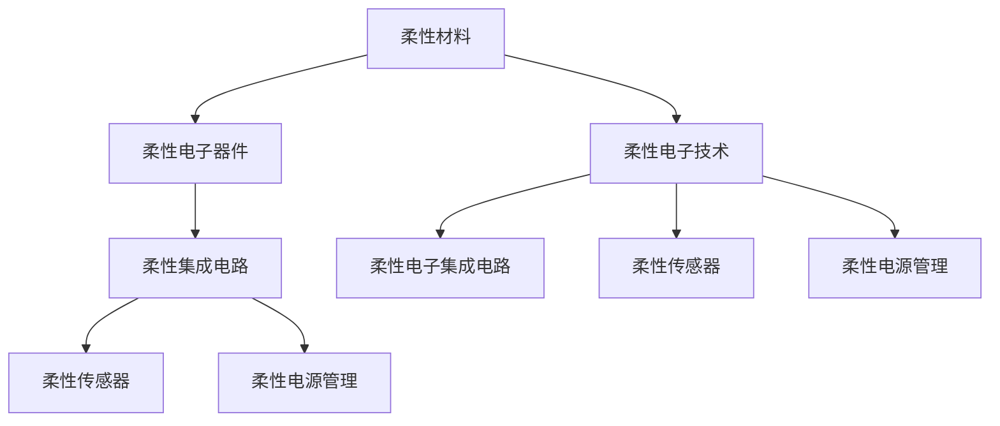

                 

# 柔性电子技术：可弯曲和可穿戴的电子设备

柔性电子技术（Flexible Electronics）代表了电子设备未来的发展方向，它通过柔性材料和集成电路技术，实现了电子设备的弯曲和可穿戴特性，为新兴应用场景带来了无限可能。本文将从背景介绍、核心概念、算法原理、项目实践、应用场景等多个维度，深入解析柔性电子技术的核心原理与应用实践，为行业从业者提供全面的技术指引。

## 1. 背景介绍

### 1.1 问题由来

随着人们对便携性和交互式体验的不断追求，传统的刚性电子设备逐渐无法满足需求。可弯曲和可穿戴的柔性电子设备应运而生，能够无缝集成到衣物、人体等柔性材料中，为新一代智能穿戴设备、健康监测、人机交互等领域提供了全新的解决方案。

柔性电子技术主要解决的问题包括：
- 增强设备的便携性和舒适性，使设备能长时间佩戴，提升用户的使用体验。
- 拓展设备的互动范围，实现与人体的无缝交互，甚至与生物体系相融合。
- 促进多模态数据的融合，提升智能设备的功能和实用性，如健康监测、智能纺织品等。

### 1.2 问题核心关键点

柔性电子技术的核心关键点主要包括以下几个方面：

- **柔性材料的选择与应用**：柔性材料如聚酰亚胺、聚对苯二甲酸乙二醇酯（PET）、聚二甲基硅氧烷（PDMS）等，是柔性电子器件制备的基础。
- **集成电路技术**：柔性基底材料上的集成电路设计、制造工艺，是实现电子功能的重要手段。
- **传感器与执行器**：柔性传感器和执行器，用于捕捉环境信息、驱动设备动作等。
- **柔性电源管理**：柔性电池、柔性储能器等，保障设备的持久供电。

这些关键点相互配合，实现了柔性电子设备的软硬件一体化，带来了颠覆性变革。

## 2. 核心概念与联系

### 2.1 核心概念概述

为更好地理解柔性电子技术，本节将介绍几个密切相关的核心概念：

- **柔性电子器件(Flexible Electronics)**：基于柔性材料制作的电子器件，具备弯曲、折叠等柔性特征。常见的柔性电子器件包括柔性显示屏、柔性传感器、柔性电池等。
- **柔性电子技术(Flexible Electronics Technology)**：通过柔性材料和集成电路技术，实现柔性电子器件的制备与应用。包括材料选择、电路设计、器件封装等多个环节。
- **柔性电子集成电路(Flexible Electronics Integrated Circuit)**：在柔性基底上集成电路设计、制造和封装，是实现柔性电子功能的基础。
- **柔性传感器(Flexible Sensor)**：利用柔性材料制造的传感器，具备柔韧性和高灵敏度，常用于健康监测、环境感知等领域。
- **柔性电源管理(Flexible Power Management)**：柔性电池、柔性储能器等，为柔性电子设备提供持久、可靠的能源支持。

这些核心概念共同构成了柔性电子技术的完整框架，展示了其柔韧、便携、多功能的特点。

### 2.2 核心概念原理和架构的 Mermaid 流程图



这个流程图展示了柔性电子技术各组成部分之间的联系：

1. 柔性材料通过柔性电子器件的制备，实现了电子设备的柔韧化。
2. 柔性集成电路是柔性电子器件的核心功能层，提供必要的逻辑和信号处理。
3. 柔性传感器用于环境感知，柔性电源管理保障设备持久供电。

这些环节相互配合，共同推动了柔性电子技术的发展。

## 3. 核心算法原理 & 具体操作步骤

### 3.1 算法原理概述

柔性电子技术的应用涉及材料科学、电子工程、机械工程等多个领域，其核心原理可从以下几个方面进行理解：

- **柔性材料**：主要包括聚合物基复合材料、无机基复合材料等。聚合物如聚酰亚胺（PI）、聚对苯二甲酸乙二醇酯（PET）、聚二甲基硅氧烷（PDMS）等，通过化学、物理手段实现拉伸、弯曲等柔性特性。
- **柔性集成电路**：基于柔性基底材料（如聚酰亚胺、PET等）进行电路设计、制造、封装。常见工艺包括光刻、蒸镀、溅射、化学气相沉积（CVD）等。
- **柔性传感器**：利用柔性材料和集成电路技术，制备高灵敏度、宽频响应的传感器。如压电传感器、柔性应变片等。
- **柔性电源管理**：柔性电池如柔性锂电池、柔性太阳能电池等，柔性储能器如超级电容器等。

### 3.2 算法步骤详解

柔性电子技术的实现步骤大致包括以下几个关键环节：

**Step 1: 材料选择与预处理**
- 根据应用场景选择合适的柔性材料，并进行表面清洁、蚀刻等预处理。
- 利用化学气相沉积、涂覆等手段，在柔性材料表面沉积导电层或敏感层。

**Step 2: 电路设计**
- 在柔性材料上设计电路，利用E-DA、PSpice等软件进行电路仿真和布局。
- 确定电路元件（如晶体管、电阻、电容等）的尺寸、位置等参数。

**Step 3: 制造与封装**
- 利用光刻、蒸镀、溅射等工艺，在柔性材料上制备电路元件。
- 对电路进行封装，保护其免受外界损伤，提高机械强度和耐久性。

**Step 4: 集成与测试**
- 将柔性电子器件与其他部件集成，形成完整的柔性电子设备。
- 进行功能测试和可靠性测试，确保设备性能满足要求。

**Step 5: 应用与优化**
- 根据实际应用需求，优化柔性电子器件的尺寸、材料等参数。
- 不断迭代实验，提升设备性能和用户体验。

### 3.3 算法优缺点

柔性电子技术具有以下优点：
- **便携性和舒适性**：柔性材料使设备可以贴合人体曲面，佩戴舒适。
- **多功能性**：柔性电子器件可以集成多种功能，如显示、传感、能源供应等。
- **灵活性**：可以根据不同需求，设计和制造不同尺寸、形状的产品。

但同时也存在一些缺点：
- **加工难度大**：柔性材料和电路集成工艺复杂，生产成本较高。
- **性能限制**：柔性器件的机械性能和电子性能与传统刚性器件相比存在差距，如响应速度、稳定性和可靠性。
- **能源管理挑战**：柔性电池的体积和容量限制，使得设备续航能力成为瓶颈。

### 3.4 算法应用领域

柔性电子技术广泛应用于以下几个领域：

- **健康监测**：柔性电子设备可用于心率监测、血压测量、血糖监测等，为用户提供实时健康数据。
- **智能纺织品**：将柔性传感器集成到衣物中，实现温度感应、运动监测等功能。
- **可穿戴设备**：如柔性屏幕手表、柔性柔性显示面板等，实现信息交互、娱乐等功能。
- **智能家居**：将柔性电子器件嵌入家居用品，如窗帘、床上用品等，实现自动化控制。
- **柔性电子产品**：如柔性显示器、柔性照明设备、柔性电子书籍等，提供多样化的用户交互体验。

## 4. 数学模型和公式 & 详细讲解 & 举例说明

### 4.1 数学模型构建

柔性电子技术中涉及到多个领域的数学模型，这里主要介绍柔性材料和柔性电子器件的数学建模。

#### 4.1.1 柔性材料应力-应变模型
柔性材料在外力作用下，其应力-应变关系可通过胡克定律进行描述。假设材料为线性弹性材料，则有：

$$ \sigma = E \epsilon $$

其中，$\sigma$为应力，$\epsilon$为应变，$E$为材料的杨氏模量。

#### 4.1.2 柔性电子器件电路模型
柔性电子器件的电路模型可以采用基于阶跃响应的方法，假设电路元件的响应时间为$t$，输出电压为$V_{out}$，输入电压为$V_{in}$，则有：

$$ V_{out}(t) = V_{in} + \int_0^t g(t-\tau) d\tau $$

其中，$g(t)$为电路元件的响应函数。

### 4.2 公式推导过程

柔性材料和柔性电子器件的数学模型推导涉及弹性力学和电路理论，以下是部分推导过程：

**柔性材料的应力-应变推导**：
- 假设材料为各向同性材料，则有应力-应变关系：$\sigma = E \epsilon$。
- 通过实验测量得到材料的杨氏模量$E$，代入公式得到应力-应变关系。

**柔性电子器件电路推导**：
- 假设电路元件为理想元件，其响应函数$g(t)$为阶跃函数。
- 根据电路的拓扑结构和元件参数，计算出输出电压$V_{out}$的表达式。

### 4.3 案例分析与讲解

**案例1：柔性传感器的应力-应变分析**
假设有一个柔性应变片，长度为$L$，宽度为$W$，材料为PET，杨氏模量为$E$，厚度为$h$。假设在应变力作用下，材料发生均匀变形，则有：

$$ \epsilon = \frac{\Delta L}{L} = \frac{\Delta W}{W} $$

根据胡克定律，计算出应力-应变关系，并绘制应力-应变曲线。

**案例2：柔性显示器的电路仿真**
假设有一个柔性显示面板，包含多个LED发光元件。每个元件的响应时间为$t$，输出电压为$V_{out}$，输入电压为$V_{in}$。根据电路模型，计算出每个元件的响应函数$g(t)$，并仿真电路的响应。

## 5. 项目实践：代码实例和详细解释说明

### 5.1 开发环境搭建

在进行柔性电子技术项目实践前，我们需要准备好开发环境。以下是使用Python进行柔性电子技术开发的常用环境配置流程：

1. 安装Python：Python是一种通用编程语言，可以用于柔性电子器件的电路仿真、材料分析等。
2. 安装相关库：安装PyEphem、PkgInfo、SciPy等Python库，用于柔性材料和电路的建模与分析。

### 5.2 源代码详细实现

这里我们以柔性应变片为例，给出使用Python进行电路仿真的代码实现。

```python
import numpy as np
from scipy.integrate import odeint

# 定义应变片的材料参数
E = 1.5e6  # 杨氏模量，单位 Pa
h = 0.01  # 厚度，单位 m

# 定义应变片的电路参数
C = 1e-12  # 电容，单位 F
R = 1e4    # 电阻，单位 ohm

# 定义应变片的应力-应变关系
def stress_strain(epsilon):
    return E * epsilon

# 定义应变片的电路方程
def circuit_equation(t, y):
    v_in = y[0]  # 输入电压
    v_out = y[1]  # 输出电压
    return [v_in - R * v_out, (v_out / C) - stress_strain(v_out)]

# 模拟应变片在恒定应力下的输出电压
epsilon = 0.001  # 应变量，单位 m
tspan = np.linspace(0, 1, 1000)  # 时间范围
y0 = [0, 0]  # 初始条件

# 求解电路方程
solution = odeint(circuit_equation, y0, tspan)

# 绘制应力-应变曲线和输出电压-时间曲线
import matplotlib.pyplot as plt

plt.plot(tspan, solution[:, 1], label='Output Voltage')
plt.xlabel('Time (s)')
plt.ylabel('Output Voltage (V)')
plt.legend()
plt.show()
```

这段代码实现了对柔性应变片的电路仿真，根据应力-应变关系计算输出电压，并绘制输出电压随时间的变化曲线。

### 5.3 代码解读与分析

**代码解析**：
- 首先定义了应变片的材料参数和电路参数。
- 定义了应力-应变关系函数，用于计算应变片的应力。
- 定义了电路方程，描述应变片的输入输出关系。
- 利用ODE求解器求解电路方程，得到输出电压随时间的变化。
- 绘制输出电压随时间的变化曲线，展示了应变片的动态响应。

**分析解读**：
- 应变片的应力-应变关系体现了材料的弹性特性。
- 电路方程描述了应变片的动态行为，通过求解电路方程，可以得到输出电压随时间的变化。
- 输出电压-时间曲线展示了应变片在恒定应力下的动态响应，可以帮助理解应变片的电路行为。

## 6. 实际应用场景

### 6.1 健康监测

柔性电子技术在健康监测领域有着广泛的应用。例如，柔性应变片和柔性传感器可以嵌入衣物中，实时监测人体心率和血压等生理指标。柔性电子皮肤可用来检测皮肤温度、汗液成分等，用于汗液分析、皮肤健康监测等。这些设备可以持续佩戴，提供全天候的健康数据监测。

### 6.2 智能纺织品

柔性电子技术可以应用于智能纺织品，将柔性传感器和柔性显示面板集成到衣物中。例如，智能连衣裙可以实现运动监测、环境感知等功能，提升用户体验。柔性电子设备的柔韧性和便携性，使其在服装、鞋帽等穿戴设备上得到了广泛应用。

### 6.3 智能家居

柔性电子技术可以应用于智能家居，例如将柔性显示屏和柔性传感器嵌入窗帘、床上用品等家居用品中，实现自动化控制和环境监测。例如，柔性显示屏可以显示天气预报、家居控制等信息，方便用户实时了解家居环境。

### 6.4 未来应用展望

未来，柔性电子技术将在更多领域得到应用，为新兴应用场景带来变革性影响。例如：

- **柔性电子医疗**：柔性电子设备在医疗领域的应用将更加广泛，用于手术辅助、康复监测、远程医疗等。
- **柔性电子交通**：柔性电子器件可用于车辆内饰、车身覆盖材料等，提升车辆的安全性和舒适性。
- **柔性电子建筑**：柔性电子器件可用于建筑外墙、窗帘等，实现智能化家居环境。
- **柔性电子能源**：柔性电池和柔性储能器等，为可穿戴设备和智能家居提供持久、可靠的能源支持。

## 7. 工具和资源推荐

### 7.1 学习资源推荐

为了帮助开发者系统掌握柔性电子技术，这里推荐一些优质的学习资源：

1. **《柔性电子器件设计与应用》**：介绍柔性电子器件的制备、性能测试、应用案例等。
2. **柔性电子技术在线课程**：如Coursera、Udacity等平台上的柔性电子技术课程。
3. **柔性电子技术书籍**：如《柔性电子器件》、《柔性电子技术》等。

通过对这些资源的学习实践，相信你一定能够快速掌握柔性电子技术的精髓，并用于解决实际的柔性电子器件开发问题。

### 7.2 开发工具推荐

柔性电子技术开发涉及柔性材料制备、电路设计、模拟仿真等多个环节，以下是几款常用的开发工具：

1. **PyEphem**：用于柔性材料和电路的建模与分析。
2. **SciPy**：用于科学计算和数据分析，提供了丰富的算法和工具。
3. **Ansys Multiphysics**：用于仿真柔性材料和电路的力学、电学行为。
4. **SolidWorks**：用于柔性器件的3D设计和分析。
5. **LabVIEW**：用于柔性电子设备的开发和测试。

合理利用这些工具，可以显著提升柔性电子器件的开发效率，加快创新迭代的步伐。

### 7.3 相关论文推荐

柔性电子技术的发展源于学界的持续研究。以下是几篇奠基性的相关论文，推荐阅读：

1. **《柔性电子器件制备与应用》**：介绍柔性电子器件的制备、性能测试、应用案例等。
2. **《柔性电子技术进展》**：综述柔性电子技术的最新研究进展和应用趋势。
3. **《柔性电子器件设计》**：介绍柔性电子器件的设计原则和制造工艺。

这些论文代表了大规模柔性电子技术的研究方向，通过学习这些前沿成果，可以帮助研究者把握学科前进方向，激发更多的创新灵感。

## 8. 总结：未来发展趋势与挑战

### 8.1 研究成果总结

柔性电子技术的研究成果已经覆盖了多个领域，如健康监测、智能纺织品、智能家居等。通过不断的技术创新和应用探索，柔性电子设备已经从概念走向了实际应用，成为下一代电子产品的代表。

### 8.2 未来发展趋势

未来柔性电子技术的发展趋势主要包括以下几个方面：

1. **柔性材料的多样化**：新型柔性材料的应用将带来更广泛的柔性电子器件，如透明柔性显示、可穿戴设备等。
2. **柔性电路的智能化**：柔性电路的集成和智能化将带来更高效、更灵活的柔性电子设备，如智能织物、柔性传感器等。
3. **柔性电子器件的小型化和微型化**：柔性电子器件的小型化和微型化将使其更易于集成到多种应用场景中。
4. **柔性电子设备的绿色化**：柔性电子设备的绿色制造、节能环保等将得到更多关注和研究。

### 8.3 面临的挑战

柔性电子技术在发展过程中也面临一些挑战：

1. **材料性能的提升**：柔性材料的力学性能、电学性能、生物相容性等方面仍有待提升。
2. **制造工艺的复杂性**：柔性电子器件的制造工艺复杂，成本较高。
3. **功能与性能的平衡**：如何在柔性器件的柔韧性和性能之间取得平衡，是柔性电子技术面临的重大挑战。
4. **安全性与可靠性**：柔性电子器件的安全性、可靠性需要进一步保障，避免对人体健康造成不良影响。

### 8.4 研究展望

未来的研究应在以下几个方面寻求新的突破：

1. **材料科学的研究**：开发新型柔性材料，提升其力学性能、电学性能、生物相容性等。
2. **柔性电路设计**：优化柔性电路的布局和设计，提高柔性电路的稳定性和可靠性。
3. **柔性电子器件的小型化**：研究柔性电子器件的小型化、微型化技术，使其更易集成到多种应用场景中。
4. **柔性电子设备的智能化**：研究柔性电子设备的智能化和功能化，提升设备的实用性和用户体验。
5. **柔性电子器件的绿色化**：研究柔性电子器件的绿色制造、节能环保等，推动可持续发展。

总之，柔性电子技术的发展前景广阔，未来的研究将在材料科学、电子工程、机械工程等多个领域持续推进，为人类生活和社会进步带来新的变革。

## 9. 附录：常见问题与解答

### Q1：柔性电子器件制备的难点是什么？

A: 柔性电子器件制备的难点主要包括：
- 柔性材料的选取和处理：不同柔性材料具有不同的力学和电学特性，需要根据应用场景进行选择和处理。
- 柔性电路的制备工艺：柔性电路的制备涉及光刻、蒸镀、溅射、化学气相沉积等工艺，技术复杂，成本较高。
- 柔性器件的封装和保护：柔性器件需要封装以保护其免受外界损伤，封装工艺的复杂性增加了制备难度。

### Q2：柔性电子器件的应用场景有哪些？

A: 柔性电子器件的应用场景广泛，主要包括以下几个方面：
- 健康监测：柔性应变片和柔性传感器可以嵌入衣物中，实时监测人体心率和血压等生理指标。
- 智能纺织品：将柔性传感器和柔性显示面板集成到衣物中，实现运动监测、环境感知等功能。
- 智能家居：将柔性显示屏和柔性传感器嵌入窗帘、床上用品等家居用品中，实现自动化控制和环境监测。
- 柔性电子医疗：柔性电子设备在医疗领域的应用将更加广泛，用于手术辅助、康复监测、远程医疗等。
- 柔性电子交通：柔性电子器件可用于车辆内饰、车身覆盖材料等，提升车辆的安全性和舒适性。

### Q3：柔性电子器件的电路设计和仿真方法有哪些？

A: 柔性电子器件的电路设计和仿真方法主要包括：
- 电路设计：利用E-DA、PSpice等软件进行电路仿真和布局。
- 电路仿真：利用ODE求解器求解电路方程，得到输出电压随时间的变化。
- 电路优化：通过电路优化，提高柔性电子器件的性能和可靠性。

### Q4：柔性电子器件在制造和封装过程中需要注意哪些问题？

A: 柔性电子器件在制造和封装过程中需要注意以下问题：
- 材料的选择和处理：根据应用场景选择合适的柔性材料，并进行表面清洁、蚀刻等预处理。
- 电路的设计和制造：利用光刻、蒸镀、溅射、化学气相沉积等工艺，在柔性材料上制备电路元件。
- 器件的封装和保护：对柔性电子器件进行封装，保护其免受外界损伤，提高机械强度和耐久性。

### Q5：柔性电子器件的未来发展方向有哪些？

A: 柔性电子器件的未来发展方向主要包括以下几个方面：
- 柔性材料的多样化：新型柔性材料的应用将带来更广泛的柔性电子器件，如透明柔性显示、可穿戴设备等。
- 柔性电路的智能化：柔性电路的集成和智能化将带来更高效、更灵活的柔性电子设备，如智能织物、柔性传感器等。
- 柔性电子器件的小型化：柔性电子器件的小型化和微型化将使其更易于集成到多种应用场景中。
- 柔性电子设备的绿色化：柔性电子设备的绿色制造、节能环保等将得到更多关注和研究。

总之，柔性电子技术在不断创新中不断进步，未来将带来更多应用场景的变革性影响。

