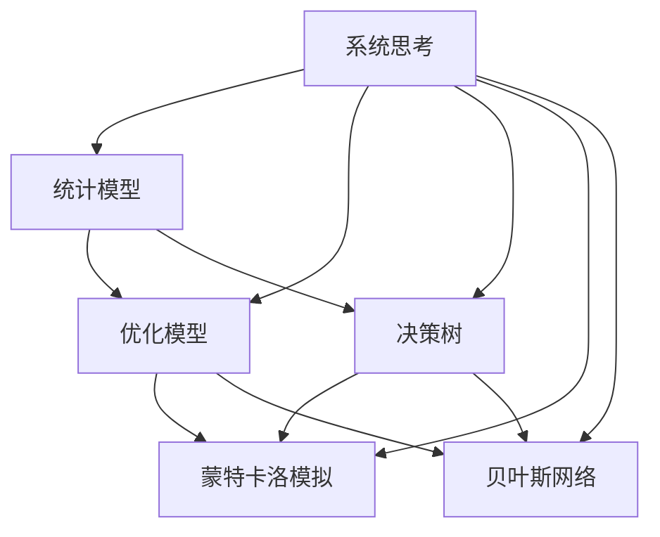

                 

# 模型思维在管理培训中的运用

> 关键词：模型思维,管理培训,模型决策,业务决策,系统思考

## 1. 背景介绍

### 1.1 问题由来
在当今快速变化的商业环境中，决策效率和质量成为企业竞争力的关键。然而，传统的基于经验和直觉的决策方式已不再适用。模型思维作为一种系统化的决策方式，能够在复杂不确定环境中提供科学依据，提高决策的准确性和可靠性。本文将探讨模型思维在管理培训中的应用，通过具体的案例和步骤，帮助管理者掌握模型思维的工具和方法。

### 1.2 问题核心关键点
模型思维的本质在于利用数学和统计方法对现实问题进行建模，通过数据驱动的决策制定，提升决策质量。其核心要素包括：
- 系统性：从全局视角看待问题，识别关键变量和影响因素。
- 数据驱动：基于真实数据，通过模型进行预测和推断。
- 可验证性：模型结果可复现、可验证，能够应对不同情境。

本文旨在通过介绍模型思维的核心概念和具体应用，帮助管理者提升数据素养，掌握模型思维工具，从而在复杂管理场景中做出更加科学的决策。

## 2. 核心概念与联系

### 2.1 核心概念概述

模型思维涉及多个核心概念，如下：

- **系统思考(System Thinking)**：从整体和全局的视角分析问题，识别系统中的因果关系和反馈机制。
- **统计模型(Statistical Modeling)**：基于数据建立模型，通过对数据进行统计分析，预测未来趋势和结果。
- **优化模型(Optimization Modeling)**：通过数学模型求解最优解，应用于资源配置、成本控制等场景。
- **决策树(Decision Tree Modeling)**：利用树形结构进行决策分析，可视化展示决策路径和结果。
- **蒙特卡洛模拟(Monte Carlo Simulation)**：通过随机抽样方法模拟系统行为，评估决策风险和不确定性。
- **贝叶斯网络(Bayesian Network Modeling)**：通过贝叶斯定理构建概率模型，预测事件发生的概率。

这些概念之间相互联系，共同构成了模型思维的框架。如下图所示，展示了模型思维的各个概念及其联系：



通过系统思考，识别影响决策的关键因素，使用统计模型对数据进行建模，运用优化模型寻找最优解，结合决策树进行可视化展示，最后使用蒙特卡洛模拟和贝叶斯网络评估不确定性，形成完整的决策支持系统。

### 2.2 核心概念原理和架构的 Mermaid 流程图

以下是一个简单的决策模型流程图示例：


此流程图展示了从数据收集、清洗、特征工程、模型构建、验证、部署到监控和迭代的决策支持过程。每个环节都可能使用到不同的模型思维方法。

## 3. 核心算法原理 & 具体操作步骤

### 3.1 算法原理概述

模型思维的算法原理可以概括为以下步骤：

1. **问题定义**：明确决策目标和影响因素。
2. **数据准备**：收集和清洗数据，保证数据质量。
3. **模型构建**：选择合适的模型，进行参数估计和优化。
4. **模型验证**：通过测试数据集评估模型性能。
5. **决策应用**：将模型应用于实际问题，优化决策过程。
6. **模型监控**：持续监控模型表现，进行模型迭代和更新。

模型思维的核心在于通过数据和算法构建一个完整的决策支持系统，提高决策的科学性和准确性。

### 3.2 算法步骤详解

**Step 1: 问题定义**
- 明确决策目标：如投资回报率最大化、市场份额提升等。
- 识别关键变量：如市场规模、成本、竞争对手策略等。

**Step 2: 数据准备**
- 收集数据：从市场调研、客户反馈、财务报表等渠道获取数据。
- 数据清洗：处理缺失值、异常值，确保数据准确性。
- 特征工程：选择和构建关键特征，提升模型性能。

**Step 3: 模型构建**
- 选择模型：根据问题特点选择合适的统计模型（如回归、分类、聚类等）。
- 参数估计：使用历史数据估计模型参数。
- 模型优化：通过训练数据优化模型，避免过拟合和欠拟合。

**Step 4: 模型验证**
- 划分数据集：将数据分为训练集和测试集。
- 评估性能：使用测试集评估模型预测性能，计算准确率、召回率、F1分数等指标。

**Step 5: 决策应用**
- 制定策略：结合模型结果和业务知识，制定决策策略。
- 模拟推断：使用蒙特卡洛模拟或贝叶斯网络，评估决策风险和不确定性。

**Step 6: 模型监控**
- 持续跟踪：监控模型在实际应用中的表现。
- 迭代更新：根据新数据和新情况，持续更新模型，保持模型有效性。

### 3.3 算法优缺点

模型思维具有以下优点：

- 数据驱动：模型思维能够基于数据进行决策，避免主观偏见。
- 可验证性：模型结果可复现，便于验证和优化。
- 科学性：模型思维提供系统化的分析框架，提高决策的科学性。

同时，模型思维也存在以下缺点：

- 复杂度高：模型构建和优化过程复杂，需要专业知识。
- 数据依赖：依赖高质量数据，数据偏差可能影响模型性能。
- 计算资源：某些高级模型需要大量计算资源，难以在短时间内完成。

### 3.4 算法应用领域

模型思维在多个管理场景中都有广泛应用，如：

- 投资决策：通过财务预测模型评估投资回报和风险。
- 市场分析：使用市场细分模型识别潜在客户和市场机会。
- 人力资源管理：通过人员流失模型预测和管理员工流失。
- 供应链优化：使用库存管理模型优化库存水平和物流成本。
- 客户关系管理：利用客户行为模型提升客户满意度和忠诚度。

## 4. 数学模型和公式 & 详细讲解 & 举例说明

### 4.1 数学模型构建

模型思维的数学模型构建主要包括以下步骤：

1. **问题建模**：将现实问题抽象为数学表达式。
2. **变量定义**：定义模型中的变量及其取值范围。
3. **建立方程**：根据变量关系建立数学方程。
4. **求解优化**：使用优化算法求解模型最优解。

例如，假设我们要构建一个投资回报率最大化模型。可以定义以下变量：

- $r$：投资回报率
- $C$：投资成本
- $R$：销售额
- $E$：运营成本
- $t$：时间

建立投资回报率的最大化模型为：

$$ \maximize \quad r = \frac{R - E}{C} $$

其中，$R$和$E$分别根据市场和运营数据进行建模，$C$为固定成本。

### 4.2 公式推导过程

以线性回归模型为例，推导其公式和参数估计过程：

假设数据集为 $(x_i, y_i), i=1,...,N$，其中 $x_i$ 为自变量，$y_i$ 为因变量。线性回归模型的目标是最小化残差平方和：

$$ \sum_{i=1}^N (y_i - \hat{y}_i)^2 $$

其中，$\hat{y}_i = \beta_0 + \beta_1 x_i$，$\beta_0$ 和 $\beta_1$ 为模型参数。

通过最小二乘法，求解最优参数估计值：

$$ \beta_0 = \frac{\sum_{i=1}^N x_i y_i - \sum_{i=1}^N x_i \overline{y}}{\sum_{i=1}^N x_i^2 - \sum_{i=1}^N x_i \overline{x}} $$

$$ \beta_1 = \frac{\sum_{i=1}^N y_i \overline{x} - N \overline{x} \overline{y}}{\sum_{i=1}^N x_i^2 - \sum_{i=1}^N x_i \overline{x}} $$

其中，$\overline{x}$ 和 $\overline{y}$ 分别为自变量和因变量的均值。

### 4.3 案例分析与讲解

假设某公司计划推出新产品，需要评估该产品在不同市场区域的销售情况。通过收集历史销售数据，建立销售预测模型。具体步骤如下：

**Step 1: 问题定义**
- 决策目标：预测新产品在不同市场的销售额。
- 关键变量：市场规模、价格、广告投入等。

**Step 2: 数据准备**
- 收集历史销售数据、市场调研数据、广告支出数据等。
- 清洗数据，处理缺失值和异常值。
- 选择关键特征，如市场规模、价格、广告投入等。

**Step 3: 模型构建**
- 选择线性回归模型，建立销售预测模型。
- 使用历史数据估计模型参数。
- 使用交叉验证评估模型性能。

**Step 4: 模型验证**
- 划分训练集和测试集。
- 计算模型在测试集上的平均绝对误差。

**Step 5: 决策应用**
- 根据模型结果，制定市场推广策略。
- 使用蒙特卡洛模拟评估不同推广策略的风险和收益。

**Step 6: 模型监控**
- 持续收集新数据，更新模型参数。
- 监控模型在实际应用中的表现，进行模型迭代和更新。

通过上述模型思维的应用，公司能够更加科学地评估新产品在不同市场的销售潜力，制定更有效的市场推广策略。

## 5. 项目实践：代码实例和详细解释说明

### 5.1 开发环境搭建

在进行模型思维的实践前，需要准备好开发环境。以下是使用Python进行Pandas、Scikit-learn等库的开发环境配置流程：

1. 安装Anaconda：从官网下载并安装Anaconda，用于创建独立的Python环境。

2. 创建并激活虚拟环境：
```bash
conda create -n model-env python=3.8 
conda activate model-env
```

3. 安装必要的Python库：
```bash
pip install pandas numpy scikit-learn statsmodels matplotlib
```

4. 安装Jupyter Notebook：
```bash
pip install jupyter notebook
```

完成上述步骤后，即可在`model-env`环境中进行模型思维的实践。

### 5.2 源代码详细实现

下面我们以线性回归模型为例，给出使用Scikit-learn库进行模型构建和验证的PyTorch代码实现。

```python
import pandas as pd
import numpy as np
from sklearn.linear_model import LinearRegression
from sklearn.model_selection import train_test_split
from sklearn.metrics import mean_absolute_error

# 加载数据
data = pd.read_csv('sales_data.csv')

# 数据预处理
X = data[['market_size', 'price', 'ad_spending']]
y = data['sales']

# 数据分割
X_train, X_test, y_train, y_test = train_test_split(X, y, test_size=0.2, random_state=42)

# 模型构建和训练
model = LinearRegression()
model.fit(X_train, y_train)

# 模型验证
y_pred = model.predict(X_test)
mae = mean_absolute_error(y_test, y_pred)
print(f'MAE: {mae}')

# 模型应用
new_data = pd.DataFrame({'market_size': [1000000, 500000, 200000], 'price': [50, 30, 20], 'ad_spending': [50000, 20000, 30000]})
y_pred = model.predict(new_data)
print(y_pred)
```

### 5.3 代码解读与分析

让我们再详细解读一下关键代码的实现细节：

**数据预处理**：
- 加载历史销售数据，选择市场规模、价格和广告支出作为自变量。
- 定义因变量为销售额。
- 使用`train_test_split`函数将数据集分为训练集和测试集。

**模型构建和训练**：
- 使用`LinearRegression`类构建线性回归模型。
- 在训练集上调用`fit`方法进行模型训练。

**模型验证**：
- 使用测试集进行模型验证，计算平均绝对误差。
- 输出模型在测试集上的预测结果和MAE。

**模型应用**：
- 构建新数据，包括不同市场规模、价格和广告支出。
- 使用模型进行预测，输出销售额的预测结果。

可以看到，使用Python进行模型构建和验证非常简单，只要理解基本的统计模型原理，即可快速实现。

## 6. 实际应用场景

### 6.1 投资决策

在投资决策中，模型思维能够帮助投资者评估不同投资机会的回报和风险。例如，使用财务预测模型，可以基于历史财务数据预测公司的未来收益和成本，进而评估投资回报率。通过多场景模拟，投资者可以评估不同策略的优劣，选择最优投资方案。

### 6.2 市场分析

市场分析中，模型思维可以帮助企业识别市场机会和潜在客户。通过客户细分模型，可以基于客户的购买行为、人口特征等数据，进行市场细分，识别高价值客户群体，制定针对性的市场推广策略。

### 6.3 人力资源管理

在人力资源管理中，模型思维可以用于预测员工流失率和招聘效果。通过建立员工流失模型，可以基于历史数据预测未来员工的流失概率，及时采取措施降低流失率。通过招聘效果评估模型，可以基于招聘数据预测新员工的工作表现，优化招聘策略。

### 6.4 供应链优化

供应链优化中，模型思维可以用于库存管理和物流优化。通过建立库存管理模型，可以基于历史销售数据和需求预测数据，优化库存水平，降低库存成本。通过物流优化模型，可以基于物流成本和运输时间等数据，优化物流路径和运输方式，提高物流效率。

### 6.5 客户关系管理

客户关系管理中，模型思维可以用于客户行为分析和忠诚度提升。通过客户行为模型，可以基于客户购买数据、反馈数据等，分析客户偏好和行为模式，制定个性化推荐策略。通过忠诚度提升模型，可以基于客户行为数据和历史交易数据，预测客户的流失概率，采取措施提升客户忠诚度。

## 7. 工具和资源推荐

### 7.1 学习资源推荐

为了帮助开发者系统掌握模型思维的理论基础和实践技巧，这里推荐一些优质的学习资源：

1. 《系统思考与管理》：讲解系统思考的基本原理和应用方法，涵盖系统动态性、反馈机制等内容。

2. 《统计学基础》：介绍统计学的基本概念和应用方法，涵盖回归分析、假设检验、贝叶斯统计等内容。

3. 《优化理论与应用》：讲解优化模型的基本理论和应用方法，涵盖线性规划、整数规划、动态规划等内容。

4. 《决策树与随机森林》：介绍决策树和随机森林的基本原理和应用方法，涵盖模型构建、特征选择等内容。

5. 《蒙特卡洛模拟与风险分析》：讲解蒙特卡洛模拟和贝叶斯网络的基本原理和应用方法，涵盖模拟方法、概率推理等内容。

6. 《机器学习实战》：通过实战案例讲解机器学习模型的构建、训练和应用方法，涵盖回归、分类、聚类等内容。

### 7.2 开发工具推荐

高效的开发离不开优秀的工具支持。以下是几款用于模型思维开发的常用工具：

1. Python：简单易学的编程语言，拥有丰富的第三方库支持。

2. R：专业的统计分析工具，拥有强大的统计建模和可视化能力。

3. Jupyter Notebook：交互式编程环境，支持多种编程语言，便于展示和交流。

4. Scikit-learn：开源的机器学习库，提供了多种统计和优化模型。

5. TensorFlow：由Google开发的深度学习框架，支持复杂的神经网络建模。

6. Weights & Biases：模型训练的实验跟踪工具，记录和可视化模型训练过程中的各项指标，方便对比和调优。

### 7.3 相关论文推荐

模型思维的研究始于统计学和运筹学的发展，以下是几篇奠基性的相关论文，推荐阅读：

1. 《回归分析引论》：详细介绍了回归模型的建立、参数估计和应用方法，是统计学领域经典教材。

2. 《线性规划与优化》：讲解线性规划的基本原理和应用方法，涵盖单纯形法、内点法等内容。

3. 《决策树算法与应用》：讲解决策树的基本原理和应用方法，涵盖特征选择、剪枝等内容。

4. 《蒙特卡洛方法与模拟》：讲解蒙特卡洛模拟的基本原理和应用方法，涵盖随机数生成、收敛性等内容。

5. 《贝叶斯网络与概率图模型》：讲解贝叶斯网络的基本原理和应用方法，涵盖概率图、网络结构等内容。

6. 《数据驱动的决策分析》：讲解数据驱动决策的基本原理和应用方法，涵盖数据清洗、模型构建等内容。

这些论文代表了大模型思维的研究方向，通过学习这些前沿成果，可以帮助研究者把握学科前进方向，激发更多的创新灵感。

## 8. 总结：未来发展趋势与挑战

### 8.1 总结

本文对模型思维在管理培训中的应用进行了全面系统的介绍。首先阐述了模型思维的核心概念和应用场景，明确了其在提升决策质量方面的独特价值。其次，从原理到实践，详细讲解了模型思维的基本步骤和方法，给出了模型思维任务开发的完整代码实例。同时，本文还广泛探讨了模型思维在各个行业领域的应用前景，展示了模型思维范式的巨大潜力。

通过本文的系统梳理，可以看到，模型思维作为一种系统化的决策方式，能够在复杂不确定环境中提供科学依据，提高决策的准确性和可靠性。未来，伴随模型思维方法和工具的不断演进，必将在更多管理场景中得到应用，为管理决策提供强有力的支持。

### 8.2 未来发展趋势

展望未来，模型思维的发展趋势如下：

1. **数据驱动**：随着数据量的增加和数据质量提升，模型思维将更多依赖数据驱动决策，减少主观偏见。

2. **多模态融合**：模型思维将更多融合多模态数据，提升对现实世界的理解能力和应用效果。

3. **自动化优化**：通过自动化优化算法，提升模型构建和调优的效率，降低对专业知识的依赖。

4. **模型解释**：模型解释性将进一步加强，帮助决策者理解和信任模型输出。

5. **模型集成**：通过模型集成和融合，提升决策系统的鲁棒性和可扩展性。

6. **跨领域应用**：模型思维将在更多行业领域得到应用，如金融、医疗、教育等。

以上趋势凸显了模型思维在决策科学中的重要作用。这些方向的探索发展，必将进一步提升管理决策的质量和效率，推动企业战略的科学制定和实施。

### 8.3 面临的挑战

尽管模型思维在管理决策中具有显著优势，但在实际应用中也面临诸多挑战：

1. **数据获取难度**：高质量的数据获取和处理是模型思维应用的前提，对于一些特殊行业和领域，数据获取难度较大。

2. **模型复杂性**：高级模型可能需要复杂的数学知识和算法，对使用者的专业水平有较高要求。

3. **模型鲁棒性**：模型在应对数据偏差和异常值时，鲁棒性可能不足，影响决策的准确性。

4. **模型解释性**：一些模型结果难以解释，决策者难以理解和信任模型输出。

5. **模型集成困难**：多模型集成和融合需要高水平的专业知识和技能，复杂度较高。

6. **跨领域应用挑战**：模型思维在不同领域的应用需要适应行业特性，存在一定的难度。

正视模型思维面临的这些挑战，积极应对并寻求突破，将是大模型思维走向成熟的必由之路。相信随着学界和产业界的共同努力，这些挑战终将一一被克服，模型思维必将在构建人机协同的智能系统上发挥重要作用。

### 8.4 研究展望

面向未来，模型思维的研究方向将在以下几个方面取得新的突破：

1. **自动化建模**：开发更加自动化和可视化的建模工具，降低模型构建和调优的门槛。

2. **模型解释性**：增强模型解释性，提供更加直观的解释和可视化，提升决策者的理解和信任。

3. **多模态融合**：融合多种数据源，提升模型对现实世界的理解能力，实现更加全面的决策支持。

4. **模型集成与优化**：开发高效的模型集成方法和算法，提升决策系统的整体性能。

5. **跨领域应用**：推动模型思维在更多行业领域的应用，提升行业决策的科学性和效率。

6. **数据驱动与跨界融合**：探索数据驱动与跨界融合的模型思维方法，推动创新和应用突破。

这些研究方向的探索，将推动模型思维方法的不断进步，提升决策系统的整体性能，为管理决策提供更加科学、可靠、高效的依据。

## 9. 附录：常见问题与解答

**Q1：模型思维在实际应用中是否需要专业知识？**

A: 模型思维需要一定的专业知识，但可以通过学习和实践逐步掌握。大部分统计模型和优化算法已经封装成简单易用的库和工具，开发者可以通过工具和文档快速上手。

**Q2：模型思维是否适用于所有管理决策场景？**

A: 模型思维适用于大多数管理决策场景，特别是对于数据驱动和规则明确的场景。对于主观性强、难以量化的场景，模型思维可能效果不佳。

**Q3：如何选择合适的模型进行应用？**

A: 根据具体决策问题，选择适合的模型类型。例如，对于预测类问题，可以选择回归模型；对于分类问题，可以选择分类模型；对于多模态问题，可以选择融合多种数据源的模型。

**Q4：模型思维在模型构建和验证中需要注意哪些问题？**

A: 模型构建和验证中需要注意数据质量、模型选择、参数估计、模型评估等问题。确保数据集的多样性和代表性，选择合适的模型和算法，避免过拟合和欠拟合。

**Q5：模型思维在实际应用中如何持续优化？**

A: 持续收集新数据，定期更新模型参数，进行模型迭代和优化。结合实时反馈和经验知识，不断优化模型，提升决策效果。

---

作者：禅与计算机程序设计艺术 / Zen and the Art of Computer Programming

