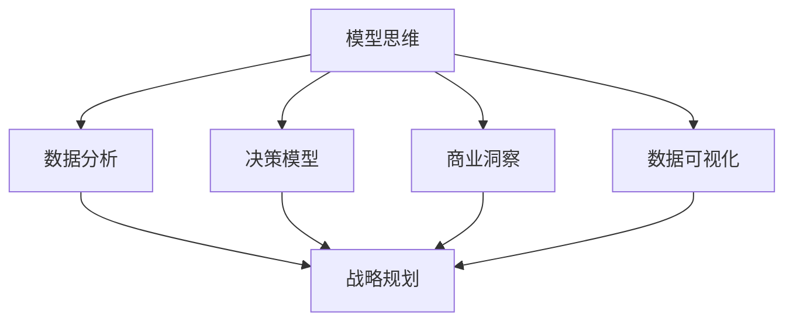

                 

# 模型思维在管理培训中的运用

> 关键词：模型思维, 管理培训, 数据分析, 决策模型, 战略规划, 商业洞察, 数据可视化

## 1. 背景介绍

### 1.1 问题由来
在现代企业管理中，面对复杂的市场环境和多变的需求，管理者必须具备扎实的理论基础和敏锐的洞察力，才能有效决策和解决问题。传统管理培训以经验传授为主，缺乏科学方法论的引导。而模型思维的引入，为管理者提供了结构化的分析工具，增强了决策的科学性和可操作性。

### 1.2 问题核心关键点
模型思维的核心在于将复杂问题抽象为数学或逻辑模型，通过定量分析和推理求解，实现对现象的深刻理解和预测。这种方法论尤其适用于那些有大量数据支持的决策场景，如市场预测、战略规划、风险评估等。

## 2. 核心概念与联系

### 2.1 核心概念概述

为了深入理解模型思维在管理培训中的应用，本节将介绍几个密切相关的核心概念：

- **模型思维（Model Thinking）**：将现实世界的问题抽象为数学或逻辑模型，通过定量分析和推理求解，实现对现象的深刻理解和预测。

- **数据分析（Data Analysis）**：利用统计学、机器学习等方法对数据进行清洗、处理和分析，提取有用信息。

- **决策模型（Decision Modeling）**：构建以数据为基础的模型，辅助管理者进行科学决策。

- **战略规划（Strategic Planning）**：基于模型思维和数据分析，制定企业的长期发展战略。

- **商业洞察（Business Insight）**：通过模型分析和数据挖掘，洞察市场趋势、客户需求、竞争格局等商业信息。

- **数据可视化（Data Visualization）**：利用图表、仪表盘等手段，直观展示数据信息，辅助决策和分析。

这些核心概念之间的逻辑关系可以通过以下Mermaid流程图来展示：



这个流程图展示了这个模型思维框架的核心组成和相互关系：

1. 模型思维通过数据分析，构建决策模型。
2. 数据分析和决策模型是战略规划的基础。
3. 商业洞察和数据可视化为战略规划提供支持。

## 3. 核心算法原理 & 具体操作步骤

### 3.1 算法原理概述

模型思维在管理培训中的应用，主要涉及将现实问题转化为数学或逻辑模型，通过模型求解辅助决策。其核心原理可以总结如下：

1. **抽象建模**：将现实问题抽象为数学或逻辑模型，去除冗余信息，保留关键变量。
2. **参数估计**：利用样本数据估计模型参数，构建模型预测。
3. **模型验证**：通过测试数据验证模型预测的准确性，调整模型参数。
4. **决策应用**：将模型应用于决策场景，提供科学支持。

### 3.2 算法步骤详解

以下详细讲解模型思维在管理培训中的具体操作步骤：

**Step 1: 问题定义和模型选择**

- 明确管理培训中需要解决的问题。例如，市场趋势预测、销售预测、客户细分等。
- 根据问题的特点，选择合适的模型类型。如线性回归、决策树、神经网络等。

**Step 2: 数据收集和处理**

- 收集与问题相关的数据，包括历史数据、市场数据、客户数据等。
- 对数据进行清洗、去重、填充缺失值等预处理操作。

**Step 3: 模型训练和评估**

- 将数据分为训练集和测试集。
- 使用训练集对模型进行拟合。
- 在测试集上评估模型性能，如均方误差、准确率、召回率等指标。
- 根据评估结果调整模型参数，优化模型性能。

**Step 4: 模型应用和决策支持**

- 将训练好的模型应用于实际决策场景。
- 利用模型预测结果，辅助管理者制定决策。
- 对模型预测结果进行解释和解读，提升决策透明度。

### 3.3 算法优缺点

模型思维在管理培训中具有以下优点：

- **科学性**：通过数学或逻辑模型分析问题，提升决策的科学性和可操作性。
- **系统性**：提供系统化的分析框架，避免单一视角和经验主义。
- **可验证性**：模型可以通过数据验证其预测能力，增强决策的可靠性。

同时，该方法也存在一些局限：

- **数据依赖**：模型性能高度依赖于数据的数量和质量，数据不足或偏差可能导致模型失效。
- **计算复杂**：复杂的模型可能需要大量计算资源和时间。
- **解释性不足**：模型预测结果有时难以直观解释，导致管理层信任度下降。

### 3.4 算法应用领域

模型思维在管理培训中的应用领域广泛，主要包括：

- **市场预测**：预测市场需求、价格趋势、销售量等。
- **客户细分**：根据客户行为和特征，进行市场细分和客户画像。
- **风险评估**：评估项目风险、信用风险、市场风险等。
- **战略规划**：制定企业发展战略、市场进入策略、产品路线图等。
- **运营优化**：优化供应链、生产流程、库存管理等。
- **客户满意度分析**：分析客户满意度、品牌认知度、市场占有率等。

## 4. 数学模型和公式 & 详细讲解 & 举例说明

### 4.1 数学模型构建

模型思维在管理培训中的数学模型构建，通常包括以下几个步骤：

1. **问题抽象**：将现实问题抽象为数学模型。例如，预测未来销售量，可以抽象为线性回归模型。
2. **变量定义**：定义模型的输入变量和输出变量。例如，输入变量为历史销售数据，输出变量为预测销售量。
3. **模型假设**：对模型的假设条件进行定义，如数据独立同分布、误差服从正态分布等。
4. **模型建立**：根据问题特点，选择适当的数学模型。如线性回归、逻辑回归、决策树等。

### 4.2 公式推导过程

以线性回归模型为例，推导其公式和参数估计方法：

设线性回归模型为：
$$
y = \beta_0 + \beta_1 x_1 + \cdots + \beta_n x_n + \epsilon
$$

其中 $y$ 为输出变量，$x_i$ 为输入变量，$\beta_i$ 为模型参数，$\epsilon$ 为误差项。

根据最小二乘法，参数估计公式为：
$$
\beta = (X^TX)^{-1}X^Ty
$$

其中 $X$ 为设计矩阵，$y$ 为输出向量。

### 4.3 案例分析与讲解

以某零售企业的销售预测为例，具体分析模型思维在管理培训中的应用：

1. **问题定义**：预测未来三个月内某商品的销售量。
2. **数据收集**：收集过去12个月的商品销售数据，包括时间、价格、促销活动等。
3. **模型选择**：选择线性回归模型进行预测。
4. **参数估计**：使用前10个月的数据估计模型参数。
5. **模型评估**：使用后2个月的数据验证模型预测效果。
6. **决策应用**：根据模型预测结果，调整库存和促销策略。

## 5. 项目实践：代码实例和详细解释说明

### 5.1 开发环境搭建

在进行模型思维实践前，我们需要准备好开发环境。以下是使用Python进行数据分析和建模的环境配置流程：

1. 安装Anaconda：从官网下载并安装Anaconda，用于创建独立的Python环境。

2. 创建并激活虚拟环境：
```bash
conda create -n model-env python=3.8 
conda activate model-env
```

3. 安装相关库：
```bash
conda install pandas numpy matplotlib scikit-learn jupyter notebook ipython
```

4. 安装模型训练所需的库：
```bash
pip install scikit-learn
```

5. 安装数据可视化所需的库：
```bash
pip install matplotlib seaborn
```

完成上述步骤后，即可在`model-env`环境中开始模型训练和应用。

### 5.2 源代码详细实现

以下是使用Python进行线性回归模型训练的完整代码实现：

```python
import pandas as pd
import numpy as np
from sklearn.linear_model import LinearRegression
from sklearn.model_selection import train_test_split
import matplotlib.pyplot as plt

# 数据加载
data = pd.read_csv('sales_data.csv')

# 数据处理
X = data[['promo', 'sales']].values
y = data['sales'].values

# 数据分割
X_train, X_test, y_train, y_test = train_test_split(X, y, test_size=0.2, random_state=42)

# 模型训练
model = LinearRegression()
model.fit(X_train, y_train)

# 模型评估
train_score = model.score(X_train, y_train)
test_score = model.score(X_test, y_test)

# 结果输出
print(f'训练集得分: {train_score:.2f}')
print(f'测试集得分: {test_score:.2f}')

# 预测结果可视化
plt.scatter(X_test, y_test, label='实际销售')
plt.scatter(X_test, model.predict(X_test), label='预测销售')
plt.legend()
plt.show()
```

### 5.3 代码解读与分析

让我们再详细解读一下关键代码的实现细节：

**数据加载和处理**：
- `pandas`库用于数据加载和处理，`read_csv`函数用于读取CSV文件。
- `numpy`库用于数组运算，`values`函数用于获取数据帧的数组表示。

**模型训练和评估**：
- `sklearn.linear_model`模块中的`LinearRegression`类用于构建线性回归模型。
- `sklearn.model_selection`模块中的`train_test_split`函数用于数据分割，将数据集划分为训练集和测试集。
- `fit`方法用于模型训练，`score`方法用于模型评估。

**结果输出和可视化**：
- `print`函数用于输出模型评估得分。
- `matplotlib.pyplot`库用于数据可视化，`scatter`函数用于绘制散点图，展示实际销售和预测销售的对比。

以上代码实现了从数据加载到模型评估的全过程，展示了模型思维在管理培训中的实际应用。

## 6. 实际应用场景

### 6.1 企业决策支持

模型思维在企业决策支持中的应用，可以显著提升决策的科学性和准确性。例如，某零售企业可以通过销售预测模型，提前预测下季度销售趋势，合理调整库存和促销策略，提升市场竞争力。

### 6.2 风险管理

在金融领域，模型思维用于风险评估和管理，帮助金融机构识别和量化风险因素，制定风险控制策略。例如，利用信用评分模型，对贷款申请人的信用状况进行评估，优化风险管理流程。

### 6.3 战略规划

通过模型思维，企业可以构建长期发展战略模型，制定明确的战略目标和路径。例如，某科技公司可以利用市场预测模型，预测未来五年市场趋势，制定公司战略规划，把握市场机会。

### 6.4 客户细分

模型思维可以用于客户细分和个性化营销。例如，某电商企业可以利用客户行为分析模型，对客户进行精准细分，制定个性化推荐策略，提升客户满意度和忠诚度。

## 7. 工具和资源推荐

### 7.1 学习资源推荐

为了帮助管理者掌握模型思维的理论基础和实践技巧，这里推荐一些优质的学习资源：

1. 《数据科学与机器学习》课程（Coursera）：由斯坦福大学Andrew Ng教授主讲，涵盖数据科学和机器学习的基础知识和高级技术。
2. 《模型思维导论》书籍：详细讲解模型思维的基本概念和实际应用，适合进阶学习。
3. 《Python数据科学手册》书籍：介绍Python在数据科学中的应用，包含数据处理、模型构建、结果解释等全流程内容。
4. Kaggle平台：提供大量公开数据集和竞赛题目，适合实践练习和技能提升。
5. GitHub开源项目：包含丰富的模型思维和数据分析的代码实现，参考学习。

通过对这些资源的学习实践，相信你一定能够快速掌握模型思维的精髓，并用于解决实际的商业问题。

### 7.2 开发工具推荐

高效的开发离不开优秀的工具支持。以下是几款用于模型思维开发的常用工具：

1. Python：数据科学和机器学习的主流语言，拥有丰富的第三方库和社区支持。
2. R语言：广泛用于统计分析和数据可视化，拥有丰富的统计模型和绘图库。
3. Tableau：数据可视化工具，支持多种数据源，提供直观的图表展示。
4. Excel：常用的电子表格软件，支持基本的数据分析和图表制作。
5. Jupyter Notebook：交互式编程环境，支持多种编程语言，适合模型开发和数据探索。

合理利用这些工具，可以显著提升模型思维的开发效率，加快创新迭代的步伐。

### 7.3 相关论文推荐

模型思维的发展源于学界的持续研究。以下是几篇奠基性的相关论文，推荐阅读：

1. Linear Regression（最小二乘法）：经典回归分析模型，广泛应用于统计学和机器学习。
2. Decision Trees（决策树）：基于树结构的分类模型，易于解释和理解。
3. Logistic Regression（逻辑回归）：用于二分类问题的概率模型，广泛应用在金融、医疗等领域。
4. Random Forest（随机森林）：基于决策树的集成学习模型，提升模型稳定性和泛化能力。
5. Neural Networks（神经网络）：模拟人脑神经元计算的模型，适用于复杂的非线性关系。

这些论文代表了大模型思维的发展脉络。通过学习这些前沿成果，可以帮助研究者把握学科前进方向，激发更多的创新灵感。

## 8. 总结：未来发展趋势与挑战

### 8.1 总结

本文对模型思维在管理培训中的应用进行了全面系统的介绍。首先阐述了模型思维的背景和意义，明确了其在决策科学化和数据驱动管理中的独特价值。其次，从原理到实践，详细讲解了模型思维的数学模型构建和具体操作步骤，给出了模型训练和应用的完整代码实现。同时，本文还广泛探讨了模型思维在企业决策支持、风险管理、战略规划、客户细分等多个商业场景中的应用前景，展示了模型思维的广阔应用潜力。最后，本文精选了模型思维的学习资源，力求为管理者提供全方位的技术指引。

通过本文的系统梳理，可以看到，模型思维为管理培训提供了结构化的分析工具，增强了决策的科学性和可操作性。模型思维方法论不仅能帮助管理者提升决策水平，还能为企业的可持续发展提供坚实的理论支持。未来，伴随模型思维的不断演进，相信其在商业管理中的应用将越来越广泛，对企业的价值也将愈加显著。

### 8.2 未来发展趋势

展望未来，模型思维在管理培训中的应用将呈现以下几个发展趋势：

1. **数据驱动决策**：大数据和云计算技术的不断发展，使得模型思维在管理决策中的应用更加广泛和深入。通过数据驱动的模型预测和分析，管理者可以更好地理解市场动态、客户需求等关键信息。
2. **实时数据处理**：随着物联网和传感器技术的普及，实时数据采集和处理技术逐渐成熟。管理者可以通过实时数据模型，快速响应市场变化和客户反馈，优化运营策略。
3. **多学科融合**：模型思维将更多地与其他学科结合，如心理学、经济学、社会学等。通过多学科知识的融合，提升模型思维的全面性和深度。
4. **人工智能与模型思维的结合**：人工智能技术的不断进步，使得模型思维与机器学习、深度学习等技术的结合更加紧密。通过AI技术优化模型训练和预测，提升模型思维的准确性和自动化水平。
5. **伦理和法律合规**：模型思维的应用需要考虑数据隐私、伦理道德和法律合规等问题。未来需要制定相关标准和规范，确保模型思维在应用中的安全性。

以上趋势凸显了模型思维在管理培训中的广阔前景。这些方向的探索发展，必将进一步提升管理决策的科学性和智能化，为企业的可持续发展提供坚实基础。

### 8.3 面临的挑战

尽管模型思维在管理培训中取得了显著成效，但在实际应用中也面临着诸多挑战：

1. **数据质量**：数据质量直接影响模型的预测能力和决策效果。不完整、不规范、不准确的数据可能导致模型失效。如何获取高质量的数据，是模型思维应用的难点之一。
2. **模型复杂度**：复杂的模型需要大量的计算资源和时间。在资源有限的情况下，如何构建高效的模型，减少计算复杂度，提高模型训练效率，是亟待解决的问题。
3. **模型解释性**：模型预测结果有时难以直观解释，导致管理层信任度下降。如何提升模型的可解释性，增强决策透明度，是模型思维应用的另一挑战。
4. **伦理和法律风险**：模型思维的应用可能带来数据隐私、伦理道德和法律合规等问题。如何在应用中避免伦理风险，制定相应的规范和标准，也是模型思维需要考虑的重要方面。

### 8.4 研究展望

面对模型思维面临的挑战，未来的研究需要在以下几个方面寻求新的突破：

1. **数据治理与质量提升**：加强数据治理，提升数据质量，确保模型训练数据的完整性和准确性。通过数据清洗和数据增强等技术，减少数据噪声对模型性能的影响。
2. **模型简化与加速**：探索模型简化和加速技术，如模型压缩、剪枝、量化等，减少计算资源消耗，提高模型训练和推理效率。
3. **可解释性与透明化**：发展可解释性模型，提供透明化的决策依据。引入因果分析、元学习等技术，提升模型的可解释性和透明度。
4. **伦理和法律合规**：建立模型应用的伦理和法律框架，确保模型训练和应用过程中的合规性。制定数据隐私保护和伦理标准，提升模型的社会责任感。

这些研究方向的探索，必将引领模型思维在管理培训中的深入应用，为管理者提供更科学、更高效的决策支持。只有勇于创新、敢于突破，才能不断拓展模型思维的边界，推动企业管理技术的不断进步。

## 9. 附录：常见问题与解答

**Q1：模型思维是否适用于所有管理问题？**

A: 模型思维在管理培训中的应用范围广泛，但并非所有问题都适合使用模型思维进行分析和解决。例如，一些主观性强、不确定性高的决策问题，可能难以通过模型思维找到明确的答案。此时，需要结合管理经验和直觉判断，综合多方面信息进行决策。

**Q2：如何选择合适的模型类型？**

A: 选择合适的模型类型需要考虑问题的特点、数据的性质以及可接受的预测精度。例如，对于连续型数据，可以选择线性回归、决策树等模型；对于分类问题，可以选择逻辑回归、随机森林等模型。具体选择还需要根据实际情况进行模型调参和验证，找到最优模型。

**Q3：模型思维在应用中需要哪些资源支持？**

A: 模型思维在应用中需要数据、计算资源、算法库、可视化工具等多方面的支持。具体来说，需要准备高质量的数据集，获取高性能的计算资源，选择合适的算法库和工具，进行模型训练和应用。同时，还需要结合管理经验，理解模型预测结果的实际意义。

**Q4：模型思维在应用中如何处理数据质量问题？**

A: 数据质量直接影响模型的预测效果，需要通过数据清洗、去重、填充缺失值等预处理操作，提升数据质量。对于缺失数据，可以选择插值、删除等方法进行处理；对于异常数据，可以采用离群点检测、异常值处理等技术进行处理。

**Q5：如何提升模型思维的可解释性？**

A: 提升模型思维的可解释性需要综合多方面的努力。例如，通过选择可解释性强的模型，如决策树、逻辑回归等；通过特征选择和特征可视化，理解模型的关键特征；通过模型解释技术，如LIME、SHAP等，提供透明的决策依据。

这些问题的解答，希望能为管理者提供清晰的指引，帮助他们在实际应用中更好地运用模型思维，提升管理决策水平。

---

作者：禅与计算机程序设计艺术 / Zen and the Art of Computer Programming

