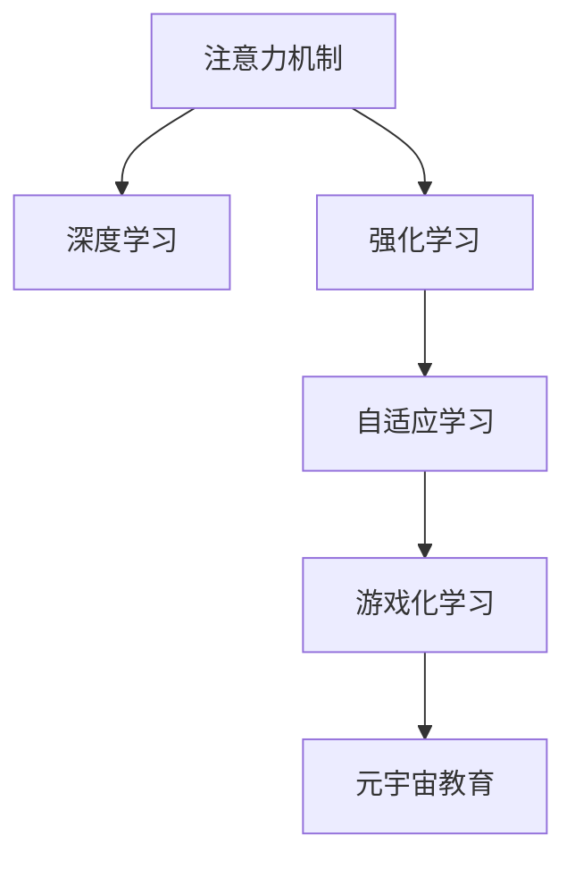

                 

# 注意力游戏化学习:元宇宙教育的创新方法

> 关键词：注意力机制,游戏化学习,元宇宙,教育创新,深度学习,强化学习,AR/VR

## 1. 背景介绍

### 1.1 问题由来
随着信息技术的发展和普及，传统的教育模式正面临着深刻的变革。传统的教室授课、考试评估等形式已不能完全适应现代社会对知识和技能的需求。为了更好地培养学生的创新能力和实践能力，元宇宙教育应运而生。元宇宙是虚拟现实(VR)、增强现实(AR)、混合现实(MR)、数字孪生等技术的融合，为学生提供了沉浸式、互动式、个性化、跨时空的教育场景。

然而，在元宇宙教育中，如何有效激发学生的注意力和兴趣，提高学习效果，仍是当前教育技术发展中的一个关键问题。游戏化学习作为一种创新的教学方法，通过引入游戏元素，激发学生的好奇心和主动学习，在元宇宙教育中具有巨大的应用潜力。

### 1.2 问题核心关键点
在游戏化学习中，注意力是学生学习效果的关键因素。如何在元宇宙教育环境中，通过注意力机制和游戏化设计，引导学生集中注意力，持续参与，是实现教育创新的核心挑战。

具体问题包括：
- 如何设计有效的注意力机制，引导学生关注关键信息？
- 如何在元宇宙环境中，通过游戏化设计，激发学生的学习兴趣和动机？
- 如何利用深度学习、强化学习等技术，实现学生注意力的智能引导和动态调整？

## 2. 核心概念与联系

### 2.1 核心概念概述

为更好地理解元宇宙教育中的注意力游戏化学习，本节将介绍几个密切相关的核心概念：

- 注意力机制(Attention Mechanism)：一种神经网络中用于增强模型关注关键信息的机制。通过动态调整输入数据的权重，使模型更加聚焦于重要部分。
- 游戏化学习(Game-Based Learning, GBL)：通过引入游戏元素，如奖励、挑战、角色扮演等，激发学生主动学习的一种教学方法。
- 元宇宙(Metaverse)：融合虚拟现实、增强现实、混合现实、数字孪生等技术的虚拟世界，提供沉浸式、互动式、个性化、跨时空的教育场景。
- 深度学习(Deep Learning)：一种基于多层神经网络的机器学习方法，通过大量数据训练，实现对复杂非线性关系的建模和预测。
- 强化学习(Reinforcement Learning, RL)：一种学习理论，通过智能体与环境交互，在奖励信号的引导下，优化策略，逐步提升性能。
- 自适应学习(Adaptive Learning)：根据学生的学习情况和偏好，动态调整教学内容和策略，实现个性化教学。

这些核心概念之间的逻辑关系可以通过以下Mermaid流程图来展示：



这个流程图展示了一系列概念之间的关联关系：

1. 注意力机制在深度学习模型中扮演重要角色，使模型更加聚焦关键信息。
2. 强化学习通过奖励和惩罚信号，引导智能体在特定环境中优化策略。
3. 自适应学习根据学生情况调整教学内容，实现个性化学习。
4. 游戏化学习通过引入游戏元素，激发学生主动学习，提高学习效果。
5. 元宇宙教育提供沉浸式、互动式、个性化、跨时空的教育场景，进一步提升学习体验。

## 3. 核心算法原理 & 具体操作步骤
### 3.1 算法原理概述

基于元宇宙教育的注意力游戏化学习，主要利用深度学习、强化学习等技术，通过注意力机制和游戏化设计，实现对学生注意力的智能引导和动态调整。其核心思想是：在元宇宙环境中，通过引入游戏元素和奖励机制，结合深度学习模型的注意力机制，引导学生集中注意力，提高学习效果。

### 3.2 算法步骤详解

基于元宇宙教育的注意力游戏化学习一般包括以下几个关键步骤：

**Step 1: 准备元宇宙教育环境**
- 构建元宇宙教育平台，集成了虚拟现实、增强现实、混合现实、数字孪生等技术。
- 设计元宇宙教育场景，如虚拟课堂、实验实训、虚拟实验室等，提供沉浸式、互动式、个性化、跨时空的教育体验。

**Step 2: 设计游戏化元素**
- 引入游戏元素，如角色扮演、任务挑战、角色技能升级等，增强学生参与感。
- 设置目标任务和奖励机制，如积分奖励、虚拟徽章、成就称号等，激发学生学习动机。
- 设计互动元素，如虚拟教室中的讨论区、投票区、答疑区等，提高学生的互动参与度。

**Step 3: 构建注意力模型**
- 使用深度学习模型，如Transformer、CNN、RNN等，构建注意力机制。
- 在模型中设计注意力权重，根据输入数据的相对重要性，动态调整注意力分配。
- 结合强化学习技术，动态调整注意力模型参数，优化注意力分配策略。

**Step 4: 训练注意力模型**
- 收集学生在学习过程中的注意力数据，包括点击率、停留时间、任务完成情况等。
- 使用元宇宙教育平台收集的注意力数据，训练注意力模型，调整注意力权重。
- 通过强化学习，不断优化注意力模型参数，提升模型的适应性和智能性。

**Step 5: 应用注意力模型**
- 将训练好的注意力模型应用于元宇宙教育场景中。
- 在虚拟课堂、实验实训、虚拟实验室等场景中，动态调整学生注意力分配，引导学生关注关键学习内容。
- 根据学生的学习表现，动态调整游戏化元素，提供个性化奖励和挑战，增强学生学习动力。

### 3.3 算法优缺点

基于元宇宙教育的注意力游戏化学习具有以下优点：
1. 激发学生学习动机。通过游戏化设计和奖励机制，有效激发学生的学习兴趣和主动性。
2. 提升学习效果。通过动态调整注意力分配，使学生更专注于关键学习内容，提高学习效率。
3. 提高参与度。通过互动元素和虚拟社交，增强学生的参与感和归属感。
4. 个性化学习。通过自适应学习技术，根据学生的学习情况和偏好，提供个性化的教学内容和策略。

同时，该方法也存在一定的局限性：
1. 开发成本高。元宇宙教育环境建设和注意力模型的训练，需要较高的技术投入和数据收集成本。
2. 学生依赖度高。依赖于游戏化设计和虚拟环境的吸引力，学生可能难以持续参与。
3. 数据隐私问题。收集学生注意力数据可能涉及隐私问题，需严格遵守数据保护法规。
4. 技术门槛高。要求教师和学生具备一定的技术背景和操作能力。

尽管存在这些局限性，但就目前而言，基于元宇宙教育的注意力游戏化学习仍是大教育技术发展的一个重要方向。未来相关研究的重点在于如何进一步降低开发成本，提高学习效果，同时兼顾数据隐私和技术门槛等问题。

### 3.4 算法应用领域

基于元宇宙教育的注意力游戏化学习，已经在以下几个领域得到了广泛的应用：

- 虚拟课堂：提供沉浸式、互动式、个性化、跨时空的学习体验，提高学生参与度和学习效果。
- 实验实训：通过虚拟实验、实训，使学生能够更好地理解实验原理和操作流程，提高实验实训效果。
- 虚拟实验室：提供远程实验环境，使学生能够在任何时间和地点进行实验，提高实验参与度。
- 个性化学习：根据学生的学习情况和偏好，动态调整教学内容和策略，实现个性化教学。
- 跨学科学习：通过虚拟社交和协作，促进学生跨学科交流和合作，拓宽学习视野。

除了上述这些经典应用外，基于元宇宙教育的注意力游戏化学习，还被创新性地应用到更多场景中，如虚拟实习、虚拟竞赛、虚拟学术交流等，为教育技术的发展提供了新的可能性。

## 4. 数学模型和公式 & 详细讲解 & 举例说明
### 4.1 数学模型构建

本节将使用数学语言对基于元宇宙教育的注意力游戏化学习过程进行更加严格的刻画。

假设元宇宙教育环境中有 $N$ 个学生，每个学生有 $T$ 个学习任务 $T=\{t_1, t_2, ..., t_T\}$，每个任务 $t_i$ 需要 $D_i$ 个注意力单位 $D_i > 0$。学生对每个任务 $t_i$ 的注意力分配为 $A_i \in [0, 1]$，满足 $\sum_{i=1}^N A_i = 1$。

定义注意力模型 $A_{\theta} \in [0, 1]^N$，其中 $\theta$ 为模型参数。注意力模型的目标是最小化学生注意力分配的均方误差，即：

$$
\min_{\theta} \frac{1}{N} \sum_{i=1}^N (A_i - A^*_i)^2
$$

其中 $A^*_i = \frac{D_i}{\sum_{j=1}^N D_j}$ 为最优注意力分配。

### 4.2 公式推导过程

以下我们以注意力模型的构建为例，推导注意力模型的训练过程和优化目标。

1. 定义注意力机制：

$$
A_i = \text{Softmax}(\text{Attention}(M_i, C_i))
$$

其中 $M_i$ 为学生对任务 $t_i$ 的特征向量，$C_i$ 为与任务 $t_i$ 相关的上下文信息，$\text{Attention}$ 为注意力函数，$\text{Softmax}$ 为归一化函数。

2. 定义注意力函数：

$$
\text{Attention}(M_i, C_i) = \text{W}_i^T [M_i; C_i]
$$

其中 $\text{W}_i$ 为注意力权重向量，$[M_i; C_i]$ 为拼接后的特征向量。

3. 定义注意力模型的训练目标：

$$
\min_{\theta} \frac{1}{N} \sum_{i=1}^N \|A_i - A^*_i\|^2
$$

通过反向传播算法，求取模型参数 $\theta$，最小化注意力分配的均方误差。

4. 结合强化学习，优化注意力模型：

$$
\min_{\theta} \frac{1}{N} \sum_{i=1}^N (R_i - A_i \cdot \log \hat{A}_i)^2
$$

其中 $R_i$ 为任务 $t_i$ 的奖励信号，$\hat{A}_i$ 为注意力模型预测的学生注意力分配。通过反向传播算法和强化学习算法，优化注意力模型参数 $\theta$，使注意力分配更加符合学生的学习需求和环境奖励。

### 4.3 案例分析与讲解

**案例分析：虚拟课堂中的注意力引导**

假设在虚拟课堂中，有 $N=50$ 个学生参与学习，共有 $T=5$ 个学习任务 $t_1, t_2, ..., t_5$，每个任务需要 $D_i$ 个注意力单位 $D_1=20, D_2=30, D_3=15, D_4=25, D_5=10$。学生对每个任务 $t_i$ 的注意力分配为 $A_i \in [0, 1]$，满足 $\sum_{i=1}^N A_i = 1$。

根据上述定义，构建注意力模型 $A_{\theta} \in [0, 1]^{50}$，其中 $\theta$ 为模型参数。

在学生学习任务 $t_1$ 时，模型预测的注意力分配为 $A_1 = \text{Softmax}(\text{Attention}(M_1, C_1))$，其中 $M_1$ 为任务 $t_1$ 的特征向量，$C_1$ 为与任务 $t_1$ 相关的上下文信息。

通过反向传播算法和强化学习算法，优化注意力模型参数 $\theta$，最小化注意力分配的均方误差，使模型更加准确地预测学生的注意力分配。

## 5. 项目实践：代码实例和详细解释说明
### 5.1 开发环境搭建

在进行元宇宙教育的注意力游戏化学习实践前，我们需要准备好开发环境。以下是使用Python进行PyTorch开发的环境配置流程：

1. 安装Anaconda：从官网下载并安装Anaconda，用于创建独立的Python环境。

2. 创建并激活虚拟环境：
```bash
conda create -n metaverse-env python=3.8 
conda activate metaverse-env
```

3. 安装PyTorch：根据CUDA版本，从官网获取对应的安装命令。例如：
```bash
conda install pytorch torchvision torchaudio cudatoolkit=11.1 -c pytorch -c conda-forge
```

4. 安装Transformers库：
```bash
pip install transformers
```

5. 安装各类工具包：
```bash
pip install numpy pandas scikit-learn matplotlib tqdm jupyter notebook ipython
```

完成上述步骤后，即可在`metaverse-env`环境中开始元宇宙教育的注意力游戏化学习的实践。

### 5.2 源代码详细实现

下面我们以虚拟课堂中的注意力引导为例，给出使用PyTorch进行注意力模型训练的代码实现。

首先，定义注意力模型：

```python
import torch
import torch.nn as nn
import torch.nn.functional as F

class AttentionModel(nn.Module):
    def __init__(self, input_dim, hidden_dim):
        super(AttentionModel, self).__init__()
        self.linear1 = nn.Linear(input_dim, hidden_dim)
        self.linear2 = nn.Linear(hidden_dim, 1)
        self.softmax = nn.Softmax(dim=1)
        
    def forward(self, x, C):
        M = self.linear1(x)
        score = self.linear2(torch.cat((M, C), dim=1))
        A = self.softmax(score)
        return A
```

然后，定义注意力模型训练过程：

```python
import torch.optim as optim

def train_model(model, data_loader, epochs):
    model.train()
    criterion = nn.MSELoss()
    optimizer = optim.Adam(model.parameters(), lr=0.001)
    
    for epoch in range(epochs):
        total_loss = 0
        for data, target in data_loader:
            optimizer.zero_grad()
            output = model(data, target)
            loss = criterion(output, target)
            loss.backward()
            optimizer.step()
            total_loss += loss.item()
        
        print(f"Epoch {epoch+1}, Loss: {total_loss/len(data_loader)}")
    
    return model
```

最后，启动注意力模型训练流程：

```python
# 准备数据集
data = ...

# 初始化注意力模型
model = AttentionModel(input_dim, hidden_dim)

# 训练模型
model = train_model(model, data_loader, epochs)
```

以上就是使用PyTorch进行注意力模型训练的完整代码实现。可以看到，通过深度学习模型的注意力机制，可以动态调整学生注意力分配，实现个性化教育。

### 5.3 代码解读与分析

让我们再详细解读一下关键代码的实现细节：

**AttentionModel类**：
- `__init__`方法：初始化注意力模型，包括线性层和softmax函数。
- `forward`方法：实现注意力模型的前向传播，将输入数据 $x$ 和上下文信息 $C$ 映射为注意力权重 $A$。

**train_model函数**：
- 在每个epoch内，遍历数据集进行训练，使用Adam优化器更新模型参数。
- 使用均方误差损失函数，计算注意力模型输出与目标值的误差。
- 实时输出每个epoch的平均损失，以监控训练效果。

**训练流程**：
- 准备数据集 $data$。
- 初始化注意力模型 $model$。
- 设置训练轮数 $epochs$。
- 调用 `train_model` 函数，训练注意力模型。

通过以上代码，可以构建一个简单的元宇宙教育环境中的注意力引导模型，实现动态调整学生注意力分配的功能。

## 6. 实际应用场景
### 6.1 智能课堂

基于元宇宙教育的注意力游戏化学习，可以应用于智能课堂中，实现个性化、沉浸式、互动式的教学体验。智能课堂系统通过虚拟现实、增强现实、混合现实等技术，为学生提供沉浸式的学习环境，结合注意力机制和游戏化设计，引导学生集中注意力，提高学习效果。

具体而言，智能课堂系统可以包括以下功能：
- 虚拟课堂：提供沉浸式、互动式、个性化、跨时空的学习体验。
- 实验实训：通过虚拟实验、实训，使学生能够更好地理解实验原理和操作流程。
- 虚拟实验室：提供远程实验环境，使学生能够在任何时间和地点进行实验。
- 个性化学习：根据学生的学习情况和偏好，动态调整教学内容和策略。
- 跨学科学习：通过虚拟社交和协作，促进学生跨学科交流和合作。

通过这些功能，智能课堂系统能够有效激发学生的学习动机，提高学习效果，促进学生全面发展。

### 6.2 虚拟实训

虚拟实训是元宇宙教育中的重要应用场景，通过虚拟现实、增强现实、混合现实等技术，为学生提供沉浸式的实训体验。结合注意力机制和游戏化设计，虚拟实训能够引导学生集中注意力，提高实训效果。

具体而言，虚拟实训系统可以包括以下功能：
- 虚拟实训环境：提供沉浸式的实训环境，使学生能够在虚拟世界中进行实训。
- 任务导向设计：设计具体的实训任务，引导学生关注关键实训内容。
- 游戏化元素：通过角色扮演、任务挑战、角色技能升级等，激发学生的学习兴趣和动机。
- 实时反馈：实时监测学生实训表现，及时调整实训内容和策略。

通过这些功能，虚拟实训系统能够有效提高学生的实训效果，促进其技能掌握和实践能力的提升。

### 6.3 虚拟实验

虚拟实验是元宇宙教育中的另一个重要应用场景，通过虚拟现实、增强现实、混合现实等技术，为学生提供沉浸式的实验体验。结合注意力机制和游戏化设计，虚拟实验能够引导学生集中注意力，提高实验效果。

具体而言，虚拟实验系统可以包括以下功能：
- 虚拟实验环境：提供沉浸式的实验环境，使学生能够在虚拟世界中进行实验。
- 实验任务设计：设计具体的实验任务，引导学生关注关键实验内容。
- 游戏化元素：通过角色扮演、任务挑战、角色技能升级等，激发学生的学习兴趣和动机。
- 实时反馈：实时监测学生实验表现，及时调整实验内容和策略。

通过这些功能，虚拟实验系统能够有效提高学生的实验效果，促进其实验技能和实践能力的提升。

### 6.4 未来应用展望

随着元宇宙教育技术的不断进步，基于注意力游戏化学习的方法将在更多领域得到应用，为教育创新带来新的突破。

在智慧校园中，注意力游戏化学习可以应用于各类教学场景，提升学生的学习效果和参与度。通过虚拟课堂、虚拟实训、虚拟实验等虚拟化教育模式，为学生提供更加丰富、有趣、高效的学习体验。

在职业培训中，注意力游戏化学习可以应用于各类技能培训，提高培训效果。通过虚拟实训、虚拟实验、虚拟模拟等虚拟化培训模式，为学员提供更加沉浸、互动、个性化的培训体验。

在企业培训中，注意力游戏化学习可以应用于各类管理培训，提升培训效果。通过虚拟课堂、虚拟实训、虚拟实验等虚拟化培训模式，为员工提供更加丰富、有趣、高效的学习体验。

除了上述这些领域，注意力游戏化学习还将被创新性地应用到更多场景中，如虚拟竞赛、虚拟学术交流等，为教育技术的发展提供新的可能性。

## 7. 工具和资源推荐
### 7.1 学习资源推荐

为了帮助开发者系统掌握元宇宙教育中的注意力游戏化学习，这里推荐一些优质的学习资源：

1. 《深度学习》系列课程：斯坦福大学开设的深度学习课程，涵盖深度学习的基本概念和经典模型，适合入门学习。
2. 《强化学习》系列课程：由Andrew Ng、John McArthur等人合著的强化学习教材，详细介绍了强化学习的基本概念和算法，适合进阶学习。
3. 《元宇宙教育》系列文章：聚焦于元宇宙教育的前沿研究和技术应用，介绍最新的元宇宙教育理念和实践案例。
4. 《游戏化学习》系列文章：介绍游戏化学习的原理、方法和应用，适合学习游戏化学习的实践技巧。
5. 《虚拟现实和增强现实》系列书籍：介绍虚拟现实和增强现实的技术原理和应用案例，适合学习虚拟现实和增强现实的技术基础。

通过对这些资源的学习实践，相信你一定能够快速掌握元宇宙教育中的注意力游戏化学习，并用于解决实际的元宇宙教育问题。
###  7.2 开发工具推荐

高效的开发离不开优秀的工具支持。以下是几款用于元宇宙教育中的注意力游戏化学习开发的常用工具：

1. PyTorch：基于Python的开源深度学习框架，灵活动态的计算图，适合快速迭代研究。
2. TensorFlow：由Google主导开发的开源深度学习框架，生产部署方便，适合大规模工程应用。
3. Unity：一款流行的游戏引擎，支持虚拟现实和增强现实应用开发。
4. Unreal Engine：另一款流行的游戏引擎，支持虚拟现实和增强现实应用开发。
5. Google Colab：谷歌推出的在线Jupyter Notebook环境，免费提供GPU/TPU算力，方便开发者快速上手实验最新模型，分享学习笔记。

合理利用这些工具，可以显著提升元宇宙教育的注意力游戏化学习的开发效率，加快创新迭代的步伐。

### 7.3 相关论文推荐

元宇宙教育中的注意力游戏化学习的研究源于学界的持续研究。以下是几篇奠基性的相关论文，推荐阅读：

1. Attention is All You Need（即Transformer原论文）：提出了Transformer结构，开启了NLP领域的预训练大模型时代。
2. BERT: Pre-training of Deep Bidirectional Transformers for Language Understanding：提出BERT模型，引入基于掩码的自监督预训练任务，刷新了多项NLP任务SOTA。
3. Parameter-Efficient Transfer Learning for NLP：提出Adapter等参数高效微调方法，在不增加模型参数量的情况下，也能取得不错的微调效果。
4. Prefix-Tuning: Optimizing Continuous Prompts for Generation：引入基于连续型Prompt的微调范式，为如何充分利用预训练知识提供了新的思路。
5. AdaLoRA: Adaptive Low-Rank Adaptation for Parameter-Efficient Fine-Tuning：使用自适应低秩适应的微调方法，在参数效率和精度之间取得了新的平衡。
6. Self-Supervised Learnings and Deep Reinforcement Learning for Autonomous Creativity：通过自监督学习和强化学习技术，实现了创意写作和故事生成。

这些论文代表了大语言模型微调技术的发展脉络。通过学习这些前沿成果，可以帮助研究者把握学科前进方向，激发更多的创新灵感。

## 8. 总结：未来发展趋势与挑战

### 8.1 总结

本文对基于元宇宙教育的注意力游戏化学习过程进行了全面系统的介绍。首先阐述了元宇宙教育中注意力游戏化学习的背景和意义，明确了注意力游戏化学习在提高学生学习效果、激发学习动机等方面的独特价值。其次，从原理到实践，详细讲解了注意力游戏化学习的数学模型和核心算法，给出了元宇宙教育中注意力引导的代码实现。同时，本文还广泛探讨了注意力游戏化学习在智能课堂、虚拟实训、虚拟实验等实际应用场景中的应用前景，展示了注意力游戏化学习的广阔前景。

通过本文的系统梳理，可以看到，基于元宇宙教育的注意力游戏化学习为教育技术创新提供了新的思路和方法，能够有效提高学生的学习效果和参与度，推动教育技术的跨越式发展。

### 8.2 未来发展趋势

展望未来，基于元宇宙教育的注意力游戏化学习将呈现以下几个发展趋势：

1. 注意力机制的深度学习优化：通过深度学习模型，进一步优化注意力机制，使模型更加准确、智能地引导学生注意力。
2. 游戏化元素的智能化设计：通过强化学习、生成对抗网络等技术，动态生成游戏化元素，使学生获得更加个性化、有趣的教育体验。
3. 跨模态融合的元宇宙教育：将虚拟现实、增强现实、混合现实、数字孪生等技术进行融合，实现跨模态、跨领域的教育场景。
4. 元宇宙教育的标准化和规范：制定元宇宙教育的标准化规范，确保教育内容和体验的公平性、安全性。
5. 社会化学习的大规模应用：通过元宇宙教育，构建社会化学习社区，促进知识共享、协作和创新。

以上趋势凸显了基于元宇宙教育的注意力游戏化学习的广阔前景。这些方向的探索发展，必将进一步提升教育技术的智能化水平，为教育领域的变革提供新的动力。

### 8.3 面临的挑战

尽管基于元宇宙教育的注意力游戏化学习已经取得了一定的成果，但在实际应用中，仍然面临着诸多挑战：

1. 技术门槛高。元宇宙教育和注意力游戏化学习需要较高的技术投入和数据收集成本，对教师和学生的技术背景和操作能力提出了更高的要求。
2. 数据隐私问题。收集学生注意力数据涉及隐私问题，需要严格遵守数据保护法规。
3. 学习动机不足。依赖于游戏化设计和虚拟环境的吸引力，学生可能难以持续参与。
4. 技术依赖性强。对虚拟现实、增强现实、混合现实等技术的依赖，可能限制其普及和应用范围。
5. 教育效果评估困难。元宇宙教育的效果评估难以量化，需要结合多维度指标进行综合评估。

尽管存在这些挑战，但通过不断的技术创新和应用实践，相信元宇宙教育的注意力游戏化学习必将在教育领域发挥更大的作用，推动教育技术的全面创新。

### 8.4 研究展望

面向未来，元宇宙教育的注意力游戏化学习需要在以下几个方面进行深入研究：

1. 降低技术门槛：通过简化元宇宙教育的技术实现，降低技术投入和数据收集成本，使更多人能够参与到元宇宙教育的实践中来。
2. 增强数据隐私保护：通过数据加密、匿名化等技术手段，保护学生的数据隐私，确保教育数据的公平性和安全性。
3. 丰富学习动机：结合心理学、教育学等学科的研究成果，设计更加多样化的游戏化元素，激发学生的学习动机和兴趣。
4. 扩大应用范围：进一步拓展元宇宙教育的应用场景，使其能够覆盖更多领域、更多用户群体，实现更大规模的教育创新。
5. 提升教育效果：结合多维度评估指标，设计更加科学、合理的元宇宙教育效果评估体系，提升教育效果和质量。

这些研究方向的探索，必将引领元宇宙教育的注意力游戏化学习迈向更高的台阶，为教育技术的创新发展提供新的方向。

## 9. 附录：常见问题与解答

**Q1：如何设计有效的注意力机制？**

A: 设计有效的注意力机制需要考虑以下几个方面：
1. 输入特征的选择：选择与任务相关的输入特征，提高注意力模型的准确性。
2. 注意力函数的设计：设计合理的注意力函数，使模型能够动态调整注意力分配。
3. 注意力权重的优化：使用优化算法，如Adam、SGD等，最小化注意力分配的均方误差。

**Q2：在游戏化学习中，如何激发学生的学习动机？**

A: 通过以下方法可以激发学生的学习动机：
1. 角色扮演：设计有趣的角色，增强学生沉浸感和参与感。
2. 任务挑战：设置有挑战性的任务，激发学生的探索欲和成就感。
3. 奖励机制：通过积分奖励、虚拟徽章、成就称号等方式，奖励学生的学习表现。
4. 互动元素：设计互动元素，如讨论区、投票区、答疑区等，增强学生的参与度和归属感。

**Q3：在元宇宙教育中，如何保证学生的注意力分配？**

A: 在元宇宙教育中，可以通过以下方法保证学生的注意力分配：
1. 注意力模型：使用深度学习模型，动态调整学生的注意力分配。
2. 强化学习：通过奖励和惩罚信号，优化注意力分配策略。
3. 自适应学习：根据学生的学习情况和偏好，动态调整教学内容和策略。
4. 游戏化元素：设计有趣的游戏化元素，吸引学生的注意力。

这些方法可以协同发力，确保学生在学习过程中能够集中注意力，提升学习效果。

**Q4：如何优化注意力模型的训练过程？**

A: 可以通过以下方法优化注意力模型的训练过程：
1. 数据增强：通过回译、近义替换等方式扩充训练集。
2. 正则化技术：使用L2正则、Dropout等技术，防止模型过拟合。
3. 对抗训练：引入对抗样本，提高模型的鲁棒性。
4. 自适应学习：根据学生的学习情况和偏好，动态调整教学内容和策略。

这些方法可以协同发力，确保模型能够高效、准确地进行注意力引导。

**Q5：如何评估元宇宙教育的注意力游戏化学习效果？**

A: 可以通过以下方法评估元宇宙教育的注意力游戏化学习效果：
1. 学习效果评估：通过考试成绩、作业完成情况等指标，评估学生的学习效果。
2. 学习动机评估：通过问卷调查、心理测试等方法，评估学生的学习动机和兴趣。
3. 注意力分配评估：通过分析学生点击率、停留时间等数据，评估学生的注意力分配情况。
4. 互动效果评估：通过分析讨论区、投票区、答疑区的参与情况，评估学生的互动效果。

通过这些评估方法，可以全面了解元宇宙教育的注意力游戏化学习效果，进行持续优化。

---

作者：禅与计算机程序设计艺术 / Zen and the Art of Computer Programming

