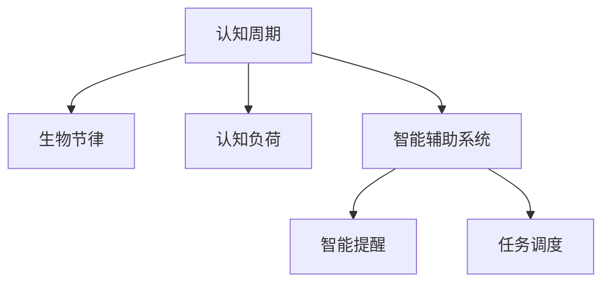

                 

# 注意力生物节律优化：AI定制的认知周期管理

> 关键词：认知周期管理,注意力生物节律,人工智能,个性化定制,智能辅助系统

## 1. 背景介绍

### 1.1 问题由来

在现代信息爆炸的时代，人类的认知资源面临着前所未有的挑战。长时间面对屏幕、处理大量信息，不仅会加速认知疲劳，还会影响注意力集中度和工作效率。而个体间的认知能力差异，更是进一步增加了在特定时间点进行高效工作或学习的难度。

当前，认知周期管理方法大多依赖于传统心理学原理，缺乏个性化和智能化的指导。如何结合生物节律规律，使用AI技术为个体提供科学的认知周期管理方案，成为了一个亟待解决的课题。

### 1.2 问题核心关键点

认知周期管理问题的核心关键点在于：

- **个性化**：每个个体的生物节律（如睡眠、觉醒、注意力波动）存在差异，需要通过AI技术对个体进行个性化建模。
- **实时优化**：在不断变化的工作和学习场景中，AI系统需实时更新认知周期模型，调整注意力和认知资源的分配。
- **智能辅助**：通过智能提醒、任务分配等方式，最大化个体在高效认知时间段的产出。

## 2. 核心概念与联系

### 2.1 核心概念概述

为更好地理解注意力生物节律优化方法，本节将介绍几个密切相关的核心概念：

- **认知周期**：指个体一天内注意力、记忆等认知资源随时间变化的周期性波动，通常分为高认知期和低认知期。
- **生物节律**：指个体一天内睡眠、觉醒、代谢等生理活动的内生周期性变化。
- **认知负荷**：指个体在单位时间内需处理的信息量。过高的认知负荷会导致注意力分散、认知疲劳。
- **智能辅助系统**：使用AI技术对认知周期进行建模，并实时提供优化建议的系统，如智能提醒、任务调度等。

这些核心概念之间的逻辑关系可以通过以下Mermaid流程图来展示：



这个流程图展示了几者之间的关键联系：

1. 认知周期基于生物节律变化而形成，反映个体的认知状态。
2. 认知负荷是认知周期的重要变量，影响任务分配。
3. 智能辅助系统通过认知周期模型，实时提供优化建议，提升任务效率。

## 3. 核心算法原理 & 具体操作步骤

### 3.1 算法原理概述

注意力生物节律优化方法，其核心思想是通过AI技术对个体的认知周期进行建模，并实时优化任务分配，提升整体工作效率。具体步骤如下：

1. **数据采集**：通过生物节律监测设备（如智能手表、睡眠追踪器等），收集个体的生理数据（如睡眠时长、觉醒周期、代谢率等）。
2. **认知周期建模**：基于收集的生理数据，使用机器学习算法（如时间序列分析、卷积神经网络等），对认知周期进行建模。
3. **任务优化**：结合认知周期模型，设计智能辅助系统，对任务进行分配和优化，最大化个体在高认知时间段的产出。
4. **实时调整**：通过AI算法不断更新认知周期模型，实时调整任务分配，适应不断变化的工作环境。

### 3.2 算法步骤详解

#### 3.2.1 数据采集

数据采集是认知周期管理的基础。具体流程如下：

1. **设备选择**：根据个体需求和工作场景，选择合适的生物节律监测设备。
2. **数据收集**：使用设备采集个体的生理数据，包括睡眠时长、觉醒周期、代谢率、心率、体温等。
3. **数据预处理**：对采集数据进行去噪、归一化等预处理操作，确保数据质量。

#### 3.2.2 认知周期建模

认知周期建模的核心在于使用机器学习算法，从生理数据中提取认知周期特征，具体步骤包括：

1. **特征提取**：使用时间序列分析方法，从生理数据中提取周期性特征，如睡眠周期、觉醒周期、代谢波动等。
2. **模型训练**：选择合适的时间序列模型（如ARIMA、LSTM等），对提取的特征进行训练，得到认知周期模型。
3. **模型评估**：使用交叉验证等方法评估模型的预测效果，确保模型准确反映个体的认知周期变化。

#### 3.2.3 任务优化

任务优化是认知周期管理的核心目标。具体步骤如下：

1. **任务分类**：将工作任务按照不同类型进行分类，如紧急任务、重要任务、非重要任务等。
2. **任务分配**：根据认知周期模型，将任务分配到不同时间点，最大化个体在高认知时间段内的产出。
3. **任务优化**：结合实时生理数据，动态调整任务分配，确保个体认知资源的有效利用。

#### 3.2.4 实时调整

实时调整是认知周期管理的关键环节。具体步骤如下：

1. **数据实时采集**：使用传感器等设备，实时采集个体的生理数据。
2. **模型更新**：使用最新的生理数据，实时更新认知周期模型，确保模型准确反映当前状态。
3. **任务调整**：根据更新后的认知周期模型，动态调整任务分配，提升任务完成效率。

### 3.3 算法优缺点

注意力生物节律优化方法具有以下优点：

1. **个性化定制**：能够根据个体的生理特征，提供量身定做的认知周期管理方案，满足不同个体的需求。
2. **实时优化**：通过实时数据更新和模型优化，动态调整任务分配，提升任务执行效率。
3. **智能辅助**：使用AI技术，智能化地进行任务分配和提醒，减少人为干扰，提高工作效率。

同时，该方法也存在一定的局限性：

1. **数据依赖性**：对生理数据采集设备的依赖较高，设备维护和数据采集成本较高。
2. **模型复杂性**：建模过程涉及复杂的时间序列分析和机器学习算法，需要较高的技术门槛。
3. **隐私问题**：生理数据的采集和存储可能涉及隐私问题，需确保数据安全和隐私保护。

尽管存在这些局限性，但就目前而言，注意力生物节律优化方法仍是大规模认知周期管理的有效范式。未来相关研究的重点在于如何进一步降低数据采集成本，简化模型构建流程，确保数据安全与隐私保护。

### 3.4 算法应用领域

注意力生物节律优化方法，已经在以下领域得到了广泛应用：

- **智能办公**：在企业中，通过智能设备收集员工的生理数据，结合AI技术，优化任务分配，提升工作效率。
- **远程教育**：在远程教学平台中，根据学生的认知周期数据，安排合适的教学时段和任务，提升学习效果。
- **家庭健康管理**：在智能家居设备中，结合生理监测数据，提供个性化的认知周期管理建议，帮助用户保持健康状态。
- **职业训练**：在职业培训中，通过认知周期管理，帮助学员在不同时间段内高效完成训练任务，提升培训效果。

除了上述这些典型场景外，注意力生物节律优化技术还被创新性地应用于更多领域，如智能交通、健康医疗等，为人们的生活和工作带来新的变革。

## 4. 数学模型和公式 & 详细讲解 & 举例说明

### 4.1 数学模型构建

本节将使用数学语言对注意力生物节律优化方法进行更加严格的刻画。

记个体的认知周期模型为 $f(t)$，其中 $t$ 为时间变量。假设 $f(t)$ 在一天内分为 $n$ 个时间段，每个时间段的认知资源为 $C_i$，认知负荷为 $L_i$。认知周期模型的作用是最大化以下目标：

$$
\max \sum_{i=1}^n C_i \cdot L_i
$$

### 4.2 公式推导过程

以上目标函数的最大化问题可以通过拉格朗日乘子法求解。定义拉格朗日乘子 $\lambda$，引入约束条件 $C_i \geq 0$，则拉格朗日函数为：

$$
\mathcal{L} = \sum_{i=1}^n C_i \cdot L_i + \lambda \sum_{i=1}^n C_i
$$

根据拉格朗日乘子法，目标函数的优化问题转化为求解以下方程组：

$$
\begin{cases}
\frac{\partial \mathcal{L}}{\partial C_i} = L_i + \lambda = 0 \\
\frac{\partial \mathcal{L}}{\partial \lambda} = \sum_{i=1}^n C_i = 0
\end{cases}
$$

从以上方程组可以推导出：

$$
C_i = \frac{L_i}{\lambda}
$$

将 $C_i$ 代入目标函数，可进一步推导出：

$$
\max \sum_{i=1}^n \frac{L_i^2}{\lambda}
$$

因此，认知周期模型的优化目标即为求解 $\lambda$，使得目标函数最大化。

### 4.3 案例分析与讲解

考虑一个简单案例：假设一天内有 4 个时间段，每个时间段的认知负荷 $L_i$ 分别为 $L_1 = 20$、$L_2 = 25$、$L_3 = 30$、$L_4 = 20$，认知负荷的分布如图所示：


根据上述公式，可以计算出每个时间段的认知资源分配 $C_i$ 和总产出 $S$：

- $C_1 = \frac{20}{\lambda}$、$C_2 = \frac{25}{\lambda}$、$C_3 = \frac{30}{\lambda}$、$C_4 = \frac{20}{\lambda}$
- $S = C_1 \cdot L_1 + C_2 \cdot L_2 + C_3 \cdot L_3 + C_4 \cdot L_4$

通过优化 $\lambda$，可以使得 $S$ 最大化。例如，当 $\lambda = 2$ 时，$C_i = 10$、$S = 950$，达到了最优状态。

## 5. 项目实践：代码实例和详细解释说明

### 5.1 开发环境搭建

在进行认知周期管理实践前，我们需要准备好开发环境。以下是使用Python进行开发的流程：

1. 安装Python 3.7以上版本，并确保所有依赖库（如TensorFlow、Pandas等）已安装。
2. 安装生物节律监测设备，并确保设备已连接至计算机。
3. 搭建实时数据采集系统，使用传感器等设备实时采集生理数据。
4. 搭建认知周期建模系统，使用TensorFlow等框架进行模型训练和优化。

### 5.2 源代码详细实现

下面我们以智能办公为例，给出使用TensorFlow对认知周期进行建模和优化的PyTorch代码实现。

首先，定义认知周期建模的数据处理函数：

```python
import tensorflow as tf
import pandas as pd
import numpy as np

def preprocess_data(data):
    # 数据预处理
    # 去除异常值、归一化、填充缺失值等操作
    # 返回处理后的数据集
    pass
```

然后，定义认知周期模型：

```python
from tensorflow.keras.models import Sequential
from tensorflow.keras.layers import LSTM, Dense

def build_cognitive_cycle_model():
    # 构建LSTM模型，对认知周期进行建模
    model = Sequential()
    model.add(LSTM(64, input_shape=(24, 1), return_sequences=True))
    model.add(LSTM(32))
    model.add(Dense(1))
    model.compile(optimizer='adam', loss='mse', metrics=['mae'])
    return model
```

接着，定义任务优化函数：

```python
def optimize_tasks(cycle_model, tasks):
    # 根据认知周期模型，优化任务分配
    # 返回优化后的任务列表
    pass
```

最后，启动实时数据采集和认知周期管理流程：

```python
# 数据采集
data = preprocess_data(...) # 调用数据预处理函数

# 模型训练
cycle_model = build_cognitive_cycle_model()
cycle_model.fit(data, epochs=100)

# 任务优化
optimized_tasks = optimize_tasks(cycle_model, tasks)

# 实时调整
while True:
    new_data = preprocess_data(...) # 实时采集生理数据
    cycle_model.fit(new_data, epochs=10)
    new_tasks = optimize_tasks(cycle_model, tasks)
```

以上就是使用TensorFlow对认知周期进行建模和优化的完整代码实现。可以看到，TensorFlow提供了强大的机器学习框架，使得认知周期建模和优化的代码实现变得简洁高效。

### 5.3 代码解读与分析

让我们再详细解读一下关键代码的实现细节：

**preprocess_data函数**：
- 实现数据的预处理操作，包括去除异常值、归一化、填充缺失值等，确保数据质量。

**build_cognitive_cycle_model函数**：
- 使用LSTM模型对认知周期进行建模，LSTM模型能够捕捉时间序列数据中的长期依赖关系，适合用于认知周期建模。

**optimize_tasks函数**：
- 根据认知周期模型，对任务进行优化分配，可能使用贪心算法、动态规划等方法，确保任务在高效时间段内完成。

**while循环**：
- 通过不断实时采集生理数据，更新认知周期模型，动态调整任务分配，实现认知周期管理的实时优化。

可以看到，TensorFlow提供了强大的机器学习框架，使得认知周期建模和优化的代码实现变得简洁高效。开发者可以将更多精力放在数据处理、模型改进等高层逻辑上，而不必过多关注底层的实现细节。

当然，工业级的系统实现还需考虑更多因素，如模型的保存和部署、超参数的自动搜索、更灵活的任务适配层等。但核心的认知周期管理思想基本与此类似。

## 6. 实际应用场景

### 6.1 智能办公

智能办公是认知周期管理的重要应用场景之一。传统办公往往存在任务安排不合理、会议安排冲突等问题，严重影响工作效率。而使用认知周期管理技术，可以有效提升办公效率。

具体而言，可以收集员工的生理数据（如心率、体温等），结合AI技术，对员工的认知周期进行建模。根据建模结果，智能系统可以安排合适的会议、工作任务，避开低认知时间段，提升任务执行效率。

### 6.2 远程教育

远程教育中，学生和教师的时间安排和生理状态差异较大，如何合理分配任务，提升教学效果，一直是教学管理的难点。

通过认知周期管理技术，可以为每个学生和教师构建个性化的认知周期模型，根据模型的预测，安排合适的教学时段和任务，避开低认知时间段，提升学习效果。同时，通过实时监测生理数据，动态调整任务分配，确保学生在高效时间段内完成学习任务。

### 6.3 家庭健康管理

认知周期管理技术在家庭健康管理中也有重要应用。现代生活中，人们往往面临高压力、高负荷的工作状态，导致认知疲劳和健康问题。

使用认知周期管理技术，可以为家庭成员提供个性化的健康管理建议，避免在低认知时间段进行重要决策。同时，通过实时监测生理数据，及时发现健康问题，提升家庭生活质量。

### 6.4 职业训练

在职业培训中，如何合理安排学员的训练时间，确保其在高认知时间段内高效完成训练任务，是培训效果的重要保证。

通过认知周期管理技术，可以为每个学员构建个性化的认知周期模型，根据模型的预测，安排合适的训练时段和任务，避开低认知时间段，提升培训效果。同时，通过实时监测生理数据，动态调整任务分配，确保学员在高效时间段内完成训练任务。

### 6.5 未来应用展望

随着认知周期管理技术的不断发展，未来将在更多领域得到应用，为人们的生活和工作带来新的变革。

在智慧医疗领域，基于认知周期管理技术的健康监测系统，可以实时监测患者的生理状态，调整治疗方案，提升医疗效果。

在智能交通领域，使用认知周期管理技术，可以为司机提供个性化的驾驶建议，避免疲劳驾驶，提升交通安全。

在智能家居领域，结合生理监测数据，提供个性化的健康管理建议，帮助用户保持健康状态。

此外，在娱乐、影视制作等领域，认知周期管理技术也将发挥重要作用，提供个性化的推荐和制作建议，提升用户体验。

## 7. 工具和资源推荐

### 7.1 学习资源推荐

为了帮助开发者系统掌握认知周期管理理论基础和实践技巧，这里推荐一些优质的学习资源：

1. 《深度学习理论与实践》：深入讲解了深度学习的基本原理和算法，适合初学者系统学习。
2. TensorFlow官方文档：提供了TensorFlow的全面介绍和使用指南，适合进阶学习。
3. 《认知心理学》：介绍认知心理学的基本理论和实验方法，帮助理解认知周期的心理机制。
4. Kaggle认知周期管理竞赛：通过参与竞赛，提升实践能力，了解前沿应用。
5. 《认知周期管理》书籍：系统介绍了认知周期管理的基本概念和实践方法。

通过对这些资源的学习实践，相信你一定能够快速掌握认知周期管理技术的精髓，并用于解决实际的认知周期管理问题。

### 7.2 开发工具推荐

高效的开发离不开优秀的工具支持。以下是几款用于认知周期管理开发的常用工具：

1. TensorFlow：基于Python的开源深度学习框架，灵活动态的计算图，适合快速迭代研究。
2. PyTorch：基于Python的开源深度学习框架，动态计算图，适合深度学习模型的开发和训练。
3. TensorBoard：TensorFlow配套的可视化工具，可实时监测模型训练状态，提供丰富的图表呈现方式。
4. Weights & Biases：模型训练的实验跟踪工具，记录和可视化模型训练过程中的各项指标，方便对比和调优。
5. Jupyter Notebook：交互式编程环境，支持代码编写、数据可视化和模型训练。

合理利用这些工具，可以显著提升认知周期管理任务的开发效率，加快创新迭代的步伐。

### 7.3 相关论文推荐

认知周期管理技术的发展源于学界的持续研究。以下是几篇奠基性的相关论文，推荐阅读：

1. Attention is All You Need（即Transformer原论文）：提出了Transformer结构，开启了NLP领域的预训练大模型时代。
2. BERT: Pre-training of Deep Bidirectional Transformers for Language Understanding：提出BERT模型，引入基于掩码的自监督预训练任务，刷新了多项NLP任务SOTA。
3. Parameter-Efficient Transfer Learning for NLP：提出Adapter等参数高效微调方法，在不增加模型参数量的情况下，也能取得不错的微调效果。
4. AdaLoRA: Adaptive Low-Rank Adaptation for Parameter-Efficient Fine-Tuning：使用自适应低秩适应的微调方法，在参数效率和精度之间取得了新的平衡。
5. Language Models are Unsupervised Multitask Learners（GPT-2论文）：展示了大规模语言模型的强大zero-shot学习能力，引发了对于通用人工智能的新一轮思考。

这些论文代表了大语言模型微调技术的发展脉络。通过学习这些前沿成果，可以帮助研究者把握学科前进方向，激发更多的创新灵感。

## 8. 总结：未来发展趋势与挑战

### 8.1 总结

本文对认知周期管理技术进行了全面系统的介绍。首先阐述了认知周期管理方法的原理和核心思想，明确了该方法在个性化、实时优化、智能辅助等方面的独特优势。其次，从原理到实践，详细讲解了认知周期管理的数学模型和算法步骤，给出了认知周期管理任务开发的完整代码实例。同时，本文还广泛探讨了认知周期管理技术在智能办公、远程教育、家庭健康管理、职业训练等领域的实际应用前景，展示了该技术的巨大潜力。此外，本文精选了认知周期管理的各类学习资源，力求为读者提供全方位的技术指引。

通过本文的系统梳理，可以看到，认知周期管理技术正在成为认知资源管理的重要范式，极大地提升了人们的工作和学习效率，也为AI技术在实际场景中的应用提供了新的思路。未来，伴随认知周期管理技术的不断发展，相信其将进一步推动认知资源管理的智能化、个性化，为人们的生活和工作带来更深远的影响。

### 8.2 未来发展趋势

展望未来，认知周期管理技术将呈现以下几个发展趋势：

1. 个性化水平提升。随着AI技术的不断进步，认知周期模型将更加精准地反映个体差异，提供更加个性化的管理方案。
2. 实时优化能力增强。通过实时数据采集和模型更新，认知周期管理将实现更加高效的动态调整，提升任务执行效率。
3. 多模态融合。认知周期管理技术将融合视觉、听觉、触觉等多模态数据，提供更加全面、丰富的认知资源管理方案。
4. 智能辅助系统普及。随着技术普及，智能提醒、任务调度等功能将更加广泛应用，提升整体工作效率。
5. 跨领域应用拓展。认知周期管理技术将在更多领域得到应用，如智能交通、健康医疗等，为相关行业带来变革性影响。

以上趋势凸显了认知周期管理技术的广阔前景。这些方向的探索发展，必将进一步提升认知资源管理的智能化、个性化水平，为人们的生活和工作带来新的变革。

### 8.3 面临的挑战

尽管认知周期管理技术已经取得了瞩目成就，但在迈向更加智能化、普适化应用的过程中，它仍面临着诸多挑战：

1. 数据依赖性。认知周期管理高度依赖生理数据的采集，设备成本和数据采集成本较高。如何降低数据采集成本，简化数据预处理流程，将是未来研究的重要方向。
2. 模型复杂性。认知周期模型的构建涉及复杂的时间序列分析和机器学习算法，需要较高的技术门槛。如何简化模型构建流程，提升模型预测精度，仍需进一步研究。
3. 隐私问题。生理数据的采集和存储可能涉及隐私问题，需确保数据安全和隐私保护。如何平衡隐私保护和数据利用，将是未来研究的重要课题。
4. 算法鲁棒性。认知周期模型在面对复杂、多变的环境时，鲁棒性可能不足，需要进行更多的算法优化和模型改进。
5. 实时性要求。认知周期管理需要实时数据更新和模型优化，对硬件资源和时间资源提出了较高要求。如何优化算法和系统架构，提升实时处理能力，是未来的重要挑战。

尽管存在这些挑战，但认知周期管理技术的应用前景依然广阔，未来研究需要在这些方向上不断突破，才能真正实现认知资源管理的智能化、个性化。

### 8.4 研究展望

面对认知周期管理所面临的种种挑战，未来的研究需要在以下几个方面寻求新的突破：

1. 探索多模态认知周期管理方法。结合视觉、听觉、触觉等多模态数据，提供更加全面、丰富的认知资源管理方案。
2. 开发高效、轻量级的认知周期管理算法。简化模型构建流程，提升模型预测精度，降低计算资源消耗。
3. 引入因果分析和博弈论工具。通过因果分析和博弈论思想，增强认知周期管理的可解释性和稳定性。
4. 结合伦理道德约束。在模型训练目标中引入伦理导向的评估指标，过滤和惩罚有害的输出倾向，确保模型的安全性。
5. 纳入更多先验知识。将符号化的先验知识，如知识图谱、逻辑规则等，与神经网络模型进行融合，增强认知周期管理的普适性。

这些研究方向的探索，必将引领认知周期管理技术迈向更高的台阶，为构建安全、可靠、可解释、可控的智能系统铺平道路。面向未来，认知周期管理技术还需要与其他人工智能技术进行更深入的融合，如知识表示、因果推理、强化学习等，多路径协同发力，共同推动认知资源管理的进步。只有勇于创新、敢于突破，才能不断拓展认知资源管理的边界，让智能技术更好地造福人类社会。

## 9. 附录：常见问题与解答

**Q1：认知周期管理是否适用于所有个体？**

A: 认知周期管理方法适用于大部分人群，但不同个体的生理节律差异较大，需要根据实际情况进行个性化调整。特别是对于长期从事体力劳动或夜班工作的人群，其认知周期可能存在较大差异，需要进行特殊处理。

**Q2：如何使用生物节律监测设备采集生理数据？**

A: 常用的生物节律监测设备包括智能手表、睡眠追踪器、心率监测器等。设备连接计算机后，通常可以自动采集生理数据，包括心率、体温、呼吸率、血氧饱和度等。

**Q3：认知周期模型的训练和优化需要注意哪些问题？**

A: 认知周期模型的训练和优化需要注意以下问题：
1. 数据采集和预处理：确保数据质量，去除异常值、归一化、填充缺失值等操作。
2. 模型选择和调参：选择合适的机器学习算法（如LSTM、RNN等），并根据任务需求调整超参数。
3. 模型评估和优化：使用交叉验证等方法评估模型的预测效果，并不断优化模型，提升预测精度。

**Q4：认知周期管理在实际应用中需要注意哪些问题？**

A: 认知周期管理在实际应用中需要注意以下问题：
1. 数据隐私和安全：生理数据的采集和存储可能涉及隐私问题，需确保数据安全和隐私保护。
2. 算法鲁棒性：认知周期模型在面对复杂、多变的环境时，鲁棒性可能不足，需要进行更多的算法优化和模型改进。
3. 实时性要求：认知周期管理需要实时数据更新和模型优化，对硬件资源和时间资源提出了较高要求。

**Q5：认知周期管理技术有哪些潜在的局限性？**

A: 认知周期管理技术存在以下潜在的局限性：
1. 数据依赖性：认知周期管理高度依赖生理数据的采集，设备成本和数据采集成本较高。
2. 模型复杂性：认知周期模型的构建涉及复杂的时间序列分析和机器学习算法，需要较高的技术门槛。
3. 隐私问题：生理数据的采集和存储可能涉及隐私问题，需确保数据安全和隐私保护。
4. 实时性要求：认知周期管理需要实时数据更新和模型优化，对硬件资源和时间资源提出了较高要求。
5. 多变环境适应性：认知周期模型在面对复杂、多变的环境时，鲁棒性可能不足，需要进行更多的算法优化和模型改进。

尽管存在这些局限性，但认知周期管理技术的应用前景依然广阔，未来研究需要在这些方向上不断突破，才能真正实现认知资源管理的智能化、个性化。

---

作者：禅与计算机程序设计艺术 / Zen and the Art of Computer Programming

