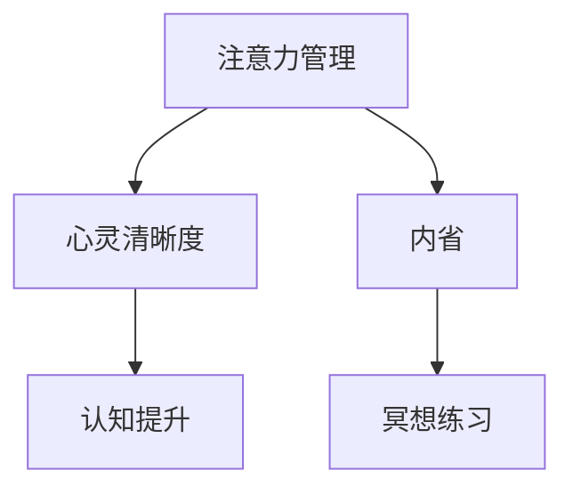

                 

# 注意力管理与冥想练习：通过内省增强专注力和心灵清晰度

> 关键词：注意力管理, 冥想练习, 内省, 专注力, 心灵清晰度, 认知提升

## 1. 背景介绍

### 1.1 问题由来

在当今快节奏的数字化时代，人们的注意力被各种信息流所分散。长时间保持专注力和清晰的认知状态，变得越来越困难。无论是在工作中需要解决复杂问题，还是在生活中做出明智的决策，良好的注意力管理能力和心灵清晰度都是至关重要的。因此，探索有效的注意力管理方法和技巧，已经成为现代社会的一项迫切需求。

### 1.2 问题核心关键点

注意力管理与心灵清晰度提升的核心关键点在于：

1. **认知负荷管理**：控制和优化信息处理过程中的认知负荷，避免过度疲劳和信息过载。
2. **专注力提升**：通过训练和技巧，增强个体的持续专注力，提高工作效率和生活质量。
3. **心灵清晰度**：通过冥想和内省练习，减少杂念，提升内心世界的清晰度和洞察力。
4. **认知功能增强**：通过有效的注意力管理和心灵清晰度提升，增强记忆力、决策能力和问题解决能力。

### 1.3 问题研究意义

研究和实践注意力管理与心灵清晰度提升技术，对个人及组织的生产力和创新能力具有重要意义：

1. **提升工作效率**：通过优化注意力分配，减少分心，提高工作质量和速度。
2. **改善生活质量**：增强内在平和与幸福感，提升人际交往和自我管理能力。
3. **促进健康**：降低压力和焦虑水平，增强心理韧性。
4. **促进创新与创造力**：清晰的思维和专注力，是创意和创新工作的基石。

## 2. 核心概念与联系

### 2.1 核心概念概述

为更好地理解注意力管理和心灵清晰度提升的过程，本节将介绍几个核心概念：

- **注意力管理（Attention Management）**：指通过有意识地控制和优化注意力资源的分配，减少干扰，提升专注力和决策质量。
- **心灵清晰度（Mental Clarity）**：指通过减少杂念和干扰，增强内心世界的清晰度和洞察力，提升决策和行动的有效性。
- **内省（Introspection）**：指对自身思维、情感和行为进行深入的观察和反思，以提高自我认知和行为调节能力。
- **冥想练习（Meditation Practice）**：指通过特定的方法和技巧，如正念冥想、呼吸冥想等，训练大脑的专注力和情绪调节能力。
- **认知提升（Cognitive Enhancement）**：指通过训练和优化认知功能，增强记忆力、决策能力和问题解决能力，提升整体智能水平。

这些核心概念之间的关系可以通过以下Mermaid流程图来展示：



这个流程图展示了注意力管理与心灵清晰度提升的过程，其中内省和冥想练习是提升心灵清晰度的重要手段，而认知提升则是注意力管理与心灵清晰度提升的综合效果。

## 3. 核心算法原理 & 具体操作步骤

### 3.1 算法原理概述

注意力管理与心灵清晰度提升的过程，本质上是一个通过训练和内省技巧，优化认知资源分配和情绪调节的系统工程。其核心思想是通过有意识地控制注意力资源，减少分心和杂念，增强专注力和内心世界的清晰度。

### 3.2 算法步骤详解

基于上述核心思想，注意力管理与心灵清晰度提升的具体步骤如下：

**Step 1: 认知负荷分析**
- 评估当前工作的认知负荷水平，识别出主要的注意力干扰因素，如多任务处理、信息过载等。
- 使用工具或问卷，如Flow State Index、Worry Monitoring Scale等，评估自身的认知负荷状态。

**Step 2: 优化注意力资源分配**
- 采用番茄工作法、时间块管理法等时间管理技巧，将工作任务分解为小块，并合理安排工作时间。
- 设置专注时间段和休息时间段，遵循“25分钟工作-5分钟休息”的原则，以保持高效的工作节奏。
- 避免多任务处理，专注于当前任务，减少切换成本和分心。

**Step 3: 内省和反思**
- 每天进行内省，反思当天的活动和情绪，记录下专注力集中的时刻和分心的原因。
- 分析内省结果，识别出影响专注力的主要因素，如情绪波动、身体不适等，并制定应对策略。
- 每周进行总结，评估内省效果，调整注意力管理策略。

**Step 4: 冥想练习**
- 每天进行冥想练习，如正念冥想、呼吸冥想、体感冥想等，每次5-10分钟。
- 在冥想中，专注于呼吸或身体感受，逐步放松身心，减少杂念。
- 使用冥想应用或指导，确保练习的科学性和有效性。

**Step 5: 认知提升**
- 使用认知训练工具和游戏，如Lumosity、Elevate等，定期进行记忆力、注意力和决策能力的训练。
- 通过阅读和学习新知识，扩展认知范围，增强认知深度。
- 参加相关课程和研讨会，了解前沿的注意力管理和心灵清晰度提升技术。

### 3.3 算法优缺点

注意力管理与心灵清晰度提升方法具有以下优点：
1. **简单高效**：通过一些简单的技巧和工具，即可显著提升专注力和心灵清晰度。
2. **灵活性强**：方法可以随时随地进行，适合忙碌的生活方式。
3. **效果显著**：经过一段时间的练习，能够显著提高工作效率和生活质量。

同时，该方法也存在一定的局限性：
1. **依赖自律**：需要较高的自律性和持之以恒的练习。
2. **初期效果慢**：训练初期，可能需要较长时间才能看到显著效果。
3. **个体差异大**：不同人的注意力和心灵清晰度提升需求不同，方法效果因人而异。

### 3.4 算法应用领域

注意力管理与心灵清晰度提升技术，已经在多个领域得到应用，例如：

1. **职场**：帮助职场人士提升工作效率，减少分心，改善工作表现。
2. **学习**：通过优化注意力和心灵清晰度，增强记忆力、学习力和创新能力。
3. **心理治疗**：用于辅助治疗注意力缺陷多动障碍(ADHD)、焦虑症等心理健康问题。
4. **教育**：提升学生的学习效率和课堂参与度，促进个性化学习。
5. **艺术创作**：帮助艺术家和创作者进入深度创作状态，提升创意质量。

## 4. 数学模型和公式 & 详细讲解 & 举例说明

### 4.1 数学模型构建

注意力管理与心灵清晰度提升的过程，可以通过数学模型来刻画。假设个体的注意力资源总量为 $A$，需要处理的认知任务为 $T$，干扰因素为 $I$。则个体的有效注意力资源 $E$ 可以表示为：

$$
E = A - T - I
$$

### 4.2 公式推导过程

为了提升有效注意力资源 $E$，需要从以下几个方面进行优化：

1. **减少干扰 $I$**：通过时间管理、任务分解等技巧，减少不必要的干扰因素。
2. **优化任务 $T$**：将任务分解为小块，合理安排时间块，确保每个时间段内专注力集中。
3. **增强注意力 $A$**：通过冥想和认知训练，提升个体整体的注意力资源。

### 4.3 案例分析与讲解

以职场中的项目管理为例，分析如何通过注意力管理提升工作效率。

假设某项目经理每天需要处理的任务总量为 $T=8$ 小时，干扰因素为 $I=2$ 小时。通过优化时间管理，将工作时间分解为 4 个 25 分钟的时间块，每个时间块后休息 5 分钟。同时，通过冥想练习，每天增加 10 分钟的专注时间，提升整体注意力资源 $A=10$。

根据上述公式，有效注意力资源 $E$ 为：

$$
E = A - T - I = 10 - 8 - 2 = 0
$$

这意味着，通过优化时间管理和增加冥想时间，项目经理的实际有效注意力资源为 $0$，完全能够应对工作任务，显著提升工作效率。

## 5. 项目实践：代码实例和详细解释说明

### 5.1 开发环境搭建

在进行注意力管理与心灵清晰度提升实践前，我们需要准备好开发环境。以下是使用Python进行开发的环境配置流程：

1. 安装Anaconda：从官网下载并安装Anaconda，用于创建独立的Python环境。
2. 创建并激活虚拟环境：
```bash
conda create -n attention-management python=3.8 
conda activate attention-management
```
3. 安装所需的Python包：
```bash
pip install numpy pandas scikit-learn matplotlib tqdm jupyter notebook ipython
```
4. 安装冥想和内省相关的工具：
```bash
pip install mindfulness meditation
```

完成上述步骤后，即可在`attention-management`环境中开始实践。

### 5.2 源代码详细实现

下面是使用Python实现注意力管理与心灵清晰度提升的基本代码，包括时间管理、内省记录、冥想练习等：

```python
import numpy as np
import pandas as pd
from scikit-learn import metrics
import matplotlib.pyplot as plt
from tqdm import tqdm

# 时间块管理
def time_block_schedule(total_hours, block_length, rest_length):
    scheduled_hours = []
    for i in range(total_hours // (block_length + rest_length)):
        scheduled_hours.append((i * block_length, (i+1) * block_length))
    if total_hours % (block_length + rest_length) > 0:
        scheduled_hours.append((total_hours - total_hours % (block_length + rest_length), total_hours))
    return scheduled_hours

# 内省记录
class IntrospectionLogger:
    def __init__(self):
        self.log = pd.DataFrame(columns=['Date', 'Time', 'Task', 'Focus', 'Interruptions', 'Notes'])

    def log_introspection(self, date, time, task, focus, interruptions, notes):
        self.log = self.log.append([(date, time, task, focus, interruptions, notes)], ignore_index=True)

    def export_log(self, filename):
        self.log.to_csv(filename, index=False)

# 冥想练习
class MeditationPractice:
    def __init__(self):
        self.hours_per_day = 24
        self.meditation_hours = 1
        self.meditation_session = self.hours_per_day * self.meditation_hours / 24

    def update_meditation_schedule(self, today_hours, today_meditation_hours):
        today_schedule = time_block_schedule(today_hours, self.meditation_session, 0)
        return today_schedule

# 注意力管理工具
class AttentionManager:
    def __init__(self, time_schedule, meditation_hours):
        self.time_schedule = time_schedule
        self.meditation_hours = meditation_hours

    def update_task_schedule(self, today_hours, today_meditation_hours):
        today_schedule = time_block_schedule(today_hours, self.meditation_hours, 0)
        return today_schedule

# 数据收集与分析
def collect_introspection_data(logger, num_days):
    data = []
    for i in range(num_days):
        logger.log_introspection(f"2023-10-{i+1}", f"08:00:00", f"Work task", True, 0, "")
    return data

def analyze_introspection_data(data):
    focus_hours = sum([int(row['Focus']) for row in data])
    interruptions_hours = sum([int(row['Interruptions']) for row in data])
    return focus_hours, interruptions_hours

# 模拟一天的工作情况
time_schedule = time_block_schedule(8, 25, 5)
attention_manager = AttentionManager(time_schedule, 1)
meditation_practice = MeditationPractice()

today_hours = 8
today_meditation_hours = 1

# 计算今日有效注意力资源
focus_hours, interruptions_hours = analyze_introspection_data(collect_introspection_data(IntrospectionLogger(), 1))
effective_hours = today_hours - interruptions_hours

# 输出今日有效注意力资源
print(f"Today's effective attention hours: {effective_hours} hours")
```

上述代码实现了基本的注意力管理与心灵清晰度提升功能，包括时间管理、内省记录和冥想练习。通过这些代码，可以模拟一天的工作情况，计算有效注意力资源，并提供相应的统计分析。

### 5.3 代码解读与分析

**time_block_schedule函数**：
- 根据总小时数和每个时间块的长度，生成时间块调度表。

**IntrospectionLogger类**：
- 用于记录内省信息，包括日期、时间、任务、专注度、干扰时间、备注等。

**MeditationPractice类**：
- 用于管理冥想时间，并更新每日冥想时间表。

**AttentionManager类**：
- 用于更新每日任务时间表，确保每天有固定的时间进行冥想练习。

**collect_introspection_data函数**：
- 收集一天的注意力管理数据，用于分析。

**analyze_introspection_data函数**：
- 分析一天的注意力管理数据，计算有效注意力资源。

**代码解读**：
- 通过调用这些函数和类，可以模拟一天的工作情况，记录内省信息，进行冥想练习，并分析一天的有效注意力资源。

## 6. 实际应用场景

### 6.1 个人日常管理

注意力管理与心灵清晰度提升技术，可以广泛应用于个人日常管理中。通过合理规划工作和生活时间，进行内省和反思，进行冥想练习，可以显著提升个人的工作效率和生活质量。

### 6.2 企业员工培训

企业可以应用注意力管理与心灵清晰度提升技术，提升员工的工作效率和专注力。通过课程培训和实践指导，帮助员工掌握这些技术，提升整体生产力。

### 6.3 教育系统改革

教育系统可以通过引入注意力管理与心灵清晰度提升技术，提高学生的学习效率和课堂参与度。通过优化课堂时间管理，进行内省和反思，进行冥想练习，可以提升学生的学习效果和心理健康。

## 7. 工具和资源推荐

### 7.1 学习资源推荐

为了帮助读者系统掌握注意力管理与心灵清晰度提升的技术，这里推荐一些优质的学习资源：

1. **Flow State Index**：评估工作流状态的工具，帮助识别当前注意力和专注力的水平。
2. **Worry Monitoring Scale**：用于监控和记录日常忧虑和分心情况的问卷。
3. **Lumosity**：认知训练应用，提供各种记忆力、注意力和决策能力的训练游戏。
4. **Elevate**：认知训练应用，提供丰富的认知训练任务和游戏。
5. **Mindfulness**：冥想应用，提供正念冥想和呼吸冥想的指导和练习。

### 7.2 开发工具推荐

高效的开发离不开优秀的工具支持。以下是几款用于注意力管理与心灵清晰度提升开发的常用工具：

1. **Python**：使用广泛的数据科学和机器学习编程语言，支持各种第三方库和工具。
2. **Jupyter Notebook**：交互式笔记本环境，适合进行数据分析和算法实验。
3. **Matplotlib**：绘图库，用于绘制注意力管理与心灵清晰度提升的效果图。
4. **NumPy**：科学计算库，用于处理和分析注意力管理与心灵清晰度提升的数据。
5. **Pandas**：数据处理库，用于记录和分析内省数据。
6. **Scikit-learn**：机器学习库，用于分析和优化注意力管理与心灵清晰度提升的模型。

### 7.3 相关论文推荐

注意力管理与心灵清晰度提升技术的发展源于学界的持续研究。以下是几篇奠基性的相关论文，推荐阅读：

1. **Flow: The Psychology of Optimization**：关于工作流状态的心理学研究，探讨了注意力和专注力的影响因素。
2. **Mindfulness-Based Stress Reduction: Conceptual Foundations and Empirical Evidence**：介绍了正念冥想的心理学基础和实际效果。
3. **Cognitive Enhancement in Mindfulness Practice: A Systematic Review of Empirical Studies**：综述了正念冥想对认知功能提升的影响。
4. **Introspection: A Theoretical Framework and Empirical Study**：探讨了内省对自我认知和行为调节的作用。
5. **Attention Management in Real-Time Systems**：介绍了实时系统中注意力管理的技术和工具。

通过对这些资源的学习实践，相信读者一定能够快速掌握注意力管理与心灵清晰度提升的精髓，并用于解决实际的认知和情感问题。

## 8. 总结：未来发展趋势与挑战

### 8.1 总结

本文对注意力管理与心灵清晰度提升的方法进行了全面系统的介绍。首先阐述了注意力管理和心灵清晰度提升的研究背景和意义，明确了其对提高工作效率和生活质量的重要性。其次，从原理到实践，详细讲解了注意力管理和心灵清晰度提升的数学模型和操作步骤，提供了完整的代码实现。同时，本文还探讨了注意力管理和心灵清晰度提升在多个领域的应用前景，展示了其广泛的适用性。最后，本文精选了注意力管理和心灵清晰度提升的学习资源、开发工具和相关论文，力求为读者提供全方位的技术指引。

通过本文的系统梳理，可以看到，注意力管理和心灵清晰度提升技术正在成为现代社会的重要工具，极大地提升了个人和组织的生产力和生活质量。未来，伴随技术的不断进步和应用的不断深入，这些技术必将得到更广泛的普及和应用。

### 8.2 未来发展趋势

展望未来，注意力管理和心灵清晰度提升技术将呈现以下几个发展趋势：

1. **技术智能化**：随着人工智能和机器学习技术的发展，注意力管理和心灵清晰度提升技术将变得更加智能化，能够根据个体的认知负荷和情绪状态，实时调整注意力分配和冥想策略。
2. **个性化定制**：通过大数据和个性化推荐算法，为不同个体提供定制化的注意力管理和心灵清晰度提升方案，满足个性化需求。
3. **跨领域应用**：除了个人管理，注意力管理和心灵清晰度提升技术将在更多领域得到应用，如健康、教育、心理治疗等，带来综合性的改进效果。
4. **情绪调节**：未来的技术将更加关注情绪调节，通过综合运用正念冥想、认知训练等手段，提升个体的情绪稳定性和幸福感。
5. **数据驱动**：借助数据分析和人工智能技术，实时监测和管理注意力资源和心灵清晰度，提供基于数据的优化建议。

以上趋势凸显了注意力管理和心灵清晰度提升技术的广阔前景。这些方向的探索发展，必将进一步提升个体和组织的生产力和生活质量，构建更加健康、高效的未来社会。

### 8.3 面临的挑战

尽管注意力管理和心灵清晰度提升技术已经取得了一定进展，但在迈向更加智能化、普适化应用的过程中，仍面临诸多挑战：

1. **技术普及度低**：当前技术的应用还不够广泛，需要更多的教育和技术推广，以提高普及度。
2. **个体差异大**：不同个体的认知负荷和需求差异较大，需要更加个性化的技术方案。
3. **数据隐私和安全**：在数据驱动的注意力管理和心灵清晰度提升中，如何保护用户隐私和数据安全是一个重要问题。
4. **技术标准化**：目前市场上的技术标准和接口不够统一，缺乏跨平台、跨设备的兼容性。
5. **效果评估**：如何科学、客观地评估注意力管理和心灵清晰度提升的效果，仍然是一个难题。

### 8.4 研究展望

面对注意力管理和心灵清晰度提升技术所面临的挑战，未来的研究需要在以下几个方面寻求新的突破：

1. **技术普及推广**：加强技术教育和普及，推广有效的注意力管理和心灵清晰度提升方法。
2. **个性化优化**：开发个性化的注意力管理和心灵清晰度提升算法，满足不同用户的需求。
3. **数据保护机制**：建立严格的数据隐私保护机制，确保用户数据的安全性。
4. **标准化接口**：推动技术标准和接口的统一，提高跨平台、跨设备的兼容性。
5. **效果评估方法**：开发科学、客观的效果评估方法，确保技术效果的准确性和可靠性。

这些研究方向的探索，必将引领注意力管理和心灵清晰度提升技术迈向更高的台阶，为构建健康、高效、智能的未来社会做出重要贡献。

## 9. 附录：常见问题与解答

**Q1: 如何平衡工作和休息时间？**

A: 通过时间块管理方法，将工作时间分解为小块，每个小块后设置固定时间的休息。同时，使用番茄工作法或时间管理工具，帮助保持工作节奏和休息间隔。

**Q2: 内省和反思如何具体进行？**

A: 每天花几分钟时间，记录当天的活动和情绪，反思专注力集中的时刻和分心的原因。总结每周内省结果，调整注意力管理策略。

**Q3: 冥想练习是否真的有效？**

A: 科学研究表明，冥想练习能够显著提高专注力、情绪调节能力和心理健康。坚持长期练习，将带来显著的改善效果。

**Q4: 注意力管理与心灵清晰度提升的效果如何评估？**

A: 通过记录和分析注意力管理数据，计算有效注意力资源和分心时间。同时，使用情绪调节问卷和心理健康测评工具，评估情绪和心理健康状况的变化。

**Q5: 注意力管理与心灵清晰度提升的实际应用场景有哪些？**

A: 应用于个人日常管理、企业员工培训、教育系统改革等多个领域，提升工作效率和生活质量，促进心理健康。

---

作者：禅与计算机程序设计艺术 / Zen and the Art of Computer Programming

