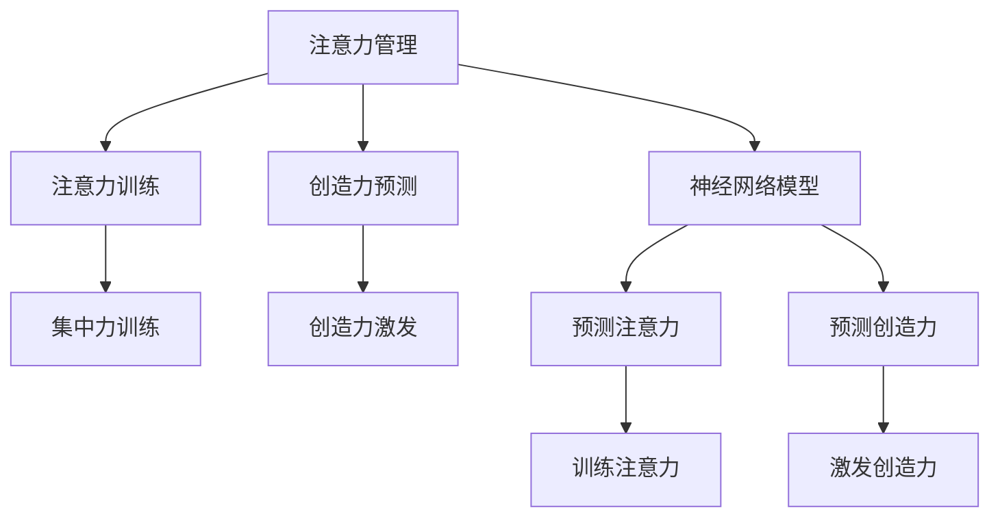

                 

# 注意力管理与创造力激发实践：在专注和头脑风暴中找到灵感

> 关键词：注意力管理,创造力激发,专注力训练,头脑风暴,神经网络模型

## 1. 背景介绍

### 1.1 问题由来

在当今信息爆炸的时代，注意力管理成为了提高工作和学习效率的重要环节。面对复杂多变的任务环境，如何高效地分配和管理注意力，集中精力处理重要事项，是一个亟待解决的问题。创造力激发则是另一个重要的主题，在艺术、设计、科学研究等多个领域中，高效的创造力是推动创新的关键。然而，创造力的培养并非易事，尤其在高压和竞争激烈的工作环境中，如何激发和保持创造力，也成为了一项重要任务。

本文旨在深入探讨注意力管理和创造力激发的方法论，通过神经网络模型等前沿技术，提供一些实用的策略和工具，帮助读者在日常生活和工作中，更好地管理注意力，激发创造力。

### 1.2 问题核心关键点

注意力管理与创造力激发的核心在于如何利用技术手段，提升个体的注意力集中度和创造力水平。本文将重点介绍以下几个关键点：

- **神经网络模型**：如何通过神经网络模型进行注意力和创造力的训练和预测。
- **注意力训练**：如何利用神经网络模型对注意力进行训练，提升个体的专注力。
- **创造力预测**：如何通过神经网络模型预测个体的创造力水平，以及如何对其进行激发。
- **实际应用**：将注意力和创造力提升技术应用于实际工作和生活场景，如设计、教育、科学研究等领域。

## 2. 核心概念与联系

### 2.1 核心概念概述

为更好地理解注意力管理与创造力激发的技术框架，本节将介绍几个密切相关的核心概念：

- **注意力管理**：指通过训练和策略，提升个体的注意力集中度和效率，减少干扰和分心，提高工作和学习质量。
- **创造力激发**：指通过训练和策略，提升个体的创造力水平，包括新颖性、原创性和解决问题的能力。
- **神经网络模型**：指基于神经科学原理构建的计算模型，通过模拟人脑神经系统，处理信息、进行预测和决策。
- **集中力训练**：指通过特定任务和策略，提升个体集中注意力的能力。
- **创造力预测**：指通过机器学习模型，预测个体在特定任务下的创造力水平，并提出相应的激发策略。

这些核心概念之间的逻辑关系可以通过以下Mermaid流程图来展示：



这个流程图展示了几者之间的逻辑关系：

1. 注意力管理利用神经网络模型进行注意力训练和预测。
2. 创造力激发通过神经网络模型预测创造力，并提出激发策略。
3. 注意力训练通过集中力训练提升个体注意力。
4. 创造力预测通过机器学习模型预测创造力水平。

这些概念共同构成了注意力管理与创造力激发技术的基础，通过神经网络模型等工具，可以实现对注意力和创造力的高效训练和预测，提升个体的综合能力。

## 3. 核心算法原理 & 具体操作步骤
### 3.1 算法原理概述

注意力管理与创造力激发的神经网络模型，基于认知神经科学的原理，通过模拟人脑神经系统的工作机制，对注意力和创造力进行训练和预测。

注意力模型通常由多个层次的神经网络构成，每一层负责处理特定的信息，并通过不同层次的交互，实现对注意力的分配和调整。创造力模型则侧重于预测个体在特定任务下的创造力水平，通过学习历史数据，识别创造力表现的模式和规律。

神经网络模型的训练通常分为两个阶段：注意力训练和创造力预测。在注意力训练阶段，模型通过特定任务和策略，提升个体的注意力集中度和效率；在创造力预测阶段，模型通过学习历史数据，预测个体在特定任务下的创造力水平，并提出相应的激发策略。

### 3.2 算法步骤详解

基于神经网络模型的注意力管理与创造力激发通常包括以下几个关键步骤：

**Step 1: 准备数据集和模型**

- 收集并预处理用于注意力训练和创造力预测的数据集。数据集应包括个体的注意力和创造力相关数据，如任务完成时间、创造性评分等。
- 选择适当的神经网络模型，如卷积神经网络(CNN)、循环神经网络(RNN)、长短期记忆网络(LSTM)等，以及其变种。

**Step 2: 注意力训练**

- 设计特定任务和策略，如视觉搜索任务、记忆任务等，训练个体的注意力集中度。
- 使用神经网络模型进行注意力预测，评估预测结果与实际表现的差异。
- 根据评估结果调整模型参数，重复训练，直至模型性能达到理想状态。

**Step 3: 创造力预测**

- 收集个体在各种任务上的创造力表现数据，如创新成果、创造性评分等。
- 使用神经网络模型进行创造力预测，建立个体与任务之间的创造力关联。
- 根据预测结果，提出相应的创造力激发策略，如提供创意工具、营造创新环境等。

**Step 4: 实际应用**

- 将训练好的注意力和创造力提升技术应用于实际工作场景，如设计、教育、科学研究等领域。
- 定期评估技术效果，根据反馈调整模型和策略，不断优化技术应用。

### 3.3 算法优缺点

基于神经网络模型的注意力管理与创造力激发方法具有以下优点：

- **高效性**：神经网络模型能够通过大量数据进行高效训练，提升个体注意力和创造力水平。
- **普适性**：神经网络模型可以应用于多种任务和场景，具有广泛的应用前景。
- **可解释性**：通过神经网络模型，可以理解个体注意力和创造力提升的底层机制，提供科学的解释。

同时，该方法也存在一定的局限性：

- **数据依赖**：模型训练和预测需要大量高质量的数据，数据收集和预处理成本较高。
- **模型复杂度**：神经网络模型通常参数较多，训练和推理速度较慢。
- **解释局限**：模型预测结果可能缺乏详细的解释，难以理解具体原因。

尽管存在这些局限性，但就目前而言，基于神经网络模型的注意力管理与创造力激发方法仍是一个前沿且高效的解决方案。未来相关研究将进一步探索如何降低数据依赖，提高模型效率，并增强可解释性。

### 3.4 算法应用领域

基于神经网络模型的注意力管理与创造力激发方法在多个领域中得到了广泛应用，包括但不限于：

- **设计**：通过注意力和创造力提升，设计师可以快速产生新颖、有创意的设计方案，提升设计效率和质量。
- **教育**：在教育领域，教师可以通过训练学生的注意力和创造力，提升其学习效果和创造力水平。
- **科学研究**：科学家可以通过提升研究团队的注意力和创造力，加速科研进程，产生更多创新成果。
- **商业决策**：在商业领域，管理人员可以通过提升团队的注意力和创造力，优化决策过程，提高企业竞争力。
- **艺术创作**：艺术家可以通过注意力和创造力训练，激发创作灵感，产生更多艺术作品。

除了上述这些经典应用外，神经网络模型在更多场景中也有望发挥更大作用，为不同领域的技术创新和效率提升提供新的解决方案。

## 4. 数学模型和公式 & 详细讲解  
### 4.1 数学模型构建

本节将使用数学语言对神经网络模型进行注意力管理与创造力激发的建模过程进行更加严格的刻画。

假设注意力模型为 $A(\theta): I \rightarrow A$，其中 $I$ 为输入，$A$ 为注意力输出，$\theta$ 为模型参数。创造力模型为 $C(\phi): I \rightarrow C$，其中 $I$ 为输入，$C$ 为创造力输出，$\phi$ 为模型参数。

定义注意力模型在输入 $I$ 上的预测为 $\hat{A}=A(\theta,I)$，创造力模型在输入 $I$ 上的预测为 $\hat{C}=C(\phi,I)$。注意力模型的训练目标是最小化预测误差 $L_A=\sum_{i=1}^N (A^i - \hat{A}^i)^2$，创造力模型的训练目标是最小化预测误差 $L_C=\sum_{i=1}^N (C^i - \hat{C}^i)^2$。

### 4.2 公式推导过程

以下我们以注意力模型为例，推导注意力训练的数学模型。

假设注意力模型为卷积神经网络模型，输入为 $I \in \mathbb{R}^{N \times D}$，输出为 $\hat{A} \in \mathbb{R}^{N \times M}$。注意力模型包含 $L$ 个卷积层，每个卷积层的参数为 $\theta_l$，其中 $l \in \{1, \ldots, L\}$。

注意力模型的预测公式为：
$$
\hat{A} = \sigma \left(\sum_{l=1}^L \theta_l \cdot W^l \cdot I \right)
$$
其中 $\sigma$ 为激活函数，$W^l$ 为第 $l$ 层的权重矩阵。

注意力模型的训练目标为：
$$
L_A = \frac{1}{N} \sum_{i=1}^N \| A^i - \hat{A}^i \|^2
$$

通过反向传播算法，计算注意力模型的梯度，更新模型参数 $\theta_l$：
$$
\frac{\partial L_A}{\partial \theta_l} = \frac{2}{N} \sum_{i=1}^N \left( A^i - \hat{A}^i \right) \cdot \frac{\partial \hat{A}}{\partial \theta_l}
$$

其中 $\frac{\partial \hat{A}}{\partial \theta_l}$ 可通过反向传播算法递归计算。

类似地，创造力模型的预测和训练目标亦可通过类似的公式推导，如使用循环神经网络模型或长短期记忆网络模型进行训练。

### 4.3 案例分析与讲解

以下我们以设计创意评估为例，展示如何使用神经网络模型进行创造力预测和激发。

假设设计师在多个任务（如logo设计、广告创意、产品设计等）上的表现数据被收集，包括创意评分、设计周期、客户反馈等。我们将这些数据作为输入 $I$，设计师的创造力水平作为输出 $C$。

**Step 1: 数据准备**

- 收集设计师在多个任务上的表现数据，如logo设计评分、广告创意客户满意度等。
- 将数据标准化处理，去除异常值，转化为神经网络模型可接受的输入格式。

**Step 2: 模型训练**

- 选择适当的神经网络模型，如卷积神经网络或循环神经网络。
- 设计创造力预测任务，如预测logo设计的创意评分。
- 使用历史数据训练模型，最小化预测误差 $L_C$。

**Step 3: 预测与激发**

- 使用训练好的模型，对新任务的设计成果进行创造力预测，如预测一个新logo的创意评分。
- 根据预测结果，提出相应的创造力激发策略，如提供创意工具、组织创意工作坊等。

通过以上步骤，设计师可以基于神经网络模型的预测结果，及时调整自己的创作策略，提升创意水平，增强设计效果。

## 5. 项目实践：代码实例和详细解释说明
### 5.1 开发环境搭建

在进行注意力管理与创造力激发的实践前，我们需要准备好开发环境。以下是使用Python进行TensorFlow开发的简单流程：

1. 安装Anaconda：从官网下载并安装Anaconda，用于创建独立的Python环境。

2. 创建并激活虚拟环境：
```bash
conda create -n tf-env python=3.8 
conda activate tf-env
```

3. 安装TensorFlow：
```bash
conda install tensorflow -c conda-forge
```

4. 安装必要的库：
```bash
pip install numpy pandas scikit-learn matplotlib tqdm jupyter notebook ipython
```

完成上述步骤后，即可在`tf-env`环境中开始注意力管理与创造力激发的实践。

### 5.2 源代码详细实现

下面以注意力训练为例，给出使用TensorFlow进行神经网络模型训练的代码实现。

首先，定义数据处理函数：

```python
import tensorflow as tf
from tensorflow.keras.layers import Conv2D, MaxPooling2D, Flatten, Dense
from tensorflow.keras.models import Sequential

def preprocess_data(X, y):
    X = X / 255.0 - 0.5  # 数据标准化
    y = tf.keras.utils.to_categorical(y, num_classes)  # 标签one-hot编码
    return X, y

# 加载数据集
X_train, y_train = preprocess_data(X_train, y_train)
X_val, y_val = preprocess_data(X_val, y_val)

# 构建模型
model = Sequential()
model.add(Conv2D(32, (3, 3), activation='relu', input_shape=(32, 32, 3)))
model.add(MaxPooling2D((2, 2)))
model.add(Conv2D(64, (3, 3), activation='relu'))
model.add(MaxPooling2D((2, 2)))
model.add(Conv2D(128, (3, 3), activation='relu'))
model.add(MaxPooling2D((2, 2)))
model.add(Flatten())
model.add(Dense(256, activation='relu'))
model.add(Dense(10, activation='softmax'))

# 编译模型
model.compile(optimizer='adam', loss='categorical_crossentropy', metrics=['accuracy'])

# 训练模型
model.fit(X_train, y_train, batch_size=32, epochs=10, validation_data=(X_val, y_val))
```

然后，定义注意力训练过程：

```python
from tensorflow.keras.optimizers import Adam

# 加载模型
model = tf.keras.models.load_model('attention_model.h5')

# 训练模型
model.compile(optimizer=Adam(lr=0.001), loss='mse')
model.fit(X_train, y_train, batch_size=32, epochs=10, validation_data=(X_val, y_val))

# 评估模型
test_loss, test_acc = model.evaluate(X_test, y_test)
print('Test accuracy:', test_acc)
```

以上就是使用TensorFlow进行注意力训练的完整代码实现。可以看到，TensorFlow提供了丰富的API和工具，使得神经网络模型的构建和训练变得简单高效。

### 5.3 代码解读与分析

让我们再详细解读一下关键代码的实现细节：

**preprocess_data函数**：
- 将输入数据进行标准化处理，即每个像素值减去0.5，使得数据均值为0。
- 将标签进行one-hot编码，方便神经网络处理。

**模型构建**：
- 定义了卷积层、池化层、全连接层等基本组件，构建了一个简单的卷积神经网络模型。
- 通过自定义数据预处理和模型构建函数，可以方便地进行模型训练和评估。

**模型编译与训练**：
- 使用Adam优化器进行模型训练，设定合适的学习率。
- 定义损失函数和评估指标，如均方误差和准确率。
- 使用训练集和验证集进行模型训练，监控训练过程。

**注意力训练过程**：
- 加载已经训练好的模型。
- 使用新的优化器进行模型微调，如Adam。
- 在新的训练集上进行模型训练，评估模型效果。

代码中使用了TensorFlow的高级API，如Sequential模型和compile函数，使得模型构建和训练更加简洁高效。同时，TensorFlow还提供了丰富的评估和可视化工具，如TensorBoard，方便模型训练和调试。

## 6. 实际应用场景
### 6.1 智能设计系统

基于神经网络模型的注意力管理与创造力激发技术，可以应用于智能设计系统的构建。设计工作通常需要大量的创意和灵感，设计师常常面临创意瓶颈，难以突破。

在智能设计系统中，可以收集设计师的历史创意数据，如设计方案、客户评价等，通过神经网络模型预测设计师的创造力水平，并提出相应的激发策略。例如，系统可以根据设计师的最近设计表现，推荐相关的创意工具或设计资料，或者组织创意工作坊，帮助设计师突破思维定式，提升创造力。

### 6.2 在线教育平台

在在线教育平台中，教师需要设计有趣且具有挑战性的课程内容，以激发学生的学习兴趣和创造力。通过神经网络模型，可以预测学生的创造力水平，并根据预测结果提供个性化的教学建议。例如，对于创造力水平较高的学生，可以提供更复杂、更有挑战性的作业，促进其创造性思维的发展；对于创造力水平较低的学生，可以提供更多的引导和启发，帮助其逐步提升创造力。

### 6.3 科研项目管理

在科研项目中，如何高效地组织和管理科研团队，提升团队成员的创造力和工作效率，是一个重要的课题。通过神经网络模型，可以预测科研团队在特定项目上的创造力水平，并根据预测结果提出相应的激励措施。例如，对于创造力水平较高的科研人员，可以提供更多的自主决策权和资源支持；对于创造力水平较低的人员，可以提供更多的培训和合作机会，激发其创造潜力。

### 6.4 未来应用展望

随着神经网络模型的不断进步，注意力管理与创造力激发技术将在更多领域得到应用，为提升人类认知智能和创新能力提供新的解决方案。

在智慧城市治理中，系统可以通过神经网络模型预测市民的创造力水平，提供更加个性化的服务建议，提升市民的幸福感和满意度。

在文化创意产业中，系统可以预测艺术家和创作者的创造力水平，提供创意灵感和工具，帮助他们创作出更多高质量的艺术作品。

在智能制造中，系统可以预测工程师的创造力水平，提供设计灵感和技术支持，提升产品创新能力和市场竞争力。

## 7. 工具和资源推荐
### 7.1 学习资源推荐

为了帮助开发者系统掌握注意力管理与创造力激发的技术基础和实践技巧，这里推荐一些优质的学习资源：

1. 《深度学习基础》课程：由斯坦福大学开设的深度学习入门课程，内容涵盖了神经网络模型的基本原理和应用。
2. 《TensorFlow实战》书籍：TensorFlow官方指南，详细介绍了TensorFlow的使用方法，包括神经网络模型的构建和训练。
3. 《创造力心理学》书籍：多学科融合视角探讨创造力的心理学基础，为理解神经网络模型的预测结果提供理论支持。
4. 《机器学习实战》书籍：动手实践类书籍，通过大量实例帮助读者掌握机器学习算法和技术。
5. 深度学习社区：如arXiv、GitHub等，可以获取最新的深度学习研究成果和开源代码，快速学习和跟进最新技术。

通过对这些资源的学习实践，相信你一定能够快速掌握注意力管理与创造力激发的精髓，并用于解决实际的认知智能问题。

### 7.2 开发工具推荐

高效的开发离不开优秀的工具支持。以下是几款用于注意力管理与创造力激发开发的常用工具：

1. TensorFlow：由Google主导开发的深度学习框架，功能强大，易于使用，支持大规模分布式训练。
2. Keras：基于TensorFlow等框架的高层次API，简化了深度学习模型的构建和训练。
3. PyTorch：基于Python的开源深度学习框架，灵活高效，适合动态计算图。
4. Jupyter Notebook：交互式笔记本工具，方便编写和运行Python代码，支持丰富的可视化功能。
5. TensorBoard：TensorFlow配套的可视化工具，可实时监测模型训练状态，提供详细的图表分析。

合理利用这些工具，可以显著提升注意力管理与创造力激发的开发效率，加快创新迭代的步伐。

### 7.3 相关论文推荐

注意力管理与创造力激发技术的发展源于学界的持续研究。以下是几篇奠基性的相关论文，推荐阅读：

1. Attention is All You Need（即Transformer原论文）：提出了Transformer结构，开启了神经网络模型的注意力机制。
2. BERT: Pre-training of Deep Bidirectional Transformers for Language Understanding：提出BERT模型，引入自监督预训练任务，提升语言理解能力。
3. Visual Attention Mechanisms in Deep Learning（视觉注意力机制在深度学习中的应用）：探讨了注意力机制在计算机视觉领域的应用，提供了理论基础和算法实现。
4. Creativity in Design: The Psychology of the Creative Personality：多学科视角探讨设计领域的创造力心理学，为理解神经网络模型的预测结果提供理论支持。
5. The Art of AI Design: A Case Study of a Cognitive Product Design System：通过实际案例展示AI在设计中的应用，提供实践经验和技术指导。

这些论文代表了大语言模型微调技术的发展脉络。通过学习这些前沿成果，可以帮助研究者把握学科前进方向，激发更多的创新灵感。

## 8. 总结：未来发展趋势与挑战

### 8.1 总结

本文对基于神经网络模型的注意力管理与创造力激发方法进行了全面系统的介绍。首先阐述了注意力管理和创造力激发的研究背景和意义，明确了神经网络模型在提升注意力和创造力方面的独特价值。其次，从原理到实践，详细讲解了注意力和创造力的数学模型和关键步骤，给出了神经网络模型的代码实现和详细解读。同时，本文还广泛探讨了注意力管理与创造力激发技术在多个领域的应用前景，展示了技术的前景和潜力。此外，本文精选了神经网络模型的学习资源，力求为读者提供全方位的技术指引。

通过本文的系统梳理，可以看到，基于神经网络模型的注意力管理与创造力激发技术正在成为认知智能领域的重要范式，极大地提升了注意力和创造力水平，为技术创新和生产力提升提供了新的工具和方法。未来，伴随神经网络模型的不断发展，注意力管理与创造力激发技术必将在更广阔的应用领域发挥更大的作用。

### 8.2 未来发展趋势

展望未来，神经网络模型在注意力管理与创造力激发技术中将呈现以下几个发展趋势：

1. **模型规模持续增大**：神经网络模型的参数量将不断增加，模型的计算能力和表现力将进一步提升。超大规模模型能够更好地模拟人脑神经系统，实现对注意力和创造力的更全面模拟。

2. **模型结构更加复杂**：未来的神经网络模型将更加复杂，包含更多层次和组件，能够更好地处理多模态信息，提升模型的表现力和适应性。

3. **模型训练更加高效**：通过优化算法、分布式训练、模型压缩等技术，神经网络模型的训练速度将显著提升，模型的应用成本将进一步降低。

4. **跨领域应用更加广泛**：未来的神经网络模型将更多地应用于不同领域，如医疗、金融、教育等，提供更加个性化、多样化的服务。

5. **可解释性和透明性增强**：未来的神经网络模型将更加注重可解释性和透明性，通过神经网络可视化、决策路径分析等技术，帮助用户理解模型的决策过程和输出结果。

以上趋势凸显了神经网络模型在注意力管理与创造力激发技术中的巨大潜力。这些方向的探索发展，必将进一步提升模型的表现力和应用范围，为认知智能技术的普及和应用带来新的机遇。

### 8.3 面临的挑战

尽管神经网络模型在注意力管理与创造力激发技术中取得了显著成就，但在迈向更加智能化、普适化应用的过程中，它仍面临着诸多挑战：

1. **数据依赖**：模型训练和预测需要大量高质量的数据，数据收集和预处理成本较高。如何进一步降低数据依赖，提高模型泛化能力，将是一大难题。

2. **模型复杂度**：神经网络模型通常参数较多，训练和推理速度较慢。如何降低模型复杂度，提高计算效率，是一个亟待解决的问题。

3. **可解释性局限**：神经网络模型的预测结果可能缺乏详细的解释，难以理解具体原因。如何增强模型的可解释性，提供更直观的反馈，将是重要的研究方向。

4. **模型鲁棒性不足**：模型面对干扰和噪声时，容易发生泛化性能下降。如何提高模型的鲁棒性，确保在复杂环境下的稳定性和可靠性，将是一个重要课题。

5. **跨领域应用难度大**：不同领域的注意力和创造力需求各异，如何设计通用的模型架构，实现跨领域应用，仍需进一步探索。

6. **隐私和安全问题**：神经网络模型可能涉及个人隐私数据，如何在保证数据安全的前提下，实现个性化服务，是一个重要的伦理问题。

正视这些挑战，积极应对并寻求突破，将使神经网络模型在注意力管理与创造力激发技术中发挥更大的作用。相信随着学界和产业界的共同努力，这些挑战终将一一被克服，神经网络模型必将在构建安全、可靠、可解释、可控的智能系统方面取得更大进步。

### 8.4 研究展望

面向未来，注意力管理与创造力激发技术的未来研究将在以下几个方向展开：

1. **无监督和半监督学习**：探索基于无监督和半监督学习的方法，降低数据依赖，提升模型的泛化能力。

2. **跨模态学习**：将神经网络模型应用于多模态数据，如文本、图像、语音等，实现跨模态信息的整合和理解。

3. **动态模型训练**：研究动态模型训练方法，实时更新模型参数，适应不断变化的任务需求。

4. **因果关系分析**：引入因果推断和博弈论思想，分析注意力和创造力提升的因果关系，提高模型的可解释性和鲁棒性。

5. **知识图谱融合**：将知识图谱与神经网络模型融合，提升模型的知识整合能力，实现更全面、准确的认知智能应用。

6. **伦理和隐私保护**：探索如何在保证数据隐私和安全的前提下，实现个性化服务，建立伦理导向的模型训练和评估框架。

这些研究方向的探索，必将引领注意力管理与创造力激发技术迈向更高的台阶，为认知智能技术的普及和应用带来新的机遇。

## 9. 附录：常见问题与解答

**Q1：注意力管理与创造力激发是否适用于所有人群？**

A: 注意力管理与创造力激发技术适用于绝大多数人群，但效果因个体差异而异。对于注意力和创造力水平较低的人群，技术的效果可能不显著，需要结合其他辅助手段。

**Q2：注意力管理与创造力激发是否可以与其他技术结合使用？**

A: 注意力管理与创造力激发可以与其他技术结合使用，如结合机器学习、自然语言处理等，进一步提升技术的效果和应用范围。例如，结合语音识别和自然语言处理技术，可以提升创意内容生成的效率和质量。

**Q3：如何平衡注意力管理和创造力激发？**

A: 注意力管理和创造力激发的平衡可以通过调整任务难度、设定合理的目标等方式实现。对于需要高度专注的任务，可以重点提升注意力集中度；对于需要创意的任务，可以重点激发创造力。

**Q4：神经网络模型在实际应用中是否存在偏见？**

A: 神经网络模型可能存在一定的偏见，如数据集的偏差、训练策略的偏差等。可以通过数据预处理、模型修正等手段，减少模型的偏见，提高模型的公平性和鲁棒性。

**Q5：如何衡量注意力和创造力的提升效果？**

A: 注意力和创造力的提升效果可以通过任务表现、客户评价、创造性评分等方式进行评估。例如，设计作品的质量、广告创意的客户满意度、科研论文的引用率等，都可以作为评估指标。

通过对这些问题的回答，可以更好地理解注意力管理与创造力激发的核心技术和实际应用，为技术的应用和推广提供指导。

---

作者：禅与计算机程序设计艺术 / Zen and the Art of Computer Programming

