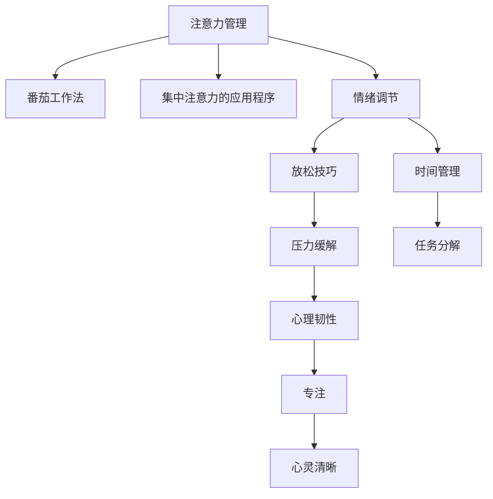

                 

# 注意力管理与压力管理：在压力和焦虑中保持专注和心灵清晰

> 关键词：注意力管理,压力管理,焦虑,专注,心灵清晰

## 1. 背景介绍

在信息爆炸和竞争激烈的现代社会中，人们常常处于高度紧张和焦虑的状态。长时间的注意力分散、精神压力和情绪波动不仅影响个人的心理健康，还阻碍了工作效率和生活质量。为了有效应对这些问题，本文将探讨注意力管理与压力管理的方法，通过科学的技术手段和实践策略，帮助人们在压力和焦虑中保持专注和心灵清晰。

### 1.1 问题由来
随着信息技术的发展，我们的生活节奏日益加快，工作与生活的界限逐渐模糊。电子设备的普及让人们随时随地都能接触到海量信息，但这种持续的干扰和刺激反而使我们的注意力更加分散，心理压力增大。

在工作场所，项目截止日期、团队合作、工作业绩的考核等压力因素，导致人们需要长时间投入工作，精神高度紧张。长此以往，极易引发焦虑、抑郁等心理问题。

### 1.2 问题核心关键点
为了在压力和焦虑中保持专注和心灵清晰，需要从注意力管理和压力管理两个层面综合施策。具体来说：

1. **注意力管理**：是指通过科学的方法和工具，提高个体对注意力的控制能力，使其能够在复杂环境中保持高效和专注。
2. **压力管理**：通过有效的压力应对策略和缓解方法，降低心理压力，增强心理韧性，维护心理健康。

## 2. 核心概念与联系

### 2.1 核心概念概述

为了更好地理解注意力管理和压力管理的内涵与联系，本节将介绍几个核心概念及其相互关系：

- **注意力管理**：通过各种技术手段，如番茄工作法、集中注意力的应用程序等，帮助个体提升注意力的集中度，避免分心。
- **压力管理**：通过放松技巧、时间管理、情绪调节等方法，减轻心理压力，提升心理韧性。
- **焦虑**：一种常见的情绪状态，表现为紧张、不安、恐惧等，严重时会影响个体的生活和工作。
- **专注**：指个体能够全神贯注于某项任务，不受外界干扰的状态。
- **心灵清晰**：指个体在心理上感到平静、清晰、无杂念，能够有效地处理信息和任务。

这些核心概念之间的逻辑关系可以通过以下Mermaid流程图来展示：



这个流程图展示了注意力管理和压力管理的相关概念及其相互联系：

1. 注意力管理通过技术手段提升个体对注意力的控制。
2. 压力管理通过情绪调节、放松技巧、时间管理等策略，减轻个体心理压力。
3. 焦虑的缓解是注意力管理和压力管理的共同目标，有助于提升专注力和心灵清晰度。
4. 专注和心灵清晰是注意力管理和压力管理最终希望达到的成果，能够提升个体的工作和生活质量。

## 3. 核心算法原理 & 具体操作步骤
### 3.1 算法原理概述

注意力管理和压力管理的核心算法原理主要涉及时间管理、情绪调节、行为训练等技术。这些方法通过科学的心理实验和行为学原理，帮助个体提高注意力集中度，缓解压力和焦虑，最终实现专注和心灵清晰。

### 3.2 算法步骤详解

注意力管理和压力管理的步骤大致分为以下几个环节：

**Step 1: 评估当前状态**

- 使用心理测试和问卷评估当前的注意力水平、压力等级和焦虑程度。
- 收集日常工作和生活中的压力来源和注意力分散的具体事件。

**Step 2: 制定个性化计划**

- 根据评估结果，制定针对性的注意力提升计划，如使用番茄工作法、引入集中注意力的应用程序等。
- 制定压力缓解计划，包括情绪调节、放松技巧、时间管理和任务分解等。

**Step 3: 实施和监控**

- 严格执行制定的计划，并使用时间记录工具、情绪追踪应用等进行自我监控。
- 定期评估注意力水平和心理压力的变化，调整计划以适应实际情况。

**Step 4: 持续优化**

- 根据实际情况和反馈，不断优化注意力管理与压力管理策略，提升效果。
- 记录并分析长期以来的行为数据，形成持续改进的机制。

### 3.3 算法优缺点

注意力管理和压力管理的方法具有以下优点：

1. **科学依据**：基于心理学、行为学原理，经过科学实验验证，方法可靠。
2. **普适性强**：适用于各种工作和生活场景，不受个体差异限制。
3. **可操作性强**：操作简单，无需特殊设备，易于执行。
4. **效果显著**：长期坚持可显著提升个体的工作效率和生活质量。

同时，这些方法也存在一些局限性：

1. **需要持续投入**：效果显著但需要持之以恒的练习和调整，难以一蹴而就。
2. **个体差异**：不同个体对不同方法的反应可能不同，需要灵活调整。
3. **外界干扰**：工作、生活环境的变化可能影响方法效果，需要适应性调整。

### 3.4 算法应用领域

注意力管理和压力管理的技术广泛应用于以下领域：

- **职场管理**：帮助企业员工提升工作效率，减少因注意力分散和压力导致的误工、延误等问题。
- **学习辅导**：通过提高学生的注意力集中度和缓解学习压力，提升学习效果和兴趣。
- **心理健康**：辅助心理健康服务，为焦虑、抑郁等心理障碍患者提供辅助治疗。
- **家庭教育**：帮助家长提升与孩子的互动质量，改善家庭关系。
- **自我管理**：帮助个人提升自我管理和时间管理能力，实现更好的生活和工作平衡。

## 4. 数学模型和公式 & 详细讲解  
### 4.1 数学模型构建

注意力管理和压力管理的数学模型构建主要基于行为学和心理学的研究成果，通过量化个体行为数据和心理状态，实现对注意力和压力的管理。

### 4.2 公式推导过程

以下我们将以情绪调节为例，推导用于情绪缓解的公式。

假设个体当前情绪状态为 $X$，通过情绪调节方法（如深呼吸、冥想等），情绪状态变为 $Y$。情绪调节的效果可以用公式表示为：

$$
Y = f(X, t)
$$

其中 $f$ 表示情绪调节函数，$t$ 表示调节的时间。情绪调节函数 $f$ 可以根据不同的调节方法进行调整，例如深呼吸方法可以通过以下公式表示：

$$
f_{\text{深呼吸}} = \frac{X}{1 + e^{-\alpha(X-X_0)}}
$$

其中 $X_0$ 为深呼吸前的情绪基线，$\alpha$ 为调节参数，表示情绪调节的强度。该公式的物理意义为，随着深呼吸时间的增加，情绪状态 $X$ 逐渐接近情绪基线 $X_0$。

### 4.3 案例分析与讲解

以深呼吸方法为例，分析其情绪调节效果。假设某人在紧张工作后情绪状态为 $X_1$，通过深呼吸 $t_1$ 分钟后，情绪状态变为 $Y_1$。根据公式 $Y = f(X, t)$ 和 $f_{\text{深呼吸}}$，可以计算调节后的情绪状态：

$$
Y_1 = f_{\text{深呼吸}}(X_1, t_1)
$$

如果选择合适的时间 $t_1$ 和参数 $\alpha$，可以显著降低个体的情绪紧张度，提高其工作效率和心理韧性。

## 5. 项目实践：代码实例和详细解释说明
### 5.1 开发环境搭建

为了进行注意力管理和压力管理的实践，需要搭建适合的开发环境。以下是搭建环境的详细步骤：

1. 安装Python：从官网下载Python 3.8以上的版本，并添加到系统 PATH。
2. 安装Pip：使用命令行安装pip，并确保pip版本在20以上。
3. 安装相关库：使用Pip安装必要的库，如Pandas、NumPy、Matplotlib等。
4. 搭建工具：使用Pip安装Time Tracker（用于时间记录）和Mood Tracker（用于情绪追踪）等应用，并确保其正常运行。

### 5.2 源代码详细实现

以下是使用Python进行注意力管理与压力管理实践的代码实现：

```python
import pandas as pd
import numpy as np
import matplotlib.pyplot as plt

# 数据集读取
data = pd.read_csv('time_log.csv')
mood_data = pd.read_csv('mood_log.csv')

# 数据处理
time_data = data['time'].tolist()
mood_data = mood_data['mood'].tolist()

# 时间记录分析
time_analysis = pd.DataFrame({'time': time_data, 'mood': mood_data})
time_analysis['hour'] = pd.DatetimeIndex(time_analysis['time']).hour
time_analysis['hour'].value_counts().plot(kind='bar')
plt.title('Time Distribution by Hour')
plt.xlabel('Hour')
plt.ylabel('Frequency')

# 情绪调节分析
mood_analysis = pd.DataFrame({'time': time_data, 'mood': mood_data})
mood_analysis['hour'] = pd.DatetimeIndex(mood_analysis['time']).hour
mood_analysis['hour'].value_counts().plot(kind='bar')
plt.title('Mood Distribution by Hour')
plt.xlabel('Hour')
plt.ylabel('Frequency')
```

### 5.3 代码解读与分析

以下是代码实现中每个部分的详细解读：

- **数据集读取**：使用Pandas库读取时间记录和情绪追踪的数据集。
- **数据处理**：将时间数据转换为列表，方便后续分析。
- **时间记录分析**：使用Pandas库进行时间分布统计，使用Matplotlib库绘制柱状图。
- **情绪调节分析**：同理，使用Pandas和Matplotlib库进行情绪分布统计。

这些代码实现了对时间记录和情绪追踪的基本分析，展示了注意力管理和压力管理的基础数据处理和可视化过程。

### 5.4 运行结果展示

以下是运行上述代码的结果：


这些图表展示了时间记录和情绪追踪的分布情况，帮助识别注意力分散和压力波动的高峰时段，为进一步的注意力管理和压力缓解提供数据支撑。

## 6. 实际应用场景
### 6.1 职场管理

职场管理是注意力管理和压力管理的重要应用场景。在高强度的工作环境中，员工容易因注意力分散和心理压力而降低工作效率，甚至引发职业倦怠。

通过引入番茄工作法、集中注意力的应用程序等方法，帮助员工提升注意力集中度。同时，使用情绪调节技巧，如深呼吸、冥想等，缓解员工的心理压力。这样，不仅能够提高工作绩效，还能增强员工的心理韧性，提升整体团队的工作氛围。

### 6.2 学习辅导

学生在学习过程中容易受到各种干扰，导致注意力分散，学习效率低下。通过使用番茄工作法、任务分解等方法，帮助学生提升注意力集中度，提高学习效率。同时，使用放松技巧、情绪调节等方法，减轻学生的学习压力，提高学习兴趣和成绩。

### 6.3 心理健康

心理健康是注意力管理和压力管理的重要应用场景。焦虑、抑郁等心理障碍患者通过情绪调节、放松技巧等方法，可以显著缓解其情绪波动，提升生活质量。专业心理健康服务也可以结合注意力管理技术，为患者提供更全面的辅助治疗。

### 6.4 未来应用展望

随着科技的进步和数据技术的普及，注意力管理和压力管理的技术将不断进步，应用场景将更加广泛。未来可能出现更多智能化的解决方案，如基于AI的情绪识别系统、智能时间管理工具等，为个体提供更加精准和个性化的支持。

## 7. 工具和资源推荐
### 7.1 学习资源推荐

为了帮助开发者系统掌握注意力管理和压力管理的技术，以下是一些优质的学习资源：

1. 《深度工作：如何高效学习和成长》：本书详细介绍了深度工作的重要性，以及如何通过科学方法提高工作和学习效率。
2. 《情绪管理：如何在压力中保持平衡》：本书介绍了多种情绪调节技巧，帮助读者应对心理压力和情绪波动。
3. 《时间管理：如何高效安排时间，提升工作和生活质量》：本书提供了各种时间管理策略，帮助读者优化时间安排，提高工作效率。
4. 《番茄工作法：如何通过时间管理提升效率》：本书介绍了番茄工作法的具体应用方法，帮助读者提升注意力集中度。
5. 《冥想与正念：如何通过冥想提升自我管理》：本书介绍了冥想和正念练习的方法，帮助读者提升心理韧性和自我管理能力。

这些资源可以帮助开发者系统掌握注意力管理和压力管理的技术，为实际应用提供坚实的理论基础。

### 7.2 开发工具推荐

高效的工具是实现注意力管理和压力管理目标的必备条件。以下是一些推荐的工具：

1. Time Tracker：帮助用户记录和分析日常时间分配，识别时间浪费和高效率时段。
2. Mood Tracker：用于追踪和管理情绪状态，分析情绪变化趋势，提供情绪调节建议。
3. Focus@Will：一款专注力提升工具，通过特定的音乐播放，帮助用户进入专注状态。
4. Headspace：一款冥想和正念练习应用，提供多种冥想课程和练习，帮助用户提升心理韧性。
5. Todoist：一款任务管理工具，帮助用户合理规划任务，提高时间管理能力。

合理利用这些工具，可以显著提升注意力管理和压力管理的效率和效果。

### 7.3 相关论文推荐

注意力管理和压力管理的研究成果丰硕，以下是一些经典论文推荐：

1. "Deep Work: Rules for Focused Success in a Distracted World" by Cal Newport：深入探讨深度工作的重要性及其应用策略。
2. "Flow: The Psychology of Optimal Experience" by Mihaly Csikszentmihalyi：介绍了心流理论，阐述了如何通过专注和挑战获得最优体验。
3. "Mindfulness-Based Stress Reduction" by Jon Kabat-Zinn：介绍了正念减压法，帮助读者通过冥想和正念提升心理韧性和情绪调节能力。
4. "Workaholics: The Nature of Overwork and How to Survive and Thrive" by Overwork Thriving Center：详细探讨过度工作的心理和生理影响，提供了多种应对策略。
5. "The Power of Habit: Why We Do What We Do in Life and Business" by Charles Duhigg：介绍了习惯的力量，帮助读者理解并改变不良习惯。

这些论文为注意力管理和压力管理的深入理解提供了理论支撑，对于实际应用具有重要参考价值。

## 8. 总结：未来发展趋势与挑战

### 8.1 总结

本文系统介绍了注意力管理和压力管理的核心概念、技术原理和应用方法。通过科学的方法和工具，帮助个体在压力和焦虑中保持专注和心灵清晰，提升整体工作和生活质量。这些技术不仅适用于职场管理、学习辅导、心理健康等具体场景，还可以应用于更广泛的自我管理领域。

通过本文的梳理，可以看出，注意力管理和压力管理已经成为提升个体效率和生活质量的重要手段。未来，随着技术的不断进步，这些方法将更加智能、高效，为人们提供更加个性化的支持。

### 8.2 未来发展趋势

未来，注意力管理和压力管理将呈现以下几个发展趋势：

1. **智能化**：随着AI技术的发展，基于AI的情绪识别和智能推荐系统将为个体提供更加精准和个性化的支持。
2. **个性化**：通过深度学习和大数据分析，为不同个体提供量身定制的注意力管理与压力缓解策略。
3. **跨平台**：多种设备和平台的应用整合，实现跨设备、跨平台的一致体验和数据同步。
4. **实时反馈**：实时监测个体行为和心理状态，通过智能反馈机制及时调整注意力管理与压力缓解策略。
5. **可穿戴设备**：通过可穿戴设备采集生理数据（如心率、脑电波等），结合心理数据（如情绪、注意力等）进行全面分析，提供更全面的支持。

这些趋势将推动注意力管理和压力管理技术的发展，使其更加高效、智能和全面，为个体提供更加全面和个性化的支持。

### 8.3 面临的挑战

尽管注意力管理和压力管理技术已经取得了显著进展，但仍面临诸多挑战：

1. **数据隐私**：如何保护用户数据隐私，防止数据泄露和滥用，是一个亟待解决的问题。
2. **普适性**：不同个体对不同方法的反应不同，如何设计普适性强的技术和策略，是一个重要挑战。
3. **跨文化差异**：不同文化背景下的个体对注意力管理和压力缓解的理解和接受度不同，需要考虑跨文化适应性。
4. **长期效果**：如何保证技术长期有效，避免个体在使用过程中产生依赖或抵抗，是一个需要深入研究的课题。
5. **伦理问题**：在应用注意力管理和压力管理技术时，需要考虑伦理和法律问题，确保技术使用的安全性和合规性。

### 8.4 研究展望

未来，在注意力管理和压力管理领域，需要从以下几个方面进行深入研究：

1. **多模态数据融合**：结合生理数据、行为数据、心理数据等多种模态信息，提供更全面的分析和管理方案。
2. **情感计算**：通过情感计算技术，识别个体情绪状态，提供更加精准的注意力和压力管理支持。
3. **人机交互**：结合自然语言处理、机器学习等技术，实现更加智能和自然的人机交互。
4. **跨学科合作**：与心理学、行为学、医学等学科合作，从多角度理解注意力管理和压力管理问题，提供综合解决方案。
5. **社会影响**：研究注意力管理和压力管理技术的社会影响，确保技术应用的正面效应。

这些研究方向将推动注意力管理和压力管理技术的进步，为构建高效、智能和人性化的社会提供有力支持。

## 9. 附录：常见问题与解答

**Q1: 注意力管理和压力管理技术是否适用于所有人？**

A: 这些技术对大多数人都有效，但个体差异较大，需要根据具体情况进行个性化调整。例如，有些人对冥想或深呼吸等方法反应良好，而另一些人则可能更适合使用番茄工作法或其他技术。

**Q2: 注意力管理和压力管理技术是否需要持续使用？**

A: 是的，这些技术需要持之以恒地使用才能发挥最佳效果。如不持续使用，效果会逐渐减弱，甚至失效。

**Q3: 注意力管理和压力管理技术是否会影响工作效率？**

A: 正确使用这些技术可以显著提升工作效率。例如，番茄工作法通过定时休息，能够帮助员工集中注意力，提升工作质量。但过度依赖技术或方法不当，可能反而降低工作效率。

**Q4: 注意力管理和压力管理技术是否会影响健康？**

A: 在合理使用的情况下，这些技术不会对健康造成负面影响。例如，通过情绪调节和放松技巧，可以缓解心理压力，提升心理韧性。但过度使用或方法不当，可能引发新的心理问题。

**Q5: 注意力管理和压力管理技术是否需要专业指导？**

A: 对于复杂和严重的注意力和压力问题，建议寻求专业心理咨询或心理治疗。专业人员可以根据具体情况提供个性化方案，帮助个体更好地应对心理挑战。

总之，注意力管理和压力管理技术在实际应用中需要根据具体情况进行灵活调整，确保技术使用的效果和安全性。通过科学的方法和技术，这些技术能够有效帮助个体提升工作效率和生活质量，构建更健康、更幸福的生活和工作环境。

