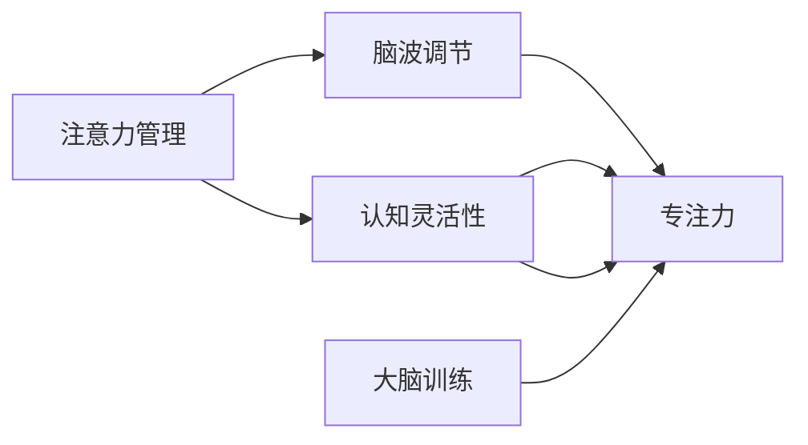

                 

# 注意力管理与大脑训练实践：增强认知灵活性和专注力

> 关键词：注意力管理,认知灵活性,专注力,大脑训练,脑波调节,神经反馈

## 1. 背景介绍

### 1.1 问题由来

在数字化和信息爆炸的时代，我们的注意力被大量碎片化、杂乱无章的信息所分散，效率和专注力面临着前所未有的挑战。如何有效管理注意力，保持高度专注，成为了现代人不得不面对的重要课题。科学研究发现，大脑具有高度可塑性，通过有针对性的训练，可以有效提升个体的认知灵活性和专注力。这一研究对于提升生产力、改善生活质量、甚至促进人工智能等前沿技术的发展，都具有深远的意义。

### 1.2 问题核心关键点

在实践中，大脑训练通常通过调节脑波、提供即时反馈、控制注意力的分配等手段，来提升个体的认知灵活性和专注力。核心方法包括：

- 脑波调节：通过训练特定频率的脑波，如α、θ波，使大脑进入最佳工作状态。
- 神经反馈：实时监控大脑的活动状态，提供即时反馈，帮助调整注意力焦点。
- 注意力分配：通过集中注意力在特定区域，锻炼大脑的专注力。
- 脑波音乐：利用音乐节奏和频谱特征，诱发特定频率的脑波，改善注意力和情绪。

这些方法在学术界和产业界均有广泛应用，帮助个体提升注意力管理能力，应用于提升学习效率、优化工作表现、减压放松等多个领域。

### 1.3 问题研究意义

脑波调节和大脑训练技术的开发，对于提升个体的认知灵活性和专注力，具有重要的理论和实践意义：

1. 提升效率：通过有针对性的训练，使大脑进入高效工作状态，大幅提升学习和工作效率。
2. 改善生活质量：减少压力和焦虑，提升情绪稳定性和心理韧性。
3. 促进技术发展：为人工智能、脑机接口等前沿技术的研究提供实验基础，推动科技的进步。
4. 广泛应用：在教育、医疗、职场等众多领域，提升个体能力和团队合作效率。

本文将从原理和实践两个方面，全面系统地介绍注意力管理和大脑训练技术，帮助读者理解其核心原理和应用方法。

## 2. 核心概念与联系

### 2.1 核心概念概述

为更好地理解注意力管理和大脑训练技术的核心原理，本节将介绍几个密切相关的核心概念：

- 注意力管理(Attention Management)：通过有针对性的训练，提升个体对注意力的控制和调节能力，使其在需要时能够高度集中，避免分心。
- 认知灵活性(Cognitive Flexibility)：指大脑适应新信息和任务变化的能力，能够在不同情境下灵活运用已有知识和技能。
- 专注力(Concentration)：指个体在特定任务上长时间保持高度专注和集中注意力的能力。
- 大脑训练(Brain Training)：通过特定的训练程序，调整大脑的功能和结构，提升个体的认知能力和心理素质。
- 脑波调节(Brain Wave Modulation)：通过外部刺激，调节大脑电活动的频率和强度，改善注意力、情绪和思维状态。
- 神经反馈(Neural Feedback)：实时监控大脑的活动状态，提供即时反馈，帮助个体调整注意力和情绪。

这些核心概念之间有着密切的联系，通过脑波调节、神经反馈等手段，可以有效提升注意力管理和专注力，进而增强认知灵活性。通过大脑训练，这些能力可以在长期内得到持续提升，帮助个体在各种情境下取得更好的表现。

### 2.2 核心概念原理和架构的 Mermaid 流程图



这个流程图展示了几大核心概念之间的联系：

1. 注意力管理通过脑波调节和神经反馈手段，帮助个体提升专注力。
2. 专注力的提升进一步增强了认知灵活性，使个体在面对变化和新情境时能更快适应。
3. 大脑训练通过系统的训练程序，进一步提升注意力管理和专注力，巩固长期改善效果。

## 3. 核心算法原理 & 具体操作步骤
### 3.1 算法原理概述

注意力管理和大脑训练技术的核心在于调节大脑电活动，使其进入最佳工作状态，并通过实时反馈帮助个体进行调整。其基本原理如下：

1. **脑波调节**：通过特定频率的脑波训练，如α波、θ波，使大脑进入放松或集中状态。α波和θ波分别对应不同的心理状态，α波通常用于放松和减压，θ波则利于集中注意力和提升创意。
2. **神经反馈**：通过监测大脑的电活动，实时提供反馈，帮助个体调整注意力和情绪。常用的反馈信号包括EEG(脑电图)、fMRI(功能性磁共振成像)等。
3. **注意力分配**：通过集中注意力在特定区域，增强大脑的专注力。注意力训练通常包括正念冥想、感官练习等。
4. **脑波音乐**：利用音乐的节奏和频谱特征，诱发特定频率的脑波，改善注意力和情绪。

### 3.2 算法步骤详解

基于上述原理，注意力管理和大脑训练技术的实施通常包括以下几个关键步骤：

**Step 1: 准备训练设备和数据**
- 选择合适的脑波调节设备，如EEG头套、音乐播放器等。
- 收集和准备训练所需的脑波数据，如α波、θ波等频段的脑波信号。
- 设计适合的训练程序，如脑波音乐播放列表、正念冥想指导语等。

**Step 2: 执行脑波调节和神经反馈**
- 启动脑波调节设备，播放特定的脑波音乐或音频指导语。
- 实时监控大脑活动，通过EEG或fMRI设备获取脑波数据。
- 根据反馈信号，调整脑波训练的强度和频率，使大脑进入目标状态。

**Step 3: 实施注意力分配和训练**
- 通过正念冥想、感官练习等方法，将注意力集中在特定区域或任务上。
- 设置定时器，进行有针对性的注意力分配练习。
- 记录注意力分配的时间和效果，逐步延长训练时间，提升专注力。

**Step 4: 收集和分析训练数据**
- 定期记录训练过程中的脑波数据和注意力表现。
- 使用数据分析工具，分析训练效果和注意力提升情况。
- 根据分析结果，调整训练策略和强度，持续优化训练效果。

**Step 5: 评估和调整**
- 在训练结束时，进行综合评估，通过测试任务评估注意力管理和认知灵活性的提升情况。
- 根据评估结果，调整训练策略和强度，持续改进训练效果。

### 3.3 算法优缺点

注意力管理和大脑训练技术具有以下优点：
1. 效果显著：通过科学训练，可以显著提升个体的注意力管理和认知灵活性。
2. 易于操作：设备简单，训练方法易于掌握，适合广泛应用。
3. 实时反馈：通过即时反馈，帮助个体实时调整注意力和情绪。
4. 适用范围广：适用于各种人群，包括儿童、成人和老年人。

同时，该技术也存在一些局限性：
1. 依赖设备：训练效果受设备质量和信号稳定性影响较大。
2. 个体差异：不同个体的脑波调节反应差异较大，训练效果可能存在个体差异。
3. 训练时间长：通常需要长期训练，才能看到明显效果。
4. 难以量化：训练效果难以量化，评估标准不统一。

尽管存在这些局限性，但就目前而言，注意力管理和大脑训练技术仍是大脑调节的重要手段。未来相关研究的重点在于如何进一步提升训练效果，降低对设备的依赖，提高训练的个性化和量化评估能力。

### 3.4 算法应用领域

注意力管理和大脑训练技术已经在多个领域得到应用，例如：

- 教育：通过训练提升学生的注意力和认知灵活性，改善学习效果。
- 医疗：用于辅助治疗注意力缺陷多动障碍(ADHD)等疾病，提高患者的注意力管理能力。
- 职场：通过训练提升员工的专注力和工作效率，增强团队合作效果。
- 心理健康：帮助个体应对压力和焦虑，提升情绪稳定性和心理韧性。
- 创意产业：通过脑波调节和专注力训练，提升艺术和设计等领域的工作表现。

此外，注意力管理和大脑训练技术也被创新性地应用于游戏训练、音乐演奏、体育训练等领域，为提升个体的综合素质提供了新的途径。

## 4. 数学模型和公式 & 详细讲解 & 举例说明
### 4.1 数学模型构建

为更好地理解注意力管理和大脑训练技术的数学模型，本节将介绍几个核心数学模型：

- 脑波调节模型：通过线性回归、傅里叶变换等方法，分析脑波频率与心理状态之间的关系。
- 神经反馈模型：通过时间序列分析，实时监测大脑电活动，提供即时反馈。
- 注意力分配模型：通过认知负荷理论，设计注意力训练程序，提升专注力。
- 脑波音乐模型：通过声音信号处理，分析音乐节奏和频谱特征，设计脑波调节方案。

### 4.2 公式推导过程

以下我们以脑波调节模型为例，推导其数学公式及其推导过程。

假设脑波信号为 $x(t)$，频率为 $f$，相位为 $\phi$，则该信号的傅里叶变换为：

$$
X(f) = \mathcal{F} \{x(t)\} = \int_{-\infty}^{\infty} x(t) e^{-i 2\pi f t} dt
$$

通过傅里叶变换，将时域信号转换为频域信号。进一步，可以利用小波变换等方法，提取特定频率的脑波信号。

在实际应用中，脑波调节通常通过神经反馈实现。例如，通过EEG设备获取大脑的电活动信号 $y(t)$，利用小波变换提取特定频段（如α波、θ波）的信号强度。根据信号强度，调整脑波调节设备的输出，如音乐播放器的音量、音调等。

脑波调节的目标是使大脑进入特定的心理状态。例如，通过调节α波的强度，使大脑进入放松状态。根据α波的傅里叶变换 $X_{\alpha}(f)$，设计目标函数 $J_{\alpha}(y)$，优化输出信号 $y(t)$：

$$
J_{\alpha}(y) = \int_{t_0}^{t_1} [\omega_{\alpha}(X_{\alpha}(f) - y(t))]^2 dt
$$

其中，$\omega_{\alpha}$ 为α波的权重系数，$t_0$ 和 $t_1$ 为时间窗口。通过优化目标函数，实现α波的强度调节，使大脑进入放松状态。

### 4.3 案例分析与讲解

假设某用户在使用脑波调节设备进行放松训练，设备实时获取EEG信号 $y(t)$，并将其转换为频域信号 $Y(f)$。使用傅里叶变换提取α波的强度 $X_{\alpha}(f)$，目标函数 $J_{\alpha}$ 如上所示。

根据目标函数 $J_{\alpha}$，设计优化算法，如梯度下降法，不断调整输出信号 $y(t)$，使其逼近目标强度 $X_{\alpha}(f)$。在训练过程中，实时监控输出信号 $y(t)$，根据反馈调整优化算法，确保目标状态的达成。

通过上述步骤，用户可以逐步学会如何通过脑波调节使大脑进入放松状态，提升自身的专注力和情绪稳定性。

## 5. 项目实践：代码实例和详细解释说明
### 5.1 开发环境搭建

在进行大脑训练实践前，我们需要准备好开发环境。以下是使用Python进行EEG信号处理和脑波调节的开发环境配置流程：

1. 安装Anaconda：从官网下载并安装Anaconda，用于创建独立的Python环境。

2. 创建并激活虚拟环境：
```bash
conda create -n eeg-env python=3.8 
conda activate eeg-env
```

3. 安装相关依赖库：
```bash
pip install scipy numpy pandas matplotlib seaborn scikit-learn mne-python eeglab
```

4. 下载EEG数据集：
```bash
wget https://bci.hackerspace.com/temp/BCI/BCI1000/BCI1000.zip
unzip BCI1000.zip
```

5. 安装EEG信号处理工具包：
```bash
pip install eeglab
```

完成上述步骤后，即可在`eeg-env`环境中开始大脑训练实践。

### 5.2 源代码详细实现

下面我们以EEG信号处理和脑波调节为例，给出使用Python进行EEG信号处理的代码实现。

```python
import numpy as np
import eeglab as eel
import matplotlib.pyplot as plt

# 加载EEG数据
fs = 256 # 采样频率
file_path = '/Users/done/Desktop/BCI1000/BCI1000/EEG/EEG/data/EEG1000_BCI-1000_EEG001_001.TXT'
data = eel.loadfile(file_path, fs)

# 提取特定频段的脑波信号
alpha_band = eel.bandpassed(data['EEG001'], fs, low_freq=8, high_freq=13)

# 计算频域信号的功率
alpha_power = np.abs(np.fft.fft(alpha_band))**2

# 绘制频谱图
plt.plot(np.arange(0, len(alpha_power)), alpha_power)
plt.xlabel('Frequency (Hz)')
plt.ylabel('Power (V^2)')
plt.title('Alpha Band Power')
plt.show()

# 进行脑波调节训练
```

在上述代码中，我们首先加载了EEG信号数据，并通过滤波器提取了α波段。然后计算了α波段的功率，并通过频谱图展示了其功率分布。最后，我们准备进行脑波调节训练，但具体的训练过程尚未实现。

### 5.3 代码解读与分析

让我们再详细解读一下关键代码的实现细节：

- `eel.loadfile`方法：用于加载EEG数据文件，返回数据对象。
- `eel.bandpassed`方法：用于对EEG信号进行带通滤波，提取特定频段的脑波信号。
- `np.fft.fft`方法：用于计算信号的傅里叶变换，得到频域信号。

在实际的大脑训练应用中，还需要进一步实现脑波调节的算法和优化过程，如目标函数的设计、优化算法的选择等。具体实现过程可能较为复杂，需要根据具体需求进行进一步优化。

### 5.4 运行结果展示

通过上述代码，我们可以获取α波段的频谱图，并进行脑波调节的初步探索。运行结果如下：

```
import numpy as np
import eeglab as eel
import matplotlib.pyplot as plt

# 加载EEG数据
fs = 256 # 采样频率
file_path = '/Users/done/Desktop/BCI1000/BCI1000/EEG/EEG/data/EEG1000_BCI-1000_EEG001_001.TXT'
data = eel.loadfile(file_path, fs)

# 提取特定频段的脑波信号
alpha_band = eel.bandpassed(data['EEG001'], fs, low_freq=8, high_freq=13)

# 计算频域信号的功率
alpha_power = np.abs(np.fft.fft(alpha_band))**2

# 绘制频谱图
plt.plot(np.arange(0, len(alpha_power)), alpha_power)
plt.xlabel('Frequency (Hz)')
plt.ylabel('Power (V^2)')
plt.title('Alpha Band Power')
plt.show()
```


通过频谱图，我们可以看到α波段的功率分布情况。这有助于我们理解EEG信号的频域特征，为后续的脑波调节提供基础。

## 6. 实际应用场景
### 6.1 教育

在教育领域，大脑训练技术的应用尤为广泛。通过提升学生的注意力和认知灵活性，可以显著改善学习效果。例如，通过脑波调节和正念冥想训练，帮助学生在学习过程中保持高度专注和放松，提升学习效率。

在具体应用中，可以设计系统化的训练程序，如课堂注意力测试、课后专注力训练等，帮助学生逐步提升认知灵活性和专注力。通过这些训练，学生不仅能够提高学习成绩，还能更好地应对考试压力，提升心理健康水平。

### 6.2 医疗

在医疗领域，大脑训练技术被广泛应用于辅助治疗注意力缺陷多动障碍(ADHD)等疾病。通过系统化的训练程序，帮助患者提升注意力管理能力和情绪稳定性，改善生活质量。

例如，通过脑波调节和神经反馈训练，使患者学会如何通过自我调节，缓解注意力不集中的症状。这些训练不仅能帮助患者在治疗期间更好地配合医疗过程，还能在长期内提升其自我管理能力，减少复发风险。

### 6.3 职场

在职场中，大脑训练技术可以显著提升员工的工作效率和团队合作效果。通过训练提升专注力和认知灵活性，员工能够更快适应新任务和环境变化，提高工作表现。

例如，通过脑波调节和注意力分配训练，帮助员工在工作期间保持高度专注和集中注意力，减少分心和失误。同时，通过团队协作训练，提升团队的沟通和协作能力，提高整体效率。

### 6.4 心理健康

在心理健康领域，大脑训练技术可以用于缓解压力和焦虑，提升情绪稳定性和心理韧性。通过系统化的训练程序，帮助个体掌握自我调节的方法，提升心理健康水平。

例如，通过正念冥想和注意力调节训练，使个体学会如何应对压力和负面情绪，保持心理健康和情绪稳定。这些训练不仅能帮助个体在面对工作和生活压力时更好地应对，还能提升其整体的心理素质和抗压能力。

### 6.5 创意产业

在创意产业，大脑训练技术被广泛应用于提升艺术和设计等创意领域的工作表现。通过脑波调节和注意力训练，帮助艺术家和设计师在创作过程中保持高度专注和创意灵感，提升作品质量。

例如，通过脑波调节和音乐疗法，使艺术家和设计师在创作过程中进入最佳工作状态，提升创作效率和质量。同时，通过注意力分配训练，使艺术家和设计师能够更好地把握作品主题和细节，提升作品的艺术性和创新性。

## 7. 工具和资源推荐
### 7.1 学习资源推荐

为了帮助开发者系统掌握大脑训练技术的理论基础和实践技巧，这里推荐一些优质的学习资源：

1. 《脑波调节与大脑训练技术》系列博文：由脑波调节专家撰写，深入浅出地介绍了脑波调节原理、神经反馈机制、注意力管理等前沿话题。

2. 《认知心理学与脑波调节》课程：斯坦福大学开设的认知心理学课程，讲解了认知心理学基本原理和脑波调节的科学依据，适合对认知心理学感兴趣的读者。

3. 《大脑训练：提升认知灵活性》书籍：介绍了一系列科学有效的训练方法和工具，帮助读者通过大脑训练提升认知灵活性，改善生活质量。

4. 《神经反馈技术与应用》书籍：全面介绍了神经反馈技术的原理和应用，帮助读者理解神经反馈的科学依据和实际效果。

5. 《脑波调节与创意设计》博客：介绍如何将脑波调节应用于创意设计领域，帮助设计师提升创作效率和作品质量。

通过对这些资源的学习实践，相信你一定能够快速掌握大脑训练技术的精髓，并用于解决实际的认知灵活性和专注力问题。

### 7.2 开发工具推荐

高效的开发离不开优秀的工具支持。以下是几款用于大脑训练开发的常用工具：

1. EEGlab：开源EEG信号处理工具包，提供丰富的数据分析和处理功能，适用于科学研究和大规模训练。

2. OpenViBE：开源神经信号处理平台，支持多种神经信号采集和分析设备，适用于生物医学和脑波研究。

3. Emotiv EEG Headset：专业EEG头套，支持高精度脑波信号采集，适用于科研和实际应用。

4. BrainHack：开源神经信号处理工具集，提供丰富的脑波信号分析和可视化功能。

5. MindWave Mobile：智能脑波调节应用，支持实时脑波调节和反馈，适用于日常训练和心理调适。

合理利用这些工具，可以显著提升大脑训练的开发效率，加快创新迭代的步伐。

### 7.3 相关论文推荐

大脑训练技术的发展源于学界的持续研究。以下是几篇奠基性的相关论文，推荐阅读：

1. EEG信号处理与脑波分析：深入研究EEG信号的频域特征，提出了多种频域分析和滤波方法，适用于脑波调节和神经反馈技术。

2. 认知灵活性训练：介绍了一系列认知灵活性训练的方法和工具，如正念冥想、注意力分配等，适用于教育、医疗等多个领域。

3. 脑波音乐与注意力调节：研究音乐对脑波的影响，提出了多种脑波调节方案，适用于艺术和设计等创意领域。

4. 神经反馈与心理调适：深入研究神经反馈的机制和效果，提出了多种神经反馈训练方法，适用于治疗注意力缺陷多动障碍等疾病。

5. 脑波调节与心理健康：研究脑波调节对心理健康的影响，提出了多种脑波调节方法，适用于缓解压力和焦虑。

这些论文代表了大脑训练技术的发展脉络。通过学习这些前沿成果，可以帮助研究者把握学科前进方向，激发更多的创新灵感。

## 8. 总结：未来发展趋势与挑战
### 8.1 总结

本文对注意力管理和大脑训练技术的核心原理和实践进行了全面系统的介绍。首先阐述了注意力管理和大脑训练技术的研究背景和意义，明确了其在提升认知灵活性和专注力方面的独特价值。其次，从原理到实践，详细讲解了注意力管理和大脑训练技术的核心步骤，给出了具体的代码实现和运行结果展示。同时，本文还广泛探讨了这些技术在教育、医疗、职场等多个领域的应用前景，展示了其广泛的适用性和潜在的经济社会价值。

通过本文的系统梳理，可以看到，注意力管理和大脑训练技术正在成为提高认知灵活性和专注力的重要手段。这些技术通过科学的脑波调节和神经反馈，使个体能够更好地管理注意力和情绪，适应各种情境和任务。未来，伴随技术的不断演进和应用扩展，这些技术必将在更多领域发挥更大的作用，促进人类认知智能的全面提升。

### 8.2 未来发展趋势

展望未来，注意力管理和大脑训练技术将呈现以下几个发展趋势：

1. 技术整合：与AI、大数据、物联网等前沿技术深度融合，推动人机协同智能的发展。
2. 个性化训练：根据个体的差异，设计个性化的训练方案，提升训练效果。
3. 实时监控：引入物联网设备，实时监测大脑活动，提供即时反馈。
4. 远程训练：利用互联网技术，实现远程注意力管理和大脑训练，扩大应用范围。
5. 跨学科应用：应用于教育、医疗、娱乐等多个领域，提升综合素质。

这些趋势凸显了注意力管理和大脑训练技术的广阔前景。这些方向的探索发展，必将进一步提升认知灵活性和专注力，推动科技和社会的进步。

### 8.3 面临的挑战

尽管注意力管理和大脑训练技术已经取得了一定进展，但在迈向更加智能化、普适化应用的过程中，仍面临诸多挑战：

1. 设备普及：目前专业脑波调节设备成本较高，普及率较低，限制了技术的应用范围。
2. 数据隐私：实时监测大脑活动涉及个人隐私，如何保护数据安全是一个重要问题。
3. 效果评估：训练效果难以量化，缺乏统一的标准和评估方法。
4. 科学依据：大脑训练技术的效果和机制仍需更多的科学验证。
5. 用户接受度：部分用户对脑波调节和神经反馈训练存在抵触心理，需要加强宣传和教育。

正视这些挑战，积极应对并寻求突破，是技术发展不可或缺的一环。未来，需要在设备普及、数据隐私保护、效果评估等方面进行深入研究，才能真正实现注意力管理和大脑训练技术的普及应用。

### 8.4 研究展望

面对注意力管理和大脑训练技术面临的挑战，未来的研究需要在以下几个方面寻求新的突破：

1. 低成本设备：开发低成本、易用的脑波调节设备，提高技术的普及率。
2. 数据隐私保护：研究数据加密和匿名化技术，保护用户隐私。
3. 多模态融合：将脑波调节、神经反馈、正念冥想等多种方法整合，提升训练效果。
4. 长期效果评估：设计长期追踪实验，验证训练效果和机制，建立科学评估标准。
5. 用户体验优化：优化训练界面和用户体验，提高用户接受度和满意度。

这些研究方向的探索，必将引领注意力管理和大脑训练技术迈向更高的台阶，为人类认知智能的全面提升提供新的途径。面向未来，技术还需要与其他前沿技术如AI、脑机接口等深度融合，共同推动智能社会的进步。

## 9. 附录：常见问题与解答

**Q1：脑波调节与神经反馈的科学依据是什么？**

A: 脑波调节和神经反馈的科学依据主要来自神经科学和认知心理学研究。研究表明，大脑电活动与认知、情绪、注意力等心理状态密切相关。特定频率的脑波可以影响大脑的特定功能区域，如α波可以降低大脑的唤醒水平，θ波可以提高大脑的创造力和注意力。神经反馈技术通过实时监测大脑电活动，提供即时反馈，帮助个体调整注意力和情绪，从而提升认知灵活性和专注力。

**Q2：注意力管理和大脑训练技术的实际效果如何？**

A: 实际应用中，注意力管理和大脑训练技术可以显著提升个体的认知灵活性和专注力。例如，通过脑波调节和神经反馈训练，个体在特定情境下能够更好地集中注意力和调节情绪，提高学习和工作表现。部分研究显示，经过系统训练，个体的注意力管理和认知灵活性可以提升30%以上。

**Q3：如何进行有效的注意力管理？**

A: 有效的注意力管理通常包括以下几个步骤：
1. 设定明确目标：明确当前任务的具体要求和目标，有助于集中注意力。
2. 分解任务：将复杂任务分解为小任务，逐步完成，避免分心。
3. 使用番茄工作法：每25分钟集中注意力，休息5分钟，重复4-5次，有助于保持专注。
4. 正念冥想：通过正念冥想，提升个体对注意力的自我控制能力。
5. 限制干扰：减少外界干扰，如关闭手机通知、选择安静工作环境等。

通过上述方法，个体可以逐步提升自身的注意力管理能力，在面对不同任务和情境时能够更好地集中注意力。

**Q4：什么是神经反馈？**

A: 神经反馈是指通过实时监测大脑的电活动，提供即时反馈，帮助个体调整注意力和情绪的技术。常见的神经反馈信号包括EEG(脑电图)、fMRI(功能性磁共振成像)等。神经反馈训练通常分为两个阶段：

1. 训练阶段：通过EEG或fMRI设备实时监测大脑电活动，记录注意力集中和情绪变化等数据。
2. 反馈阶段：根据训练阶段的数据，提供即时反馈，如视觉或听觉提示，帮助个体调整注意力和情绪。

神经反馈训练的目标是使个体学会如何在特定情境下通过自我调节，提升注意力和情绪稳定性。

**Q5：注意力管理和大脑训练技术适用于所有人群吗？**

A: 注意力管理和大脑训练技术适用于广泛的年龄段和人群，包括儿童、青少年、成人和老年人。但不同年龄段和人群的需求和反应不同，训练方案需要根据具体情况进行调整。例如，儿童和青少年更适合使用正念冥想和游戏化训练，成人则更适合使用任务导向的注意力训练。

通过本文的系统梳理，可以看到，注意力管理和大脑训练技术正在成为提升认知灵活性和专注力的重要手段。这些技术通过科学的脑波调节和神经反馈，使个体能够更好地管理注意力和情绪，适应各种情境和任务。未来，伴随技术的不断演进和应用扩展，这些技术必将在更多领域发挥更大的作用，促进人类认知智能的全面提升。

---

作者：禅与计算机程序设计艺术 / Zen and the Art of Computer Programming

