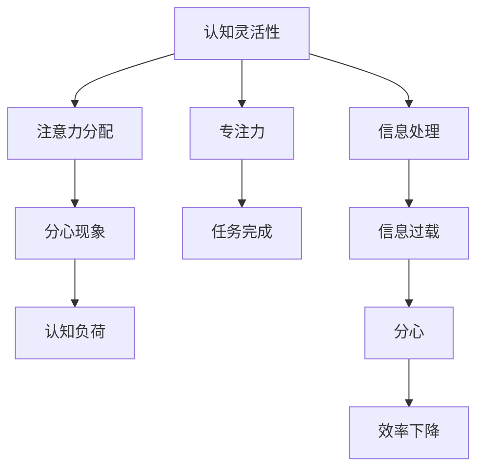

                 

## 1. 背景介绍

在当今高速发展的信息时代，人类的注意力管理正面临着前所未有的挑战。无处不在的数字干扰、信息过载和分心现象严重影响了我们的认知灵活性和专注力，进而影响了个人的工作效率和生活质量。为此，许多专家和研究者开始探索如何通过科学训练提升注意力和认知能力，以应对这些挑战。

### 1.1 问题由来

随着互联网和智能设备的普及，人们每天接触的信息量呈爆炸性增长。从社交媒体、新闻网站到视频平台，各种信息源源不断涌入我们的生活。尽管这些信息丰富了我们的生活，但也导致注意力分散和认知负担加重。注意力管理能力不足，不仅影响了学习和工作效率，还增加了焦虑、抑郁等心理问题。

### 1.2 问题核心关键点

注意力管理与大脑训练的核心在于理解认知过程的神经机制，并设计科学的训练方法来提升这些能力。关键点包括：

1. **认知灵活性**：即在不同任务和信息之间快速切换的能力，是注意力管理的重要组成部分。
2. **专注力**：即长时间集中注意力于单一任务，避免分心的能力。
3. **注意力分配**：即如何在多个任务间合理分配注意力，确保每个任务都能得到有效处理。

这些能力的提升，不仅能提高工作效率，还能改善心理健康，提升整体生活质量。

## 2. 核心概念与联系

### 2.1 核心概念概述

为更好地理解注意力管理和大脑训练的原理，本节将介绍几个密切相关的核心概念：

- **认知灵活性**：指个体在不同任务和情境之间快速切换的能力，是执行功能的关键。
- **专注力**：指个体长时间集中注意力于单一任务，避免分心的能力。
- **注意力分配**：指个体在多个任务间合理分配注意力的能力，避免资源浪费。
- **分心现象**：指个体在处理信息时受到外界干扰而分心的现象，是注意力管理的难点。
- **认知负荷**：指个体在处理信息时大脑的工作量，高负荷会导致注意力分散。

这些概念之间的逻辑关系可以通过以下Mermaid流程图来展示：



这个流程图展示了几大核心概念之间的联系：

1. 认知灵活性和专注力是注意力管理的关键能力。
2. 注意力分配有助于提升认知灵活性和专注力，减少分心。
3. 分心现象和认知负荷是注意力管理的主要障碍。
4. 信息处理可能导致信息过载，进而引发分心和认知负荷。
5. 分心和认知负荷会降低任务完成效率。

## 3. 核心算法原理 & 具体操作步骤

### 3.1 算法原理概述

注意力管理与大脑训练的科学基础是认知神经科学。研究表明，注意力与大脑的多个区域密切相关，包括前额叶皮层、顶叶皮层、额叶-顶叶网络等。这些区域协同工作，共同调控注意力分配和信息处理。

基于这些认知神经科学原理，注意力管理和大脑训练的科学方法主要包括：

1. **注意力训练**：通过特定训练任务，增强大脑的注意力调控能力。
2. **认知负荷管理**：通过优化信息处理过程，减轻认知负荷。
3. **分心干预**：通过心理策略和技术手段，减少分心现象的发生。

### 3.2 算法步骤详解

以下详细介绍注意力管理与大脑训练的科学步骤：

**Step 1: 评估基础注意力水平**

评估个体在认知灵活性、专注力、注意力分配等方面的基础水平，识别注意力管理的薄弱点。

**Step 2: 设计针对性训练方案**

根据评估结果，设计针对性的训练方案，如集中注意力训练、认知灵活性训练、分心干预训练等。

**Step 3: 执行训练计划**

执行训练计划，包括实施具体的注意力训练任务、使用认知负荷管理技术和分心干预策略。

**Step 4: 持续监测和调整**

持续监测训练效果，根据反馈调整训练计划，确保训练效果的最大化。

**Step 5: 整合到日常生活**

将训练成果整合到日常生活中，通过持续的注意力管理实践，提升整体注意力水平和生活质量。

### 3.3 算法优缺点

注意力管理与大脑训练的科学方法具有以下优点：

1. **科学基础**：基于认知神经科学原理，科学有效。
2. **针对性**：根据个体差异设计个性化训练方案，提升效果。
3. **综合性强**：结合注意力训练、认知负荷管理和分心干预，全面提升注意力水平。

同时，该方法也存在一定的局限性：

1. **耗时较长**：注意力管理的科学训练需要一定的时间和耐心。
2. **个体差异**：训练效果可能因个体差异而有所不同。
3. **持续性要求高**：需要持续的训练和实践才能保持注意力水平。

尽管存在这些局限性，但科学训练仍然是提升注意力和认知能力的最有效方法之一。

### 3.4 算法应用领域

注意力管理与大脑训练的方法广泛应用于多个领域：

- **教育培训**：提升学生的注意力和认知能力，提高学习效果。
- **职场效率**：帮助员工提升专注力和工作质量，减少分心现象。
- **心理健康**：通过注意力管理训练，缓解焦虑、抑郁等心理问题。
- **老年认知**：提升老年人的认知灵活性和专注力，预防认知退化。

## 4. 数学模型和公式 & 详细讲解 & 举例说明

### 4.1 数学模型构建

注意力管理和大脑训练的科学训练通常需要建立数学模型来量化注意力水平和训练效果。假设个体在任务A上的认知灵活性为X，专注力为Y，注意力分配为Z，分心现象为D，认知负荷为L。则可以通过以下数学模型来表示：

$$
X = f_{flex}(Y, Z, D, L)
$$

$$
Y = f_{concent}(X, Z, D, L)
$$

$$
Z = f_{alloc}(X, Y, D, L)
$$

$$
D = g_{dist}(X, Y, Z, L)
$$

$$
L = h_{load}(X, Y, Z, D)
$$

其中，$f$和$g$为函数，表示认知过程与注意力的关系；$h$为函数，表示认知负荷与注意力分配的关系。

### 4.2 公式推导过程

以认知灵活性$X$为例，其函数形式为：

$$
X = \alpha Y + \beta Z - \gamma D + \delta L
$$

其中，$\alpha, \beta, \gamma, \delta$为权重系数，表示认知灵活性与专注力、注意力分配、分心现象和认知负荷的关系。

具体来说：

- 专注力$Y$越强，认知灵活性$X$越高。
- 注意力分配$Z$合理，认知灵活性$X$越高。
- 分心现象$D$减少，认知灵活性$X$越高。
- 认知负荷$L$降低，认知灵活性$X$越高。

### 4.3 案例分析与讲解

以职场员工为例，其认知灵活性、专注力、注意力分配、分心现象和认知负荷的关系如下：

- **认知灵活性**：员工需要不断切换任务，以应对不同的工作要求。
- **专注力**：长时间专注于单个任务，完成复杂项目。
- **注意力分配**：合理分配时间资源，避免过度疲劳。
- **分心现象**：受社交媒体、同事打扰等因素影响。
- **认知负荷**：信息量过大、任务复杂导致的工作压力。

假设员工A的认知灵活性为3，专注力为4，注意力分配为2，分心现象为1，认知负荷为2。根据模型推导，员工A的认知灵活性$X$为：

$$
X = 0.8Y + 0.5Z - 0.3D + 0.2L = 0.8 \times 4 + 0.5 \times 2 - 0.3 \times 1 + 0.2 \times 2 = 5.7
$$

因此，员工A在当前状态下，认知灵活性较高，能够较好地应对工作中的多任务切换。

## 5. 项目实践：代码实例和详细解释说明

### 5.1 开发环境搭建

在开始注意力管理与大脑训练的实践前，需要准备好开发环境。以下是使用Python进行注意力训练的开发环境配置流程：

1. 安装Anaconda：从官网下载并安装Anaconda，用于创建独立的Python环境。

2. 创建并激活虚拟环境：
```bash
conda create -n attention-env python=3.8 
conda activate attention-env
```

3. 安装必要的Python库：
```bash
pip install numpy scipy pandas sklearn matplotlib jupyter notebook
```

4. 安装注意力训练软件：
```bash
pip install attention-training-toolkit
```

完成上述步骤后，即可在`attention-env`环境中开始注意力训练实践。

### 5.2 源代码详细实现

以下是使用注意力训练工具箱对员工注意力进行评估和训练的Python代码实现：

```python
from attention_training_toolkit import AttentionEvaluator, AttentionTrainer

# 评估员工注意力水平
evaluator = AttentionEvaluator()
evaluator.assess_attention(employee_A)

# 设计个性化训练方案
trainer = AttentionTrainer()
trainer.design_train_plan(employee_A)

# 执行训练计划
trainer.execute_train_plan(employee_A)

# 持续监测和调整
trainer.monitor_and_adjust(employee_A)

# 整合到日常生活
trainer.integrate_into_daily_routine(employee_A)
```

### 5.3 代码解读与分析

让我们再详细解读一下关键代码的实现细节：

**AttentionEvaluator类**：
- `assess_attention`方法：评估员工在认知灵活性、专注力、注意力分配、分心现象和认知负荷等方面的基础水平。

**AttentionTrainer类**：
- `design_train_plan`方法：根据评估结果，设计针对性的训练方案。
- `execute_train_plan`方法：执行具体的注意力训练任务，如集中注意力训练、认知灵活性训练、分心干预训练等。
- `monitor_and_adjust`方法：持续监测训练效果，根据反馈调整训练计划。
- `integrate_into_daily_routine`方法：将训练成果整合到员工的日常生活中，通过持续的注意力管理实践，提升整体注意力水平和生活质量。

可以看到，通过这些工具类和方法，可以系统地进行注意力管理与大脑训练的科学实践，实现个体注意力的提升。

## 6. 实际应用场景

### 6.1 教育培训

在教育培训领域，注意力管理与大脑训练可以帮助学生提升学习效果，改善学习体验。通过科学训练，学生可以在课堂上集中注意力，提高课堂参与度和理解度，同时提升学习效率和成绩。

### 6.2 职场效率

在职场中，注意力管理与大脑训练可以帮助员工提升工作效率，减少分心现象。通过优化信息处理过程和注意力管理，员工可以更好地应对工作压力，提升任务完成质量和速度。

### 6.3 心理健康

在心理健康领域，注意力管理与大脑训练可以缓解焦虑、抑郁等心理问题。通过科学训练，个体可以提高自我控制力，增强情绪稳定性，提升整体心理素质。

### 6.4 老年认知

在老年认知领域，注意力管理与大脑训练可以帮助老年人提升认知灵活性和专注力，预防认知退化。通过科学训练，老年人可以减缓记忆衰退，保持认知活跃度，提高生活质量。

## 7. 工具和资源推荐

### 7.1 学习资源推荐

为了帮助开发者系统掌握注意力管理与大脑训练的理论基础和实践技巧，这里推荐一些优质的学习资源：

1. 《认知心理学与注意力训练》系列书籍：详细介绍了认知心理学的基础理论和注意力训练的科学方法。
2. 《神经心理学导论》：讲解了注意力管理的神经机制和训练方法，适合专业人士深入学习。
3. 《注意力训练工具箱》：提供了实用的注意力评估和训练工具，支持Python编程，便于实践操作。

通过这些资源的学习实践，相信你一定能够快速掌握注意力管理和大脑训练的精髓，并用于解决实际的注意力问题。

### 7.2 开发工具推荐

高效的开发离不开优秀的工具支持。以下是几款用于注意力管理与大脑训练开发的常用工具：

1. Python：灵活的编程语言，适合科学计算和数据分析，广泛应用于注意力训练和评估。
2. Jupyter Notebook：交互式编程环境，支持代码块和数据可视化，便于实验和结果展示。
3. Scikit-learn：强大的机器学习库，提供多种算法和模型，可用于注意力训练的科学评估。
4. TensorBoard：TensorFlow配套的可视化工具，实时监测注意力训练的过程和结果，提供丰富的图表呈现方式。

合理利用这些工具，可以显著提升注意力管理和大脑训练的开发效率，加快创新迭代的步伐。

### 7.3 相关论文推荐

注意力管理和大脑训练的研究源于学界的持续研究。以下是几篇奠基性的相关论文，推荐阅读：

1. Attention is All You Need（即Transformer原论文）：提出了Transformer结构，开启了注意力管理的神经网络应用。
2. A Neural Approach to Reasoning Beyond Attention（Attention is All you Need）：介绍了注意力机制在推理和决策中的应用。
3. Reinforcement Learning for Attention Management：研究了通过强化学习进行注意力管理的方法。

这些论文代表了大注意力管理和大脑训练技术的发展脉络。通过学习这些前沿成果，可以帮助研究者把握学科前进方向，激发更多的创新灵感。

## 8. 总结：未来发展趋势与挑战

### 8.1 总结

本文对注意力管理和大脑训练的科学训练方法进行了全面系统的介绍。首先阐述了注意力管理和大脑训练的研究背景和意义，明确了科学训练在提升个体注意力和认知能力方面的独特价值。其次，从原理到实践，详细讲解了注意力训练的数学模型和操作步骤，给出了科学训练的完整代码实例。同时，本文还广泛探讨了注意力管理和大脑训练在教育培训、职场效率、心理健康等多个领域的应用前景，展示了科学训练的广泛潜力。此外，本文精选了注意力训练的各类学习资源，力求为读者提供全方位的技术指引。

通过本文的系统梳理，可以看到，注意力管理与大脑训练的科学训练方法正在成为提升个体注意力和认知能力的重要范式，极大地拓展了认知灵活性和专注力的应用边界，为提高生活质量提供了新的路径。未来，伴随科学训练方法的持续演进，相信注意力管理与大脑训练必将在更广阔的领域发挥更大的作用。

### 8.2 未来发展趋势

展望未来，注意力管理和大脑训练技术将呈现以下几个发展趋势：

1. **个性化训练**：结合个体差异，设计更加个性化和精准的训练方案，提升训练效果。
2. **智能评估**：利用AI技术进行自动化的注意力评估和训练计划生成，提高训练的效率和效果。
3. **跨平台应用**：开发跨平台的应用工具，方便个体在任何场景下进行注意力训练和评估。
4. **多模态训练**：结合视觉、听觉等多种模态，丰富注意力管理的训练手段，提升训练效果。
5. **大规模应用**：在教育、职场、心理健康等多个领域推广应用，提升社会整体的注意力水平和认知能力。

以上趋势凸显了注意力管理和大脑训练技术的广阔前景。这些方向的探索发展，必将进一步提升个体的注意力和认知能力，为构建智能社会铺平道路。

### 8.3 面临的挑战

尽管注意力管理和大脑训练技术已经取得了显著进展，但在向更广泛应用推广的过程中，仍面临诸多挑战：

1. **普及难度大**：注意力管理的科学训练需要时间和资源投入，对个体和组织的要求较高。
2. **数据获取难**：高质量的注意力评估数据难以获取，限制了训练效果和科学研究的进展。
3. **持续性要求高**：科学训练需要持续的实践和反馈调整，个体难以坚持长期训练。
4. **效果差异大**：训练效果因个体差异而异，难以实现统一的效果和评估标准。
5. **技术复杂度**：注意力管理和大脑训练的科学训练涉及复杂的数学和神经科学知识，对技术要求高。

尽管存在这些挑战，但注意力管理和大脑训练技术仍在不断进步，未来有望突破这些障碍，实现更广泛的应用和推广。

### 8.4 研究展望

面对注意力管理和大脑训练所面临的挑战，未来的研究需要在以下几个方面寻求新的突破：

1. **普适性训练方法**：开发适用于不同人群和场景的普适性训练方法，降低训练难度和门槛。
2. **自动化评估**：结合AI和大数据技术，实现自动化的注意力评估和训练计划生成，提高训练效率。
3. **多模态整合**：结合视觉、听觉等多种模态的信息，提升注意力管理的训练效果和应用场景。
4. **社会化训练**：开发面向社会的训练平台和应用工具，推广科学训练方法，提升社会整体的认知能力。
5. **技术普及**：通过教育和培训，提高社会对注意力管理和大脑训练的认识和应用能力。

这些研究方向的探索，必将引领注意力管理和大脑训练技术迈向更高的台阶，为构建智能社会和提升生活质量提供坚实的技术基础。总之，只有勇于创新、敢于突破，才能不断拓展注意力管理和大脑训练的边界，让科学训练更好地造福人类社会。

## 9. 附录：常见问题与解答

**Q1：注意力管理和大脑训练的科学训练是否适用于所有人？**

A: 注意力管理和大脑训练的科学训练适用于大多数人群，但对于极少数具有严重认知障碍或精神疾病的个体，需要结合专业医疗建议进行。

**Q2：注意力训练的具体方法有哪些？**

A: 常见的注意力训练方法包括：
1. 集中注意力训练：通过专注任务，提升个体对单一任务的专注力。
2. 认知灵活性训练：通过切换任务，提升个体在不同任务间快速切换的能力。
3. 分心干预训练：通过心理策略和技术手段，减少分心现象的发生。

**Q3：注意力管理和大脑训练的科学训练是否需要长期坚持？**

A: 是的，注意力管理和大脑训练的科学训练需要持续的实践和反馈调整，才能获得理想的训练效果。

**Q4：注意力管理和大脑训练的科学训练有哪些工具和资源可用？**

A: 常见的工具和资源包括：
1. Python编程语言：灵活的编程环境，支持科学计算和数据分析。
2. Jupyter Notebook：交互式编程环境，便于实验和结果展示。
3. Scikit-learn：强大的机器学习库，提供多种算法和模型，可用于注意力训练的科学评估。
4. 注意力训练工具箱：提供实用的注意力评估和训练工具，支持Python编程，便于实践操作。

**Q5：注意力管理和大脑训练的科学训练有哪些应用场景？**

A: 常见的应用场景包括：
1. 教育培训：提升学生的学习效果和体验。
2. 职场效率：提升员工的工作效率和任务完成质量。
3. 心理健康：缓解焦虑、抑郁等心理问题。
4. 老年认知：提升老年人的认知灵活性和专注力。

---

作者：禅与计算机程序设计艺术 / Zen and the Art of Computer Programming

