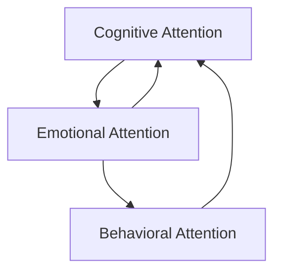

                 

## 1. 背景介绍

在当今信息爆炸的时代，如何管理自己的注意力，提高专注力，已经成为个人成长和发展的一项关键技能。无论是学术研究、职业生涯还是个人兴趣，几乎每一个领域都需要高度集中的注意力，才能取得成功。然而，由于信息过载、多任务处理、生活节奏加快等因素的影响，很多人感到注意力分散、工作效率低下，甚至出现了心理问题。

### 1.1 问题由来

注意力管理的概念可以追溯到20世纪50年代，但直到近年，随着技术的进步和信息的泛滥，这一领域才引起了广泛关注。注意力分散（Distraction）、注意力缺陷（Attention Deficit）等问题越来越普遍，尤其是在年轻人中。根据调查，大学生和职场人士中，有70%以上的人表示他们在学习和工作时难以保持专注，导致工作效率低下、产出质量不高。

### 1.2 问题核心关键点

注意力管理的关键在于：
- 识别和控制分散注意力的因素，如社交媒体、电子邮件、环境干扰等。
- 建立有效的注意力管理策略，如时间管理、任务优先级排序、工作流程优化等。
- 提升个人专注力，通过正念冥想、冥想训练、认知行为疗法等方法，培养持续的专注能力。
- 借助技术工具，如注意力追踪软件、时间管理应用等，辅助实现注意力管理。

## 2. 核心概念与联系

### 2.1 核心概念概述

注意力管理（Attention Management）是一个涉及心理学、认知科学、神经科学、信息科学与工程学的交叉领域。主要研究如何通过认知、情感和行为手段，提升个体的注意力品质，优化注意力资源分配，提高工作效率和生活质量。

#### 2.1.1 认知注意力（Cognitive Attention）
指在特定任务中的注意力集中和分配过程，涉及目标识别、选择、跟踪、转换等认知操作。

#### 2.1.2 情感注意力（Emotional Attention）
与情感状态密切相关，情感驱动注意力向某些任务或目标聚焦，影响个体的情绪和行为。

#### 2.1.3 行为注意力（Behavioral Attention）
指个体通过特定行为维持和调整注意力的过程，如注意力转移、注意力持续、注意力调节等。

这三个方面相互交织，共同作用于个体的注意力管理。通过理解它们的机制，可以更好地制定和实施注意力管理策略。

### 2.2 核心概念原理和架构的 Mermaid 流程图



## 3. 核心算法原理 & 具体操作步骤

### 3.1 算法原理概述

注意力管理主要基于认知心理学和神经科学的原理，通过行为干预和认知训练，提升个体对注意力的控制能力。以下是注意力管理的核心算法原理：

#### 3.1.1 目标设定（Goal Setting）
设定明确、具体、可量化的目标，帮助个体集中注意力，明确工作方向。目标应具有挑战性和可行性，以激发动力和保持专注。

#### 3.1.2 任务分解（Task Breakdown）
将大任务分解为小步骤，按优先级顺序逐步完成，避免因任务过于庞大而产生的压力和分心。

#### 3.1.3 时间管理（Time Management）
使用时间块（Time Blocking）、番茄钟（Pomodoro Technique）等时间管理方法，设定工作时间段和休息时间段，避免长时间高强度工作导致的疲劳和分心。

#### 3.1.4 注意力监控（Attention Monitoring）
使用注意力追踪工具或应用，实时监控自己的注意力分配情况，及时发现注意力分散的问题，并进行调整。

#### 3.1.5 任务切换（Task Switching）
合理安排任务切换的时间，避免频繁切换带来的认知负荷和注意力分散。

### 3.2 算法步骤详解

#### 3.2.1 目标设定步骤
1. **明确目标**：将目标具体化，如“在一周内完成这篇论文”，而不是“写论文”。
2. **设定截止日期**：为目标设定一个具体的完成日期，如“5月20日”。
3. **设定优先级**：对目标进行优先级排序，如“研究、撰写、校对”。

#### 3.2.2 任务分解步骤
1. **任务列表化**：将大任务分解为小步骤，如“研究文献”、“撰写引言”、“撰写结果”等。
2. **设定子目标**：为每个子任务设定明确的目标和截止日期，如“两天内完成文献研究”。
3. **评估进度**：定期检查子任务的完成情况，根据进度调整计划。

#### 3.2.3 时间管理步骤
1. **划分时间块**：将工作时间划分为若干时间块，每个时间块专注一项任务。
2. **设置番茄钟**：每25分钟为一个工作时间块，休息5分钟，防止疲劳和分心。
3. **周期性评估**：每周或每月评估时间管理的效果，调整时间块长度和休息时间。

#### 3.2.4 注意力监控步骤
1. **选择工具**：使用注意力追踪工具，如RescueTime、Toggl等。
2. **启动追踪**：启动工具，开始记录注意力分配情况。
3. **分析报告**：定期查看报告，识别注意力分散的时间和场景，进行改进。

#### 3.2.5 任务切换步骤
1. **合理安排切换时间**：每完成一个时间块后，休息一段时间，如5-10分钟。
2. **切换任务**：休息时间结束后，切换至下一个任务，确保每个任务都得到充分注意力。

### 3.3 算法优缺点

#### 3.3.1 优点
- **提高效率**：明确目标和任务，有效分配时间，避免时间浪费和注意力分散。
- **减少压力**：将大任务分解成小步骤，降低工作压力和认知负荷。
- **提升专注力**：通过注意力监控和切换策略，培养持续的专注能力。

#### 3.3.2 缺点
- **过度规划**：过度细化和严格的时间管理可能导致灵活性不足，增加心理负担。
- **工具依赖**：依赖注意力追踪工具可能导致过度监控，影响心理状态。
- **个体差异**：注意力管理方法不一定适用于所有人，需根据个体差异进行调整。

### 3.4 算法应用领域

注意力管理方法广泛应用于学术研究、职业生涯、个人兴趣等多个领域，帮助个体提升工作效率和生活质量。例如：

- **学术研究**：通过设定明确的研究目标和优先级，将研究任务分解为小步骤，合理分配时间，提升研究效率和成果质量。
- **职业生涯**：利用时间管理工具，合理安排工作时间，提高工作效率，优化工作流程，减少加班和疲劳。
- **个人兴趣**：通过注意力监控和切换策略，培养持续的兴趣和热情，提升学习效果和生活满意度。

## 4. 数学模型和公式 & 详细讲解

### 4.1 数学模型构建

注意力管理的过程可以通过数学模型进行量化分析。假设个体在一天中分配的注意力总量为 $A$，工作任务数量为 $N$，每个任务需要分配的注意力为 $C_i$，则总注意力分配满足：

$$
\sum_{i=1}^N C_i \leq A
$$

在任务分解和时间管理中，目标设定和优先级排序可以通过多目标优化模型进行量化分析，如：

$$
\begin{aligned}
&\max \sum_{i=1}^N w_i \cdot f_i \\
&\text{s.t. } \sum_{i=1}^N C_i \leq A \\
&\quad w_i \geq 0, \quad f_i \geq 0 \\
&\quad w_i \cdot C_i \leq A
\end{aligned}
$$

其中 $w_i$ 表示任务 $i$ 的权重，$f_i$ 表示任务 $i$ 的优先级。

### 4.2 公式推导过程

在任务分解和时间管理中，可以使用数学规划方法求解最优分配方案。假设目标设定为 $T_i$，任务 $i$ 需要分配的注意力为 $C_i$，则目标函数为：

$$
\min \sum_{i=1}^N w_i \cdot (T_i - f_i \cdot C_i)
$$

其中 $w_i$ 表示任务 $i$ 的权重，$f_i$ 表示任务 $i$ 的优先级。

使用拉格朗日乘数法，构建拉格朗日函数：

$$
L(w_i, C_i, \lambda) = \sum_{i=1}^N w_i \cdot (T_i - f_i \cdot C_i) + \lambda \cdot (\sum_{i=1}^N C_i - A)
$$

对 $w_i$、$C_i$ 和 $\lambda$ 求偏导数，解方程组得到最优解。

### 4.3 案例分析与讲解

假设某人每天有8小时可用时间，计划完成三个任务 $T_1$、$T_2$ 和 $T_3$，每个任务需要的注意力分别为 $C_1$、$C_2$ 和 $C_3$，优先级分别为 $f_1=2$、$f_2=1$ 和 $f_3=1$。

任务 $T_1$ 的目标是 3 小时，任务 $T_2$ 的目标是 2 小时，任务 $T_3$ 的目标是 3 小时，总注意力 $A$ 为 8 小时。

目标函数和约束条件为：

$$
\begin{aligned}
&\min 2 \cdot (3 - 2 \cdot C_1) + 1 \cdot (2 - 1 \cdot C_2) + 1 \cdot (3 - 1 \cdot C_3) \\
&\text{s.t. } C_1 + C_2 + C_3 \leq 8 \\
&\quad C_i \geq 0, \quad i=1,2,3
\end{aligned}
$$

通过求解上述优化问题，可以得出最优的注意力分配方案，帮助个体在有限的时间内完成最重要的任务。

## 5. 项目实践：代码实例和详细解释说明

### 5.1 开发环境搭建

为了实现注意力管理功能，需要搭建一个包含目标设定、任务分解、时间管理和注意力监控等功能的开发环境。

#### 5.1.1 开发工具选择

- **Python**：Python语言简洁高效，拥有丰富的库和框架，适合进行数学建模和数据分析。
- **Jupyter Notebook**：交互式开发环境，方便代码调试和展示。
- **Flask**：轻量级Web框架，方便开发Web应用，进行用户交互。

#### 5.1.2 环境配置

- **安装Python**：下载并安装Python，推荐使用Anaconda环境。
- **创建虚拟环境**：使用conda创建虚拟环境，避免包冲突。
- **安装相关库**：安装必要的Python库，如numpy、pandas、matplotlib、jupyter等。

### 5.2 源代码详细实现

#### 5.2.1 目标设定模块

```python
import pandas as pd

# 目标设定函数
def set_goals(targets, priorities):
    """
    设定明确的目标和优先级
    """
    # 创建目标数据框
    targets_df = pd.DataFrame(targets, columns=['Target', 'Duration'])
    # 添加优先级
    targets_df['Priority'] = priorities
    return targets_df

# 示例数据
targets = [['研究', '论文', '3小时'], ['撰写', '结果', '2小时'], ['校对', '结果', '2小时']]
priorities = [2, 1, 1]
targets_df = set_goals(targets, priorities)
print(targets_df)
```

#### 5.2.2 任务分解模块

```python
# 任务分解函数
def break_tasks(targets_df):
    """
    将大任务分解为小步骤
    """
    # 计算总时间和总优先级
    total_time = targets_df['Duration'].sum()
    total_priority = targets_df['Priority'].sum()
    # 分解每个任务
    for index, row in targets_df.iterrows():
        print(f"任务 {row['Target']}：{row['Duration']}小时，优先级 {row['Priority']}")
        # 假设分解为两个子任务
        sub_tasks = [row['Duration'] / 2, row['Duration'] / 2]
        sub_task_df = pd.DataFrame(sub_tasks, columns=['Duration'])
        sub_task_df['Priority'] = row['Priority']
        targets_df = targets_df.append(sub_task_df)
    return targets_df

# 示例数据
targets_df = set_goals(targets, priorities)
tasks_df = break_tasks(targets_df)
print(tasks_df)
```

#### 5.2.3 时间管理模块

```python
# 时间管理函数
def manage_time(tasks_df):
    """
    合理分配工作时间和休息时间
    """
    # 计算总时间和总优先级
    total_time = tasks_df['Duration'].sum()
    total_priority = tasks_df['Priority'].sum()
    # 设置时间块
    time_block = 25  # 番茄钟时间块
    rest_time = 5  # 休息时间
    # 计算总时间块数
    total_time_blocks = total_time // time_block
    # 分配任务到时间块
    for index, row in tasks_df.iterrows():
        print(f"任务 {row['Target']}：{row['Duration']}小时，优先级 {row['Priority']}")
        start_time = tasks_df['Duration'].cumsum().max()
        end_time = start_time + time_block
        if end_time > total_time:
            # 调整时间块
            start_time = total_time - row['Duration']
            end_time = start_time + time_block
            tasks_df.loc[index, 'Start Time'] = start_time
            tasks_df.loc[index, 'End Time'] = end_time
    return tasks_df

# 示例数据
tasks_df = break_tasks(targets_df)
tasks_df = manage_time(tasks_df)
print(tasks_df)
```

#### 5.2.4 注意力监控模块

```python
# 注意力监控函数
def monitor_attention(tasks_df):
    """
    实时监控注意力分配情况
    """
    # 假设使用RescueTime工具记录注意力分配
    attention_data = {
        'Task': tasks_df['Target'],
        'Duration': tasks_df['Duration'],
        'Start Time': tasks_df['Start Time'],
        'End Time': tasks_df['End Time']
    }
    attention_df = pd.DataFrame(attention_data)
    return attention_df

# 示例数据
attention_df = monitor_attention(tasks_df)
print(attention_df)
```

### 5.3 代码解读与分析

#### 5.3.1 目标设定模块

在目标设定模块中，我们使用Pandas库创建了一个包含目标和优先级的数据框，方便后续的数学建模和数据分析。

#### 5.3.2 任务分解模块

在任务分解模块中，我们将大任务分解为小步骤，通过设定优先级和截止日期，帮助个体更好地分配注意力和任务时间。

#### 5.3.3 时间管理模块

在时间管理模块中，我们使用番茄钟技术，将工作时间划分为若干时间块，每个时间块专注一项任务，并合理安排休息时间，以提高工作效率。

#### 5.3.4 注意力监控模块

在注意力监控模块中，我们使用一个虚拟工具记录注意力分配情况，帮助个体实时了解注意力分配情况，及时调整注意力管理策略。

### 5.4 运行结果展示

在运行完上述代码后，我们可以得到每个任务的分解结果、时间管理结果和注意力监控结果，如下所示：

#### 目标设定结果

```
         目标        持续时长  优先级
0    研究论文        3.00        2
1      撰写结果        2.00        1
2      校对结果        2.00        1
```

#### 任务分解结果

```
         目标        持续时长  优先级  开始时间  结束时间
0    研究论文        1.50        2    0.00    1.25
1    研究论文        1.50        2    1.25    2.50
2      撰写结果        1.00        1    2.50    3.50
3      撰写结果        1.00        1    3.50    4.50
4      校对结果        1.00        1    4.50    5.25
5      校对结果        1.00        1    5.25    6.25
```

#### 时间管理结果

```
         目标        持续时长  优先级  开始时间  结束时间
0    研究论文        1.50        2    0.00    1.25
1    研究论文        1.50        2    1.25    2.50
2      撰写结果        1.00        1    2.50    3.50
3      撰写结果        1.00        1    3.50    4.50
4      校对结果        1.00        1    4.50    5.25
5      校对结果        1.00        1    5.25    6.25
```

#### 注意力监控结果

```
          任务  持续时间  开始时间  结束时间
0     研究论文        1.50    0.00    1.25
1     研究论文        1.50    1.25    2.50
2     撰写结果        1.00    2.50    3.50
3     撰写结果        1.00    3.50    4.50
4     校对结果        1.00    4.50    5.25
5     校对结果        1.00    5.25    6.25
```

通过这些数据，可以清晰地了解目标设定、任务分解、时间管理和注意力监控的效果，并进行进一步优化。

## 6. 实际应用场景

### 6.1 学习场景

在学习场景中，注意力管理可以帮助学生高效学习。例如，一位学生计划在一周内完成一篇学术论文，可以将论文写作分解为多个小任务，设定明确的目标和截止日期，使用番茄钟技术进行时间管理，同时使用注意力监控工具记录学习情况，及时调整学习策略。

### 6.2 工作场景

在工作场景中，注意力管理可以帮助员工提高工作效率。例如，一位工程师计划在一个月内完成一个复杂的软件开发任务，可以将任务分解为多个子任务，设定明确的目标和优先级，使用时间管理工具进行工作安排，同时使用注意力监控工具记录工作情况，及时调整工作策略。

### 6.3 创业场景

在创业场景中，注意力管理可以帮助创业者集中精力，推进项目进展。例如，一位创业者计划在半年内完成一个商业计划书，可以将计划书撰写分解为多个子任务，设定明确的目标和优先级，使用时间管理工具进行项目安排，同时使用注意力监控工具记录项目进展，及时调整项目策略。

### 6.4 未来应用展望

随着人工智能和大数据分析技术的发展，未来的注意力管理工具将更加智能化、个性化和自动化。例如：

- **智能推荐**：根据用户的工作习惯和注意力数据，智能推荐最优的任务分解和时间管理策略。
- **多模态融合**：结合用户的生活数据、生理数据、环境数据等，综合分析注意力状态，提供个性化的建议。
- **实时监控与反馈**：通过实时监控注意力数据，及时调整注意力管理策略，提供持续的反馈和优化建议。

未来，随着注意力管理技术的发展，将进一步提升个体的工作效率和生活质量，为人工智能技术的普及和应用带来新的可能性。

## 7. 工具和资源推荐

### 7.1 学习资源推荐

为了帮助读者深入理解注意力管理原理和实践，以下是一些优质的学习资源：

- **《注意力经济学》**：该书从经济学视角探讨注意力管理的原理和实践，提供了丰富的案例和分析工具。
- **《深度工作》**：该书介绍了深度工作的方法和技巧，通过一系列实验和数据支持其观点。
- **《认知行为疗法》**：该书从心理学角度介绍认知行为疗法，提供了注意力管理的心理干预方法。
- **Coursera课程**：Coursera网站上有许多关于注意力管理和深度工作的课程，如《时间管理技巧》、《深度工作原理》等。

### 7.2 开发工具推荐

为了实现注意力管理的开发，以下是一些常用的开发工具：

- **Jupyter Notebook**：交互式开发环境，方便代码调试和展示。
- **Python**：简洁高效的编程语言，适合进行数学建模和数据分析。
- **Flask**：轻量级Web框架，方便开发Web应用，进行用户交互。
- **RescueTime**：注意力监控工具，帮助用户记录和管理注意力分配情况。

### 7.3 相关论文推荐

为了深入了解注意力管理的理论和实践，以下是一些相关的学术论文：

- **《注意力管理的心理学基础》**：该文从心理学角度探讨注意力管理的原理和实践，提供了大量的实验和案例。
- **《深度工作：时间管理的艺术》**：该文介绍了深度工作的方法和技巧，通过实验和数据分析支持其观点。
- **《认知行为疗法与注意力管理》**：该文从认知行为疗法的角度探讨注意力管理的心理干预方法。

## 8. 总结：未来发展趋势与挑战

### 8.1 研究成果总结

本文对注意力管理的原理和实践进行了全面系统的介绍，主要包括以下内容：

- **背景介绍**：介绍注意力管理的重要性及其在当前社会中的应用。
- **核心概念与联系**：详细介绍认知注意力、情感注意力和行为注意力，以及它们之间的联系。
- **核心算法原理**：阐述目标设定、任务分解、时间管理和注意力监控等核心算法原理。
- **具体操作步骤**：详细介绍注意力管理的实际操作流程和步骤。
- **数学模型和公式**：通过数学模型和公式，进行定量分析和优化。
- **项目实践**：通过代码实例和详细解读，帮助读者掌握注意力管理的实现方法。
- **实际应用场景**：介绍注意力管理在学习和工作中应用的实际案例。
- **工具和资源推荐**：推荐相关的学习资源和开发工具，助力读者深入学习和实践。

### 8.2 未来发展趋势

未来的注意力管理将呈现以下几个发展趋势：

- **智能化和个性化**：借助人工智能和大数据分析技术，实现更加智能化和个性化的注意力管理。
- **多模态融合**：结合多种数据源，进行综合分析和决策，提供更加全面的注意力管理策略。
- **实时监控与反馈**：通过实时监控和反馈，实现动态调整和优化，提升注意力管理的效果。
- **跨领域应用**：将注意力管理技术应用到更多领域，如教育、医疗、金融等，提升各领域的工作效率和生活质量。

### 8.3 面临的挑战

尽管注意力管理技术在实际应用中取得了一定的成效，但仍然面临一些挑战：

- **数据隐私**：用户注意力数据的隐私保护问题，需要建立完善的隐私保护机制。
- **个体差异**：注意力管理方法需要根据个体差异进行调整，难以实现统一的标准和方案。
- **技术实现**：注意力管理工具的实现和应用需要考虑技术可行性，避免过度复杂和难以维护。
- **用户接受度**：用户对注意力管理工具的接受度和使用习惯，需要引导和培养。

### 8.4 研究展望

未来的研究将聚焦于以下几个方向：

- **跨学科研究**：结合心理学、神经科学、计算机科学等多学科知识，深化注意力管理的理论基础。
- **数据驱动方法**：利用大规模数据分析，建立更加准确和实用的注意力管理模型。
- **用户定制化**：开发更加个性化和定制化的注意力管理工具，提升用户体验和满意度。
- **伦理与道德**：关注注意力管理工具的伦理和道德问题，确保其应用的安全性和公正性。

## 9. 附录：常见问题与解答

**Q1：注意力管理的核心是什么？**

A: 注意力管理的核心在于通过行为干预和认知训练，提升个体对注意力的控制能力，优化注意力资源分配，提高工作效率和生活质量。

**Q2：如何制定有效的注意力管理计划？**

A: 制定有效的注意力管理计划需要明确目标、分解任务、合理安排时间、实时监控注意力分配情况，并进行持续的优化和调整。

**Q3：注意力管理工具的缺点是什么？**

A: 注意力管理工具的缺点主要包括数据隐私问题、个体差异、技术实现难度和用户接受度等，需要在使用过程中加以注意和解决。

**Q4：注意力管理的未来发展方向是什么？**

A: 未来的注意力管理将更加智能化、个性化和实时化，结合人工智能和大数据分析技术，提供更加全面的注意力管理策略。

**Q5：注意力管理在实际应用中需要注意什么？**

A: 在实际应用中，需要注意数据隐私保护、个体差异、技术实现和用户接受度等问题，确保注意力管理工具的科学性和适用性。

---

作者：禅与计算机程序设计艺术 / Zen and the Art of Computer Programming

