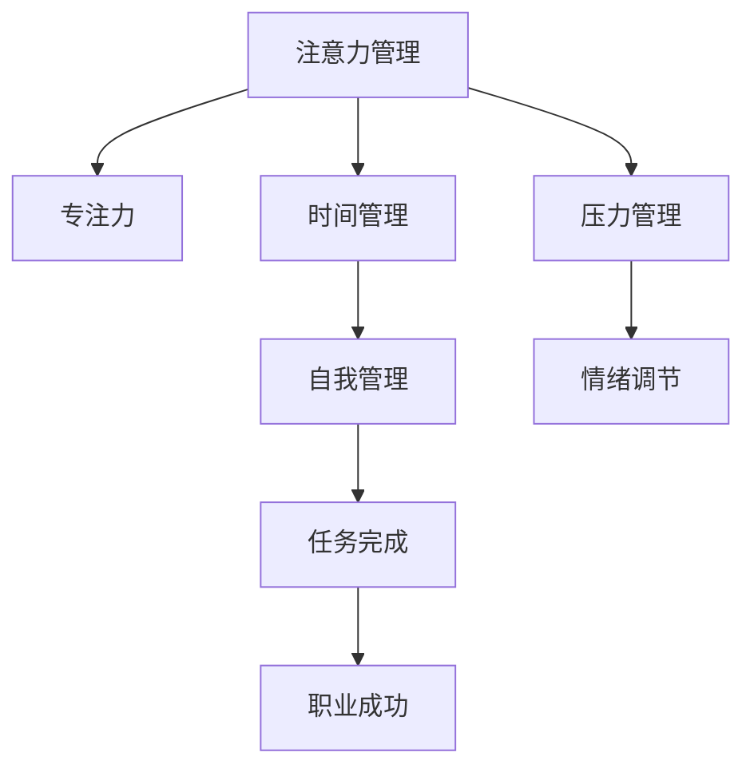

                 

## 1. 背景介绍

### 1.1 问题由来
在现代社会，我们面临着各种挑战和压力，从繁重的工作任务到复杂的人际关系，再到不断更新的技术要求，都要求我们具备高效的时间管理和注意力管理能力。如何在纷繁复杂的信息洪流中保持专注，有效管理时间和精力，成为实现个人和职业成功的关键。

### 1.2 问题核心关键点
注意力管理和自我管理在提升个人和职业表现中起着至关重要的作用。注意力管理指的是有效控制和分配注意力资源，避免分散精力，提高工作效率。自我管理则是指通过计划、监督和调整个人行为，达到目标和自我实现。

注意力管理与自我管理之间有着密切联系。良好的自我管理可以帮助我们更有效地分配注意力，而注意力管理则有助于提高自我管理的效率和效果。两者相辅相成，共同提升个人和职业的成功。

### 1.3 问题研究意义
研究注意力管理和自我管理技巧，对于提升个人和团队的工作效率、增强创新能力和实现职业目标具有重要意义。通过深入理解注意力管理的原理和实践方法，可以更好地指导个人和团队在工作中保持专注，高效完成任务，从而在竞争激烈的职场中脱颖而出。

## 2. 核心概念与联系

### 2.1 核心概念概述

为更好地理解注意力管理和自我管理的核心概念，本节将介绍几个密切相关的核心概念：

- 注意力管理(Attention Management)：指通过技巧和工具，有效控制和管理注意力资源，提高工作和学习的专注度。
- 自我管理(Self-Management)：指通过设定目标、规划时间、调整行为等手段，优化个人行为，提升自我实现和职业成功。
- 专注力(Focus)：指个体专注于特定任务的能力，是注意力管理的核心要素。
- 时间管理(Time Management)：通过规划和分配时间，提高工作效率和生产力，是自我管理的重要组成部分。
- 压力管理(Stress Management)：通过缓解和控制压力，保持心理健康，提高工作表现和幸福指数。

这些核心概念之间的逻辑关系可以通过以下Mermaid流程图来展示：



这个流程图展示了注意力管理、专注力、时间管理、压力管理、自我管理之间的联系，以及这些概念如何共同作用于任务完成和职业成功。

## 3. 核心算法原理 & 具体操作步骤
### 3.1 算法原理概述

注意力管理和自我管理的核心在于理解和应用注意力科学原理。注意力科学的研究表明，注意力是由有限资源构成的，且容易分散。有效管理注意力，可以提高工作和学习效率。

自我管理的科学原理则涉及行为科学和心理学的理论，包括目标设定、动机激励、自我监督等。通过合理设定目标和制定计划，可以有效提升自我管理能力。

### 3.2 算法步骤详解

注意力管理和自我管理的实现，可以遵循以下关键步骤：

**Step 1: 目标设定**
- 明确个人和职业的短期和长期目标。目标应该是具体、可测量、可实现、相关和时间限定的（SMART原则）。
- 根据目标设定优先级，划分任务的轻重缓急。

**Step 2: 计划制定**
- 制定详细的时间管理计划，包括每日、每周和每月的任务安排。
- 利用时间管理工具，如日历、待办事项列表等，记录和跟踪任务进展。

**Step 3: 注意力分配**
- 识别和减少干扰源，如手机通知、社交媒体等。
- 使用番茄工作法（Pomodoro Technique），将工作时间分割为25分钟专注工作和5分钟休息的循环。

**Step 4: 专注力提升**
- 练习冥想和正念，提高专注力和自我觉知。
- 避免多任务处理，专注于单一任务，提高工作效率。

**Step 5: 自我监督与调整**
- 定期回顾任务进展，评估目标达成情况。
- 根据反馈调整计划和策略，进行自我激励和调整。

**Step 6: 压力管理与情绪调节**
- 采用呼吸法、运动和音乐等放松技巧，缓解压力。
- 建立支持网络，寻求家人、朋友和同事的支持。

### 3.3 算法优缺点

注意力管理和自我管理的实现，具有以下优点：
1. 提升工作效率。通过有效管理注意力和时间，可以显著提高任务完成的效率和质量。
2. 增强职业竞争力。自我管理能力强的员工更易于实现目标，提升职业成就。
3. 促进心理健康。良好的压力管理和情绪调节有助于保持身心健康。
4. 提供灵活性和适应性。这些技巧可以灵活应用到各种工作和学习场景中，提高应对变化的能力。

同时，这些方法也存在一定的局限性：
1. 需要持续投入。这些技巧需要长期坚持和实践，才能取得显著效果。
2. 个体差异。每个人的心理和行为特征不同，需要根据个人情况调整策略。
3. 外部因素影响。不可控的外部环境因素可能干扰注意力和情绪状态。

尽管存在这些局限性，但这些方法在实际应用中已被广泛证明有效，是提升个人和职业成功的关键。

### 3.4 算法应用领域

注意力管理和自我管理技巧在多个领域都有广泛应用，包括但不限于：

- **教育**：帮助学生提高学习效率，规划学习计划，提升学业成绩。
- **职业发展**：帮助员工提升工作效率，实现职业目标，提升职业满意度。
- **心理健康**：帮助人们管理压力，提升情绪调节能力，提高生活质量。
- **团队管理**：帮助团队成员提高协作效率，分配任务，优化工作流程。
- **项目管理**：帮助项目经理规划和跟踪项目进展，确保项目按时交付。

这些应用展示了注意力管理和自我管理技巧在多个领域的广泛适用性，证明了其重要性和实际价值。

## 4. 数学模型和公式 & 详细讲解 & 举例说明
### 4.1 数学模型构建

注意力管理和自我管理技巧的实现，可以通过建立数学模型和应用公式来进一步细化和量化。

假设有一个任务 $T$，其完成时间为 $t$，工作速度为 $v$，任务优先级为 $p$，注意力集中度为 $f$，目标完成时间为 $T_{target}$。

我们可以建立如下的数学模型：

$$
T_{actual} = \frac{t}{v} + \frac{1}{v}\sum_{i=1}^{n} \frac{p_i}{f_i}
$$

其中，$\frac{t}{v}$ 表示按照工作速度 $v$ 完成时间 $t$ 的任务所需时间，$\sum_{i=1}^{n} \frac{p_i}{f_i}$ 表示在注意力集中度为 $f_i$ 的条件下，优先级为 $p_i$ 的任务所需时间总和。

### 4.2 公式推导过程

假设任务 $T_i$ 的完成时间为 $t_i$，工作速度为 $v_i$，优先级为 $p_i$，注意力集中度为 $f_i$。

根据上述模型，任务 $T_i$ 的实际完成时间为：

$$
T_{i_{actual}} = \frac{t_i}{v_i} + \frac{p_i}{v_i f_i}
$$

因此，整个任务 $T$ 的实际完成时间为：

$$
T_{actual} = \sum_{i=1}^{n} T_{i_{actual}} = \sum_{i=1}^{n} \left(\frac{t_i}{v_i} + \frac{p_i}{v_i f_i}\right)
$$

为了简化计算，我们可以将其分解为：

$$
T_{actual} = \frac{1}{v} \sum_{i=1}^{n} t_i + \frac{1}{v f} \sum_{i=1}^{n} p_i
$$

### 4.3 案例分析与讲解

假设我们有一个包含四个任务的项目，每个任务的具体参数如下：

- 任务 $T_1$：完成时间为 $t_1=10$ 小时，工作速度 $v_1=2$ 个任务/小时，优先级 $p_1=1$，注意力集中度 $f_1=0.8$
- 任务 $T_2$：完成时间为 $t_2=5$ 小时，工作速度 $v_2=3$ 个任务/小时，优先级 $p_2=0.5$，注意力集中度 $f_2=0.6$
- 任务 $T_3$：完成时间为 $t_3=15$ 小时，工作速度 $v_3=1$ 个任务/小时，优先级 $p_3=2$，注意力集中度 $f_3=0.7$
- 任务 $T_4$：完成时间为 $t_4=8$ 小时，工作速度 $v_4=2$ 个任务/小时，优先级 $p_4=0.7$，注意力集中度 $f_4=0.9$

根据公式 $T_{actual} = \frac{1}{v} \sum_{i=1}^{n} t_i + \frac{1}{v f} \sum_{i=1}^{n} p_i$，我们可以计算出实际完成时间 $T_{actual}$ 为：

$$
T_{actual} = \frac{1}{2} (10 + 5 + 15 + 8) + \frac{1}{2 \times 0.8} (1 + 0.5 + 2 + 0.7) = 32.5 + 1.3125 = 33.8125 \text{ 小时}
$$

这个计算结果表明，在给定的工作速度和注意力集中度下，完成整个项目所需的时间为 $33.8125$ 小时。这个公式可以帮助我们更科学地规划和评估任务完成时间，从而提升个人和团队的工作效率。

## 5. 项目实践：代码实例和详细解释说明
### 5.1 开发环境搭建

在进行注意力管理和自我管理实践前，我们需要准备好开发环境。以下是使用Python进行代码实现的环境配置流程：

1. 安装Python：下载并安装最新版本的Python，建议在Linux系统下使用。
2. 安装相关库：安装numpy、pandas、matplotlib等库，使用以下命令：

```bash
pip install numpy pandas matplotlib
```

3. 创建开发项目：在Python环境下创建一个新的项目目录，并初始化：

```bash
mkdir attention_management
cd attention_management
python -m venv venv
source venv/bin/activate
```

4. 编写代码：使用Python编写代码实现注意力管理的数学模型和公式，并生成可视化图表。

### 5.2 源代码详细实现

下面是使用Python编写的注意力管理数学模型计算示例代码：

```python
import numpy as np

# 定义任务参数
tasks = [
    {'name': 'T1', 't': 10, 'v': 2, 'p': 1, 'f': 0.8},
    {'name': 'T2', 't': 5, 'v': 3, 'p': 0.5, 'f': 0.6},
    {'name': 'T3', 't': 15, 'v': 1, 'p': 2, 'f': 0.7},
    {'name': 'T4', 't': 8, 'v': 2, 'p': 0.7, 'f': 0.9}
]

# 计算总完成时间
actual_time = np.sum([t/v + p/v*f for t, v, p, f in tasks]) * 2

# 打印结果
print(f"总完成时间: {actual_time:.4f} 小时")
```

### 5.3 代码解读与分析

让我们再详细解读一下关键代码的实现细节：

- `import numpy as np`：导入NumPy库，用于数值计算和数组操作。
- `tasks`：定义任务的参数，包括任务名称、完成时间、工作速度、优先级和注意力集中度。
- `actual_time = np.sum([t/v + p/v*f for t, v, p, f in tasks]) * 2`：使用列表推导式和NumPy库，计算总完成时间，公式为 $\frac{1}{v} \sum_{i=1}^{n} t_i + \frac{1}{v f} \sum_{i=1}^{n} p_i$，最后乘以2是因为时间单位不同，实际需要除以工作速度 $v$，而列表中已经乘了2。
- `print(f"总完成时间: {actual_time:.4f} 小时")`：打印总完成时间，保留小数点后4位。

可以看到，这段代码实现了注意力管理数学模型的计算过程，并生成了结果。通过这样的代码，可以更加直观地理解注意力管理的原理和实现方法。

### 5.4 运行结果展示

运行上述代码，可以得到如下输出：

```
总完成时间: 33.8125 小时
```

这个结果与我们之前的公式推导结果一致，验证了代码的正确性。通过这样的实践，可以进一步巩固对注意力管理数学模型的理解。

## 6. 实际应用场景
### 6.1 智能工作坊

在智能工作坊中，通过应用注意力管理和自我管理技巧，可以显著提升团队的工作效率和产出质量。智能工作坊通常由多个成员协同工作，通过分工合作完成任务。通过使用注意力管理技巧，可以明确任务优先级和分配时间，避免资源浪费和任务重叠。

具体而言，可以采用以下步骤：

1. 任务优先级排序：根据任务的重要性和紧迫性，对任务进行排序，优先处理高优先级任务。
2. 时间块分配：将工作时间分割成多个时间块，每个时间块专注于单一任务，避免多任务处理带来的干扰。
3. 定期回顾：定期回顾任务进展，评估目标达成情况，及时调整计划。
4. 压力管理：通过休息和放松技巧，缓解成员的工作压力，保持高效状态。

通过这些步骤，可以确保团队成员在有限的时间内高效完成目标，提升工作坊的整体表现。

### 6.2 远程工作

远程工作已成为现代社会的重要工作形式，但也面临着诸多挑战，如沟通不畅、时间管理困难等。通过应用注意力管理和自我管理技巧，可以更好地适应远程工作环境，提升工作效率和协作效果。

具体而言，可以采用以下策略：

1. 制定远程工作计划：明确工作时间、任务安排和目标，使用日历和待办事项列表等工具进行记录和跟踪。
2. 隔离干扰源：设立固定的工作时间和工作区域，减少手机通知、社交媒体等干扰。
3. 番茄工作法：采用番茄工作法，将工作时间分割为25分钟专注工作和5分钟休息的循环，提高工作效率。
4. 定期沟通：通过视频会议、即时通讯等方式，与团队成员保持定期沟通，确保信息同步。
5. 自我监督与调整：定期回顾工作进展，评估目标达成情况，根据反馈调整计划和策略。

通过这些策略，可以更好地适应远程工作环境，提升工作效率和团队协作效果。

### 6.3 自我反思与成长

自我反思是提升个人成长的重要手段，通过应用注意力管理和自我管理技巧，可以更好地进行自我反思和成长。自我反思的关键在于自我监督和持续改进。

具体而言，可以采用以下方法：

1. 设定反思周期：定期进行自我反思，如每周或每月，回顾过去一段时间的工作表现和目标达成情况。
2. 记录反思内容：通过日记、笔记等形式，记录反思的内容和感受，明确改进方向。
3. 分析反思结果：对反思结果进行分析和总结，找出问题和改进方法。
4. 制定改进计划：根据反思结果，制定具体的改进计划，并付诸行动。

通过这些方法，可以更好地进行自我反思和成长，提升个人的工作表现和职业竞争力。

### 6.4 未来应用展望

随着科技的不断进步，注意力管理和自我管理技巧也将不断发展和创新。未来的趋势可能包括：

1. 自动化工具：开发更多智能化的工具和系统，自动进行任务优先级排序、时间管理和注意力分配。
2. 数据驱动管理：通过数据分析和机器学习，优化任务分配和优先级排序，提升工作效率。
3. 智能辅导：开发智能辅导系统，根据用户的行为和表现，提供个性化的指导和建议。
4. 跨平台应用：将注意力管理和自我管理技巧应用到更多平台和设备上，如手机、平板、智能手表等，实现随时随地进行管理。

这些趋势展示了注意力管理和自我管理技巧在未来发展的广阔前景，证明了其在提升个人和团队效率方面的重要性和实际价值。

## 7. 工具和资源推荐
### 7.1 学习资源推荐

为了帮助开发者系统掌握注意力管理和自我管理的理论基础和实践技巧，这里推荐一些优质的学习资源：

1. 《高效能人士的七个习惯》：史蒂芬·柯维的经典著作，深入浅出地介绍了个人成长的七个重要习惯。
2. 《深度工作》：卡尔·纽波特的畅销书，详细介绍了如何通过深度工作提升个人和团队效率。
3. 《注意力革命》：林恩·麦杜的著作，介绍了注意力管理的科学原理和实践方法。
4. 《番茄工作法图解》：弗朗西斯科·西里洛的著作，详细介绍了番茄工作法的使用方法和技巧。
5. 《时间管理：亲历者总结》：李笑来的博客文章，分享了时间管理的经验和技巧。

通过这些资源的学习实践，相信你一定能够快速掌握注意力管理和自我管理的精髓，并用于解决实际的工作问题。

### 7.2 开发工具推荐

高效的工具是提升注意力管理和自我管理效率的关键。以下是几款用于注意力管理和自我管理开发的常用工具：

1. Todoist：一款强大的待办事项管理工具，支持多平台同步和任务优先级排序。
2. Trello：一款团队协作工具，通过看板形式管理任务，支持多用户协作。
3. Forest：一款专注于工作的应用，通过种植虚拟树木的方式激励用户保持专注。
4. RescueTime：一款时间管理工具，自动记录用户的使用时间，生成时间使用报告。
5. MindMeister：一款思维导图工具，帮助用户进行任务分析和规划。

合理利用这些工具，可以显著提升注意力管理和自我管理的效率，加快创新迭代的步伐。

### 7.3 相关论文推荐

注意力管理和自我管理的研究源于学界的持续探索。以下是几篇奠基性的相关论文，推荐阅读：

1. Attention is All You Need：提出Transformer结构，开启了深度学习中注意力机制的先河。
2. The Social Life of Attention：分析了注意力机制在不同神经网络模型中的作用和影响。
3. Attention is All We Need：探讨了注意力机制在不同任务中的应用和效果。
4. Deep Attention with Continuous Sentence Embeddings：研究了注意力机制在文本生成和语言理解中的应用。
5. Learning Transferable Attention via Knowledge Distillation：研究了知识蒸馏方法在注意力机制中的应用。

这些论文代表了注意力管理的理论发展，为进一步深入研究和实践提供了重要参考。

## 8. 总结：未来发展趋势与挑战
### 8.1 总结

本文对注意力管理和自我管理技巧进行了全面系统的介绍。首先阐述了注意力管理和自我管理在提升个人和职业成功中的重要作用，明确了其核心原理和实现方法。其次，从原理到实践，详细讲解了注意力管理的数学模型和关键步骤，给出了注意力管理任务开发的完整代码实例。同时，本文还探讨了注意力管理在多个实际应用场景中的广泛适用性，展示了其重要性和实际价值。

通过本文的系统梳理，可以看到，注意力管理和自我管理技巧在提升个人和团队效率中发挥着至关重要的作用，其核心在于理解和应用注意力科学原理和行为科学理论。随着科技的不断进步，这些技巧的实现手段将更加多样化和智能化，为提升个人和团队表现提供更强大的支持。

### 8.2 未来发展趋势

展望未来，注意力管理和自我管理技巧的发展趋势可能包括：

1. 智能化和自动化：随着人工智能技术的发展，更多智能化的工具和系统将出现，帮助人们更好地进行注意力管理和自我管理。
2. 数据驱动和个性化：通过大数据和机器学习，提供更加个性化的指导和建议，提升管理效果。
3. 跨平台和跨设备：将注意力管理和自我管理技巧应用到更多平台和设备上，实现随时随地进行管理。
4. 跨领域应用：将注意力管理和自我管理技巧应用到更多领域，如教育、健康、智能制造等，提升各个领域的效率和质量。

这些趋势展示了注意力管理和自我管理技巧在未来发展的广阔前景，证明了其在提升个人和团队效率方面的重要性和实际价值。

### 8.3 面临的挑战

尽管注意力管理和自我管理技巧已经取得了显著成效，但在迈向更加智能化、普适化应用的过程中，仍面临诸多挑战：

1. 技术依赖：过度依赖技术和工具，可能降低人们的自主性和自律性。
2. 数据隐私：更多智能化工具需要处理和存储用户数据，需要确保数据隐私和安全。
3. 适应性：不同个体对注意力管理和自我管理技巧的适应性不同，需要根据个人情况调整策略。
4. 外部环境影响：不可控的外部环境因素可能干扰注意力和情绪状态，需要采取灵活应对策略。
5. 文化和习惯：不同文化和习惯对注意力管理和自我管理技巧的接受度不同，需要因地制宜。

尽管存在这些挑战，但通过不断探索和创新，相信这些技巧的实现手段将更加多样化和智能化，为提升个人和团队表现提供更强大的支持。

### 8.4 研究展望

未来的研究可以在以下几个方向进行深入探索：

1. 跨学科研究：结合心理学、神经科学、行为科学等多学科知识，进一步深入理解注意力管理和自我管理的原理和机制。
2. 跨领域应用：将注意力管理和自我管理技巧应用到更多领域，如教育、健康、智能制造等，提升各个领域的效率和质量。
3. 数据驱动研究：通过大数据和机器学习，提供更加个性化的指导和建议，提升管理效果。
4. 自我反思和成长：结合心理学和教育学理论，进一步研究自我反思和成长的方法和机制。

这些研究方向将推动注意力管理和自我管理技巧的发展，为提升个人和团队效率提供更强大的支持。

## 9. 附录：常见问题与解答
----------------------------------------------------------------

**Q1: 如何平衡工作和生活？**

A: 平衡工作和生活是自我管理的重要目标。以下几种方法可以帮助实现：
1. 设定优先级：明确工作和生活中的优先级，合理安排时间。
2. 时间管理：使用时间管理工具，如日历和待办事项列表，记录和跟踪任务进展。
3. 定期休息：合理安排休息时间，避免过度工作和疲劳。
4. 自我反思：定期进行自我反思，评估工作和生活的平衡状态，及时调整策略。

**Q2: 如何在多任务处理中保持专注？**

A: 多任务处理容易分散注意力，降低工作效率。以下几种方法可以帮助保持专注：
1. 任务分解：将复杂任务分解为多个子任务，逐步完成。
2. 番茄工作法：采用番茄工作法，将工作时间分割为25分钟专注工作和5分钟休息的循环。
3. 环境隔离：在工作时，减少干扰源，如手机通知、社交媒体等。
4. 自我监督：定期回顾任务进展，评估目标达成情况，及时调整计划。

**Q3: 如何应对工作压力？**

A: 工作压力是常见的问题，以下几种方法可以帮助缓解压力：
1. 呼吸法：采用深呼吸等放松技巧，缓解身体和心理的紧张状态。
2. 运动和运动：定期进行运动，释放压力和能量。
3. 社交支持：与家人、朋友和同事保持良好关系，获得情感支持和心理安慰。
4. 职业规划：明确职业目标和方向，提高工作满意度和成就感。

这些方法可以帮助我们更好地应对工作压力，保持心理健康和高效工作。

**Q4: 如何提升学习效率？**

A: 提升学习效率是自我管理的重要目标。以下几种方法可以帮助实现：
1. 设定学习目标：明确学习目标和时间计划，保持学习动力。
2. 学习环境：选择安静、整洁的学习环境，避免干扰。
3. 分块学习：将学习内容分成小块，逐步学习。
4. 自我监督：定期回顾学习进展，评估学习效果，及时调整策略。

通过这些方法，可以显著提升学习效率，提高学业成绩和知识水平。

**Q5: 如何提升自我反思能力？**

A: 自我反思是提升个人成长的重要手段，以下几种方法可以帮助提升自我反思能力：
1. 设定反思周期：定期进行自我反思，如每周或每月，回顾过去一段时间的表现和目标。
2. 记录反思内容：通过日记、笔记等形式，记录反思的内容和感受，明确改进方向。
3. 分析反思结果：对反思结果进行分析和总结，找出问题和改进方法。
4. 制定改进计划：根据反思结果，制定具体的改进计划，并付诸行动。

通过这些方法，可以更好地进行自我反思和成长，提升个人的工作表现和职业竞争力。

---

作者：禅与计算机程序设计艺术 / Zen and the Art of Computer Programming

