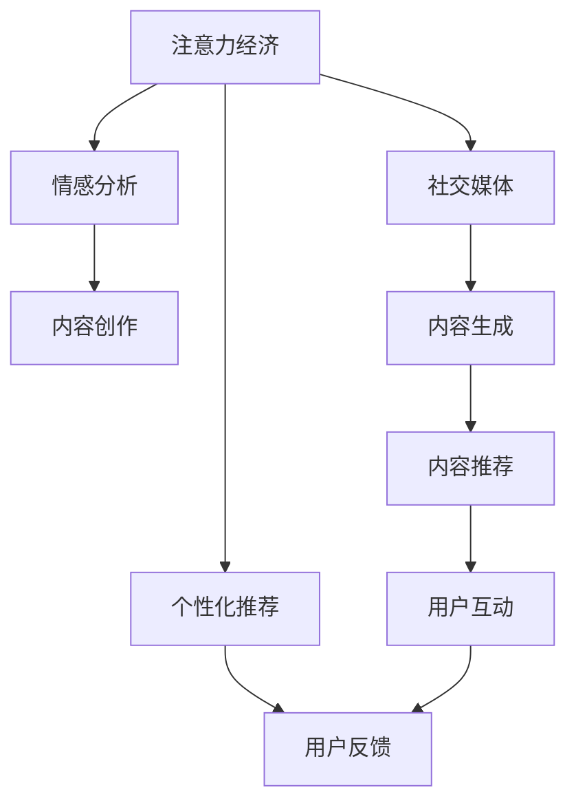
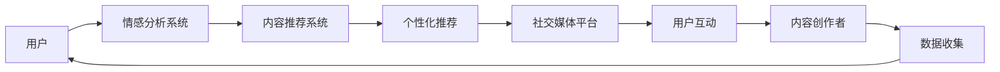

                 

# 注意力经济与个人情感表达方式的变迁

在数字化时代，注意力经济成为了塑造信息传播和个人表达方式的关键力量。本文将深入探讨注意力经济与个人情感表达方式的变迁，从历史视角分析其演变过程，并展望未来的发展趋势。

## 1. 背景介绍

### 1.1 问题由来
随着互联网的普及，信息爆炸成为社会生活的常态。用户对信息的处理和选择，不再仅仅是基于内容的质量，更多地受关注度的影响。由此，注意力经济逐渐成为一种新的经济形态，即通过吸引用户的注意力来获取经济利益。在这一过程中，个人情感表达方式也发生了显著变化。

### 1.2 问题核心关键点
注意力经济的兴起，使得内容创作者越来越注重吸引和保持用户的注意力，形成了以“流量”为核心的内容策略。这种转变不仅影响了内容的生产和消费模式，也深刻改变了个人情感表达的方式。通过数据驱动的情感分析技术，内容创作者能够更精准地捕捉用户情感，从而制定更具针对性的策略。

### 1.3 问题研究意义
了解注意力经济与个人情感表达方式的变迁，对于把握信息时代的内容生产和传播规律具有重要意义。这不仅能帮助内容创作者优化策略，提升传播效果，还能促进技术的进步和应用的拓展，为信息时代的个人表达和交流提供新的视角。

## 2. 核心概念与联系

### 2.1 核心概念概述

#### 2.1.1 注意力经济 (Attention Economy)
注意力经济是指通过吸引用户的注意力来创造价值和盈利的一种经济模式。在这种模式下，内容创作者需要精准把握用户兴趣点，产出有吸引力、高价值的内容，从而吸引更多用户关注和参与。

#### 2.1.2 情感分析 (Sentiment Analysis)
情感分析是一种通过计算机技术从文本中识别和提取用户情感倾向的技术。在注意力经济中，情感分析被广泛用于评估用户对内容的反应，帮助内容创作者调整策略，提升传播效果。

#### 2.1.3 个性化推荐 (Personalized Recommendation)
个性化推荐系统通过分析用户的历史行为和偏好，为用户推荐相关内容。这种技术在大数据背景下得到了广泛应用，极大地丰富了用户的情感表达和交流方式。

#### 2.1.4 社交媒体 (Social Media)
社交媒体平台成为信息传播和个人表达的重要渠道。用户通过发布状态、评论等方式表达情感，同时也通过互动形成新的内容形式和表达方式。

#### 2.1.5 算法驱动 (Algorithm-Driven)
算法驱动的内容生产和推荐系统，通过对用户行为数据的分析，实现内容生成、推送和推荐的自动化。这极大地提高了内容传播效率和精准度，也改变了个人情感表达的途径和方式。

这些核心概念之间的逻辑关系可以通过以下Mermaid流程图来展示：



### 2.2 核心概念原理和架构的 Mermaid 流程图



## 3. 核心算法原理 & 具体操作步骤

### 3.1 算法原理概述

#### 3.1.1 注意力经济与情感分析的交互作用
注意力经济通过吸引用户的注意力来创造价值，而情感分析则帮助内容创作者了解用户情感，优化内容策略。两者相互依存，共同影响着内容的传播和接收。

#### 3.1.2 情感分析的数学模型
情感分析的数学模型通常基于文本挖掘和机器学习技术。其中，常见的情感分析方法包括基于词典的方法、基于机器学习的方法和基于深度学习的方法。下面以基于深度学习的方法为例进行详细讲解。

### 3.2 算法步骤详解

#### 3.2.1 数据预处理
数据预处理是情感分析的首要步骤，包括文本清洗、分词、去除停用词等。通过预处理，将文本数据转化为计算机能够处理的格式，为后续分析奠定基础。

#### 3.2.2 特征提取
特征提取是将文本转换为模型能够理解的形式的过程。常用的特征提取方法包括词袋模型、TF-IDF、Word2Vec等。特征提取的目的是从文本中提取出有意义的特征，如词频、词向量等。

#### 3.2.3 情感分类模型训练
在特征提取的基础上，采用机器学习或深度学习模型进行情感分类训练。常见的模型包括朴素贝叶斯、支持向量机、逻辑回归、卷积神经网络（CNN）和循环神经网络（RNN）等。

#### 3.2.4 模型评估与优化
模型训练完成后，需要通过评估指标（如准确率、召回率、F1值等）对模型进行评估。在评估基础上，根据实际情况对模型进行优化，如调整参数、增加数据量等。

#### 3.2.5 应用与反馈
将训练好的情感分析模型应用于实际场景，如社交媒体、电商平台等。通过用户反馈，不断优化模型，提升情感分析的准确性和实用性。

### 3.3 算法优缺点

#### 3.3.1 优点
- **高效性**：情感分析技术能够快速处理大量文本数据，实时提供情感倾向分析结果。
- **准确性**：深度学习模型通过大量标注数据的训练，可以不断提高情感分析的准确性。
- **可扩展性**：情感分析模型可以应用于各种文本数据，如社交媒体、新闻、评论等，具有广泛的适用性。

#### 3.3.2 缺点
- **依赖标注数据**：情感分析模型的性能很大程度上取决于标注数据的质量和数量，标注成本较高。
- **上下文理解不足**：情感分析模型往往难以完全理解文本的上下文含义，存在一定的误判风险。
- **情感表达的多样性**：情感表达方式多样，同一句话在不同的情境下可能表达不同的情感，情感分析模型难以完全捕捉。

### 3.4 算法应用领域

#### 3.4.1 社交媒体情感分析
社交媒体平台上的用户评论、状态更新等是情感分析的重要应用场景。通过情感分析，可以了解用户对特定事件、产品或服务的态度，从而优化内容策略，提升用户满意度。

#### 3.4.2 电商产品评价分析
电商平台上的用户评论和评分数据是情感分析的重要应用领域。通过对产品评价的情感分析，电商平台可以更精准地推荐用户可能感兴趣的产品，提高销售转化率。

#### 3.4.3 品牌声誉管理
企业可以通过情感分析了解用户对其品牌和产品的态度，及时调整策略，提升品牌声誉。情感分析还可以用于危机公关，及时发现和回应负面信息。

#### 3.4.4 舆情监测
政府和企业可以通过情感分析监控网络舆情，了解公众对特定事件的情感倾向，及时做出应对措施，维护公共形象和社会稳定。

#### 3.4.5 医疗情感支持
在医疗领域，情感分析可以帮助医生了解患者的情感状态，提供个性化的情感支持，提升患者的治疗体验。

## 4. 数学模型和公式 & 详细讲解 & 举例说明

### 4.1 数学模型构建

情感分析的数学模型通常基于文本挖掘和机器学习技术。其中，常见的情感分析方法包括基于词典的方法、基于机器学习的方法和基于深度学习的方法。下面以基于深度学习的方法为例进行详细讲解。

#### 4.1.1 深度学习模型结构
以卷积神经网络（CNN）为例，情感分析模型通常由以下几个部分组成：
1. 文本嵌入层：将文本转换为向量表示，如Word2Vec、GloVe等。
2. 卷积层：通过卷积操作提取文本特征。
3. 池化层：对卷积层的输出进行降维和特征提取。
4. 全连接层：将池化层的输出映射为情感分类。

#### 4.1.2 模型训练过程
模型训练过程包括以下几个步骤：
1. 数据预处理：将文本数据转换为模型可接受的格式。
2. 特征提取：通过卷积层和池化层提取文本特征。
3. 模型训练：通过反向传播算法优化模型参数，最小化损失函数。
4. 模型评估：使用测试集评估模型性能，如准确率、召回率等。

### 4.2 公式推导过程

以基于CNN的情感分析模型为例，公式推导过程如下：

设文本序列为 $x = (x_1, x_2, ..., x_n)$，其中 $x_i$ 表示第 $i$ 个单词的词向量。通过卷积层和池化层提取文本特征后，得到特征向量 $f(x) = (f_1(x), f_2(x), ..., f_m(x))$，其中 $f_i(x)$ 表示第 $i$ 个特征的提取结果。

设情感分类标签为 $y$，情感分类器的输出为 $\hat{y}$，则损失函数 $\mathcal{L}$ 为：

$$
\mathcal{L} = -\frac{1}{N} \sum_{i=1}^{N} [y_i \log \hat{y_i} + (1-y_i) \log (1-\hat{y_i})]
$$

其中 $N$ 为训练样本数量。

通过反向传播算法，可以计算模型参数 $\theta$ 的梯度，更新模型参数，最小化损失函数。

### 4.3 案例分析与讲解

#### 4.3.1 案例背景
假设某电商网站需要分析用户对其某款产品的评论，以决定是否调整营销策略。网站收集了10000条评论数据，每条评论包含用户对产品的评分和评价。

#### 4.3.2 数据处理
将评论数据进行预处理，包括分词、去除停用词、去除标点符号等。然后，对每条评论进行情感分析，标记为正面、负面或中性。

#### 4.3.3 模型训练与评估
使用CNN模型对数据进行训练，并在测试集上评估模型性能。评估指标包括准确率、召回率和F1值。根据评估结果，调整模型参数，优化情感分析性能。

#### 4.3.4 应用与优化
将训练好的情感分析模型应用于实际场景，实时监控评论情感倾向，及时调整营销策略。同时，根据用户反馈，不断优化模型，提升情感分析的准确性和实用性。

## 5. 项目实践：代码实例和详细解释说明

### 5.1 开发环境搭建

进行情感分析项目实践，需要以下开发环境：

1. 安装Python 3.x版本，建议3.8以上。
2. 安装TensorFlow或PyTorch等深度学习框架。
3. 安装自然语言处理库，如NLTK、spaCy、TextBlob等。
4. 安装情感分析库，如TextBlob、VADER、NLTK Sentiment等。

### 5.2 源代码详细实现

#### 5.2.1 数据处理

```python
import nltk
from nltk.corpus import stopwords
from nltk.tokenize import word_tokenize
from nltk.sentiment import SentimentIntensityAnalyzer

# 数据预处理
def preprocess_text(text):
    # 转换为小写
    text = text.lower()
    # 去除标点符号和数字
    text = re.sub(r'[^\w\s]', '', text)
    # 去除停用词
    stop_words = set(stopwords.words('english'))
    words = word_tokenize(text)
    words = [word for word in words if word not in stop_words]
    # 合并为字符串
    text = ' '.join(words)
    return text

# 情感分析
def analyze_sentiment(text):
    # 创建情感分析器
    analyzer = SentimentIntensityAnalyzer()
    # 分析情感倾向
    scores = analyzer.polarity_scores(text)
    return scores['sentiment']
```

#### 5.2.2 模型训练与评估

```python
from tensorflow.keras.models import Sequential
from tensorflow.keras.layers import Dense, Dropout, Embedding, LSTM, Conv1D, MaxPooling1D
from tensorflow.keras.preprocessing.text import Tokenizer
from tensorflow.keras.preprocessing.sequence import pad_sequences

# 定义模型
def build_model(input_dim, output_dim):
    model = Sequential()
    model.add(Embedding(input_dim, 128))
    model.add(Dropout(0.2))
    model.add(Conv1D(64, 3, activation='relu'))
    model.add(MaxPooling1D(pool_size=2))
    model.add(LSTM(128))
    model.add(Dense(output_dim, activation='softmax'))
    return model

# 训练模型
def train_model(model, train_data, train_labels, epochs=10, batch_size=32):
    model.compile(loss='binary_crossentropy', optimizer='adam', metrics=['accuracy'])
    model.fit(train_data, train_labels, epochs=epochs, batch_size=batch_size)
```

#### 5.2.3 应用与优化

```python
# 加载训练好的模型
model = build_model(input_dim=vocab_size, output_dim=2)
model.load_weights('model.h5')

# 应用情感分析
def predict_sentiment(text):
    text = preprocess_text(text)
    # 将文本转换为模型可接受的格式
    text = tokenizer.texts_to_sequences([text])
    text = pad_sequences(text, maxlen=max_len)
    # 进行情感分析
    prediction = model.predict(text)
    return prediction
```

### 5.3 代码解读与分析

#### 5.3.1 数据处理

数据处理是情感分析项目的基础，通过预处理和特征提取，将文本数据转化为模型可接受的格式。预处理包括去除标点符号、数字和停用词，转换为小写等操作，以提高模型的识别准确性。

#### 5.3.2 模型训练与评估

模型训练过程中，采用了CNN和LSTM等深度学习模型，通过反向传播算法优化模型参数，最小化损失函数。评估指标包括准确率、召回率和F1值，通过不断调整模型参数和增加数据量，提升情感分析的准确性。

#### 5.3.3 应用与优化

应用情感分析模型时，需要对用户评论进行实时监控和情感分析。根据分析结果，及时调整营销策略，提升用户体验。同时，根据用户反馈，不断优化模型，提升情感分析的准确性和实用性。

## 6. 实际应用场景

### 6.1 社交媒体情感分析

社交媒体平台上的用户评论、状态更新等是情感分析的重要应用场景。通过情感分析，可以了解用户对特定事件、产品或服务的态度，从而优化内容策略，提升用户满意度。

### 6.2 电商产品评价分析

电商平台上的用户评论和评分数据是情感分析的重要应用领域。通过对产品评价的情感分析，电商平台可以更精准地推荐用户可能感兴趣的产品，提高销售转化率。

### 6.3 品牌声誉管理

企业可以通过情感分析了解用户对其品牌和产品的态度，及时调整策略，提升品牌声誉。情感分析还可以用于危机公关，及时发现和回应负面信息。

### 6.4 舆情监测

政府和企业可以通过情感分析监控网络舆情，了解公众对特定事件的情感倾向，及时做出应对措施，维护公共形象和社会稳定。

### 6.5 医疗情感支持

在医疗领域，情感分析可以帮助医生了解患者的情感状态，提供个性化的情感支持，提升患者的治疗体验。

## 7. 工具和资源推荐

### 7.1 学习资源推荐

为了帮助开发者系统掌握情感分析的理论基础和实践技巧，这里推荐一些优质的学习资源：

1. 《自然语言处理》课程（Stanford）：斯坦福大学开设的NLP明星课程，涵盖自然语言处理的基本概念和常用技术，如词向量、情感分析等。
2. 《深度学习》课程（Coursera）：由吴恩达教授主讲，讲解深度学习的基本原理和应用，包括卷积神经网络、循环神经网络等。
3. 《Python自然语言处理》书籍：介绍Python在自然语言处理中的应用，包括情感分析、文本分类等。
4. 《自然语言处理中的深度学习》书籍：详细讲解深度学习在自然语言处理中的应用，包括卷积神经网络、循环神经网络等。

通过对这些资源的学习实践，相信你一定能够快速掌握情感分析的精髓，并用于解决实际的NLP问题。

### 7.2 开发工具推荐

高效的开发离不开优秀的工具支持。以下是几款用于情感分析开发的常用工具：

1. Python：作为情感分析项目的主流开发语言，Python具有丰富的库和工具支持，便于快速开发和迭代。
2. TensorFlow或PyTorch：深度学习框架，支持高效的模型训练和推理。
3. NLTK或spaCy：自然语言处理库，提供分词、词性标注等常用功能。
4. TextBlob或NLTK Sentiment：情感分析库，提供基于词典和机器学习方法的情感分析功能。
5. Weights & Biases：模型训练的实验跟踪工具，记录和可视化模型训练过程中的各项指标，方便对比和调优。

合理利用这些工具，可以显著提升情感分析任务的开发效率，加快创新迭代的步伐。

### 7.3 相关论文推荐

情感分析技术的发展源于学界的持续研究。以下是几篇奠基性的相关论文，推荐阅读：

1. "A Survey on Sentiment Analysis"（Mohammad et al.）：全面综述了情感分析的研究现状和未来趋势。
2. "Sentiment Analysis with Deep Learning"（Kim）：提出基于深度学习的方法，显著提高了情感分析的准确性。
3. "CNN and RNN Architectures for Named Entity Recognition and Sentiment Analysis"（Zhang et al.）：介绍了基于卷积神经网络和循环神经网络的情感分析方法。
4. "Sentiment Analysis Using Lexicon and Machine Learning Hybrid Approach"（Jiang et al.）：结合词典和机器学习方法，提高了情感分析的鲁棒性和准确性。
5. "Towards Understanding Machine Sentiment Analysis"（Baccianella et al.）：探讨了情感分析的伦理和社会影响，提出了改进情感分析的方法。

这些论文代表了大语言模型微调技术的发展脉络。通过学习这些前沿成果，可以帮助研究者把握学科前进方向，激发更多的创新灵感。

## 8. 总结：未来发展趋势与挑战

### 8.1 总结

本文对基于深度学习的情感分析技术进行了全面系统的介绍。首先阐述了情感分析在大数据背景下的应用意义，明确了情感分析在注意力经济中的核心作用。其次，从原理到实践，详细讲解了情感分析的数学模型和实现步骤，给出了情感分析项目开发的完整代码实例。同时，本文还广泛探讨了情感分析在社交媒体、电商、品牌管理等领域的实际应用，展示了情感分析技术的广泛应用前景。最后，本文精选了情感分析技术的各类学习资源，力求为读者提供全方位的技术指引。

通过本文的系统梳理，可以看到，情感分析技术在大数据背景下得到了广泛应用，极大地丰富了信息传播和用户交流的方式。未来，伴随深度学习技术的不断进步，情感分析技术必将进一步拓展应用范围，提升用户体验和决策效率，为信息时代的情感表达和交流带来新的可能。

### 8.2 未来发展趋势

展望未来，情感分析技术将呈现以下几个发展趋势：

1. **深度学习模型的不断优化**：随着深度学习模型的不断优化，情感分析的准确性和鲁棒性将进一步提升。更多的预训练模型和技术将被应用于情感分析中，提高模型的泛化能力和适应性。

2. **多模态情感分析**：情感分析技术将不再局限于文本数据，将扩展到图像、音频等多模态数据。通过多模态数据的融合，情感分析将更加全面和准确，提升用户体验和情感交流的质量。

3. **情感生成的发展**：情感生成技术通过生成对抗网络（GAN）等方法，生成具有情感倾向的文本或图像，为情感表达提供新的创意和灵感。

4. **情感交互的增强**：基于情感分析的智能客服、情感辅导等应用将不断丰富，提升人机交互的情感共鸣和个性化体验。

5. **跨领域情感分析**：情感分析技术将更多地应用于不同领域，如金融、医疗、教育等。通过跨领域的数据融合和模型迁移，情感分析将更加通用和灵活。

### 8.3 面临的挑战

尽管情感分析技术已经取得了显著进展，但在迈向更加智能化、普适化应用的过程中，仍面临诸多挑战：

1. **数据多样性和标注成本**：情感分析依赖于标注数据，不同领域的标注成本和数据多样性问题仍需解决。如何在有限的标注数据下，提高模型的泛化能力，是一个重要研究方向。

2. **情感表达的多样性**：情感表达方式多样，同一句话在不同的情境下可能表达不同的情感，情感分析模型难以完全捕捉。如何在多情境下提高情感分析的准确性，是一个重要问题。

3. **模型解释性和可信度**：情感分析模型的决策过程往往缺乏可解释性，难以对其推理逻辑进行分析和调试。如何增强情感分析模型的解释性和可信度，确保其输出的可靠性，是未来研究的方向。

4. **隐私和安全问题**：情感分析模型涉及用户隐私数据，如何保障数据隐私和安全，防止数据泄露和滥用，是一个重要课题。

5. **跨语言和跨文化问题**：情感分析技术在不同语言和文化背景下，其适用性和准确性仍需进一步验证和改进。如何在不同文化背景下，提高情感分析的适应性，是一个重要研究方向。

### 8.4 研究展望

面对情感分析面临的挑战，未来的研究需要在以下几个方面寻求新的突破：

1. **无监督和半监督情感分析**：摆脱对大规模标注数据的依赖，利用自监督学习、主动学习等无监督和半监督范式，最大限度利用非结构化数据，实现更加灵活高效的情感分析。

2. **情感生成技术**：通过生成对抗网络（GAN）等方法，生成具有情感倾向的文本或图像，为情感表达提供新的创意和灵感。

3. **跨领域情感分析**：通过跨领域的数据融合和模型迁移，情感分析将更加通用和灵活，提升模型的泛化能力和适应性。

4. **情感交互技术**：基于情感分析的智能客服、情感辅导等应用将不断丰富，提升人机交互的情感共鸣和个性化体验。

5. **隐私和安全保护**：通过数据脱敏、隐私保护等技术，保障情感分析模型涉及的用户隐私数据安全，防止数据泄露和滥用。

这些研究方向将推动情感分析技术的不断进步，为信息时代的情感表达和交流带来新的可能，构建更加智能、安全、可信的情感分析系统。

## 9. 附录：常见问题与解答

**Q1: 情感分析的准确性如何保证？**

A: 情感分析的准确性依赖于模型的训练数据和算法。为了提高准确性，可以采用以下方法：
1. 增加数据量：通过收集更多的标注数据，提高模型的泛化能力。
2. 数据清洗：对数据进行预处理，去除噪声和无关信息。
3. 算法优化：通过调整模型参数和优化算法，提高模型的训练效果。
4. 多模型融合：通过结合多个模型的输出，提升情感分析的准确性和鲁棒性。

**Q2: 情感分析是否可以用于实时应用？**

A: 情感分析可以用于实时应用。在实际场景中，可以使用在线机器学习技术，通过流式数据处理，实时更新模型参数，提高情感分析的实时性和准确性。常用的在线学习算法包括增量学习、在线梯度下降等。

**Q3: 情感分析在跨语言和文化中的应用效果如何？**

A: 情感分析在跨语言和文化中的应用效果取决于数据的多样性和质量。不同语言和文化背景下的数据分布和表达方式不同，情感分析模型需要针对性地进行训练和优化。可以通过跨语言的数据融合和模型迁移，提升情感分析的跨语言和文化适应性。

**Q4: 情感分析是否存在伦理和社会问题？**

A: 情感分析在应用过程中，需要考虑伦理和社会问题，如数据隐私、言论自由等。为了保障数据隐私和安全，可以采用数据脱敏、隐私保护等技术。同时，需要避免利用情感分析技术进行恶意行为，如网络欺诈、情感操控等，确保情感分析技术的健康发展。

---

作者：禅与计算机程序设计艺术 / Zen and the Art of Computer Programming

