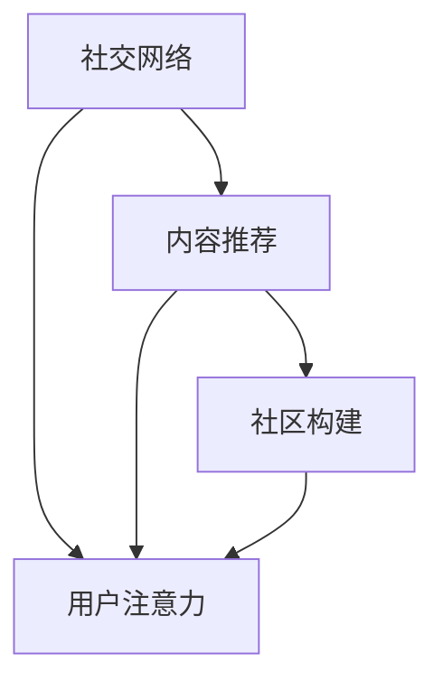

                 

# 注意力经济与个人社交网络的重构

> 关键词：注意力经济, 个人社交网络, 社交网络优化, 用户行为分析, 社区推荐系统

## 1. 背景介绍

### 1.1 问题由来
在互联网时代，社交网络成为了人们获取信息、表达自我、连接关系的主要渠道。然而，传统的社交网络往往存在信息过载、内容同质化、关系浅薄等问题，难以满足用户深度互动和个性化需求。随着技术的发展，如何构建更加智能、高效、人性化的个人社交网络，成为当下社交媒体平台和科技公司面临的重要挑战。

### 1.2 问题核心关键点
为了解决这个问题，本文聚焦于个人社交网络的优化与重构，探讨了注意力机制在提升社交网络互动质量和用户个性化体验中的应用。重点分析了用户注意力获取、内容推荐、社区构建等关键环节，旨在通过更智能化的算法和技术，实现社交网络的持续优化和重构，提升用户的满意度和平台的用户粘性。

### 1.3 问题研究意义
研究社交网络中的注意力经济，对于提升平台的用户参与度和满意度，构建更加紧密、有价值的社会关系，具有重要意义：

1. **用户参与度提升**：通过精准的内容推荐和个性化互动，提升用户对平台的粘性，增加用户活跃度。
2. **社交价值最大化**：合理分配用户注意力资源，实现优质内容的有效传播，扩大影响力。
3. **商业价值增加**：增强用户与平台的互动，提高广告和服务的转化率，实现商业价值最大化。
4. **技术创新**：带动社交网络优化、推荐系统、机器学习等领域的技术进步，推动行业发展。

## 2. 核心概念与联系

### 2.1 核心概念概述

为更好地理解注意力经济在社交网络中的应用，本节将介绍几个关键概念：

- **社交网络**：由用户、内容、关系构成的虚拟社区，旨在通过互动和分享，构建有价值的社会关系。
- **注意力经济**：基于用户注意力的经济活动，通过争夺用户注意力实现价值变现。
- **用户注意力**：指用户对信息的关注程度，包括关注量、参与度、互动频率等。
- **内容推荐**：通过算法推荐系统，将内容精准推送给用户，提升用户满意度和互动率。
- **社区构建**：通过算法和策略，引导用户构建更加紧密、有价值的社会关系网络。

这些概念之间的逻辑关系可以通过以下Mermaid流程图来展示：



这个流程图展示了几类核心概念及其之间的关系：

1. 社交网络由内容推荐、用户注意力、社区构建三部分构成。
2. 内容推荐通过算法提升用户满意度，从而吸引更多注意力。
3. 用户注意力影响内容推荐和社区构建，形成良性循环。
4. 社区构建通过引导用户互动，增强社交价值。

这些概念共同构成了社交网络的运作机制，使平台能够持续优化和重构，提升用户体验。

## 3. 核心算法原理 & 具体操作步骤
### 3.1 算法原理概述

社交网络中的注意力经济，核心在于如何通过智能算法，精准捕捉和分配用户注意力，从而实现价值最大化。其主要包括以下几个关键步骤：

1. **用户注意力获取**：通过分析和预测用户行为，量化用户对内容的关注度。
2. **内容推荐优化**：基于用户注意力特征，构建推荐模型，精准推送用户感兴趣的内容。
3. **社区构建策略**：引导用户互动，构建紧密、有价值的社会关系网络。

### 3.2 算法步骤详解

#### 3.2.1 用户注意力获取

用户注意力的获取，通常通过以下几个步骤实现：

1. **行为数据收集**：收集用户在社交网络上的各种行为数据，如浏览、点赞、评论、分享等。
2. **特征提取**：从行为数据中提取用户的关键特征，如兴趣偏好、社交网络结构、时间分布等。
3. **注意力模型训练**：基于提取的特征，训练注意力模型，量化用户对不同内容的关注度。

常用的注意力模型包括：

- **CTR模型**：通过点击率预测用户对内容的兴趣，衡量用户注意力。
- **RNN模型**：利用时间序列数据，捕捉用户行为的时间特征。
- **LSTM模型**：对用户行为进行长短期记忆网络建模，深入理解用户偏好。
- **GNN模型**：利用图神经网络，分析用户社交网络结构，捕捉社交影响。

#### 3.2.2 内容推荐优化

内容推荐系统是社交网络中的关键环节，其核心目标是通过智能算法，将最适合的内容精准推送给用户。推荐模型的训练通常包括以下几个步骤：

1. **数据准备**：收集用户历史行为数据，标记用户对不同内容的兴趣。
2. **特征工程**：提取内容的关键特征，如文本关键词、作者、时间戳等。
3. **模型训练**：基于用户历史行为和内容特征，训练推荐模型，如协同过滤、基于内容的推荐、深度学习推荐等。
4. **模型评估**：在测试集上评估推荐模型的准确率和用户满意度，进行调优。

推荐模型常用的技术包括：

- **协同过滤**：通过用户行为数据，推荐相似用户感兴趣的内容。
- **基于内容的推荐**：利用内容特征，推荐相似或相关内容。
- **深度学习推荐**：利用神经网络模型，挖掘内容的深层次特征，提高推荐精度。

#### 3.2.3 社区构建策略

社区构建策略旨在通过引导用户互动，构建紧密、有价值的社会关系网络。常用的策略包括：

1. **社交网络分析**：利用图神经网络，分析用户关系网络结构，挖掘潜在的社交机会。
2. **社区推荐算法**：推荐兴趣相似的用户，促进用户之间的互动和交流。
3. **活动策划**：策划和举办线上线下活动，增强用户粘性，提升社区活跃度。
4. **用户激励机制**：设计用户激励机制，如积分、徽章、特权等，激励用户参与互动。

### 3.3 算法优缺点

注意力经济在社交网络中的应用，具有以下优点：

1. **提升用户体验**：通过精准的内容推荐，提升用户满意度，增强用户粘性。
2. **增加商业价值**：通过优化社交网络，提高广告和服务的转化率，实现商业价值最大化。
3. **技术进步**：带动社交网络优化、推荐系统、机器学习等领域的技术进步，推动行业发展。

同时，也存在一些缺点：

1. **隐私风险**：收集和分析用户行为数据可能侵犯用户隐私，需要严格遵守相关法律法规。
2. **数据质量问题**：行为数据的准确性和完整性对模型的效果有重要影响，数据质量不足会影响推荐效果。
3. **模型公平性**：推荐模型可能存在偏见，导致某些用户群体被忽视，需要优化算法公平性。
4. **计算资源消耗**：大规模推荐系统的计算复杂度较高，需要高性能计算资源支持。

### 3.4 算法应用领域

注意力经济在社交网络中的应用，已经在众多领域得到广泛应用，例如：

1. **电商社交平台**：如淘宝、京东等，通过内容推荐提升用户购物体验，增加交易转化率。
2. **社交媒体平台**：如微博、抖音等，通过内容推荐和社区构建，提升用户粘性和平台活跃度。
3. **视频分享平台**：如YouTube、B站等，通过内容推荐和活动策划，增强用户互动，提升平台流量。
4. **新闻信息平台**：如头条、腾讯新闻等，通过内容推荐和社交网络分析，提升新闻阅读量和用户满意度。

除了这些典型应用外，注意力经济还广泛应用于在线教育、智能客服、广告投放等诸多领域，为各行各业带来新的机遇和挑战。

## 4. 数学模型和公式 & 详细讲解  
### 4.1 数学模型构建

本节将使用数学语言对社交网络中的注意力经济进行更加严格的刻画。

记社交网络中的用户为 $U=\{u_1, u_2, ..., u_n\}$，内容为 $C=\{c_1, c_2, ..., c_m\}$，用户与内容之间的关系表示为 $R(u_i, c_j)$。用户对内容 $c_j$ 的兴趣度为 $a_{ij}$，表示用户 $u_i$ 对内容 $c_j$ 的关注程度。

定义注意力模型为 $A(u_i, c_j) = f(u_i, c_j)$，其中 $f$ 为函数，通常基于用户行为数据和内容特征训练得到。

### 4.2 公式推导过程

我们以协同过滤模型为例，推导用户对内容的兴趣度计算公式。

设用户 $u_i$ 对内容 $c_j$ 的兴趣度为 $a_{ij}$，内容 $c_j$ 的平均兴趣度为 $\overline{a_j}$。则协同过滤模型的用户兴趣度计算公式为：

$$
a_{ij} = \alpha \cdot R(u_i, c_j) + (1-\alpha) \cdot \frac{\Sigma_{k=1}^m R(u_k, c_j) \cdot a_{kj}}{\Sigma_{k=1}^m R(u_k, c_j)}
$$

其中 $\alpha$ 为衰减系数，$R(u_i, c_j)$ 为用户与内容的相似度。

该公式反映了用户对内容兴趣的动态调整，同时考虑了内容受欢迎程度和用户行为相似性。

### 4.3 案例分析与讲解

以电商社交平台为例，分析注意力经济的应用：

- **用户行为数据收集**：收集用户浏览、购买、评价等行为数据。
- **内容特征提取**：提取商品的图片、描述、价格等特征。
- **模型训练**：基于用户行为数据和商品特征，训练协同过滤模型，预测用户对商品的兴趣度。
- **推荐优化**：根据用户兴趣度，推荐最适合的商品，提升用户购物体验。

## 5. 项目实践：代码实例和详细解释说明
### 5.1 开发环境搭建

在进行社交网络优化实践前，我们需要准备好开发环境。以下是使用Python进行推荐系统开发的环境配置流程：

1. 安装Anaconda：从官网下载并安装Anaconda，用于创建独立的Python环境。

2. 创建并激活虚拟环境：
```bash
conda create -n recommendation-env python=3.8 
conda activate recommendation-env
```

3. 安装推荐系统相关库：
```bash
pip install pandas numpy scikit-learn scipy tqdm
```

4. 安装深度学习框架：
```bash
pip install tensorflow keras tensorflow-hub
```

5. 安装深度推荐系统常用工具：
```bash
pip install jieba gensim word2vec pytorch
```

完成上述步骤后，即可在`recommendation-env`环境中开始社交网络优化实践。

### 5.2 源代码详细实现

下面以协同过滤模型为例，给出使用PyTorch实现推荐系统的PyTorch代码实现。

首先，定义数据预处理函数：

```python
import pandas as pd
import numpy as np
import gensim
from sklearn.model_selection import train_test_split

def load_data(file_path, sep='\t'):
    data = pd.read_csv(file_path, sep=sep)
    return data.drop_duplicates(), data.drop_duplicates()

def build_vocabulary(data):
    vocab = set()
    for item in data['item_id']:
        vocab.add(item)
    return vocab

def build_term_matrix(data, vocab):
    term_matrix = []
    for item_id in data['item_id']:
        terms = item_id.split(',')
        term_matrix.append(terms)
    return term_matrix

def build_user_term_matrix(data, vocab):
    user_term_matrix = []
    for user_id in data['user_id']:
        user_term_matrix.append(terms)
    return user_term_matrix

def build_sparse_matrix(user_term_matrix, item_term_matrix):
    user_item_matrix = []
    for user_terms in user_term_matrix:
        item_terms = item_term_matrix[user_id]
        user_item_matrix.append(np.where(item_terms == user_terms))
    return user_item_matrix

def build_user_item_matrix(user_item_matrix, sparse_matrix):
    user_item_matrix = []
    for user_terms in user_term_matrix:
        item_terms = item_term_matrix[user_id]
        user_item_matrix.append(np.where(item_terms == user_terms))
    return user_item_matrix
```

然后，定义推荐模型：

```python
from keras.layers import Embedding, DotProduct
from keras.models import Sequential

class RecommendationModel:
    def __init__(self, vocab_size, embed_dim, learning_rate):
        self.vocab_size = vocab_size
        self.embed_dim = embed_dim
        self.learning_rate = learning_rate
        self.model = Sequential()
        self.model.add(Embedding(vocab_size, embed_dim))
        self.model.add(DotProduct())
        self.model.compile(optimizer='sgd', loss='mean_squared_error')

    def train(self, train_data, val_data, epochs):
        train_input = np.array(train_data)
        train_output = np.array(val_data)
        self.model.fit(train_input, train_output, epochs=epochs, batch_size=64, validation_split=0.2)

    def predict(self, test_data):
        test_input = np.array(test_data)
        return self.model.predict(test_input)
```

接着，定义训练和评估函数：

```python
from sklearn.metrics import mean_squared_error

def train_model(train_data, val_data, test_data, epochs):
    model = RecommendationModel(vocab_size, embed_dim, learning_rate)
    model.train(train_data, val_data, epochs)
    return model

def evaluate_model(model, test_data):
    preds = model.predict(test_data)
    mse = mean_squared_error(test_data, preds)
    return mse
```

最后，启动训练流程并在测试集上评估：

```python
epochs = 10
vocab_size = 10000
embed_dim = 64
learning_rate = 0.01

train_data, val_data = load_data('train.csv')
test_data = load_data('test.csv')

vocab = build_vocabulary(train_data)
user_term_matrix = build_user_term_matrix(train_data, vocab)
item_term_matrix = build_vocabulary(train_data)

user_item_matrix = build_sparse_matrix(user_term_matrix, item_term_matrix)
sparse_matrix = build_sparse_matrix(user_term_matrix, item_term_matrix)

train_data, val_data, test_data = train_test_split(user_item_matrix, sparse_matrix, test_size=0.2, random_state=42)
train_data, val_data = train_test_split(user_item_matrix, sparse_matrix, test_size=0.2, random_state=42)

model = train_model(train_data, val_data, test_data, epochs)
mse = evaluate_model(model, test_data)
print(f'Mean Squared Error: {mse:.4f}')
```

以上就是使用PyTorch对推荐系统进行优化实践的完整代码实现。可以看到，借助PyTorch等深度学习框架，推荐系统开发变得简洁高效。

### 5.3 代码解读与分析

让我们再详细解读一下关键代码的实现细节：

**load_data函数**：
- 加载数据集，去除重复记录。
- 定义了词汇表和项矩阵构建函数。

**RecommendationModel类**：
- 定义了嵌入层、点积层和模型结构。
- 使用SGD优化器和均方误差损失函数进行模型训练。

**train_model函数**：
- 创建并训练推荐模型，返回训练好的模型。

**evaluate_model函数**：
- 计算模型在测试集上的均方误差。

**train流程**：
- 定义训练次数、词汇表大小、嵌入维度和学习率。
- 加载和预处理数据集。
- 构建词汇表和项矩阵。
- 分割训练集、验证集和测试集。
- 训练模型并在验证集上评估。

通过这些代码的实现，可以更好地理解推荐系统的核心算法和步骤。当然，实际应用中还需要考虑更多的细节，如模型评估指标、超参数调优、模型部署等。

## 6. 实际应用场景
### 6.1 电商社交平台

在电商社交平台上，推荐系统通过用户行为数据和商品特征，精准推荐用户感兴趣的商品，提升用户体验和购物转化率。具体而言：

- **用户行为数据收集**：收集用户的浏览记录、购买记录、评价记录等。
- **商品特征提取**：提取商品的图片、描述、价格、品牌等特征。
- **模型训练**：基于用户行为数据和商品特征，训练推荐模型，预测用户对商品的兴趣度。
- **推荐优化**：根据用户兴趣度，推荐最适合的商品，提升用户购物体验。

**案例分析**：

1. **用户行为数据收集**：电商平台收集用户浏览历史、购买记录、评价记录等数据，构建用户画像。
2. **商品特征提取**：利用自然语言处理技术，提取商品描述中的关键词，进行特征编码。
3. **模型训练**：基于协同过滤模型，训练用户-商品推荐模型，预测用户对商品的兴趣度。
4. **推荐优化**：根据用户兴趣度，推荐相似或相关商品，提升用户购物体验。

通过以上步骤，电商平台可以实现精准推荐，提升用户购物体验，增加交易转化率，实现商业价值最大化。

### 6.2 社交媒体平台

在社交媒体平台上，推荐系统通过用户行为数据和内容特征，精准推荐用户感兴趣的内容，提升用户粘性和平台活跃度。具体而言：

- **用户行为数据收集**：收集用户的点赞、评论、分享等行为数据。
- **内容特征提取**：提取内容的文本、图片、作者等特征。
- **模型训练**：基于用户行为数据和内容特征，训练推荐模型，预测用户对内容的兴趣度。
- **推荐优化**：根据用户兴趣度，推荐最适合的内容，提升用户粘性和平台活跃度。

**案例分析**：

1. **用户行为数据收集**：社交媒体平台收集用户的点赞、评论、分享等数据，构建用户画像。
2. **内容特征提取**：利用自然语言处理技术，提取内容的文本关键词，进行特征编码。
3. **模型训练**：基于协同过滤模型，训练用户-内容推荐模型，预测用户对内容的兴趣度。
4. **推荐优化**：根据用户兴趣度，推荐最适合的内容，提升用户粘性和平台活跃度。

通过以上步骤，社交媒体平台可以实现精准推荐，提升用户粘性，增加平台活跃度，实现商业价值最大化。

### 6.3 视频分享平台

在视频分享平台上，推荐系统通过用户行为数据和视频特征，精准推荐用户感兴趣的视频内容，提升用户互动和平台流量。具体而言：

- **用户行为数据收集**：收集用户的观看历史、点赞、评论等行为数据。
- **视频特征提取**：提取视频的时间、时长、分类等特征。
- **模型训练**：基于用户行为数据和视频特征，训练推荐模型，预测用户对视频的兴趣度。
- **推荐优化**：根据用户兴趣度，推荐最适合的视频内容，提升用户互动和平台流量。

**案例分析**：

1. **用户行为数据收集**：视频平台收集用户的观看历史、点赞、评论等数据，构建用户画像。
2. **视频特征提取**：利用自然语言处理技术，提取视频的分类信息，进行特征编码。
3. **模型训练**：基于协同过滤模型，训练用户-视频推荐模型，预测用户对视频的兴趣度。
4. **推荐优化**：根据用户兴趣度，推荐最适合的视频内容，提升用户互动和平台流量。

通过以上步骤，视频平台可以实现精准推荐，提升用户互动和平台流量，实现商业价值最大化。

### 6.4 未来应用展望

随着社交网络优化技术的不断发展，基于注意力经济的应用场景将更加广泛。未来，注意力经济在社交网络中的应用将呈现以下几个发展趋势：

1. **个性化推荐技术**：更加智能、精准的推荐系统，将进一步提升用户满意度和平台粘性。
2. **动态社区构建**：通过实时分析用户行为，动态构建更加紧密的社交关系网络，提升社区活跃度。
3. **内容生成与编辑**：利用生成对抗网络等技术，生成高质量的内容，提升用户体验。
4. **多模态交互**：结合文本、语音、视频等多种模态数据，提升交互体验和推荐效果。
5. **联邦学习**：利用分布式计算，保护用户隐私，提升推荐系统的公平性和可信度。

这些趋势将使社交网络优化更加智能化、人性化，为用户提供更优质的互动体验和更高价值的服务。

## 7. 工具和资源推荐
### 7.1 学习资源推荐

为了帮助开发者系统掌握社交网络优化理论基础和实践技巧，这里推荐一些优质的学习资源：

1. **《推荐系统基础》课程**：由斯坦福大学开设的推荐系统课程，详细讲解了推荐系统的原理和算法，适合入门学习。
2. **《社交网络分析》书籍**：介绍社交网络的结构、算法和应用，涵盖网络分析、推荐系统、信息传播等多个方向。
3. **《深度学习》书籍**：深度学习领域的经典教材，适合对深度学习感兴趣的开发者。
4. **Kaggle平台**：世界顶级的数据科学竞赛平台，提供丰富的数据集和推荐系统竞赛，提升实践能力。
5. **Arxiv论文库**：提供最新的推荐系统研究成果，了解前沿技术和趋势。

通过这些资源的学习实践，相信你一定能够快速掌握社交网络优化技术的精髓，并用于解决实际的推荐问题。

### 7.2 开发工具推荐

高效的开发离不开优秀的工具支持。以下是几款用于社交网络优化开发的常用工具：

1. **Python编程语言**：强大的语法和丰富的库支持，适合快速迭代研究。
2. **PyTorch框架**：深度学习的主流框架，灵活动态的计算图，适合构建复杂模型。
3. **TensorFlow框架**：Google开发的深度学习框架，生产部署方便，适合大规模工程应用。
4. **Scikit-learn库**：Python的机器学习库，提供丰富的算法和工具，适合数据预处理和特征工程。
5. **Jupyter Notebook**：交互式编程环境，方便调试和分享代码。
6. **Visual Studio Code**：功能强大的IDE，支持Python开发，适合团队协作。

合理利用这些工具，可以显著提升社交网络优化任务的开发效率，加快创新迭代的步伐。

### 7.3 相关论文推荐

社交网络优化技术的发展源于学界的持续研究。以下是几篇奠基性的相关论文，推荐阅读：

1. **《基于协同过滤的推荐系统》**：经典的推荐系统算法，介绍了协同过滤的基本原理和实现方法。
2. **《社交网络中的信息传播与影响》**：分析社交网络的结构和信息传播规律，提出优化社交网络的方法。
3. **《深度学习在推荐系统中的应用》**：介绍深度学习在推荐系统中的运用，提升推荐精度和效果。
4. **《推荐系统的公平性》**：探讨推荐系统中的公平性问题，提出解决策略，提高算法的公平性和公正性。
5. **《生成对抗网络在内容生成中的应用》**：利用生成对抗网络生成高质量的内容，提升用户体验。

这些论文代表了大数据、机器学习等领域的技术进步，对于掌握社交网络优化技术具有重要参考价值。

## 8. 总结：未来发展趋势与挑战

### 8.1 总结

本文对基于注意力经济的大语言模型优化方法进行了全面系统的介绍。首先阐述了注意力经济在社交网络中的应用背景和意义，明确了优化模型的关键环节和步骤。其次，从原理到实践，详细讲解了社交网络优化的数学模型和算法步骤，给出了优化实践的完整代码实例。同时，本文还广泛探讨了优化技术在电商社交、社交媒体、视频分享等多个领域的应用前景，展示了注意力经济的广泛应用。

通过本文的系统梳理，可以看到，基于注意力经济的社交网络优化方法正在成为社交媒体平台的重要工具，极大地提升了用户互动体验和平台活跃度。未来，随着技术的发展，社交网络优化将进一步智能化、人性化，为用户提供更优质的互动体验和更高价值的服务。

### 8.2 未来发展趋势

展望未来，社交网络优化技术将呈现以下几个发展趋势：

1. **个性化推荐技术**：更加智能、精准的推荐系统，将进一步提升用户满意度和平台粘性。
2. **动态社区构建**：通过实时分析用户行为，动态构建更加紧密的社交关系网络，提升社区活跃度。
3. **内容生成与编辑**：利用生成对抗网络等技术，生成高质量的内容，提升用户体验。
4. **多模态交互**：结合文本、语音、视频等多种模态数据，提升交互体验和推荐效果。
5. **联邦学习**：利用分布式计算，保护用户隐私，提升推荐系统的公平性和可信度。

这些趋势将使社交网络优化更加智能化、人性化，为用户提供更优质的互动体验和更高价值的服务。

### 8.3 面临的挑战

尽管社交网络优化技术已经取得了瞩目成就，但在迈向更加智能化、普适化应用的过程中，它仍面临着诸多挑战：

1. **隐私风险**：收集和分析用户行为数据可能侵犯用户隐私，需要严格遵守相关法律法规。
2. **数据质量问题**：行为数据的准确性和完整性对模型的效果有重要影响，数据质量不足会影响推荐效果。
3. **模型公平性**：推荐模型可能存在偏见，导致某些用户群体被忽视，需要优化算法公平性。
4. **计算资源消耗**：大规模推荐系统的计算复杂度较高，需要高性能计算资源支持。
5. **系统稳定性**：社交网络系统的复杂性增加，系统稳定性和可靠性面临更高要求。

正视社交网络优化面临的这些挑战，积极应对并寻求突破，将使社交网络优化走向更加成熟和可靠。

### 8.4 研究展望

面对社交网络优化面临的挑战，未来的研究需要在以下几个方面寻求新的突破：

1. **隐私保护**：开发隐私保护的推荐算法，保护用户隐私，提高用户信任度。
2. **数据增强**：利用数据增强技术，提高数据质量和覆盖度，提升推荐效果。
3. **模型公平性**：设计公平性算法，消除模型偏见，提高算法公平性。
4. **计算优化**：优化计算图，减少资源消耗，实现轻量级推荐系统。
5. **系统稳定性**：设计鲁棒性算法，增强系统稳定性和可靠性，应对突发事件。

这些研究方向将使社交网络优化技术更加完善和稳定，为构建安全、可靠、可解释、可控的智能系统提供有力保障。

## 9. 附录：常见问题与解答

**Q1：社交网络优化是否适用于所有应用场景？**

A: 社交网络优化技术在电商社交、社交媒体、视频分享等多个领域都取得了良好效果，但对于某些特定领域，如医疗、法律等，可能存在数据获取难度大、模型适应性差等问题，需要结合具体场景进行优化。

**Q2：如何提高推荐系统的准确率和用户满意度？**

A: 提高推荐系统准确率和用户满意度的方法包括：
1. **数据清洗**：清洗和处理数据，提高数据质量。
2. **特征工程**：提取和选择关键特征，提升模型效果。
3. **模型调优**：选择和优化推荐模型，如协同过滤、深度学习等。
4. **用户反馈**：收集用户反馈，优化推荐算法。
5. **模型更新**：定期更新推荐模型，适应数据变化。

**Q3：社交网络优化如何平衡用户隐私和推荐效果？**

A: 平衡用户隐私和推荐效果的方法包括：
1. **数据匿名化**：对用户数据进行匿名化处理，保护用户隐私。
2. **隐私计算**：采用隐私保护技术，如差分隐私、联邦学习等，保护用户隐私。
3. **用户控制**：提供用户控制选项，让用户自主选择数据使用范围。
4. **法规遵从**：遵守相关法律法规，如GDPR、CCPA等，保护用户隐私。

**Q4：社交网络优化在实际应用中如何部署？**

A: 社交网络优化的实际应用部署需要考虑以下因素：
1. **模型裁剪**：去除不必要的层和参数，减小模型尺寸，加快推理速度。
2. **量化加速**：将浮点模型转为定点模型，压缩存储空间，提高计算效率。
3. **服务化封装**：将模型封装为标准化服务接口，便于集成调用。
4. **弹性伸缩**：根据请求流量动态调整资源配置，平衡服务质量和成本。
5. **监控告警**：实时采集系统指标，设置异常告警阈值，确保服务稳定性。

通过合理部署，可以最大化社交网络优化技术的价值，提升用户体验和平台活跃度。

**Q5：社交网络优化在落地部署时需要注意哪些问题？**

A: 社交网络优化的落地部署需要考虑以下因素：
1. **模型性能**：确保模型在实际场景中性能表现良好，能够满足用户需求。
2. **系统稳定性**：设计鲁棒性算法，增强系统稳定性和可靠性，应对突发事件。
3. **用户反馈**：收集用户反馈，优化推荐算法和用户体验。
4. **法规遵从**：遵守相关法律法规，保护用户隐私，增强用户信任度。

通过全面考虑以上因素，可以更好地实现社交网络优化的落地应用。

---

作者：禅与计算机程序设计艺术 / Zen and the Art of Computer Programming

