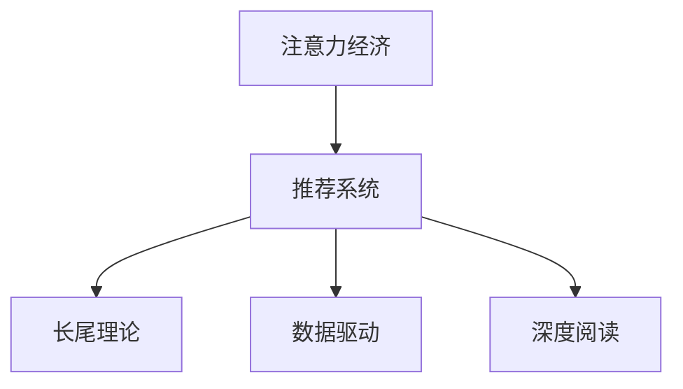

                 

# 注意力经济与个人阅读习惯的转变

> 关键词：注意力经济,个人阅读习惯,阅读推荐系统,长尾理论,数据驱动,深度学习,深度阅读

## 1. 背景介绍

### 1.1 问题由来
在信息爆炸的时代，人类面临的信息过载问题愈发严重。海量信息流充斥着人们的视野，如何从浩如烟海的资料中筛选出真正有用的内容，成为了一个巨大的挑战。在信息消费的过程中，人们逐渐形成了基于注意力经济的模式，即花费时间和金钱来获取并筛选有价值的信息。

### 1.2 问题核心关键点
注意力经济的核心在于对信息资源的有效分配和使用。传统的信息获取方式往往基于线性、单向的信息传递模式，用户难以发现隐含在信息流中的潜在的知识关联。随着大数据和人工智能技术的发展，基于推荐系统的个性化信息服务成为了新的趋势。

推荐系统通过分析用户的历史行为和偏好，自动推荐与其兴趣相关的信息，从而优化用户的阅读时间和精力。但当前的推荐系统主要聚焦于用户的行为模式，而忽视了用户内在的学习动机和深层次阅读需求。因此，如何构建更加智能化、个性化、深入的阅读推荐系统，引导用户进行深层次阅读，成为了目前研究的热点。

### 1.3 问题研究意义
研究注意力经济与个人阅读习惯的转变，对于提升用户的信息获取效率、优化阅读推荐系统、推动知识普及具有重要意义：

1. 提升用户的信息获取效率。个性化阅读推荐可以避免信息过载，节省用户筛选和获取信息的时间。
2. 优化阅读推荐系统。深入分析用户的阅读需求，改进推荐策略，提升系统的精准度和用户满意度。
3. 推动知识普及。通过深度阅读推荐，引导用户阅读高质量的内容，增进其知识储备和认知能力。

## 2. 核心概念与联系

### 2.1 核心概念概述

为更好地理解注意力经济与个人阅读习惯的转变，本节将介绍几个密切相关的核心概念：

- 注意力经济（Attention Economy）：指在信息过载的背景下，用户将有限的注意力资源分配给有价值的信息，以获取最大化的收益。
- 推荐系统（Recommendation System）：通过用户历史行为和兴趣，自动为用户推荐个性化内容。
- 长尾理论（Long Tail Theory）：由克里斯·安德森提出，主张个性化、小众的消费品和服务也能带来显著的市场份额。
- 数据驱动（Data-Driven）：利用大数据和算法分析来指导决策和运营。
- 深度阅读（Deep Reading）：指读者深入理解文本含义，进行思考和内化的阅读方式。

这些核心概念之间的逻辑关系可以通过以下Mermaid流程图来展示：



这个流程图展示了几者的核心关系：

1. 注意力经济驱动用户需求和市场变化。
2. 推荐系统通过数据分析来满足用户需求。
3. 长尾理论指导推荐系统拓展小众市场的可能。
4. 数据驱动利用数据来优化推荐系统。
5. 深度阅读引领用户的内在需求。

这些概念共同构成了现代信息服务的基础，推动着阅读推荐系统的不断优化和发展。

## 3. 核心算法原理 & 具体操作步骤
### 3.1 算法原理概述

个性化阅读推荐系统的核心在于构建用户兴趣模型，并基于此模型进行内容匹配和推荐。其核心算法包括协同过滤、基于内容的推荐、基于矩阵分解的推荐等。

协同过滤（Collaborative Filtering）：基于用户之间的行为相似性，通过相似性度量推导新的推荐。这种方法简单易实现，但用户行为数据的稀疏性和相似性度量的局限性可能导致推荐效果不佳。

基于内容的推荐（Content-Based Recommendation）：通过分析内容特征，预测用户对不同内容的兴趣。这种方法基于静态内容信息，忽视了动态的用户行为。

基于矩阵分解的推荐（Matrix Factorization）：通过用户-物品评分矩阵分解，获得用户兴趣和物品属性特征，以预测用户评分。这种方法需要用户评分数据，且计算复杂度较高。

### 3.2 算法步骤详解

以基于矩阵分解的推荐算法为例，其基本步骤如下：

1. 数据准备：收集用户的历史评分数据和物品的特征数据。
2. 矩阵分解：将用户-物品评分矩阵分解为用户兴趣矩阵和物品属性矩阵。
3. 兴趣预测：通过用户兴趣矩阵和物品属性矩阵，预测用户对物品的评分。
4. 内容推荐：根据预测评分对物品进行排序，推荐评分较高的物品。

### 3.3 算法优缺点

基于矩阵分解的推荐算法具有以下优点：
1. 能够处理大规模稀疏矩阵。
2. 可以自适应用户行为变化，持续更新用户兴趣。
3. 可以通过特征工程提高模型表现。

其缺点包括：
1. 对新物品的预测能力较弱。
2. 计算复杂度高，需要较高计算资源。
3. 用户兴趣表示的稀疏性可能影响推荐效果。

### 3.4 算法应用领域

基于矩阵分解的推荐算法在电商、社交媒体、视频平台等众多领域得到了广泛应用，如亚马逊、Netflix、抖音等。这些平台通过推荐系统优化用户体验，提升用户粘性，增加业务收益。

## 4. 数学模型和公式 & 详细讲解 & 举例说明
### 4.1 数学模型构建

推荐系统可以基于用户-物品评分矩阵 $R$ 进行建模，其中 $R_{ui}$ 表示用户 $u$ 对物品 $i$ 的评分。假设 $R$ 可以被分解为两个低秩矩阵 $U$ 和 $V$ 的乘积，即 $R = UV$。

用户兴趣矩阵 $U$ 的每一行表示一个用户，物品属性矩阵 $V$ 的每一列表示一个物品。矩阵分解的过程即为求得 $U$ 和 $V$ 的过程。假设 $U$ 和 $V$ 的维度为 $n \times k$ 和 $m \times k$，其中 $n$ 表示用户数量，$m$ 表示物品数量。

### 4.2 公式推导过程

基于矩阵分解的推荐算法，可以通过求解 $U$ 和 $V$ 来实现。假设 $R = UV$ 中，$U$ 和 $V$ 的解分别为 $\hat{U}$ 和 $\hat{V}$，则可以通过最小化损失函数求解：

$$
\min_{\hat{U},\hat{V}}\frac{1}{2}\sum_{i=1}^{m}\sum_{j=1}^{n}(R_{ij}-\hat{U}_i\hat{V}_j)^2
$$

其中，$\hat{U}_i$ 表示用户 $i$ 的兴趣向量，$\hat{V}_j$ 表示物品 $j$ 的属性向量。通过求解上述优化问题，可以得到用户和物品的隐式特征表示，从而进行推荐。

### 4.3 案例分析与讲解

以Netflix推荐系统为例，Netflix收集用户对影片的评分数据，通过矩阵分解方法获得用户对影片的隐式兴趣表示。然后，通过物品属性数据（如演员、导演、剧情等），对影片的属性向量 $\hat{V}_j$ 进行编码。最后，利用用户和物品的隐式特征，预测用户对新影片的评分，进行推荐排序。

## 5. 项目实践：代码实例和详细解释说明
### 5.1 开发环境搭建

要进行推荐系统的开发，需要以下开发环境：

1. Python 3.x
2. NumPy 库
3. Pandas 库
4. Scikit-learn 库
5. Scikit-learn 库
6. PyTorch 库（推荐系统中使用较少，用于大规模矩阵分解算法）

以下是安装所需库的命令：

```bash
pip install numpy pandas scikit-learn torch
```

### 5.2 源代码详细实现

我们以电影推荐系统为例，展示推荐系统的代码实现。

```python
import numpy as np
import pandas as pd
from scipy.sparse import csr_matrix
from sklearn.decomposition import TruncatedSVD
from sklearn.metrics import mean_squared_error

# 构建用户-物品评分矩阵
R = np.array([[5, 3, 0, 0],
              [0, 4, 0, 0],
              [0, 0, 5, 3],
              [0, 0, 0, 4]])

# 构建稀疏矩阵
R_sparse = csr_matrix(R)

# 矩阵分解
svd = TruncatedSVD(n_components=2, random_state=42)
U = svd.fit_transform(R_sparse).toarray()
V = svd.components_

# 预测评分
predicted = np.dot(U, V.T)
print(predicted)

# 评估误差
mse = mean_squared_error(R_sparse.toarray(), predicted)
print('Mean Squared Error:', mse)
```

### 5.3 代码解读与分析

**构建评分矩阵**：
- 使用numpy生成一个评分矩阵R，其中数值表示用户对物品的评分。
- 将R转换为稀疏矩阵R_sparse，以减少内存占用。

**矩阵分解**：
- 使用Scikit-learn库中的TruncatedSVD方法进行矩阵分解。
- 指定n_components参数为2，表示希望将用户-物品评分矩阵分解为低秩矩阵U和V。

**预测评分**：
- 通过计算U和V的乘积，得到用户-物品评分矩阵的预测值。

**评估误差**：
- 使用均方误差评估预测值与真实值之间的误差。

## 6. 实际应用场景
### 6.1 电商平台推荐

电商平台的个性化推荐系统可以帮助用户发现感兴趣的商品，提升购物体验。通过分析用户历史行为数据，电商推荐系统可以推荐相似商品、热门商品、限时折扣商品等，从而提升用户的购买意愿和满意度。

### 6.2 社交媒体推荐

社交媒体平台如微信、微博等，通过推荐系统推荐新闻、文章、视频等内容，帮助用户发现感兴趣的内容，提升平台活跃度和用户粘性。推荐系统还可以根据用户的互动行为（如点赞、评论、分享等），动态调整推荐策略，满足不同用户的需求。

### 6.3 视频平台推荐

视频平台如Netflix、YouTube等，通过推荐系统为用户推荐影视作品、综艺节目等，提升用户体验和留存率。视频推荐系统还可以根据用户的观看历史、评分数据等，动态推荐相关内容，形成内容生态。

### 6.4 未来应用展望

未来，随着深度学习和大数据技术的进一步发展，推荐系统将能够更加智能地识别用户的深度需求，提供更加个性化的内容推荐。通过引入更多用户行为数据，结合用户兴趣和上下文信息，推荐系统可以更好地引导用户进行深度阅读，提升用户的信息获取效率和认知水平。

## 7. 工具和资源推荐
### 7.1 学习资源推荐

要深入学习推荐系统的原理和实践，可以关注以下几个学习资源：

1. Coursera上的Recommender Systems 2018课程：由斯坦福大学教授讲授，系统讲解了推荐系统的理论基础和算法实现。
2. 《推荐系统实践》（第2版）：该书由田祥旭等编写，全面介绍了推荐系统的设计和实现。
3. KDD 2019 推荐系统论文集：收录了推荐系统领域的最新研究成果和应用案例。
4. 知乎、Stack Overflow等平台的相关讨论和代码示例。
5. 机器之心等技术博客和社区，了解最新的推荐系统应用和优化技术。

### 7.2 开发工具推荐

推荐系统的开发涉及大量的数据处理和算法优化，以下是几个常用的开发工具：

1. Python：推荐系统常用编程语言，简单易用，生态丰富。
2. Pandas：用于数据处理和分析，支持大规模稀疏矩阵操作。
3. Scikit-learn：提供了多种推荐算法，包括协同过滤、矩阵分解等。
4. PyTorch：用于深度学习模型的实现和优化，支持大规模矩阵分解算法。
5. Jupyter Notebook：常用的交互式编程环境，便于开发和调试。

### 7.3 相关论文推荐

以下是几篇推荐系统领域的经典论文，建议阅读：

1. Top-N Recommendation with Missing Values: A Simultaneous Matrix Factorization Approach （SIGIR 2011）
2. Neural Collaborative Filtering （RecSys 2017）
3. Factorization Machines with Side Information （KDD 2012）
4. The Cross-Network PageRank: A Multi-Relational PageRank Algorithm （KDD 2012）
5. A New Matrix Factorization Technique with Built-in Side Information （KDD 2014）

## 8. 总结：未来发展趋势与挑战
### 8.1 总结

本文对基于矩阵分解的推荐系统进行了全面系统的介绍。首先阐述了推荐系统的核心原理和应用场景，明确了其优化用户信息获取效率、推动知识普及的重要意义。其次，从原理到实践，详细讲解了推荐系统的数学模型和代码实现，给出了推荐系统开发的全流程。最后，本文还广泛探讨了推荐系统在电商、社交、视频等众多领域的应用前景，展示了推荐系统技术的广泛应用价值。

通过本文的系统梳理，可以看到，基于矩阵分解的推荐系统已经广泛应用于多个领域，极大地提升了信息服务的个性化水平和用户满意度。未来，伴随深度学习和大数据技术的持续演进，推荐系统还将迎来更加智能化、个性化的发展趋势，为信息服务的智能化转型提供强大技术支持。

### 8.2 未来发展趋势

展望未来，推荐系统的发展趋势可能包括以下几个方面：

1. 深度学习与推荐系统的融合：引入深度学习模型进行用户兴趣预测，提升推荐系统的效果。
2. 多模态数据的融合：结合文本、图像、音频等多模态数据，提供更加全面、丰富的内容推荐。
3. 实时化推荐：结合实时数据分析，进行动态内容推荐，提升用户体验。
4. 隐私保护：在推荐过程中保护用户隐私，增强用户信任和满意度。
5. 推荐系统的可解释性：通过模型解释技术，增强用户对推荐结果的理解和信任。

### 8.3 面临的挑战

尽管推荐系统已经取得了瞩目成就，但在迈向更加智能化、普适化应用的过程中，仍面临着诸多挑战：

1. 数据隐私与安全：推荐系统需要大量用户数据，如何保护用户隐私和数据安全是一大难题。
2. 冷启动问题：新用户或新物品的推荐效果往往较差，需要进行更加复杂的特征工程。
3. 计算资源消耗：推荐系统需要处理大规模数据，计算资源消耗大。
4. 推荐多样性：如何避免过度同质化推荐，保持推荐内容的多样性，仍需更多探索。
5. 用户行为分析：用户行为数据往往难以获取，如何通过稀疏数据进行精准预测，需要进一步研究。

### 8.4 研究展望

未来的研究需要重点关注以下几个方面：

1. 深度学习模型的引入：通过深度学习模型，提升推荐系统的性能和智能化水平。
2. 多模态数据的整合：将多模态数据与推荐系统结合，提供更加全面的信息服务。
3. 实时推荐系统的构建：实现动态推荐，提升用户体验。
4. 推荐系统的可解释性：增强推荐系统的可解释性，提升用户信任和满意度。
5. 隐私保护技术的研究：提升推荐系统的隐私保护能力，保障用户数据安全。

总之，未来的推荐系统将在个性化、多样化、智能化等方面进行不断优化和创新，为信息服务的智能化转型提供强大技术支持。

## 9. 附录：常见问题与解答

**Q1：推荐系统为什么能够提高用户满意度？**

A: 推荐系统能够提高用户满意度，主要基于以下几个原因：
1. 个性化推荐：根据用户的历史行为和偏好，推荐其感兴趣的内容，避免信息过载，节省用户筛选信息的时间。
2. 高质量内容：推荐系统能够发现高质量的内容，提升用户的认知水平和知识储备。
3. 动态优化：推荐系统可以动态调整推荐策略，不断优化推荐效果。

**Q2：推荐系统有哪些主要算法？**

A: 推荐系统的主要算法包括以下几种：
1. 协同过滤算法：基于用户之间的行为相似性，进行推荐。
2. 基于内容的推荐算法：通过分析内容特征，预测用户对不同内容的兴趣。
3. 矩阵分解算法：将用户-物品评分矩阵分解，预测用户对物品的评分，进行推荐。
4. 深度学习算法：通过深度神经网络模型，预测用户对物品的兴趣。

**Q3：推荐系统如何处理冷启动问题？**

A: 冷启动问题指的是新用户或新物品的推荐效果较差。处理冷启动问题的方法包括：
1. 基于标签的推荐：通过物品标签和用户兴趣标签进行推荐。
2. 基于内容的推荐：利用物品属性信息，预测用户对物品的兴趣。
3. 引入知识图谱：通过知识图谱整合多源数据，提升推荐效果。

**Q4：推荐系统如何保护用户隐私？**

A: 推荐系统在保护用户隐私方面可以采取以下措施：
1. 数据匿名化：对用户数据进行匿名处理，防止个人信息泄露。
2. 差分隐私：在推荐过程中加入噪声，保护用户隐私。
3. 用户控制：用户可以控制是否参与推荐系统，增强用户信任。

**Q5：推荐系统的推荐效果如何评估？**

A: 推荐系统的推荐效果通常通过以下指标进行评估：
1. 准确率（Accuracy）：推荐结果与实际结果匹配的比例。
2. 召回率（Recall）：实际结果被推荐出来的比例。
3. F1 Score：综合考虑准确率和召回率的综合指标。
4. 用户满意度（User Satisfaction）：通过用户调查等方式评估推荐效果。

通过这些指标的评估，可以不断优化推荐系统，提升推荐效果。

---

作者：禅与计算机程序设计艺术 / Zen and the Art of Computer Programming

