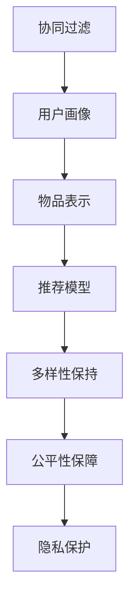

                 

## 1. 背景介绍

随着互联网的快速发展和智能设备的普及，用户生成内容（UGC）和在线互动行为的规模急剧增长，使得“注意力经济”逐渐成为互联网时代的重要概念。注意力，即用户对信息或产品的关注度，已经成为网络商业价值的核心。如何在纷繁复杂的信息流中，捕获并转化用户的注意力，是各类数字产品和服务的核心命题。个性化推荐系统作为一种高效的注意力获取手段，正在深刻改变着用户的内容消费方式，逐渐成为互联网和智能设备的标配功能。

### 1.1 问题由来

个性化推荐系统的发展历程，最早可以追溯到20世纪60年代基于协同过滤的推荐算法。随着移动互联网和大数据技术的飞速发展，推荐系统的算力和数据规模不断提升，推荐策略也从单一的用户兴趣匹配，扩展到多维度的用户画像分析、上下文感知、时间序列预测等。然而，随着推荐系统应用的不断深入，其存在的短板也逐渐显现：

1. **冷启动问题**：新用户或物品的兴趣行为数据稀疏，难以进行有效的推荐。
2. **多样性缺失**：个性化推荐容易陷入“信息茧房”，缺乏多样性。
3. **公平性不足**：由于数据偏差，可能导致对某些群体的推荐不公平。
4. **隐私保护**：用户行为数据的采集和使用，引发了隐私保护的关注。

为了解决这些问题，基于深度学习技术的推荐算法逐渐兴起。通过大量用户行为数据的预训练，深度学习模型能够从数据中学习到更加复杂和精细化的用户和物品表示，实现更精准和多样化的推荐。而通过不断优化模型结构和训练算法，这些推荐系统不仅能够解决冷启动问题，还能提升推荐结果的多样性和公平性，同时保障用户的隐私权。

### 1.2 问题核心关键点

个性化推荐系统的主要任务是，在用户生成的海量行为数据中挖掘出其潜在的兴趣偏好，并根据这些兴趣偏好为用户推荐合适的物品。核心技术点包括：

1. **用户画像构建**：通过数据分析和学习算法，刻画用户的多维度兴趣特征，如兴趣标签、行为习惯等。
2. **物品表示学习**：通过预训练和微调技术，学习物品的语义表示，使其能够更好地与用户兴趣进行匹配。
3. **推荐模型训练**：设计并优化推荐模型，根据用户画像和物品表示，预测用户对物品的评分或点击概率。
4. **排序与展示**：将推荐结果进行排序，并展示给用户。

## 2. 核心概念与联系

### 2.1 核心概念概述

为更好地理解个性化推荐系统的原理和技术框架，本节将介绍几个密切相关的核心概念：

- **协同过滤**：利用用户间的相似性，为未曾交互过的物品进行推荐。早期推荐系统常用方法，但由于其冷启动问题明显，逐渐被深度学习推荐系统取代。
- **用户画像**：通过用户行为数据和社交数据，构建用户的多维度兴趣特征。用户画像的准确性直接决定了推荐效果。
- **物品表示**：学习物品的语义表示，使其能够与用户兴趣进行有效匹配。早期基于隐式特征的方法，如向量空间模型等，已经被深度学习表示方法所取代。
- **推荐模型**：基于用户画像和物品表示，训练预测用户评分或点击概率的模型。常见的推荐模型包括基于深度神经网络、图神经网络等。
- **多样性保持**：为避免“信息茧房”，在推荐算法中融入多样性保持机制，确保推荐结果的多样性。
- **公平性保障**：在推荐算法中考虑性别、年龄、地区等敏感属性，避免偏见和歧视。
- **隐私保护**：采取匿名化、差分隐私等技术手段，保障用户数据的安全和隐私。

这些核心概念之间的逻辑关系可以通过以下Mermaid流程图来展示：



这个流程图展示了个性化推荐系统的工作流程：

1. 协同过滤为推荐系统提供基础用户和物品关联数据。
2. 用户画像通过数据分析和学习算法，对用户兴趣进行详细刻画。
3. 物品表示利用深度学习模型，学习物品的语义表示。
4. 推荐模型基于用户画像和物品表示，预测用户评分或点击概率。
5. 多样性保持和公平性保障对推荐结果进行调整，确保推荐结果的多样性和公平性。
6. 隐私保护对用户行为数据进行处理，保障用户隐私。

## 3. 核心算法原理 & 具体操作步骤
### 3.1 算法原理概述

个性化推荐系统本质上是一个多任务学习过程，其核心思想是：通过用户行为数据，学习用户和物品的表示，构建用户画像和物品表示，利用这些表示进行评分预测或点击概率预测，并结合多样性保持和公平性保障等约束条件，最终输出推荐结果。

形式化地，假设用户画像为 $U = (u_1, u_2, ..., u_N)$，物品表示为 $I = (i_1, i_2, ..., i_M)$，推荐模型为 $M$。给定用户 $u_n$ 和物品 $i_m$，推荐模型输出用户对物品的评分 $y_{n,m}$。则在训练集 $D=\{(x_i, y_i)\}_{i=1}^N$ 上的训练目标为：

$$
\mathcal{L}(M) = \frac{1}{N}\sum_{i=1}^N \sum_{m=1}^M \ell(y_i, M(x_i, i_m))
$$

其中 $\ell$ 为评分预测的损失函数，如均方误差、交叉熵等。目标是最小化经验风险，即找到最优模型参数 $\theta$：

$$
\theta^* = \mathop{\arg\min}_{\theta} \mathcal{L}(M_{\theta})
$$

通过梯度下降等优化算法，推荐模型不断更新参数 $\theta$，最小化损失函数 $\mathcal{L}$，使得模型输出逼近真实评分 $y$。由于用户画像和物品表示已经通过预训练获得了较好的初始化，因此即便在小型数据集上也能较快收敛到理想的模型参数 $\theta^*$。

### 3.2 算法步骤详解

个性化推荐系统的核心步骤主要包括：

**Step 1: 用户画像构建**
- 收集用户的行为数据、社交数据、背景信息等，进行预处理和特征工程，构建用户画像。
- 利用协同过滤、内容推荐等基础算法，计算用户对物品的评分或评分预测。

**Step 2: 物品表示学习**
- 收集物品的文本描述、标签、用户评分等数据，进行预处理和特征工程，构建物品表示。
- 利用预训练语言模型或视觉模型，学习物品的语义表示或视觉特征表示。

**Step 3: 推荐模型训练**
- 设计推荐模型结构，如基于深度神经网络、图神经网络等。
- 利用用户画像和物品表示，训练推荐模型，最小化评分预测的损失函数。

**Step 4: 推荐排序与展示**
- 根据推荐模型的预测结果，对物品进行排序。
- 根据排序结果，生成推荐列表，展示给用户。

**Step 5: 效果评估与反馈**
- 在测试集上评估推荐系统的准确率、多样性、公平性等指标。
- 根据用户反馈，不断优化推荐模型和参数，提高推荐效果。

以上是个性化推荐系统的一般流程。在实际应用中，还需要针对具体任务的特点，对各步骤进行优化设计，如改进特征工程方法、设计更复杂的推荐模型、引入上下文感知技术等。

### 3.3 算法优缺点

个性化推荐系统的优点主要包括：
1. 高效获取用户注意力。通过精准的用户画像和物品表示，推荐系统能够快速捕获用户注意力，提升用户粘性。
2. 推荐效果显著。深度学习推荐算法在多种推荐任务上均取得了SOTA，能够显著提升推荐精度和多样性。
3. 自适应能力强。推荐系统能够根据用户行为和兴趣的变化，动态调整推荐策略，保持系统活力。
4. 可扩展性好。推荐系统能够处理海量数据，通过增加数据和计算资源，提升推荐精度和覆盖范围。

然而，个性化推荐系统也存在一些局限性：
1. 数据依赖性高。推荐系统的效果很大程度上依赖于用户行为数据的质量和数量，数据偏差可能导致推荐结果不公平。
2. 冷启动问题。新用户或新物品的数据稀疏，难以进行有效的推荐。
3. 隐私问题。用户行为数据的采集和使用，可能引发隐私保护和数据安全的关注。
4. 多样性不足。推荐系统可能陷入“信息茧房”，缺乏多样性。
5. 过拟合风险。大规模深度学习模型容易出现过拟合现象，降低推荐系统的泛化能力。

尽管存在这些局限性，但就目前而言，个性化推荐系统仍然是获取用户注意力和提升用户满意度的重要手段。未来相关研究的重点在于如何进一步降低推荐系统的数据依赖，提升模型的泛化能力和公平性，同时兼顾用户隐私和多样性，实现更高效、更公平的推荐服务。

### 3.4 算法应用领域

个性化推荐系统已经在多个领域得到了广泛的应用，例如：

- 电商平台：为每个用户推荐个性化的商品，提升用户购买转化率。
- 视频平台：为用户推荐个性化的视频内容，提升用户体验。
- 新闻平台：为用户推荐个性化的新闻文章，提升内容阅读量。
- 社交平台：为每个用户推荐个性化的动态，增强用户粘性。
- 音乐平台：为用户推荐个性化的音乐曲目，提升用户满意度。

除了上述这些经典应用外，个性化推荐系统还被创新性地应用到更多场景中，如智能家居、智慧旅游、智能医疗等，为各行业数字化转型提供了新动力。

## 4. 数学模型和公式 & 详细讲解
### 4.1 数学模型构建

为更好地理解个性化推荐系统的数学模型，本节将使用数学语言对推荐系统的训练过程进行严格的刻画。

记用户画像为 $U = (u_1, u_2, ..., u_N)$，物品表示为 $I = (i_1, i_2, ..., i_M)$，推荐模型为 $M$。给定用户 $u_n$ 和物品 $i_m$，推荐模型输出用户对物品的评分 $y_{n,m}$。

假设 $U$ 和 $I$ 的特征表示分别为 $X_U \in \mathbb{R}^{N \times D_U}$ 和 $X_I \in \mathbb{R}^{M \times D_I}$，$M$ 的模型参数为 $\theta$。则评分预测的目标函数为：

$$
\mathcal{L}(M) = \frac{1}{N}\sum_{i=1}^N \sum_{m=1}^M \ell(y_{n,m}, M(X_U, X_I))
$$

其中 $M(X_U, X_I)$ 表示推荐模型对用户和物品的联合表示进行评分预测。通常情况下，使用深度神经网络作为推荐模型，其结构如图 1 所示：

```
             X_I
             /  \
            /    \
           /      \
          /        \
         /          \
        /            \
       /              \
      /                \
     /                  \
    /                   \
   /                     \
  /                       \
 /                         \
/                          \
/                           \
/                            \
/                             \
/                              \
/                               \
/                                \
/                                 \
+----------------------------------+
            X_U
             \
              \          / 
               \        /
                \      /
                 \    /
                  \  /
                   \/
                    /
                     \
                      \
                      \ 
                       /
                      /
                     /
                    /
                   /
                  /
                 / 
                /
               /
              /
             /
            /
           /
          /
         /
        /
       /
      /
     /
    /
   /
  /
 /
/
/
/
/
/
/
```


推荐模型的训练目标是：

$$
\theta^* = \mathop{\arg\min}_{\theta} \mathcal{L}(M_{\theta})
$$

在实际推荐系统中，通常使用反向传播算法进行参数更新，通过梯度下降等优化算法，最小化损失函数 $\mathcal{L}$，使得模型输出逼近真实评分 $y$。

### 4.2 公式推导过程

以下我们以二分类任务为例，推导交叉熵损失函数及其梯度的计算公式。

假设推荐模型 $M_{\theta}$ 在用户画像 $X_U$ 和物品表示 $X_I$ 的联合表示下，输出物品 $i_m$ 的评分概率 $y_{n,m}=M_{\theta}(X_U, X_I)$，其中 $y_{n,m} \in [0,1]$，表示物品 $i_m$ 被用户 $u_n$ 评分的概率。真实评分 $y_{n,m}$ 为二分类标签，即 $y_{n,m} \in \{0,1\}$。则二分类交叉熵损失函数定义为：

$$
\ell(M_{\theta}(X_U, X_I), y_{n,m}) = -[y_{n,m}\log y_{n,m} + (1-y_{n,m})\log(1-y_{n,m})]
$$

将其代入评分预测的损失函数，得：

$$
\mathcal{L}(M) = -\frac{1}{N}\sum_{i=1}^N \sum_{m=1}^M [y_{n,m}\log M_{\theta}(X_U, X_I)+(1-y_{n,m})\log(1-M_{\theta}(X_U, X_I))]
$$

根据链式法则，损失函数对模型参数 $\theta$ 的梯度为：

$$
\frac{\partial \mathcal{L}(M)}{\partial \theta} = -\frac{1}{N}\sum_{i=1}^N \sum_{m=1}^M (\frac{y_{n,m}}{M_{\theta}(X_U, X_I)}-\frac{1-y_{n,m}}{1-M_{\theta}(X_U, X_I)}) \frac{\partial M_{\theta}(X_U, X_I)}{\partial \theta}
$$

其中 $\frac{\partial M_{\theta}(X_U, X_I)}{\partial \theta}$ 可进一步递归展开，利用自动微分技术完成计算。

### 4.3 案例分析与讲解

在推荐系统实践中，交叉熵损失函数和梯度计算公式是常用的目标函数和优化目标。以下以电商推荐为例，展示如何使用这些公式进行评分预测和模型训练。

假设电商推荐系统接收用户的浏览记录和物品评分，构建用户画像 $X_U$ 和物品表示 $X_I$。用户浏览记录和物品评分数据作为监督信号，训练推荐模型 $M_{\theta}$。推荐模型的结构如图 1 所示，其中 $X_U$ 为用户的兴趣特征，$X_I$ 为物品的语义特征，$M_{\theta}$ 为推荐模型。

在模型训练过程中，使用交叉熵损失函数进行评分预测，目标是最小化评分预测的损失。具体步骤如下：

1. 收集用户浏览记录和物品评分数据，构建用户画像 $X_U$ 和物品表示 $X_I$。
2. 定义推荐模型 $M_{\theta}$ 的结构，如图 1 所示。
3. 使用用户画像 $X_U$ 和物品表示 $X_I$ 进行前向传播，计算推荐模型 $M_{\theta}$ 的输出评分 $y_{n,m}$。
4. 计算评分预测的交叉熵损失 $\ell(y_{n,m}, M_{\theta}(X_U, X_I))$。
5. 反向传播计算参数梯度 $\frac{\partial \mathcal{L}(M)}{\partial \theta}$。
6. 使用梯度下降等优化算法，更新推荐模型 $M_{\theta}$ 的参数。
7. 重复上述步骤，直至模型收敛或达到预设的迭代次数。

通过上述过程，电商推荐系统能够在给定用户和物品的情况下，输出物品被用户评分的概率，从而进行个性化推荐。

## 5. 项目实践：代码实例和详细解释说明
### 5.1 开发环境搭建

在进行推荐系统开发前，我们需要准备好开发环境。以下是使用Python进行TensorFlow开发的环境配置流程：

1. 安装Anaconda：从官网下载并安装Anaconda，用于创建独立的Python环境。

2. 创建并激活虚拟环境：
```bash
conda create -n tf-env python=3.8 
conda activate tf-env
```

3. 安装TensorFlow：根据CUDA版本，从官网获取对应的安装命令。例如：
```bash
conda install tensorflow=2.8-cp38-cp38-cudatoolkit=11.1
```

4. 安装各类工具包：
```bash
pip install numpy pandas scikit-learn matplotlib tqdm jupyter notebook ipython
```

完成上述步骤后，即可在`tf-env`环境中开始推荐系统开发。

### 5.2 源代码详细实现

下面我们以电商推荐为例，给出使用TensorFlow对推荐模型进行训练的PyTorch代码实现。

首先，定义用户画像和物品表示的数据处理函数：

```python
import tensorflow as tf
from tensorflow.keras.layers import Input, Embedding, Dense, Flatten, Concatenate

# 定义用户画像输入层
user_input = Input(shape=(max_user_features,), dtype='int32', name='user_input')

# 定义物品表示输入层
item_input = Input(shape=(max_item_features,), dtype='int32', name='item_input')

# 定义用户画像嵌入层
user_embedding = Embedding(input_dim=/user_features_size/, output_dim=/user_embedding_size/)(user_input)

# 定义物品表示嵌入层
item_embedding = Embedding(input_dim=/item_features_size/, output_dim=/item_embedding_size/)(item_input)

# 定义用户画像和物品表示的拼接层
concat = Concatenate(axis=-1)([user_embedding, item_embedding])

# 定义推荐模型层
model = Dense(units=128, activation='relu')(concat)

# 定义评分预测层
score = Dense(units=1, activation='sigmoid')(model)

# 定义评分预测损失函数
loss = tf.keras.losses.BinaryCrossentropy(from_logits=True)(score, y_true)
```

然后，定义训练和评估函数：

```python
from tensorflow.keras import Model, compile, train

# 定义推荐模型
model = Model(inputs=[user_input, item_input], outputs=score)

# 定义优化器
optimizer = tf.keras.optimizers.Adam()

# 编译模型
model.compile(optimizer=optimizer, loss=loss)

# 定义训练集和验证集
train_dataset = ...
valid_dataset = ...

# 定义训练函数
def train_model(model, train_dataset, valid_dataset, epochs):
    model.fit(train_dataset, epochs=epochs, validation_data=valid_dataset)

# 调用训练函数
train_model(model, train_dataset, valid_dataset, epochs=10)
```

最后，启动训练流程并在测试集上评估：

```python
# 定义测试集
test_dataset = ...

# 调用训练函数
train_model(model, train_dataset, valid_dataset, epochs=10)

# 在测试集上评估推荐模型
test_loss, test_score = model.evaluate(test_dataset)

print('测试集评分预测误差:', test_loss)
print('测试集评分预测准确率:', test_score)
```

以上就是使用TensorFlow对推荐模型进行电商推荐开发的完整代码实现。可以看到，得益于TensorFlow的强大封装，我们可以用相对简洁的代码完成推荐模型的构建和训练。

### 5.3 代码解读与分析

让我们再详细解读一下关键代码的实现细节：

**定义用户画像和物品表示**：
- 使用`Input`层定义用户画像和物品表示的输入层。
- 使用`Embedding`层对用户画像和物品表示进行嵌入，将其转化为高维向量表示。
- 使用`Concatenate`层将用户画像和物品表示进行拼接。

**定义推荐模型**：
- 使用`Dense`层对拼接后的向量进行全连接，引入非线性激活函数。
- 使用`Dense`层对推荐模型输出进行评分预测，使用`sigmoid`函数将输出转换为0-1之间的概率。

**定义评分预测损失函数**：
- 使用`BinaryCrossentropy`损失函数计算评分预测的交叉熵损失，将输出标签与预测标签进行对比。

**训练函数**：
- 使用`compile`方法编译模型，设置优化器和损失函数。
- 使用`fit`方法进行模型训练，设置训练集和验证集，迭代轮数等参数。
- 在测试集上调用`evaluate`方法进行评估，输出评分预测误差和准确率。

可以看到，TensorFlow提供了高效的深度学习模型构建和训练工具，开发者可以专注于算法设计和模型优化，而不必过多关注底层实现细节。

当然，工业级的系统实现还需考虑更多因素，如模型的保存和部署、超参数的自动搜索、更灵活的特征工程等。但核心的推荐算法基本与此类似。

## 6. 实际应用场景
### 6.1 智能客服系统

基于深度学习技术的推荐系统，可以广泛应用于智能客服系统的构建。传统客服往往需要配备大量人力，高峰期响应缓慢，且一致性和专业性难以保证。而使用推荐系统，可以根据用户的历史行为和需求，推荐合适的解答模板和回答策略，提升客服系统的智能化水平，提高用户满意度。

在技术实现上，可以收集用户的历史咨询记录，构建用户画像和物品表示，进行评分预测和推荐。推荐系统能够自动理解用户意图，匹配最合适的回答策略，动态生成回答内容。对于新问题，还可以通过检索系统实时搜索相关内容，动态组织生成回答。如此构建的智能客服系统，能大幅提升客服响应速度和准确率，减轻客服人员的工作负担。

### 6.2 金融理财系统

金融理财系统需要实时为用户推荐个性化的理财产品，帮助用户制定合理的投资策略。基于推荐系统的金融理财系统，可以分析用户的财务数据、风险偏好、历史投资记录等，构建用户画像和物品表示，进行评分预测和推荐。推荐系统能够根据用户的投资需求和风险偏好，推荐合适的理财产品，提升用户理财效果。同时，系统还能够根据市场变化和用户反馈，动态调整推荐策略，保障用户投资安全。

在技术实现上，可以收集用户的财务数据和历史投资记录，构建用户画像和物品表示，进行评分预测和推荐。推荐系统能够自动分析用户的财务数据和投资偏好，匹配最合适的理财产品，动态生成推荐结果。同时，系统还能够根据市场变化和用户反馈，动态调整推荐策略，保障用户投资安全。

### 6.3 智慧教育系统

智慧教育系统需要为每个学生推荐个性化的学习内容，提升学习效果。基于推荐系统的智慧教育系统，可以分析学生的学习行为数据、成绩数据、兴趣爱好等，构建学生画像和物品表示，进行评分预测和推荐。推荐系统能够根据学生的学习需求和兴趣爱好，推荐合适的学习内容，提升学习效果。同时，系统还能够根据学生的学习效果和反馈，动态调整推荐策略，个性化定制学习方案。

在技术实现上，可以收集学生的学习行为数据、成绩数据、兴趣爱好等，构建学生画像和物品表示，进行评分预测和推荐。推荐系统能够自动分析学生的学习行为和兴趣爱好，匹配最合适的学习内容，动态生成推荐结果。同时，系统还能够根据学生的学习效果和反馈，动态调整推荐策略，个性化定制学习方案。

### 6.4 未来应用展望

随着推荐系统应用的不断深入，其在各领域的应用前景更加广阔。以下是几个未来可能的应用方向：

- **医疗健康**：基于推荐系统的医疗健康系统，可以分析用户的健康数据、病史、生活方式等，推荐合适的健康建议和医疗服务，提升用户健康水平。
- **智能家居**：基于推荐系统的智能家居系统，可以分析用户的居住习惯、设备使用数据等，推荐合适的智能家居方案，提升用户生活体验。
- **智慧旅游**：基于推荐系统的智慧旅游系统，可以分析用户的旅游偏好、历史行程等，推荐合适的旅游路线和景点，提升用户旅游体验。
- **个性化广告**：基于推荐系统的个性化广告系统，可以分析用户的兴趣偏好、行为数据等，推荐合适的广告内容，提升广告投放效果。
- **智能交通**：基于推荐系统的智能交通系统，可以分析用户的出行数据、交通模式等，推荐合适的出行方案，提升出行效率。

## 7. 工具和资源推荐
### 7.1 学习资源推荐

为帮助开发者系统掌握推荐系统的理论基础和实践技巧，这里推荐一些优质的学习资源：

1. 《Recommender Systems: An Introduction to Factorization Machines》书籍：系统介绍了推荐系统的基础知识、算法设计及实现方法。
2. 《Deep Learning for Recommendation Engines》课程：由Coursera提供，介绍了深度学习在推荐系统中的应用，涵盖了多种推荐算法和模型。
3. KDD 2020 Best Paper Award论文：介绍了推荐系统的最新研究成果，包括Adversarial Collaborative Filtering等前沿技术。
4. PyTorch官方文档：提供了多种推荐模型的实现代码和教程，是上手实践的必备资料。
5. TensorFlow官方文档：提供了多种推荐模型的实现代码和教程，是上手实践的必备资料。

通过对这些资源的学习实践，相信你一定能够快速掌握推荐系统的精髓，并用于解决实际的推荐问题。
###  7.2 开发工具推荐

高效的开发离不开优秀的工具支持。以下是几款用于推荐系统开发的常用工具：

1. PyTorch：基于Python的开源深度学习框架，灵活动态的计算图，适合快速迭代研究。大部分推荐模型都有PyTorch版本的实现。
2. TensorFlow：由Google主导开发的开源深度学习框架，生产部署方便，适合大规模工程应用。同样有丰富的推荐模型资源。
3. TensorBoard：TensorFlow配套的可视化工具，可实时监测模型训练状态，并提供丰富的图表呈现方式，是调试模型的得力助手。
4.Weights & Biases：模型训练的实验跟踪工具，可以记录和可视化模型训练过程中的各项指标，方便对比和调优。
5. Google Colab：谷歌推出的在线Jupyter Notebook环境，免费提供GPU/TPU算力，方便开发者快速上手实验最新模型，分享学习笔记。

合理利用这些工具，可以显著提升推荐系统的开发效率，加快创新迭代的步伐。

### 7.3 相关论文推荐

推荐系统的研究源于学界的持续研究。以下是几篇奠基性的相关论文，推荐阅读：

1. A New Recommender System Model for e-Commerce: Ensemble Framework for Weighted Matrix Factorization（eRNN）：提出了一种基于加权矩阵分解的推荐系统模型，具有较高的精度和鲁棒性。
2. Adversarial Collaborative Filtering：提出了一种基于对抗学习的推荐系统模型，能够缓解数据偏差，提升推荐精度。
3. Feature Metasynthesis for Recommender Systems：提出了一种基于元学习的推荐系统模型，能够在不同数据集上取得良好的泛化性能。
4. Learning Deep Architectures for Recommendation with Multi-Task Learning：提出了一种基于多任务学习的推荐系统模型，能够在不同用户和物品间共享知识，提升推荐效果。
5. AutoRec：提出了一种基于自编码的推荐系统模型，能够在少样本情况下取得较好的推荐效果。

这些论文代表了个推荐系统的发展脉络。通过学习这些前沿成果，可以帮助研究者把握学科前进方向，激发更多的创新灵感。

## 8. 总结：未来发展趋势与挑战
### 8.1 总结

本文对个性化推荐系统的原理和技术框架进行了全面系统的介绍。首先阐述了推荐系统的研究背景和意义，明确了推荐系统在获取用户注意力、提升用户满意度方面的核心价值。其次，从原理到实践，详细讲解了推荐系统的数学模型和关键步骤，给出了推荐系统开发的完整代码实例。同时，本文还广泛探讨了推荐系统在智能客服、金融理财、智慧教育等多个领域的应用前景，展示了推荐系统巨大的应用潜力。此外，本文精选了推荐系统的各类学习资源，力求为读者提供全方位的技术指引。

通过本文的系统梳理，可以看到，个性化推荐系统正在成为互联网时代的重要技术手段，极大地提升了用户满意度和业务价值。未来，伴随深度学习技术的发展，推荐系统的精度和泛化能力将进一步提升，有望在更多领域带来变革性影响。

### 8.2 未来发展趋势

展望未来，个性化推荐系统将呈现以下几个发展趋势：

1. **模型规模持续增大**：随着算力成本的下降和数据规模的扩张，推荐系统的模型参数量还将持续增长。超大规模推荐模型蕴含的丰富知识，有望支撑更加复杂多变的推荐任务。
2. **多模态推荐崛起**：推荐系统不仅仅聚焦于文本信息，还将融合视觉、音频等多模态信息，实现更加全面、精准的推荐。
3. **实时推荐成为常态**：推荐系统将更加注重实时性，能够根据用户实时行为和市场变化，动态调整推荐策略。
4. **个性化推荐向智能化转变**：推荐系统将能够更加智能化地理解用户需求，实现个性化的内容推荐和智能化的决策支持。
5. **推荐系统走向开放**：推荐系统将更加注重用户隐私和公平性，开放推荐算法和数据接口，促进用户参与和反馈。
6. **推荐系统走向普适化**：推荐系统将更加注重跨领域、跨行业的应用，实现更广泛的社会价值和经济效益。

以上趋势凸显了个性化推荐系统的广阔前景。这些方向的探索发展，必将进一步提升推荐系统的性能和应用范围，为构建智能社会提供新动力。

### 8.3 面临的挑战

尽管个性化推荐系统已经取得了瞩目成就，但在迈向更加智能化、普适化应用的过程中，它仍面临着诸多挑战：

1. **数据隐私保护**：推荐系统依赖大量用户行为数据，如何在保护用户隐私的同时，充分利用这些数据，是推荐系统面临的重要问题。
2. **冷启动问题**：新用户或新物品的数据稀疏，难以进行有效的推荐，推荐系统需要更好地处理冷启动问题。
3. **多样性保持**：推荐系统可能陷入“信息茧房”，缺乏多样性，推荐系统需要更好地保持推荐结果的多样性。
4. **公平性保障**：推荐系统可能由于数据偏差，对某些群体的推荐不公平，推荐系统需要更好地保障推荐结果的公平性。
5. **泛化能力不足**：大规模推荐模型容易出现过拟合现象，降低推荐系统的泛化能力，推荐系统需要更好地提升泛化能力。

尽管存在这些挑战，但就目前而言，个性化推荐系统仍然是获取用户注意力和提升用户满意度的重要手段。未来相关研究的重点在于如何进一步降低推荐系统的数据依赖，提升模型的泛化能力和公平性，同时兼顾用户隐私和多样性，实现更高效、更公平的推荐服务。

### 8.4 研究展望

面对个性化推荐系统所面临的种种挑战，未来的研究需要在以下几个方面寻求新的突破：

1. **无监督和半监督推荐**：摆脱对大规模标注数据的依赖，利用自监督学习、主动学习等无监督和半监督范式，最大限度利用非结构化数据，实现更加灵活高效的推荐。
2. **参数高效和计算高效的推荐**：开发更加参数高效的推荐方法，在固定大部分预训练参数的情况下，只更新极少量的任务相关参数。同时优化推荐模型的计算图，减少前向传播和反向传播的资源消耗，实现更加轻量级、实时性的部署。
3. **因果和对比学习**：引入因果推断和对比学习思想，增强推荐模型建立稳定因果关系的能力，学习更加普适、鲁棒的语言表征，从而提升模型泛化性和抗干扰能力。
4. **多模态推荐**：将符号化的先验知识，如知识图谱、逻辑规则等，与神经网络模型进行巧妙融合，引导推荐过程学习更准确、合理的推荐策略。同时加强不同模态数据的整合，实现视觉、语音等多模态信息与文本信息的协同建模。
5. **隐私保护和伦理约束**：在模型训练目标中引入伦理导向的评估指标，过滤和惩罚有偏见、有害的输出倾向。同时加强人工干预和审核，建立推荐模型的监管机制，确保输出符合人类价值观和伦理道德。

这些研究方向的探索，必将引领个性化推荐系统迈向更高的台阶，为构建智能社会提供新动力。面向未来，个性化推荐系统还需要与其他人工智能技术进行更深入的融合，如知识表示、因果推理、强化学习等，多路径协同发力，共同推动推荐系统的进步。只有勇于创新、敢于突破，才能不断拓展推荐系统的边界，让智能技术更好地造福人类社会。

## 9. 附录：常见问题与解答

**Q1：推荐系统如何处理冷启动问题？**

A: 推荐系统处理冷启动问题的方法多种多样，以下是几种常用的策略：

1. **基于初始化的方法**：在冷启动初期，可以利用用户基本信息（如年龄、性别、地域等）进行初始化。
2. **基于相似用户的方法**：通过寻找与新用户相似的用户，进行推荐。
3. **基于物品相似性的方法**：通过寻找与新物品相似的物品，进行推荐。
4. **基于混合推荐的方法**：将多种推荐方法（如协同过滤、内容推荐等）进行混合，提高推荐的精度和鲁棒性。
5. **基于深度学习的方法**：使用深度神经网络进行推荐，利用用户行为数据进行预训练，提升推荐效果。

这些方法往往需要根据具体场景进行灵活组合，以最大化处理冷启动问题的效果。

**Q2：推荐系统如何提升推荐结果的多样性？**

A: 推荐系统提升推荐结果多样性的方法主要包括以下几种：

1. **引入多样性约束**：在评分预测的损失函数中引入多样性约束，如多样性惩罚项，抑制同一类推荐结果过多出现。
2. **引入对抗训练**：在推荐模型的训练过程中引入对抗训练，生成多样化的对抗样本，提高模型的鲁棒性。
3. **引入噪声**：在推荐模型的输入数据中引入噪声，增加数据的多样性，提高推荐模型的泛化能力。
4. **引入多目标优化**：在推荐模型的训练过程中引入多目标优化，同时考虑推荐结果的多样性和精度。
5. **引入内容推荐**：在推荐系统中引入内容推荐算法，增加推荐内容的多样性。

这些方法往往需要根据具体场景进行灵活组合，以最大化提升推荐结果的多样性。

**Q3：推荐系统如何保障推荐结果的公平性？**

A: 推荐系统保障推荐结果公平性的方法主要包括以下几种：

1. **引入公平性约束**：在评分预测的损失函数中引入公平性约束，如公平性惩罚项，抑制对某些群体的推荐不公平。
2. **引入对抗训练**：在推荐模型的训练过程中引入对抗训练，生成多样化的对抗样本，提高模型的鲁棒性。
3. **引入多样性约束**：在推荐模型的训练过程中引入多样性约束，确保推荐结果的多样性。
4. **引入公平性算法**：使用公平性算法进行推荐，如基于鲁棒的推荐算法，确保对不同群体的推荐公平。

这些方法往往需要根据具体场景进行灵活组合，以最大化保障推荐结果的公平性。

**Q4：推荐系统如何保护用户隐私？**

A: 推荐系统保护用户隐私的方法主要包括以下几种：

1. **匿名化处理**：在数据处理过程中对用户信息进行匿名化处理，确保用户隐私不泄露。
2. **差分隐私保护**：使用差分隐私技术，在数据处理和模型训练过程中，对用户隐私进行保护。
3. **联邦学习**：在分布式环境下进行推荐系统训练，确保用户数据不离开本地，保护用户隐私。
4. **安全推荐模型**：使用安全推荐模型，如基于加密的推荐模型，保护用户隐私。

这些方法往往需要根据具体场景进行灵活组合，以最大化保护用户隐私。

**Q5：推荐系统如何处理数据偏差问题？**

A: 推荐系统处理数据偏差问题的方法主要包括以下几种：

1. **引入公平性约束**：在评分预测的损失函数中引入公平性约束，如公平性惩罚项，抑制对某些群体的推荐不公平。
2. **引入对抗训练**：在推荐模型的训练过程中引入对抗训练，生成多样化的对抗样本，提高模型的鲁棒性。
3. **引入多样性约束**：在推荐模型的训练过程中引入多样性约束，确保推荐结果的多样性。
4. **引入公平性算法**：使用公平性算法进行推荐，如基于鲁棒的推荐算法，确保对不同群体的推荐公平。

这些方法往往需要根据具体场景进行灵活组合，以最大化提升推荐结果的公平性。

**Q6：推荐系统如何处理数据量不足问题？**

A: 推荐系统处理数据量不足问题的方法主要包括以下几种：

1. **引入用户行为预测**：使用用户行为预测模型，预测用户未观测行为，增加训练样本。
2. **引入物品行为预测**：使用物品行为预测模型，预测物品未观测行为，增加训练样本。
3. **引入协同过滤**：使用协同过滤算法，利用用户和物品的相似性，进行推荐。
4. **引入多任务学习**：使用多任务学习算法，在不同任务间共享知识，提升推荐效果。
5. **引入对抗训练**：在推荐模型的训练过程中引入对抗训练，生成多样化的对抗样本，提高模型的鲁棒性。

这些方法往往需要根据具体场景进行灵活组合，以最大化提升推荐效果。

---

作者：禅与计算机程序设计艺术 / Zen and the Art of Computer Programming

