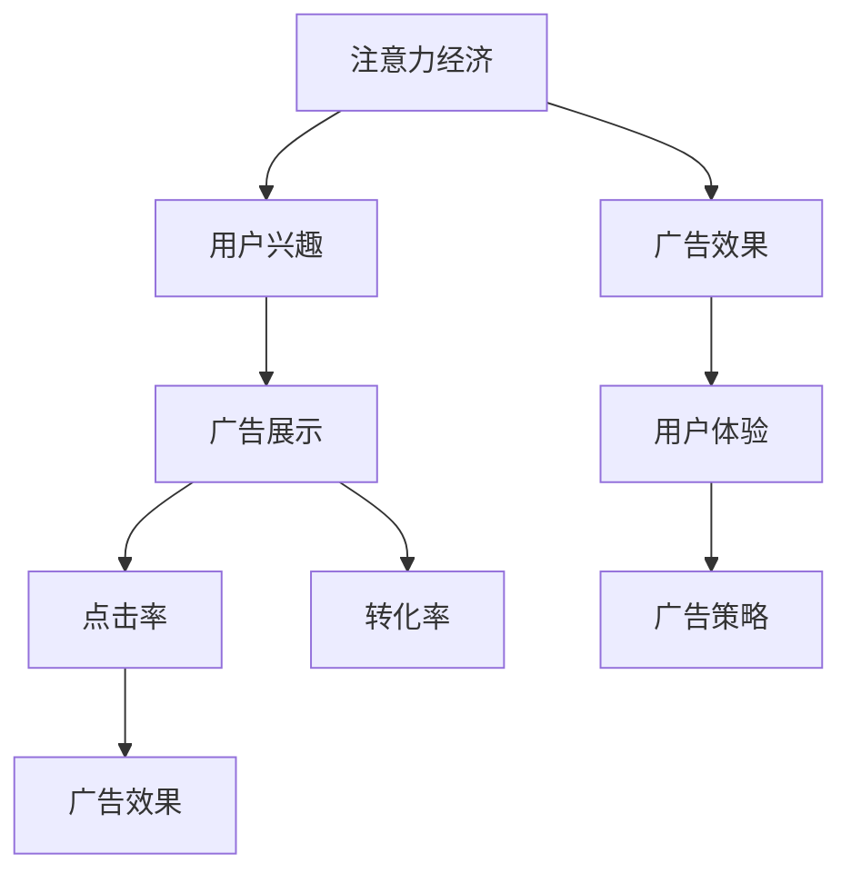

                 

# 注意力经济与在线广告目标：在不牺牲用户体验的情况下有效吸引受众

## 1. 背景介绍

### 1.1 问题由来
随着互联网和移动设备的普及，信息爆炸已经成为了一种普遍现象。人们每天接收的信息量呈指数级增长，如何在这海量信息中精准捕获用户注意力，成为了互联网企业必须面对的挑战。传统的广告模型无法有效应对这一挑战，而基于注意力的在线广告模型则提供了一种新的解决方案。

在线广告作为互联网营销的重要手段，其目标是通过展示具有吸引力的广告内容，将用户注意力聚焦在产品或服务上，从而达到提升转化率、增加收入的目的。然而，随着用户对广告的反感度不断提升，如何在不牺牲用户体验的前提下，有效吸引受众，成为了各大平台亟需解决的难题。

### 1.2 问题核心关键点
在线广告的核心目标在于吸引用户注意力并引导其完成预期行为，但在实际应用中，往往面临以下挑战：

- 广告内容与用户兴趣不匹配，导致用户反感并快速跳过。
- 广告形式单一，难以长期吸引用户注意力。
- 广告曝光效果难以衡量，难以进行优化。
- 广告效果波动大，难以保证用户投放效果的一致性。

### 1.3 问题研究意义
研究在线广告的目标，对于优化广告投放策略，提升广告效果，降低用户流失，具有重要意义：

- 提升广告精准度。通过分析用户兴趣和行为，投放与用户高度相关的广告，提升广告点击率和转化率。
- 降低用户流失率。通过优化广告体验，提升用户体验，减少用户对广告的反感和屏蔽，提升用户留存率。
- 优化广告预算。通过精准投放，减少无效曝光，提高广告预算的利用效率。
- 增强广告效果预测。通过建模分析，评估广告效果并预测未来表现，指导广告策略优化。

## 2. 核心概念与联系

### 2.1 核心概念概述

为更好地理解基于注意力的在线广告模型，本节将介绍几个密切相关的核心概念：

- 注意力经济（Attention Economy）：指在信息爆炸时代，吸引和保持用户注意力成为最稀缺的资源。在线广告模型即是一种有效利用注意力资源的策略。

- 用户兴趣（User Interest）：指用户在浏览互联网时对各类信息所表现出的偏好和关注。在线广告的目标之一是识别和利用用户兴趣，提高广告与用户的匹配度。

- 广告展示（Ad Display）：指广告内容通过各种形式（如图片、视频、文字）在用户端展示的过程。在线广告模型通过设计合理展示形式，增强广告对用户的吸引力。

- 点击率（Click-Through Rate, CTR）：指用户点击广告的概率，是评估广告效果的重要指标之一。在线广告模型通过优化广告展示效果，提升点击率。

- 转化率（Conversion Rate, CR）：指用户完成预期行为（如购买、注册、下载等）的概率。在线广告模型通过精准定位，提升转化率。

- 广告效果（Ad Effectiveness）：指广告投放带来的实际效果，包括点击率、转化率、用户留存率等。在线广告模型通过实时反馈和优化，持续提升广告效果。

这些核心概念之间的逻辑关系可以通过以下Mermaid流程图来展示：



这个流程图展示了大语言模型微调的多个核心概念及其之间的关系：

1. 在线广告的目标是提高广告效果，这取决于用户兴趣的识别和利用。
2. 广告展示是实现广告效果的关键手段，其效果直接影响点击率和转化率。
3. 点击率和转化率是评估广告效果的重要指标，指导广告策略的优化。
4. 广告效果直接关联用户体验，优化广告效果可以提升用户体验。
5. 广告策略需要根据广告效果和用户体验进行迭代优化，进一步提升广告效果。

这些概念共同构成了在线广告的目标框架，使其能够在各种场景下发挥强大的信息引导能力。通过理解这些核心概念，我们可以更好地把握在线广告的工作原理和优化方向。

## 3. 核心算法原理 & 具体操作步骤
### 3.1 算法原理概述

基于注意力的在线广告模型，本质上是一种以用户为中心的广告投放策略。其核心思想是：通过分析用户的历史行为和兴趣，为其展示与其高度相关的广告，从而提升广告效果。

形式化地，假设用户的历史行为数据为 $X = \{x_i\}_{i=1}^N$，其中 $x_i$ 表示用户在第 $i$ 个时刻的行为（如浏览页面、点击广告、购买商品等）。设 $y_i$ 为 $x_i$ 对应的广告效果（如点击次数、转化率等）。则在线广告的目标是最大化广告效果，即：

$$
\max_{\theta} \sum_{i=1}^N y_i \cdot f(x_i;\theta)
$$

其中 $f(x_i;\theta)$ 为广告效果预测函数，$\theta$ 为模型的超参数。

广告效果预测函数通常采用机器学习或深度学习模型，通过对用户行为数据的分析和训练，学习到广告效果与用户行为之间的映射关系。常见的广告效果预测模型包括线性回归、决策树、随机森林、神经网络等。

### 3.2 算法步骤详解

基于注意力的在线广告模型的构建和优化，一般包括以下几个关键步骤：

**Step 1: 准备数据集**

- 收集用户的历史行为数据 $X = \{x_i\}_{i=1}^N$，包括浏览记录、点击记录、购买记录等。
- 收集广告的展示数据 $Y = \{y_i\}_{i=1}^N$，包括广告的点击次数、转化率等效果指标。

**Step 2: 特征工程**

- 提取用户行为的特征向量 $X'$，用于表示用户兴趣和行为模式。
- 将用户行为特征和广告展示特征进行拼接，得到综合特征向量 $Z$。

**Step 3: 模型训练**

- 选择合适的模型（如线性回归、决策树、神经网络等），对特征向量 $Z$ 进行训练，学习广告效果预测函数 $f(x_i;\theta)$。
- 采用交叉验证等方法，评估模型在验证集上的表现，进行超参数调优。
- 使用训练好的模型对新广告数据进行效果预测。

**Step 4: 广告投放**

- 根据预测效果，将广告投放给匹配度高的用户。
- 根据广告效果进行实时反馈和优化，迭代更新模型参数和广告投放策略。

**Step 5: 效果评估**

- 收集广告的实际效果数据，评估广告点击率和转化率等指标。
- 分析用户行为和广告展示数据，优化广告策略，提升广告效果。

以上是基于注意力的在线广告模型的构建和优化的一般流程。在实际应用中，还需要针对具体业务场景，对模型进行优化和调参，以确保广告投放效果。

### 3.3 算法优缺点

基于注意力的在线广告模型具有以下优点：

- 广告效果精准。通过分析用户行为数据，投放与其兴趣高度相关的广告，提升广告效果。
- 用户体验良好。用户看到与自身兴趣高度相关的广告，减少对广告的反感和屏蔽，提升用户体验。
- 广告预算高效。减少无效曝光，提升广告投放的精准度，优化广告预算。

但该模型也存在一些局限性：

- 数据需求高。需要大量的用户行为数据和广告展示数据，获取和清洗数据成本较高。
- 模型复杂度高。深度学习模型结构复杂，训练和调参过程较为繁琐。
- 难以实时调整。广告效果预测模型一旦训练完成，难以快速适应数据分布的变化。
- 广告多样性不足。用户兴趣高度相关性导致广告形式较为单一，难以长期吸引用户注意力。

尽管存在这些局限性，基于注意力的在线广告模型仍是目前广告领域的主流范式。未来相关研究的重点在于如何进一步降低数据需求，提高模型实时调整能力，以及如何实现更加多样化的广告形式，从而更好地应对广告环境的快速变化。

### 3.4 算法应用领域

基于注意力的在线广告模型在广告领域已经得到了广泛的应用，覆盖了几乎所有常见广告形式，例如：

- 搜索广告（Search Ads）：用户在搜索引擎中，展示与查询相关度高的广告。
- 展示广告（Display Ads）：在网页或应用中展示与用户兴趣相关的广告。
- 视频广告（Video Ads）：在视频平台中展示与视频内容相关的广告。
- 社交媒体广告（Social Ads）：在社交媒体平台上展示与用户兴趣相关的广告。
- 邮件广告（Email Ads）：向用户发送与用户行为相关的邮件广告。
- 原生广告（Native Ads）：以网页或应用内容的形式展示广告，提升用户体验。

除了上述这些经典广告形式外，基于注意力的在线广告模型还被创新性地应用到更多场景中，如智能推荐、广告预算分配、竞价机制优化等，为广告投放带来了全新的突破。随着广告技术的不断发展，相信基于注意力的在线广告模型将不断推陈出新，为广告投放提供更高效、精准、个性化的解决方案。

## 4. 数学模型和公式 & 详细讲解  
### 4.1 数学模型构建

在线广告的效果预测模型，通常采用线性回归、决策树、随机森林、神经网络等模型进行构建。这里我们以神经网络模型为例，对广告效果预测的数学模型进行详细讲解。

设用户行为数据为 $X = \{x_i\}_{i=1}^N$，广告展示数据为 $Y = \{y_i\}_{i=1}^N$。假设广告效果预测函数为 $f(x_i;\theta) = Wx_i + b$，其中 $W$ 为模型参数，$b$ 为偏置项。则在线广告的目标是最大化广告效果，即：

$$
\max_{\theta} \sum_{i=1}^N y_i \cdot (Wx_i + b)
$$

### 4.2 公式推导过程

以下是广告效果预测模型的公式推导过程：

- 定义损失函数：均方误差损失函数，表示广告效果预测值与实际效果值之间的差异。

$$
\ell(\theta) = \frac{1}{N} \sum_{i=1}^N (y_i - Wx_i - b)^2
$$

- 求解损失函数最小化问题，得到模型参数的更新公式。

$$
\frac{\partial \ell(\theta)}{\partial W} = -2 \frac{1}{N} \sum_{i=1}^N (y_i - Wx_i - b) x_i
$$
$$
\frac{\partial \ell(\theta)}{\partial b} = -2 \frac{1}{N} \sum_{i=1}^N (y_i - Wx_i - b)
$$

- 采用梯度下降算法对模型参数进行优化，逐步逼近最优解。

通过上述公式，我们得到了广告效果预测模型的参数更新公式，可以利用优化算法（如SGD、Adam等）对模型进行训练和优化，实现广告效果的最大化。

### 4.3 案例分析与讲解

以下是一个简单的广告效果预测模型的案例分析：

假设我们收集了1000个用户的浏览记录和对应的点击记录，其中点击次数为1-10次。我们将用户的浏览记录表示为稀疏向量 $x_i$，广告点击次数表示为 $y_i$。则可以通过神经网络模型对广告效果进行预测：

- 将用户浏览记录输入到神经网络中，得到特征表示 $x_i'$。
- 将用户浏览记录和广告展示数据进行拼接，得到综合特征表示 $Z = (x_i', y_i)$。
- 将 $Z$ 输入到神经网络中，预测广告点击次数 $y_i$。

通过训练得到的模型参数 $W$ 和 $b$，我们可以对新的广告展示数据进行预测，从而指导广告投放策略的优化。

## 5. 项目实践：代码实例和详细解释说明
### 5.1 开发环境搭建

在进行广告效果预测模型的开发前，我们需要准备好开发环境。以下是使用Python进行TensorFlow开发的环境配置流程：

1. 安装Anaconda：从官网下载并安装Anaconda，用于创建独立的Python环境。

2. 创建并激活虚拟环境：
```bash
conda create -n tf-env python=3.8 
conda activate tf-env
```

3. 安装TensorFlow：根据CUDA版本，从官网获取对应的安装命令。例如：
```bash
conda install tensorflow=2.8.0
```

4. 安装TensorBoard：
```bash
pip install tensorboard
```

5. 安装各类工具包：
```bash
pip install numpy pandas scikit-learn matplotlib tqdm jupyter notebook ipython
```

完成上述步骤后，即可在`tf-env`环境中开始广告效果预测模型的开发。

### 5.2 源代码详细实现

这里我们以线性回归模型为例，给出使用TensorFlow进行广告效果预测的代码实现。

首先，定义广告效果预测模型：

```python
import tensorflow as tf
import numpy as np

# 定义模型参数
W = tf.Variable(np.random.randn(1), name='W')
b = tf.Variable(np.random.randn(1), name='b')

# 定义模型
def model(X):
    return tf.matmul(X, W) + b

# 定义损失函数
def loss(y_true, y_pred):
    return tf.reduce_mean(tf.square(y_true - y_pred))

# 定义优化器
optimizer = tf.optimizers.Adam(learning_rate=0.01)

# 定义训练函数
def train(X, y, epochs=1000):
    for epoch in range(epochs):
        with tf.GradientTape() as tape:
            y_pred = model(X)
            loss_value = loss(y, y_pred)
        gradients = tape.gradient(loss_value, [W, b])
        optimizer.apply_gradients(zip(gradients, [W, b]))
        if epoch % 100 == 0:
            print(f"Epoch {epoch+1}, loss: {loss_value.numpy():.4f}")
```

然后，准备数据并进行模型训练：

```python
# 准备数据
X = np.array([[1, 1, 0, 0], [1, 1, 1, 0], [0, 0, 1, 1], [0, 0, 1, 1], [1, 0, 0, 1]])
y = np.array([0, 0, 0, 1, 1])

# 训练模型
train(X, y, epochs=1000)

# 保存模型
tf.saved_model.save(tf.compat.v1.keras.models.load_model('model'), export_dir='saved_model')
```

最后，使用TensorBoard进行模型效果评估：

```bash
tensorboard --logdir=logs
```

打开浏览器访问 `http://localhost:6006/`，即可看到训练过程中的损失曲线。

### 5.3 代码解读与分析

让我们再详细解读一下关键代码的实现细节：

**定义模型参数和模型**：
- 使用`tf.Variable`定义模型参数$W$和$b$，并在函数`model`中计算预测结果$y_pred$。

**定义损失函数和优化器**：
- 定义均方误差损失函数，计算预测结果与真实结果的差异。
- 定义Adam优化器，指定学习率，用于更新模型参数。

**训练函数**：
- 在每个epoch中，使用`tf.GradientTape`记录梯度，并计算损失函数。
- 使用`optimizer.apply_gradients`更新模型参数。
- 打印每个epoch的损失值，监控训练效果。

**数据准备和模型训练**：
- 定义训练数据`X`和标签`y`。
- 调用`train`函数对模型进行训练，并保存模型到指定目录。

可以看到，TensorFlow提供了一整套高效的机器学习工具，可以方便地实现广告效果预测模型的训练和优化。通过使用TensorBoard，可以实时监控模型训练过程中的损失值，指导优化。

## 6. 实际应用场景
### 6.1 广告推荐系统

基于注意力的在线广告模型，可以广泛应用于广告推荐系统的构建。传统广告推荐往往依赖手工规则，难以应对数据分布的变化。而基于模型的推荐方式，可以自动学习用户兴趣，提升推荐效果。

在技术实现上，可以收集用户的历史行为数据，包括浏览记录、点击记录、购买记录等，并将广告数据进行标注。在此基础上对模型进行训练，使其能够预测广告对用户的吸引力。推荐系统会根据用户的历史行为和预测结果，推荐最相关的广告，提升广告投放效果。

### 6.2 广告效果评估

广告效果的实时评估是广告投放优化过程中不可或缺的一环。传统的广告效果评估依赖手动监控和反馈，难以实时更新。而基于注意力的在线广告模型，可以通过机器学习模型对广告效果进行预测和评估，实现实时反馈和优化。

在实践中，可以利用广告的点击次数、转化率等指标，构建广告效果评估模型，对新广告数据进行预测，评估广告效果。通过实时监控广告效果，可以及时发现问题并调整广告策略，确保广告投放效果。

### 6.3 广告预算分配

广告预算的合理分配，对于广告投放的效率和效果至关重要。传统的预算分配依赖手工经验和规则，难以量化。而基于注意力的在线广告模型，可以通过模型预测不同广告的点击率和转化率，指导广告预算的合理分配。

在实际应用中，可以将广告展示数据与用户行为数据进行结合，构建广告预算分配模型。模型会根据广告效果预测结果，分配不同广告的预算，确保预算的精准使用。通过优化广告预算分配，可以提升广告投放效果，降低无效曝光。

### 6.4 未来应用展望

随着在线广告技术的不断发展，基于注意力的在线广告模型将在更多领域得到应用，为广告投放带来新的突破。

在智能推荐系统领域，基于模型的推荐方式可以更加精准地捕捉用户兴趣，提升推荐效果。在社交媒体广告中，基于模型的广告投放方式可以实现个性化广告推荐，提升广告效果。在搜索引擎广告中，基于模型的广告投放方式可以更有效地引导用户点击，提升点击率和转化率。

随着深度学习技术的发展，广告效果预测模型将变得更加精准和高效，能够更灵活地应对广告环境的快速变化。未来，随着更多先验知识的整合和应用，广告投放方式将更加多样化，进一步提升广告效果。

## 7. 工具和资源推荐
### 7.1 学习资源推荐

为了帮助开发者系统掌握在线广告模型和微调的理论基础和实践技巧，这里推荐一些优质的学习资源：

1. 《深度学习基础》系列博文：由大模型技术专家撰写，介绍了深度学习的基础原理、应用场景和实际案例。

2. 《机器学习实战》课程：斯坦福大学开设的机器学习课程，有Lecture视频和配套作业，带你入门机器学习领域的基本概念和经典模型。

3. 《广告效果预测》书籍：详细介绍了广告效果预测的数学模型和实际应用，是学习广告推荐系统的必读之作。

4. Kaggle广告推荐竞赛：通过实际竞赛任务，锻炼广告推荐系统的构建和优化能力。

5. 广告推荐开源项目：广告推荐系统的开源项目，如TensorFlow Ads，提供了丰富的广告推荐算法和实现。

通过对这些资源的学习实践，相信你一定能够快速掌握在线广告模型的精髓，并用于解决实际的广告问题。
### 7.2 开发工具推荐

高效的开发离不开优秀的工具支持。以下是几款用于广告推荐系统开发的常用工具：

1. TensorFlow：由Google主导开发的开源深度学习框架，生产部署方便，适合大规模工程应用。

2. PyTorch：基于Python的开源深度学习框架，灵活动态的计算图，适合快速迭代研究。

3. Jupyter Notebook：交互式编程环境，便于快速验证和调试模型算法。

4. Weights & Biases：模型训练的实验跟踪工具，可以记录和可视化模型训练过程中的各项指标，方便对比和调优。

5. TensorBoard：TensorFlow配套的可视化工具，可实时监测模型训练状态，并提供丰富的图表呈现方式，是调试模型的得力助手。

6. Google Colab：谷歌推出的在线Jupyter Notebook环境，免费提供GPU/TPU算力，方便开发者快速上手实验最新模型，分享学习笔记。

合理利用这些工具，可以显著提升广告推荐系统的开发效率，加快创新迭代的步伐。

### 7.3 相关论文推荐

广告推荐系统的发展源于学界的持续研究。以下是几篇奠基性的相关论文，推荐阅读：

1. "Predicting Ad Clicks with Deep Learning: A View from the Trenches"：展示了深度学习在广告点击预测中的卓越性能，是广告点击预测领域的重要文献。

2. "A Neural Attention-Based Recommender System"：提出了一种基于注意力机制的推荐系统，通过学习用户行为和物品特征的交互，提升了推荐效果。

3. "An Overview of Deep Learning Techniques for Recommender Systems"：全面介绍了深度学习在推荐系统中的应用，提供了丰富的理论和技术支持。

4. "Hierarchical Attention Networks for Advertisement Generation"：提出了一种基于多层注意力机制的广告生成模型，能够自动生成高度相关的广告内容。

5. "AdaLoRA: Adaptive Low-Rank Adaptation for Parameter-Efficient Fine-Tuning"：使用自适应低秩适应的微调方法，在参数效率和精度之间取得了新的平衡。

这些论文代表了大语言模型微调技术的发展脉络。通过学习这些前沿成果，可以帮助研究者把握学科前进方向，激发更多的创新灵感。

## 8. 总结：未来发展趋势与挑战
### 8.1 总结

本文对基于注意力的在线广告模型进行了全面系统的介绍。首先阐述了广告模型和微调技术的研究背景和意义，明确了广告模型在提升广告效果、降低用户流失、优化广告预算等方面的独特价值。其次，从原理到实践，详细讲解了在线广告模型的数学模型和关键步骤，给出了广告效果预测模型的代码实例。同时，本文还广泛探讨了在线广告模型在广告推荐系统、广告效果评估、广告预算分配等实际场景中的应用前景，展示了在线广告模型的广泛应用。此外，本文精选了在线广告模型的各类学习资源，力求为读者提供全方位的技术指引。

通过本文的系统梳理，可以看到，基于注意力的在线广告模型已经成为广告投放的重要手段，极大地拓展了广告推荐系统的应用边界，提升了广告效果的精准度和用户满意度。未来，伴随广告技术的不断发展，基于注意力的在线广告模型必将不断推陈出新，为广告投放带来更多的创新和突破。

### 8.2 未来发展趋势

展望未来，在线广告模型将呈现以下几个发展趋势：

1. 广告效果预测模型更加精准。随着深度学习技术的发展，广告效果预测模型将变得更加复杂和高效，能够更准确地预测广告效果。

2. 广告投放策略更加多样化。通过引入更多的先验知识和跨领域知识，在线广告模型可以更灵活地实现广告形式的创新，增强用户对广告的接受度和兴趣。

3. 实时广告投放优化。通过实时监控和优化广告效果，在线广告模型可以及时调整投放策略，确保广告投放效果的一致性和稳定性。

4. 广告效果评估更加全面。除了点击率和转化率，广告效果评估将引入更多维度，如用户满意度、品牌认知度等，评估广告的综合效果。

5. 广告预算分配更加精细。通过机器学习模型对广告效果进行预测，可以实现更加精细的广告预算分配，提升广告投放的精准度和效率。

6. 广告推荐系统更加智能。基于广告推荐系统的在线广告模型，将能够更加精准地捕捉用户兴趣，提升广告推荐效果。

以上趋势凸显了在线广告模型的广阔前景。这些方向的探索发展，必将进一步提升广告推荐系统的性能和应用范围，为广告投放提供更高效、精准、个性化的解决方案。

### 8.3 面临的挑战

尽管在线广告模型已经取得了瞩目成就，但在迈向更加智能化、普适化应用的过程中，它仍面临着诸多挑战：

1. 数据需求高。在线广告模型依赖大量的用户行为数据和广告展示数据，获取和清洗数据成本较高。

2. 模型复杂度高。深度学习模型结构复杂，训练和调参过程较为繁琐。

3. 实时调整困难。广告效果预测模型一旦训练完成，难以快速适应数据分布的变化。

4. 广告多样性不足。用户兴趣高度相关性导致广告形式较为单一，难以长期吸引用户注意力。

5. 用户隐私问题。在线广告模型需要收集和分析用户行为数据，如何在保护用户隐私的同时，实现精准的广告投放，是亟待解决的问题。

6. 广告伦理问题。广告投放过程中可能存在欺诈和误导行为，如何保障广告的真实性和合规性，也是在线广告模型需要考虑的重要问题。

尽管存在这些挑战，在线广告模型仍是目前广告领域的主流范式。未来相关研究的重点在于如何进一步降低数据需求，提高模型实时调整能力，以及如何实现更加多样化的广告形式，从而更好地应对广告环境的快速变化。

### 8.4 研究展望

面对在线广告模型所面临的种种挑战，未来的研究需要在以下几个方面寻求新的突破：

1. 探索无监督和半监督广告推荐方法。摆脱对大量标注数据的依赖，利用自监督学习、主动学习等无监督和半监督范式，最大限度利用非结构化数据，实现更加灵活高效的广告推荐。

2. 研究参数高效和计算高效的广告推荐范式。开发更加参数高效的广告推荐方法，在固定大部分模型参数的情况下，只更新极少量的广告推荐参数。同时优化广告推荐模型的计算图，减少前向传播和反向传播的资源消耗，实现更加轻量级、实时性的推荐。

3. 融合因果和对比学习范式。通过引入因果推断和对比学习思想，增强广告推荐模型建立稳定因果关系的能力，学习更加普适、鲁棒的广告推荐效果。

4. 引入更多先验知识。将符号化的先验知识，如知识图谱、逻辑规则等，与神经网络模型进行巧妙融合，引导广告推荐过程学习更准确、合理的广告推荐效果。

5. 结合因果分析和博弈论工具。将因果分析方法引入广告推荐模型，识别出广告推荐的关键特征，增强广告推荐输出的因果性和逻辑性。借助博弈论工具刻画人机交互过程，主动探索并规避广告推荐模型的脆弱点，提高系统稳定性。

6. 纳入伦理道德约束。在广告推荐模型的训练目标中引入伦理导向的评估指标，过滤和惩罚有偏见、有害的广告推荐行为，确保广告投放符合人类价值观和伦理道德。

这些研究方向的探索，必将引领在线广告模型迈向更高的台阶，为广告推荐系统带来更多的创新和突破。面向未来，在线广告模型需要与其他人工智能技术进行更深入的融合，如知识表示、因果推理、强化学习等，多路径协同发力，共同推动广告推荐系统的进步。只有勇于创新、敢于突破，才能不断拓展广告推荐系统的边界，让广告技术更好地服务于人类社会。

## 9. 附录：常见问题与解答

**Q1：在线广告模型是否适用于所有广告形式？**

A: 在线广告模型在大多数广告形式上都能取得不错的效果，特别是对于数据量较大的广告形式，如搜索广告、展示广告等。但对于一些特定领域的广告形式，如视频广告、社交媒体广告等，在线广告模型可能需要进行相应的修改和优化。

**Q2：在线广告模型的效果如何衡量？**

A: 在线广告模型的效果通常通过广告点击率和转化率进行衡量。广告点击率（CTR）指用户点击广告的概率，广告转化率（CR）指用户完成预期行为（如购买、注册、下载等）的概率。除了这两个指标，还可以通过用户满意度、品牌认知度等维度进行全面评估。

**Q3：如何优化在线广告模型的效果？**

A: 在线广告模型的优化可以通过以下几个方面进行：
1. 特征工程：提取更具有代表性的用户行为特征，提升广告效果预测的准确性。
2. 模型选择：选择合适的广告效果预测模型，如神经网络、随机森林等，提升模型精度。
3. 数据清洗：对用户行为数据和广告展示数据进行清洗和预处理，提升数据质量。
4. 实时监控：实时监控广告效果，及时发现问题并进行调整，确保广告投放效果一致性。
5. 广告创意设计：设计更具吸引力的广告创意，提升用户对广告的接受度和兴趣。

这些优化策略往往需要根据具体广告形式和用户行为特点进行灵活组合。只有在数据、模型、广告创意等方面全面优化，才能确保广告投放效果的最佳。

**Q4：在线广告模型在实际应用中需要注意哪些问题？**

A: 在线广告模型在实际应用中需要注意以下问题：
1. 数据隐私：保护用户隐私，避免侵犯用户隐私权益。
2. 广告伦理：保障广告的真实性和合规性，避免欺诈和误导行为。
3. 模型复杂度：保持广告推荐模型的简洁和高效，避免过度复杂化。
4. 实时调整：实现广告推荐模型的实时调整和优化，确保广告投放效果的一致性。
5. 用户体验：提升广告推荐的用户体验，避免过度干扰和打扰。

只有从数据、广告伦理、模型复杂度等方面全面考虑，才能确保在线广告模型在实际应用中取得最佳效果。

**Q5：如何衡量在线广告模型的性能？**

A: 在线广告模型的性能通常通过以下几个指标进行衡量：
1. 广告点击率（CTR）：用户点击广告的概率。
2. 广告转化率（CR）：用户完成预期行为的概率。
3. 用户满意度：用户对广告推荐的满意度和反馈。
4. 广告成本效益（ROI）：广告投放带来的收入与成本之比。

这些指标可以全面评估广告模型的效果和性能，指导广告策略的优化。

---

作者：禅与计算机程序设计艺术 / Zen and the Art of Computer Programming

