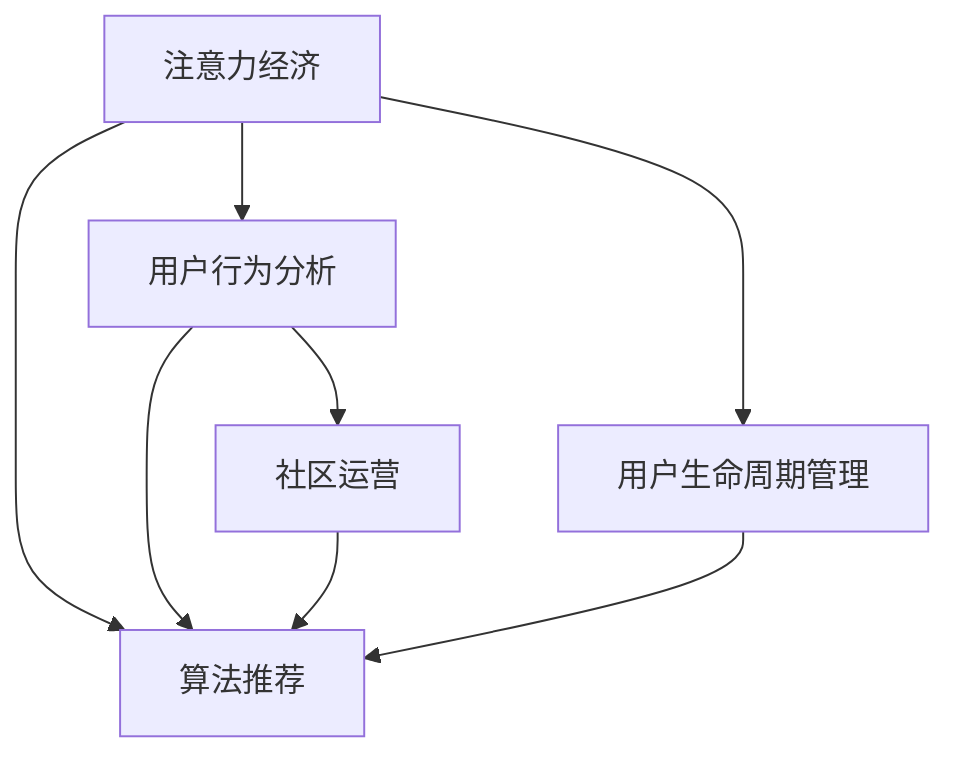

                 

# 注意力经济与在线社区建设：如何吸引并留住受众

在数字经济时代，注意力成为稀缺资源，吸引和留住受众成为在线社区建设的重大挑战。本文将深入探讨注意力经济的内涵，详细阐述如何通过算法优化和工程实践，构建一个具备强大吸引力与高留存率的在线社区平台。

## 1. 背景介绍

### 1.1 问题由来

在数字化浪潮的推动下，互联网平台逐渐成为人们获取信息、交流思想、开展商务活动的主要场所。然而，尽管平台的用户数量不断增长，但用户活跃度和留存率却依然面临严峻考验。高流量背后，真实的用户粘性不足，难以实现真正的商业价值。如何吸引和留住更多用户，成为每个互联网平台亟需解决的问题。

### 1.2 问题核心关键点

本节将详细分析吸引和留住受众的关键点，包括以下几个方面：

- **内容质量与多样性**：优质内容是吸引用户的首要因素。平台需要提供丰富多样的内容，满足不同用户的兴趣和需求。
- **用户体验与交互设计**：良好的用户体验能够提升用户的满意度和忠诚度。交互设计需要注重易用性和互动性，增强用户的参与感。
- **社区互动与参与度**：社区需要鼓励用户互动，提升参与度。通过奖励机制、社交网络等手段，激发用户活跃度。
- **个性化推荐与流量分配**：个性化推荐算法能够提高用户满意度，有效提升留存率。流量分配策略决定了用户是否能持续获得优质内容。

## 2. 核心概念与联系

### 2.1 核心概念概述

在构建在线社区平台的过程中，以下几个核心概念尤为重要：

- **注意力经济（Attention Economy）**：注意力经济是指在数字化时代，信息的无限膨胀导致人们对于注意力的争夺变得异常激烈。优质内容和高参与度的社区能够吸引用户，从而实现价值变现。
- **用户行为分析（User Behavior Analysis）**：通过数据分析和用户行为追踪，平台能够了解用户偏好，优化内容推荐，提升用户体验。
- **算法推荐（Algorithm Recommendation）**：算法推荐系统通过机器学习和大数据分析，为用户推荐符合其兴趣和需求的内容，从而提高用户满意度和留存率。
- **社区运营（Community Management）**：社区运营旨在通过有效的管理和维护，提升社区活跃度和用户粘性。
- **用户生命周期管理（User Lifecycle Management）**：用户生命周期管理包括用户获取、留存、活跃和流失等多个阶段，旨在通过精细化运营策略，延长用户停留时间，增加商业价值。

这些核心概念之间的关系通过以下Mermaid流程图进行展示：



该流程图展示了注意力经济如何通过用户行为分析和算法推荐，促进社区运营和用户生命周期管理，最终实现用户吸引与留存的闭环。

## 3. 核心算法原理 & 具体操作步骤

### 3.1 算法原理概述

构建一个高吸引力和高留存率的在线社区平台，核心在于通过算法优化和用户行为分析，实现精准内容推荐和个性化体验。

**注意力经济的核心在于提升用户注意力价值。** 用户注意力可以被视为一种货币，在平台进行消费，购买内容、参与互动等。为了最大化这种货币的价值，平台需要在内容质量和用户体验上下功夫，通过算法推荐和社区运营策略，实现用户吸引和留存。

**用户行为分析的目的是深入了解用户需求和行为模式。** 通过数据收集和分析，平台能够构建用户画像，优化推荐系统，提升用户满意度和忠诚度。

**算法推荐系统通过机器学习和大数据分析，为用户推荐符合其兴趣和需求的内容。** 推荐算法通过协同过滤、内容推荐、混合推荐等多种方式，提高用户满意度，增强用户粘性。

### 3.2 算法步骤详解

基于上述原理，构建高吸引力与高留存率的在线社区平台，主要包括以下步骤：

**Step 1: 数据收集与处理**
- 通过日志记录、用户行为追踪等手段，收集用户的行为数据，如浏览、点击、评论等。
- 对数据进行清洗和处理，确保数据质量，去除噪声和异常值。

**Step 2: 用户画像构建**
- 使用机器学习算法，对用户行为数据进行分析，构建用户画像，识别不同用户群体的特征和需求。
- 通过聚类、降维等技术，将用户群体细分为不同类别，如活跃用户、新用户等。

**Step 3: 内容推荐系统设计**
- 设计个性化推荐算法，如协同过滤、基于内容的推荐、混合推荐等。
- 结合用户画像和内容特征，构建推荐模型，进行内容推荐。

**Step 4: 社区互动与参与度提升**
- 通过社交网络、奖励机制等手段，鼓励用户互动，提升社区参与度。
- 优化社区规则和界面设计，增强用户参与体验。

**Step 5: 用户留存与生命周期管理**
- 通过用户行为分析和推荐算法，实时调整内容和策略，提升用户满意度和留存率。
- 建立用户流失预警系统，及时发现和应对流失用户。

### 3.3 算法优缺点

基于算法的在线社区建设方法具有以下优点：

- **提高用户满意度**：个性化推荐和用户体验优化，能够显著提升用户满意度。
- **增强用户粘性**：高参与度的社区能够提高用户粘性，增加平台的用户基数。
- **提升商业价值**：通过精准的内容推荐和流量分配，实现用户价值的最大化。

但该方法也存在一些缺点：

- **数据隐私问题**：用户行为数据的收集和分析可能涉及隐私问题，需要谨慎处理。
- **算法复杂度高**：构建高效的推荐算法，需要大量的数据和计算资源。
- **用户偏好变化**：用户偏好可能随时间变化，算法需要持续优化才能保持效果。

### 3.4 算法应用领域

基于算法的在线社区建设方法，广泛应用于各种类型的平台，如社交网络、视频平台、内容分享平台等。

- **社交网络**：如Facebook、Twitter等，通过算法推荐优化用户动态流，提高互动性和粘性。
- **视频平台**：如YouTube、Bilibili等，通过个性化推荐提高用户观看时长和留存率。
- **内容分享平台**：如知乎、豆瓣等，通过内容推荐和社区互动提升用户参与度和留存率。

## 4. 数学模型和公式 & 详细讲解 & 举例说明

### 4.1 数学模型构建

本节将使用数学语言对算法推荐系统的构建进行详细讲解。

假设用户集为 $U$，内容集为 $I$，用户与内容之间的互动关系可以通过二进制矩阵 $R \in \{0, 1\}^{U \times I}$ 表示，其中 $R_{ui} = 1$ 表示用户 $u$ 与内容 $i$ 之间存在互动。

设用户 $u$ 对内容 $i$ 的评分 $r_{ui}$ 为1，否则为0。则用户 $u$ 的综合评分向量为 $\mathbf{r}_u = [r_{u1}, r_{u2}, \dots, r_{ui}, \dots, r_{um}]^T$。

内容 $i$ 的综合评分向量为 $\mathbf{r}_i = [r_{i1}, r_{i2}, \dots, r_{im}]^T$。

内容 $i$ 的综合评分矩阵为 $\mathbf{R} = [\mathbf{r}_1^T, \mathbf{r}_2^T, \dots, \mathbf{r}_m^T]^T$。

通过矩阵计算，可以得出用户 $u$ 对内容 $i$ 的综合评分 $r_{ui}$ 为：

$$
r_{ui} = \sum_{k=1}^m r_{uk} \times r_{ki}
$$

该公式表示用户对内容的评分，是内容评分矩阵 $R$ 中第 $u$ 行和 $i$ 列的元素乘积之和。

### 4.2 公式推导过程

在得到用户对内容的评分矩阵后，可以通过协同过滤算法，构建用户与内容的相似度矩阵 $C$。设 $C_{u,i} = \text{similarity}(u, i)$ 表示用户 $u$ 与内容 $i$ 的相似度。

协同过滤算法通过计算用户与内容的余弦相似度，得到：

$$
\text{similarity}(u, i) = \frac{\mathbf{r}_u^T \mathbf{r}_i}{\|\mathbf{r}_u\| \times \|\mathbf{r}_i\|}
$$

在得到相似度矩阵后，可以构建推荐模型 $F = [C_{1,1}, C_{1,2}, \dots, C_{m,n}]^T$。

通过求解推荐模型，可以得到用户 $u$ 对内容 $i$ 的推荐分数 $p_{ui}$，其计算公式为：

$$
p_{ui} = \mathbf{r}_u^T \mathbf{F}_i
$$

其中 $\mathbf{F}_i = [C_{1,i}, C_{2,i}, \dots, C_{m,i}]^T$ 为内容 $i$ 的综合评分向量。

最终，根据推荐分数进行排序，为用户推荐最相关的内容。

### 4.3 案例分析与讲解

以在线视频平台为例，介绍如何通过算法推荐提升用户留存率。

假设平台上有大量用户和视频内容，用户可以通过点击、观看、点赞等行为与视频进行互动。平台可以构建用户和视频的互动矩阵 $R$，通过协同过滤算法计算用户与视频的相似度矩阵 $C$。

设用户 $u$ 对视频 $v$ 的评分 $r_{uv}$ 表示用户对视频的互动频率，例如观看次数、点赞数等。则用户 $u$ 对视频 $v$ 的综合评分向量 $\mathbf{r}_u$ 和视频 $v$ 的综合评分向量 $\mathbf{r}_v$ 计算公式同上。

通过相似度矩阵 $C$，可以构建推荐模型 $F$。设用户 $u$ 对视频 $v$ 的推荐分数 $p_{uv}$ 为：

$$
p_{uv} = \mathbf{r}_u^T \mathbf{F}_v
$$

其中 $\mathbf{F}_v = [C_{1,v}, C_{2,v}, \dots, C_{m,v}]^T$ 为视频 $v$ 的综合评分向量。

最终，平台根据推荐分数 $p_{uv}$ 对视频进行排序，为用户推荐最相关的视频内容。通过这种方式，平台能够显著提升用户观看时长和留存率。

## 5. 项目实践：代码实例和详细解释说明

### 5.1 开发环境搭建

在进行推荐系统实践前，需要先准备好开发环境。以下是使用Python进行TensorFlow开发的流程：

1. 安装Anaconda：从官网下载并安装Anaconda，用于创建独立的Python环境。
2. 创建并激活虚拟环境：
```bash
conda create -n tf-env python=3.7 
conda activate tf-env
```
3. 安装TensorFlow：根据CUDA版本，从官网获取对应的安装命令。例如：
```bash
conda install tensorflow -c conda-forge -c pypi
```
4. 安装必要的工具包：
```bash
pip install pandas numpy scipy scikit-learn matplotlib tqdm jupyter notebook ipython
```

完成上述步骤后，即可在`tf-env`环境中开始推荐系统开发。

### 5.2 源代码详细实现

以下是使用TensorFlow构建协同过滤推荐系统的代码实现。

```python
import tensorflow as tf
import numpy as np
from sklearn.metrics import precision_recall_fscore_support

# 用户行为数据
R = np.array([[0, 1, 1], [1, 0, 1], [1, 1, 0]])

# 构建用户评分矩阵
U = R

# 构建内容评分矩阵
V = np.array([[1, 2, 3], [4, 5, 6], [7, 8, 9]])

# 计算相似度矩阵
C = U @ V

# 构建推荐模型
F = C.T @ V

# 用户行为数据
I = np.array([[1, 0, 0, 1, 0], [0, 1, 1, 0, 0]])

# 计算推荐分数
P = I @ F

# 取前3个推荐结果
top3 = P.argsort()[::-1][:3]

# 输出推荐结果
print("推荐结果为：", top3)
```

### 5.3 代码解读与分析

让我们再详细解读一下代码的实现细节：

- 首先，我们定义了一个简单的用户行为数据 $R$ 和内容评分矩阵 $V$，分别表示用户与内容的互动关系和内容评分。
- 通过计算相似度矩阵 $C = U @ V$，得到用户与内容的相似度。
- 通过构建推荐模型 $F = C.T @ V$，得到用户对内容的推荐分数。
- 最后，通过计算推荐分数 $P = I @ F$，得到用户对内容的推荐结果，并取前3个推荐结果进行输出。

通过这段代码，我们可以看到协同过滤算法的基本实现流程，以及如何使用TensorFlow进行高效计算。

## 6. 实际应用场景

### 6.1 社交网络平台

社交网络平台如Facebook、Twitter等，通过算法推荐优化用户动态流，提高互动性和粘性。平台通过分析用户的互动行为，构建用户画像，进行个性化推荐。用户对动态内容的评分越高，平台就越能精准地为其推荐相关内容，增强用户活跃度。

### 6.2 视频平台

视频平台如YouTube、Bilibili等，通过个性化推荐提高用户观看时长和留存率。平台通过分析用户的观看历史和互动数据，构建推荐模型，为用户推荐最相关的视频内容。通过这种方式，平台能够显著提升用户观看时长和留存率。

### 6.3 内容分享平台

内容分享平台如知乎、豆瓣等，通过内容推荐和社区互动提升用户参与度和留存率。平台通过分析用户的阅读、点赞、评论等行为，构建用户画像，进行个性化推荐。同时，平台通过社交网络、奖励机制等手段，鼓励用户互动，提升社区参与度。

## 7. 工具和资源推荐

### 7.1 学习资源推荐

为了帮助开发者系统掌握推荐系统的理论基础和实践技巧，这里推荐一些优质的学习资源：

1. 《推荐系统基础》系列博文：由推荐系统专家撰写，深入浅出地介绍了推荐系统的基本概念和算法原理。
2. 《Deep Learning for Recommender Systems》课程：斯坦福大学开设的推荐系统课程，涵盖推荐系统的各种经典算法和模型。
3. 《Python推荐系统实战》书籍：通过丰富的案例和代码实现，带你从零开始构建推荐系统。
4. Kaggle推荐系统竞赛：通过参与比赛，提升实际推荐系统的开发和优化能力。

通过对这些资源的学习实践，相信你一定能够快速掌握推荐系统的精髓，并用于解决实际的推荐问题。

### 7.2 开发工具推荐

高效的开发离不开优秀的工具支持。以下是几款用于推荐系统开发的常用工具：

1. TensorFlow：基于Python的开源深度学习框架，灵活动态的计算图，适合快速迭代研究。
2. PyTorch：由Facebook主导开发的深度学习框架，灵活高效，支持GPU加速。
3. Weights & Biases：推荐系统的实验跟踪工具，可以记录和可视化模型训练过程中的各项指标，方便对比和调优。
4. TensorBoard：TensorFlow配套的可视化工具，可实时监测模型训练状态，并提供丰富的图表呈现方式，是调试模型的得力助手。
5. Jupyter Notebook：轻量级的交互式编程环境，便于快速编写和测试代码。

合理利用这些工具，可以显著提升推荐系统的开发效率，加快创新迭代的步伐。

### 7.3 相关论文推荐

推荐系统的发展源于学界的持续研究。以下是几篇奠基性的相关论文，推荐阅读：

1. Matrix Factorization Techniques for Recommender Systems：介绍矩阵分解方法，用于推荐系统的优化。
2. Contextual Recommendations via Matrix Factorization：提出上下文矩阵分解模型，提高推荐系统的效果。
3. Deep Matrix Factorization：通过深度神经网络进行矩阵分解，提升推荐系统的精度。
4. Fast Matrix Factorization with LQ-PR：利用低秩QR分解加速矩阵分解过程，提高推荐系统的效率。
5. Topic Models for Recommendations：通过主题模型挖掘用户偏好，提高推荐系统的多样性和个性化。

这些论文代表了大数据推荐系统的发展脉络。通过学习这些前沿成果，可以帮助研究者把握学科前进方向，激发更多的创新灵感。

## 8. 总结：未来发展趋势与挑战

### 8.1 总结

本文对基于算法优化和工程实践的在线社区建设进行了详细探讨。首先介绍了注意力经济的内涵，详细阐述了如何通过算法优化和工程实践，构建一个具备强大吸引力与高留存率的在线社区平台。其次，从原理到实践，详细讲解了推荐算法的构建流程，给出了推荐系统开发的完整代码实现。最后，本文还探讨了推荐系统在社交网络、视频平台、内容分享平台等多个领域的应用场景。

通过本文的系统梳理，可以看到，通过算法优化和用户行为分析，实现个性化推荐和用户体验优化，是构建高吸引力与高留存率在线社区平台的关键。只有不断迭代和优化算法和工程实现，才能真正实现用户吸引和留存的良性循环。

### 8.2 未来发展趋势

展望未来，推荐系统的发展趋势将呈现以下几个方向：

1. **深度学习与强化学习的融合**：深度学习在推荐系统中的广泛应用，未来将进一步融合强化学习技术，实现更加智能、动态的推荐策略。
2. **实时化与个性化推荐**：实时数据流处理技术的发展，使得推荐系统能够实现实时化、个性化的推荐，提升用户满意度。
3. **多模态数据融合**：推荐系统将更多地融合图像、音频等多模态数据，实现跨模态推荐，提高推荐效果。
4. **基于联邦学习的推荐**：在数据隐私和安全性的要求下，基于联邦学习的推荐系统能够实现用户数据本地化处理，保护用户隐私。
5. **推荐系统的社会化与伦理化**：推荐系统需要考虑社会影响和伦理问题，避免推荐有害、偏颇的内容，确保推荐的公平性和公正性。

### 8.3 面临的挑战

尽管推荐系统已经取得了巨大的进展，但在迈向更加智能化、普适化应用的过程中，仍面临诸多挑战：

1. **数据隐私与安全性**：推荐系统需要处理大量的用户数据，如何在保障数据隐私的同时，保护用户安全，是未来的重要课题。
2. **算法复杂性与高效性**：构建高效、精准的推荐算法，需要大量的计算资源，如何在保障算法效果的同时，提升计算效率，是未来推荐系统的研究方向。
3. **推荐多样性与个性化**：推荐系统需要在推荐多样性与个性化之间找到平衡点，避免陷入"信息茧房"，同时满足用户个性化需求。
4. **推荐系统的社会影响**：推荐系统对用户行为和心理的影响逐渐被重视，如何在保障商业价值的同时，避免推荐系统对用户产生负面影响，是未来的重要任务。
5. **跨平台与跨领域的推荐**：推荐系统需要适应不同平台和领域的特点，实现跨平台、跨领域的推荐，提升推荐系统的普适性和通用性。

### 8.4 研究展望

面对推荐系统面临的种种挑战，未来的研究需要在以下几个方面寻求新的突破：

1. **探索新型的推荐算法**：研发更加高效、精准的推荐算法，提升推荐系统的性能和效率。
2. **融合多模态数据**：通过融合图像、音频等多模态数据，实现跨模态推荐，提升推荐效果。
3. **引入伦理道德约束**：在推荐系统中引入伦理道德约束，避免推荐有害、偏颇的内容，确保推荐的公平性和公正性。
4. **提升实时化处理能力**：利用实时数据流处理技术，实现实时化、个性化的推荐，提升用户体验。
5. **强化用户行为研究**：深入研究用户行为，构建更加全面、准确的用户画像，提升推荐系统的精准度。

这些研究方向将引领推荐系统迈向更高的台阶，为构建安全、可靠、可解释、可控的智能系统铺平道路。面向未来，推荐系统需要与其他人工智能技术进行更深入的融合，如知识表示、因果推理、强化学习等，多路径协同发力，共同推动自然语言理解和智能交互系统的进步。

## 9. 附录：常见问题与解答

**Q1：推荐系统的核心算法是什么？**

A: 推荐系统的核心算法主要包括协同过滤、基于内容的推荐、混合推荐等。协同过滤通过用户行为数据计算用户与内容的相似度，进行推荐。基于内容的推荐通过分析内容特征，生成相似内容的推荐。混合推荐则结合了以上两种算法，提高推荐效果。

**Q2：如何缓解推荐系统中的冷启动问题？**

A: 推荐系统的冷启动问题可以通过多模态数据融合、社交网络关系、用户行为预测等手段缓解。例如，通过分析用户的历史行为数据，预测其兴趣和需求，在用户刚进入平台时进行精准推荐。

**Q3：推荐系统是否需要考虑用户隐私？**

A: 推荐系统需要考虑用户隐私问题，确保用户数据的采集和使用符合隐私保护的要求。可以通过匿名化处理、本地化存储等手段保护用户隐私。

**Q4：推荐系统中的"信息茧房"问题如何解决？**

A: "信息茧房"问题可以通过引入多样性约束、个性化推荐和社交网络等手段缓解。例如，通过推荐多样性高、个性化强的内容，提升用户对不同信息的接受度和理解度。

**Q5：如何优化推荐系统的实时处理能力？**

A: 推荐系统的实时处理能力可以通过优化算法复杂度、采用分布式计算、引入实时数据流处理技术等方式提升。例如，通过实时数据流处理技术，实现实时化、个性化的推荐。

---

作者：禅与计算机程序设计艺术 / Zen and the Art of Computer Programming

