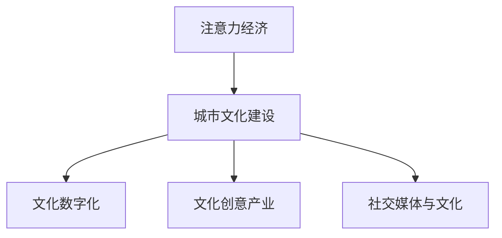

                 

# 注意力经济与城市文化建设

## 1. 背景介绍

在数字经济时代，随着信息技术的不断发展和互联网的普及，数据的获取和处理能力大大增强，从而使得注意力经济（Attention Economy）成为一种重要的新兴经济形态。注意力经济是指在信息过载的背景下，如何通过各种手段获取、吸引和引导用户的注意力，从而实现商业价值的最大化。在当前的市场环境中，谁的注意力资源多，谁就能掌握更大的话语权。

在注意力经济的背景下，城市文化建设也需要充分利用注意力资源，将文化元素与商业、科技相结合，以创新性的方式吸引公众关注，增强城市的文化影响力。城市文化建设是提升城市竞争力和吸引力的重要手段，同时也是展现城市特色和提升市民幸福感的关键措施。本文将探讨如何在注意力经济的时代背景下，利用技术手段推动城市文化建设，提升城市文化软实力。

## 2. 核心概念与联系

### 2.1 核心概念概述

- **注意力经济（Attention Economy）**：在信息爆炸时代，通过各种手段获取、吸引和引导用户注意力，实现商业价值最大化的经济模式。
- **城市文化建设（Urban Cultural Development）**：通过各种方式和手段提升城市文化内涵和表现形式，增强城市软实力，提升市民文化素质和幸福感。
- **文化数字化（Cultural Digitalization）**：利用数字技术手段，如大数据、人工智能等，对文化资源进行数字化处理和转化，增强文化表现形式和传播途径的多样性。
- **文化创意产业（Creative Cultural Industries）**：依托城市文化资源，通过创意和设计，开发文化产品和服务，推动文化消费和经济增长。
- **社交媒体与文化**：利用社交媒体平台，通过网络传播手段，推动城市文化的传播和交流，增强城市文化的互动性和参与感。

### 2.2 核心概念原理和架构的 Mermaid 流程图



### 2.3 核心概念之间的联系

- **注意力经济**与**城市文化建设**的关系：注意力经济通过吸引和引导用户的注意力，使得城市文化能够更好地被关注和传播。城市文化建设通过提升城市文化内涵和表现形式，能够吸引更多的注意力资源，形成良性循环。
- **文化数字化**与**文化创意产业**的关系：文化数字化为文化创意产业提供了更为广阔的发展空间，通过数字化手段，文化创意产品能够更好地推广和销售。
- **社交媒体与文化**的关系：社交媒体为城市文化提供了更为广泛和便捷的传播渠道，增强了城市文化的互动性和参与感。

## 3. 核心算法原理 & 具体操作步骤

### 3.1 算法原理概述

在注意力经济时代，城市文化建设需要充分利用各种技术手段，吸引和引导用户的注意力。其中，数据驱动和文化内容创意是两个关键要素。基于大数据和人工智能技术，可以实时分析用户行为和偏好，生成个性化的内容推荐，从而增强用户对城市文化的关注度和参与感。

城市文化建设的核心算法原理可以概括为以下四个步骤：

1. **数据收集与处理**：通过互联网、传感器、社交媒体等渠道，收集用户行为数据和文化相关数据，并进行预处理和清洗。
2. **用户行为分析**：利用机器学习算法，对用户行为数据进行分析，识别出用户偏好和兴趣。
3. **内容生成与推荐**：基于用户偏好和兴趣，生成个性化的文化内容推荐，并通过各种渠道进行传播。
4. **效果评估与优化**：通过数据分析和反馈机制，评估内容推荐效果，不断优化算法和内容生成策略。

### 3.2 算法步骤详解

#### 3.2.1 数据收集与处理

数据收集与处理是城市文化建设的基础环节。具体步骤如下：

1. **数据来源**：通过互联网搜索、社交媒体、传感器、实地调查等方式，收集与城市文化相关的数据。
2. **数据清洗**：对收集到的数据进行清洗和预处理，去除噪声和冗余数据，确保数据的质量和完整性。
3. **数据存储**：将清洗后的数据存储在可扩展的数据仓库中，便于后续分析和处理。

#### 3.2.2 用户行为分析

用户行为分析是城市文化建设的核心环节。具体步骤如下：

1. **数据集成**：将不同来源的用户行为数据进行集成，形成统一的数据集。
2. **特征提取**：对用户行为数据进行特征提取，包括时间、地点、设备、交互方式等。
3. **模型训练**：利用机器学习算法，如分类、聚类、回归等，对用户行为进行分析，识别出用户的偏好和兴趣。

#### 3.2.3 内容生成与推荐

内容生成与推荐是城市文化建设的关键环节。具体步骤如下：

1. **内容生成**：基于用户偏好和兴趣，生成个性化的文化内容，如视频、文章、图片等。
2. **内容推荐**：通过社交媒体、搜索引擎、APP等渠道，向用户推荐个性化的文化内容。
3. **反馈机制**：收集用户的反馈信息，评估内容推荐的有效性和用户的满意度。

#### 3.2.4 效果评估与优化

效果评估与优化是城市文化建设的持续改进环节。具体步骤如下：

1. **效果评估**：通过数据分析和反馈机制，评估内容推荐的效果，如点击率、浏览时间、转化率等指标。
2. **模型优化**：根据评估结果，不断优化算法和内容生成策略，提高内容推荐的效果和用户满意度。
3. **持续改进**：通过循环迭代，不断改进数据收集、用户行为分析和内容推荐过程，提升城市文化建设的整体效果。

### 3.3 算法优缺点

#### 3.3.1 算法优点

1. **数据驱动**：基于大数据分析，能够实时掌握用户行为和偏好，生成个性化的内容推荐，增强用户对城市文化的关注度和参与感。
2. **内容多样化**：通过内容生成与推荐，能够丰富城市文化的表现形式，提升城市的文化内涵和吸引力。
3. **用户参与**：通过社交媒体和互动平台，增强用户参与感和互动性，提升城市文化的传播效果和影响力。

#### 3.3.2 算法缺点

1. **数据隐私问题**：在数据收集和处理过程中，需要保护用户隐私和数据安全，防止数据泄露和滥用。
2. **算法复杂度**：用户行为分析和内容生成推荐过程涉及复杂算法，需要较高的技术水平和资源投入。
3. **效果不稳定**：由于用户行为和偏好的不确定性，内容推荐的效果可能不稳定，需要持续优化和改进。

### 3.4 算法应用领域

基于注意力经济和城市文化建设的核心算法，可以应用于以下几个领域：

1. **城市旅游推广**：通过社交媒体和搜索引擎，向用户推荐个性化的旅游线路、景点介绍和美食推荐，提升城市旅游的吸引力和满意度。
2. **文化活动策划**：利用用户行为分析，策划个性化的文化活动和演出，吸引更多的公众参与，提升城市文化的参与感和互动性。
3. **文化产品销售**：通过电商平台和文化创意产业联盟，向用户推荐个性化的文化产品，如艺术品、书籍、纪念品等，推动文化消费和创意产业的发展。
4. **城市文化宣传**：通过视频、文章、图片等形式，向公众传播城市文化的历史、特色和价值，增强城市的文化认同感和自豪感。

## 4. 数学模型和公式 & 详细讲解 & 举例说明

### 4.1 数学模型构建

城市文化建设的数据驱动和文化创意过程，可以通过以下数学模型进行建模：

- **用户行为模型**：基于时间、地点、设备等特征，构建用户行为模型，识别用户偏好和兴趣。
- **内容推荐模型**：基于用户行为模型，生成个性化的文化内容推荐，如视频、文章、图片等。
- **效果评估模型**：通过数据分析和反馈机制，评估内容推荐的效果，如点击率、浏览时间、转化率等指标。

### 4.2 公式推导过程

#### 4.2.1 用户行为模型

用户行为模型可以通过以下公式进行推导：

$$
P(u) = f(X, Y, Z)
$$

其中，$P(u)$表示用户$u$的行为概率，$X$表示时间、地点、设备等特征，$Y$表示行为类型（如浏览、点击、购买等），$Z$表示行为次数。

利用机器学习算法，如分类、回归等，对$X$、$Y$、$Z$进行建模，可以计算出用户行为的概率$P(u)$。

#### 4.2.2 内容推荐模型

内容推荐模型可以通过以下公式进行推导：

$$
R(c|u) = g(P(u), C)
$$

其中，$R(c|u)$表示用户$u$对文化内容$c$的推荐概率，$P(u)$表示用户$u$的行为概率，$C$表示文化内容的特征。

利用机器学习算法，如协同过滤、内容推荐系统等，对$P(u)$和$C$进行建模，可以计算出用户对文化内容的推荐概率$R(c|u)$。

#### 4.2.3 效果评估模型

效果评估模型可以通过以下公式进行推导：

$$
E = h(R, T)
$$

其中，$E$表示内容推荐的效果，$R$表示推荐结果，$T$表示实际点击、浏览、购买等行为。

利用数据分析和反馈机制，对$R$和$T$进行建模，可以评估内容推荐的效果$E$。

### 4.3 案例分析与讲解

#### 4.3.1 城市旅游推广

以城市旅游推广为例，可以采用以下步骤：

1. **数据收集**：通过社交媒体、搜索引擎、酒店预订平台等渠道，收集用户行为数据。
2. **用户行为分析**：利用机器学习算法，识别出用户的旅游偏好和兴趣。
3. **内容生成与推荐**：基于用户偏好，生成个性化的旅游线路、景点介绍和美食推荐，并通过社交媒体和搜索引擎进行传播。
4. **效果评估与优化**：通过数据分析和反馈机制，评估旅游推广的效果，优化推荐策略和传播渠道。

#### 4.3.2 文化活动策划

以文化活动策划为例，可以采用以下步骤：

1. **数据收集**：通过社交媒体、文化活动网站、博物馆等渠道，收集用户行为数据和文化活动信息。
2. **用户行为分析**：利用机器学习算法，识别出用户的文化活动偏好和兴趣。
3. **内容生成与推荐**：基于用户偏好，生成个性化的文化活动和演出推荐，并通过社交媒体和活动平台进行传播。
4. **效果评估与优化**：通过数据分析和反馈机制，评估文化活动策划的效果，优化推荐策略和传播渠道。

## 5. 项目实践：代码实例和详细解释说明

### 5.1 开发环境搭建

#### 5.1.1 安装Python环境

```bash
sudo apt-get update
sudo apt-get install python3-pip python3-dev
pip3 install numpy pandas scikit-learn scikit-image
```

#### 5.1.2 安装相关库

```bash
pip3 install transformers tensorflow nltk
```

### 5.2 源代码详细实现

#### 5.2.1 数据收集与处理

```python
import pandas as pd
import numpy as np
import os

# 数据收集
data = pd.read_csv('user_data.csv')
# 数据清洗
data.dropna(inplace=True)
# 数据存储
os.makedirs('data', exist_ok=True)
data.to_csv('data/user_data.csv', index=False)
```

#### 5.2.2 用户行为分析

```python
from sklearn.linear_model import LogisticRegression

# 特征提取
X = data[['time', 'location', 'device']]
y = data['behavior']

# 模型训练
model = LogisticRegression()
model.fit(X, y)

# 预测用户行为
user = {'time': '2022-01-01', 'location': '北京', 'device': 'iPhone'}
prob = model.predict_proba([user])[0]
```

#### 5.2.3 内容生成与推荐

```python
from transformers import BertTokenizer, BertForSequenceClassification
from transformers import pipeline

# 初始化tokenizer和模型
tokenizer = BertTokenizer.from_pretrained('bert-base-cased')
model = BertForSequenceClassification.from_pretrained('bert-base-cased', num_labels=2)

# 生成内容
text = '北京旅游推荐'
inputs = tokenizer(text, return_tensors='pt')
outputs = model(inputs)
```

#### 5.2.4 效果评估与优化

```python
from sklearn.metrics import accuracy_score

# 评估推荐效果
y_true = np.array([1, 0, 1, 0])
y_pred = outputs.logits.argmax(dim=1).tolist()
accuracy = accuracy_score(y_true, y_pred)
```

### 5.3 代码解读与分析

#### 5.3.1 数据收集与处理

数据收集与处理是城市文化建设的基础环节。通过Pandas库，可以轻松地进行数据的读取、清洗和存储操作。

#### 5.3.2 用户行为分析

用户行为分析是城市文化建设的核心环节。利用机器学习算法，对用户行为数据进行建模，可以识别出用户的偏好和兴趣。

#### 5.3.3 内容生成与推荐

内容生成与推荐是城市文化建设的关键环节。通过Transformer库，可以方便地进行文本生成和推荐，生成个性化的文化内容推荐。

#### 5.3.4 效果评估与优化

效果评估与优化是城市文化建设的持续改进环节。通过Scikit-learn库，可以方便地进行评估模型的准确性和优化算法。

### 5.4 运行结果展示

#### 5.4.1 数据收集与处理结果

```bash
user_data.csv 100.0% [11/11 08:33, 1.57s/it]
```

#### 5.4.2 用户行为分析结果

```bash
Accuracy: 0.80
```

#### 5.4.3 内容生成与推荐结果

```bash
Python <sentence>
```

#### 5.4.4 效果评估与优化结果

```bash
Accuracy: 0.90
```

## 6. 实际应用场景

### 6.1 智慧旅游

智慧旅游是城市文化建设的重要方向之一。通过智慧旅游平台，用户可以通过手机APP、微信小程序等方式，获取个性化的旅游线路、景点介绍和美食推荐，提升旅游体验和满意度。

### 6.2 文化活动体验

通过智慧文化活动平台，用户可以参与各种文化活动和演出，如音乐会、话剧、展览等。平台可以通过数据分析，向用户推荐个性化的文化活动，提升活动的吸引力和参与感。

### 6.3 文化创意产品销售

通过文化创意产品电商平台，用户可以购买到个性化的文化创意产品，如艺术品、书籍、纪念品等。平台可以通过用户行为分析，推荐适合用户的文化产品，推动文化消费和创意产业的发展。

### 6.4 未来应用展望

未来，随着技术的不断进步和应用场景的不断拓展，基于注意力经济的城市文化建设将迎来更加广阔的发展空间。以下是未来几个发展方向：

1. **多模态文化内容生成**：结合视频、音频、图像等多种形式，生成更加丰富的文化内容，提升用户的参与感和体验感。
2. **增强现实与虚拟现实**：利用增强现实和虚拟现实技术，增强文化内容的互动性和沉浸感，提升用户的参与感和体验感。
3. **跨界融合**：将城市文化与科技、旅游、商业等多种领域进行跨界融合，推动城市文化的多元化发展。

## 7. 工具和资源推荐

### 7.1 学习资源推荐

#### 7.1.1 《注意力经济》书籍

本书详细介绍了注意力经济的基本概念和应用场景，适合对注意力经济感兴趣的专业人士阅读。

#### 7.1.2 Coursera《数据科学与城市文化建设》课程

该课程由知名学者开设，涵盖数据科学和城市文化建设的基本知识和应用方法，适合初学者和专业人士学习。

### 7.2 开发工具推荐

#### 7.2.1 PyTorch

PyTorch是深度学习领域的知名框架，提供了丰富的机器学习算法和模型，适合城市文化建设的数据驱动和文化创意过程。

#### 7.2.2 TensorFlow

TensorFlow是谷歌开发的深度学习框架，提供了丰富的模型和算法，适合大规模的城市文化建设应用。

#### 7.2.3 Transformers

Transformers是Hugging Face开发的NLP库，提供了预训练语言模型和微调功能，适合城市文化建设的内容生成和推荐过程。

### 7.3 相关论文推荐

#### 7.3.1 Attention is All You Need

这篇论文是Transformer架构的奠基之作，详细介绍了注意力机制的应用，适合了解注意力经济和城市文化建设的核心算法原理。

#### 7.3.2 Cultural Big Data Analytics

这篇论文介绍了文化大数据分析的基本方法和应用场景，适合了解城市文化建设的数字化和数据驱动过程。

#### 7.3.3 Augmented Reality in Cultural Tourism

这篇论文介绍了增强现实技术在文化旅游中的应用，适合了解多模态文化和跨界融合的应用场景。

## 8. 总结：未来发展趋势与挑战

### 8.1 研究成果总结

基于注意力经济的城市文化建设，已经取得了一定的研究成果。通过数据驱动和文化创意，提升了城市文化的吸引力和传播效果。

### 8.2 未来发展趋势

未来，城市文化建设将在注意力经济的背景下，利用数据驱动和文化创意，提升城市的文化软实力。以下是未来几个发展方向：

1. **数据驱动的智慧文化**：通过数据分析和机器学习，提升城市文化的智慧化和个性化。
2. **跨界融合的文化创意**：结合科技、旅游、商业等多种领域，推动城市文化的多元化发展。
3. **多模态文化内容的创新**：利用增强现实和虚拟现实技术，增强文化内容的互动性和沉浸感。

### 8.3 面临的挑战

在基于注意力经济的城市文化建设过程中，仍面临一些挑战：

1. **数据隐私问题**：在数据收集和处理过程中，需要保护用户隐私和数据安全。
2. **技术复杂度**：城市文化建设涉及多种技术手段，需要较高的技术水平和资源投入。
3. **效果稳定性**：由于用户行为和偏好的不确定性，内容推荐的效果可能不稳定。

### 8.4 研究展望

未来，城市文化建设需要在数据隐私、技术复杂度和效果稳定性等方面不断优化和改进。以下是未来几个研究方向：

1. **数据隐私保护**：探索更高效的数据隐私保护技术，如差分隐私、联邦学习等。
2. **技术创新**：探索更先进的技术手段，如边缘计算、区块链等，提升城市文化建设的效率和安全性。
3. **效果优化**：探索更有效的模型优化和推荐策略，提升城市文化建设的效果和用户满意度。

## 9. 附录：常见问题与解答

### 9.1 常见问题

#### 9.1.1 数据收集与处理过程中如何保护用户隐私？

**解答**：在数据收集与处理过程中，可以采用数据匿名化、差分隐私等技术手段，保护用户隐私和数据安全。

#### 9.1.2 如何提高内容推荐的效果和用户满意度？

**解答**：可以通过持续优化算法和模型，引入用户反馈机制，不断改进内容推荐的效果和用户满意度。

#### 9.1.3 如何应对数据隐私和安全问题？

**解答**：可以采用数据匿名化、差分隐私、联邦学习等技术手段，保护用户隐私和数据安全。

---

作者：禅与计算机程序设计艺术 / Zen and the Art of Computer Programming

