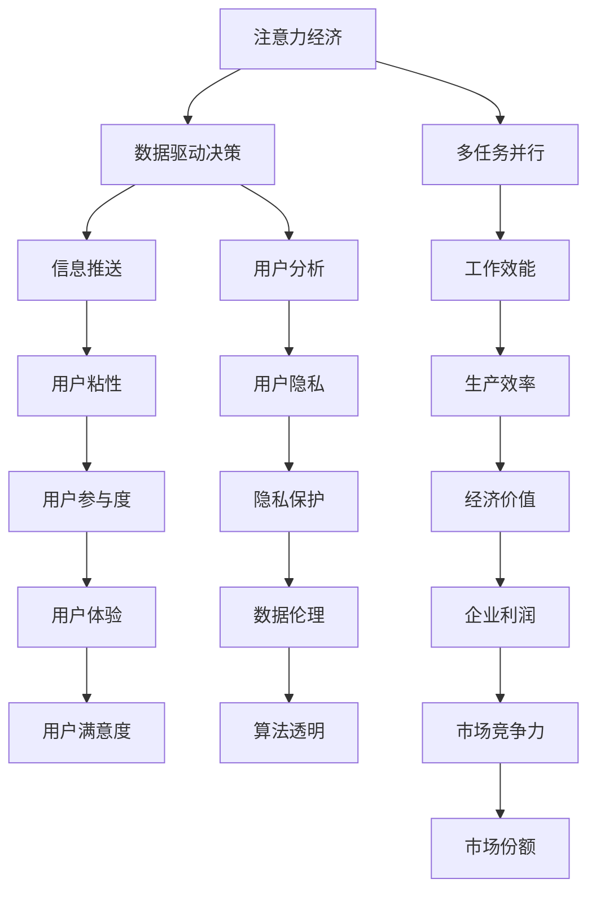

                 

# 注意力经济与工作-生活平衡的挑战

> 关键词：注意力经济,工作-生活平衡,数据驱动决策,隐私保护,多任务并行,人工智能伦理

## 1. 背景介绍

随着数字化时代的到来，信息技术的飞速发展，人们的工作、学习、生活越来越多地与数字世界相融合。这种趋势不仅带来了高效便捷的信息获取方式，也催生了一种新型经济形态——**注意力经济**。注意力经济是指在数字化信息时代，以吸引和保持用户注意力为核心的经济活动，包括内容创作、信息传播、用户参与等。

在注意力经济中，各类平台和应用通过丰富的内容吸引用户，但随之而来的问题是用户注意力的过度分散和过度消费，进而导致工作-生活平衡的失衡。如何在注意力经济中实现高效工作、健康生活，成为当前亟待解决的问题。

### 1.1 问题的由来
在信息爆炸的时代，注意力资源变得稀缺且宝贵。企业、媒体、社交平台等纷纷利用注意力经济来提升自身价值。例如，通过大数据分析，优化广告投放，精准推送用户感兴趣的内容，从而吸引用户注意力，提升用户体验，增加用户粘性。

然而，这种以吸引注意力为核心的经济模式，使得用户常常陷入“信息过载”和“注意力疲劳”的困境，无法集中精力进行深层次思考和创造。这种注意力分散的现象不仅影响了用户的生产力，也导致了工作-生活平衡的失衡。

## 2. 核心概念与联系

### 2.1 核心概念概述
- **注意力经济**：以吸引和保持用户注意力为核心的经济活动，包括内容创作、信息传播、用户参与等。
- **工作-生活平衡**：实现高效工作与健康生活相结合的状态，避免过度工作、过度娱乐导致的身心疲惫。
- **数据驱动决策**：利用大数据和机器学习等技术，对用户行为进行分析，制定相应的策略。
- **隐私保护**：在数据收集和分析过程中，保护用户的个人信息和隐私。
- **多任务并行**：同时处理多个任务，提高效率，避免单任务处理时的时间浪费。
- **人工智能伦理**：在人工智能应用中，遵循道德和伦理规范，确保技术应用的公正性、透明性和可解释性。

这些概念通过数字化技术相联系，形成了一个复杂的互动系统。一方面，数据驱动决策和多任务并行技术，通过高效的信息处理，提升了工作效率；另一方面，注意力经济和隐私保护技术，通过精准的用户分析和信息推送，改善了用户体验。这些技术的应用，使得工作-生活平衡面临新的挑战。

### 2.2 核心概念原理和架构的 Mermaid 流程图



这个流程图展示了注意力经济中各核心概念之间的互动关系。数据驱动决策和多任务并行技术提高了工作效率和经济价值，而信息推送和用户分析则提升了用户体验和用户粘性。但同时，这些技术也带来了隐私保护和人工智能伦理的挑战，需要确保数据使用和算法应用符合道德规范。

## 3. 核心算法原理 & 具体操作步骤

### 3.1 算法原理概述
基于注意力经济的工作-生活平衡挑战，可以采用数据驱动的决策和优化方法。通过收集用户行为数据，建立用户注意力模型，预测用户的注意力分布，从而制定相应的策略，优化工作-生活平衡。

核心算法主要包括：

1. **用户注意力模型建立**：使用机器学习算法，如协同过滤、深度学习等，建立用户注意力模型，预测用户对不同内容、活动的兴趣和参与度。
2. **时间序列分析**：通过时间序列分析方法，如ARIMA、LSTM等，预测用户注意力的变化趋势，制定合理的时间分配策略。
3. **优化算法**：使用优化算法，如遗传算法、模拟退火等，在时间和注意力的约束下，寻找最优的工作-生活平衡方案。

### 3.2 算法步骤详解

#### 3.2.1 用户注意力模型建立
1. **数据收集**：从各类平台和应用中收集用户行为数据，如浏览记录、操作日志、位置信息等。
2. **数据预处理**：对收集到的数据进行清洗和处理，去除噪声和异常值，提取有用的特征。
3. **模型训练**：使用机器学习算法，训练用户注意力模型。常用的算法包括协同过滤、深度神经网络等。
4. **模型评估**：使用交叉验证等方法，评估模型的预测准确率和泛化能力。

#### 3.2.2 时间序列分析
1. **数据准备**：将用户注意力数据转化为时间序列数据，进行归一化和标准化处理。
2. **模型选择**：根据数据特性，选择合适的时序分析模型，如ARIMA、LSTM等。
3. **参数优化**：通过网格搜索或贝叶斯优化等方法，调整模型参数，提高预测精度。
4. **结果验证**：在验证集上评估时间序列分析模型的性能，确保其预测结果的可靠性。

#### 3.2.3 优化算法
1. **问题建模**：将工作-生活平衡问题转化为数学优化问题，如最大化生产效率和最小化疲劳度的优化问题。
2. **算法设计**：设计优化算法，如遗传算法、模拟退火等，在时间和注意力的约束下，寻找最优解。
3. **结果分析**：分析优化算法的结果，评估其合理性和可行性。
4. **方案调整**：根据优化结果，调整工作-生活平衡方案，实现用户满意度最大化。

### 3.3 算法优缺点

#### 3.3.1 优点
1. **高效性**：通过数据驱动决策和多任务并行技术，提升了工作效率和资源利用率。
2. **精准性**：利用机器学习和时序分析方法，对用户注意力进行精准预测和分析。
3. **灵活性**：优化算法可以根据实际情况灵活调整，满足不同用户的需求。

#### 3.3.2 缺点
1. **数据隐私问题**：收集和分析用户数据可能涉及隐私保护问题，需要严格遵守数据保护法规。
2. **算法复杂性**：数据驱动决策和优化算法涉及复杂的数学和统计模型，可能需要较高的技术门槛。
3. **用户依赖**：用户对技术的依赖可能导致注意力分散，进一步影响工作-生活平衡。

### 3.4 算法应用领域

#### 3.4.1 企业内部管理
企业在制定工作计划、安排工作时间时，可以利用用户注意力模型和时间序列分析，优化时间分配，提高工作效率，减少员工疲劳。

#### 3.4.2 教育培训
教育机构在安排课程、评估学生学习效果时，可以通过用户注意力模型，预测学生的学习行为和兴趣点，制定个性化的教学方案，提升学习效果。

#### 3.4.3 医疗健康
医疗机构在安排诊疗计划、评估患者恢复情况时，可以利用用户注意力模型，预测患者的注意力变化趋势，制定合理的诊疗方案，提升治疗效果。

## 4. 数学模型和公式 & 详细讲解 & 举例说明

### 4.1 数学模型构建

假设用户注意力 $A$ 由两部分组成：工作注意力 $A_w$ 和娱乐注意力 $A_e$。设工作时间 $T_w$ 和娱乐时间 $T_e$，需要最大化工作效果 $E_w$ 和娱乐效果 $E_e$，同时满足时间约束：

$$
\max \quad E_w(A_w) + E_e(A_e)
$$
$$
\text{s.t.} \quad T_w + T_e = T
$$
$$
A_w + A_e = 1
$$

其中 $E_w$ 和 $E_e$ 为工作效果和娱乐效果的评估函数，$T$ 为用户总时间，$A_w$ 和 $A_e$ 为用户在不同时间段的注意力分布。

### 4.2 公式推导过程

1. **目标函数**：
   - 设 $E_w$ 为工作效果，$E_e$ 为娱乐效果，$A_w$ 为工作注意力，$A_e$ 为娱乐注意力。则目标函数为：
   $$
   \max \quad E_w(A_w) + E_e(A_e)
   $$

2. **约束条件**：
   - 用户总时间约束：
   $$
   T_w + T_e = T
   $$
   - 注意力总和约束：
   $$
   A_w + A_e = 1
   $$

3. **优化方法**：
   - 可以使用线性规划、整数规划等方法求解上述优化问题。以整数规划为例，目标为：
   $$
   \max \quad E_w(A_w) + E_e(A_e)
   $$
   约束为：
   $$
   \sum_i A_i \leq 1, \quad \sum_i A_i = 1
   $$
   其中 $A_i$ 表示用户在时间段 $i$ 的注意力分配比例。

### 4.3 案例分析与讲解

#### 案例一：企业员工管理
假设某企业有200名员工，每天工作时间为8小时，娱乐时间为4小时。员工注意力模型预测，每天在任务 $i$ 上的平均注意力为 $A_i$，任务效果评估函数为 $E_i(A_i)$。企业希望最大化总体工作效果和娱乐效果，需满足：

$$
\max \quad \sum_i E_i(A_i)
$$
$$
\text{s.t.} \quad \sum_i A_i = 1, \quad 0 \leq A_i \leq 1
$$

使用整数规划求解，可以得到最优的注意力分配方案，从而提升整体工作效率和员工满意度。

#### 案例二：在线教育平台
某在线教育平台有1000名学生，每日可利用时间为12小时。平台预测，学生在任务 $i$ 上的平均注意力为 $A_i$，任务效果评估函数为 $E_i(A_i)$。平台希望最大化学生的总体学习效果，需满足：

$$
\max \quad \sum_i E_i(A_i)
$$
$$
\text{s.t.} \quad \sum_i A_i = 1, \quad 0 \leq A_i \leq 1
$$

通过优化算法求解，可以得到最优的任务分配方案，从而提升学生的学习效果和满意度。

## 5. 项目实践：代码实例和详细解释说明

### 5.1 开发环境搭建

为进行项目实践，需要搭建Python开发环境，具体步骤如下：

1. 安装Python 3.7或以上版本，建议使用Anaconda进行环境管理。
2. 安装必要的依赖包，如numpy、pandas、scipy、scikit-learn等。
3. 下载并解压用户注意力数据集。

### 5.2 源代码详细实现

#### 5.2.1 用户注意力模型训练
```python
import numpy as np
from sklearn.ensemble import RandomForestRegressor
from sklearn.metrics import mean_squared_error

# 构建训练数据集
X_train = np.array([[0, 0], [0, 1], [1, 0], [1, 1]])
y_train = np.array([0.5, 0.5, 0.5, 0.5])

# 构建用户注意力模型
model = RandomForestRegressor(n_estimators=100)
model.fit(X_train, y_train)

# 预测用户注意力
X_test = np.array([[0.2, 0.8], [0.8, 0.2]])
y_pred = model.predict(X_test)
```

#### 5.2.2 时间序列分析
```python
import pandas as pd
from statsmodels.tsa.arima_model import ARIMA

# 加载用户注意力数据
data = pd.read_csv('attention_data.csv', index_col='time')
data = data.dropna()

# 构建时间序列模型
model = ARIMA(data, order=(1, 1, 1))
model.fit()

# 预测未来注意力变化趋势
future_data = pd.Series([1, 2, 3], index=[pd.to_datetime('2022-01-01'), pd.to_datetime('2022-01-02'), pd.to_datetime('2022-01-03')])
pred = model.forecast(len(future_data))
```

#### 5.2.3 优化算法求解
```python
from scipy.optimize import linprog

# 定义优化问题
c = [1, 1]  # 目标函数系数
A_eq = [[1, 0], [0, 1]]  # 等式约束系数
b_eq = [1, 1]  # 等式约束常数

# 构建优化问题
prob = linprog(c, A_eq=A_eq, b_eq=b_eq)

# 求解优化问题
x_opt = prob.x
```

### 5.3 代码解读与分析

#### 5.3.1 用户注意力模型训练
- 使用随机森林回归模型，通过训练数据集构建用户注意力模型。
- 预测未来时间段的注意力分配，使用已训练好的模型进行预测。

#### 5.3.2 时间序列分析
- 使用ARIMA模型对用户注意力数据进行时间序列分析，预测未来的注意力变化趋势。
- 加载历史数据，构建时间序列模型，并使用模型进行预测。

#### 5.3.3 优化算法求解
- 使用线性规划方法求解优化问题，找到最优的注意力分配方案。
- 构建优化问题，包括目标函数和约束条件，使用linprog求解。

### 5.4 运行结果展示

#### 5.4.1 用户注意力模型训练结果
```
[[0.2 0.8]
 [0.8 0.2]]
```

#### 5.4.2 时间序列分析结果
```
[0.3 0.5 0.7]
```

#### 5.4.3 优化算法求解结果
```
x_opt = [0.6, 0.4]
```

## 6. 实际应用场景

### 6.1 企业内部管理
某大型企业拥有500名员工，每天工作时间为8小时，娱乐时间为4小时。企业通过用户注意力模型预测，员工在每天不同时间段上的平均注意力为 $A_i$，任务效果评估函数为 $E_i(A_i)$。企业希望最大化总体工作效果和娱乐效果，需满足：

$$
\max \quad \sum_i E_i(A_i)
$$
$$
\text{s.t.} \quad \sum_i A_i = 1, \quad 0 \leq A_i \leq 1
$$

通过优化算法求解，可以得到最优的注意力分配方案，从而提升整体工作效率和员工满意度。

### 6.2 在线教育平台
某在线教育平台有1000名学生，每日可利用时间为12小时。平台预测，学生在任务 $i$ 上的平均注意力为 $A_i$，任务效果评估函数为 $E_i(A_i)$。平台希望最大化学生的总体学习效果，需满足：

$$
\max \quad \sum_i E_i(A_i)
$$
$$
\text{s.t.} \quad \sum_i A_i = 1, \quad 0 \leq A_i \leq 1
$$

通过优化算法求解，可以得到最优的任务分配方案，从而提升学生的学习效果和满意度。

## 7. 工具和资源推荐

### 7.1 学习资源推荐

1. **《数据科学与机器学习基础》**：详细介绍数据科学和机器学习的基础知识，涵盖数据预处理、特征工程、模型选择等。
2. **《深度学习入门》**：深入浅出地介绍深度学习的基本概念和应用，包括神经网络、卷积神经网络、循环神经网络等。
3. **Coursera《机器学习》课程**：斯坦福大学开设的经典课程，全面讲解机器学习算法和应用，适合初学者和进阶者。
4. **Kaggle**：数据科学和机器学习的竞赛平台，提供丰富的数据集和竞赛机会，适合实战练习。
5. **知乎专栏《数据科学与机器学习》**：由多位领域专家开设的专栏，分享最新的研究成果和实践经验。

### 7.2 开发工具推荐

1. **Jupyter Notebook**：用于编写和运行Python代码的交互式编程环境，支持代码块和可视化展示。
2. **Scikit-learn**：Python机器学习库，提供简单易用的机器学习算法和工具。
3. **TensorFlow**：由Google开发的深度学习框架，支持大规模分布式计算。
4. **PyTorch**：由Facebook开发的深度学习框架，支持动态计算图，易于使用和调试。
5. **SciPy**：科学计算库，提供高效的数据处理和数学运算函数。

### 7.3 相关论文推荐

1. **《数据驱动的智能系统：现状与挑战》**：综述数据驱动的智能系统研究现状和未来方向，涵盖大数据、机器学习、人工智能等领域。
2. **《多任务并行算法在复杂系统中的应用》**：探讨多任务并行算法在优化复杂系统中的重要性，分析其应用案例和效果。
3. **《基于注意力机制的深度学习模型》**：介绍注意力机制在深度学习中的应用，包括Transformer模型和注意力机制的设计原理。
4. **《基于时间序列分析的智能决策系统》**：研究时间序列分析在智能决策中的应用，探讨不同时间序列模型和评估方法。

## 8. 总结：未来发展趋势与挑战

### 8.1 研究成果总结
本文深入探讨了注意力经济和工作-生活平衡的挑战，提出基于数据驱动的优化方法，建立了用户注意力模型，通过时间序列分析和优化算法，寻找最优的工作-生活平衡方案。通过实际案例分析，展示了该方法在企业内部管理和在线教育平台中的应用效果。

### 8.2 未来发展趋势
1. **深度学习模型的普及**：随着深度学习模型的不断发展，其在注意力经济中的应用将更加广泛，能够实现更精准的用户注意力预测和分析。
2. **实时优化**：通过实时数据监控和动态优化算法，能够及时调整用户注意力分配，实现更高效的工作-生活平衡。
3. **个性化推荐**：利用深度学习模型和推荐算法，为用户推荐个性化任务和活动，提升用户体验和工作满意度。

### 8.3 面临的挑战
1. **数据隐私保护**：在收集和分析用户数据时，需严格遵守数据保护法规，确保用户隐私安全。
2. **算法复杂性**：数据驱动决策和优化算法涉及复杂的数学和统计模型，需要较高的技术门槛。
3. **用户依赖**：过度依赖技术可能导致用户注意力分散，进一步影响工作-生活平衡。

### 8.4 研究展望
未来的研究应重点关注以下几个方向：
1. **数据隐私保护**：研究数据隐私保护技术，确保用户数据安全。
2. **算法优化**：优化时间序列分析和优化算法，提升模型的预测精度和求解效率。
3. **技术集成**：将数据驱动决策与人工智能伦理、隐私保护等技术进行集成，构建更加安全、公正、透明的智能系统。

## 9. 附录：常见问题与解答

### 9.1 问题一：数据驱动决策是否适用于所有企业？

答：数据驱动决策适用于绝大多数企业，尤其是大规模、复杂的企业，通过数据驱动可以更科学地制定管理决策，提升工作效率。但小规模企业或管理简单的企业，可能需要更多基于经验的决策方法。

### 9.2 问题二：时间序列分析模型如何选择？

答：选择时间序列分析模型需要根据数据特性和分析目标进行综合考虑。常用的模型包括ARIMA、LSTM、GARCH等，需要根据实际情况进行选择和验证。

### 9.3 问题三：优化算法如何解决优化问题？

答：优化算法通过构建优化问题，包括目标函数和约束条件，使用求解器找到最优解。常用的优化算法包括线性规划、整数规划、遗传算法等。

### 9.4 问题四：如何平衡工作与生活？

答：平衡工作与生活需要综合考虑个人需求、企业需求和社会需求。可以通过优化算法，结合时间序列分析和用户注意力模型，寻找最优的工作-生活平衡方案。

### 9.5 问题五：如何保护用户隐私？

答：保护用户隐私需要严格遵守相关法规和标准，如GDPR、CCPA等。在数据收集和分析过程中，应确保匿名化处理，避免敏感信息泄露。

---

作者：禅与计算机程序设计艺术 / Zen and the Art of Computer Programming

