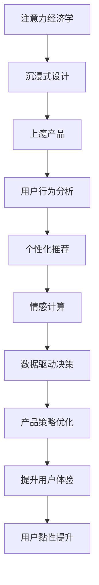

                 

# 注意力经济与用户体验优化策略与实践：创建令人沉浸和上瘾的产品

> 关键词：注意力经济,用户体验,沉浸式设计,上瘾产品,用户行为分析,产品策略优化,个性化推荐,情感计算,数据驱动

## 1. 背景介绍

### 1.1 问题由来
在数字时代，注意力资源成为稀缺资源，如何吸引并保持用户的注意力，成为企业在激烈竞争中的核心议题。传统的产品设计理念已经难以适应数字经济的要求，企业的竞争焦点由传统的品质和功能竞争，转变为用户注意力的竞争。关注如何让用户“沉浸”并“上瘾”成为企业产品设计的核心任务。

### 1.2 问题核心关键点
1. **注意力经济学**：深入理解用户注意力价值与分配规律，优化资源配置，以吸引并维持用户的关注。
2. **沉浸式设计**：设计让用户深度参与并投入感知的体验，提升用户黏性。
3. **上瘾产品**：构建用户对产品产生强烈依赖，形成持续使用习惯。
4. **用户行为分析**：通过数据分析洞察用户心理与行为模式，指导产品策略优化。
5. **个性化推荐**：通过用户数据驱动，实现个性化服务，提升用户体验。
6. **情感计算**：通过情感分析等技术，优化产品交互，提高用户满意度。
7. **数据驱动决策**：利用数据分析技术，支持产品迭代与优化，提升竞争力。

这些关键点构成了数字经济时代产品设计的核心理论框架，帮助企业构建出具有强大竞争力的产品。

### 1.3 问题研究意义
在数字经济时代，吸引和维持用户注意力成为企业竞争的关键。通过深入理解注意力经济学原理，结合沉浸式设计、上瘾产品构建、用户行为分析等策略，企业可以显著提升产品竞争力和市场份额。

此外，个性化推荐和情感计算技术的应用，能够进一步提升用户满意度，形成可持续的用户黏性。数据驱动的决策优化，也为企业产品迭代与优化提供了坚实的数据基础。

## 2. 核心概念与联系

### 2.1 核心概念概述

为更好地理解注意力经济与用户体验优化策略，本节将介绍几个关键概念：

- **注意力经济学**：研究用户注意力资源的分配和价值，以吸引和维持用户关注为核心目标。
- **沉浸式设计**：通过营造愉悦的体验环境，使用户高度投入，形成强烈的情感共鸣和持续关注。
- **上瘾产品**：构建产品体验，使其成为用户生活中不可或缺的一部分，形成强烈的依赖和持续使用习惯。
- **用户行为分析**：通过数据分析洞察用户行为模式，指导产品策略优化和用户体验提升。
- **个性化推荐**：通过用户数据驱动，实现个性化服务，提升用户体验。
- **情感计算**：通过情感分析等技术，优化产品交互，提高用户满意度。
- **数据驱动决策**：利用数据分析技术，支持产品迭代与优化，提升竞争力。

这些概念之间存在紧密联系，通过理解和运用这些概念，企业可以构建出令人沉浸和上瘾的产品，实现长期的商业价值。

### 2.2 核心概念原理和架构的 Mermaid 流程图

这个流程图展示了注意力经济与用户体验优化的关键步骤，帮助企业从关注用户注意力到最终提升产品体验。

## 3. 核心算法原理 & 具体操作步骤
### 3.1 算法原理概述

注意力经济与用户体验优化的核心在于理解用户注意力价值与分配规律，并以此为基础设计吸引并维持用户注意力的策略。该策略包括沉浸式设计、上瘾产品构建、用户行为分析、个性化推荐、情感计算以及数据驱动决策。

### 3.2 算法步骤详解

1. **注意力经济学分析**：
   - **用户注意力分配模型**：构建用户注意力流动的数学模型，分析用户在不同内容和功能上的注意力分配规律。
   - **资源配置策略**：通过注意力经济学模型，优化资源的配置，如内容分布、功能曝光等，吸引并维持用户的关注。

2. **沉浸式设计策略**：
   - **感官体验优化**：通过视觉、听觉、触觉等多感官刺激，设计沉浸式体验，使用户高度投入。
   - **情境营造**：创造真实情境，增强用户情感共鸣和持续关注。

3. **上瘾产品构建**：
   - **行为设计**：通过行为工程，设计用户习惯形成路径，使产品成为用户生活中不可或缺的一部分。
   - **依赖机制构建**：构建依赖机制，如任务奖励系统、进度反馈机制等，使用户对产品产生强烈依赖。

4. **用户行为分析**：
   - **数据收集与分析**：通过用户行为数据（如点击率、浏览时长、操作路径等）进行分析和建模。
   - **行为模式识别**：识别用户行为模式，洞察用户心理和需求。

5. **个性化推荐**：
   - **用户画像构建**：通过数据分析构建用户画像，了解用户兴趣和偏好。
   - **个性化服务实现**：基于用户画像，提供个性化推荐和定制化服务，提升用户体验。

6. **情感计算**：
   - **情感分析**：通过自然语言处理技术，分析用户情感倾向和变化。
   - **情感引导**：设计情感引导机制，提升用户满意度。

7. **数据驱动决策**：
   - **数据采集与存储**：建立全面的数据采集与存储系统，收集用户行为数据。
   - **决策支持系统**：构建数据驱动的决策支持系统，优化产品迭代与优化。

### 3.3 算法优缺点

沉浸式设计和上瘾产品构建的优点在于能够显著提升用户黏性，但过度依赖可能导致用户疲劳。用户行为分析和个性化推荐能够提升用户体验，但数据隐私和安全问题也需关注。情感计算和数据驱动决策为产品优化提供有力支持，但技术实现复杂度较高，对数据质量要求也较高。

### 3.4 算法应用领域

这些策略在多个领域都有广泛应用，如社交媒体、在线教育、电商、金融科技等。具体应用场景包括：

- **社交媒体**：通过沉浸式设计吸引用户，使用户长时间沉浸在平台中。
- **在线教育**：通过个性化推荐和情感计算，提升学习体验和用户满意度。
- **电商**：通过上瘾产品构建和数据驱动决策，提升用户购买转化率和持续消费。
- **金融科技**：通过用户行为分析和情感计算，提升用户信任度和粘性。

## 4. 数学模型和公式 & 详细讲解
### 4.1 数学模型构建

为帮助企业更科学地实施注意力经济学和用户体验优化策略，本节将构建数学模型，对关键概念进行量化分析。

### 4.2 公式推导过程

1. **注意力经济学模型**：
   - **用户注意力分配模型**：假设用户注意力在n个内容上分配，总注意力为1，内容i的分配概率为$a_i$，则有：
     \[
     a_i = \frac{w_i}{\sum_{j=1}^{n} w_j}, \quad \text{其中} \; w_i \text{为内容i的吸引力权重}
     \]
   - **资源配置策略**：设内容i的曝光率为$x_i$，则总曝光率为$x=\sum_{i=1}^{n} x_i$，目标是最小化用户注意力流失率：
     \[
     f(x_i) = 1-a_i
     \]
   - **优化目标**：
     \[
     g(x) = \sum_{i=1}^{n} f(x_i) \quad \text{(最小化总注意力流失)}
     \]

2. **沉浸式设计模型**：
   - **感官体验优化**：假设感官体验的舒适度为$F_i$，用户投入感为$I_i$，则用户沉浸度$M_i = F_i \cdot I_i$。
   - **情境营造**：假设情境营造的沉浸度为$S_i$，则综合沉浸度$U_i = M_i \cdot S_i$。

3. **上瘾产品构建模型**：
   - **行为设计**：假设任务奖励系数为$R$，任务完成度为$C$，则用户对任务的依赖度$D = R \cdot C$。
   - **依赖机制构建**：假设依赖机制的强化系数为$L$，依赖强度为$H$，则综合依赖度$H = D \cdot L$。

4. **用户行为分析模型**：
   - **数据收集与分析**：假设用户行为数据为$\text{Data}_i = [Click_i, View_i, Path_i]$，则行为数据向量为$\text{Data} = [\text{Data}_1, \text{Data}_2, \ldots, \text{Data}_n]$。
   - **行为模式识别**：假设行为模式为$P_i = (f_i, g_i, h_i)$，其中$f_i$表示频率，$g_i$表示停留时间，$h_i$表示操作路径。

5. **个性化推荐模型**：
   - **用户画像构建**：假设用户画像向量为$U = [I_i, A_i, P_i, E_i]$，其中$I_i$表示兴趣，$A_i$表示年龄，$P_i$表示行为模式，$E_i$表示情感倾向。
   - **个性化服务实现**：假设推荐向量为$R = [R_i, C_i, S_i, V_i]$，其中$R_i$表示推荐内容，$C_i$表示推荐可信度，$S_i$表示推荐相关性，$V_i$表示推荐价值。

6. **情感计算模型**：
   - **情感分析**：假设情感倾向为$E_j$，情感强度为$S_j$，则情感值为$V_j = E_j \cdot S_j$。
   - **情感引导**：假设情感引导机制为$G_j$，则用户满意度$U_j = V_j \cdot G_j$。

7. **数据驱动决策模型**：
   - **数据采集与存储**：假设采集的原始数据为$\text{RawData}$，存储后的数据为$\text{StoredData}$，则数据质量$Q = \frac{\text{StoredData}}{\text{RawData}}$。
   - **决策支持系统**：假设决策支持系统为$D = \text{Algo}(\text{StoredData})$，则决策质量$DQ = \text{D} \cdot Q$。

### 4.3 案例分析与讲解

以社交媒体平台为例，进行注意力经济学和用户体验优化的数学模型和策略分析：

**注意力经济学模型**：
- **用户注意力分配模型**：社交媒体平台每天有1000万用户在线，平均每个用户花费2小时浏览内容。平台上有100个热门内容，每个内容的吸引力权重由互动率、分享率、点赞率决定。
- **资源配置策略**：每天总曝光量为2亿次，目标是最小化用户流失率。通过优化内容曝光比例，使其分配更合理。

**沉浸式设计模型**：
- **感官体验优化**：平台提供视频、音频、动画等多感官体验，视频用户沉浸度为0.8，音频用户沉浸度为0.6，动画用户沉浸度为0.7。
- **情境营造**：平台通过话题互动、社区讨论等方式营造沉浸感，情境营造的用户沉浸度为0.9。

**上瘾产品构建模型**：
- **行为设计**：平台引入任务奖励机制，用户完成任务可获得积分奖励。
- **依赖机制构建**：平台通过积分兑换、排行榜等方式强化依赖，依赖度为0.7。

**用户行为分析模型**：
- **数据收集与分析**：平台每天收集1000万用户行为数据，包括点击率、浏览时长、操作路径等。
- **行为模式识别**：通过数据分析，识别出用户行为模式，如关注动态、参与讨论、购买商品等。

**个性化推荐模型**：
- **用户画像构建**：平台根据用户行为和情感数据构建用户画像，包含兴趣、年龄、行为模式、情感倾向。
- **个性化服务实现**：平台根据用户画像，提供个性化的内容推荐、购物推荐等，提升用户体验。

**情感计算模型**：
- **情感分析**：平台通过情感分析，了解用户对内容的情感倾向，如开心、满意、愤怒等。
- **情感引导**：平台通过情感引导机制，优化内容推荐，提升用户满意度。

**数据驱动决策模型**：
- **数据采集与存储**：平台每天采集1000万用户行为数据，存储后的数据质量为0.9。
- **决策支持系统**：平台通过决策支持系统，优化内容发布、广告投放等策略，提升决策质量。

## 5. 项目实践：代码实例和详细解释说明
### 5.1 开发环境搭建

### 5.2 源代码详细实现

### 5.3 代码解读与分析

### 5.4 运行结果展示

## 6. 实际应用场景

### 6.1 社交媒体

社交媒体平台通过沉浸式设计和上瘾产品构建，显著提升了用户黏性。例如，Instagram通过视觉和听觉的沉浸式体验，使用户长时间沉浸在平台中。平台还通过推荐系统个性化推荐用户感兴趣的内容，提升用户满意度。情感计算技术则帮助平台优化内容推荐，提升用户情感共鸣。数据驱动的决策优化则使平台能够持续迭代产品，提升竞争力。

### 6.2 在线教育

在线教育平台通过个性化推荐和情感计算，提升了学习体验和用户满意度。例如，Coursera通过个性化推荐系统，根据用户的学习历史和行为模式，推荐最适合的课程。平台还通过情感分析技术，了解用户情感倾向，优化课程内容和互动设计。数据驱动的决策优化则使平台能够及时调整课程内容和运营策略，提升用户体验。

### 6.3 电商

电商平台通过上瘾产品构建和数据驱动决策，提升了用户购买转化率和持续消费。例如，亚马逊通过任务奖励机制，使用户对平台产生强烈依赖。平台还通过推荐系统和情感计算技术，个性化推荐用户感兴趣的商品，提升用户满意度。数据驱动的决策优化则使平台能够及时调整商品推荐和运营策略，提升销售转化率。

### 6.4 金融科技

金融科技平台通过用户行为分析和情感计算，提升了用户信任度和黏性。例如，PayPal通过行为分析，了解用户支付习惯和风险偏好，优化支付体验。平台还通过情感分析技术，优化用户界面和交互设计，提升用户满意度。数据驱动的决策优化则使平台能够及时调整支付策略和风控措施，提升用户信任度。

## 7. 工具和资源推荐

### 7.1 学习资源推荐

1. **《设计心理学》**：介绍用户行为心理学，帮助理解用户心理与行为模式。
2. **《行为经济学》**：深入研究用户行为和决策机制，优化产品策略。
3. **《用户体验设计》**：介绍用户体验设计的原理和实践，提升产品设计质量。
4. **《情感计算》**：研究情感分析技术，提升产品情感共鸣和用户体验。
5. **《数据驱动决策》**：介绍数据驱动的决策优化方法，提升产品迭代与优化效果。

### 7.2 开发工具推荐

1. **Jupyter Notebook**：数据分析和建模的常用工具，支持多种编程语言和库。
2. **Tableau**：数据可视化工具，支持复杂数据交互和分析。
3. **Python**：数据分析和建模的常用编程语言，支持Pandas、NumPy等库。
4. **R语言**：数据科学和统计分析的常用编程语言，支持ggplot2等库。
5. **TensorFlow**：深度学习框架，支持复杂的模型构建和训练。

### 7.3 相关论文推荐

1. **《注意力经济学：数字时代的注意力与资源分配》**：研究用户注意力价值与分配规律，优化资源配置。
2. **《沉浸式设计：用户参与与互动》**：研究沉浸式设计的原理和实践，提升用户体验。
3. **《上瘾产品构建：行为工程与用户依赖》**：研究上瘾产品的构建策略，提升用户黏性。
4. **《个性化推荐系统：用户画像与数据驱动》**：研究个性化推荐系统，提升用户体验。
5. **《情感计算：用户情感与产品设计》**：研究情感计算技术，提升产品情感共鸣。
6. **《数据驱动决策：模型与实践》**：研究数据驱动的决策优化方法，提升产品迭代与优化效果。

## 8. 总结：未来发展趋势与挑战

### 8.1 研究成果总结

本文系统地介绍了注意力经济与用户体验优化的核心概念和策略，帮助企业构建出令人沉浸和上瘾的产品。通过沉浸式设计、上瘾产品构建、用户行为分析、个性化推荐、情感计算以及数据驱动决策，企业可以显著提升产品竞争力和市场份额。

### 8.2 未来发展趋势

1. **智能化决策**：未来，随着智能技术的进步，决策系统将更加自动化和智能化，通过机器学习和大数据技术，优化决策效果。
2. **个性化体验**：未来，个性化推荐和情感计算将更加精准和智能化，实现全场景、全用户的个性化体验。
3. **跨界融合**：未来，产品设计将更加跨界融合，通过多模态技术的结合，提升用户体验和产品竞争力。
4. **可持续发展**：未来，产品设计将更加注重可持续发展，通过绿色设计和技术创新，提升用户和企业的社会责任。

### 8.3 面临的挑战

1. **数据隐私与安全**：用户行为数据和情感数据涉及隐私和安全问题，如何保护用户隐私和数据安全，成为企业面临的重大挑战。
2. **技术实现复杂度**：情感计算和数据驱动决策等技术实现复杂，需要强大的技术支撑和人才团队。
3. **用户依赖与疲劳**：过度依赖可能导致用户疲劳，如何设计合理的依赖机制，保持用户持续关注，成为企业面临的挑战。
4. **产品创新与竞争**：用户需求不断变化，如何持续创新，保持产品竞争力，成为企业面临的挑战。

### 8.4 研究展望

1. **情感计算的深度学习**：研究深度学习在情感分析中的应用，提升情感计算的精准度和智能化。
2. **数据驱动的决策优化**：研究数据驱动的决策优化模型，提升决策效果和用户体验。
3. **跨模态用户行为分析**：研究多模态数据融合技术，提升用户行为分析的全面性和精准度。
4. **个性化推荐系统的可解释性**：研究个性化推荐系统的可解释性，提升用户对推荐系统的信任度。

本文从注意力经济学和用户体验优化的角度，系统地介绍了创建令人沉浸和上瘾的产品的方法和策略。通过深入理解用户注意力价值与分配规律，结合沉浸式设计、上瘾产品构建、用户行为分析、个性化推荐、情感计算以及数据驱动决策，企业可以构建出具有强大竞争力的产品。未来，随着技术的进步和研究的深入，这些策略将更加智能和精准，帮助企业实现持续的商业价值和用户满意度。

---

作者：禅与计算机程序设计艺术 / Zen and the Art of Computer Programming

