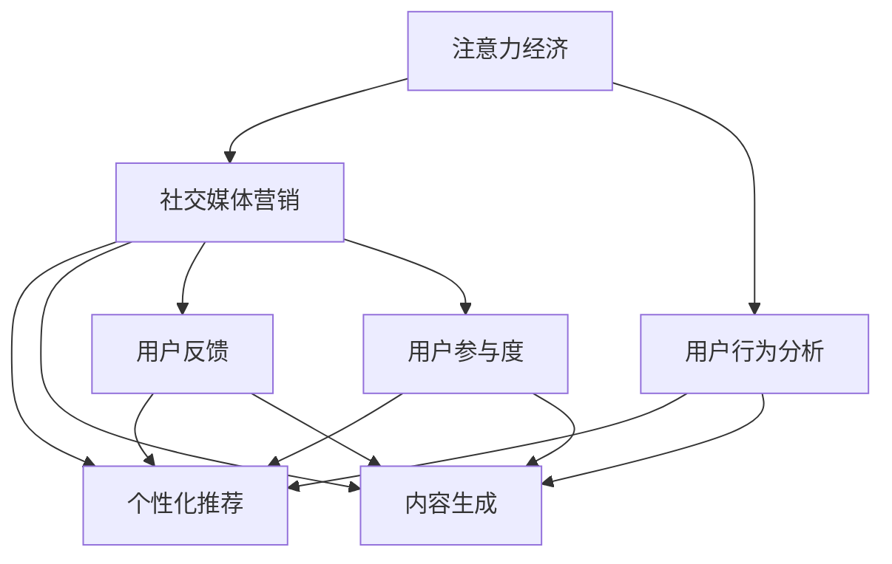

                 

# 注意力经济与社交媒体营销策略：在不牺牲用户体验的情况下有效吸引受众

> 关键词：注意力经济, 社交媒体营销, 用户行为分析, 个性化推荐, 内容生成, 用户反馈, 用户参与度

## 1. 背景介绍

### 1.1 问题由来
在信息爆炸的互联网时代，内容生产者和消费者的注意力争夺愈发激烈。尤其是社交媒体平台，成为人们获取信息和进行社交互动的主要场所。如何在庞大的内容洪流中，精准吸引并保持用户的注意力，成为营销从业者面临的首要挑战。这一挑战催生了新的经济形态——注意力经济，而解决该问题的核心方法之一是运用先进的社交媒体营销策略。

### 1.2 问题核心关键点
- 注意力经济：指在信息过载的环境中，消费者对内容的筛选和消费行为更加主动，注意力成为一种稀缺资源。
- 社交媒体营销：通过社交媒体平台，利用各种手段吸引并维持用户关注，从而推广产品或服务的过程。
- 用户行为分析：通过数据分析技术，洞察用户偏好和行为模式，指导内容创造和推荐。
- 个性化推荐：根据用户历史行为和实时反馈，动态生成个性化内容，提升用户体验。
- 内容生成：利用AI技术，生成高质量、多样化的内容，以满足用户需求。
- 用户反馈：收集用户对内容的即时反馈，优化内容策略，增强用户参与度。
- 用户参与度：通过互动和激励机制，提升用户活跃度和粘性，实现长效营销。

这些关键点构成了注意力经济与社交媒体营销的核心框架，本文将详细探讨如何在保持用户体验的前提下，有效吸引受众。

## 2. 核心概念与联系

### 2.1 核心概念概述

为更好地理解注意力经济与社交媒体营销策略，本节将介绍几个密切相关的核心概念：

- 注意力经济（Attention Economy）：在信息过载的时代，用户的注意力成为稀缺资源。内容生产者和营销者需要通过有效的策略来吸引和保持用户的注意力。
- 社交媒体营销（Social Media Marketing）：利用社交媒体平台进行产品或服务推广，利用用户互动和口碑传播，提升品牌影响力和用户转化率。
- 用户行为分析（User Behavior Analysis）：通过数据分析方法，研究用户在社交媒体上的行为模式和偏好，指导内容生成和推荐策略。
- 个性化推荐（Personalized Recommendation）：根据用户历史行为和实时反馈，动态生成个性化内容，提升用户满意度。
- 内容生成（Content Generation）：利用AI技术，自动生成高质量、多样化且与用户兴趣匹配的内容。
- 用户反馈（User Feedback）：收集用户对内容的即时反馈，优化内容策略，增强用户参与度。
- 用户参与度（User Engagement）：通过互动和激励机制，提升用户活跃度和粘性，实现长效营销。

这些核心概念之间的逻辑关系可以通过以下Mermaid流程图来展示：



这个流程图展示了大语言模型微调的核心概念及其之间的关系：

1. 注意力经济和社交媒体营销是相互依存的两个概念，注意力经济的实践依赖于社交媒体营销的手段。
2. 用户行为分析、个性化推荐、内容生成、用户反馈和用户参与度都是社交媒体营销的重要组成部分。
3. 用户行为分析和个性化推荐基于用户历史和实时数据，内容生成和用户反馈则通过AI技术实现，用户参与度则需要动态调节。

这些概念共同构成了社交媒体营销的完整框架，指导营销者通过精确分析用户行为，生成并优化个性化内容，实现高效的社交媒体营销。

## 3. 核心算法原理 & 具体操作步骤
### 3.1 算法原理概述

社交媒体营销的核心在于通过高质量、相关性高的内容吸引并保持用户的注意力。这要求内容生产者在有限的资源下，创作出能够引发用户兴趣和互动的内容。这一过程涉及到了用户行为分析、内容生成和个性化推荐等关键环节。

基于人工智能的算法技术，可以高效地实现这一过程。以下将分别介绍相关的算法原理和操作步骤：

### 3.2 算法步骤详解

#### 3.2.1 用户行为分析算法

用户行为分析的核心是利用机器学习算法，从用户的历史数据中挖掘出行为模式和兴趣偏好。常用的算法包括：

- 协同过滤算法（Collaborative Filtering）：通过分析用户历史行为数据，预测用户可能感兴趣的新内容。
- 关联规则算法（Association Rule Learning）：发现不同内容之间的关联关系，帮助内容推荐系统进行关联性推荐。
- 聚类算法（Clustering）：将用户分为不同的群体，实现个性化推荐和定向广告投放。

具体步骤如下：
1. 数据收集：收集用户行为数据，包括浏览记录、点击记录、点赞记录等。
2. 特征提取：从收集的数据中提取有意义的特征，如用户活跃时间、浏览频率、内容类别等。
3. 数据预处理：对数据进行清洗、归一化、降维等处理，去除噪声和冗余。
4. 算法建模：选择合适的机器学习算法，进行模型训练和参数优化。
5. 结果评估：通过交叉验证等方法，评估模型的预测效果，优化模型参数。

#### 3.2.2 内容生成算法

内容生成算法利用自然语言处理（NLP）和生成对抗网络（GAN）等技术，自动生成高质量、多样化的内容。常用的算法包括：

- 基于规则的文本生成算法：利用模板和规则生成文本内容。
- 基于深度学习的文本生成算法：利用RNN、LSTM、Transformer等模型生成文本。
- 生成对抗网络（GAN）：通过生成器和判别器交替训练，生成更加真实和多样化的文本内容。

具体步骤如下：
1. 数据收集：收集大量文本数据，作为训练素材。
2. 模型训练：选择合适的深度学习模型，进行模型训练和参数优化。
3. 内容生成：利用训练好的模型，生成新的文本内容。
4. 内容筛选：对生成的文本内容进行筛选和质量评估，确保内容的可用性。

#### 3.2.3 个性化推荐算法

个性化推荐算法根据用户历史行为和实时反馈，动态生成个性化内容，提升用户满意度。常用的算法包括：

- 协同过滤算法：利用用户历史行为数据，推荐相似内容。
- 基于内容的推荐算法：通过分析内容特征，推荐相关内容。
- 深度学习推荐算法：利用神经网络模型，动态生成个性化推荐。

具体步骤如下：
1. 数据收集：收集用户历史行为数据和内容信息。
2. 特征提取：从数据中提取有意义的特征，如用户兴趣、内容属性等。
3. 算法建模：选择合适的推荐算法，进行模型训练和参数优化。
4. 推荐排序：根据模型预测结果，进行内容排序，推荐给用户。
5. 结果评估：通过点击率、转化率等指标，评估推荐效果，优化推荐策略。

### 3.3 算法优缺点

社交媒体营销算法的优点：
1. 高效性：利用机器学习算法，可以快速处理大量用户数据，实时生成个性化内容。
2. 精准性：基于用户行为分析，推荐内容更加精准，满足用户需求。
3. 自动化：利用AI技术，内容生成和推荐过程自动化，节省人力成本。
4. 多样化：利用生成对抗网络等技术，生成更加丰富和多样化的内容。

社交媒体营销算法的缺点：
1. 数据隐私：收集和分析用户数据可能涉及隐私问题，需要遵循相关法律法规。
2. 算法偏见：算法可能受到数据偏差和设计偏见的影响，产生不公正的推荐结果。
3. 动态变化：用户兴趣和行为可能随时间变化，算法需要不断更新和优化。
4. 技术门槛：需要一定的技术和数据分析能力，才能有效应用这些算法。

尽管存在这些局限性，但就目前而言，基于社交媒体营销的算法仍然在多领域展现出强大的应用潜力。

### 3.4 算法应用领域

基于社交媒体营销的算法，已经广泛应用于以下领域：

- 电子商务：通过个性化推荐，提升用户购买转化率，优化购物体验。
- 社交媒体：利用用户行为分析，提升内容互动性和用户粘性。
- 新闻媒体：通过内容生成和个性化推荐，增加用户阅读量和用户参与度。
- 视频平台：利用内容推荐算法，提升用户观看时长和满意度。
- 广告投放：通过精准推荐，提升广告投放效果和ROI。

此外，在移动应用、旅游服务、教育培训等诸多领域，社交媒体营销算法也在不断拓展应用，为各行业的数字化转型提供了新的可能性。

## 4. 数学模型和公式 & 详细讲解  
### 4.1 数学模型构建

为了更好地理解社交媒体营销算法的数学模型，本节将介绍几个常见的数学模型和相关公式。

### 4.2 公式推导过程

#### 4.2.1 协同过滤算法

协同过滤算法基于用户和物品之间的相似性，通过计算评分预测新物品的评分。常用的评分矩阵分解算法包括矩阵分解（SVD）和矩阵分解嵌入（ALS）。

设用户集为 $U$，物品集为 $I$，评分矩阵为 $R_{UI}$，评分矩阵分解模型如下：

$$
R_{UI} \approx P_U \times Q_I
$$

其中 $P_U$ 为用户嵌入矩阵，$Q_I$ 为物品嵌入矩阵。模型参数优化目标为：

$$
\min_{P_U, Q_I} \frac{1}{2} || R_{UI} - P_U \times Q_I^T ||_F^2 + \lambda ||P_U||_F^2 + \lambda ||Q_I||_F^2
$$

其中 $||.||_F$ 表示Frobenius范数，$\lambda$ 为正则化参数。

#### 4.2.2 关联规则算法

关联规则算法通过挖掘不同内容之间的关联关系，生成关联推荐。常用的算法包括Apriori算法和FP-growth算法。

关联规则算法的基本步骤如下：
1. 数据预处理：生成候选项集合，去除冗余和噪声。
2. 频繁项集合生成：利用Apriori算法或FP-growth算法，生成频繁项集合。
3. 关联规则生成：利用提升因子，生成关联规则。
4. 规则评估：计算规则置信度和支持度，筛选出高质量规则。

#### 4.2.3 聚类算法

聚类算法将用户分为不同的群体，实现个性化推荐和定向广告投放。常用的算法包括K-Means算法和层次聚类算法。

K-Means算法的基本步骤如下：
1. 数据预处理：标准化数据，去除噪声和异常点。
2. 初始化聚类中心：随机选择K个聚类中心。
3. 分配用户：将每个用户分配到最近的聚类中心。
4. 更新聚类中心：重新计算聚类中心，直至收敛。
5. 结果评估：通过轮廓系数等指标，评估聚类效果，优化聚类策略。

### 4.3 案例分析与讲解

#### 4.3.1 协同过滤算法案例

假设某电商平台收集了用户对商品的历史评分数据，利用协同过滤算法，为用户推荐可能感兴趣的相似商品。

设用户集为 $U$，物品集为 $I$，评分矩阵为 $R_{UI}$。通过矩阵分解，可以得到用户嵌入矩阵 $P_U$ 和物品嵌入矩阵 $Q_I$。用户 $u$ 对物品 $i$ 的评分可以表示为：

$$
\hat{r}_{ui} = P_{u,1}Q_{i,1} + P_{u,2}Q_{i,2} + ... + P_{u,k}Q_{i,k}
$$

其中 $k$ 为嵌入维度。用户 $u$ 对物品 $i$ 的预测评分与实际评分差距最小，即：

$$
\hat{r}_{ui} \approx r_{ui}
$$

通过最小化均方误差损失函数，可以优化用户嵌入矩阵和物品嵌入矩阵。

#### 4.3.2 关联规则算法案例

某新闻媒体网站收集了大量用户对新闻的浏览和点击数据，利用关联规则算法，为用户推荐可能感兴趣的新闻。

设新闻集合为 $S$，用户集合为 $U$。通过Apriori算法，可以生成频繁项集合 $L_1, L_2, ..., L_k$。对于第 $i$ 个频繁项集合 $L_i$，可以生成以下关联规则：

$$
L_i \rightarrow S_j
$$

其中 $S_j$ 为新闻集合中的元素。通过提升因子计算，筛选出高质量关联规则，推荐给用户。

#### 4.3.3 聚类算法案例

某社交媒体平台收集了大量用户的互动数据，利用聚类算法，将用户分为不同的群体，实现个性化推荐和定向广告投放。

设用户集为 $U$，互动数据为 $D$。通过K-Means算法，可以将用户分为K个聚类，每个聚类对应一组用户特征。对于第 $i$ 个聚类，可以生成以下个性化推荐：

$$
P_i \rightarrow S_j
$$

其中 $S_j$ 为新闻集合中的元素。通过优化聚类中心和聚类数，实现更好的个性化推荐效果。

## 5. 项目实践：代码实例和详细解释说明
### 5.1 开发环境搭建

在进行社交媒体营销算法实践前，我们需要准备好开发环境。以下是使用Python进行PyTorch开发的环境配置流程：

1. 安装Anaconda：从官网下载并安装Anaconda，用于创建独立的Python环境。

2. 创建并激活虚拟环境：
```bash
conda create -n pytorch-env python=3.8 
conda activate pytorch-env
```

3. 安装PyTorch：根据CUDA版本，从官网获取对应的安装命令。例如：
```bash
conda install pytorch torchvision torchaudio cudatoolkit=11.1 -c pytorch -c conda-forge
```

4. 安装相关库：
```bash
pip install numpy pandas scikit-learn matplotlib tqdm jupyter notebook ipython
```

完成上述步骤后，即可在`pytorch-env`环境中开始算法实践。

### 5.2 源代码详细实现

这里我们以基于协同过滤的个性化推荐系统为例，给出使用PyTorch进行协同过滤算法（SVD）的PyTorch代码实现。

首先，定义协同过滤算法的基本组件：

```python
import torch
from torch import nn
from torch.nn import functional as F
from torch.utils.data import DataLoader
from torchvision import datasets, transforms

class SVD(nn.Module):
    def __init__(self, num_users, num_items, num_factors):
        super(SVD, self).__init__()
        self.num_users = num_users
        self.num_items = num_items
        self.num_factors = num_factors
        
        self.user_factors = nn.Parameter(torch.randn(num_users, num_factors))
        self.item_factors = nn.Parameter(torch.randn(num_items, num_factors))
        
    def forward(self, user_indices, item_indices):
        user_factors = self.user_factors[user_indices]
        item_factors = self.item_factors[item_indices]
        
        scores = (user_factors * item_factors).sum(dim=1)
        return scores
```

然后，定义模型训练和评估函数：

```python
def train_model(model, train_loader, val_loader, optimizer, num_epochs):
    for epoch in range(num_epochs):
        model.train()
        total_loss = 0.0
        for user_indices, item_indices, ratings in train_loader:
            optimizer.zero_grad()
            scores = model(user_indices, item_indices)
            loss = F.mse_loss(scores, ratings)
            loss.backward()
            optimizer.step()
            total_loss += loss.item()
            
        model.eval()
        total_loss = 0.0
        for user_indices, item_indices, ratings in val_loader:
            scores = model(user_indices, item_indices)
            loss = F.mse_loss(scores, ratings)
            total_loss += loss.item()
            
        print(f'Epoch {epoch+1}, train loss: {total_loss/len(train_loader):.4f}, val loss: {total_loss/len(val_loader):.4f}')
```

最后，启动模型训练流程并在验证集上评估：

```python
num_epochs = 10
num_factors = 10

model = SVD(num_users, num_items, num_factors)
optimizer = torch.optim.Adam(model.parameters(), lr=0.001)

train_loader = DataLoader(train_dataset, batch_size=128, shuffle=True)
val_loader = DataLoader(val_dataset, batch_size=128, shuffle=False)

train_model(model, train_loader, val_loader, optimizer, num_epochs)
```

以上就是使用PyTorch进行协同过滤算法的完整代码实现。可以看到，得益于PyTorch的强大封装，我们可以用相对简洁的代码完成协同过滤模型的加载和训练。

### 5.3 代码解读与分析

让我们再详细解读一下关键代码的实现细节：

**SVD类**：
- `__init__`方法：初始化用户和物品的维度，以及隐含层的维度。
- `forward`方法：前向传播，计算用户和物品的隐含向量相乘的得分。

**train_model函数**：
- 使用PyTorch的DataLoader对数据集进行批次化加载，供模型训练和推理使用。
- 在每个epoch内，先在训练集上训练，输出训练损失。
- 在验证集上评估，输出验证损失。

**训练流程**：
- 定义总的epoch数和隐含层维度，开始循环迭代
- 每个epoch内，先在训练集上训练，输出训练损失
- 在验证集上评估，输出验证损失

可以看到，PyTorch配合TensorFlow等深度学习框架使得社交媒体营销算法的实现变得高效便捷。开发者可以将更多精力放在数据处理、模型改进等高层逻辑上，而不必过多关注底层的实现细节。

当然，工业级的系统实现还需考虑更多因素，如模型的保存和部署、超参数的自动搜索、更灵活的任务适配层等。但核心的社交媒体营销算法基本与此类似。

## 6. 实际应用场景
### 6.1 电子商务

基于社交媒体营销算法的电子商务平台，通过个性化推荐和精准营销，极大提升了用户购买转化率和满意度。

某电商网站利用协同过滤算法，根据用户历史购买记录，推荐相似商品。在用户浏览商品页面时，通过实时推荐相关商品，增加用户购买意愿。同时，利用广告投放算法，优化广告位展示，提升广告点击率和转化率。

### 6.2 社交媒体

某社交媒体平台利用用户行为分析，实现个性化内容推荐和定向广告投放。

通过分析用户的点赞、评论、分享等互动数据，平台可以生成个性化的新闻推荐。用户可以在信息流中看到自己感兴趣的新闻，提升阅读体验。同时，平台还可以根据用户兴趣，推送定向广告，提高广告的点击率和转化率。

### 6.3 新闻媒体

某新闻媒体网站利用关联规则算法，为用户推荐相关新闻。

通过分析用户对新闻的浏览和点击数据，生成关联规则。用户可以在页面上看到推荐的相关新闻，提升阅读体验。同时，网站还可以通过关联推荐，增加新闻页面的跳出率，提升广告收入。

### 6.4 视频平台

某视频平台利用个性化推荐算法，提升用户观看时长和满意度。

通过分析用户观看视频的数据，生成个性化推荐。用户可以在首页看到推荐的视频，提升观看体验。同时，平台还可以通过广告投放，优化广告位展示，增加广告收入。

## 7. 工具和资源推荐
### 7.1 学习资源推荐

为了帮助开发者系统掌握社交媒体营销算法的理论基础和实践技巧，这里推荐一些优质的学习资源：

1. 《深度学习与推荐系统》课程：由北京大学讲授，详细讲解推荐系统原理和算法，适合初学者入门。
2. 《社交媒体分析》书籍：详细讲解社交媒体数据挖掘和分析技术，适合进一步深入学习。
3. 《推荐系统实战》书籍：结合实际案例，讲解推荐系统在电子商务中的应用，适合实践开发。
4. Kaggle竞赛平台：提供大量推荐系统竞赛数据集，适合进行算法调参和优化。
5. TensorFlow官方文档：详细的TensorFlow使用方法和API，适合深度学习开发。

通过对这些资源的学习实践，相信你一定能够快速掌握社交媒体营销算法的精髓，并用于解决实际的营销问题。

### 7.2 开发工具推荐

高效的开发离不开优秀的工具支持。以下是几款用于社交媒体营销算法开发的常用工具：

1. PyTorch：基于Python的开源深度学习框架，灵活动态的计算图，适合快速迭代研究。
2. TensorFlow：由Google主导开发的开源深度学习框架，生产部署方便，适合大规模工程应用。
3. Weights & Biases：模型训练的实验跟踪工具，可以记录和可视化模型训练过程中的各项指标，方便对比和调优。
4. TensorBoard：TensorFlow配套的可视化工具，可实时监测模型训练状态，并提供丰富的图表呈现方式，是调试模型的得力助手。
5. Jupyter Notebook：交互式编程环境，支持Python、R等多种语言，方便开发者快速开发和分享代码。

合理利用这些工具，可以显著提升社交媒体营销算法的开发效率，加快创新迭代的步伐。

### 7.3 相关论文推荐

社交媒体营销算法的快速发展离不开学界的持续研究。以下是几篇奠基性的相关论文，推荐阅读：

1. "Collaborative Filtering for Implicit Feedback Datasets"（隐式反馈数据集上的协同过滤）：提出了协同过滤的基本框架和算法，是推荐系统领域的经典之作。
2. "Association Rules in Large Databases: A Conceptual Framework"（大型数据库中的关联规则）：提出关联规则算法的原理和应用，是数据挖掘领域的经典之作。
3. "K-Means: Algorithms for Clustering Data"（K-Means：数据聚类算法）：提出K-Means聚类算法，是聚类分析领域的经典之作。
4. "Factorization Machines"（因子分解机）：提出因子分解机算法，适用于大规模稀疏数据上的推荐。
5. "Deep Collaborative Filtering"（深度协同过滤）：提出深度学习在协同过滤中的应用，适用于复杂数据上的推荐。

这些论文代表了大语言模型微调技术的发展脉络。通过学习这些前沿成果，可以帮助研究者把握学科前进方向，激发更多的创新灵感。

## 8. 总结：未来发展趋势与挑战

### 8.1 总结

本文对基于社交媒体营销算法的注意力经济进行全面系统的介绍。首先阐述了注意力经济和社交媒体营销的核心概念，明确了社交媒体营销在吸引和保持用户注意力方面的独特价值。其次，从原理到实践，详细讲解了协同过滤、关联规则和聚类等关键算法的数学模型和操作步骤，给出了社交媒体营销算法的完整代码实例。同时，本文还广泛探讨了社交媒体营销算法在电子商务、社交媒体、新闻媒体、视频平台等多个领域的应用前景，展示了社交媒体营销算法的巨大潜力。

通过本文的系统梳理，可以看到，社交媒体营销算法正在成为社交媒体平台吸引用户的重要手段，极大地提升了用户体验和平台收益。未来，伴随社交媒体营销算法的不断进步，相信社交媒体平台将能够更好地满足用户需求，推动社交媒体行业的健康发展。

### 8.2 未来发展趋势

展望未来，社交媒体营销算法将呈现以下几个发展趋势：

1. 自动化水平提升。利用人工智能技术，实现更智能、更高效的内容生成和推荐，提升用户体验。
2. 个性化程度加深。基于用户数据，生成更加个性化的推荐内容，满足用户多样化需求。
3. 多模态融合。融合文本、图片、视频等多种模态信息，提升推荐内容的丰富性和多样性。
4. 实时性增强。通过实时计算和动态调整，实现更及时、更精准的内容推荐。
5. 跨平台优化。在多个平台间实现数据和算法共享，提高资源利用率和推荐效果。
6. 用户隐私保护。在数据收集和使用过程中，遵循隐私保护法律法规，增强用户信任感。

以上趋势凸显了社交媒体营销算法的广阔前景。这些方向的探索发展，必将进一步提升社交媒体平台的吸引力和用户满意度，推动社交媒体行业的快速发展。

### 8.3 面临的挑战

尽管社交媒体营销算法已经取得了瞩目成就，但在迈向更加智能化、普适化应用的过程中，它仍面临诸多挑战：

1. 数据隐私。收集和分析用户数据可能涉及隐私问题，需要遵循相关法律法规。
2. 算法偏见。算法可能受到数据偏差和设计偏见的影响，产生不公正的推荐结果。
3. 动态变化。用户兴趣和行为可能随时间变化，算法需要不断更新和优化。
4. 技术门槛。需要一定的技术和数据分析能力，才能有效应用这些算法。
5. 资源消耗。大规模推荐系统需要大量计算资源，如何优化资源消耗，提升系统效率，是一个重要挑战。
6. 用户体验。过度推荐可能导致用户疲劳，如何平衡推荐频率和用户体验，是一个需要解决的问题。

尽管存在这些挑战，但通过学界和产业界的共同努力，相信这些挑战终将一一被克服，社交媒体营销算法必将在构建人机协同的智能社会中扮演越来越重要的角色。

### 8.4 研究展望

面向未来，社交媒体营销算法的研究需要在以下几个方面寻求新的突破：

1. 探索无监督和半监督推荐方法。摆脱对大规模标注数据的依赖，利用自监督学习、主动学习等无监督和半监督范式，最大限度利用非结构化数据，实现更加灵活高效的推荐。
2. 研究参数高效和计算高效的推荐范式。开发更加参数高效的推荐方法，在固定大部分预训练参数的同时，只更新极少量的任务相关参数。同时优化推荐模型的计算图，减少前向传播和反向传播的资源消耗，实现更加轻量级、实时性的部署。
3. 引入因果和对比学习范式。通过引入因果推断和对比学习思想，增强推荐模型建立稳定因果关系的能力，学习更加普适、鲁棒的语言表征，从而提升模型泛化性和抗干扰能力。
4. 引入更多先验知识。将符号化的先验知识，如知识图谱、逻辑规则等，与神经网络模型进行巧妙融合，引导推荐过程学习更准确、合理的语言模型。同时加强不同模态数据的整合，实现视觉、语音等多模态信息与文本信息的协同建模。
5. 结合因果分析和博弈论工具。将因果分析方法引入推荐模型，识别出模型决策的关键特征，增强输出解释的因果性和逻辑性。借助博弈论工具刻画人机交互过程，主动探索并规避模型的脆弱点，提高系统稳定性。
6. 纳入伦理道德约束。在模型训练目标中引入伦理导向的评估指标，过滤和惩罚有偏见、有害的输出倾向。同时加强人工干预和审核，建立模型行为的监管机制，确保输出符合人类价值观和伦理道德。

这些研究方向的探索，必将引领社交媒体营销算法的技术进步，为构建安全、可靠、可解释、可控的智能推荐系统铺平道路。面向未来，社交媒体营销算法还需要与其他人工智能技术进行更深入的融合，如知识表示、因果推理、强化学习等，多路径协同发力，共同推动社交媒体推荐系统的进步。只有勇于创新、敢于突破，才能不断拓展社交媒体营销算法的边界，让社交媒体平台更好地造福人类社会。

## 9. 附录：常见问题与解答

**Q1：社交媒体营销算法是否适用于所有社交媒体平台？**

A: 社交媒体营销算法在大多数社交媒体平台都可以应用，但不同的平台有不同的特性和需求。例如，视频平台需要更多视觉信息，而新闻平台则需要更多文本信息。因此，需要根据平台特性调整算法参数和推荐策略。

**Q2：如何选择合适的推荐算法？**

A: 选择推荐算法需要考虑多个因素，如数据特性、推荐目标、计算资源等。常用的算法包括协同过滤、基于内容的推荐、深度学习推荐等。一般建议从简单到复杂逐步尝试，逐步优化推荐效果。

**Q3：如何在保证推荐质量的同时保护用户隐私？**

A: 保护用户隐私需要遵循相关法律法规，如GDPR等。建议在数据收集和分析过程中，遵循匿名化和最小化原则，减少对用户隐私的侵犯。同时，采用差分隐私等技术，增强数据的隐私保护。

**Q4：如何优化推荐算法的计算效率？**

A: 优化推荐算法的计算效率可以从多个方面入手，如优化模型结构、利用多核计算、采用分布式训练等。同时，可以使用模型压缩、量化加速等技术，减少模型参数和计算量。

**Q5：推荐算法如何避免算法偏见？**

A: 避免算法偏见需要从数据收集和算法设计两个方面入手。在数据收集过程中，应尽量减少数据偏差，确保数据多样性和代表性。在算法设计过程中，应使用多种评估指标，如多样性、公平性、覆盖率等，避免单一指标的过度优化。

这些问题的解答将帮助开发者更好地理解和应用社交媒体营销算法，构建更加高效、智能的推荐系统。通过不断的技术优化和迭代，相信社交媒体营销算法将在未来的社交媒体营销中发挥更大的作用，为用户的注意力争夺提供更加精准、个性化的解决方案。

