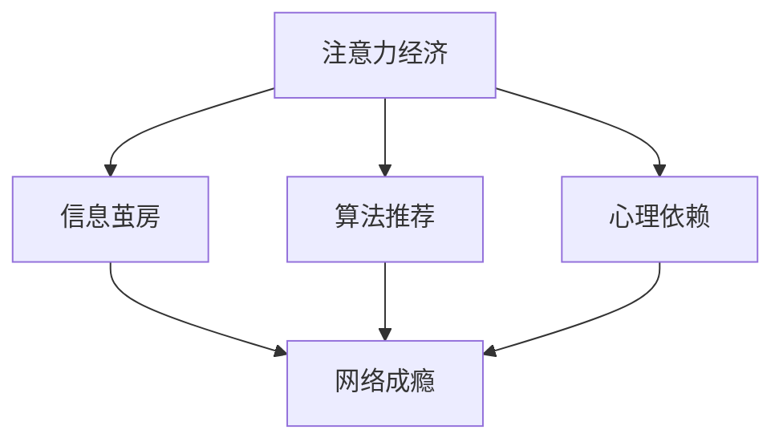

                 

# 注意力经济与网络成瘾的关联

> 关键词：注意力经济, 网络成瘾, 心理依赖, 用户行为, 算法推荐, 健康风险, 数据隐私

## 1. 背景介绍

### 1.1 问题由来

在互联网时代，注意力成为一种稀缺资源，而争夺用户注意力的经济活动也随之兴起。这种基于争夺注意力的经济模式，被称作“注意力经济”。与此同时，互联网和智能设备的高速普及也导致了一个日益严峻的社会问题——网络成瘾。其表现为用户过度依赖网络，无法自主控制上网时间，进而影响日常工作、学习和人际交往，甚至出现心理健康问题。

### 1.2 问题核心关键点

注意力经济与网络成瘾的关系，主要体现在以下几个方面：

- 注意力的经济价值：信息爆炸时代，用户对信息的需求和获取方式发生了根本性变化，使得注意力成为一种重要的经济资源。
- 算法的推荐机制：搜索引擎、社交媒体、视频平台等网站通过算法推荐，精准捕获用户注意力，并转化为广告收益。
- 用户心理依赖：算法推荐系统不断强化用户的“信息茧房”效应，使用户陷入网络循环，难以自拔。
- 数据隐私问题：在争夺用户注意力的过程中，产生了大量用户行为数据，隐私保护和数据安全成为一大挑战。

这些核心关键点揭示了注意力经济与网络成瘾之间的复杂关系，提醒社会各界需共同关注这一问题，并探索有效的解决策略。

### 1.3 问题研究意义

研究注意力经济与网络成瘾的关联，对提升互联网行业的健康发展，维护用户的心理和生理健康具有重要意义：

- 提高互联网企业责任感：在追求商业利益的同时，关注用户心理健康，避免过度消耗用户的注意力资源。
- 引导用户建立健康上网习惯：通过技术手段和政策措施，帮助用户合理规划上网时间，减少对网络的过度依赖。
- 提升数据隐私保护水平：合理利用用户数据，同时保障用户隐私，增强用户信任，形成良性互动。
- 促进社会整体健康发展：减少网络成瘾带来的社会问题，提升社会整体的健康水平。

## 2. 核心概念与联系

### 2.1 核心概念概述

为更好地理解注意力经济与网络成瘾的关联，本节将介绍几个关键概念：

- **注意力经济（Attention Economy）**：基于争夺用户注意力的经济模式。其主要特点是以用户注意力作为稀缺资源，通过吸引和留住用户注意力，转化为经济价值。

- **网络成瘾（Internet Addiction）**：用户对网络产生心理依赖，导致过度上网行为，影响生活和工作，甚至引发健康问题。

- **算法推荐（Recommendation Algorithm）**：通过分析用户行为数据，使用机器学习算法预测用户兴趣，自动推荐相关内容，提升用户使用体验。

- **信息茧房（Information Echo Chamber）**：用户只接触到与其兴趣相关的内容，逐渐形成信息孤岛，难以接触到多元化的信息。

- **心理依赖（Psychological Dependence）**：用户因长期接触特定信息或环境，形成心理上的习惯性依赖，难以脱离。

这些概念之间的联系可以通过以下Mermaid流程图来展示：



这个流程图展示了一些关键概念的相互作用：

1. 注意力经济依赖于算法推荐捕获用户注意力。
2. 算法推荐通过信息茧房和心理依赖，强化用户对网络的需求。
3. 心理依赖和信息茧房共同作用，形成网络成瘾。

## 3. 核心算法原理 & 具体操作步骤
### 3.1 算法原理概述

注意力经济与网络成瘾的关联，主要通过算法推荐系统在用户注意力争夺中的作用体现。算法推荐通过分析用户行为数据，预测其兴趣偏好，自动推荐相关内容，以吸引和留住用户注意力。这一过程不仅是经济价值转化的过程，也深刻影响着用户的心理和行为。

### 3.2 算法步骤详解

算法推荐系统的一般步骤包括：

1. **数据收集与预处理**：收集用户的历史行为数据（如浏览记录、点击率、收藏夹等），并进行清洗和预处理。
2. **特征提取与表示**：将用户行为数据转换为机器学习算法可处理的向量形式。
3. **模型训练与优化**：使用机器学习算法（如协同过滤、深度学习等）训练推荐模型，并不断优化以提高预测准确性。
4. **推荐生成与展示**：根据用户当前行为，生成个性化推荐内容，并通过界面展示给用户。
5. **用户反馈与调整**：收集用户对推荐结果的反馈（如点击率、收藏等），更新推荐模型参数。

在算法推荐系统的实际应用中，还需要结合用户心理和行为特征，进行更精细的设计和优化。

### 3.3 算法优缺点

算法推荐系统具有以下优点：

1. 提升用户满意度：通过个性化推荐，用户更容易找到感兴趣的内容，提升使用体验。
2. 优化经济效率：通过精准推荐，提高了广告和内容的点击率和转化率，优化了经济收益。
3. 分析用户行为：通过收集和分析用户行为数据，挖掘用户兴趣和行为规律，支持深度运营。

但同时，算法推荐系统也存在一些缺点：

1. 信息过载：过多推荐信息可能引发用户信息过载，影响用户体验。
2. 数据隐私：用户行为数据被收集和分析，隐私保护成为一大挑战。
3. 心理依赖：个性化推荐可能强化信息茧房效应，导致心理依赖和网络成瘾。
4. 内容偏见：算法推荐可能加剧内容偏见，影响多元信息获取。

### 3.4 算法应用领域

算法推荐技术在多个领域得到广泛应用，如：

- **内容推荐**：新闻、视频、音乐等平台通过算法推荐，提供个性化内容。
- **广告投放**：搜索引擎、社交媒体等网站通过算法推荐，精准投放广告。
- **用户行为分析**：电商网站通过算法推荐，分析用户购买行为，优化运营策略。
- **智能客服**：在线客服系统通过算法推荐，快速响应用户需求。
- **智慧医疗**：通过推荐系统，推荐个性化诊疗方案，提升医疗服务质量。

这些领域中，算法推荐不仅提升了用户体验和经济效益，同时也对用户心理和行为产生了深远影响。

## 4. 数学模型和公式 & 详细讲解  
### 4.1 数学模型构建

本节将使用数学语言对算法推荐系统进行更加严格的刻画。

记用户集合为 $U$，物品集合为 $I$，用户行为数据为 $\mathcal{D}$，其中每个行为 $d_i$ 包括时间戳 $t_i$、用户 $u_i$ 和物品 $i_i$。设推荐系统为用户 $u_i$ 推荐物品 $i_i$，用户对物品的评分 $r_{u,i}$。

定义推荐系统的损失函数 $\mathcal{L}$，其中 $r_{u,i}$ 为真实评分，$\hat{r}_{u,i}$ 为预测评分，$R$ 为真实评分矩阵。则推荐系统的损失函数可以表示为：

$$
\mathcal{L} = \frac{1}{N} \sum_{i=1}^N \sum_{j=1}^M \left( r_{u_i,i_j} - \hat{r}_{u_i,i_j} \right)^2
$$

其中 $N$ 为训练样本数量，$M$ 为物品数量。

### 4.2 公式推导过程

以下我们以协同过滤算法为例，推导推荐系统的损失函数及其梯度计算公式。

假设推荐系统为每个用户 $u$ 推荐物品 $i$，推荐结果记为 $R_{u,i}$。推荐系统预测用户 $u$ 对物品 $i$ 的评分 $r_{u,i}$ 可以通过用户 $u$ 的历史评分 $\hat{r}_{u,i}$ 和物品 $i$ 的历史评分 $\hat{r}_{i,i'}$ 计算得到：

$$
r_{u,i} = \hat{r}_{u,i} \hat{r}_{i,i'}
$$

其中 $\hat{r}_{u,i}$ 为预测评分，$\hat{r}_{i,i'}$ 为物品相似度，通常使用余弦相似度计算：

$$
\hat{r}_{i,i'} = \frac{\vec{i} \cdot \vec{i'}}{\|\vec{i}\| \|\vec{i'}\|}
$$

其中 $\vec{i}$ 和 $\vec{i'}$ 分别表示物品 $i$ 和 $i'$ 的评分向量。

对于协同过滤算法，推荐系统的损失函数可以表示为：

$$
\mathcal{L} = \frac{1}{N} \sum_{i=1}^N \sum_{j=1}^M \left( r_{u_i,i_j} - \hat{r}_{u_i,i_j} \right)^2
$$

其中 $N$ 为训练样本数量，$M$ 为物品数量。

### 4.3 案例分析与讲解

考虑一个简单的协同过滤推荐系统，假设用户 $u$ 的历史行为为 $\{(u_1,i_1), (u_1,i_2), (u_2,i_3)\}$，物品 $i$ 的历史行为为 $\{(i_1,i_1), (i_1,i_2), (i_2,i_3)\}$，训练样本为 $N=3$，物品数量为 $M=3$。

设用户 $u$ 对物品 $i$ 的真实评分 $r_{u,i}=1$，预测评分为 $\hat{r}_{u,i}=0.5$，物品 $i$ 对物品 $i'$ 的真实评分为 $r_{i,i'}=1$，预测评分为 $\hat{r}_{i,i'}=0.5$。则推荐系统的损失函数可以计算为：

$$
\mathcal{L} = \frac{1}{3} \left( (1 - 0.5 \cdot 1)^2 + (1 - 0.5 \cdot 1)^2 + (1 - 0.5 \cdot 1)^2 \right) = 0.5
$$

通过这个案例，可以看到协同过滤算法的推荐过程及其损失函数的计算方法。

## 5. 项目实践：代码实例和详细解释说明
### 5.1 开发环境搭建

在进行推荐系统实践前，我们需要准备好开发环境。以下是使用Python进行Scikit-learn开发的环境配置流程：

1. 安装Anaconda：从官网下载并安装Anaconda，用于创建独立的Python环境。

2. 创建并激活虚拟环境：
```bash
conda create -n recomm_system python=3.8 
conda activate recomm_system
```

3. 安装Scikit-learn：
```bash
pip install scikit-learn
```

4. 安装各类工具包：
```bash
pip install numpy pandas scikit-learn matplotlib tqdm jupyter notebook ipython
```

完成上述步骤后，即可在`recomm_system`环境中开始推荐系统实践。

### 5.2 源代码详细实现

下面我们以协同过滤算法为例，给出使用Scikit-learn库对推荐系统进行开发的PyTorch代码实现。

首先，定义推荐系统的数据处理函数：

```python
import numpy as np
from sklearn.metrics.pairwise import cosine_similarity

def collaborative_filtering(X_train, X_test, K):
    X_train = np.array(X_train)
    X_test = np.array(X_test)
    
    # 计算相似度矩阵
    similarity_matrix = cosine_similarity(X_train, X_train)
    
    # 填充未评分项为0
    similarity_matrix.fill_diagonal(0)
    
    # 计算预测评分
    predictions = np.zeros(X_test.shape)
    for i in range(len(X_test)):
        for j in range(X_test.shape[1]):
            predictions[i][j] = similarity_matrix[i].sum() * X_train[:, j].sum()
    
    return predictions
```

然后，定义评估函数：

```python
def evaluation(predictions, actual_ratings):
    rmse = np.sqrt(np.mean(np.square(predictions - actual_ratings)))
    print(f"RMSE: {rmse:.2f}")
    return rmse
```

接着，启动推荐流程并在测试集上评估：

```python
X_train = ...
X_test = ...
K = ...

predictions = collaborative_filtering(X_train, X_test, K)
rmse = evaluation(predictions, actual_ratings)
print(f"RMSE: {rmse:.2f}")
```

以上就是使用Scikit-learn对协同过滤推荐系统进行完整代码实现的示例。可以看到，Scikit-learn的协同过滤算法实现非常简单，只需要调用内置的cosine_similarity函数即可。

### 5.3 代码解读与分析

让我们再详细解读一下关键代码的实现细节：

**collaborative_filtering函数**：
- 输入为训练集 $X_{train}$ 和测试集 $X_{test}$，以及因子数 $K$。
- 计算训练集数据的余弦相似度矩阵。
- 填充未评分项为0。
- 根据相似度矩阵和评分矩阵，计算每个测试项的预测评分。
- 返回预测评分矩阵。

**evaluation函数**：
- 计算预测评分与实际评分之间的RMSE。
- 打印RMSE，并返回。

**推荐流程**：
- 在训练集上运行collaborative_filtering函数，得到预测评分矩阵。
- 在测试集上计算预测评分与实际评分的RMSE，输出结果。

可以看到，Scikit-learn的协同过滤算法实现简洁高效，开发者可以将更多精力放在数据处理、模型改进等高层逻辑上。

当然，工业级的系统实现还需考虑更多因素，如推荐模型的保存和部署、超参数的自动搜索、更灵活的任务适配层等。但核心的推荐范式基本与此类似。

## 6. 实际应用场景
### 6.1 电子商务推荐

基于算法推荐系统的电子商务推荐系统，可以显著提升用户体验和转化率。电商网站通过分析用户浏览、购买记录，提供个性化商品推荐，帮助用户发现感兴趣的商品，从而提高购买率。

在技术实现上，可以收集用户的历史行为数据，如浏览记录、购买记录、评价反馈等，使用协同过滤、深度学习等算法进行推荐模型训练。训练后的模型可以实时生成个性化推荐列表，供用户浏览和购买。

### 6.2 新闻内容推荐

新闻平台通过算法推荐，为用户推荐个性化新闻内容，提升用户阅读体验。推荐系统通过分析用户的历史阅读行为，预测用户对不同新闻内容的兴趣，生成推荐列表。

在技术实现上，可以收集用户的历史阅读记录、点击记录等行为数据，使用协同过滤、深度学习等算法进行推荐模型训练。训练后的模型可以实时生成个性化新闻推荐，供用户阅读。

### 6.3 社交网络推荐

社交网络平台通过算法推荐，为用户推荐个性化朋友、文章、视频等内容。推荐系统通过分析用户的历史交互行为，预测用户对不同内容的兴趣，生成推荐列表。

在技术实现上，可以收集用户的历史互动记录、好友关系、关注对象等行为数据，使用协同过滤、深度学习等算法进行推荐模型训练。训练后的模型可以实时生成个性化社交网络推荐，供用户浏览和互动。

### 6.4 未来应用展望

随着算法推荐技术的不断发展，基于推荐系统的应用将越来越广泛，为各行各业带来变革性影响。

在智慧医疗领域，推荐系统可应用于个性化诊疗、康复计划推荐、健康知识普及等环节，提升医疗服务的智能化水平，辅助医生诊疗，改善患者体验。

在智能教育领域，推荐系统可应用于个性化学习计划、知识推荐、在线课程推荐等环节，因材施教，提升教育公平，提高教学质量。

在智慧城市治理中，推荐系统可应用于事件推荐、舆情分析、城市资源配置等环节，提高城市管理的自动化和智能化水平，构建更安全、高效的未来城市。

此外，在企业生产、社会治理、文娱传媒等众多领域，推荐系统也将不断涌现，为各行业提供更加精准、多样、个性化的推荐服务。

## 7. 工具和资源推荐
### 7.1 学习资源推荐

为了帮助开发者系统掌握算法推荐技术，这里推荐一些优质的学习资源：

1. 《推荐系统实战》系列博文：由资深推荐系统专家撰写，全面介绍了推荐系统原理、模型、算法等核心内容。

2. Coursera《推荐系统》课程：由斯坦福大学教授开设的推荐系统课程，涵盖推荐系统基础和高级算法，适合初学者和进阶者。

3. 《推荐系统：算法与实现》书籍：全面介绍了推荐系统算法和实现技术，包括协同过滤、矩阵分解、深度学习等。

4. RecSys开源项目：推荐系统基准测试集和评估工具，提供了大量推荐系统数据集和算法实现，是推荐系统研究和开发的必备资源。

5. KDD开源项目：推荐系统评测基准，包含多个推荐系统评测竞赛的评测数据集和评测工具，适合研究和开发推荐系统的开发者。

通过对这些资源的学习实践，相信你一定能够快速掌握推荐系统的精髓，并用于解决实际的推荐问题。

### 7.2 开发工具推荐

高效的开发离不开优秀的工具支持。以下是几款用于推荐系统开发的常用工具：

1. Scikit-learn：基于Python的机器学习库，包含多种推荐算法实现，简单易用，适合快速原型开发。

2. TensorFlow：由Google主导开发的深度学习框架，适合大规模模型训练和部署，支持GPU加速。

3. PyTorch：基于Python的深度学习框架，灵活高效，适合深度学习推荐系统的开发。

4. Weights & Biases：模型训练的实验跟踪工具，可以记录和可视化模型训练过程中的各项指标，方便对比和调优。与主流深度学习框架无缝集成。

5. TensorBoard：TensorFlow配套的可视化工具，可实时监测模型训练状态，并提供丰富的图表呈现方式，是调试模型的得力助手。

6. Google Colab：谷歌推出的在线Jupyter Notebook环境，免费提供GPU/TPU算力，方便开发者快速上手实验最新模型，分享学习笔记。

合理利用这些工具，可以显著提升推荐系统的开发效率，加快创新迭代的步伐。

### 7.3 相关论文推荐

推荐系统的发展源于学界的持续研究。以下是几篇奠基性的相关论文，推荐阅读：

1. The BellKor@CNRG Prize Winning System (CJFJD)：该论文介绍了CJFJD系统在Netflix推荐竞赛中的实现方法和结果。

2. Netflix Prize：该竞赛由Netflix公司发起，旨在解决个性化推荐问题，推动推荐系统技术的发展。

3. Factorization Machines for Recommendations：该论文提出了基于矩阵分解的推荐算法，广泛应用于电商、新闻、社交网络等领域。

4. Recommender Systems for Information Discovery: Mining Users' Preferences with Embeddings:该论文提出使用嵌入表示进行推荐系统开发，显著提高了推荐准确性。

5. Attention Is All You Need：该论文提出了Transformer结构，显著提升了推荐系统的性能，推动了推荐系统的深度学习化进程。

这些论文代表了大语言模型微调技术的发展脉络。通过学习这些前沿成果，可以帮助研究者把握学科前进方向，激发更多的创新灵感。

## 8. 总结：未来发展趋势与挑战

### 8.1 总结

本文对算法推荐系统进行了全面系统的介绍。首先阐述了算法推荐系统在注意力经济中的核心作用，详细讲解了推荐模型的数学原理和关键步骤，给出了推荐任务开发的完整代码实例。同时，本文还探讨了推荐系统在电子商务、新闻内容、社交网络等多个领域的应用前景，展示了推荐系统的巨大潜力。

通过本文的系统梳理，可以看到，算法推荐系统在吸引用户注意力、提升用户满意度、优化经济效率等方面具有重要作用，但同时也对用户心理和行为产生了深远影响。未来，伴随推荐系统的持续演进，相信能够在更多领域发挥更大的作用，为各行各业带来更多的价值。

### 8.2 未来发展趋势

展望未来，推荐系统的发展趋势主要包括以下几个方面：

1. **个性化推荐技术的发展**：随着深度学习和大数据的广泛应用，个性化推荐技术将不断进步，推荐系统的精度和效率将进一步提升。

2. **跨领域推荐**：推荐系统将逐步从单一领域向跨领域推荐发展，融合多领域数据进行联合推荐，提供更加精准、全面的推荐服务。

3. **实时推荐**：推荐系统将更加注重实时性，通过流式数据处理和在线学习技术，实现即时推荐，提升用户体验。

4. **交互式推荐**：推荐系统将更加注重与用户的交互，通过自然语言处理、情感分析等技术，提升推荐系统的智能水平。

5. **联邦学习与隐私保护**：为了保护用户隐私，推荐系统将采用联邦学习技术，通过分布式数据处理和隐私保护技术，提升推荐系统的安全性。

6. **推荐系统的伦理和法律**：推荐系统的应用过程中，需关注其对用户隐私、信息安全等方面的影响，制定合理的伦理和法律规范，确保推荐系统的公平、透明和可信。

以上趋势凸显了推荐系统的广阔前景，这些方向的探索发展，将进一步提升推荐系统的性能和应用范围，为各行各业带来更多的价值。

### 8.3 面临的挑战

尽管推荐系统已经取得了瞩目成就，但在迈向更加智能化、普适化应用的过程中，它仍面临诸多挑战：

1. **数据稀疏性**：用户在早期使用推荐系统时，可能没有足够的历史行为数据，导致推荐模型难以产生有效推荐。

2. **模型复杂性**：深度学习推荐模型虽然精度高，但模型复杂度大，计算资源消耗高，难以快速部署。

3. **推荐偏见**：推荐系统可能存在推荐偏见，加剧内容偏见，影响多元信息获取。

4. **用户隐私**：推荐系统需要大量用户行为数据进行训练，隐私保护成为一大挑战。

5. **伦理和法律**：推荐系统的应用过程中，需关注其对用户隐私、信息安全等方面的影响，制定合理的伦理和法律规范。

6. **推荐系统的可信度**：推荐系统的推荐结果需要用户信任，但推荐系统可能存在误导，影响用户决策。

这些挑战是推荐系统在实际应用中需要面对的问题，研究者需要不断优化和改进推荐系统，以提升其性能和用户满意度。

### 8.4 研究展望

面对推荐系统所面临的挑战，未来的研究需要在以下几个方面寻求新的突破：

1. **数据增强与多源数据融合**：通过数据增强和多源数据融合，提升推荐系统的泛化能力，缓解数据稀疏性问题。

2. **模型压缩与优化**：通过模型压缩和优化，降低推荐系统的计算资源消耗，提升实时推荐能力。

3. **推荐系统的公平性与透明度**：通过算法公平性和透明度研究，提升推荐系统的公正性和可信度，避免推荐偏见。

4. **隐私保护与数据安全**：通过联邦学习等隐私保护技术，确保用户隐私数据的安全性，提升推荐系统的用户信任度。

5. **推荐系统的伦理与法律**：通过推荐系统的伦理和法律研究，制定合理的规范，确保推荐系统的公平、透明和可信。

这些研究方向将推动推荐系统的发展，提升其性能和用户满意度，为各行各业带来更多的价值。

## 9. 附录：常见问题与解答

**Q1：推荐系统的核心目标是什么？**

A: 推荐系统的核心目标是通过分析用户的历史行为数据，预测用户对不同物品的兴趣，生成个性化推荐列表，提升用户体验和满意度。

**Q2：推荐系统为什么需要大量用户数据？**

A: 推荐系统需要大量用户数据进行模型训练，以便更准确地预测用户兴趣，生成个性化推荐。但过度依赖用户数据也可能带来隐私和安全问题，需平衡数据需求和隐私保护。

**Q3：推荐系统如何防止推荐偏见？**

A: 推荐系统可通过数据清洗、算法公平性研究等方式防止推荐偏见，避免内容偏见对用户的多元信息获取造成影响。

**Q4：推荐系统的推荐效果如何评估？**

A: 推荐系统的推荐效果通常通过点击率、转化率、用户满意度等指标进行评估。常用的评估指标包括准确率、召回率、F1分数、AUC等。

**Q5：推荐系统如何提升用户体验？**

A: 推荐系统可提升用户体验通过个性化推荐，减少信息过载，提升用户满意度，提升互动体验。

通过这些问题的解答，可以看出推荐系统不仅在经济价值上具有重要意义，更在提升用户体验、增强用户满意度方面具有深远影响。未来的推荐系统将在多个领域发挥更大的作用，为各行各业带来更多的价值。

