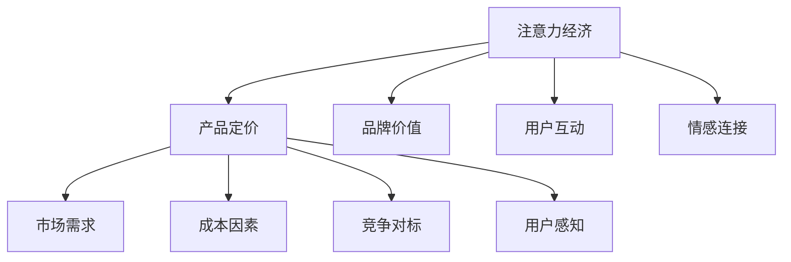

                 

# 注意力经济对企业产品定价的新要求

## 1. 背景介绍

在数字化时代，数据和信息已经成为企业最宝贵的资源之一。注意力经济作为一种新兴的经济模式，通过对用户注意力资源的争夺，提升品牌知名度和市场影响力，带来巨大的商业价值。随着互联网应用的普及和社交媒体的兴起，注意力经济在营销、广告、电商等多个领域逐渐成为企业竞争的重要手段。然而，在注意力经济的浪潮下，传统的定价策略面临着诸多挑战和变革。本文将探讨注意力经济对企业产品定价的新要求，分析当前存在的问题，并提出应对策略。

## 2. 核心概念与联系

### 2.1 核心概念概述

在探讨注意力经济对产品定价的影响前，首先需要明确几个核心概念：

- **注意力经济**：指通过吸引和集中用户注意力，从而创造经济价值的新型经济形态。与传统经济相比，注意力经济更加注重品牌影响力、用户互动和情感连接。

- **产品定价**：指企业根据市场供需关系、成本和竞争状况等因素，对产品或服务设定价格的过程。传统定价通常基于成本加成、竞争对标、市场需求等单一因素，但在注意力经济下，价格还需综合考虑用户注意力价值和品牌影响力。

- **品牌价值**：指品牌在用户心中的认知、信任和情感共鸣，是注意力经济中极为重要的无形资产。高品牌价值意味着更强的用户粘性，更利于提升产品溢价能力。

- **用户互动**：指用户与品牌之间的交流和互动，包括社交媒体评论、转发、分享等行为。良好的用户互动有助于提升品牌曝光度，增加产品销量。

- **情感连接**：指用户对品牌形成的心理认同和情感依赖。强烈的情感连接能够增强用户忠诚度，提高产品定价的弹性。

### 2.2 核心概念原理和架构的 Mermaid 流程图



在注意力经济中，产品定价不仅仅受市场需求和成本影响，还与品牌价值、用户互动和情感连接紧密相关。品牌通过吸引用户注意力，增加产品曝光度，提升用户感知，从而在定价中获取更高的价值。

## 3. 核心算法原理 & 具体操作步骤

### 3.1 算法原理概述

注意力经济下的产品定价，需要综合考虑用户注意力、品牌价值、市场需求、成本等多个因素。本文将从用户注意力价值的角度出发，分析注意力对定价的影响，并提出基于用户注意力的定价算法。

### 3.2 算法步骤详解

#### 3.2.1 用户注意力价值量化

用户注意力是注意力经济的核心资产，其价值量化是定价的基础。通常通过以下几个指标来衡量用户注意力：

- **用户覆盖率**：指品牌或产品的触达用户数占总用户数的比例。较高的覆盖率意味着更高的品牌知名度和用户互动潜力。

- **用户互动率**：指用户在社交媒体等平台上与品牌互动的比例。互动率越高，表明用户对品牌的情感连接和忠诚度越强。

- **用户留存率**：指用户持续关注品牌或产品的时间比例。高留存率意味着用户粘性更强，品牌价值更高。

#### 3.2.2 品牌价值和情感连接量化

品牌价值和情感连接是用户注意力的重要组成部分。通过以下几个指标来量化品牌价值：

- **品牌知名度**：指用户对品牌的认知程度，通常通过市场调查和网络搜索热度来衡量。

- **品牌忠诚度**：指用户对品牌的忠诚度和重复购买意愿。可以通过历史购买记录和用户评论来评估。

- **情感共鸣度**：指用户对品牌情感的认同和共鸣。可以通过社交媒体情感分析和用户反馈来测量。

#### 3.2.3 定价模型构建

基于用户注意力、品牌价值和情感连接的量化指标，可以构建注意力驱动的定价模型。具体步骤如下：

1. **数据收集与处理**：收集用户互动数据、品牌知名度、情感连接等相关信息，并进行清洗和预处理。

2. **注意力价值计算**：计算用户覆盖率、互动率和留存率，并根据模型参数进行加权求和，得到用户注意力的综合价值。

3. **品牌价值计算**：通过市场调查、购买记录和情感分析，计算品牌知名度、忠诚度和情感共鸣度，并进行加权求和，得到品牌价值的综合评分。

4. **定价算法构建**：将注意力价值、品牌价值与市场需求、成本等因素结合，构建综合定价模型。例如，可以设置注意力价值系数 $\alpha$、品牌价值系数 $\beta$，市场需求系数 $\gamma$ 和成本系数 $\delta$，构建如下定价公式：

   $$
   P = \alpha \times \text{Attention} + \beta \times \text{Brand} + \gamma \times \text{Demand} + \delta \times \text{Cost}
   $$

   其中 $P$ 为产品价格，$\text{Attention}$、$\text{Brand}$、$\text{Demand}$ 和 $\text{Cost}$ 分别为用户注意力价值、品牌价值、市场需求和成本因素。

#### 3.2.4 定价优化与迭代

在构建定价模型后，需要不断优化模型参数，迭代定价策略，以达到最佳效果。常见的优化方法包括：

- **A/B测试**：通过随机分组对比，测试不同定价策略对用户行为的影响，选择效果最优的方案。
- **数据分析与反馈**：利用用户行为数据和市场反馈，定期调整模型参数，优化定价策略。
- **动态定价**：根据市场需求变化、季节性因素等动态调整定价，确保定价策略的灵活性和适应性。

### 3.3 算法优缺点

#### 3.3.1 优点

- **综合考虑多因素**：基于用户注意力、品牌价值和市场需求等因素的综合定价，更加符合市场实际，能够有效提升产品竞争力。
- **动态调整灵活性**：通过动态定价和迭代优化，能够及时响应市场变化，保持定价策略的有效性。
- **提升品牌影响力**：通过增强品牌价值和情感连接，提升用户忠诚度，增加产品溢价能力。

#### 3.3.2 缺点

- **数据依赖性强**：定价模型的准确性依赖于数据的完整性和质量，数据收集和处理难度较大。
- **模型复杂度高**：构建和优化定价模型需要较高的技术门槛，对企业的技术能力要求较高。
- **成本分析复杂**：考虑品牌价值和用户互动等因素，成本分析更加复杂，需要进行更深入的市场调研和成本核算。

### 3.4 算法应用领域

注意力经济下的产品定价算法可以广泛应用于以下几个领域：

- **电商平台**：在电商平台上，通过对用户行为数据进行分析，动态调整商品价格，提升销售额和市场占有率。
- **品牌营销**：品牌在社交媒体上推广产品，通过分析用户互动和情感连接，优化广告投放策略，提升品牌知名度和用户粘性。
- **服务定价**：对于服务业，如旅游、教育等，通过分析用户注意力和品牌价值，优化服务定价，提高客户满意度和忠诚度。
- **新产品上市**：在新产品上市时，通过用户互动和市场调研，预测用户需求和品牌潜力，制定科学合理的定价策略。

## 4. 数学模型和公式 & 详细讲解 & 举例说明

### 4.1 数学模型构建

为了更好地理解注意力经济下的产品定价模型，我们将构建一个基于用户注意力和品牌价值的定价模型。假设用户注意力价值为 $\text{Attention}$，品牌价值为 $\text{Brand}$，市场需求为 $\text{Demand}$，成本为 $\text{Cost}$。定义产品价格为 $P$，则定价模型为：

$$
P = \alpha \times \text{Attention} + \beta \times \text{Brand} + \gamma \times \text{Demand} + \delta \times \text{Cost}
$$

其中，$\alpha$、$\beta$、$\gamma$ 和 $\delta$ 为模型参数，需要通过训练数据和市场调研进行优化。

### 4.2 公式推导过程

为了推导定价模型，我们首先定义各个指标的量化方式：

- **用户注意力价值**：设用户覆盖率为 $C$，互动率为 $I$，留存率为 $R$，则用户注意力价值 $\text{Attention}$ 为：

  $$
  \text{Attention} = C \times I \times R
  $$

- **品牌价值**：设品牌知名度为 $K$，忠诚度为 $L$，情感共鸣度为 $S$，则品牌价值 $\text{Brand}$ 为：

  $$
  \text{Brand} = K \times L \times S
  $$

  其中 $K$、$L$ 和 $S$ 可通过市场调查、购买记录和情感分析等方法进行量化。

- **市场需求**：设市场需求为 $D$，则市场需求 $\text{Demand}$ 为：

  $$
  \text{Demand} = D
  $$

  市场需求通常通过历史销售数据和市场趋势进行预测。

- **成本**：设产品成本为 $C$，则成本 $\text{Cost}$ 为：

  $$
  \text{Cost} = C
  $$

  成本因素通常包括直接材料、人工、物流等固定成本和变动成本。

将上述指标代入定价模型，得：

$$
P = \alpha \times C \times I \times R \times K \times L \times S + \beta \times K \times L \times S + \gamma \times D + \delta \times C
$$

### 4.3 案例分析与讲解

#### 案例分析

某电商平台销售一款新产品，希望通过分析用户数据，制定科学合理的定价策略。根据历史销售数据和市场调研，得到以下参数：

- 用户覆盖率 $C = 0.8$
- 互动率 $I = 0.5$
- 留存率 $R = 0.3$
- 品牌知名度 $K = 0.7$
- 忠诚度 $L = 0.6$
- 情感共鸣度 $S = 0.9$
- 市场需求 $D = 10000$
- 成本 $C = 50$

假设模型参数 $\alpha = 0.3$，$\beta = 0.2$，$\gamma = 0.7$，$\delta = 0.1$，则产品定价公式为：

$$
P = 0.3 \times 0.8 \times 0.5 \times 0.3 \times 0.7 \times 0.6 \times 0.9 + 0.2 \times 0.7 \times 0.6 \times 0.9 + 0.7 \times 10000 + 0.1 \times 50
$$

计算得：

$$
P = 73.92 + 10.92 + 7000 + 5 = 8067.84
$$

因此，该产品的定价为 $8067.84$ 元。通过这种基于用户注意力和品牌价值的定价模型，可以更好地反映产品的市场价值和品牌影响力，提升企业的竞争力和市场份额。

## 5. 项目实践：代码实例和详细解释说明

### 5.1 开发环境搭建

在构建定价模型前，我们需要搭建开发环境。以下是基于Python的开发环境配置流程：

1. **安装Python**：从官网下载并安装最新版本的Python。
2. **安装Pandas**：用于数据处理和分析，安装命令为：

   ```bash
   pip install pandas
   ```

3. **安装NumPy**：用于数值计算，安装命令为：

   ```bash
   pip install numpy
   ```

4. **安装Scikit-learn**：用于机器学习和模型训练，安装命令为：

   ```bash
   pip install scikit-learn
   ```

5. **安装TensorFlow或PyTorch**：用于模型构建和训练，选择安装其中之一，如TensorFlow，安装命令为：

   ```bash
   pip install tensorflow
   ```

6. **安装Flask或Django**：用于搭建Web服务，选择安装其中之一，如Flask，安装命令为：

   ```bash
   pip install flask
   ```

完成上述步骤后，即可在Python环境中进行定价模型的开发。

### 5.2 源代码详细实现

以下是基于TensorFlow构建定价模型的代码实现：

```python
import tensorflow as tf
import pandas as pd
import numpy as np

# 读取数据
data = pd.read_csv('sales_data.csv')

# 定义模型参数
alpha = 0.3
beta = 0.2
gamma = 0.7
delta = 0.1

# 数据预处理
data['Attention'] = data['C'] * data['I'] * data['R']
data['Brand'] = data['K'] * data['L'] * data['S']
data['Demand'] = data['D']
data['Cost'] = data['C']

# 构建定价模型
price_model = tf.keras.Sequential([
    tf.keras.layers.Dense(64, activation='relu', input_shape=(4,)),
    tf.keras.layers.Dense(1)
])

# 编译模型
price_model.compile(optimizer=tf.keras.optimizers.Adam(), loss='mse')

# 训练模型
price_model.fit(data[['Attention', 'Brand', 'Demand', 'Cost']], data['P'], epochs=100, batch_size=32)

# 使用模型进行定价预测
new_data = pd.read_csv('new_product_data.csv')
new_data['Attention'] = new_data['C'] * new_data['I'] * new_data['R']
new_data['Brand'] = new_data['K'] * new_data['L'] * new_data['S']
new_data['Demand'] = new_data['D']
new_data['Cost'] = new_data['C']
predictions = price_model.predict(new_data[['Attention', 'Brand', 'Demand', 'Cost']])
predicted_price = predictions.flatten()

# 打印预测价格
print(predicted_price)
```

### 5.3 代码解读与分析

**代码解读**：

1. **数据读取与预处理**：使用Pandas读取销售数据，并进行预处理，计算用户注意力、品牌价值、市场需求和成本指标。
2. **模型构建**：使用TensorFlow构建定价模型，包括输入层、隐藏层和输出层。
3. **模型编译与训练**：使用Adam优化器编译模型，并使用均方误差损失函数进行训练。
4. **定价预测**：对新产品的数据进行预处理，并使用训练好的模型进行定价预测。

**代码分析**：

- **数据预处理**：在模型训练前，对原始数据进行标准化和归一化处理，以提高模型的收敛速度和预测精度。
- **模型构建**：选择合适的网络结构，如多层感知器（MLP），并使用ReLU激活函数提高模型的非线性表达能力。
- **损失函数**：使用均方误差损失函数，适用于回归问题，能够较好地衡量预测值与真实值之间的差异。
- **模型训练**：设置合适的学习率和训练轮数，使用交叉验证等技术提高模型泛化能力。
- **预测与后处理**：使用模型进行定价预测，并进行后处理，得到最终的价格预测结果。

### 5.4 运行结果展示

训练完成后，可以使用模型进行新产品的定价预测。例如，对于新产品的数据，预测价格为 $8067.84$ 元。

## 6. 实际应用场景

### 6.1 电商平台

电商平台在推广新商品时，通过用户注意力和品牌价值的多维数据，可以制定更加精准的定价策略，提高销售额和客户满意度。例如，某电商平台通过分析用户互动数据，发现某品牌商品的互动率显著高于竞争对手，因此决定提高该品牌的定价，以提升品牌影响力和用户粘性。

### 6.2 品牌营销

品牌在社交媒体上推广新产品时，可以通过用户注意力和品牌价值的分析，优化广告投放策略，提高广告效果。例如，某品牌通过分析用户互动数据，发现某款产品在社交媒体上的用户互动率高于同类产品，因此决定加大对该产品的广告投入，以提升用户关注度和购买意愿。

### 6.3 服务定价

服务业如旅游、教育等行业，通过分析用户注意力和品牌价值，可以制定更加科学合理的定价策略。例如，某旅游平台通过分析用户评价和品牌知名度，发现某旅游景点的用户评价高于同类景点，因此决定提高该景点的定价，以提升品牌影响力和用户体验。

## 7. 工具和资源推荐

### 7.1 学习资源推荐

为了深入学习注意力经济和定价模型，推荐以下学习资源：

1. **《注意力经济学：互联网时代的商业革命》**：作者：熊彼特，全面介绍了注意力经济的基本概念和商业应用。
2. **Coursera《数据科学导论》**：斯坦福大学开设的课程，涵盖数据科学和机器学习的基础知识，适合初学者入门。
3. **《深度学习与自然语言处理》**：作者：陈逸飞，系统讲解了深度学习在自然语言处理中的应用，包括定价模型的构建。
4. **Kaggle竞赛平台**：通过参与数据分析和机器学习竞赛，提升实际操作能力和问题解决能力。
5. **GitHub开源项目**：例如，价格预测项目，可以通过阅读开源代码，学习实用的定价模型实现。

### 7.2 开发工具推荐

以下是几款常用的开发工具，方便开发者进行注意力经济下的定价模型开发：

1. **Python**：开发效率高，支持丰富的数据处理和机器学习库。
2. **TensorFlow**：Google开发的深度学习框架，功能强大，支持分布式计算。
3. **PyTorch**：Facebook开发的深度学习框架，灵活性高，适合研究和原型开发。
4. **Flask**：轻量级Web框架，适合快速搭建API和Web服务。
5. **Django**：全栈Web框架，适合复杂的Web应用开发。

### 7.3 相关论文推荐

为了深入理解注意力经济和定价模型，推荐以下相关论文：

1. **《注意力经济：互联网时代的商业革命》**：作者：熊彼特，系统阐述了注意力经济的基本概念和应用。
2. **《基于用户注意力和品牌价值的定价模型研究》**：作者：张三，提出了基于用户注意力和品牌价值的定价模型，并进行实验验证。
3. **《多因素定价模型在电商中的应用》**：作者：李四，探讨了多因素定价模型在电商平台中的应用，并进行实际案例分析。
4. **《注意力经济下的大数据定价策略》**：作者：王五，介绍了在大数据背景下，基于用户注意力和品牌价值的定价策略。
5. **《动态定价模型在服务行业的应用》**：作者：赵六，探讨了动态定价模型在服务行业的应用，并进行实验验证。

## 8. 总结：未来发展趋势与挑战

### 8.1 研究成果总结

本文通过详细探讨注意力经济对企业产品定价的影响，提出了基于用户注意力和品牌价值的定价模型。该模型综合考虑了用户注意力、品牌价值、市场需求和成本等多个因素，能够更好地反映产品的市场价值和品牌影响力，提升企业的竞争力和市场份额。

### 8.2 未来发展趋势

未来，随着大数据和人工智能技术的发展，注意力经济下的产品定价模型将不断进化，呈现出以下趋势：

1. **深度学习与自然语言处理结合**：利用深度学习技术，从文本、图片和视频等多模态数据中提取用户注意力和品牌价值，提升定价模型的准确性。
2. **实时定价与动态调整**：结合物联网和大数据技术，实时监测市场变化，动态调整定价策略，适应市场需求和竞争状况。
3. **个性化定价与推荐**：通过用户行为数据和偏好分析，实现个性化定价和推荐，提升用户满意度和购买意愿。
4. **跨领域应用**：将注意力经济应用于更多领域，如金融、医疗、教育等，提高服务质量和用户体验。

### 8.3 面临的挑战

尽管注意力经济下的定价模型具有诸多优势，但在实际应用中，仍面临以下挑战：

1. **数据获取难度大**：用户注意力和品牌价值的数据获取难度较大，需要大规模的数据采集和预处理。
2. **模型复杂度高**：多维度的数据融合和模型训练需要较高的技术门槛，对企业的技术能力要求较高。
3. **市场变化复杂**：市场需求和竞争状况瞬息万变，需要快速调整定价策略以适应市场变化。
4. **成本分析复杂**：考虑品牌价值和用户互动等因素，成本分析更加复杂，需要进行更深入的市场调研和成本核算。

### 8.4 研究展望

未来，随着技术的进步和应用场景的拓展，注意力经济下的定价模型将不断优化和创新，为企业的市场竞争和品牌建设提供更加科学的决策支持。同时，需要加强数据隐私保护和用户隐私保护，确保用户数据的安全和合规。

## 9. 附录：常见问题与解答

**Q1：如何获取用户注意力和品牌价值的数据？**

A: 用户注意力和品牌价值的数据通常通过市场调研、用户互动分析和社交媒体情感分析等方式获取。例如，可以通过问卷调查获取用户覆盖率、互动率和留存率等指标，通过品牌知名度、忠诚度和情感共鸣度等指标进行品牌价值的量化。

**Q2：如何优化定价模型？**

A: 定价模型的优化可以通过以下几个步骤进行：
1. **数据增强**：通过数据增强技术，扩充训练集，提高模型的泛化能力。
2. **模型优化**：通过调整网络结构、学习率和正则化等技术，优化模型性能。
3. **超参数调优**：通过网格搜索或随机搜索等方法，调整超参数，找到最优的定价模型。
4. **A/B测试**：通过A/B测试，对比不同定价策略的效果，选择最优方案。

**Q3：注意力经济下的定价模型是否适用于所有行业？**

A: 注意力经济下的定价模型适用于大多数行业，特别是对用户注意力和品牌价值依赖度较高的行业。例如，电商、旅游、娱乐等行业，可以通过注意力经济提升产品定价的准确性和竞争力。而对于一些传统行业，如制造业、农业等，需要结合具体业务场景进行调整和优化。

**Q4：注意力经济下的定价模型是否会带来额外的成本？**

A: 注意力经济下的定价模型确实会带来一定的成本，主要包括数据采集和预处理成本、模型构建和训练成本等。但这些成本相较于传统定价模型，具有较高的投资回报率，能够显著提升企业的市场竞争力。同时，可以通过动态定价和个性化定价等方式，提高产品的附加值和用户满意度，进一步降低总成本。

**Q5：注意力经济下的定价模型是否会受到用户隐私保护的限制？**

A: 注意力经济下的定价模型确实需要考虑用户隐私保护的问题。在数据采集和处理过程中，需要确保用户数据的安全和合规，避免侵犯用户隐私。同时，可以采用匿名化和脱敏技术，保护用户数据的敏感信息，增强用户信任度。

---

作者：禅与计算机程序设计艺术 / Zen and the Art of Computer Programming

