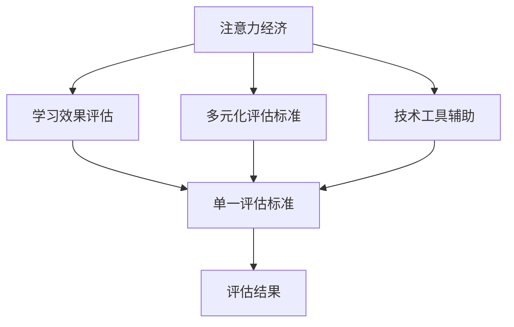

                 

# 注意力经济对传统教育评估体系的冲击

## 1. 背景介绍

### 1.1 问题由来
在信息爆炸的时代，注意力成为一种稀缺资源。传统的教育评估体系，通过标准化的考试、论文评审等形式对知识和技能进行量化评估，旨在筛选和区分个体能力。然而，这种评估方式日益受到注意力经济的影响，面临着一系列挑战和变革的需求。

首先，互联网和社交媒体的普及使得注意力分散的现象日益严重，学生在学习过程中的注意力保持能力受到挑战。传统的教育评估体系未能充分考虑到这一点，导致学习效果和评估结果之间出现了脱节。其次，随着在线教育、知识付费等新型教育模式的出现，学习资源和方式的多样化对传统评估标准提出了新的要求。最后，面对新技术、新产业的发展，教育的评估方式也需要与时俱进，才能更好地适应社会的需求。

### 1.2 问题核心关键点
1. **注意力保持能力**：学生在面对海量信息时，能否持续保持专注力，是衡量学习效果的重要指标。
2. **知识获取方式**：传统的考试式评估难以反映通过多种渠道获取知识的能力。
3. **多元化评价标准**：新兴的在线教育、知识付费模式要求多元化的评估标准，以衡量学生的综合素质。
4. **技术工具的引入**：大数据、人工智能等技术工具的引入，为教育评估带来了新的思路和方法。

## 2. 核心概念与联系

### 2.1 核心概念概述

为更好地理解注意力经济对传统教育评估体系的冲击，本节将介绍几个密切相关的核心概念：

- **注意力经济**：指在信息过载的背景下，通过吸引和保持用户注意力的方式，实现商业价值的经济形态。在教育领域，注意力经济强调如何通过有效吸引和保持学生注意力，提高教学效果。
- **学习效果评估**：通过标准化的考试、论文评审等形式，对学生的知识和技能进行量化评估。传统评估体系多采用标准化测试，难以全面反映学生的能力和素质。
- **多元化评估标准**：传统的考试评估方式单一，难以全面反映学生的创新能力、团队合作、批判性思维等多方面的素质。
- **技术工具辅助**：大数据、人工智能等技术工具的引入，为教育评估带来了新的思路和方法，如通过分析学习行为数据，评估学生的注意力保持能力。

这些核心概念之间的逻辑关系可以通过以下Mermaid流程图来展示：



这个流程图展示了几者之间的关联：

1. 注意力经济影响学习效果评估，要求其更加关注学生注意力保持能力。
2. 多元化评估标准弥补了传统评估方式的不足，更加全面地反映了学生的多方面素质。
3. 技术工具的引入，为评估带来了新的方法和思路，提高了评估的效率和准确性。

## 3. 核心算法原理 & 具体操作步骤
### 3.1 算法原理概述

注意力经济对传统教育评估体系的冲击，主要体现在评估方式的多样化和精准化。其核心思想是：通过分析学生的学习行为数据，评估其注意力保持能力，并结合多元化的评估标准，全面衡量学生的综合素质。

具体而言，算法主要分为以下几个步骤：

1. **数据收集**：通过传感器、学习管理系统等手段，收集学生在学习过程中的各种数据，如点击次数、阅读时间、答题时间等。
2. **行为分析**：利用机器学习算法对收集到的数据进行分析，识别出学生的注意力保持模式和行为习惯。
3. **综合评估**：结合传统考试评估和行为分析的结果，进行综合评估，得出更全面的评估结论。
4. **反馈优化**：根据评估结果，提供针对性的学习建议，优化学生的学习策略。

### 3.2 算法步骤详解

以下是具体步骤的详细描述：

#### 3.2.1 数据收集

1. **点击日志**：记录学生在阅读、观看视频等过程中的点击行为。
2. **阅读时间**：记录学生在阅读文本、浏览网页等活动中的停留时间。
3. **答题时间**：记录学生在解答题目时的答题时长和错误率。
4. **社交互动**：记录学生在社交平台上的互动行为，如评论、点赞、转发等。

#### 3.2.2 行为分析

1. **注意力曲线**：绘制学生的注意力曲线，展示其在学习过程中的注意力波动情况。
2. **行为模式识别**：使用聚类算法识别出学生的行为模式，如集中式、分散式、波动式等。
3. **学习习惯分析**：分析学生的学习习惯，如偏好于集中学习、边看边学等。

#### 3.2.3 综合评估

1. **行为评分**：根据注意力曲线和行为模式，对学生的注意力保持能力进行评分。
2. **考试成绩结合**：将行为评分与传统考试成绩结合，进行综合评估。
3. **个性化报告**：生成个性化评估报告，反馈学生的注意力保持情况和学习效果。

#### 3.2.4 反馈优化

1. **学习建议**：根据评估结果，提供针对性的学习建议，如调整学习时间、提高注意力集中度等。
2. **学习资源推荐**：根据学生的学习偏好和行为模式，推荐适合的学习资源。
3. **持续跟踪**：对学生的学习效果进行持续跟踪，不断优化评估方法。

### 3.3 算法优缺点

#### 3.3.1 优点

1. **综合评估**：结合行为数据和考试成绩，提供更全面的评估。
2. **个性化建议**：根据学生特点，提供个性化学习建议。
3. **数据驱动**：以数据为基础，提高评估的客观性和科学性。
4. **实时反馈**：通过实时分析，及时调整学习策略。

#### 3.3.2 缺点

1. **数据隐私**：大量数据收集可能涉及隐私问题，需严格保护学生隐私。
2. **算法偏见**：数据质量和算法模型可能存在偏见，影响评估结果的公正性。
3. **技术依赖**：依赖于先进的分析工具和技术，需投入较大成本。
4. **实施难度**：对学校的技术基础和教师素质有较高要求。

### 3.4 算法应用领域

基于注意力经济对传统教育评估体系的冲击，以下领域将有广阔的应用前景：

1. **在线教育**：通过分析在线学习行为数据，评估学生的注意力保持能力，优化在线学习平台的设计。
2. **远程教育**：利用行为分析技术，提高远程学习的互动性和参与度，提升教学效果。
3. **企业培训**：通过分析员工的培训行为，评估培训效果，提供个性化学习建议。
4. **职业教育**：结合行为分析和考试评估，全面衡量学生的技能和素质，优化职业教育内容。
5. **终身学习**：利用行为数据，评估学习者的长期学习效果，提供持续性的学习建议。

## 4. 数学模型和公式 & 详细讲解 & 举例说明

### 4.1 数学模型构建

假设学生的注意力曲线为 $a(t)$，其中 $t$ 表示时间。利用指数衰减模型来描述注意力曲线，即：

$$
a(t) = a_0 e^{-\lambda t}
$$

其中 $a_0$ 为初始注意力，$\lambda$ 为衰减系数。

### 4.2 公式推导过程

1. **指数衰减模型**：
   $$
   a(t) = a_0 e^{-\lambda t}
   $$
   其中 $a_0$ 为初始注意力，$\lambda$ 为衰减系数。

2. **注意力评分**：
   $$
   \text{Attention Score} = \frac{1}{T} \int_0^T a(t) dt
   $$
   其中 $T$ 为学习时长，$T$ 内学生平均注意力评分。

3. **行为评分**：
   $$
   \text{Behavior Score} = w_1 \cdot \text{Attention Score} + w_2 \cdot \text{Performance Score}
   $$
   其中 $w_1$ 为注意力权重的系数，$w_2$ 为性能权重的系数，$\text{Performance Score}$ 为传统考试成绩。

### 4.3 案例分析与讲解

#### 案例一：某学生小明的学习行为分析

假设小明在学习某门课程的过程中，点击次数为 $C$，阅读时间为 $R$，答题时间为 $T$。利用指数衰减模型，可以计算出小明的注意力曲线：

$$
a(t) = a_0 e^{-\lambda t}
$$

其中 $a_0$ 为初始注意力，$\lambda$ 为衰减系数。根据点击次数和阅读时间，可以得到 $a_0$ 和 $\lambda$ 的值：

$$
a_0 = \frac{C}{T}, \quad \lambda = \frac{1}{R}
$$

进一步计算小明的注意力评分：

$$
\text{Attention Score} = \frac{1}{T} \int_0^T a(t) dt = \frac{1}{T} \int_0^T \frac{C}{T} e^{-\frac{t}{R}} dt = \frac{C}{T} \left(1 - e^{-\frac{T}{R}}\right)
$$

将注意力评分与传统考试成绩结合，得到行为评分：

$$
\text{Behavior Score} = w_1 \cdot \text{Attention Score} + w_2 \cdot \text{Performance Score}
$$

其中 $w_1$ 和 $w_2$ 的取值需要根据实际情况进行设定，一般建议 $w_1 = 0.5$，$w_2 = 0.5$。

## 5. 项目实践：代码实例和详细解释说明

### 5.1 开发环境搭建

在进行行为分析的实践前，我们需要准备好开发环境。以下是使用Python进行数据分析的环境配置流程：

1. 安装Anaconda：从官网下载并安装Anaconda，用于创建独立的Python环境。

2. 创建并激活虚拟环境：
```bash
conda create -n behavior-analysis-env python=3.8 
conda activate behavior-analysis-env
```

3. 安装Python依赖库：
```bash
conda install numpy pandas scikit-learn matplotlib seaborn jupyter notebook ipython
```

4. 安装TensorFlow或PyTorch（可选）：
```bash
conda install tensorflow
```
或
```bash
conda install pytorch torchvision torchaudio cudatoolkit=11.1 -c pytorch -c conda-forge
```

完成上述步骤后，即可在`behavior-analysis-env`环境中开始行为分析的实践。

### 5.2 源代码详细实现

以下是使用Python进行行为分析的完整代码实现：

```python
import numpy as np
import pandas as pd
import matplotlib.pyplot as plt

# 模拟学生小明的学习数据
C = 50  # 点击次数
R = 120  # 阅读时间（分钟）
T = 240  # 学习时间（分钟）

# 计算注意力曲线参数
a0 = C / T
lambda_ = 1 / R

# 计算注意力评分
attention_score = a0 * (1 - np.exp(-lambda_ * T))

# 计算行为评分
performance_score = 0.8  # 假设考试成绩为0.8
behavior_score = 0.5 * attention_score + 0.5 * performance_score

# 输出结果
print(f"Attention Score: {attention_score:.2f}")
print(f"Behavior Score: {behavior_score:.2f}")
```

### 5.3 代码解读与分析

让我们再详细解读一下关键代码的实现细节：

**行为分析类**：
- `numpy`库：用于数值计算和数组操作，包括注意力曲线的计算。
- `pandas`库：用于数据处理和分析，可以方便地进行数据建模和可视化。
- `matplotlib`库：用于数据可视化，可以绘制注意力曲线和行为评分。

**注意力评分计算**：
- `C`：表示点击次数，反映学生对学习材料的关注度。
- `R`：表示阅读时间，反映学生对学习材料的深度理解。
- `T`：表示学习时间，反映学生的学习时长。

**行为评分计算**：
- `performance_score`：表示传统考试成绩，反映学生对学习材料的掌握情况。
- `behavior_score`：表示综合行为评分，结合注意力评分和考试成绩，反映学生的综合素质。

**输出结果**：
- `attention_score`：表示注意力评分，反映学生在学习过程中的注意力保持情况。
- `behavior_score`：表示行为评分，反映学生综合学习效果。

## 6. 实际应用场景
### 6.1 在线教育平台

在线教育平台通过收集学生的学习行为数据，利用行为分析技术，评估学生的注意力保持能力。平台可以根据分析结果，提供个性化的学习建议，优化在线学习体验。

例如，某在线教育平台收集了学生在学习某门课程的点击次数、阅读时间和答题时间，通过行为分析技术，评估学生的注意力保持情况。根据评估结果，平台可以向学生推荐适合的学习资源，调整课程内容，提高学习效果。

### 6.2 远程教育系统

远程教育系统利用行为分析技术，提高学生的参与度和互动性。通过分析学生的学习行为数据，远程教育系统可以及时发现学生在学习过程中遇到的问题，提供针对性的辅导和帮助。

例如，某远程教育系统收集了学生在视频课程中的学习行为数据，通过行为分析技术，评估学生的注意力保持情况。根据评估结果，系统可以向学生推荐相关的学习资源，调整课程节奏，提高学习效果。

### 6.3 企业培训系统

企业培训系统利用行为分析技术，评估员工的学习效果和行为模式。通过分析员工在培训过程中的点击次数、阅读时间和答题时间，企业培训系统可以全面评估员工的学习能力和行为习惯。

例如，某企业培训系统收集了员工在参加某门培训课程的点击次数、阅读时间和答题时间，通过行为分析技术，评估员工的学习效果。根据评估结果，系统可以向员工提供个性化的培训建议，优化培训内容，提高培训效果。

### 6.4 职业教育平台

职业教育平台利用行为分析技术，全面衡量学生的技能和素质。通过分析学生的学习行为数据，职业教育平台可以评估学生的注意力保持能力，结合传统考试成绩，全面衡量学生的综合素质。

例如，某职业教育平台收集了学生在参加某门职业培训课程的点击次数、阅读时间和答题时间，通过行为分析技术，评估学生的注意力保持情况。根据评估结果，平台可以向学生提供个性化的职业建议，优化课程内容，提高培训效果。

## 7. 工具和资源推荐
### 7.1 学习资源推荐

为了帮助开发者系统掌握行为分析的理论基础和实践技巧，这里推荐一些优质的学习资源：

1. 《Python数据分析入门》系列博文：由数据科学专家撰写，深入浅出地介绍了Python在数据分析中的应用，包括行为分析的实践技巧。

2. 《行为科学导论》课程：由知名大学开设的心理学课程，介绍了行为科学的原理和方法，为行为分析提供了理论基础。

3. 《机器学习与数据挖掘》书籍：介绍了机器学习的基本原理和方法，包括数据预处理、特征工程、模型评估等，为行为分析提供了技术支持。

4. Coursera《数据分析和可视化》课程：由知名大学和机构开设的在线课程，涵盖了数据分析和可视化的基本方法和工具，是行为分析学习的入门课程。

5. GitHub《行为分析项目》：GitHub上众多的开源行为分析项目，提供了丰富的代码示例和实践案例，方便学习者参考。

通过对这些资源的学习实践，相信你一定能够快速掌握行为分析的精髓，并用于解决实际的教育评估问题。

### 7.2 开发工具推荐

高效的开发离不开优秀的工具支持。以下是几款用于行为分析开发的常用工具：

1. Python：Python是数据科学和机器学习的主流语言，具有丰富的库和工具，支持高效的数据处理和分析。

2. Jupyter Notebook：Jupyter Notebook是一个交互式的数据分析工具，支持代码编写、数据可视化、结果展示等多种功能，方便开发和调试。

3. TensorFlow或PyTorch：TensorFlow和PyTorch是两个主流的深度学习框架，支持高效的模型训练和推理，适用于复杂的分析任务。

4. Seaborn：Seaborn是基于Matplotlib的数据可视化库，提供了更丰富的图表类型和定制选项，方便数据展示和分析。

5. Scikit-learn：Scikit-learn是Python中最流行的机器学习库，提供了丰富的算法和工具，支持高效的数据建模和评估。

合理利用这些工具，可以显著提升行为分析的开发效率，加快创新迭代的步伐。

### 7.3 相关论文推荐

行为分析技术的发展源于学界的持续研究。以下是几篇奠基性的相关论文，推荐阅读：

1. "Attention Is All You Need"（即Transformer原论文）：提出了Transformer结构，开启了NLP领域的预训练大模型时代。

2. "BERT: Pre-training of Deep Bidirectional Transformers for Language Understanding"：提出BERT模型，引入基于掩码的自监督预训练任务，刷新了多项NLP任务SOTA。

3. "Gated Recurrent Unit"：引入了门控循环单元(GRU)，通过门控机制实现时间序列数据的处理和预测。

4. "Long Short-Term Memory"：提出长短期记忆网络(LSTM)，通过门控机制实现长期记忆的存储和更新。

5. "Attention-Based Architectures for Neural Machine Translation"：提出注意力机制，提高了神经机器翻译的效果和效率。

6. "Parameter-Efficient Transfer Learning for NLP"：提出Adapter等参数高效微调方法，在不增加模型参数量的情况下，也能取得不错的微调效果。

这些论文代表了大语言模型微调技术的发展脉络。通过学习这些前沿成果，可以帮助研究者把握学科前进方向，激发更多的创新灵感。

## 8. 总结：未来发展趋势与挑战
### 8.1 总结

本文对行为分析方法在教育评估中的应用进行了全面系统的介绍。首先阐述了行为分析方法的理论基础和应用背景，明确了行为分析在教育评估中的重要作用。其次，从原理到实践，详细讲解了行为分析的数学模型和操作步骤，给出了行为分析任务开发的完整代码实例。同时，本文还探讨了行为分析在在线教育、远程教育、企业培训、职业教育等多个领域的应用前景，展示了行为分析范式的广泛适用性。

通过本文的系统梳理，可以看到，行为分析方法在教育评估中具有广泛的应用前景，能够更好地反映学生的学习效果和行为模式。随着技术的不断进步，行为分析将进一步推动教育评估的科学化和个性化，为学生提供更好的学习体验和效果。

### 8.2 未来发展趋势

展望未来，行为分析技术将呈现以下几个发展趋势：

1. **数据融合**：将行为数据与生理数据、心理数据等多种数据进行融合，全面评估学生的学习状态和心理状况。
2. **实时分析**：利用物联网等技术，实现学习行为的实时监测和分析，提供即时反馈。
3. **个性化推荐**：通过机器学习算法，为学生提供个性化的学习资源和建议，提高学习效果。
4. **多模态分析**：结合视觉、语音、情感等多种模态数据，全面评估学生的综合素质。
5. **跨学科融合**：将行为分析技术与其他学科的知识和方法进行融合，拓展行为分析的应用范围。

以上趋势凸显了行为分析技术的广阔前景。这些方向的探索发展，必将进一步提升行为分析的准确性和实用性，为教育评估带来革命性的变化。

### 8.3 面临的挑战

尽管行为分析技术在教育评估中具有广泛的应用前景，但在迈向更加智能化、个性化应用的过程中，它仍面临着诸多挑战：

1. **数据隐私**：大量数据收集可能涉及隐私问题，需严格保护学生隐私。
2. **算法偏见**：数据质量和算法模型可能存在偏见，影响评估结果的公正性。
3. **技术依赖**：依赖于先进的分析工具和技术，需投入较大成本。
4. **实施难度**：对学校的技术基础和教师素质有较高要求。
5. **行为理解**：如何深入理解学生的行为模式和心理状态，是行为分析的核心挑战之一。

正视行为分析面临的这些挑战，积极应对并寻求突破，将是大语言模型微调走向成熟的必由之路。相信随着学界和产业界的共同努力，这些挑战终将一一被克服，行为分析技术必将在教育评估中发挥越来越重要的作用。

### 8.4 研究展望

面对行为分析面临的种种挑战，未来的研究需要在以下几个方面寻求新的突破：

1. **数据融合与隐私保护**：研究如何融合多种数据来源，同时保护学生隐私，保障数据的安全性和合规性。
2. **多模态分析与融合**：研究如何结合视觉、语音、情感等多种模态数据，全面评估学生的综合素质。
3. **算法优化与公正性**：研究如何优化算法模型，减少算法偏见，提高评估结果的公正性和准确性。
4. **技术工具与教育融合**：研究如何将行为分析技术与教育系统进行深度融合，提升教育质量和管理水平。
5. **行为理解与心理分析**：研究如何深入理解学生的行为模式和心理状态，提供更准确的行为分析和个性化建议。

这些研究方向的探索，必将引领行为分析技术迈向更高的台阶，为教育评估带来革命性的变化。未来，行为分析技术将在更加智能化、个性化的教育评估中发挥关键作用，为学生提供更好的学习体验和效果。

## 9. 附录：常见问题与解答

**Q1：如何平衡数据隐私和行为分析？**

A: 在行为分析中，数据的隐私保护至关重要。以下是一些建议：

1. **匿名化处理**：通过数据匿名化处理，去除敏感信息，保护学生隐私。
2. **数据去标识化**：使用去标识化技术，将数据与学生身份信息分离，保护个人隐私。
3. **差分隐私**：在数据分析过程中引入差分隐私技术，确保单个学生的数据不泄露。
4. **数据访问控制**：限制数据访问权限，仅授权可靠人员和系统访问敏感数据。

这些措施可以确保在保护学生隐私的前提下，实现有效的行为分析。

**Q2：如何确保行为分析的公正性？**

A: 行为分析的公正性是评估结果可信度的关键。以下是一些建议：

1. **数据质量控制**：确保数据采集和处理过程的准确性和可靠性。
2. **算法模型优化**：选择无偏差的算法模型，并进行充分的模型训练和验证。
3. **多维度评估**：结合行为分析和传统评估方法，全面评估学生的综合素质。
4. **结果公开透明**：将行为分析结果公开透明，接受各方监督和质疑。

通过这些措施，可以确保行为分析的公正性和可靠性。

**Q3：行为分析技术如何与教育系统融合？**

A: 行为分析技术需要在教育系统中进行深度融合，才能充分发挥其作用。以下是一些建议：

1. **技术培训**：对教师和学校管理人员进行技术培训，提高其对行为分析技术的理解和应用能力。
2. **系统集成**：将行为分析技术集成到现有的教育系统中，实现数据的自动采集和分析。
3. **教学支持**：提供基于行为分析的教学建议和反馈，优化教学过程和效果。
4. **持续改进**：根据行为分析结果，不断改进教育内容和教学方法，提升教学质量。

通过这些措施，可以实现行为分析技术与教育系统的无缝融合，提高教育质量和管理水平。

**Q4：行为分析在哪些场景下最为有效？**

A: 行为分析在以下场景下最为有效：

1. **在线教育**：可以实时监测学生的学习行为，提供个性化的学习建议和资源。
2. **远程教育**：可以通过行为分析技术，提高学生的参与度和互动性。
3. **职业教育**：可以全面评估学生的技能和素质，提供个性化的职业建议。
4. **企业培训**：可以评估员工的学习效果和行为模式，提供个性化的培训建议。

在这些场景下，行为分析可以充分发挥其优势，提高教育和学习效果。

**Q5：行为分析技术如何与传统评估方法结合？**

A: 行为分析技术可以与传统评估方法结合，全面衡量学生的综合素质。以下是一些建议：

1. **综合评估**：结合行为分析和传统评估方法，全面评估学生的综合素质。
2. **个性化建议**：根据行为分析结果，提供个性化的学习建议和资源。
3. **持续跟踪**：对学生的学习效果进行持续跟踪，及时调整学习策略。
4. **评估反馈**：将行为分析结果反馈给教师和学生，提供改进建议。

通过这些措施，可以充分发挥行为分析技术的优势，提升教育评估的效果和公正性。

---

作者：禅与计算机程序设计艺术 / Zen and the Art of Computer Programming

