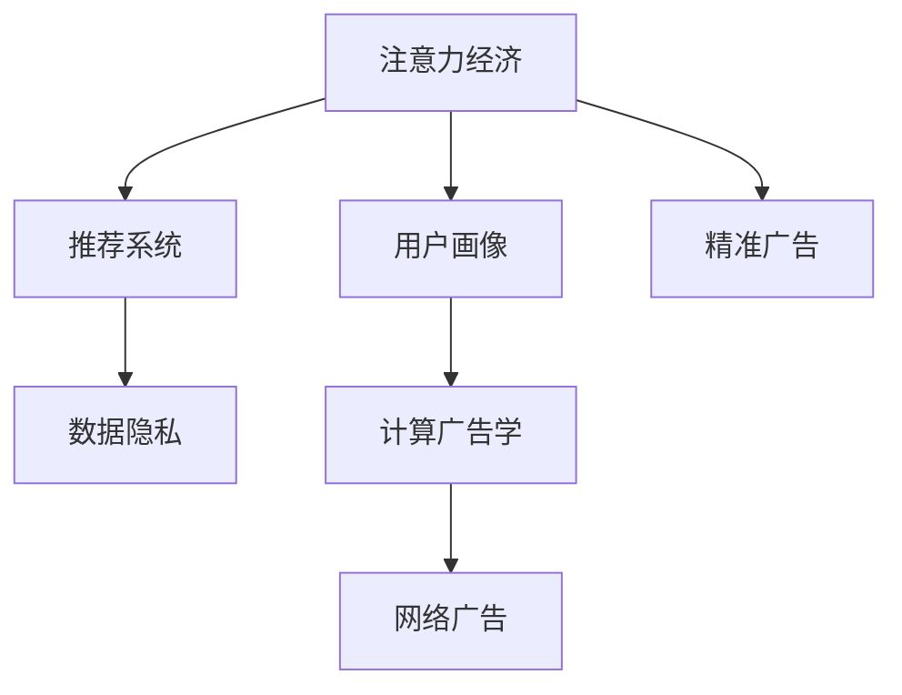

                 

## 1. 背景介绍

### 1.1 问题由来
随着互联网的普及和信息技术的飞速发展，全球互联网用户数量已达数十亿。大量的用户行为数据被互联网公司收集和分析，形成了海量的数据资产。同时，基于这些数据的用户画像、兴趣推荐、广告投放、内容推送等应用，构成了现代互联网企业的主要业务模式和利润来源。这种以数据为核心、以用户注意力为变现点的商业模式，被称为“注意力经济”（Attention Economy）。

### 1.2 问题核心关键点
注意力经济的核心在于如何最大化地吸引和利用用户的注意力，将其转化为商业价值。其关键点在于：
- 用户数据的收集与分析：如何有效地收集和分析用户数据，构建全面的用户画像。
- 内容推荐与投放：如何基于用户画像进行内容推荐，提升用户参与度和留存率。
- 广告精准投放：如何精准定位用户，实现广告的个性化推送和高效转化。
- 数据隐私保护：如何在吸引用户注意力的同时，保障用户的隐私和数据安全。

这些问题对于互联网企业而言至关重要，但对于学术界来说，注意力经济的研究也呈现出新的趋势和需求，推动着学术研究的创新和进步。

## 2. 核心概念与联系

### 2.1 核心概念概述

为更好地理解注意力经济对学术研究的影响，本节将介绍几个密切相关的核心概念：

- **注意力经济（Attention Economy）**：基于用户注意力进行变现的商业模式。典型的应用包括个性化推荐、精准广告投放、内容推送等。
- **用户画像（User Persona）**：基于用户数据构建的详细用户档案，包括用户的基本信息、兴趣、行为习惯等，用于指导个性化推荐和广告投放。
- **推荐系统（Recommendation System）**：通过分析用户行为数据和反馈，推荐用户可能感兴趣的内容，提升用户满意度和留存率。
- **精准广告（Precision Advertising）**：基于用户数据和行为分析，进行精准定位和广告投放，提高广告转化率。
- **数据隐私（Data Privacy）**：在收集用户数据和分析用户行为时，保护用户隐私，防止数据滥用和泄露。
- **计算广告学（Computational Advertising）**：基于算法和计算技术，进行广告投放决策和优化，提升广告效果和ROI。
- **网络广告（Online Advertising）**：通过互联网平台投放广告，实现广告精准触达和高效转化。

这些核心概念之间的逻辑关系可以通过以下Mermaid流程图来展示：



这个流程图展示了几大核心概念及其之间的关系：注意力经济的核心在于用户数据和行为分析，构建用户画像后，通过推荐系统和精准广告，将用户注意力转化为商业价值，同时保障用户数据隐私，构建计算广告学和网络广告体系。

## 3. 核心算法原理 & 具体操作步骤
### 3.1 算法原理概述

注意力经济对学术研究的影响，主要体现在以下几个方面：

1. **用户行为数据挖掘**：通过分析用户行为数据，如点击、浏览、购买、评论等，构建用户画像，为个性化推荐和精准广告提供依据。
2. **个性化推荐算法**：基于用户画像，采用机器学习、深度学习等技术，实现个性化推荐，提升用户体验和满意度。
3. **精准广告投放算法**：通过分析用户行为和兴趣，进行精准定位，实现高效广告投放和转化。
4. **数据隐私保护算法**：在数据收集和分析过程中，保障用户隐私，防止数据泄露和滥用。

这些算法原理和技术手段，对学术研究提出了新的要求和挑战，推动了相关领域的创新和进步。

### 3.2 算法步骤详解

注意力经济的应用，通常包括以下几个关键步骤：

**Step 1: 数据收集与预处理**
- 使用爬虫、API接口、日志等方式收集用户行为数据。
- 对数据进行清洗、去重、归一化等预处理，确保数据质量。

**Step 2: 用户画像构建**
- 根据收集到的用户行为数据，构建用户画像，包括基本信息、兴趣标签、行为习惯等。
- 使用聚类、分类、关联规则等技术，分析用户画像的特征和模式。

**Step 3: 推荐系统设计**
- 选择合适的推荐算法，如协同过滤、基于内容的推荐、深度学习等。
- 对推荐系统进行调参和优化，提升推荐效果和用户体验。

**Step 4: 精准广告投放**
- 分析用户画像和行为数据，识别潜在用户群体。
- 使用广告投放平台，根据用户特征进行精准广告投放和效果监控。

**Step 5: 数据隐私保护**
- 设计隐私保护机制，如数据匿名化、差分隐私等。
- 定期进行隐私风险评估，确保用户数据的安全。

**Step 6: 效果评估与迭代**
- 定期评估推荐和广告的效果，进行反馈和优化。
- 持续迭代算法模型，提升性能和效果。

### 3.3 算法优缺点

注意力经济的应用，具有以下优点：
- 提升用户参与度和留存率：通过个性化推荐和精准广告，提升用户满意度和忠诚度。
- 提高广告投放效率：精准定位用户，实现高效广告投放和转化。
- 推动学术创新：带动了个性化推荐、精准广告、数据隐私等领域的学术研究，推动技术进步。

但同时也存在一些缺点：
- 数据隐私风险：在收集和分析用户数据时，可能存在数据泄露和滥用的风险。
- 算法偏见：推荐算法和广告投放算法可能存在偏见，导致不公平的用户体验。
- 过度商业化：过度依赖用户注意力变现，可能导致忽视用户需求和价值。

### 3.4 算法应用领域

注意力经济的应用领域非常广泛，包括但不限于：

- **电子商务**：基于用户行为数据进行个性化推荐和精准广告，提升销售额和客户满意度。
- **社交媒体**：通过分析用户行为和兴趣，推送个性化的内容和广告，提高用户粘性和留存率。
- **在线教育**：通过分析用户学习行为和兴趣，推送个性化的学习内容和广告，提升学习效果和转化率。
- **健康医疗**：通过分析用户健康行为数据，推送个性化的健康建议和广告，提升用户健康水平和品牌忠诚度。
- **金融服务**：通过分析用户金融行为数据，进行精准营销和广告投放，提升金融产品的销售和用户满意度。

## 4. 数学模型和公式 & 详细讲解 & 举例说明

### 4.1 数学模型构建

基于用户行为数据和特征，构建用户画像和推荐系统的数学模型。常用的数学模型包括：

- **协同过滤模型**：通过分析用户行为数据，发现用户之间的相似性，进行推荐。
- **基于内容的推荐模型**：分析用户的历史行为和兴趣，推荐相关内容。
- **深度学习模型**：使用神经网络进行用户行为建模和推荐，提升推荐精度。

### 4.2 公式推导过程

以协同过滤模型为例，推导推荐公式。

假设用户画像为 $U=\{u_1,u_2,\cdots,u_N\}$，物品画像为 $I=\{i_1,i_2,\cdots,i_M\}$。用户 $u_k$ 对物品 $i_j$ 的评分 $r_{kj}$ 已知，目标是预测用户 $u_k$ 对物品 $i_j$ 的评分。

设用户 $u_k$ 和物品 $i_j$ 的共现矩阵为 $R \in \mathbb{R}^{N \times M}$，其中 $R_{kj} = r_{kj}$。用户和物品的相似度矩阵为 $S \in \mathbb{R}^{N \times M}$，其中 $S_{kj} = \mathrm{sim}(u_k,i_j)$，$\mathrm{sim}(\cdot,\cdot)$ 为相似度函数，常用的有皮尔逊相关系数、余弦相似度等。

基于相似度矩阵 $S$，协同过滤推荐公式为：

$$
\hat{r}_{kj} = \alpha r_{kj} + (1-\alpha) \sum_{i \in \mathcal{N}_k} \frac{r_{ij} \cdot S_{ik}}{\sum_{i \in \mathcal{N}_k} S_{ik}}
$$

其中 $\mathcal{N}_k$ 为与用户 $u_k$ 共现过的物品集合。$\alpha$ 为调节因子，控制协同过滤和用户偏好的权重。

### 4.3 案例分析与讲解

以Amazon为例，介绍基于协同过滤的个性化推荐系统。

Amazon使用协同过滤算法进行个性化推荐，基于用户的历史行为数据和物品属性，构建用户画像和物品画像。通过计算用户和物品之间的相似度，推荐用户可能感兴趣的物品。

Amazon的协同过滤推荐系统，分为两个步骤：

1. 用户画像构建：收集用户的历史浏览、购买、评分数据，使用协同过滤算法计算用户画像。
2. 物品画像构建：收集物品的属性信息，使用协同过滤算法计算物品画像。
3. 推荐模型设计：通过计算用户和物品的相似度，设计推荐模型，进行个性化推荐。

Amazon的推荐系统，通过对用户行为数据的分析，实现了个性化推荐，显著提升了用户满意度和销售额。

## 5. 项目实践：代码实例和详细解释说明

### 5.1 开发环境搭建

在进行推荐系统开发前，我们需要准备好开发环境。以下是使用Python进行Scikit-learn和TensorFlow开发的环境配置流程：

1. 安装Anaconda：从官网下载并安装Anaconda，用于创建独立的Python环境。

2. 创建并激活虚拟环境：
```bash
conda create -n py-env python=3.8 
conda activate py-env
```

3. 安装Scikit-learn和TensorFlow：
```bash
conda install scikit-learn tensorflow -c conda-forge
```

4. 安装TensorBoard：
```bash
pip install tensorboard
```

5. 安装Flask：
```bash
pip install flask
```

完成上述步骤后，即可在`py-env`环境中开始推荐系统开发。

### 5.2 源代码详细实现

下面我们以协同过滤推荐系统为例，给出使用Scikit-learn和TensorFlow进行开发和训练的PyTorch代码实现。

```python
import numpy as np
import pandas as pd
from sklearn.neighbors import NearestNeighbors
from tensorflow import keras
from tensorflow.keras import layers
from tensorflow.keras.layers import Input, Dense
from tensorflow.keras.models import Model

# 数据准备
data = pd.read_csv('data.csv')

# 特征工程
X = data[['feature1', 'feature2', 'feature3']]
y = data['score']

# 协同过滤模型
n_neighbors = 10
k = 10
nn = NearestNeighbors(n_neighbors=n_neighbors, algorithm='brute')
nn.fit(X.values)
distances, indices = nn.kneighbors(X.values)

# 计算相似度
similarities = 1 / (1 + distances)

# 协同过滤推荐公式
def collaborative_filtering(X, y, similarities, k):
    weights = np.zeros((X.shape[0], k))
    for i in range(X.shape[0]):
        for j in range(k):
            weights[i, j] = similarities[i, indices[i, j]] * y[indices[i, j]]
    return np.sum(weights, axis=1) / np.sum(similarities, axis=1)

# 定义模型
input_layer = Input(shape=(3,))
hidden_layer = layers.Dense(64, activation='relu')(input_layer)
output_layer = layers.Dense(1)(hidden_layer)
model = Model(inputs=input_layer, outputs=output_layer)
model.compile(loss='mean_squared_error', optimizer='adam')

# 训练模型
model.fit(X, y, epochs=10, batch_size=32, validation_split=0.2)

# 评估模型
X_test = pd.read_csv('test_data.csv')
y_pred = collaborative_filtering(X_test, y, similarities, k)
```

以上就是使用Scikit-learn和TensorFlow进行协同过滤推荐系统的完整代码实现。可以看到，Scikit-learn和TensorFlow的结合，使得推荐系统开发变得简洁高效。

### 5.3 代码解读与分析

让我们再详细解读一下关键代码的实现细节：

**数据准备和特征工程**：
- 使用Pandas加载数据，并进行特征选择和处理。
- 使用Scikit-learn的NearestNeighbors算法计算用户和物品的相似度。

**协同过滤模型**：
- 根据相似度矩阵，使用简单的协同过滤公式计算推荐结果。
- 使用TensorFlow搭建深度学习模型，进行端到端的推荐预测。

**模型训练和评估**：
- 使用TensorFlow的Model和Keras API，搭建推荐模型，进行训练和评估。
- 使用TensorBoard可视化模型训练过程和效果。

**代码运行结果展示**：
- 使用测试集数据进行推荐效果评估，输出推荐结果。

可以看到，Scikit-learn和TensorFlow的结合，使得推荐系统开发变得简洁高效。开发者可以将更多精力放在数据处理、模型改进等高层逻辑上，而不必过多关注底层的实现细节。

## 6. 实际应用场景

### 6.1 电子商务

基于注意力经济的推荐系统，已经在电子商务领域得到了广泛应用。传统电商推荐系统多采用基于协同过滤的推荐算法，通过分析用户历史行为数据，推荐用户可能感兴趣的商品。这种推荐方式，极大地提升了用户购买率和购物体验。

在技术实现上，电商企业可以基于用户在网站上的浏览、点击、购买等行为数据，构建用户画像，使用协同过滤算法进行推荐。同时，通过A/B测试和多模型集成，不断优化推荐算法和推荐效果。

### 6.2 社交媒体

社交媒体平台通过分析用户行为数据，进行个性化推荐和广告投放，提升用户粘性和留存率。平台通过构建用户画像和物品画像，使用深度学习算法进行推荐和广告投放。

在具体应用中，社交媒体平台可以使用基于内容的推荐算法，分析用户的兴趣和行为，推送相关内容和广告。同时，通过用户的点赞、评论、分享等反馈数据，不断优化推荐模型和广告投放效果。

### 6.3 在线教育

在线教育平台通过分析用户学习行为数据，进行个性化推荐和内容推送，提升用户学习效果和转化率。平台通过构建用户画像和课程画像，使用协同过滤和深度学习算法进行推荐。

在具体应用中，在线教育平台可以使用基于协同过滤的推荐算法，分析用户的历史学习行为和兴趣，推荐相关课程和内容。同时，通过学生的测试成绩和学习反馈，不断优化推荐模型和课程质量。

### 6.4 未来应用展望

随着大数据和深度学习技术的发展，基于注意力经济的推荐系统将不断创新和进步。未来，推荐系统将向以下几个方向发展：

- **跨领域推荐**：结合用户的多模态数据，进行跨领域推荐，提升推荐效果和用户满意度。
- **实时推荐**：通过实时收集用户行为数据，进行实时推荐，提升用户粘性和留存率。
- **联邦学习**：通过分布式训练和联邦学习技术，保护用户隐私的同时提升推荐效果。
- **个性化推荐**：通过深度学习和神经网络技术，进行更精准的个性化推荐，提升用户体验和转化率。

这些方向的探索和实践，将进一步推动注意力经济在各个领域的应用和进步。

## 7. 工具和资源推荐

### 7.1 学习资源推荐

为了帮助开发者系统掌握注意力经济的应用，这里推荐一些优质的学习资源：

1. **《推荐系统实践》**：由Amazon工程师撰写，深入浅出地介绍了推荐系统原理和实践方法，涵盖协同过滤、深度学习、联邦学习等前沿技术。
2. **CS234《深度学习在推荐系统中的应用》**：斯坦福大学开设的课程，系统讲解了深度学习在推荐系统中的应用，包括协同过滤、基于内容的推荐、神经网络等技术。
3. **《推荐系统：算法与实现》**：基于TensorFlow和Keras实现推荐系统，涵盖协同过滤、深度学习、在线推荐等技术，适合实战学习。
4. **Kaggle推荐系统竞赛**：参加Kaggle的推荐系统竞赛，提升实际推荐系统的开发和优化能力。
5. **Google AI的推荐系统资源**：提供丰富的推荐系统资源和工具，包括推荐算法、数据处理、模型评估等技术。

通过对这些资源的学习实践，相信你一定能够快速掌握注意力经济的应用，并用于解决实际的推荐系统问题。

### 7.2 开发工具推荐

高效的开发离不开优秀的工具支持。以下是几款用于推荐系统开发的常用工具：

1. **Scikit-learn**：Python开源机器学习库，提供了丰富的机器学习算法和工具，适合推荐系统的特征工程和模型训练。
2. **TensorFlow**：Google开发的开源深度学习框架，支持分布式训练和联邦学习，适合大规模推荐系统的开发。
3. **TensorBoard**：TensorFlow配套的可视化工具，实时监测模型训练状态，提供丰富的图表和指标，方便调试和优化。
4. **Flask**：Python的Web框架，方便搭建推荐系统的前端和后端服务，集成数据接口和API接口。
5. **PySpark**：Apache Spark的Python API，适合大规模数据处理和推荐系统的优化。

合理利用这些工具，可以显著提升推荐系统的开发效率，加快创新迭代的步伐。

### 7.3 相关论文推荐

注意力经济的应用源于学界的持续研究。以下是几篇奠基性的相关论文，推荐阅读：

1. **《Netflix Prize竞赛论文集》**：Netflix公司举办的推荐系统竞赛，汇聚了多篇经典推荐算法论文，涵盖了协同过滤、深度学习、在线推荐等技术。
2. **《深度学习推荐系统：绪论》**：深度学习推荐系统领域的经典教材，全面介绍了深度学习在推荐系统中的应用，包括协同过滤、深度神经网络等技术。
3. **《推荐系统：算法与实现》**：深度学习推荐系统的实战教程，通过实际项目案例，讲解推荐系统的构建和优化。
4. **《联邦学习：理论与实践》**：联邦学习技术的综述性论文，全面介绍了联邦学习在推荐系统中的应用，适合深度学习研究者学习。
5. **《推荐系统：算法与实现》**：基于TensorFlow和Keras实现推荐系统，涵盖协同过滤、深度学习、在线推荐等技术，适合实战学习。

这些论文代表了大数据和深度学习在推荐系统中的应用，为推荐系统的研究和开发提供了重要的参考和借鉴。

## 8. 总结：未来发展趋势与挑战

### 8.1 总结

本文对注意力经济的应用和影响进行了全面系统的介绍。首先阐述了注意力经济的概念及其在电商、社交、教育等领域的广泛应用，明确了其在用户数据挖掘、个性化推荐、精准广告投放等方面的重要作用。其次，从原理到实践，详细讲解了推荐系统的核心算法和技术步骤，给出了推荐系统开发的完整代码实例。同时，本文还探讨了未来推荐系统的几个发展方向和面临的挑战，提供了相关工具和资源推荐。

通过本文的系统梳理，可以看到，基于注意力经济的推荐系统正在成为互联网行业的重要驱动力，极大地提升了用户体验和商业价值。未来，伴随大数据和深度学习技术的不断进步，基于注意力经济的推荐系统必将在各个领域发挥更大的作用。

### 8.2 未来发展趋势

展望未来，基于注意力经济的推荐系统将呈现以下几个发展趋势：

1. **跨领域推荐**：结合用户的多模态数据，进行跨领域推荐，提升推荐效果和用户满意度。
2. **实时推荐**：通过实时收集用户行为数据，进行实时推荐，提升用户粘性和留存率。
3. **联邦学习**：通过分布式训练和联邦学习技术，保护用户隐私的同时提升推荐效果。
4. **个性化推荐**：通过深度学习和神经网络技术，进行更精准的个性化推荐，提升用户体验和转化率。

这些趋势凸显了注意力经济推荐系统的广阔前景。这些方向的探索和实践，将进一步推动注意力经济在各个领域的应用和进步。

### 8.3 面临的挑战

尽管基于注意力经济的推荐系统已经取得了瞩目成就，但在迈向更加智能化、普适化应用的过程中，它仍面临着诸多挑战：

1. **数据隐私风险**：在收集和分析用户数据时，可能存在数据泄露和滥用的风险。如何保障用户数据隐私，防止数据滥用，是一个重要的挑战。
2. **算法偏见**：推荐算法和广告投放算法可能存在偏见，导致不公平的用户体验。如何设计公平、透明的推荐算法，是一个重要的研究方向。
3. **过度商业化**：过度依赖用户注意力变现，可能导致忽视用户需求和价值。如何在商业利益和用户体验之间找到平衡，是一个重要的挑战。
4. **算法复杂度**：深度学习模型往往参数量庞大，计算复杂度高。如何优化模型结构，降低计算复杂度，提高模型推理速度，是一个重要的研究方向。
5. **多模态数据融合**：推荐系统需要融合多模态数据，如文本、图片、视频等，进行更全面的用户画像和推荐。如何有效融合多模态数据，是一个重要的挑战。

正视推荐系统面临的这些挑战，积极应对并寻求突破，将是大数据和深度学习技术走向成熟的必由之路。相信随着学界和产业界的共同努力，这些挑战终将一一被克服，基于注意力经济的推荐系统必将在构建人机协同的智能时代中扮演越来越重要的角色。

### 8.4 研究展望

面对注意力经济推荐系统所面临的种种挑战，未来的研究需要在以下几个方面寻求新的突破：

1. **联邦学习**：通过分布式训练和联邦学习技术，保护用户隐私的同时提升推荐效果。联邦学习将在大数据和深度学习中发挥越来越重要的作用。
2. **跨领域推荐**：结合用户的多模态数据，进行跨领域推荐，提升推荐效果和用户满意度。跨领域推荐将推动推荐系统在各个领域的广泛应用。
3. **实时推荐**：通过实时收集用户行为数据，进行实时推荐，提升用户粘性和留存率。实时推荐将推动推荐系统在电商、社交等场景中的应用。
4. **个性化推荐**：通过深度学习和神经网络技术，进行更精准的个性化推荐，提升用户体验和转化率。个性化推荐将推动推荐系统在各领域的创新和进步。
5. **多模态数据融合**：推荐系统需要融合多模态数据，如文本、图片、视频等，进行更全面的用户画像和推荐。多模态数据融合将推动推荐系统在各领域的广泛应用。

这些研究方向的探索，必将引领注意力经济推荐系统走向更高的台阶，为构建人机协同的智能时代提供新的动力。面向未来，基于注意力经济的推荐系统需要在数据、算法、工程、业务等多个维度协同发力，才能真正实现推荐系统的智能化、普适化和个性化。

## 9. 附录：常见问题与解答

**Q1: 什么是注意力经济？**

A: 注意力经济是指基于用户注意力进行变现的商业模式，典型的应用包括个性化推荐、精准广告投放、内容推送等。通过分析用户行为数据，构建用户画像，进行个性化推荐和精准广告投放，提升用户参与度和留存率，实现商业价值的最大化。

**Q2: 推荐系统中的协同过滤算法有哪些优缺点？**

A: 协同过滤算法的主要优点包括：
- 简单易实现：基于用户行为数据和相似性计算，容易理解和实现。
- 适用于稀疏数据：能够处理稀疏的推荐矩阵，适用于数据稀疏的场景。

协同过滤算法的缺点包括：
- 冷启动问题：新用户和物品缺乏历史行为数据，难以进行推荐。
- 数据稀疏性：用户和物品数量较大时，推荐矩阵可能稀疏，导致推荐精度下降。
- 局部多样性：协同过滤推荐容易陷入局部最优，导致推荐结果单一。

**Q3: 推荐系统中的深度学习算法有哪些应用？**

A: 深度学习算法在推荐系统中主要应用于以下几个方面：
- 用户画像构建：通过深度神经网络，对用户历史行为数据进行建模，提升用户画像的准确性。
- 推荐模型设计：使用深度神经网络，进行端到端的推荐预测，提升推荐效果。
- 实时推荐：通过深度学习模型，实时分析用户行为数据，进行实时推荐，提升用户粘性和留存率。

**Q4: 推荐系统中的联邦学习有哪些应用？**

A: 联邦学习在推荐系统中的应用主要包括以下几个方面：
- 分布式训练：通过分布式训练，保护用户隐私，提升推荐效果。
- 跨设备推荐：通过联邦学习，实现跨设备用户画像和推荐结果的同步，提升推荐效果和用户满意度。
- 安全推荐：通过联邦学习，保护用户隐私，防止数据泄露和滥用。

**Q5: 推荐系统中的实时推荐有哪些应用？**

A: 实时推荐在推荐系统中的应用主要包括以下几个方面：
- 实时推荐：通过实时收集用户行为数据，进行实时推荐，提升用户粘性和留存率。
- 个性化推荐：通过实时分析用户行为数据，进行个性化推荐，提升用户体验和转化率。
- 跨平台推荐：通过实时推荐，实现跨平台用户画像和推荐结果的同步，提升推荐效果和用户满意度。

这些问题的解答，可以帮助开发者更好地理解注意力经济和推荐系统的核心概念和应用，推动推荐系统的创新和进步。

---

作者：禅与计算机程序设计艺术 / Zen and the Art of Computer Programming

