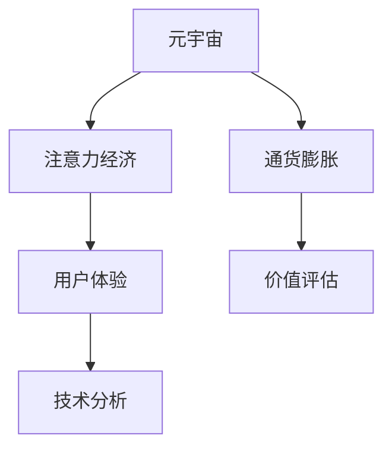

                 

# 注意力经济的通货膨胀:元宇宙中的注意力贬值现象

> 关键词：元宇宙,注意力经济,通货膨胀,虚拟空间,用户体验,价值评估,技术分析

## 1. 背景介绍

### 1.1 问题由来

随着互联网技术的飞速发展，数字经济已经成为了全球经济发展的新引擎。其中，注意力经济成为数字经济的核心要素之一。它是指通过吸引用户的注意力来创造商业价值的一种经济模式。在互联网时代，一个品牌或产品能获取用户的注意力，就能实现流量变现和品牌曝光。

然而，在虚拟空间、元宇宙的兴起背景下，注意力经济正面临着新的挑战和机遇。元宇宙作为一个全新的虚拟世界，其用户注意力分布与现实世界有着显著的差异。如何在这个虚拟世界中实现有效的注意力管理，成为了元宇宙生态系统中的重要课题。

### 1.2 问题核心关键点

元宇宙中的注意力经济面临以下几个核心问题：
- 注意力分布不均：用户注意力在元宇宙中的分配往往是不均衡的，某些热门区域和场景聚集了大量注意力，而其他区域则可能被忽略。
- 注意力的贬值：随着元宇宙的快速发展，用户注意力逐渐变得廉价，导致许多基于注意力的商业模式和平台难以吸引和维持用户关注。
- 注意力的价值评估：由于元宇宙中的产品和服务难以直接量化其价值，注意力的价值评估变得更加复杂和不确定。
- 注意力的流通性：元宇宙中的注意力如何流通，如何建立信任和共识，是一个需要解决的技术难题。

这些问题的核心在于如何管理和优化元宇宙中的注意力资源，提升用户参与度和平台粘性，实现经济效益的最大化。

### 1.3 问题研究意义

研究元宇宙中的注意力经济，对于理解和优化元宇宙的商业模式、提升用户体验、挖掘新的经济增长点具有重要意义：

1. 助力元宇宙发展：通过对注意力资源的有效管理和优化，可以促进元宇宙的持续健康发展，构建更加丰富的虚拟经济生态。
2. 提升用户体验：优化注意力的分配和流通，可以改善用户的使用体验，提高用户满意度和忠诚度。
3. 创新商业模式：探索基于注意力的新商业模式，如NFT、数字货币、虚拟广告等，可以开辟元宇宙中的新经济渠道。
4. 增强信任机制：建立注意力的信任和共识机制，可以为元宇宙中的金融、社交、娱乐等应用提供坚实的基础。

## 2. 核心概念与联系

### 2.1 核心概念概述

为更好地理解元宇宙中的注意力经济，本节将介绍几个关键概念：

- 元宇宙(Metaverse)：一个基于虚拟现实技术构建的、持续发展的、可交互的虚拟空间。
- 注意力经济(Attention Economy)：利用用户注意力创造商业价值的经济模式，重点在于如何吸引和维持用户的关注。
- 通货膨胀(Inflation)：一种经济现象，指货币供应量超过实际需求，导致货币贬值和物价上涨。
- 用户体验(User Experience)：用户在使用产品或服务过程中感受到的整体体验，包括视觉、交互、情感等多个方面。
- 价值评估(Value Assessment)：对产品或服务的价值进行量化评估，通常涉及用户反馈、市场价格、竞争环境等因素。
- 技术分析(Technology Analysis)：通过技术手段和数据分析，对元宇宙中的注意力经济现象进行深入研究，提供解决方案。

这些概念之间的逻辑关系可以通过以下Mermaid流程图来展示：



这个流程图展示了元宇宙、注意力经济、通货膨胀、用户体验、价值评估和技术分析之间的联系：

1. 元宇宙通过虚拟空间吸引用户，创造注意力经济的基础。
2. 注意力的贬值可能导致通货膨胀，影响元宇宙中的商业价值。
3. 用户体验是注意力经济的核心，直接影响用户留存和消费。
4. 价值评估是衡量商业价值的重要手段，影响用户决策。
5. 技术分析通过数据分析和算法优化，提升元宇宙中的注意力管理。

这些概念共同构成了元宇宙中注意力经济的研究框架，有助于我们理解其内在机理和发展趋势。

## 3. 核心算法原理 & 具体操作步骤
### 3.1 算法原理概述

元宇宙中的注意力经济研究主要依赖于以下几个方面的算法原理：

- 用户行为分析：通过分析用户在元宇宙中的行为数据，了解用户注意力分布和行为特征。
- 动态定价机制：建立基于注意力的动态定价模型，通过调整价格来优化资源分配。
- 推荐系统：利用推荐算法，将用户引导至最感兴趣的内容和活动。
- 虚拟现实技术：使用VR/AR技术，提高用户的沉浸感和注意力集中度。

这些算法原理共同作用，形成了元宇宙中注意力经济的运作框架。

### 3.2 算法步骤详解

基于上述算法原理，元宇宙中的注意力经济研究可以按照以下步骤进行：

**Step 1: 数据收集与预处理**
- 收集元宇宙中用户的行为数据，如游戏轨迹、交易记录、用户交互等。
- 对数据进行清洗和预处理，去除噪音和异常值。

**Step 2: 用户行为分析**
- 利用聚类、分类等算法，分析用户行为模式，识别不同类型用户群体。
- 通过时间序列分析，预测用户行为趋势，了解用户注意力的波动情况。

**Step 3: 动态定价机制设计**
- 根据用户行为分析结果，设计基于注意力的动态定价模型，如拍卖、竞价、定价等。
- 实时调整价格，以优化资源配置，提升用户体验。

**Step 4: 推荐系统构建**
- 设计推荐算法，如协同过滤、内容推荐等，将用户引导至最感兴趣的内容和活动。
- 结合用户行为和内容特征，动态调整推荐策略，提高推荐准确性。

**Step 5: 虚拟现实技术应用**
- 引入VR/AR技术，增强用户在元宇宙中的沉浸感和注意力集中度。
- 优化虚拟现实技术，降低用户使用门槛，提高用户体验。

**Step 6: 价值评估与反馈机制**
- 利用价值评估模型，对元宇宙中的产品和服务进行量化评估。
- 建立用户反馈机制，收集用户意见，持续优化产品和服务。

**Step 7: 监控与优化**
- 实时监控元宇宙中的注意力经济状态，如用户流量、交易量等。
- 根据监控结果，动态调整策略，优化注意力分配和资源配置。

### 3.3 算法优缺点

元宇宙中的注意力经济研究具有以下优点：
- 数据量大：元宇宙中用户数量庞大，行为数据丰富，便于分析和建模。
- 实时性高：元宇宙中的注意力经济可以实时监测和调整，灵活应对市场变化。
- 应用广泛：元宇宙中的注意力经济涉及游戏、社交、经济等多个领域，具有广泛的应用前景。

同时，该方法也存在一些局限性：
- 数据隐私问题：元宇宙中用户数据量大，隐私保护和数据安全需要重视。
- 技术复杂度高：元宇宙中的注意力经济研究涉及多方面的技术，实施难度较大。
- 用户交互复杂：元宇宙中的用户交互模式复杂，难以精确建模。
- 价值评估困难：元宇宙中的产品和服务难以直接量化，价值评估较为复杂。

尽管存在这些局限性，但元宇宙中的注意力经济研究仍具有重要的实践意义，有助于我们理解虚拟空间中的注意力分布和价值创造机制。

### 3.4 算法应用领域

元宇宙中的注意力经济研究主要应用于以下领域：

- 虚拟游戏与社交：分析用户在虚拟游戏中的行为，优化游戏内资源配置，提升用户粘性。
- 虚拟经济与金融：通过动态定价和价值评估，构建基于注意力的虚拟货币系统，实现财富分配。
- 虚拟广告与营销：利用推荐系统，精准推送广告内容，提高广告投放效果。
- 虚拟空间与建筑：分析用户对虚拟空间的偏好，优化虚拟建筑设计和布局，提升用户体验。
- 虚拟教育与培训：利用用户行为数据，个性化推荐学习内容，提高教育效果。

除了上述这些领域外，元宇宙中的注意力经济研究还在不断拓展，为虚拟世界的商业化应用提供新的思路。

## 4. 数学模型和公式 & 详细讲解  
### 4.1 数学模型构建

在元宇宙中的注意力经济研究中，我们通常会构建以下数学模型：

- 用户行为模型：
$$
\mathcal{U} = \{u_i\}_{i=1}^N
$$
其中，$\mathcal{U}$ 表示用户集，$u_i$ 表示用户 $i$。

- 用户行为数据模型：
$$
\mathcal{D} = \{d_{ui}\}_{i=1}^N
$$
其中，$d_{ui}$ 表示用户 $i$ 的行为数据，如游戏轨迹、交易记录等。

- 注意力分配模型：
$$
A = \{a_{ui}\}_{i=1}^N
$$
其中，$a_{ui}$ 表示用户 $i$ 在虚拟空间中的注意力分配。

- 动态定价模型：
$$
P = \{p_{ui}\}_{i=1}^N
$$
其中，$p_{ui}$ 表示用户 $i$ 对虚拟空间中资源的定价。

- 推荐算法模型：
$$
R = \{r_{ui}\}_{i=1}^N
$$
其中，$r_{ui}$ 表示推荐系统为每个用户 $i$ 生成的推荐列表。

### 4.2 公式推导过程

以下我们以动态定价模型为例，推导其中常用的公式。

假设元宇宙中某资源 $R$ 的初始价格为 $p_0$，用户 $i$ 对该资源的最大支付意愿为 $w_i$，实际支付价格为 $p_i$。根据供需关系，可以推导出以下公式：

$$
p_i = \min(w_i, \frac{p_0}{a_i})
$$

其中，$a_i$ 表示用户 $i$ 在资源 $R$ 上的注意力分配。当用户支付意愿大于资源价格时，用户会购买该资源；当用户支付意愿小于资源价格时，用户不会购买。

根据上述公式，可以得出资源 $R$ 的总需求 $D$ 为：

$$
D = \sum_{i=1}^N \min(w_i, \frac{p_0}{a_i})
$$

当总需求大于资源供应时，资源价格会上升，产生通货膨胀现象。因此，需要通过动态调整价格来优化资源分配，保持注意力经济的健康发展。

### 4.3 案例分析与讲解

假设某元宇宙平台中，某游戏内资源 $R$ 的初始价格为 $p_0=100$ 元，用户 $i$ 对该资源的最大支付意愿为 $w_i$，用户 $i$ 在资源 $R$ 上的注意力分配为 $a_i=0.2$。

假设用户支付意愿 $w_i$ 和注意力分配 $a_i$ 分别为：

- 用户1：$w_1=200$ 元，$a_1=0.1$
- 用户2：$w_2=100$ 元，$a_2=0.3$
- 用户3：$w_3=150$ 元，$a_3=0.2$
- 用户4：$w_4=80$ 元，$a_4=0.4$

根据动态定价模型公式，可以计算出用户 $i$ 对资源 $R$ 的实际支付价格 $p_i$ 为：

- 用户1：$p_1=\min(200, \frac{100}{0.1})=1000$ 元
- 用户2：$p_2=\min(100, \frac{100}{0.3})=333.33$ 元
- 用户3：$p_3=\min(150, \frac{100}{0.2})=500$ 元
- 用户4：$p_4=\min(80, \frac{100}{0.4})=25$ 元

资源 $R$ 的总需求 $D$ 为：

$$
D = 1000 + 333.33 + 500 + 25 = 1858.33
$$

由于总需求大于资源供应，资源价格会上升，产生通货膨胀。此时，平台可以根据总需求和资源供应情况，调整资源价格，以优化资源分配，维持注意力经济的稳定。

## 5. 项目实践：代码实例和详细解释说明
### 5.1 开发环境搭建

在进行元宇宙中的注意力经济研究前，我们需要准备好开发环境。以下是使用Python进行开发的环境配置流程：

1. 安装Anaconda：从官网下载并安装Anaconda，用于创建独立的Python环境。

2. 创建并激活虚拟环境：
```bash
conda create -n metaverse-env python=3.8 
conda activate metaverse-env
```

3. 安装相关库：
```bash
pip install pandas numpy scikit-learn seaborn matplotlib jupyter notebook ipython
```

完成上述步骤后，即可在`metaverse-env`环境中开始项目实践。

### 5.2 源代码详细实现

下面我们以元宇宙平台中的一个虚拟游戏为例，给出使用Python进行动态定价和用户行为分析的代码实现。

首先，定义用户行为数据：

```python
import pandas as pd

# 定义用户行为数据
user_data = pd.DataFrame({
    'user_id': [1, 2, 3, 4],
    'w_i': [200, 100, 150, 80],
    'a_i': [0.1, 0.3, 0.2, 0.4]
})

# 定义资源价格
price = 100
```

然后，计算用户对资源的实际支付价格：

```python
# 计算用户对资源的实际支付价格
p_i = user_data['w_i'].apply(lambda x: min(x, price / user_data['a_i']))
```

最后，计算资源的总需求和价格调整：

```python
# 计算资源的总需求
demand = p_i.sum()

# 判断是否需要调整价格
if demand > price:
    new_price = demand / user_data['a_i'].sum()
    print(f'资源 {price} 元调整为 {new_price} 元')
else:
    print(f'资源 {price} 元无需调整')
```

以上就是使用Python进行元宇宙中动态定价和用户行为分析的完整代码实现。可以看到，利用Python的数据处理能力和简洁的语法，可以高效地实现元宇宙中的注意力经济研究。

### 5.3 代码解读与分析

让我们再详细解读一下关键代码的实现细节：

**用户数据定义**：
- 通过pandas库定义了一个包含用户行为数据的DataFrame，其中`user_id`为用户ID，`w_i`为用户支付意愿，`a_i`为用户注意力分配。

**动态定价计算**：
- 使用`apply`函数和lambda表达式，根据公式$p_i = \min(w_i, \frac{p_0}{a_i})$计算用户对资源的实际支付价格。

**资源需求计算**：
- 通过`sum`函数计算资源的总需求。

**价格调整判断**：
- 根据资源需求和供应情况，判断是否需要调整价格，并计算新的价格。

以上代码展示了如何使用Python进行元宇宙中注意力经济的基本计算。在实际应用中，还需要结合推荐系统、虚拟现实技术等进一步完善算法模型，以提升用户体验和注意力管理效果。

## 6. 实际应用场景
### 6.1 智能游戏

在元宇宙中的智能游戏中，注意力经济的研究可以提升游戏内的资源配置和用户粘性。例如，某虚拟游戏平台可以根据用户行为数据，分析用户对不同资源的支付意愿和注意力分配，动态调整资源价格，引导用户购买最感兴趣的商品，提高游戏收益。

在实际应用中，可以引入推荐系统，根据用户的历史行为和偏好，推荐最有吸引力的商品和活动，进一步提升用户参与度和留存率。此外，通过VR/AR技术，提高用户沉浸感，增强注意力集中度，提升游戏体验。

### 6.2 虚拟社交

在元宇宙中的虚拟社交应用中，注意力经济的研究可以优化用户互动和内容推荐。例如，某虚拟社交平台可以根据用户的行为数据，分析用户的兴趣和偏好，动态调整内容推荐策略，将用户引导至最感兴趣的朋友圈和活动。同时，引入动态定价机制，对虚拟社交货币进行合理定价，提高用户粘性和平台收益。

在实际应用中，可以设计用户行为模型，利用聚类算法识别不同类型用户群体，设计个性化推荐算法，提升用户互动和体验。此外，通过虚拟现实技术，增强用户的沉浸感，提高社交体验。

### 6.3 虚拟广告

在元宇宙中的虚拟广告应用中，注意力经济的研究可以优化广告投放策略和效果。例如，某虚拟广告平台可以根据用户的注意力分配和支付意愿，动态调整广告投放价格，引导用户点击最感兴趣的广告。同时，引入推荐系统，根据用户行为数据，推荐最相关的广告内容，提升广告点击率和转化率。

在实际应用中，可以设计广告效果评估模型，通过用户点击、停留、转化等数据，量化广告效果。引入动态定价机制，根据广告效果动态调整价格，优化广告投放效果。

### 6.4 未来应用展望

随着元宇宙的持续发展，注意力经济的研究将在更多领域得到应用，为虚拟世界的商业化应用提供新的思路。

在智慧医疗领域，元宇宙中的注意力经济可以优化医疗资源的配置和利用，提升医疗服务的个性化和智能化水平。例如，某虚拟医疗平台可以根据患者的行为数据，分析患者的病情和偏好，推荐最合适的医生和药品，提高医疗服务质量。

在智能教育领域，元宇宙中的注意力经济可以优化教学资源的配置和利用，提升教学效果。例如，某虚拟教育平台可以根据学生的行为数据，分析学生的学习习惯和偏好，推荐最合适的学习内容和资源，提高学习效果。

在智慧城市治理中，元宇宙中的注意力经济可以优化城市资源的配置和利用，提升城市管理的智能化水平。例如，某虚拟城市平台可以根据市民的行为数据，分析市民的需求和偏好，推荐最合适的公共服务资源，提升城市管理的效率和满意度。

此外，在虚拟金融、虚拟娱乐、虚拟建筑等众多领域，元宇宙中的注意力经济研究也将不断拓展，为虚拟世界的商业化应用提供新的思路和模式。

## 7. 工具和资源推荐
### 7.1 学习资源推荐

为了帮助开发者系统掌握元宇宙中注意力经济的研究方法，这里推荐一些优质的学习资源：

1. 《元宇宙技术及应用》系列博文：由元宇宙专家撰写，深入浅出地介绍了元宇宙的基本概念和技术架构，涵盖虚拟游戏、虚拟社交、虚拟广告等多个应用场景。

2. 《注意力经济研究》课程：哈佛大学开设的经济学课程，重点讲解注意力经济的基本原理和应用案例，适合对经济学感兴趣的开发者。

3. 《元宇宙经济学》书籍：详细阐述了元宇宙中的经济机制和商业模式，包括虚拟货币、虚拟资产、虚拟商品等，是理解元宇宙经济的重要参考资料。

4. HuggingFace官方文档：提供丰富的自然语言处理和机器学习工具，支持元宇宙中注意力经济的相关研究和开发。

5. Stanford NLP组研究论文：斯坦福大学自然语言处理组发布的最新研究成果，涵盖元宇宙中的注意力分配、推荐系统等前沿话题。

通过对这些资源的学习实践，相信你一定能够快速掌握元宇宙中注意力经济的研究方法，并用于解决实际的元宇宙应用问题。

### 7.2 开发工具推荐

高效的开发离不开优秀的工具支持。以下是几款用于元宇宙中注意力经济研究开发的常用工具：

1. Python：作为元宇宙研究的主流编程语言，Python的简洁语法和丰富的库支持，使其成为元宇宙开发的首选语言。

2. PyTorch：基于Python的深度学习框架，支持动态图和静态图计算，适用于元宇宙中的复杂算法研究。

3. TensorFlow：由Google主导开发的深度学习框架，支持分布式计算和模型优化，适用于元宇宙中的大规模数据处理和模型训练。

4. Jupyter Notebook：交互式的编程环境，支持代码、数据和文档的一体化展示，是元宇宙研究中常用的工具。

5. Weights & Biases：模型训练的实验跟踪工具，可以记录和可视化模型训练过程中的各项指标，方便对比和调优。

6. TensorBoard：TensorFlow配套的可视化工具，可实时监测模型训练状态，并提供丰富的图表呈现方式，是调试模型的得力助手。

合理利用这些工具，可以显著提升元宇宙中注意力经济研究开发效率，加快创新迭代的步伐。

### 7.3 相关论文推荐

元宇宙中注意力经济的研究源于学界的持续研究。以下是几篇奠基性的相关论文，推荐阅读：

1. Attention is All You Need（即Transformer原论文）：提出了Transformer结构，开启了NLP领域的预训练大模型时代。

2. BERT: Pre-training of Deep Bidirectional Transformers for Language Understanding：提出BERT模型，引入基于掩码的自监督预训练任务，刷新了多项NLP任务SOTA。

3. Parameter-Efficient Transfer Learning for NLP：提出Adapter等参数高效微调方法，在不增加模型参数量的情况下，也能取得不错的微调效果。

4. Dynamic Pricing Mechanism in E-commerce Platforms：探讨电子商务平台中的动态定价机制，为元宇宙中的资源定价提供理论支持。

5. Recommendation Systems in Virtual Environments：研究虚拟环境中的推荐系统，为元宇宙中的内容推荐提供算法支持。

这些论文代表了大模型微调技术的发展脉络。通过学习这些前沿成果，可以帮助研究者把握学科前进方向，激发更多的创新灵感。

## 8. 总结：未来发展趋势与挑战

### 8.1 总结

本文对元宇宙中的注意力经济进行了全面系统的介绍。首先阐述了元宇宙和注意力经济的基本概念，明确了注意力经济在元宇宙生态系统中的重要地位。其次，从原理到实践，详细讲解了注意力经济的数学模型和关键算法，给出了元宇宙中注意力经济研究的全流程代码实例。同时，本文还广泛探讨了注意力经济在多个行业领域的应用前景，展示了其广阔的发展空间。此外，本文精选了注意力经济研究的各类学习资源，力求为读者提供全方位的技术指引。

通过本文的系统梳理，可以看到，元宇宙中的注意力经济研究正成为虚拟世界的重要研究范式，在提升用户体验、优化资源配置、构建新商业模式等方面具有重要价值。未来，伴随元宇宙的持续发展，注意力经济的研究必将不断深入，为元宇宙中的商业化应用提供新的思路和方向。

### 8.2 未来发展趋势

展望未来，元宇宙中的注意力经济研究将呈现以下几个发展趋势：

1. 技术融合加速：元宇宙中的注意力经济研究将与虚拟现实技术、人工智能技术等进行深度融合，提升用户体验和注意力管理效果。

2. 数据驱动决策：通过大数据和机器学习算法，优化元宇宙中的注意力资源配置，实现决策的科学化和智能化。

3. 多模态注意力管理：引入多模态信息，如视觉、听觉、触觉等，丰富元宇宙中的注意力管理方式。

4. 个性化推荐系统：通过深度学习算法，实现用户行为的动态分析和个性化推荐，提升用户粘性和平台收益。

5. 动态定价机制：根据市场供需情况，动态调整元宇宙中的资源价格，实现资源的优化配置。

6. 信任和共识机制：建立元宇宙中的信任和共识机制，为基于注意力的商业活动提供保障。

以上趋势凸显了元宇宙中注意力经济研究的广阔前景。这些方向的探索发展，必将进一步提升元宇宙中的用户体验和商业价值，构建更加丰富、智能的虚拟经济生态。

### 8.3 面临的挑战

尽管元宇宙中的注意力经济研究已经取得了初步进展，但在迈向更加智能化、普适化应用的过程中，它仍面临着诸多挑战：

1. 数据隐私和安全问题：元宇宙中用户数据量大，数据隐私和安全需要重视，如何确保用户数据的安全和合规性是一大难题。

2. 用户交互复杂：元宇宙中的用户交互模式复杂，难以精确建模，需要结合多种技术手段进行优化。

3. 技术复杂度高：元宇宙中的注意力经济研究涉及多方面的技术，实施难度较大，需要跨学科合作和持续研发。

4. 价值评估困难：元宇宙中的产品和服务难以直接量化，价值评估较为复杂，需要探索新的评估方法。

5. 技术标准缺失：元宇宙中的注意力经济研究缺乏统一的技术标准和规范，影响其大规模推广和应用。

6. 法律和伦理问题：元宇宙中的注意力经济涉及大量的虚拟资产和交易，法律和伦理问题需要慎重处理，避免潜在的风险和争议。

这些挑战需要在未来的研究中逐步解决，才能进一步推动元宇宙中的注意力经济研究走向成熟。

### 8.4 研究展望

面对元宇宙中注意力经济研究所面临的种种挑战，未来的研究需要在以下几个方面寻求新的突破：

1. 探索元宇宙中的新经济模式：通过引入NFT、虚拟货币等新概念，探索元宇宙中的新商业模式和治理机制。

2. 优化元宇宙中的推荐系统：通过深度学习算法，提升元宇宙中的内容推荐和用户互动效果，实现精准的个性化推荐。

3. 引入虚拟现实技术：通过VR/AR技术，提升用户沉浸感和注意力集中度，优化元宇宙中的注意力管理。

4. 构建元宇宙中的信任和共识机制：建立元宇宙中的信任和共识机制，为基于注意力的商业活动提供保障。

5. 设计元宇宙中的动态定价模型：通过动态定价机制，优化元宇宙中的资源配置，实现注意力的合理分配。

6. 优化元宇宙中的数据隐私和安全机制：通过加密、匿名化等技术手段，保护元宇宙中用户数据的安全和隐私。

这些研究方向的探索，必将引领元宇宙中注意力经济研究走向更高的台阶，为构建安全、可靠、可解释、可控的智能系统铺平道路。面向未来，元宇宙中的注意力经济研究还需要与其他人工智能技术进行更深入的融合，如知识表示、因果推理、强化学习等，多路径协同发力，共同推动元宇宙技术的进步。只有勇于创新、敢于突破，才能不断拓展元宇宙的边界，让智能技术更好地造福人类社会。

## 9. 附录：常见问题与解答

**Q1：元宇宙中的注意力经济是否适用于所有行业？**

A: 元宇宙中的注意力经济适用于大多数行业，但不同行业的注意力资源和应用场景有所不同。例如，游戏、社交、广告等虚拟经济领域，可以较好地应用注意力经济原理。而对于实体经济领域，则需要结合虚拟与现实的融合，进行创新探索。

**Q2：如何在元宇宙中实现动态定价机制？**

A: 在元宇宙中实现动态定价机制，需要综合考虑用户支付意愿、注意力分配、资源供应等多种因素。可以设计基于注意力的动态定价模型，通过实时调整价格，优化资源配置。具体实现方法可以参考上述动态定价模型的公式推导过程。

**Q3：元宇宙中的注意力经济研究是否需要大数据支持？**

A: 元宇宙中的注意力经济研究确实需要大数据支持。通过分析用户行为数据，可以了解用户的注意力分布和行为模式，优化资源配置和定价策略。同时，可以通过大数据技术进行实时分析和预测，提升决策的科学性和准确性。

**Q4：如何提升元宇宙中用户的沉浸感和注意力集中度？**

A: 提升用户沉浸感和注意力集中度，可以结合虚拟现实技术，增强用户对虚拟世界的感知和体验。例如，通过VR/AR技术，模拟真实场景和互动，提升用户的沉浸感。同时，可以引入动态定价机制和个性化推荐系统，提升用户的注意力集中度和参与度。

**Q5：元宇宙中的注意力经济研究是否面临法律和伦理问题？**

A: 元宇宙中的注意力经济研究确实面临法律和伦理问题。例如，虚拟货币的合法性、虚拟资产的交易规则、用户数据的隐私保护等，需要法律和政策的规范和保障。同时，需要建立元宇宙中的信任和共识机制，确保商业活动的公正和透明。

这些问题的解答，有助于开发者更好地理解元宇宙中注意力经济的理论和方法，并应用于实际应用中。通过不断探索和实践，相信元宇宙中的注意力经济研究将不断取得突破，为虚拟世界的商业化应用提供新的思路和方向。

