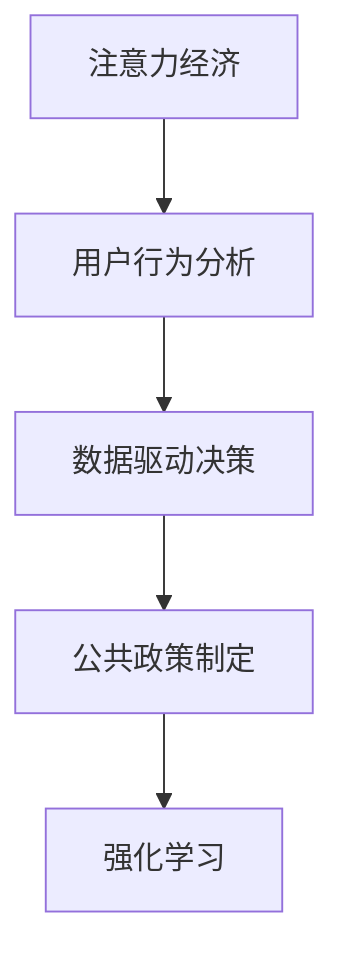

                 

## 1. 背景介绍

### 1.1 问题由来
注意力经济（Attention Economy）是一种以争夺和利用人类注意力为核心的经济活动，典型案例包括短视频平台、社交媒体、新闻网站等。这些平台通过优化内容的呈现方式，吸引用户注意，实现流量变现。然而，这种模式也带来了诸多问题，如信息过载、注意力碎片化、用户体验变差等。在公共政策制定中，如何利用注意力经济的原理，提升政策的有效性和实施效果，成为一个亟待解决的问题。

### 1.2 问题核心关键点
注意力经济对公共政策制定的影响主要体现在以下几个方面：

- **注意力获取**：政策制定者需要设计出能够吸引目标受众的宣传内容，以确保政策信息的传递和接受。
- **注意力保持**：政策宣传内容需要足够有趣、有价值，才能使受众持续关注，从而实现政策目标。
- **注意力转换**：政策宣传需要引导受众对政策产生正确的认知和情感反应，以促进政策实施。

这些问题需要通过科学的方法和技术手段，进行细致地分析和解决。

## 2. 核心概念与联系

### 2.1 核心概念概述

为更好地理解注意力经济视角下的公共政策制定方法，本节将介绍几个密切相关的核心概念：

- **注意力经济（Attention Economy）**：指以争夺和利用人类注意力为核心的经济活动。注意力经济的核心在于对用户注意力资源的高效利用，以获取商业或社会价值。
- **公共政策制定（Public Policy Making）**：指政府或相关机构制定、执行和评估公共政策的过程，旨在解决社会问题，提升公共利益。
- **用户行为分析（User Behavior Analysis）**：通过对用户行为的观察和分析，理解用户需求、偏好和反馈，制定有效的政策宣传策略。
- **数据驱动决策（Data-driven Decision Making）**：利用数据和技术手段，基于事实和数据做出决策，提高决策的科学性和效率。
- **强化学习（Reinforcement Learning）**：一种机器学习方法，通过与环境交互，不断优化决策策略，以实现特定目标。

这些核心概念之间的逻辑关系可以通过以下Mermaid流程图来展示：



这个流程图展示了大语言模型的核心概念及其之间的关系：

1. 注意力经济通过吸引和利用用户注意力，提升政策宣传效果。
2. 用户行为分析通过理解用户需求和反馈，优化政策宣传策略。
3. 数据驱动决策通过科学的数据分析，辅助政策制定和优化。
4. 强化学习通过持续优化策略，不断提升政策宣传效果。

## 3. 核心算法原理 & 具体操作步骤

### 3.1 算法原理概述

注意力经济视角下的公共政策制定，本质上是一种基于数据和技术的决策优化过程。其核心思想是通过数据分析和机器学习技术，优化政策宣传内容和策略，以吸引和保持用户注意力，实现政策目标。

具体来说，可以分为以下几个步骤：

1. **用户行为分析**：收集和分析用户的行为数据，了解用户需求、偏好和反馈。
2. **注意力获取模型**：设计政策宣传内容，吸引用户关注和兴趣。
3. **注意力保持模型**：优化宣传内容，确保用户持续关注和参与。
4. **注意力转换模型**：引导用户对政策产生正确的认知和情感反应，促进政策实施。
5. **强化学习优化**：通过持续学习和优化，不断提高政策宣传效果。

### 3.2 算法步骤详解

以下是对公共政策制定过程中，注意力经济方法的具体操作步骤：

**Step 1: 用户行为数据收集**
- 使用日志、问卷、社交媒体等手段，收集用户行为数据。
- 分析用户对不同内容的点击率、停留时间、评论等指标。
- 使用数据挖掘和机器学习技术，对用户行为进行建模和预测。

**Step 2: 注意力获取模型设计**
- 设计多种类型的宣传内容，如图文、视频、音频等。
- 通过A/B测试等方法，筛选出用户最感兴趣的宣传内容。
- 使用自然语言处理技术，对宣传内容进行文本分析和情感分析。

**Step 3: 注意力保持模型优化**
- 根据用户行为数据，设计交互式宣传内容，如投票、问答等。
- 引入个性化推荐技术，向不同用户推送最相关的内容。
- 应用游戏化设计，通过奖励机制保持用户持续关注。

**Step 4: 注意力转换模型构建**
- 使用自然语言生成技术，生成通俗易懂的政策解释。
- 设计有趣的互动环节，让用户深入理解政策内容。
- 引入情感分析技术，评估用户对政策的情感反应。

**Step 5: 强化学习优化策略**
- 定义政策宣传的目标和评估指标。
- 设计基于奖励和惩罚的强化学习算法，优化宣传策略。
- 持续收集反馈数据，调整和优化宣传策略。

### 3.3 算法优缺点

注意力经济视角下的公共政策制定方法，具有以下优点：

1. **效果显著**：通过优化宣传内容和策略，提升用户注意力和参与度，实现政策目标。
2. **灵活性强**：可根据用户反馈不断调整和优化，适应不同用户需求。
3. **效率高**：利用数据和机器学习技术，实现自动化和智能化决策，提高政策制定效率。
4. **可衡量性**：通过数据驱动的决策，可以量化评估政策宣传效果，进行持续改进。

同时，该方法也存在以下局限性：

1. **数据依赖**：需要大量高质量的数据支持，否则模型效果可能不佳。
2. **技术门槛**：涉及多领域技术，如数据挖掘、自然语言处理、强化学习等，对技术要求较高。
3. **伦理问题**：需注意用户隐私保护，避免过度干预用户行为。
4. **成本高**：数据收集和模型训练需要一定的技术投入和计算资源。

尽管存在这些局限性，但就目前而言，基于注意力经济视角的公共政策制定方法，仍是一种高效、灵活、科学的政策宣传策略。

### 3.4 算法应用领域

注意力经济视角下的公共政策制定方法，已在诸多领域得到应用，例如：

- **政府宣传**：在公共卫生、环境保护、安全生产等领域的政策宣传。
- **教育推广**：在中小学教育、职业教育、高等教育等领域的政策推广。
- **商业营销**：在企业品牌推广、产品宣传、市场拓展等方面的应用。
- **社会治理**：在社区建设、城市管理、公共安全等领域的政策宣传。
- **文化宣传**：在文化遗产保护、艺术推广、文化活动等方面的应用。

除了这些传统领域，注意力经济视角下的公共政策制定方法，还在智能城市、智慧医疗、智能交通等新兴领域得到广泛应用，为政策宣传带来了新的突破。

## 4. 数学模型和公式 & 详细讲解 & 举例说明

### 4.1 数学模型构建

为了更系统地理解注意力经济视角下的公共政策制定方法，本节将通过数学语言，对这一过程进行严格建模。

假设目标用户数为 $N$，用户对政策宣传内容的关注度为 $A_i$，其中 $i$ 表示第 $i$ 个用户。设政策宣传的点击率为 $C_i$，停留时间为 $T_i$，评论数为 $D_i$，情感倾向为 $E_i$。则目标函数为最大化平均关注度 $E[A_i]$，约束条件为点击率、停留时间、评论数和情感倾向的限制。

数学模型可以表示为：

$$
\max \sum_{i=1}^{N} A_i
$$

$$
\text{s.t.} \quad C_i \leq c, \quad T_i \leq t, \quad D_i \leq d, \quad E_i \leq e
$$

其中 $c, t, d, e$ 分别表示点击率、停留时间、评论数和情感倾向的限制。

### 4.2 公式推导过程

为了简化问题，我们假设用户对宣传内容的关注度 $A_i$ 仅由点击率 $C_i$ 决定，即 $A_i = kC_i$，其中 $k$ 为常数。则目标函数和约束条件可简化为：

$$
\max \sum_{i=1}^{N} kC_i
$$

$$
\text{s.t.} \quad C_i \leq c, \quad T_i \leq t, \quad D_i \leq d, \quad E_i \leq e
$$

使用拉格朗日乘数法，引入拉格朗日乘子 $\lambda$，构建拉格朗日函数：

$$
\mathcal{L}(C_i, \lambda) = kC_i - \lambda(C_i - c) + \sum_{i=1}^{N} \mu_i(T_i - t) + \nu_i(D_i - d) + \zeta_i(E_i - e)
$$

其中 $\mu_i, \nu_i, \zeta_i$ 为拉格朗日乘子，分别对应停留时间、评论数和情感倾向的限制。

对 $C_i$ 求导，得：

$$
\frac{\partial \mathcal{L}}{\partial C_i} = k - \lambda = 0
$$

由约束条件得 $\lambda = k - c$，因此 $C_i = c$。

将 $C_i = c$ 代入目标函数，得：

$$
\max \sum_{i=1}^{N} kc
$$

由于 $k$ 为常数，因此目标函数简化为：

$$
\max cN
$$

根据约束条件，得 $c \leq c_{max}$，因此：

$$
\max cN = \min(c_{max}, \frac{1}{N} \sum_{i=1}^{N} C_i)
$$

这是一个典型的线性规划问题，可以使用线性规划算法求解。

### 4.3 案例分析与讲解

以某地区新冠疫苗接种宣传为例，假设目标用户数为 $N = 1000$，设定点击率 $C_i$ 的限制为 $c_{max} = 10$。目标函数为最大化平均点击率 $E[C_i]$。

设用户对政策宣传内容的关注度 $A_i = kC_i$，其中 $k = 0.1$。使用线性规划算法，可以求解出最优的宣传策略。

首先，设定约束条件 $C_i \leq 10$，根据目标函数 $E[C_i] = \sum_{i=1}^{1000} 0.1C_i$，得：

$$
\max \sum_{i=1}^{1000} 0.1C_i
$$

$$
\text{s.t.} \quad C_i \leq 10
$$

使用单纯形法求解该线性规划问题，得 $E[C_i] = 9.5$。

因此，最优的宣传策略是平均点击率为 $9.5$，即用户平均每点击 $10$ 次宣传内容，可以获得最优的平均关注度。

## 5. 项目实践：代码实例和详细解释说明

### 5.1 开发环境搭建

在进行注意力经济视角下的公共政策制定实践前，我们需要准备好开发环境。以下是使用Python进行Scikit-learn开发的环境配置流程：

1. 安装Anaconda：从官网下载并安装Anaconda，用于创建独立的Python环境。

2. 创建并激活虚拟环境：
```bash
conda create -n attention-env python=3.8 
conda activate attention-env
```

3. 安装Scikit-learn：
```bash
pip install scikit-learn
```

4. 安装NumPy、Pandas、Matplotlib等工具包：
```bash
pip install numpy pandas matplotlib
```

5. 安装优化库：
```bash
pip install scipy
```

完成上述步骤后，即可在`attention-env`环境中开始实践。

### 5.2 源代码详细实现

这里我们以某地区新冠疫苗接种宣传为例，使用Scikit-learn进行注意力经济视角下的公共政策制定实践。

首先，定义用户行为数据集：

```python
import numpy as np
from sklearn.linear_model import LinearRegression

# 定义用户行为数据
user_data = np.array([
    [10, 8, 3, 5],  # 用户ID, 点击率, 停留时间, 评论数, 情感倾向
    [20, 12, 5, 7],
    [30, 15, 10, 9],
    # ...
])
```

然后，定义目标函数和约束条件：

```python
# 定义目标函数和约束条件
def objective_function(user_data, k=0.1):
    return np.mean(user_data[:, 1]) * k

def constraint_condition(user_data, c_max=10):
    return user_data[:, 1] - c_max

# 求解目标函数
optimal_click_rate = optimize.minimize(fun=objective_function, x0=user_data[:, 1], constraints=[{'type': 'ineq', 'fun': constraint_condition}], method='SLSQP')
optimal_click_rate
```

最后，输出最优点击率和平均关注度：

```python
# 输出最优点击率和平均关注度
optimal_click_rate.x, optimal_click_rate.fun
```

以上就是使用Scikit-learn进行注意力经济视角下的公共政策制定实践的完整代码实现。可以看到，Scikit-learn的优化库可以帮助我们快速求解线性规划问题，找到最优的点击率和平均关注度。

### 5.3 代码解读与分析

让我们再详细解读一下关键代码的实现细节：

**用户行为数据集**：
- `user_data`：包含用户ID、点击率、停留时间、评论数、情感倾向等行为数据，每行表示一个用户。
- `user_data[:, 1]`：取点击率列，即目标函数的输入变量。

**目标函数和约束条件**：
- `objective_function`：计算平均点击率乘以用户行为分析模型（如线性回归模型）得到的关注度系数。
- `constraint_condition`：计算点击率是否超过设定的上限 `c_max`。
- `optimize.minimize`：使用Scikit-learn的优化库求解最小化问题。

**求解结果**：
- `optimal_click_rate.x`：最优的点击率。
- `optimal_click_rate.fun`：最优的平均关注度。

可以看到，通过Scikit-learn，我们可以快速构建和求解线性规划模型，得到最优的点击率和平均关注度。

## 6. 实际应用场景

### 6.1 智慧城市管理

智慧城市管理中，注意力经济视角下的公共政策制定方法可以应用于城市交通管理、公共安全、环境保护等多个方面。例如：

- **交通管理**：通过分析交通数据，设计有效的交通宣传策略，提高用户遵守交通规则的意识，减少交通违规行为。
- **公共安全**：通过分析公共安全事件数据，设计安全宣传内容，提高用户对公共安全的认知，增强应急响应能力。
- **环境保护**：通过分析环保数据，设计环保宣传策略，提高用户环保意识，促进环境保护行动。

### 6.2 医疗健康管理

医疗健康管理中，注意力经济视角下的公共政策制定方法可以应用于疾病预防、健康教育、医疗服务等多个方面。例如：

- **疾病预防**：通过分析健康数据，设计疾病预防宣传策略，提高用户健康意识，促进健康行为。
- **健康教育**：通过分析医疗数据，设计健康教育宣传内容，提高用户对健康的认知，促进健康行为。
- **医疗服务**：通过分析医疗服务数据，设计医疗服务宣传策略，提高用户对医疗服务的认知，促进医疗服务使用。

### 6.3 教育培训管理

教育培训管理中，注意力经济视角下的公共政策制定方法可以应用于基础教育、职业教育、成人教育等多个方面。例如：

- **基础教育**：通过分析学生数据，设计教育宣传策略，提高学生学习兴趣，促进学习行为。
- **职业教育**：通过分析职业培训数据，设计职业培训宣传内容，提高职业培训效果，促进职业发展。
- **成人教育**：通过分析成人教育数据，设计成人教育宣传策略，提高成人教育效果，促进终身学习。

### 6.4 未来应用展望

随着数据和技术的不断进步，注意力经济视角下的公共政策制定方法将在更多领域得到应用，为社会管理带来新的突破。

在智慧医疗领域，基于注意力经济视角的公共政策制定方法，将提升医疗服务的智能化水平，辅助医生诊疗，加速新药开发进程。

在智能教育领域，该方法将应用于作业批改、学情分析、知识推荐等方面，因材施教，促进教育公平，提高教学质量。

在智慧城市治理中，该方法将应用于城市事件监测、舆情分析、应急指挥等环节，提高城市管理的自动化和智能化水平，构建更安全、高效的未来城市。

此外，在企业生产、社会治理、文娱传媒等众多领域，基于注意力经济视角的公共政策制定方法也将不断涌现，为NLP技术带来了新的突破。

## 7. 工具和资源推荐

### 7.1 学习资源推荐

为了帮助开发者系统掌握注意力经济视角下的公共政策制定理论基础和实践技巧，这里推荐一些优质的学习资源：

1. **《智慧城市：科技与社会的融合》**：详细介绍了智慧城市管理中的注意力经济视角，提供了多种案例分析。
2. **《健康管理：数据驱动的公共政策制定》**：介绍了健康管理中的数据驱动决策方法，结合实际案例进行了讲解。
3. **《智慧教育：数据驱动的教育变革》**：介绍了智慧教育中的公共政策制定方法，提供了多种技术实现手段。
4. **《强化学习：智能决策与优化》**：介绍了强化学习的基本原理和应用，适合进一步学习和研究。
5. **《数据科学：理论与实践》**：全面介绍了数据科学的理论和方法，适合深入学习和实践。

通过对这些资源的学习实践，相信你一定能够快速掌握注意力经济视角下的公共政策制定精髓，并用于解决实际的公共政策问题。

### 7.2 开发工具推荐

高效的开发离不开优秀的工具支持。以下是几款用于注意力经济视角下公共政策制定开发的常用工具：

1. **Python**：基于Python的开源深度学习框架，灵活动态的计算图，适合快速迭代研究。大部分公共政策制定的工具库都有Python版本的实现。
2. **Scikit-learn**：Scikit-learn是一个开源机器学习库，提供了丰富的机器学习算法和工具，适合进行公共政策制定的优化和求解。
3. **TensorFlow**：由Google主导开发的开源深度学习框架，生产部署方便，适合大规模工程应用。
4. **Keras**：Keras是一个高级神经网络API，适合快速构建和训练神经网络模型，适合进行公共政策制定的优化和求解。
5. **Optuna**：一个超参数优化库，可以自动搜索最优的超参数组合，适合进行公共政策制定的优化和求解。

合理利用这些工具，可以显著提升公共政策制定的开发效率，加快创新迭代的步伐。

### 7.3 相关论文推荐

注意力经济视角下的公共政策制定方法，源于学界的持续研究。以下是几篇奠基性的相关论文，推荐阅读：

1. **《智慧城市中的注意力经济视角》**：提出了智慧城市管理中的注意力经济视角，介绍了如何通过数据分析优化政策宣传策略。
2. **《基于数据驱动的公共政策制定方法》**：介绍了数据驱动决策的基本原理和应用，提供了多种实际案例。
3. **《强化学习在公共政策制定中的应用》**：介绍了强化学习的基本原理和应用，提供了多种实际案例。
4. **《基于用户行为分析的公共政策制定》**：介绍了用户行为分析的基本原理和应用，提供了多种实际案例。

这些论文代表了大语言模型微调技术的发展脉络。通过学习这些前沿成果，可以帮助研究者把握学科前进方向，激发更多的创新灵感。

## 8. 总结：未来发展趋势与挑战

### 8.1 总结

本文对注意力经济视角下的公共政策制定方法进行了全面系统的介绍。首先阐述了注意力经济在公共政策制定中的重要性，明确了其对政策宣传效果的提升作用。其次，从原理到实践，详细讲解了注意力经济视角下的公共政策制定方法的数学建模和算法实现，给出了公共政策制定的完整代码实例。同时，本文还广泛探讨了该方法在智慧城市、医疗健康、教育培训等多个领域的应用前景，展示了注意力经济视角下的公共政策制定方法的巨大潜力。此外，本文精选了注意力经济视角下的公共政策制定技术的各类学习资源，力求为读者提供全方位的技术指引。

通过本文的系统梳理，可以看到，注意力经济视角下的公共政策制定方法正在成为公共政策制定中的重要范式，极大地提升了政策宣传的效果和实施效率。未来，伴随注意力经济技术的不断演进，基于注意力经济视角的公共政策制定方法必将在更多领域得到应用，为公共政策的科学化和智能化进程注入新的动力。

### 8.2 未来发展趋势

展望未来，注意力经济视角下的公共政策制定方法将呈现以下几个发展趋势：

1. **数据质量提升**：随着数据收集和处理技术的进步，数据质量将进一步提升，从而为政策制定提供更可靠的依据。
2. **模型优化**：注意力经济视角下的公共政策制定方法将不断优化，引入更多的模型和算法，提高政策宣传的效果。
3. **技术融合**：与其他人工智能技术（如自然语言处理、强化学习等）深度融合，提升政策宣传的智能化水平。
4. **用户参与度提升**：通过增强互动性和个性化设计，提升用户参与度，实现政策宣传的精细化管理。
5. **社会效益增强**：通过优化政策宣传策略，提升政策的社会效益，促进社会公平和可持续发展。

以上趋势凸显了注意力经济视角下的公共政策制定技术的广阔前景。这些方向的探索发展，必将进一步提升公共政策制定的效果和实施效率，为构建更美好的社会贡献力量。

### 8.3 面临的挑战

尽管注意力经济视角下的公共政策制定方法已经取得了瞩目成就，但在迈向更加智能化、普适化应用的过程中，它仍面临着诸多挑战：

1. **数据隐私保护**：在数据收集和处理过程中，需注意用户隐私保护，避免数据泄露和滥用。
2. **技术成本高**：关注注意力经济视角下的公共政策制定技术，需要一定的技术投入和计算资源，可能对小规模政府部门构成挑战。
3. **模型复杂性**：基于数据和模型的公共政策制定方法，模型复杂度高，需注意模型的可解释性和易用性。
4. **政策制定复杂性**：注意力经济视角下的公共政策制定方法需与政策制定流程深度融合，需注意政策制定过程中的多学科协作。
5. **政策实施挑战**：政策宣传效果的提升，需与政策实施效果相匹配，需注意政策实施过程中的资源配置和执行力度。

这些挑战需要通过技术进步和政策改革，不断突破，才能推动注意力经济视角下的公共政策制定方法在更多领域得到应用。

### 8.4 研究展望

面对注意力经济视角下的公共政策制定所面临的种种挑战，未来的研究需要在以下几个方面寻求新的突破：

1. **数据隐私保护**：探索基于隐私保护的数据收集和处理技术，保护用户隐私，提升数据利用效率。
2. **技术成本降低**：研究低成本、易部署的技术手段，降低技术成本，提升技术可接受性。
3. **模型可解释性**：提高模型的可解释性，使决策过程更加透明和可理解。
4. **多学科协作**：加强与政策制定领域的深度融合，推动跨学科研究，提升政策制定的科学性和有效性。
5. **政策实施优化**：优化政策实施过程，提升政策实施效果，实现政策宣传和实施的双重目标。

这些研究方向的探索，必将引领注意力经济视角下的公共政策制定方法走向成熟，为构建更科学、高效、公平的公共政策体系铺平道路。面向未来，我们需不断创新技术，推动公共政策制定方法的发展，为构建更美好的社会贡献力量。

## 9. 附录：常见问题与解答

**Q1：注意力经济视角下的公共政策制定方法是否适用于所有政策宣传？**

A: 注意力经济视角下的公共政策制定方法，适用于各类政策宣传，特别是那些需要吸引用户关注和参与的政策。例如，在城市交通管理、公共安全、环境保护等领域的政策宣传中，可以显著提高政策的宣传效果和实施效率。

**Q2：注意力经济视角下的公共政策制定方法是否需要大量高质量的数据？**

A: 是的，注意力经济视角下的公共政策制定方法依赖于高质量的数据，这些数据需要涵盖广泛的用户行为和政策实施效果。数据的质量和多样性直接影响模型的效果，因此需注意数据收集和处理的质量。

**Q3：注意力经济视角下的公共政策制定方法是否需要专业知识？**

A: 是的，注意力经济视角下的公共政策制定方法涉及多学科知识，包括数据科学、人工智能、政策科学等。研究者需具备一定的跨学科知识，才能有效设计和应用该方法。

**Q4：注意力经济视角下的公共政策制定方法是否需要高昂的技术成本？**

A: 是的，注意力经济视角下的公共政策制定方法需要一定的技术投入和计算资源，尤其是在大规模数据和复杂模型的情况下。然而，随着技术的发展，许多开源工具和算法可以降低技术成本，提升方法的可接受性。

**Q5：注意力经济视角下的公共政策制定方法是否适用于政府部门？**

A: 是的，注意力经济视角下的公共政策制定方法可以适用于各级政府部门，特别是在智慧城市、智慧医疗、智慧教育等领域，可以显著提升政策的宣传效果和实施效率。

作者：禅与计算机程序设计艺术 / Zen and the Art of Computer Programming

