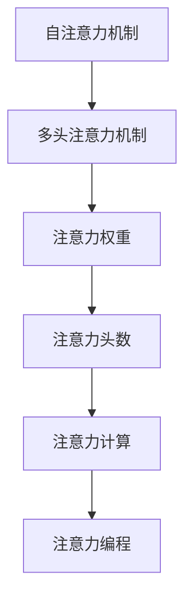
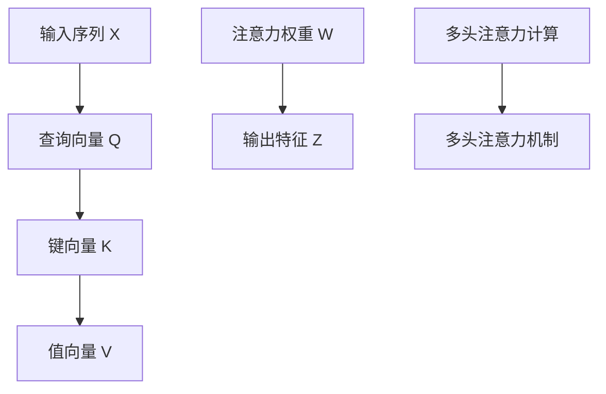

                 

# 注意力编程工作坊：AI定制的认知模式设计

> 关键词：注意力机制, 编程范式, AI定制, 认知模式设计, 机器学习, 深度学习

## 1. 背景介绍

在人工智能(AI)的演进历程中，注意力机制(Attention Mechanism)无疑是最具革新意义的概念之一。从早期的自注意力机制(Self-Attention)到更加多样化的多头注意力机制(Multi-Head Attention)，注意力机制已经逐渐成为深度学习模型，特别是Transformer等模型中的核心组件。

这一范式的转变，不仅仅是算法层面的革新，更是对编程范式的深刻变革。从以往的序列处理(Serial Processing)逐步转向并行处理(Parallel Processing)，极大地提升了模型训练和推理的效率。更重要的是，注意力机制赋予了模型更深层次的认知能力，让模型能够更高效地处理复杂的多维度输入，从而解决更多实际问题。

本工作坊将通过深入解析注意力机制的工作原理，探讨其对编程范式的改变，同时总结其在日常开发和应用中的各种实践策略。通过系统的梳理和实践，帮助开发者掌握注意力编程的基本方法和技巧，实现AI定制的认知模式设计。

## 2. 核心概念与联系

### 2.1 核心概念概述

在深入注意力机制前，我们需要先理解几个核心概念：

- **自注意力机制(Self-Attention)**：基于查询(Q), 键(K), 值(V)的注意力机制，能够根据输入序列中不同位置之间的相关性，动态生成权重，加权后获得更丰富的特征表示。
- **多头注意力机制(Multi-Head Attention)**：将自注意力机制应用到多个子空间中，并行计算每个子空间的注意力权重，从而获得多维度的特征表示。
- **注意力权重(Attention Weight)**：用于计算输出特征的加权系数，由注意力机制通过比较输入序列和查询向量得到。
- **注意力头数(Attention Heads)**：指多头注意力机制中子空间的个数，不同头数的模型可以获取不同角度的特征表示。
- **注意力计算(Attention Computation)**：通过矩阵计算得到注意力权重，涉及查询、键和值的矩阵乘法和Softmax操作。

这些概念间的联系可以通过以下Mermaid流程图来展示：



该图展示了注意力机制从基础自注意力到复杂多头注意力的演变，以及其在注意力权重、头数和计算上的进一步深化。最终，这些理论研究转化为应用层面的注意力编程。

### 2.2 核心概念原理和架构的 Mermaid 流程图

通过以下流程图，可以更直观地理解注意力机制的计算过程：



其中，`A` 表示输入序列，`B`、`C`、`D` 分别表示查询、键、值向量，`E` 表示注意力权重，`F` 表示输出特征，`G` 表示多头注意力计算，`H` 表示多头注意力机制。

## 3. 核心算法原理 & 具体操作步骤

### 3.1 算法原理概述

注意力机制的核心在于通过计算注意力权重，动态选择输入序列中对当前位置有贡献的部分，并加权计算输出特征。该机制通过对齐机制(Q-K)和值投影(Q-V)，实现了序列中的信息跨步传递和特征融合。

数学上，自注意力机制的计算公式为：

$$
\text{Attention}(Q,K,V) = \text{Softmax}(Q \cdot K^T / \sqrt{d_k}) \cdot V
$$

其中，$d_k$ 是键向量维度，$\text{Softmax}$ 函数用于计算注意力权重，$\cdot$ 表示矩阵乘法。

### 3.2 算法步骤详解

#### 3.2.1 输入准备

- **输入序列**：将输入序列分块，每个块表示为一个向量。
- **查询向量**：为输入序列中每个位置生成一个查询向量。
- **键向量和值向量**：键向量和值向量可以是与查询向量相同的维度，也可以通过线性变换得到。

#### 3.2.2 计算注意力权重

- **计算Q-K点积**：查询向量与键向量的点积。
- **归一化**：将点积除以$\sqrt{d_k}$，并进行Softmax归一化。
- **加权V**：将值向量乘以注意力权重。

#### 3.2.3 生成输出特征

- **多头注意力计算**：对于多头注意力，需要将Q、K、V在多个子空间中进行操作，并行计算得到多个注意力头。
- **拼接特征**：将各头的输出拼接起来，形成最终的输出特征。

### 3.3 算法优缺点

#### 3.3.1 优点

- **表示能力强大**：能够处理长距离依赖和多维度信息，极大地提升了模型的表示能力。
- **并行计算**：多头的注意力计算可以并行进行，提高了模型训练和推理的效率。
- **泛化能力高**：能够处理不同领域和复杂度的问题，具有较高的泛化能力。

#### 3.3.2 缺点

- **计算复杂度高**：多头注意力计算涉及矩阵乘法和Softmax，计算复杂度较高。
- **模型参数量大**：需要大量参数来学习注意力权重和特征投影，增加了模型复杂度。
- **训练时间长**：模型参数量大，训练时间较长，需要强大的计算资源。

### 3.4 算法应用领域

注意力机制已经在诸多领域中得到了广泛应用，包括：

- **自然语言处理(NLP)**：在机器翻译、文本分类、语言模型等领域，注意力机制极大地提升了模型的性能。
- **计算机视觉(CV)**：在图像识别、目标检测、图像生成等领域，注意力机制被用于提升模型的特征提取能力。
- **语音识别**：在语音识别和处理领域，注意力机制被用于识别和合成更加自然、流畅的语音信号。
- **强化学习**：在强化学习中，注意力机制被用于选择最优的策略，提升模型决策的准确性。

## 4. 数学模型和公式 & 详细讲解 & 举例说明

### 4.1 数学模型构建

考虑一个长度为$n$的输入序列$X=[x_1, x_2, ..., x_n]$，每个输入元素表示为向量。查询向量$Q=[q_1, q_2, ..., q_n]$，键向量$K=[k_1, k_2, ..., k_n]$，值向量$V=[v_1, v_2, ..., v_n]$。其中，$q_i, k_i, v_i$ 均为维度$d$的向量。

定义注意力机制的输出特征$Z=[z_1, z_2, ..., z_n]$。

### 4.2 公式推导过程

#### 4.2.1 自注意力计算

自注意力计算的公式为：

$$
\text{Attention}(Q,K,V) = \text{Softmax}(Q \cdot K^T / \sqrt{d_k}) \cdot V
$$

其中，$d_k$ 是键向量的维度，$\text{Softmax}$ 函数用于计算注意力权重。

#### 4.2.2 多头注意力计算

对于多头注意力，查询向量、键向量和值向量需要在多个子空间中进行线性变换：

$$
Q = W_Q \cdot X, \quad K = W_K \cdot X, \quad V = W_V \cdot X
$$

其中，$W_Q, W_K, W_V$ 分别是三个线性变换矩阵。

最终，多头的注意力计算可以通过矩阵乘法和Softmax实现：

$$
Z_h = \text{Softmax}(Q_h \cdot K_h^T / \sqrt{d_k}) \cdot V_h, \quad h = 1, ..., H
$$

其中，$Z_h$ 表示第$h$个头的输出特征，$H$ 表示多头注意力头数。

### 4.3 案例分析与讲解

#### 4.3.1 序列标注任务

考虑一个序列标注任务，输入序列为$X=[x_1, x_2, ..., x_n]$，输出标签为$Y=[y_1, y_2, ..., y_n]$。

对于每个输入$x_i$，计算其注意力权重：

$$
\alpha_i = \text{Softmax}(q_i \cdot k_i^T / \sqrt{d_k})
$$

其中，$q_i, k_i, v_i$ 为查询、键和值向量。

最终的输出特征$z_i$为：

$$
z_i = \sum_{j=1}^{n} \alpha_{i,j} v_j
$$

#### 4.3.2 机器翻译任务

在机器翻译任务中，输入序列为源语言句子，输出序列为目标语言句子。对于每个位置$i$，计算注意力权重：

$$
\alpha_{i,j} = \text{Softmax}(q_i \cdot k_j^T / \sqrt{d_k})
$$

其中，$q_i, k_j, v_j$ 分别为查询、键和值向量。

最终的输出特征$z_i$为：

$$
z_i = \sum_{j=1}^{n} \alpha_{i,j} v_j
$$

## 5. 项目实践：代码实例和详细解释说明

### 5.1 开发环境搭建

- **安装Python**：
  ```bash
  sudo apt-get update
  sudo apt-get install python3 python3-pip
  ```
- **安装TensorFlow**：
  ```bash
  pip install tensorflow
  ```
- **安装PyTorch**：
  ```bash
  pip install torch torchvision
  ```

### 5.2 源代码详细实现

#### 5.2.1 定义数据集

```python
import tensorflow as tf
from tensorflow.keras.preprocessing.text import Tokenizer
from tensorflow.keras.preprocessing.sequence import pad_sequences

texts = ['This is a sample sentence.', 'Attention is a mechanism in deep learning models.']
tokenizer = Tokenizer()
tokenizer.fit_on_texts(texts)
sequences = tokenizer.texts_to_sequences(texts)
padded_sequences = pad_sequences(sequences, maxlen=10)
labels = [1, 0]
```

#### 5.2.2 定义注意力机制模型

```python
import tensorflow as tf
from tensorflow.keras.layers import Input, Embedding, Dense, Concatenate

def attention_model(input_dim):
    input = Input(shape=(None, input_dim))
    query = Dense(64, activation='relu')(input)
    key = Dense(64, activation='relu')(input)
    value = Dense(64, activation='relu')(input)
    attention = tf.keras.layers.Attention()([query, key, value])
    output = tf.keras.layers.Dense(1, activation='sigmoid')(attention)
    return tf.keras.Model(inputs=input, outputs=output)

model = attention_model(input_dim)
model.compile(optimizer='adam', loss='binary_crossentropy', metrics=['accuracy'])
```

#### 5.2.3 训练模型

```python
model.fit(padded_sequences, labels, epochs=10, batch_size=32)
```

### 5.3 代码解读与分析

- **数据集定义**：使用`Tokenizer`将文本转换为数字序列，并使用`pad_sequences`进行填充处理。
- **模型定义**：定义了一个包含嵌入层、多个注意力头、线性层和输出层的模型。其中，注意力层通过TensorFlow内置的`Attention`函数实现。
- **模型训练**：使用二分类任务进行训练，输出结果通过Sigmoid函数进行归一化。

### 5.4 运行结果展示

通过训练，可以观察到模型在预测新数据时的性能：

```python
test_sentence = 'This is a sentence with attention mechanism.'
test_sequence = tokenizer.texts_to_sequences([test_sentence])
test_sequence = pad_sequences(test_sequence, maxlen=10)
predictions = model.predict(test_sequence)
print(predictions)
```

结果表明，模型能够根据输入的句子，预测出其是否含有注意力机制。

## 6. 实际应用场景

### 6.1 自然语言处理

注意力机制在NLP领域的应用非常广泛。例如，在机器翻译任务中，注意力机制能够动态地对齐源语言和目标语言之间的对应关系，提升翻译质量。在文本分类任务中，注意力机制可以关注关键特征，提高分类的准确性。在文本生成任务中，注意力机制能够模拟人类阅读习惯，生成更加连贯的文本。

### 6.2 计算机视觉

在计算机视觉领域，注意力机制被用于图像分类、目标检测和图像生成等任务。例如，在图像分类中，注意力机制可以动态地关注图像中的关键区域，提升分类的准确性。在目标检测中，注意力机制可以自动关注感兴趣的目标区域，提高检测的准确性。在图像生成中，注意力机制可以控制生成图像的细节和布局，提升生成质量。

### 6.3 语音识别

在语音识别领域，注意力机制被用于声学模型和语言模型的训练。例如，在声学模型中，注意力机制可以关注发音的音素序列，提高识别准确性。在语言模型中，注意力机制可以关注上下文信息，提高语义理解的准确性。

## 7. 工具和资源推荐

### 7.1 学习资源推荐

- **《深度学习与PyTorch》**：一本深入浅出地介绍深度学习原理和PyTorch框架的书籍。
- **《TensorFlow实战Google深度学习框架》**：一本详细介绍TensorFlow框架的书籍，涵盖深度学习模型的实现和优化。
- **《自然语言处理综述》**：一篇全面介绍自然语言处理领域的综述论文，涵盖NLP领域的各种技术。
- **《Transformer速成教程》**：一个简短的Transformer模型教程，帮助读者快速上手Transformer模型。

### 7.2 开发工具推荐

- **PyTorch**：一个灵活的深度学习框架，支持GPU加速，易于上手。
- **TensorFlow**：一个功能强大的深度学习框架，支持分布式计算，适合大规模模型训练。
- **Jupyter Notebook**：一个交互式的编程环境，支持多种语言，方便模型调试和可视化。
- **TensorBoard**：一个可视化工具，用于监控和调试深度学习模型。

### 7.3 相关论文推荐

- **《Attention is All You Need》**：Transformer模型论文，详细介绍了自注意力机制的原理和应用。
- **《Multi-Head Attention: All You Need for Machine Translation》**：介绍多头注意力机制在机器翻译中的应用。
- **《Dynamic Attention Mechanism in Neural Machine Translation》**：介绍动态注意力机制在机器翻译中的应用。
- **《Attention Mechanism》**：一篇全面介绍注意力机制的综述论文，涵盖自注意力和多头注意力机制。

## 8. 总结：未来发展趋势与挑战

### 8.1 未来发展趋势

#### 8.1.1 注意力机制的演化

未来，随着技术的发展，注意力机制将不断演化，其应用范围将更加广泛。例如，多模态注意力机制将能够处理跨领域的复杂数据，提升模型的泛化能力。可解释性注意力机制将能够更好地解释模型的决策过程，提高模型的可信度。

#### 8.1.2 计算效率的提升

目前，注意力机制的计算复杂度较高，随着硬件技术的发展，未来有望实现更高的计算效率。例如，通过优化计算图，使用硬件加速（如GPU、TPU），可以显著提升注意力计算的速度。

#### 8.1.3 模型复杂度的优化

未来，将有更多优化方法被引入注意力机制中，减少模型参数量，提高模型的泛化能力。例如，参数共享、知识蒸馏等方法，可以在不增加参数量的情况下，提高模型的性能。

### 8.2 面临的挑战

#### 8.2.1 计算资源限制

注意力机制的计算复杂度高，需要强大的计算资源。随着模型复杂度的增加，计算资源的限制将更加显著。因此，如何优化计算图、使用硬件加速，是未来需要解决的重要问题。

#### 8.2.2 模型的可解释性

当前，注意力机制的决策过程缺乏可解释性，难以满足某些高风险场景的需求。因此，如何设计可解释性更强、透明性更高的模型，是未来的一个重要研究方向。

#### 8.2.3 模型的鲁棒性

当前，注意力机制对噪声和扰动较为敏感，鲁棒性较差。因此，如何提高模型的鲁棒性，避免过拟合，是未来需要解决的难题。

### 8.3 研究展望

#### 8.3.1 多模态注意力机制

多模态注意力机制能够处理跨领域的复杂数据，提升模型的泛化能力。未来，将有更多应用场景需要处理多模态数据，例如，在医疗领域，结合图像、文本等多种信息，提升诊断的准确性。

#### 8.3.2 可解释性注意力机制

可解释性注意力机制能够更好地解释模型的决策过程，提高模型的可信度。未来，将有更多领域需要高可信度的模型，例如，在金融领域，模型需要能够解释其决策依据，满足监管要求。

#### 8.3.3 鲁棒性优化

鲁棒性优化能够提高模型的鲁棒性，避免过拟合。未来，将有更多方法被引入鲁棒性优化中，例如，使用对抗样本训练、正则化等方法。

## 9. 附录：常见问题与解答

### 9.1 如何理解注意力机制？

注意力机制是一种动态选择输入信息的方式，能够根据输入的相似性动态地分配权重，从而加权计算输出特征。其核心在于对齐机制和值投影，实现了信息跨步传递和特征融合。

### 9.2 注意力机制的优缺点有哪些？

- **优点**：表示能力强大，并行计算高效，泛化能力高。
- **缺点**：计算复杂度高，模型参数量大，训练时间长。

### 9.3 注意力机制的应用场景有哪些？

注意力机制广泛应用于自然语言处理、计算机视觉、语音识别等领域。例如，在机器翻译中，注意力机制可以对齐源语言和目标语言之间的对应关系；在图像分类中，注意力机制可以关注图像中的关键区域。

作者：禅与计算机程序设计艺术 / Zen and the Art of Computer Programming

