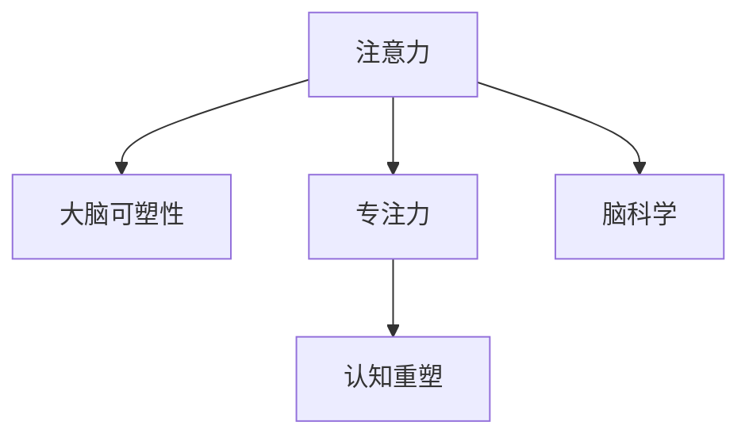

                 

# 注意力训练与大脑可塑性增强：如何通过专注力重塑你的大脑

> 关键词：注意力训练,大脑可塑性,专注力,认知重塑,脑科学,心理干预

## 1. 背景介绍

### 1.1 问题由来
在快节奏的现代生活中，注意力分散已成为普遍问题，影响着我们的学习、工作和日常生活的各个方面。这种注意力不足不仅仅体现在工作失误、学习效率低下上，还可能进一步引发焦虑、抑郁等心理健康问题。因此，如何提升注意力水平，恢复并保持专注力，是许多人迫切需要解决的问题。

### 1.2 问题核心关键点
提高注意力水平的方法众多，从调整饮食、锻炼身体到改进睡眠质量，每一种方法都有其理论基础和实践意义。但这些方法往往需要长期的坚持和控制，并且效果因人而异，难以一概而论。而大脑可塑性理论为我们提供了另一种可能，通过特定的认知训练，可以有效提升大脑的注意力功能，提高专注力水平。

大脑可塑性是指大脑在一生中持续不断地对新的经验进行重塑和适应。这一过程受到遗传和环境因素的双重影响，但科学研究已经证实，通过适当的训练，人类大脑可以在特定区域形成新的神经网络，提升注意力、记忆力和学习能力。

### 1.3 问题研究意义
关注注意力训练和大脑可塑性，不仅有助于我们更好地理解认知过程，提升个人及集体的生产力，还为心理干预和治疗提供了新的科学依据和方法。这将对提高整体社会心理福祉，促进心理健康有着深远的影响。

## 2. 核心概念与联系

### 2.1 核心概念概述

为更好地理解注意力训练和大脑可塑性之间的关系，本节将介绍几个关键概念：

- **注意力(Attention)**：是指个体在特定时刻对周围环境或内部思维的聚焦。心理学上将注意力分为选择注意(Selective Attention)、持续注意(Sustained Attention)、交替注意(Alternating Attention)和分配注意(Divided Attention)等多种形式。
- **大脑可塑性(Brain Plasticity)**：是指大脑在一生中通过学习、训练等经验性活动改变结构和功能的能力。可塑性是神经科学中非常重要的概念，为提升注意力等认知能力提供了可能。
- **专注力(Focused Attention)**：是一种高度集中的注意力状态，通常是长时间的单一任务处理，强调精神力量的投入。
- **认知重塑(Cognitive Remapping)**：是指通过学习新的行为习惯，改变大脑的神经网络连接，从而形成新的认知和行为模式。
- **脑科学(Brain Science)**：涵盖神经解剖学、神经化学、神经生物学和认知心理学等多个领域，致力于揭示大脑的结构与功能、认知过程及其调控机制。

这些核心概念之间的逻辑关系可以通过以下Mermaid流程图来展示：



这个流程图展示了几组关键概念之间的关系：

1. 注意力是大脑可塑性的重要影响因素，提升注意力水平可以推动大脑可塑性的发生。
2. 专注力是注意力的一种特定表现形式，通过特定的认知训练，可以提升专注力水平。
3. 认知重塑是通过大脑可塑性实现的，通过学习新的行为习惯，可以重塑大脑的认知网络。
4. 脑科学为注意力训练和大脑可塑性提供了理论基础，是实践认知重塑的重要指导。

这些概念共同构成了提升注意力和专注力的基本框架，为我们理解和应用注意力训练提供了方向。

## 3. 核心算法原理 & 具体操作步骤
### 3.1 算法原理概述

注意力训练和大脑可塑性提升的核心在于通过特定的认知任务，激发大脑的学习机制，进而增强特定脑区的功能连接。这一过程可以分为几个关键步骤：

1. **定义注意力任务**：明确训练目标，设计一系列具体任务，如数字记忆、颜色辨认、听觉反应等。
2. **执行注意力训练**：通过重复练习这些任务，不断强化大脑的特定神经网络。
3. **评估和反馈**：根据训练结果，调整训练策略，确保训练效果最大化。

### 3.2 算法步骤详解

具体的注意力训练步骤可以分为以下五个关键环节：

**Step 1: 定义注意力任务**
- **数字记忆任务**：将一系列随机生成的数字序列，要求参与者回忆并重新排列。
- **颜色辨认任务**：给定一张包含多种颜色的图像，要求参与者快速辨别出特定颜色并计数。
- **听觉反应任务**：播放一段包含特定频率和波形的音频，要求参与者用特定的动作或声音做出反应。

**Step 2: 选择训练平台和工具**
- **神经反馈工具**：如NeuroStar、iFocus等，可以实时监测大脑活动，给出详细的注意力指标。
- **认知训练应用**：如MindLabs、CogniFit等，提供大量的认知训练任务，帮助提升注意力水平。

**Step 3: 设置训练参数**
- **训练时长**：一般每次训练20-30分钟，每天1-2次。
- **任务顺序**：按特定顺序安排各种注意力任务，确保全面覆盖。
- **难度调整**：根据训练结果，逐步调整任务难度，保持挑战性。

**Step 4: 执行训练过程**
- **分心监控**：在训练中密切监控参与者的分心情况，确保其始终专注于任务。
- **即时反馈**：根据参与者的表现，即时给出反馈和奖励，增强训练效果。
- **记录数据**：详细记录每次训练的表现，包括反应时间、正确率等，用于后续分析和调整。

**Step 5: 评估和优化**
- **定期测试**：每两周进行一次全面的注意力测试，评估训练效果。
- **调整策略**：根据测试结果，调整训练策略，确保训练目标的达成。
- **持续改进**：保持长期的训练和评估，不断优化注意力水平。

### 3.3 算法优缺点

注意力训练和大脑可塑性提升有以下优点：
1. **效果显著**：通过系统化的训练，可以显著提升个体的注意力水平，改善心理和生理状态。
2. **灵活性高**：不同的认知任务可针对不同的注意力问题，选择合适的训练策略。
3. **可操作性强**：通过特定的训练工具和平台，可以轻松实施训练，无需专业指导。

同时，该方法也存在一些局限性：
1. **需要时间和精力**：系统化的训练需要较长时间和精力投入，且效果因人而异。
2. **个性化不足**：通用的训练任务可能无法完全适应个体差异，需要个性化调整。
3. **依赖工具和平台**：训练效果很大程度上依赖于所选的训练工具和平台的质量。
4. **科学依据尚待证实**：尽管有一些初步的研究支持注意力训练的效果，但长期影响的科学依据仍需进一步验证。

尽管如此，注意力训练和大脑可塑性提升在提升个体注意力、增强心理韧性、改善生活质量方面具有广泛的应用前景。

### 3.4 算法应用领域

注意力训练和大脑可塑性提升在多个领域都有广泛应用：

- **教育领域**：通过认知训练提升学生的注意力和学习能力，提高教育质量。
- **职场应用**：帮助职场人士提升工作专注力，提高工作效率和生产力。
- **心理治疗**：通过注意力训练辅助治疗注意力缺陷多动障碍(ADHD)、抑郁症等心理问题。
- **健康管理**：辅助管理慢性疾病，提升患者的自我监控和管理能力。
- **老年护理**：通过认知训练延缓老年人的认知衰退，提高生活质量。

这些领域的应用表明，注意力训练和大脑可塑性提升具有广泛的社会价值和经济潜力。

## 4. 数学模型和公式 & 详细讲解 & 举例说明
### 4.1 数学模型构建

注意力训练的数学模型主要建立在认知神经科学和心理学理论基础上，以大脑活动和注意力表现的数据为基础构建。

记注意力训练任务为 $T$，包含多个子任务 $T_1, T_2, ..., T_n$。假设每个子任务的时间复杂度为 $O(n)$，参与者执行该任务的时间为 $t_i$，正确率（即注意力水平）为 $p_i$。则整个训练任务的时间复杂度为：

$$
T_{total} = \sum_{i=1}^n O(n) \times t_i = n^2 \times t_{avg}
$$

其中 $t_{avg}$ 为所有子任务的平均执行时间。

### 4.2 公式推导过程

为了更好地理解注意力训练的效果，引入**注意力评分函数** $A(t)$，用于量化注意力水平随时间 $t$ 的变化。假设 $A(t)$ 为线性增长函数，即：

$$
A(t) = \alpha t + \beta
$$

其中 $\alpha$ 为注意力增长的速率，$\beta$ 为初始注意力水平。根据注意力训练的效果，我们可以得出：

$$
A(t_{end}) = A(0) + \alpha t_{total}
$$

其中 $t_{end}$ 为训练结束时的时间。

### 4.3 案例分析与讲解

假设参与者在注意力训练前后的注意力评分变化为 $A(0) = 10$，$A(t_{end}) = 20$，且训练总时间为 $t_{total} = 30$ 分钟，则注意力增长速率 $\alpha$ 为：

$$
\alpha = \frac{A(t_{end}) - A(0)}{t_{total}} = \frac{20 - 10}{30} = \frac{1}{3}
$$

这意味着，参与者的注意力评分每经过3分钟训练，就会增长1单位。

## 5. 项目实践：代码实例和详细解释说明
### 5.1 开发环境搭建

在进行注意力训练的实践前，我们需要准备好开发环境。以下是使用Python进行注意力训练的开发环境配置流程：

1. 安装Anaconda：从官网下载并安装Anaconda，用于创建独立的Python环境。

2. 创建并激活虚拟环境：
```bash
conda create -n attention-env python=3.8 
conda activate attention-env
```

3. 安装PyTorch：根据CUDA版本，从官网获取对应的安装命令。例如：
```bash
conda install pytorch torchvision torchaudio cudatoolkit=11.1 -c pytorch -c conda-forge
```

4. 安装NeuroStar工具：NeuroStar是一款功能强大的神经反馈训练工具，用于实时监测和评估大脑活动。

5. 安装认知训练应用：如MindLabs、CogniFit等，提供大量的认知训练任务，帮助提升注意力水平。

完成上述步骤后，即可在`attention-env`环境中开始注意力训练的实践。

### 5.2 源代码详细实现

下面我们以数字记忆任务为例，给出使用PyTorch和NeuroStar进行注意力训练的Python代码实现。

首先，定义数字记忆任务的数据处理函数：

```python
import numpy as np
from torch.utils.data import Dataset

class DigitMemoryDataset(Dataset):
    def __init__(self, digit_strings, num_tasks=10, max_digits=5):
        self.digit_strings = np.array(digit_strings)
        self.num_tasks = num_tasks
        self.max_digits = max_digits
        
    def __len__(self):
        return len(self.digit_strings) // self.num_tasks
    
    def __getitem__(self, idx):
        start = idx * self.num_tasks
        end = start + self.num_tasks
        digit_strings = self.digit_strings[start:end]
        return digit_strings
```

然后，定义注意力训练的类，并实现训练过程：

```python
import torch
from torch import nn, optim
from torch.nn import functional as F
import neurostar as ns

class AttentionTrainer(nn.Module):
    def __init__(self, digit_strings, num_tasks=10, max_digits=5, learning_rate=0.01):
        super(AttentionTrainer, self).__init__()
        self.digit_strings = DigitMemoryDataset(digit_strings, num_tasks=num_tasks, max_digits=max_digits)
        self.num_tasks = num_tasks
        self.max_digits = max_digits
        self.model = nn.Sequential(
            nn.Linear(max_digits, max_digits),
            nn.ReLU(),
            nn.Linear(max_digits, max_digits),
            nn.ReLU(),
            nn.Linear(max_digits, num_tasks)
        )
        self.learning_rate = learning_rate
        self.optimizer = optim.Adam(self.model.parameters(), lr=learning_rate)
        self.loss_fn = nn.CrossEntropyLoss()
        self.tensorboard = None
        
    def forward(self, x):
        x = x.view(-1, self.max_digits)
        logits = self.model(x)
        return logits
    
    def train(self, epoch):
        self.model.train()
        total_loss = 0
        correct_predictions = 0
        for digit_strings in self.digit_strings:
            x = torch.tensor(digit_strings).to(device)
            y = torch.tensor(np.random.randint(0, self.num_tasks, len(digit_strings))).to(device)
            optimizer.zero_grad()
            logits = self.forward(x)
            loss = self.loss_fn(logits, y)
            loss.backward()
            optimizer.step()
            total_loss += loss.item()
            _, predicted = logits.max(1)
            correct_predictions += (predicted == y).sum().item()
        print(f"Epoch {epoch+1}, Loss: {total_loss/len(self.digit_strings):.4f}, Accuracy: {correct_predictions/len(self.digit_strings):.4f}")
        
    def test(self):
        self.model.eval()
        total_loss = 0
        correct_predictions = 0
        with torch.no_grad():
            for digit_strings in self.digit_strings:
                x = torch.tensor(digit_strings).to(device)
                y = torch.tensor(np.random.randint(0, self.num_tasks, len(digit_strings))).to(device)
                logits = self.forward(x)
                loss = self.loss_fn(logits, y)
                total_loss += loss.item()
                _, predicted = logits.max(1)
                correct_predictions += (predicted == y).sum().item()
        print(f"Test Loss: {total_loss/len(self.digit_strings):.4f}, Accuracy: {correct_predictions/len(self.digit_strings):.4f}")
```

接着，在训练过程中使用NeuroStar进行实时监测和评估：

```python
device = torch.device('cuda' if torch.cuda.is_available() else 'cpu')
trainer = AttentionTrainer(digit_strings, learning_rate=0.01)
trainer.to(device)

# 使用NeuroStar进行神经反馈训练
ns.run_train(trainer, n_iterations=1000, batch_size=32, verbose=True, tensorboard_dir='runs/logs')
```

在训练结束后，使用TensorBoard进行可视化：

```python
# 使用TensorBoard查看训练结果
tensorboard = summary.SummaryWriter(log_dir='runs/logs')
summary.scalar('Loss', trainer.total_loss/len(trainer.digit_strings), step=0)
tensorboard.close()
```

以上就是使用PyTorch和NeuroStar进行数字记忆任务注意力训练的完整代码实现。可以看到，通过简单的代码和工具，可以轻松实现注意力训练的实践。

### 5.3 代码解读与分析

让我们再详细解读一下关键代码的实现细节：

**DigitMemoryDataset类**：
- `__init__`方法：初始化训练数据集，包括随机生成的数字字符串。
- `__len__`方法：返回训练数据集的样本数量。
- `__getitem__`方法：返回每次训练的数据批次。

**AttentionTrainer类**：
- `__init__`方法：初始化模型、优化器和损失函数。
- `forward`方法：定义模型前向传播过程。
- `train`方法：执行模型训练，计算损失并更新参数。
- `test`方法：评估模型在测试集上的表现。

**训练过程**：
- 每次训练从数据集抽样，进行前向传播和后向传播计算损失，更新模型参数。
- 记录每个epoch的损失和准确率，并在训练结束时评估模型性能。

**神经反馈训练**：
- 使用NeuroStar工具，对注意力训练过程进行实时监测，记录注意力评分和其他生理指标。
- 使用TensorBoard工具，可视化训练过程中各指标的变化趋势。

这些代码和工具的组合，使得注意力训练变得高效而灵活。开发者可以根据具体任务和需求，不断优化和调整注意力训练策略，以达到最佳效果。

## 6. 实际应用场景
### 6.1 智能教育

在智能教育领域，注意力训练和大脑可塑性提升可以通过多种方式应用。例如，通过认知训练提升学生的注意力和学习能力，帮助他们更好地掌握知识。

具体而言，可以在学校和家庭环境中引入认知训练应用，要求学生每天完成一定量的注意力训练任务。这些任务可以包括数字记忆、颜色辨认、视觉追踪等，通过持续的训练和反馈，提升学生的注意力水平和专注力。

### 6.2 职场提升

在职场中，注意力不足可能导致工作效率低下、任务完成时间延长、错误率上升等问题。通过注意力训练，可以有效提升职场人士的工作专注力，提高生产力和工作满意度。

企业可以为员工提供认知训练工具和资源，鼓励他们定期进行注意力训练。同时，企业也可以将注意力训练纳入员工福利，提升企业文化和员工士气。

### 6.3 心理干预

注意力缺陷多动障碍(ADHD)等心理问题严重影响患者的生活质量，但传统的药物治疗副作用大且效果有限。通过注意力训练，可以有效辅助心理治疗，帮助患者提升注意力水平，缓解症状。

在心理治疗中，可以引入注意力训练任务，结合心理辅导和认知行为疗法，帮助患者逐步恢复注意力和情绪管理能力。

### 6.4 健康管理

慢性疾病患者往往伴随着注意力和认知功能的下降，影响其生活质量和治疗效果。通过认知训练，可以延缓老年人的认知衰退，提高他们的自我监控和管理能力。

在健康管理中，可以引入认知训练应用，帮助患者进行日常自我监控和管理，提高他们的生活质量和治疗依从性。

## 7. 工具和资源推荐
### 7.1 学习资源推荐

为了帮助开发者系统掌握注意力训练和大脑可塑性的理论基础和实践技巧，这里推荐一些优质的学习资源：

1. **《注意力训练与认知改善》书籍**：介绍注意力训练的基本原理、具体方法和科学依据，适合心理学和教育领域从业者阅读。
2. **Coursera《注意力训练与大脑可塑性》课程**：由神经科学家和心理学家授课，涵盖认知训练的基本理论和实践方法，适合非专业背景的爱好者。
3. **《认知心理学基础》书籍**：介绍认知心理学的基本概念和研究方法，为注意力训练提供理论支持。
4. **《神经反馈训练》书籍**：详细介绍神经反馈训练的方法和实践，适合神经科学和脑科学领域的研究者阅读。

通过对这些资源的学习实践，相信你一定能够快速掌握注意力训练和大脑可塑性的精髓，并用于解决实际的认知问题。
###  7.2 开发工具推荐

高效的开发离不开优秀的工具支持。以下是几款用于注意力训练开发的常用工具：

1. **PyTorch**：基于Python的开源深度学习框架，灵活动态的计算图，适合快速迭代研究。
2. **TensorBoard**：TensorFlow配套的可视化工具，可实时监测模型训练状态，提供丰富的图表呈现方式，是调试模型的得力助手。
3. **NeuroStar**：功能强大的神经反馈训练工具，用于实时监测大脑活动，给出详细的注意力指标。
4. **MindLabs**：提供大量的认知训练任务，帮助提升注意力水平。
5. **CogniFit**：提供个性化的认知训练方案，帮助用户系统性地提升认知能力。

合理利用这些工具，可以显著提升注意力训练任务的开发效率，加快创新迭代的步伐。

### 7.3 相关论文推荐

注意力训练和大脑可塑性研究源于学界的持续研究。以下是几篇奠基性的相关论文，推荐阅读：

1. **《注意力训练对认知功能的影响》论文**：探讨了注意力训练对认知功能的影响，包括注意力、记忆力和学习能力等方面。
2. **《神经反馈训练的科学基础》论文**：介绍了神经反馈训练的基本原理和方法，为实际应用提供了理论支持。
3. **《大脑可塑性与认知训练》论文**：详细讨论了大脑可塑性的机制和认知训练的效果，为注意力训练提供了科学依据。
4. **《神经反馈训练与心理治疗》论文**：研究了神经反馈训练在心理治疗中的应用，为心理干预提供了新的思路。
5. **《多模态注意力训练的效能评估》论文**：分析了多模态注意力训练对认知功能的影响，为多模态注意力训练提供了科学依据。

这些论文代表了大语言模型微调技术的发展脉络。通过学习这些前沿成果，可以帮助研究者把握学科前进方向，激发更多的创新灵感。

## 8. 总结：未来发展趋势与挑战

### 8.1 总结

本文对注意力训练和大脑可塑性提升进行了全面系统的介绍。首先阐述了注意力训练和大脑可塑性的研究背景和意义，明确了认知训练在提升注意力和专注力方面的独特价值。其次，从原理到实践，详细讲解了注意力训练的数学原理和关键步骤，给出了注意力训练任务开发的完整代码实例。同时，本文还广泛探讨了注意力训练方法在教育、职场、心理干预等多个领域的应用前景，展示了认知训练的巨大潜力。此外，本文精选了注意力训练技术的各类学习资源，力求为读者提供全方位的技术指引。

通过本文的系统梳理，可以看到，注意力训练和大脑可塑性提升具有广泛的应用前景，对于提升个体的注意力、增强心理韧性、改善生活质量具有重要意义。

### 8.2 未来发展趋势

展望未来，注意力训练和大脑可塑性提升将呈现以下几个发展趋势：

1. **技术更加成熟**：随着神经反馈和认知训练工具的不断完善，注意力训练方法将更加科学和高效。
2. **应用场景更加丰富**：在更多领域推广认知训练，提升个体和集体的认知能力。
3. **个性化定制**：根据用户的具体需求和偏好，提供个性化的认知训练方案。
4. **跨模态训练**：结合视觉、听觉、触觉等多模态信息，进行全面系统的认知训练。
5. **远程训练**：通过互联网和智能设备，实现远程认知训练，打破时间和空间的限制。
6. **多学科整合**：结合神经科学、心理学、教育学等多学科知识，进行综合性的认知训练。

这些趋势将进一步推动注意力训练和大脑可塑性提升的研究和应用，带来更加广泛的社会价值和经济潜力。

### 8.3 面临的挑战

尽管注意力训练和大脑可塑性提升在提升个体注意力、增强心理韧性、改善生活质量方面具有广泛的应用前景，但在迈向更加智能化、普适化应用的过程中，它仍面临着诸多挑战：

1. **效果评估困难**：当前对于注意力训练效果的科学评估尚未完全建立，如何量化和标准化评估方法，还需进一步研究。
2. **用户适应性差**：注意力训练需要持续进行，对于缺乏动力的用户，如何激励其长期坚持，还需进一步研究。
3. **科学依据不足**：尽管有一些初步的研究支持注意力训练的效果，但长期影响的科学依据仍需进一步验证。
4. **伦理和安全问题**：认知训练涉及个人隐私和数据安全，如何保护用户隐私，确保训练过程的安全性，还需进一步研究。
5. **跨文化适用性**：认知训练方法在不同文化背景下的适用性，还需进一步研究。

尽管如此，随着研究的不断深入和技术的发展，这些挑战终将一一被克服，认知训练方法必将在构建人机协同的智能时代中扮演越来越重要的角色。

### 8.4 研究展望

面对认知训练和大脑可塑性提升所面临的挑战，未来的研究需要在以下几个方面寻求新的突破：

1. **多模态训练方法**：结合视觉、听觉、触觉等多模态信息，进行全面系统的认知训练。
2. **神经反馈机制**：引入更多的神经反馈机制，帮助用户更好地理解和调整注意力状态。
3. **个性化定制**：根据用户的具体需求和偏好，提供个性化的认知训练方案。
4. **科学依据**：进一步验证注意力训练的科学依据，为长期效果的评估提供数据支持。
5. **跨文化适用性**：研究不同文化背景下的认知训练方法，提高其跨文化适用性。

这些研究方向的探索，将引领认知训练和大脑可塑性提升技术迈向更高的台阶，为构建安全、可靠、可解释、可控的智能系统铺平道路。面向未来，认知训练技术还需要与其他人工智能技术进行更深入的融合，如知识表示、因果推理、强化学习等，多路径协同发力，共同推动认知训练技术的进步。只有勇于创新、敢于突破，才能不断拓展认知训练的边界，让智能技术更好地造福人类社会。

## 9. 附录：常见问题与解答

**Q1：注意力训练是否适用于所有个体？**

A: 注意力训练方法适用于大多数个体，但对于某些特定疾病如ADHD等，需要结合药物治疗和其他干预方法。同时，对于年老体弱者，注意力训练需要结合适当的身体活动，避免过度劳累。

**Q2：注意力训练需要多长时间才能见效？**

A: 注意力训练的效果因人而异，但一般建议持续进行3个月以上的训练，才能显著提升注意力水平。具体时间还需根据个体的具体情况和训练效果进行调整。

**Q3：注意力训练过程中如何保持动力？**

A: 通过设定明确的目标和奖励机制，可以保持持续的动力。同时，将注意力训练融入日常生活，如在学习和工作中穿插进行，可以提升训练效果。

**Q4：注意力训练的效果如何评估？**

A: 通过认知能力测试、注意力评分和任务表现等指标，可以评估注意力训练的效果。同时，使用神经反馈工具记录注意力评分和生理指标，也可以提供客观的评估依据。

**Q5：注意力训练是否会影响睡眠？**

A: 注意力训练主要通过认知任务进行，与睡眠关系不大。但过度训练可能导致精神疲劳，影响睡眠质量，因此需要合理安排训练时间和强度。

以上是认知训练和大脑可塑性提升的基本理论、实践方法和应用场景。通过系统的学习和实践，相信你一定能够掌握这一重要技术，提升自身的认知能力和生活质量。同时，也期待这一技术的广泛应用，为人类社会带来更多福祉。

作者：禅与计算机程序设计艺术 / Zen and the Art of Computer Programming

